# XSS新攻击的深入剖析：新场景利用与系统化防御策略-先知社区

> **来源**: https://xz.aliyun.com/news/17227  
> **文章ID**: 17227

---

# XSS新攻击的深入剖析：新场景利用与系统化防御策略

## 前言

xss挖掘难道还停留在分三种基础类型？其实xss还有更多的隐藏在其他场景中的，这些一般都是容易忽略的，下面详细分析分析，从代码层面也会讲解漏洞原因，还有目前xss的各种修复手法

### 其他常见的场景

#### 模板渲染

有去看过一些 cms，确实是这样的，比如模板的特殊标签

th:text 用于展示纯文本，会对特殊字符进行转义  
th:utext 则不进行转义，直接展示原始 HTML 内容  
当获取后端传来的参数中带有 HTML 标签时，th:text 不会解析这些标签，而 th:utext 会解析并渲染它们。这类似于 Vue 中的 v-text 和 v-html

```
public String handleTemplateInjection(String content,String type, Model model) {
    if ("html".equals(type)) {
        model.addAttribute("html", content);
    } else if ("text".equals(type)) {
        model.addAttribute("text", content);
    }
    return "vul/xss/other";
}

<div class="layui-card-body layui-text layadmin-text" style="color: red;font-size: 15px;">
        <p th:utext="${html}"></p>
        <p th:text="${text}"></p>
</div>

```

这个规范一下就 ok 了

#### 文件上传 xss

src 中经常遇到的就是 svg ，html，xml，pdf 没有危害就不管了

我们只需要关注一下文件应该怎么写，这个才是重点

**html** 就很简单,就是插入我们的脚本就 ok

```
<!DOCTYPE html>
<html lang="en">
<head>
    <meta charset="UTF-8">
    <title>HTML类型</title>
</head>
<body>
  <h1>可上传HTML类型文件导致XSS!</h1>
  <script>alert(document.cookie)</script>
</body>
</html>

```

**svg**

```
<?xml version="1.0" encoding="UTF-8" standalone="no"?>
<!DOCTYPE svg PUBLIC "-//W3C//DTD SVG 1.1//EN" "http://www.w3.org/Graphics/SVG/1.1/DTD/svg11.dtd">
<svg version="1.1" id="Layer_1" xmlns="http://www.w3.org/2000/svg" xmlns:xlink="http://www.w3.org/1999/xlink" x="0px" y="0px" width="100px" height="100px" viewBox="0 0 751 751" enable-background="new 0 0 751 751" xml:space="preserve">  <image id="image0" width="751" height="751" x="0" y="0"
    href="data:image/png;base64,iVBORw0KGgoAAAANSUhEUgAAAu8AAALvCAIAAABa4bwGAAAAIGNIUk0AAHomAACAhAAA+gAAAIDo" />
    <script>alert(document.cookie)</script>
</svg>

```

svg 可以 xss 的原因就是因为可以解析 script 标签

**xml**

```
<data>
    <message>This is a &lt;script&gt;alert('XSS')&lt;/script&gt; payload</message>
</data>

```

这个比较鸡肋，需要解析 xml 才可以，我觉得最常用的就是 svg 了

#### 组件漏洞

##### JQuery-XSS 漏洞

```
<head>
  <meta charset="utf-8">
  <title>jQuery XSS Examples (CVE-2020-11022/CVE-2020-11023)</title>
  <!-- 测试JQuery -->
  <script src="/lib/jquery-1.6.1.js"></script>
  <!-- <script src="./jquery.min.js"></script> -->
</head>

```

CVE-2020-11022/CVE-2020-11023

CVE-2020-11022 和 CVE-2020-11023 是 jQuery 的两个跨站脚本（XSS） 漏洞，影响 jQuery 1.2 - 3.5.0 版本，主要与 html() 方法有关。

CVE-2020-11022

影响 $().html() 方法  
允许攻击者通过不受信任的 HTML 代码执行恶意 JavaScript 代码  
例如，插入 script、iframe、onerror 等危险标签绕过安全检查  
CVE-2020-11023

影响 $().html() 方法在 SVG 元素中处理不当  
允许攻击者注入恶意 JavaScript，导致 XSS

比如

```
<div id="content"></div>
<script>
    var userInput = '';
    $("#content").html(userInput); // 🚨 直接插入，存在漏洞
</script>

```

然后下一个 cve 就是绕过

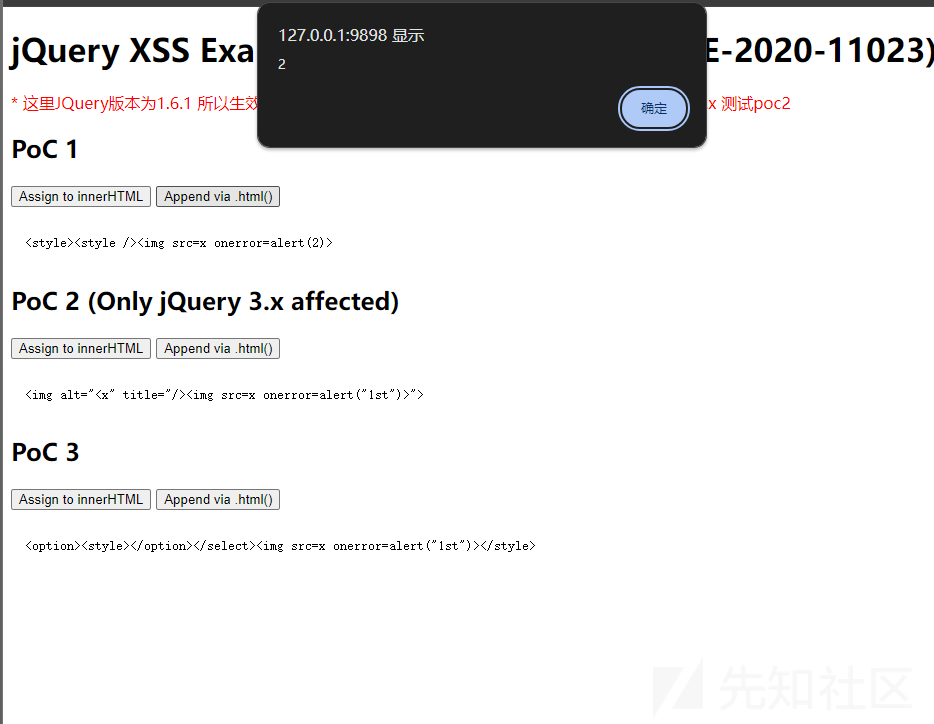

##### Swagger UI XSS 漏洞（CVE-2023-38418）

```
<!--swagger依赖-->
<dependency>
    <groupId>io.springfox</groupId>
    <artifactId>springfox-boot-starter</artifactId>
    <version>3.0.0</version>	// 该版本存在xss
</dependency>

```

API 文档的 description、operationId、summary、contact 等字段可被插入恶意 HTML/JavaScript 代码  
Swagger UI 在渲染这些字段时未对 HTML 进行适当的转义

比如

```
{
  "openapi": "3.0.0",
  "info": {
    "title": "Swagger XSS",
    "version": "1.0.0",
    "description": "<script>alert('XSS')</script>"
  }
}

```

作者使用的就比较复杂了  
最后是在远程文件<https://jumpy-floor.surge.sh/test.yaml>

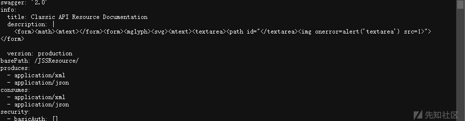

所以需要等待一会才会弹出

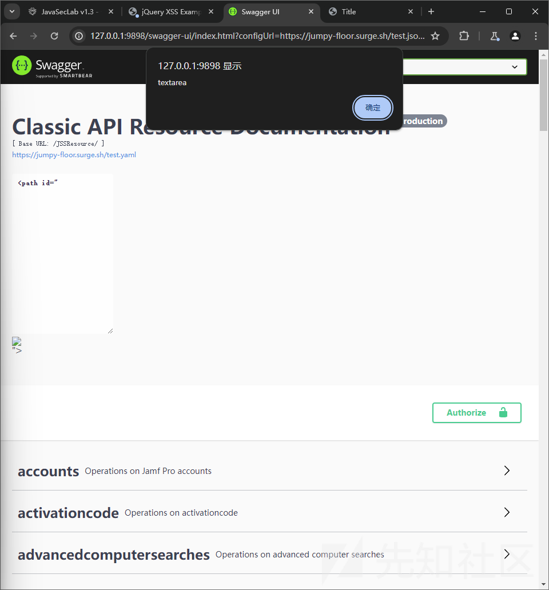

### 漏洞代码修复

#### 白名单

```
// 对用户输入的数据进行验证和过滤，确保不包含恶意代码。使用白名单过滤，只允许特定类型的输入，如纯文本或指定格式的数据
// 前端校验代码
var whitelistRegex = /^[a-zA-Z0-9_\s]+$/;

// 检查输入值是否符合白名单要求
if (!whitelistRegex.test(value)) {
    layer.msg('输入内容包含非法字符，请检查输入', {icon: 2, offset: '10px'});
    return false; // 取消表单提交
    } else {
        // 正常发送请求
    }

// 后端校验代码
private static final String WHITELIST_REGEX = "^[a-zA-Z0-9_\s]+$";
private static final Pattern pattern = Pattern.compile(WHITELIST_REGEX);

Matcher matcher = pattern.matcher(content);
if (matcher.matches()){
    return R.ok(content);
}else return R.error("输入内容包含非法字符，请检查输入");
```

xss 的本质就是需要各种标签去解析，如果我们不能输入标签，那么就可以阻止 xss

我们只能输入字母、数字、下划线和空格

###### 前端

但是我们如果仅仅只是前端过滤的话，任然可以被绕过，这在 src 中很常见  
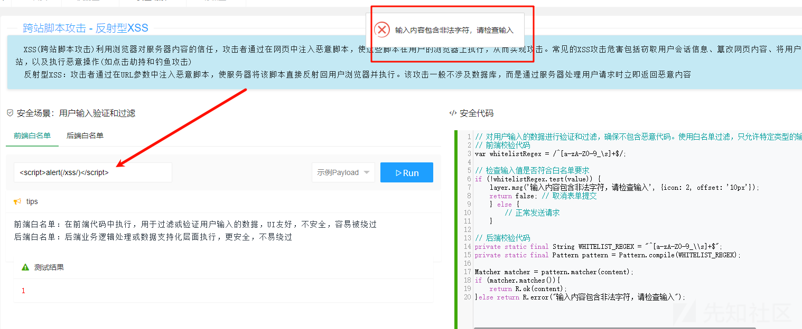

我们输入一个 1 然后抓包

然后再修改我们的 payload

```
GET /xss/reflect/safe1?content=%3c%73%63%72%69%70%74%3e%61%6c%65%72%74%28%2f%78%73%73%2f%29%3c%2f%73%63%72%69%70%74%3e&type=frontEnd&_=1738825573547 HTTP/1.1
Host: 127.0.0.1:9898
sec-ch-ua: "Chromium";v="125", "Not.A/Brand";v="24"
Accept: */*
Content-Type: application/x-www-form-urlencoded;charset=UTF-8
X-Requested-With: XMLHttpRequest
sec-ch-ua-mobile: ?0
User-Agent: Mozilla/5.0 (Windows NT 10.0; Win64; x64) AppleWebKit/537.36 (KHTML, like Gecko) Chrome/125.0.6422.112 Safari/537.36
sec-ch-ua-platform: "Windows"
Sec-Fetch-Site: same-origin
Sec-Fetch-Mode: cors
Sec-Fetch-Dest: empty
Referer: http://127.0.0.1:9898/xss/reflect/safe
Accept-Encoding: gzip, deflate, br
Accept-Language: zh-CN,zh;q=0.9
Cookie: USER_ID_ANONYMOUS=97269975b0004387b7443950946b97a8; DETECTED_VERSION=5.2.0; MAIN_MENU_COLLAPSE=false; DG_USER_ID_ANONYMOUS=e5dbe5efa486485aa7d6260b97b1fe1d; JSESSIONID=E6B03C38C24E570648FC87997AAB56B4
Connection: keep-alive


```

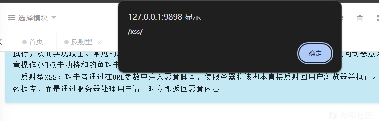

所以开发的时候我们需要在后端写我们的过滤逻辑

###### 后端

如果过滤在后端，无论我们是抓包还是前端输入，都会被拦截

即使我们使用 bp

```
GET /xss/reflect/safe1?content=%3Cscript%3Ealert(%2Fxss%2F)%3C%2Fscript%3E&type=backEnd&_=1738825573552 HTTP/1.1
Host: 127.0.0.1:9898
sec-ch-ua: "Chromium";v="125", "Not.A/Brand";v="24"
Accept: */*
Content-Type: application/x-www-form-urlencoded;charset=UTF-8
X-Requested-With: XMLHttpRequest
sec-ch-ua-mobile: ?0
User-Agent: Mozilla/5.0 (Windows NT 10.0; Win64; x64) AppleWebKit/537.36 (KHTML, like Gecko) Chrome/125.0.6422.112 Safari/537.36
sec-ch-ua-platform: "Windows"
Sec-Fetch-Site: same-origin
Sec-Fetch-Mode: cors
Sec-Fetch-Dest: empty
Referer: http://127.0.0.1:9898/xss/reflect/safe
Accept-Encoding: gzip, deflate, br
Accept-Language: zh-CN,zh;q=0.9
Cookie: USER_ID_ANONYMOUS=97269975b0004387b7443950946b97a8; DETECTED_VERSION=5.2.0; MAIN_MENU_COLLAPSE=false; DG_USER_ID_ANONYMOUS=e5dbe5efa486485aa7d6260b97b1fe1d; JSESSIONID=E6B03C38C24E570648FC87997AAB56B4
Connection: keep-alive
```

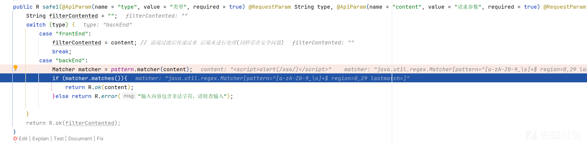

可以看到还是需要进行数据的过滤  
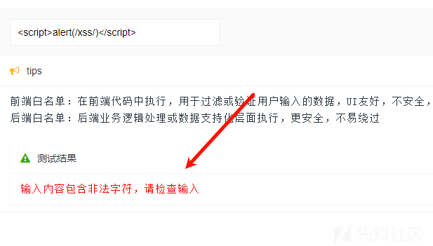

#### CSP 策略

内容安全策略(CSP：Content Security Policy)是一种由浏览器实施的安全机制(可理解为额外的安全层)，旨在减少和防范跨站脚本攻击等安全威胁  
 核心原理：网站通过发送一个 CSP header 头部(也可以在 html 直接设置)，告诉浏览器具体的策略(什么是授权的与什么是被禁止的)，从而防止恶意内容的加载和执行  
 CSP 指令说明：  
 default-src: 指定默认的加载内容的来源，如果未指定其他指令，则默认应用此指令  
 script-src: 指定允许加载 JavaScript 的来源  
 style-src: 指定允许加载样式表的来源  
 img-src: 指定允许加载图片的来源  
 connect-src: 指定允许向其发送请求的来源(例如 AJAX、WebSocket 连接等)

安全代码

```
// 内容安全策略（Content Security Policy）是一种由浏览器实施的安全机制，旨在减少和防范跨站脚本攻击（XSS）等安全威胁。它通过允许网站管理员定义哪些内容来源是可信任的，从而防止恶意内容的加载和执行
// 前端Meta配置
<meta http-equiv="Content-Security-Policy" content="default-src 'self'; script-src 'self' https://apis.example.com; style-src 'self' https://fonts.googleapis.com; img-src 'self' data: https://*.example.com;">


// 后端Header配置
public String safe2(String content,HttpServletResponse response) {
    response.setHeader("Content-Security-Policy","default-src self");
    return content;
}
```

我们重点关注 csp 的限制

限制所有资源（脚本、样式、图片等）只能来自同源（self），不允许外部来源的资源加载。

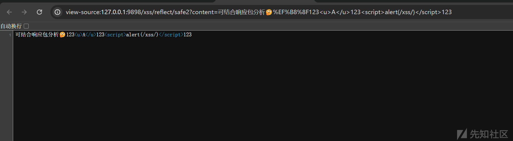

然后

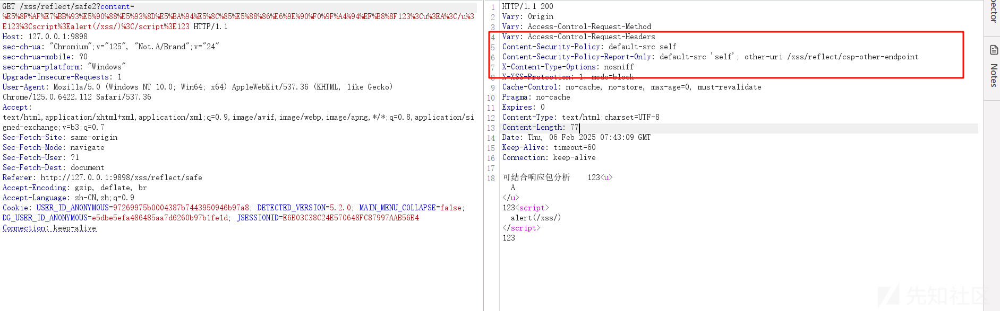

可以看见 csp 起作用

#### 特殊字符实体转义

```
// 特殊字符实体转义是一种将HTML中的特殊字符转换为预定义实体表示的过程
// 这种转义是为了确保在HTML页面中正确显示特定字符，同时避免它们被浏览器误解为HTML标签或JavaScript代码的一部分，从而导致页面结构混乱或安全漏洞
public R safe3(@ApiParam(String type, String content) {
    String filterContented = "";
    switch (type){
        case "manual":
            content = StringUtils.replace(content, "&", "&amp;");
            content = StringUtils.replace(content, "<", "&lt;");
            content = StringUtils.replace(content, ">", "&gt;");
            content = StringUtils.replace(content, """, "&quot;");
            content = StringUtils.replace(content, "'", "&#x27;");
            content = StringUtils.replace(content, "/", "&#x2F;");
            filterContented = content;
            break;
        case "spring":
            filterContented = HtmlUtils.htmlEscape(content);
            break;
            ...
    }
}
```

可以看到把我们的关键 xss 代码转义了

我们尝试输入一段 xss 代码测试

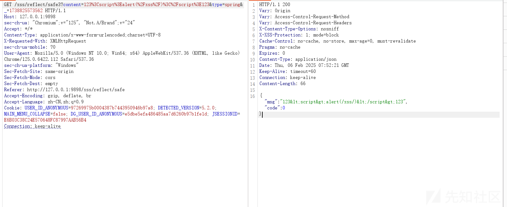

可以看见成功转义了

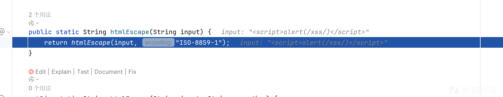

我们看到代码部分，是会进入 htmlEscape 函数去转义

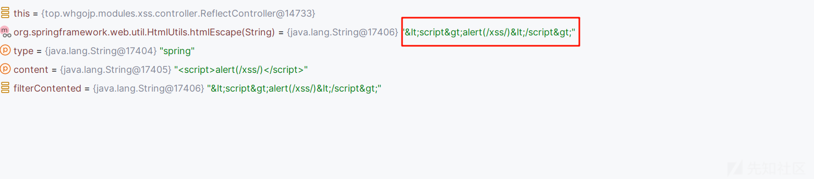

#### HttpOnly

如果 Cookie 设置了 HttpOnly，那么前端 JavaScript 无法读取 Cookie，即使攻击者利用 XSS 注入恶意脚本，也无法窃取 Cookie。

配置方法如下

三种

```
// HttpOnly是HTTP响应头属性，用于增强Web应用程序安全性。它防止客户端脚本访问(只能通过http/https协议访问)带有HttpOnly标记的 cookie，从而减少跨站点脚本攻击（XSS）的风险
// 单个接口配置
public R safe4(String content, HttpServletRequest request,HttpServletResponse response) {
    Cookie cookie = request.getCookies()[ueditor];
    cookie.setHttpOnly(true); // 设置为 HttpOnly
    cookie.setMaxAge(600);  // 这里设置生效时间为十分钟
    cookie.setPath("/");
    response.addCookie(cookie);
    return R.ok(content);
}

// 全局配置
// ueditor、application.yml配置
server:
  servlet:
    session:
      cookie:
        http-only: true

// 2、Springboot配置类
@Configuration
public class ServerConfig {
    @Bean
    public WebServerFactoryCustomizer<ConfigurableWebServerFactory> webServerFactoryCustomizer() {
        return factory -> {
            Session session = new Session();
            session.getCookie().setHttpOnly(true);
            factory.setSession(session);
            ...
}
```

我们尝试弹一个 cookie

```
GET /xss/reflect/safe4?content=123%3Cimg%20src%20onerror%3Dalert(document.cookie)%3E123&type=&_=1738834329602 HTTP/1.1
Host: 127.0.0.1:9898
sec-ch-ua: "Chromium";v="125", "Not.A/Brand";v="24"
Accept: */*
Content-Type: application/x-www-form-urlencoded;charset=UTF-8
X-Requested-With: XMLHttpRequest
sec-ch-ua-mobile: ?0
User-Agent: Mozilla/5.0 (Windows NT 10.0; Win64; x64) AppleWebKit/537.36 (KHTML, like Gecko) Chrome/125.0.6422.112 Safari/537.36
sec-ch-ua-platform: "Windows"
Sec-Fetch-Site: same-origin
Sec-Fetch-Mode: cors
Sec-Fetch-Dest: empty
Referer: http://127.0.0.1:9898/xss/reflect/safe
Accept-Encoding: gzip, deflate, br
Accept-Language: zh-CN,zh;q=0.9
Cookie: DETECTED_VERSION=5.2.0; MAIN_MENU_COLLAPSE=false; DG_USER_ID_ANONYMOUS=e5dbe5efa486485aa7d6260b97b1fe1d; JSESSIONID=44E627B3CA5C93C63DD163C388DCEA7C
Connection: keep-alive


```

我们看看能不能窃取我们的 JSESSIONID

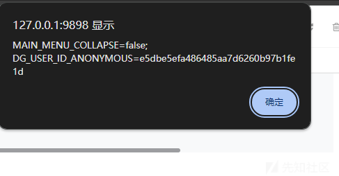

可以看到失败了，只能获取我们的

```
MAIN_MENU_COLLAPSE=false; DG_USER_ID_ANONYMOUS=e5dbe5efa486485aa7d6260b97b1fe1d
```

参考<https://github.com/whgojp/JavaSecLab/wiki>
