# Firmadyne源码解析-揭开固件模拟的黑盒面纱-先知社区

> **来源**: https://xz.aliyun.com/news/17241  
> **文章ID**: 17241

---

## 文章简介

在物联网设备安全研究领域，固件仿真是揭开嵌入式系统"黑盒"面纱的必经之路。第一次尝试通过Firmadyne模拟某款路由器固件却陷入无休无止的报错之中，因此这篇文章就诞生了，本文将以源码解构为主线，解析固件模拟的完整流程，让读者对固件模拟中所产生的报错不再不知所错，后续有概率还会对FirmAE框架进行源码解读！本文的阅读源码的环境和固件链接都会留下，大家可以积极复现，本文的技术解读可能因笔者对固件模拟理解的局限而存在偏差，期待各位读者在阅读过程中不吝斧正，让我们共同探讨固件仿真这座技术迷宫的破解之道。

文章简介大纲：

* 开始学习firmadyne源码-了解项目介绍

* 先了解一下firmadyne所依赖的开源项目
* 测试项目所使用的固件和环境简介

* FIRMADYNE项目的固件模拟实现原理

* 一，固件解析提取（核心1）
* 二，固件架构识别
* 三，数据库存储固件信息
* 四，固件转为系统镜像（核心2）
* 五，测试固件网络配置
* 六，固件仿真运行（核心3）

* firmadyne模拟过程中常见的巨坑！！！

* 进程崩溃，例如 dopagefault() 2: sending SIGSEGV for invalid read access from 00000000
* Binwalk的一个巨坑-符号链接错误

* Firmadyne固件模拟成功的完整流程
* 参考资料

## 开始学习firmadyne源码-了解项目介绍

FIRMADYNE 是一个自动化且可扩展的系统，用于执行基于 Linux 的嵌入式固件的仿真和动态分析。它包括以下组件：

* 修改后的内核（MIPS: [v2.6](https://github.com/firmadyne/kernel-v2.6)，ARM: [v4.1](https://github.com/firmadyne/kernel-v4.1)，[v3.10](https://github.com/firmadyne/kernel-v3.10)）用于固件执行的检测；
* 一个用户空间的 [NVRAM 库](https://github.com/firmadyne/libnvram) 用于模拟硬件 NVRAM 外设；
* 一个 [提取器](https://github.com/firmadyne/extractor) 用于从下载的固件中提取文件系统和内核；
* 一个小的 [控制台](https://github.com/firmadyne/console) 应用程序用于生成额外的 shell 进行调试；
* 以及一个 [爬虫](https://github.com/firmadyne/scraper) 用于从 42 家以上不同的供应商下载固件。

我们还使用 FIRMADYNE 系统编写了以下三种基本的自动化分析。

* 可访问的网页：此脚本遍历固件映像文件系统中似乎由 Web 服务器提供的每个文件，并根据是否需要身份验证汇总结果。
* SNMP 信息：此脚本使用无凭据将 `public` 和 `private` SNMP v2c 社区的内容转储到磁盘。
* 漏洞检查：此脚本使用 Metasploit 的漏洞测试 60 个已知漏洞的存在。此外，它还检查了我们发现的 14 个以前未知的漏洞。有关更多信息，包括受影响的产品和 CVE，请参阅 [analyses/README.md](https://github.com/firmadyne/firmadyne/blob/master/analyses/README.md)。

在我们 2016 年的 [网络和分布式系统安全研讨会 (NDSS)](http://www.internetsociety.org/events/ndss-symposium) 论文中，题为 [Towards Automated Dynamic Analysis for Linux-based Embedded Firmware](https://github.com/firmadyne/firmadyne/blob/master/paper/paper.pdf)，我们评估了 FIRMADYNE 系统在 23,035 个固件映像的数据集上的表现，其中我们能够提取 9,486 个。使用 [Metasploit 框架](https://github.com/rapid7/metasploit-framework) 中的 60 个漏洞和我们发现的 14 个以前未知的漏洞，我们展示了 1,971 个固件映像中的 846 个（43%）至少对一个漏洞是脆弱的，我们估计这影响了 89 种以上的产品。有关更多详细信息，请参阅上面链接的论文。

**注意**：该项目是一个研究工具，目前尚未准备好用于生产。特别是，某些组件非常不成熟和粗糙。我们建议在虚拟机中运行该系统。不提供支持，但非常欢迎拉取请求，无论是文档、测试还是代码！

### 先了解一下firmadyne所依赖的开源项目

由于firmadyne的编译环境要求非常苛刻，所以了解他依赖的开源项目可以很好的理解问题的出处，以及想出解决方案，直指Bug的核心：1）QEMUQEMU 是一个开源的机器模拟器和虚拟机监控程序，用于在 x86 平台上模拟多种处理器架构和嵌入式设备环境，包括 ARM、MIPS 和 PowerPC 等。Firmadyne 通过 QEMU 来运行固件文件并进行仿真。2）BinwalkBinwalk 是一个用于提取嵌入式固件文件系统的工具。Firmadyne 利用 Binwalk 来解压和分析固件文件，提取文件系统和内核等组件。3）PostgreSQLFirmadyne 需要 PostgreSQL 数据库来存储固件信息、网络配置和其他元数据。用户需要安装 PostgreSQL 并创建相应的数据库和用户。4）NVRAM 模拟库（libnvram）libnvram 是一个用户空间的 NVRAM 模拟库，用于仿真硬件 NVRAM 外设。5）FirmSolo（内核相关先略过）FirmSolo 是一个与 Firmadyne 集成的工具，用于动态分析 IoT 内核模块。它通过修改内核启动脚本来加载模块，并使用 Triforce AFL 对内核模块进行模糊测试。

### 测试项目所使用的固件和环境简介

使用过程中会对bug进行修改，让程序正常运行，以供读者学习！固件下载连接：<https://pan.baidu.com/s/1Gj9RDlAQdCDiaLdLzQ2Aag?pwd=8381>项目源码地址和版本：commit 74a99a5715a7602e0cc3950fa2759bf7dac56ac2 (HEAD -> master)

操作系统下载地址：[IOT-Research](https://www.iotsec-zone.com/article/110)虚拟机账户口令：`iot`：`iot`百度云盘的分享链接如下(提取码：`nqy3`)：

> windows版虚拟机
>
> 链接： <https://pan.baidu.com/s/1ke6gvJ9sFlnpPE17O9nMuQ>Mac M1版虚拟机链接：<https://pan.baidu.com/s/10BIt97pd4XQUyraAINdicw>

## FIRMADYNE项目的固件模拟实现原理

主要有5个核心组件组成：用最少最简洁的语言整理成五个词，主要有5个核心组件组成，把下文：固件解析提取，固件架构识别，数据库存储固件信息，固件转为系统镜像，测试固件网络配置，固件仿真运行

### 一，固件解析提取

该脚本支持从固件获取文件系统和内核:

```
# 使用extractor.py提取固件文件系统
sudo python3 ./sources/extractor/extractor.py -b Test -sql 127.0.0.1 -np -nk 固件路径  images

#参数解释
-b   "brand 品牌"
-sql "连接本地数据库"
-np  "代表没有并行操作"
-nk  "代表不提取内核"
```

执行固件提取时，用户需通过命令行指定目标品牌、数据库配置及输出路径。典型操作指令为“./sources/extractor/extractor.py -b 品牌 -sql 127.0.0.1 -np -nk 固件文件 images”。该命令执行后，脚本将自动创建images目录存放提取结果，其中包含解压后的文件系统与内核文件。需特别注意，若目标目录已存在历史文件，可能导致提取流程误判为已完成，因此建议每次执行前清空输出目录。

数据库的ID是4下面id也用4，第一次运行时会生成出id，所以要记住后面都会用到这个ID！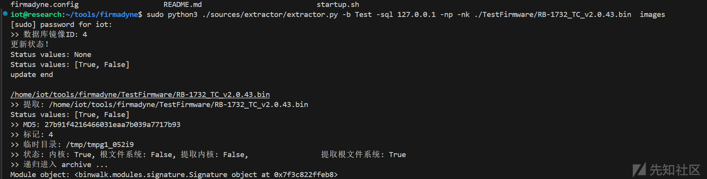

#### extractor.py源码解析

**核心功能**从技术实现角度看，该工具主要承担两大核心职能。首先是对固件文件的深度解析，通过支持多种压缩格式、文件系统类型与固件头部结构的识别，准确分离出内核镜像与根文件系统。其次是信息整合功能，将提取过程中获取的元数据（如文件哈希、品牌信息、提取状态）持久化存储至数据库，为后续固件仿真与漏洞分析提供数据支撑。FIRMADYNE的extractor.py主要用于:1.从固件文件中提取文件系统和内核，从固件中提取出文件系统和uImage内核。2.分析固件内容并保存到数据库,所以sql选项是用来存放固件模拟信息的。

**绘制源码流程图**



提取流程遵循分层处理原则。初始阶段进行文件类型检测，根据文件签名判断输入文件属于压缩包、归档文件、内核镜像或文件系统映像。对于压缩类文件，执行递归解压直至获取原始数据。若检测到uImage内核文件或包含标准UNIX目录结构的文件系统，则直接进行提取操作。整个处理过程采用深度优先策略，通过设定递归层级限制防止无限解包。

##### 核心类解析：extractor.py的Extractor类

Extractor类是固件提取器的核心类，用于从固件镜像中提取内核和文件系统。Extractor类作为固件提取器的核心组件，承担着流程控制与资源调度的关键职责。其实例化需配置输入输出路径、处理模式（是否启用并行）、数据库连接参数等关键信息。在提取启动阶段，类内部首先创建临时工作目录，随后根据文件类型分发至对应的处理模块。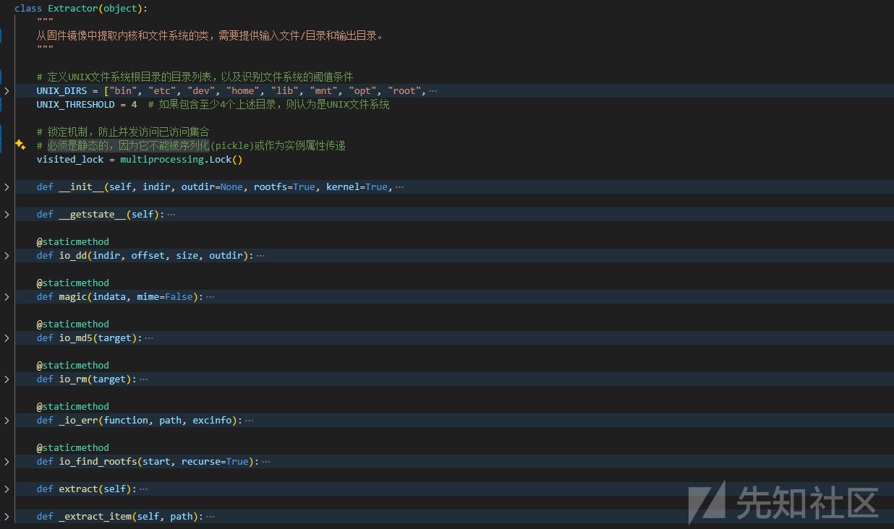典型使用场景可通过代码实例直观理解。创建Extractor实例时需指定输入固件路径、输出目录、处理标志及数据库参数。执行extract()方法后，工具将自动完成特征提取、递归解包、结果验证全流程。输出结果包含原始内核映像与打包后的文件系统归档，便于后续分析工具链处理。可以观察一下这个类的流程图：



Extractor类作为固件提取器的核心组件，承担着流程控制与资源调度的关键职责。其实例化需配置输入输出路径、处理模式（是否启用并行）、数据库连接参数等关键信息。在提取启动阶段，类内部首先创建临时工作目录，随后根据文件类型分发至对应的处理模块。典型使用场景可通过代码实例直观理解。创建Extractor实例时需指定输入固件路径、输出目录、处理标志及数据库参数。执行extract()方法后，工具将自动完成特征提取、递归解包、结果验证全流程。输出结果包含原始内核映像与打包后的文件系统归档，便于后续分析工具链处理。

文件操作层面，类内封装了多种底层IO方法。io\_dd()函数实现二进制数据的精确提取，支持通过偏移量与长度参数切割固件内容。io\_find\_rootfs()采用启发式搜索算法，基于目录结构特征识别UNIX文件系统。判定标准为至少包含bin、etc、lib等4个标准目录，该阈值设计有效平衡了识别准确率与误报风险。通过目录来判断是否是UNIX文件系统：

```
# UNIX文件系统的关键目录
UNIX_DIRS = ["bin", "etc", "dev", "home", "lib", "mnt", "opt", "root",
             "run", "sbin", "tmp", "usr", "var"]
# 判定为UNIX文件系统需要的最小目录数
UNIX_THRESHOLD = 4
```

文件操作相关的主要功能有：

```
@staticmethod
def io_dd(indir, offset, size, outdir):
    """提取指定偏移和大小的数据"""

@staticmethod
def io_md5(target):
    """计算文件MD5值"""

@staticmethod
def io_rm(target):
    """递归删除目录"""

@staticmethod
def io_find_rootfs(start, recurse=True):
    """查找Linux根目录"""
```

直接可以开始一个基础的使用实例来理解整个类，了解架构后这个python功能就很容易实现了！

```
# 创建提取器实例
extractor = Extractor(
    indir="firmware.bin",         # 输入文件
    outdir="output",             # 输出目录
    rootfs=True,                 # 提取根文件系统
    kernel=True,                 # 提取内核
    numproc=True,               # 启用并行处理
    server="localhost",          # 数据库服务器
    brand="Example"             # 固件品牌
)

# 开始提取
extractor.extract()
```

##### 核心类解析：extractor.py的ExtractionItem类

ExtractionItem 类用于封装单个正在提取的固件项的状态和操作。每个待提取的文件都会创建一个 ExtractionItem 实例来管理其提取过程。

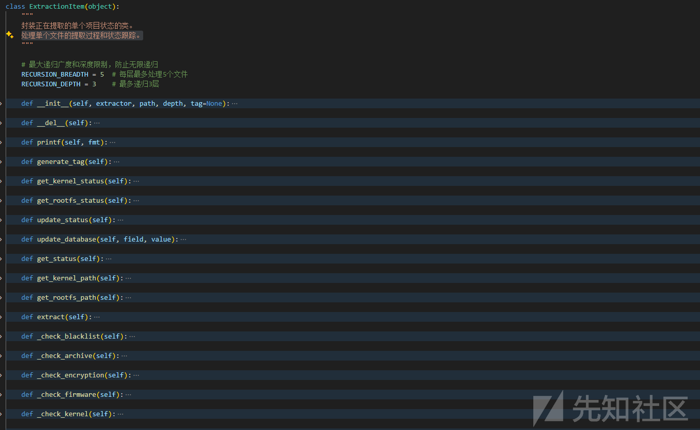ExtractionItem类专为管理递归提取过程而设计。每个待处理文件对应一个实例，用于跟踪解包深度、文件哈希、处理状态等元数据。类内定义RECURSION\_BREADTH与RECURSION\_DEPTH常量，分别控制同级最大处理文件数与递归层级上限，防止因固件嵌套结构复杂导致的资源耗尽问题。

可以观察一下这个类的流程图：



###### 关键实现细节：如何解决固件嵌套结构复杂导致的资源耗尽问题

固件在解包的时候会出现非常多的嵌套压缩文件！所以需要设定一下最大的探索深度和广度，不然会出现莫名奇妙的问题！用这两变量来控制！

```
RECURSION_BREADTH = 5  # 最大递归广度
RECURSION_DEPTH = 3    # 最大递归深度
```

还有三个状态用来定位是否停止探索。是否找到内核，是否找到文件系统：

```
self.terminate = False  # 是否提前终止
self.status = None      # 提取状态
self.update_status()    # 更新当前状态
```


状态管理机制是该类的设计亮点。通过terminate标志位实现处理流程的提前终止，当检测到有效内核或文件系统时立即停止深层递归。status属性实时反馈提取进度，包含内核发现状态、文件系统完整性等关键信息。这种设计使得工具能够快速跳过无效分支，显著提升处理效率。

###### 关键实现细节：如何实现对固件中的不同文件类型进行解析

核心功能就是文件类型分析对不同数据进行针对性的处理检查归档文件，检查加密文件，检查固件格式，检查内核文件，检查根文件系统，检查压缩文件这里还有对D-Link固件解密的功能，依赖的项目是: <https://github.com/0xricksanchez/dlink-decrypt>

提取出固件和文件系统的核心函数是\_check\_firmware(self),检查固件文件是否为已知类型，如果是，则尝试直接提取内核和根文件系统。或者通过binwalk提取出来的信息计算出这两个文件的偏移和大小：

```
def _check_firmware(self):
    """
    检查已知的固件格式并提取内核和根文件系统。
    支持的格式包括：
    1. uImage格式：通过识别uImage header
    2. 通用分区格式：包含明确的kernel和rootfs偏移信息的固件
       - TP-Link 固件
       - TRX 格式
       - 其他具有类似分区结构的格式
    
    返回:
        bool: 如果成功提取则返回True，否则返回False
    """
    # 使用 binwalk 扫描文件，查找固件头部信息
    for module in binwalk.scan(self.item, "-y", "header", "--run-as=root", "--preserve-symlinks",
                               signature=True, quiet=True):
        for entry in module.results:
            # 检查是否为 uImage 格式的固件
            if "uImage header" in entry.description:
                # 如果内核尚未提取，并且描述中包含 "OS Kernel Image"
                if not self.get_kernel_status() and \
                    "OS Kernel Image" in entry.description:
                    # 计算内核的偏移量和大小
                    kernel_offset = entry.offset + 64
                    kernel_size = 0

                    # 从描述中提取内核大小
                    for stmt in entry.description.split(','):
                        if "image size:" in stmt:
                            kernel_size = int(''.join(
                                i for i in stmt if i.isdigit()), 10)

                    # 如果内核大小有效且未超出文件范围
                    if kernel_size != 0 and kernel_offset + kernel_size \
                        <= os.path.getsize(self.item):
                        self.printf(">>>> %s" % entry.description)

                        # 创建临时文件用于存储提取的内核
                        tmp_fd, tmp_path = tempfile.mkstemp(dir=self.temp)
                        os.close(tmp_fd)
                        Extractor.io_dd(self.item, kernel_offset,
                                         kernel_size, tmp_path)
                        kernel = ExtractionItem(self.extractor, tmp_path,
                                                self.depth, self.tag)

                        # 提取内核并返回结果
                        return kernel.extract()

            # 检查是否为 TP-Link 或 TRX 格式的固件
            elif not self.get_kernel_status() and \
                not self.get_rootfs_status() and \
                "rootfs offset: " in entry.description and \
                "kernel offset: " in entry.description:
                # 初始化内核和根文件系统的偏移量和大小
                kernel_offset = 0
                kernel_size = 0
                rootfs_offset = 0
                rootfs_size = 0

                # 从描述中提取内核和根文件系统的偏移量和大小
                for stmt in entry.description.split(','):
                    if "kernel offset:" in stmt:
                        kernel_offset = int(stmt.split(':')[1], 16)
                    elif "kernel length:" in stmt:
                        kernel_size = int(stmt.split(':')[1], 16)
                    elif "rootfs offset:" in stmt:
                        rootfs_offset = int(stmt.split(':')[1], 16)
                    elif "rootfs length:" in stmt:
                        rootfs_size = int(stmt.split(':')[1], 16)

                # 如果未提供大小，则根据偏移量计算大小
                if kernel_offset != rootfs_size and kernel_size == 0 and \
                    rootfs_size == 0:
                    kernel_size = rootfs_offset - kernel_offset
                    rootfs_size = os.path.getsize(self.item) - rootfs_offset

                # 确保计算的值是合理的
                if (kernel_size > 0 and kernel_offset + kernel_size \
                    <= os.path.getsize(self.item)) and \
                    (rootfs_size != 0 and rootfs_offset + rootfs_size \
                        <= os.path.getsize(self.item)):
                    self.printf(">>>> %s" % entry.description)

                    # 提取内核
                    tmp_fd, tmp_path = tempfile.mkstemp(dir=self.temp)
                    os.close(tmp_fd)
                    Extractor.io_dd(self.item, kernel_offset, kernel_size,
                                    tmp_path)
                    kernel = ExtractionItem(self.extractor, tmp_path,
                                            self.depth, self.tag)
                    kernel.extract()

                    # 提取根文件系统
                    tmp_fd, tmp_path = tempfile.mkstemp(dir=self.temp)
                    os.close(tmp_fd)
                    Extractor.io_dd(self.item, rootfs_offset, rootfs_size,
                                    tmp_path)
                    rootfs = ExtractionItem(self.extractor, tmp_path,
                                            self.depth, self.tag)
                    rootfs.extract()

                    # 更新状态并返回
                    return self.update_status()
    # 如果没有找到有效的固件类型，返回 False
    return False
```

其中\_check\_firmware()方法实现固件特征检测，通过偏移量计算与签名匹配定位内核及文件系统位置。根据这个源码我们可以知道：binwalk 使用特征签名数据库 (`magic signatures`) 来识别文件格式：**特征数据库位置**：

```
/usr/share/binwalk/magic/
```

**固件格式定义示例**：

```
# TP-Link format
0       string      TP-LINK     TP-Link firmware header
>0x14   string      SoftwareVersion     Version: %s
>0x3C   string      kernel:     Kernel offset: 0x%x
>0x46   string      rootfs:     Rootfs offset: 0x%x

# TRX format
0       string      HDR0    TRX firmware header
>4      ulelong     x       Header version: %d
>8      ulelong     x       Firmware size: %d bytes
>12     ulelong     x       CRC32: 0x%X
>16     ulelong     x       Kernel offset: 0x%x
>20     ulelong     x       Rootfs offset: 0x%x
```

因此，这个函数实际上可以识别所有在 binwalk 特征数据库中定义的固件格式，只要它们包含：

* 内核偏移量 (kernel offset)
* 根文件系统偏移量 (rootfs offset)

这里使用的识别项目是binwalk：该工具是本项目支持的固件类型包含：包括但不限于TP-Link、TRX等厂商自定义固件头结构，以及ubi、jffs2、squashfs等嵌入式文件系统格式。对于采用LZMA、GZIP、ZIP等压缩算法的固件包，工具内置的解压模块可自动处理嵌套压缩结构。同时通过集成binwalk特征库，能够识别超过200种文件格式签名，确保广泛的格式兼容性。binwalk集成是该工具的重要能力支撑。通过调用binwalk的签名扫描模块，能够识别固件内部的隐藏数据段。特征数据库包含上千条文件签名规则，涵盖文件系统、压缩格式、固件头等类型。例如TRX格式的识别依赖特征字符串“HDR0”，随后解析其结构体中定义的内核偏移量字段。这种设计使得工具具备良好的可扩展性，新增固件格式仅需更新特征库即可支持。

#### 手动修复extractor.py运行过程中的Bug

测试这段代码的时候出现报错：[提取根文件系统失败 ·问题 #55 ·pr0v3rbs/FirmAE --- Extracting root filesystem failed · Issue #55 · pr0v3rbs/FirmAE](https://github.com/pr0v3rbs/FirmAE/issues/55)问题是因为binwalk的版本不对！

```
iot@research:~/tools/firmadyne$ sudo python3 ./sources/extractor/extractor.py -b RB -sql 127.0.0.1 -np  ./WNAP320\ Firmware\ Version\ 2.0.3.zip 
images
>> 数据库镜像ID: 1

/home/iot/tools/firmadyne/WNAP320 Firmware Version 2.0.3.zip
>> MD5: 51eddc7046d77a752ca4b39fbda50aff
>> 标记: 1
>> 临时目录: /tmp/tmputiwotmt
>> 状态: 内核: False, 根文件系统: True, 提取内核: True,                 提取根文件系统: True

General Error: Cannot open file --run-as=root (CWD: /tmp/tmputiwotmt) : [Errno 2] No such file or directory: '--run-as=root'


General Error: Cannot open file --preserve-symlinks (CWD: /tmp/tmputiwotmt) : [Errno 2] No such file or directory: '--preserve-symlinks'

Traceback (most recent call last):
  File "./sources/extractor/extractor.py", line 501, in extract
  File "./sources/extractor/extractor.py", line 551, in _check_archive
  File "./sources/extractor/extractor.py", line 763, in _check_recursive
  File "/usr/local/lib/python3.6/dist-packages/binwalk/__init__.py", line 10, in scan
    objs = m.execute()
  File "/usr/local/lib/python3.6/dist-packages/binwalk/core/module.py", line 783, in execute
    obj = self.run(module)
  File "/usr/local/lib/python3.6/dist-packages/binwalk/core/module.py", line 802, in run
    obj = self.load(module, kwargs)
  File "/usr/local/lib/python3.6/dist-packages/binwalk/core/module.py", line 833, in load
    argv.update(self.dependencies(module, argv['enabled']))
  File "/usr/local/lib/python3.6/dist-packages/binwalk/core/module.py", line 865, in dependencies
    raise ModuleException("Failed to load " + dependency.name + " module")
binwalk.core.exceptions.ModuleException: Failed to load General module
>> 清理临时目录 /tmp/tmputiwotmt...
```

测试中出现的“General Error”通常与依赖组件版本相关。例如示例中的binwalk参数兼容性问题，可通过降级至2.3.3版本或调整调用参数解决。另一个常见问题是内核偏移量计算错误，表现为提取的映像无法正常挂载。此时建议启用调试模式，检查binwalk扫描结果与手动计算的偏移量是否一致。

去除这个选项后也可以运行：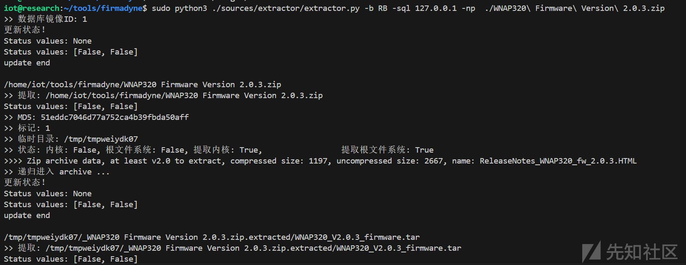成功用来提取文件系统和内核！最后提取出来的文件打包成为tar.gz

```
iot@research:~/tools/firmadyne$ ls ./images/
1.kernel  1.tar.gz
```

成功提取后，输出目录包含两个关键文件。.kernel文件保存原始内核映像，可直接用于反汇编分析。.tar.gz归档包含完整的文件系统，解压后可查看设备配置文件、服务脚本、可执行程序等关键内容。对于提取失败案例，建议优先检查固件加密状态，或尝试手动指定偏移参数进行二次提取。

### 二，固件架构识别

```
# 识别固件架构
sudo ./scripts/getArch.sh ./images/1.tar.gz
#参数解释
-i 1 "这里的1代表的数据库中的id，当你有多个固件镜像时候会有多个id，我这里就一个所以就是1"
-f   "这里就是解包后估计的tar包路径，一般解压后的固件都在./images下面"
```

需要手动输入数据库密码！这里由于id是4所以压缩包也是4！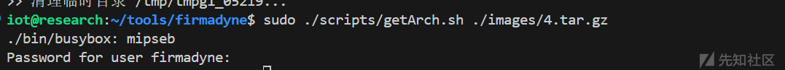

#### getArch.sh源码解析

**核心功能**FIRMADYNE的getArch.sh主要用于自动识别嵌入式固件的CPU架构和字节序信息。该脚本通过分析固件包中的关键可执行文件，提取其ELF头信息，从而确定目标系统的硬件架构特征。这一过程对于后续的固件模拟和分析至关重要，因为不同的CPU架构需要采用不同的仿真环境和配置。

FIRMADYNE的getArch.sh主要用于:1.在文件系统中寻找可执行文件并且使用file命令检查其系统架构2.识别成功后将识别出的架构存放进入数据库中，以供后续模拟使用

这部分代码写的非常清晰命令，和我们手动识别系统架构的方法一模一样！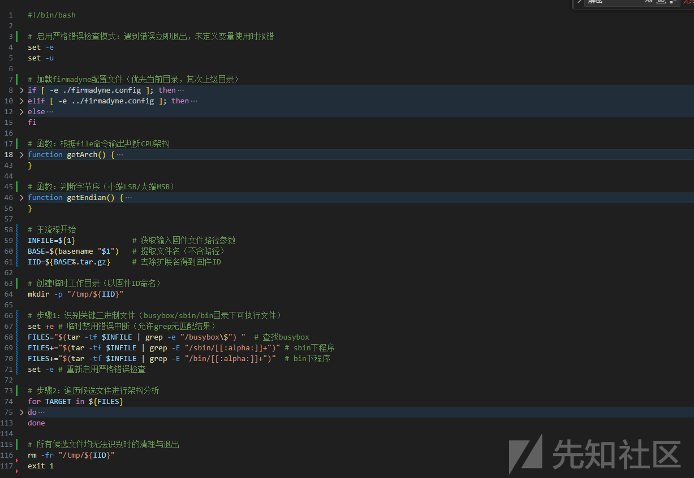简介一下核心设计原理：**1. 关键文件选择策略**

* **Busybox优先**：作为嵌入式系统核心工具集，其编译架构直接反映固件目标平台
* **sbin/bin目录**：系统级可执行文件通常为静态编译，包含完整的架构特征

**2. 递归解压机制**

* 使用`--strip-components`参数自动剥离冗余目录层级
* 跳过符号链接避免解析错误

**3. 架构判定逻辑**

* **双重验证**：基于`file`输出的标准格式字符串匹配

* CPU架构（MIPS/ARM/x86等）
* 字节序（LSB小端/MSB大端）

* **快速终止**：首次成功匹配后立即退出，提升效率

**4. 安全防护措施**

* 临时目录隔离：所有操作在`/tmp`下进行，避免污染工作环境
* 严格错误检查：`set -e`确保任何步骤失败立即终止流程
* 资源清理：无论成功与否均删除临时文件

**5. 数据库集成**

* 使用预配置的PostgreSQL连接参数更新固件元数据
* 架构信息为后续仿真提供关键参数（如QEMU启动命令）

### 三，数据库存储固件信息

存储数据库

```
iot@research:~/tools/firmadyne$ sudo python3 ./scripts/tar2db.py -i 5 -f ./images/5.tar.gz 
#参数解释
-i 5 "这里的5代表的数据库中的id，当你有多个固件镜像时候会有多个id，我这里就是5"
-f   "这里就是解包后估计的tar包路径，一般解压后的固件都在./images下面"
```

我们可以进入数据库来查看一下数据：先手动进入数据库！

```
iot@research:~/tools/firmadyne$ psql -U firmadyne -d firmware -h localhost
```

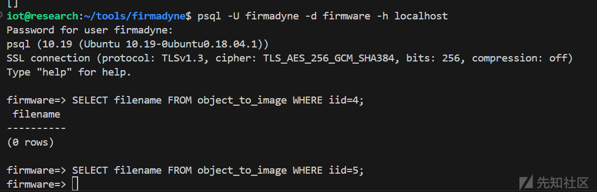

发现5的数据很多也就是我们的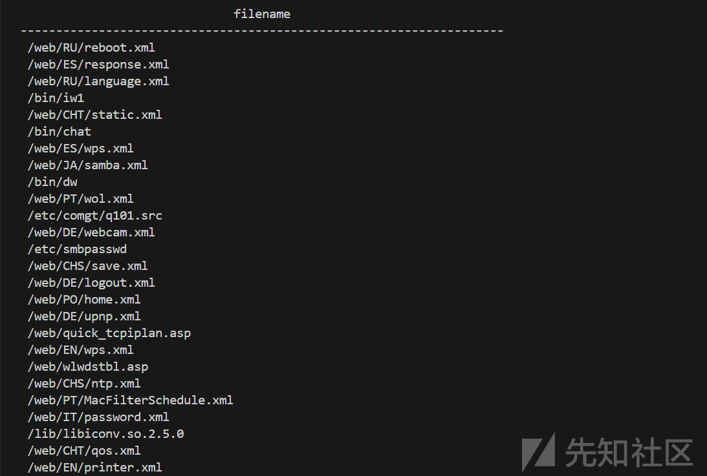

可以用这些命令来查数据：

```
-- 查看指定镜像ID的所有文件
SELECT filename FROM object_to_image WHERE iid=4;

-- 查看指定镜像ID且包含特定路径的文件
SELECT filename FROM object_to_image WHERE iid=4 AND filename LIKE '%/www/%';

-- 查看所有镜像ID
SELECT DISTINCT iid FROM object_to_image ORDER BY iid;

-- 统计每个镜像包含的文件数量
SELECT iid, COUNT(*) as file_count 
FROM object_to_image 
GROUP BY iid 
ORDER BY iid;
```

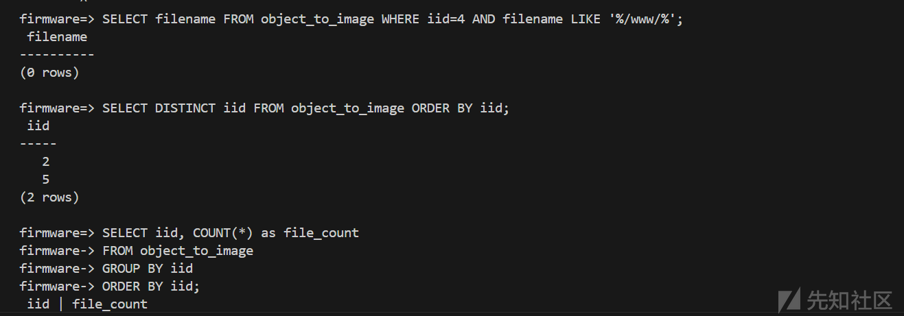

#### tar2db.py源码解析

**核心功能**FIRMADYNE的tar2db.py主要承担固件元数据与数据库的桥梁作用。其核心任务可归纳为两方面。首先是对固件包进行深度解析，提取文件哈希、权限属性及符号链接等关键元数据。其次是实现与数据库的高效交互，通过智能去重和批量操作机制，将解析结果持久化存储。这种设计既能确保数据完整性，又能显著降低存储冗余。

FIRMADYNE的tar2db.py主要工作:1.解析tar文件中的文件成员，计算常规文件MD5哈希值，记录符号连接信息2.将获取到的所有数据统一存储到数据库，将解析结果持久化存储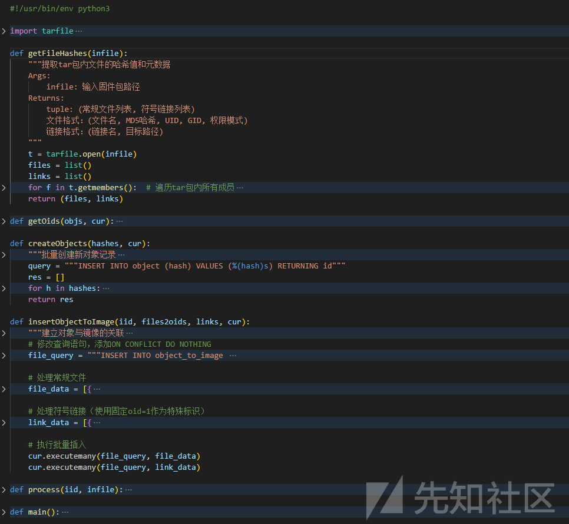

#### 手动修复tar2db.py文件中存在的Bug

出现了报错可以修复一下：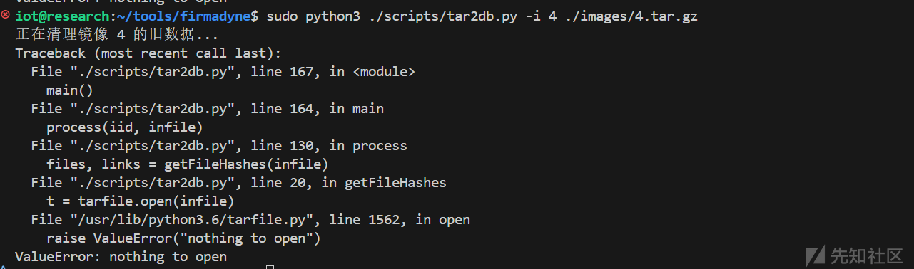代码存在一些bug，多次运行可能会出现，这个错误是因为数据库中已经存在相同的记录导致的唯一约束冲突。

1. 首先在 `insertObjectToImage` 函数中添加冲突处理：

```
def insertObjectToImage(iid, files2oids, links, cur):
    """建立对象与镜像的关联
    Args:
        iid: 镜像ID
        files2oids: 文件到对象ID的映射
        links: 符号链接列表
        cur: 数据库游标
    """
    # 修改查询语句，添加ON CONFLICT DO NOTHING
    file_query = """INSERT INTO object_to_image 
        (iid, oid, filename, regular_file, uid, gid, permissions) 
        VALUES (%(iid)s, %(oid)s, %(filename)s, %(regular_file)s, 
                %(uid)s, %(gid)s, %(mode)s)
        ON CONFLICT (oid, iid, filename) DO NOTHING"""
    
    # ...existing code...
```

1. 在使用前清理旧数据：

```
def process(iid, infile):
    """主处理流程"""
    dbh = psycopg2.connect(database="firmware", user="firmadyne",
                          password="firmadyne", host="127.0.0.1")
    cur = dbh.cursor()
    
    # 添加清理旧数据的步骤
    print(f"正在清理镜像 {iid} 的旧数据...")
    cur.execute("DELETE FROM object_to_image WHERE iid = %s", (iid,))
    
    # ...existing code...
```

### 四，固件转为系统镜像

创建QEMU镜像脚本

```
iot@research:~/tools/firmadyne$ sudo ./scripts/makeImage.sh 5
#参数解释
脚本加上数据库分配的ID
```

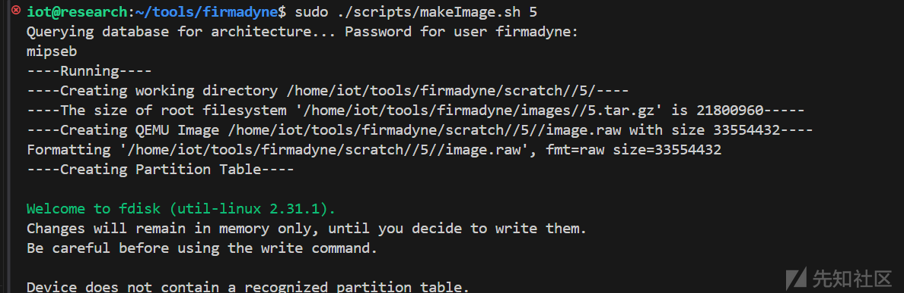会在scratch/id目录下有个run.sh脚本

#### makeImage.sh源码解析

**核心功能**固件仿真环境构建的核心组件，其工作流程可分为六个关键阶段。环境准备阶段首先加载配置文件获取基础参数，验证用户权限有效性，并通过数据库查询或手动指定方式确定目标系统架构。资源分配阶段动态创建临时工作目录，根据固件实际体积采用倍增算法自动计算镜像大小，既保证空间充足又避免资源浪费。镜像创建环节使用qemu-img生成原始格式镜像文件，通过非交互式fdisk建立分区表结构，配合kpartx工具创建设备映射节点，有效解决不同分区方案的兼容性问题。

**FIRMADYNE的makeImage.sh主要流程**:1.获取压缩文件，加载配置和创建工作目录2.使用qemu-img，fdisk和kpartx工具创建镜像文件3.创建ext2文件系统并挂载，解压固件文件系统到镜像，创建仿真环境专用目录结构4.系统定制，根据不同的固件系统对镜像进行修复操作

**绘制源码流程图**


#### 解析核心操作：创建一个空的原始格式raw镜像文件

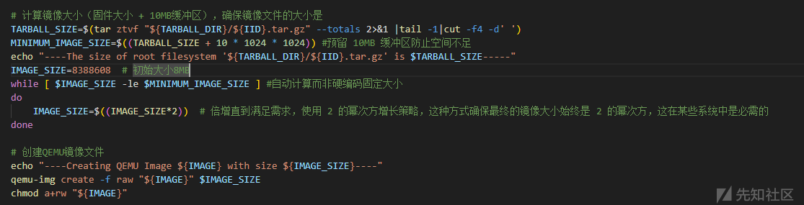这部分操作是通过计算文件系统的大小动态的创建出一个空的原始格式（raw）镜像文件，以供后续操作使用其实这就和我们手动创建一个qemu虚拟机的流程相同[[配置arm的虚拟机-通过Qemu.md]]

#### 解析核心操作：**文件系统定制与准备**

IoT固件通常依赖特定硬件环境,需要定制文件系统！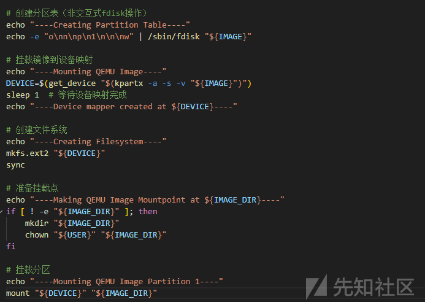为什么要进行这些操作：**文件系统定制**，为固件模拟配置特定的分区布局， 使用嵌入式设备常用的ext2文件系统，为后续对镜像文件编辑提供帮助

```
初始状态：空镜像文件（无分区表、无文件系统）
│
├── 1. 创建 MBR 分区表
│    │ fdisk 创建单主分区
│    ▼
│    状态：镜像包含 MBR 分区表 + 未格式化的主分区
│
├── 2. 映射分区为块设备
│    │ kpartx 生成 /dev/mapper/loopXpY
│    ▼
│    状态：分区暴露为独立块设备（如 /dev/loop0p1）
│
├── 3. 创建 ext2 文件系统
│    │ mkfs.ext2 格式化分区
│    ▼
│    状态：分区包含 ext2 文件系统（可挂载）
│
├── 4. 创建宿主机挂载点
│    │ mkdir + chown 设置权限
│    ▼
│    状态：宿主机存在空目录（如 /mnt/image）
│
└── 5. 挂载分区到宿主机目录
        │ mount /dev/loop0p1 /mnt/image
        ▼
        最终状态：宿主机目录直接访问镜像文件系统（ext2）
```

**详细解析一下这些操作**:将原始的镜像文件创建出一个分区，并且将这个分区**映射为独立的块设备**,再在主机上创建一个文件夹作为挂载点，再将设备块进行挂载，操作系统就可以直接访问镜像文件，并且像操作自己的系统文件一样操作镜像文件的数据了！

1.**创建分区表**:这会生成一个包含单个分区的 MBR 表，使镜像文件看起来像一个真实磁盘。2.**挂载镜像到设备映射**：`kpartx` 会将镜像中的分区映射为设备（如 `/dev/loop0p1`），从而允许后续操作直接针对分区而非整个镜像（一个镜像可能有多个分区）3.**创建文件系统**：创建 ext2 文件系统，使其可以挂载和存储数据4.**准备挂载点**：在主机上创建一个目录，作为后续挂载镜像分区的“入口”，并设置正确的权限，以便后续挂载操作成功。5.**挂载分区**：将 QEMU 镜像中的分区（通过 `kpartx` 映射的设备）挂载到指定目录，以便访问和修改其中的文件系统。

1.**为什么需要创建分区表**？QEMU 磁盘镜像需模拟真实物理磁盘结构，分区表是标准化磁盘布局的基础。QEMU 镜像（如 `raw` 格式）需包含以下结构才能被工具链（如 `kpartx`）和虚拟机识别，**分区表** （MBR/GPT）：定义分区起始/结束位置，**文件系统** （如 ext4）：存储实际数据。

2.**为什么需要将镜像挂载到设备映射**？通过 `kpartx` 将镜像分区映射为块设备，是访问镜像内容的必要步骤。**镜像文件的结构复杂性**，镜像文件是完整磁盘的二进制副本，包含：分区表（MBR/GPT），多个分区（如 `/dev/sda1`、`/dev/sda2`）等，**直接操作非常的困难!**

3.**为什么在映射后必须挂载分区**？块设备仅暴露原始数据，需通过挂载解析文件系统才能访问内容。**块设备的局限性**,映射后的设备（如 `/dev/mapper/loop0p1`）是原始块设备,数据以二进制形式存储（如 ext4 的 inode、超级块）,无法直接通过 `ls`、`cp` 等命令操作文件,需通过挂载解析文件系统才能访问内容。

4.**为什么要准备挂载点**?**宿主机目录与镜像文件系统的关联**，**挂载前**宿主机目录，属于宿主机文件系统；**挂载后**，内容被镜像文件系统覆盖，成为访问镜像的“窗口”。**挂载的目的是“解析文件系统”**,文件系统（如 ext4、FAT32）定义了数据在磁盘上的组织方式（目录结构、文件元数据、权限等）。只有通过 **挂载（mount）** 操作，才能让操作系统理解并管理这些结构。

在 `fdisk` 的交互模式下，用户可以通过输入单字母命令来执行各种操作。以下是一些常用的命令及其功能：

* `p` : 打印当前分区表，显示磁盘的分区信息。
* `n` : 创建一个新分区。
* `d` : 删除现有分区。
* `t` : 修改分区类型（例如设置为 Linux 文件系统或交换分区）。
* `w` : 将更改写入磁盘并退出 `fdisk`。
* `q` : 不保存更改并退出 `fdisk`。
* `m` : 显示帮助菜单，列出所有可用命令

`kpartx` 是一个用于管理磁盘镜像或设备分区映射的工具。它能够读取磁盘设备或镜像文件的分区表，并将每个分区映射为独立的设备，从而方便挂载和操作这些分区常用选项：

* `-a`: 添加分区映射（Add mapping）。
* `-d`: 删除分区映射（Delete mapping）。
* `-l`: 列出分区信息（List partitions）。
* `-v`: 显示详细输出（Verbose）。

#### 解析核心操作：**修复嵌入式操作系统环境**

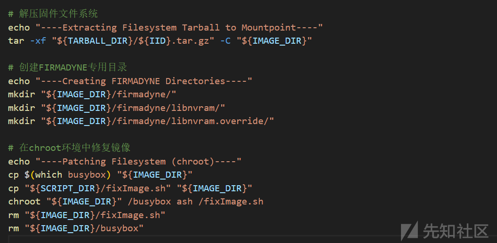这部分解压之前从固件提取出来的文件系统是为了尽量还原操作系统原有的环境，并且使用fixImage.sh脚本对系统进行修复

详细解析fixImage.sh脚本的功能：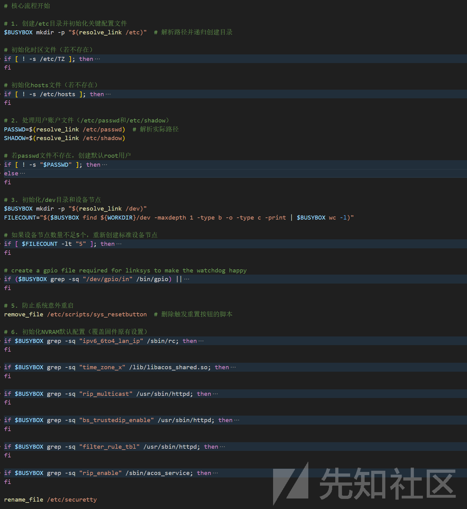

1. **环境初始化**

* 使用静态编译的`busybox`确保命令可用性。
* 解析符号链接确保操作实际文件。
* 创建`/etc`目录并初始化`TZ`（时区）和`hosts`（本地主机映射）文件。

1. **用户账户配置**

* 创建或修复`/etc/passwd`和`/etc/shadow`，确保存在无密码的`root`用户。
* 备份原有文件避免数据丢失，修复错误的shell配置。

1. **设备节点创建**

* 若`/dev`下设备节点不足，重新创建标准字符设备（如`null`、`tty`）和块设备（如`mtdblock`），确保硬件交互正常。

1. **硬件特定处理**

* 检测到特定依赖（如`/dev/gpio/in`）时，创建GPIO文件模拟硬件信号。

1. **系统行为修改**

* 删除重置按钮脚本，防止意外重启。
* 设置NVRAM默认值，避免固件因缺少配置崩溃。

1. **安全配置调整**

* 重命名`/etc/securetty`，可能允许root从更多终端登录。

1.设备节点是什么？设备节点是Linux系统中用于与硬件设备交互的特殊文件（位于`/dev`目录），分为字符设备（如键盘、串口）和块设备（如硬盘、Flash存储）。每个节点通过主/次设备号标识对应的驱动程序。设备节点的核心作用是：提供用户空间访问硬件的接口（如`echo 1 > /dev/gpio/out`控制LED），在固件模拟中，虚拟设备节点让系统认为硬件存在，避免驱动崩溃

​

2.为什么要创建GPIO文件模拟硬件信号？GPIO（通用输入输出）用于控制硬件信号（如按钮、LED、传感器），某些固件依赖读取GPIO状态（如`/dev/gpio/in`）判断硬件状态。需要**模拟的原因** ：- **硬件缺失** ：在虚拟环境中，真实GPIO硬件不存在，直接访问会触发错误。若固件检测不到GPIO设备，可能因读取失败而停止运行。写入`0xFF`（全高电平）模拟“无信号”状态，欺骗固件认为硬件正常（`echo -ne "\xff\xff\xff\xff" > /dev/gpio/in`）。

​

3.为什么要设置NVRAM默认值？嵌入式设备使用NVRAM存储持久化配置（如IP地址、SSID、硬件型号），通常通过`nvram get xxx`读取。**模拟必要性**:真实设备的NVRAM存储在Flash，模拟环境无物理存储。固件可能因缺失关键NVRAM变量（如`lan_ipaddr`）导致服务崩溃。通过覆盖默认值可模拟特定设备型号（如伪装成Linksys路由器）。

​

4.**NVRAM**是什么意思？**NVRAM** 是 **Non-Volatile Random Access Memory** （非易失性随机存取存储器）的缩写，指一种在断电后仍能保留数据的存储介质。在嵌入式系统（如路由器、智能家居设备等）中，NVRAM 通常用于存储设备的**持久化配置信息** ，例如网络设置、硬件参数或系统偏好。

​

在真实设备中，NVRAM 通常存储在 Flash 的特定分区。但在模拟环境中，由于缺乏物理硬件，需通过以下方式模拟：文件系统覆盖，用户空间库劫持（LD\_PRELOAD），内核模块模拟，QEMU 设备模拟，内存文件系统（tmpfs）

​

5.什么是BusyBox？BusyBox 是资源受限环境下 Linux 系统的基石，通过高度集成和精简设计，在最小化体积的同时提供基础系统功能支持。它是嵌入式开发、系统救援和容器化场景中的关键工具。

​

#### 解析核心操作：**部署仿真环境组件**

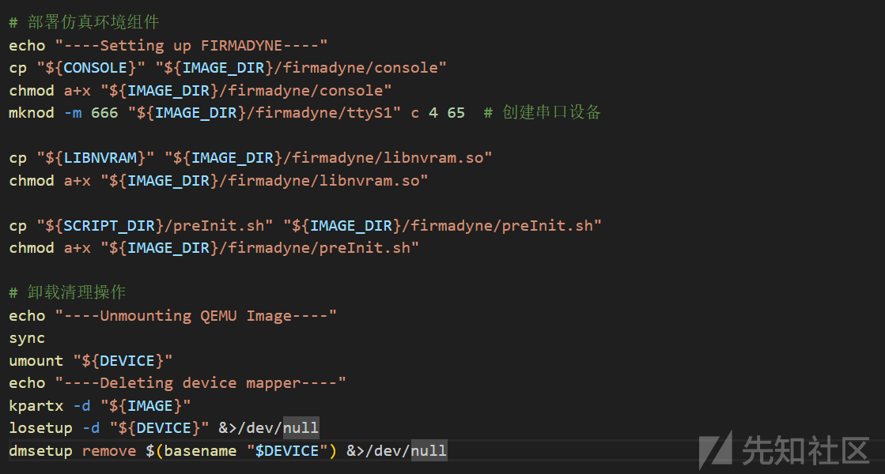**特殊组件注入**，通过设备节点和库劫持，模拟真实硬件行为。通过 `libnvram.so` 和 `preInit.sh` 注入必要配置，绕过固件校验。通过 `console` 实现调试能力，提升分析效率。

部署 console 程序

```
cp "${CONSOLE}" "${IMAGE_DIR}/firmadyne/console"
chmod a+x "${IMAGE_DIR}/firmadyne/console"
```

* **控制台交互** ：`console` 是 FIRMADYNE 框架提供的工具，用于模拟串口通信（如调试输出或用户输入）。
* **权限设置** ：`chmod a+x` 确保该程序在模拟环境中可执行。

创建串口设备节点

```
#通过 `mknod` 命令手动创建，需指定设备类型、主次设备号：
mknod -m 666 "${IMAGE_DIR}/firmadyne/ttyS1" c 4 65
```

* **参数解释** ：

* `-m 666`：设置权限为所有用户可读写。
* `c`：表示字符设备。
* `4`：主设备号（Major Number），标识设备类型（4 表示串口）。
* `65`：次设备号（Minor Number），标识具体设备实例（65 对应 `ttyS1`）。

* **设备模拟** ：创建字符设备 `ttyS1`（主设备号 4，次设备号 65），对应串口通信接口。

常见的串口设备节点命名如下：

|  |  |
| --- | --- |
| **设备节点** | **描述** |
| `/dev/ttyS0` | 第一个物理串口（对应 COM1，在 x86 架构中通常用于调试或连接外设）。 |
| `/dev/ttyS1` | 第二个物理串口（对应 COM2）。 |
| `/dev/ttyUSB0` | USB 转串口适配器生成的设备节点（如通过 CH340 芯片连接的 USB 串口设备）。 |
| `/dev/ttyAMA0` | ARM 架构中的串口设备（常见于树莓派等嵌入式设备）。 |

部署 libnvram.so 库

```
cp "${LIBNVRAM}" "${IMAGE_DIR}/firmadyne/libnvram.so"
chmod a+x "${IMAGE_DIR}/firmadyne/libnvram.so"
```

* **NVRAM 模拟** ：`libnvram.so` 是动态链接库，用于拦截固件对 NVRAM 的读写操作（如 `nvram_get`、`nvram_set`），并将数据存储在文件系统（如 `/firmadyne/libnvram.override`）。

部署 preInit.sh 脚本

```
#!/bin/sh

# 确保关键目录存在（幂等操作）
[ -d /dev ] || mkdir -p /dev    # 设备文件目录（如/dev/null）
[ -d /root ] || mkdir -p /root  # root用户家目录（存放配置或日志）
[ -d /sys ] || mkdir -p /sys    # sysfs虚拟文件系统挂载点（内核硬件信息）
[ -d /proc ] || mkdir -p /proc  # procfs虚拟文件系统挂载点（进程/内核参数）
[ -d /tmp ] || mkdir -p /tmp    # 临时文件目录（程序运行时缓存）
mkdir -p /var/lock              # 锁文件目录（防止进程冲突）

# 挂载虚拟文件系统
mount -t sysfs sysfs /sys      # 挂载sysfs，提供硬件拓扑和驱动信息
mount -t proc proc /proc       # 挂载procfs，暴露进程和内核状态
ln -sf /proc/mounts /etc/mtab  # 兼容旧工具：将mtab指向proc的实时挂载信息

# 初始化终端和运行时环境
mkdir -p /dev/pts              # 伪终端子系统目录（支持SSH/Telnet登录）
mount -t devpts devpts /dev/pts # 挂载devpts，提供伪终端设备节点
mount -t tmpfs tmpfs /run      # 挂载内存文件系统到/run（存放PID文件等临时数据）
```

preInit.sh 脚本通过**条件检查 + 安全创建** 的组合，确保 `/dev` 目录存在，为固件模拟的文件系统、设备节点和伪终端提供基础支持，是环境初始化的关键步骤。

卸载清理操作,已经将需要的数据写入镜像文件了，所以可以开始清理之前的挂载了！但是这个脚本可能清理的不是很彻底QAQ

```
# 卸载清理操作
echo "----Unmounting QEMU Image----"
sync  # 强制将内存中的文件系统缓存写入磁盘，确保数据一致性
umount "${DEVICE}"  # 卸载指定设备（如 /dev/loop0p1），解除文件系统挂载

echo "----Deleting device mapper----"
kpartx -d "${IMAGE}"  # 删除通过 kpartx 创建的分区设备映射（如 /dev/mapper/loop0p1）
losetup -d "${DEVICE}" &>/dev/null  # 解除循环设备（如 /dev/loop0）与镜像文件的绑定，抑制错误输出
dmsetup remove $(basename "$DEVICE") &>/dev/null  # 移除设备映射器中的条目（如 loop0），抑制错误输出
```

* **数据安全** ：`sync` + `umount` 确保文件系统完整卸载。
* **资源释放** ：逐层清理分区映射（`kpartx`）、循环设备（`losetup`）和设备映射器（`dmsetup`）。
* **静默执行** ：`&>/dev/null` 隐藏非关键错误（如设备不存在时的报错），提升脚本健壮性。

### 五，测试固件网络配置

设置网络接口

```
iot@research:~/tools/firmadyne$ sudo ./scripts/inferNetwork.sh 5
#用法：inferNetwork.sh <镜像ID> [<架构>]
```

运行成功产生一个ip，到这里大概率完成了！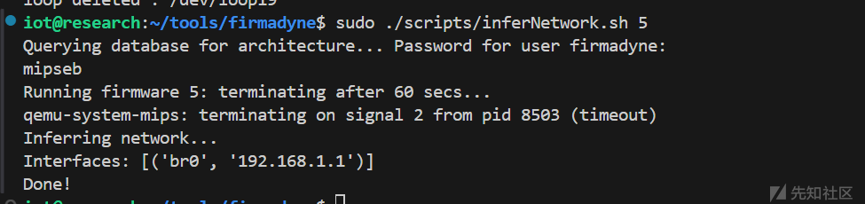

可以看见启动日志：

```
iot@research:~/tools/firmadyne$ cat ./scratch/1/qemu.final.serial.log
```

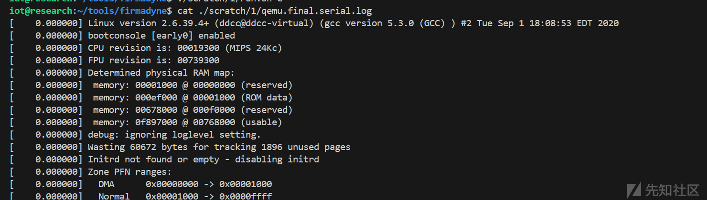这里会直接模拟运行只运行60秒，然后再通过makeNetwork.py来获取网络配置等信息！

#### inferNetwork.sh源码解析

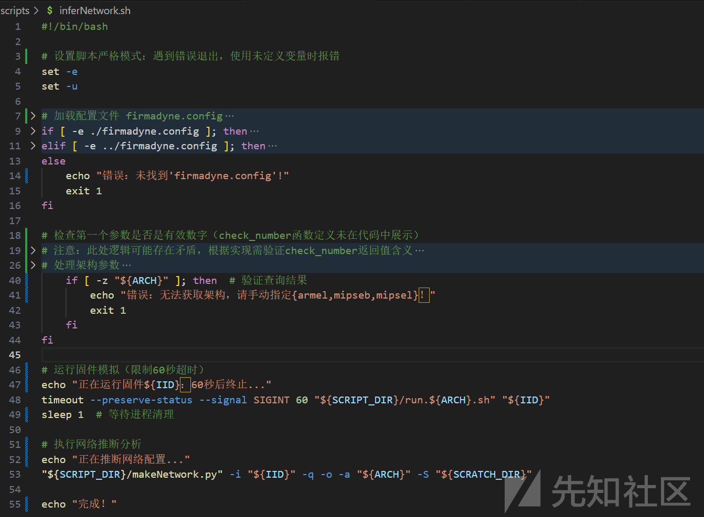该脚本是物联网设备固件分析工具链中的核心组件、主要承担网络配置自动推断功能。其设计目标是通过模拟运行环境快速提取固件的网络服务信息、为后续安全分析提供基础数据。

这里的核心脚本就两个一个是调用Python脚本makeNetwork.py，一个是run.sh固件启动脚本（后面分析）

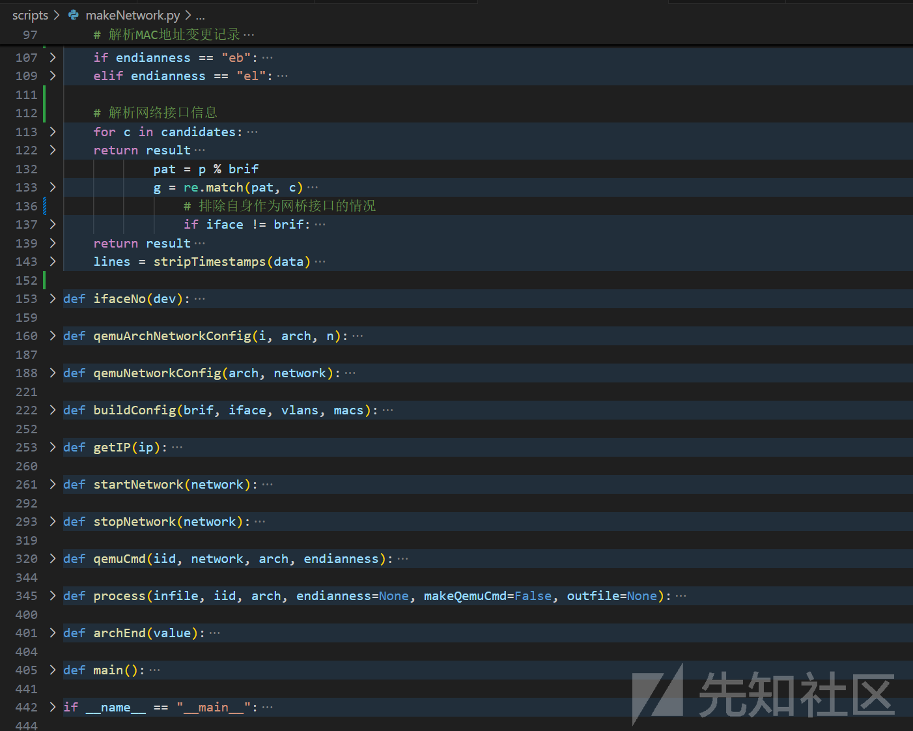该脚本通过分析固件模拟日志提取网络配置信息，具体流程如下：**信息获取方式：**

1. **接口IP解析** ：通过过滤日志中的`__inet_insert_ifa`条目，提取非回环接口的IP地址（如192.168.1.1）
2. **MAC变更追踪** ：解析`ioctl_SIOCSIFHWADDR`日志，获取接口MAC地址修改记录
3. **桥接关系识别** ：分析`br_dev_ioctl`和`br_add_if`日志，确定网络接口的桥接关系
4. **VLAN信息提取** ：通过`register_vlan_dev`日志获取接口的VLAN ID配置

**获取的关键信息：**

1. 网络接口列表（包含设备名和IP地址）
2. MAC地址修改记录（接口与MAC对应关系）
3. 桥接配置信息（桥接接口与成员接口关系）
4. VLAN配置信息（接口与VLAN ID对应关系）

**处理流程：**

1. 日志预处理：去除时间戳并过滤有效日志条目
2. 信息整合：将接口IP、MAC、桥接关系、VLAN信息进行关联
3. 配置生成：为每个网络接口创建包含IP/设备名/VLAN/MAC的元组
4. 命令生成：根据目标架构生成对应的QEMU网络配置命令

**最终输出：** 包含完整网络配置的QEMU启动脚本，支持以下特性：

* 多网卡配置（最多4个接口）
* VLAN支持（802.1Q）
* MAC地址指定
* TAP设备与主机网络桥接
* 路由配置（自动添加到模拟环境的路由条目）

该脚本通过解析固件运行时的内核日志，自动推导出目标系统的网络拓扑结构，为后续的固件仿真提供精确的网络环境配置。

### 六，固件仿真运行

运行仿真环境:最后在执行完上一步后，会在`./scratch/5`目录下多出一个`run.sh`，其中run.sh会创建一个新的虚拟网卡，并且将ip设置为提取到的固定ip网段。

```
iot@research:~/tools/firmadyne$ sudo ./scratch/5/run.sh 
```

到这里大概率就已经成功了！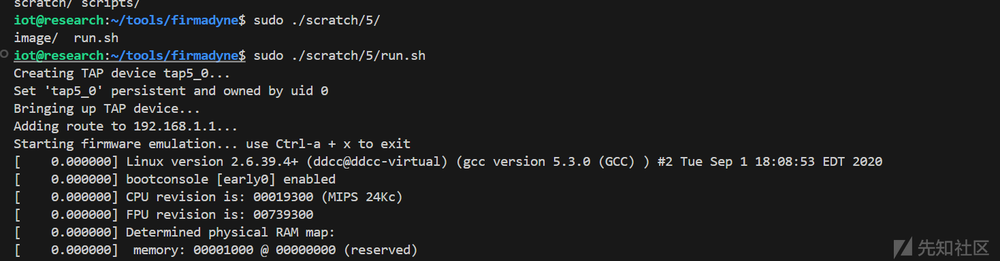

#### run.sh启动脚本解析

```
#!/bin/bash
# 启用未定义变量检查
set -u

# 初始化默认架构和镜像ID
ARCHEND=mipseb   # 默认架构类型（大端序MIPS）
IID=1            # 默认固件镜像ID

# 加载配置文件（支持三级目录查找）
if [ -e ./firmadyne.config ]; then
    source ./firmadyne.config
elif [ -e ../firmadyne.config ]; then
    source ../firmadyne.config
elif [ -e ../../firmadyne.config ]; then
    source ../../firmadyne.config
else
    echo "错误：找不到'firmadyne.config'配置文件！"
    exit 1
fi

# 获取各组件路径
IMAGE=$(get_fs ${IID})        # 获取文件系统镜像路径
KERNEL=$(get_kernel ${ARCHEND}) # 获取内核文件路径
QEMU=$(get_qemu ${ARCHEND})    # 获取QEMU可执行文件路径
QEMU_MACHINE=$(get_qemu_machine ${ARCHEND}) # 获取QEMU机器类型
QEMU_ROOTFS=$(get_qemu_disk ${ARCHEND})    # 获取根文件系统参数
WORK_DIR=$(get_scratch ${IID})            # 获取工作目录路径

# 配置网络接口
TAPDEV_0=tap${IID}_0          # 定义TAP设备名称
HOSTNETDEV_0=${TAPDEV_0}      # 主机端网络设备名称
echo "正在创建TAP设备 ${TAPDEV_0}..."
sudo tunctl -t ${TAPDEV_0} -u ${USER} # 创建用户级虚拟网卡

# 配置网络参数
echo "启动TAP设备..."
sudo ip link set ${HOSTNETDEV_0} up     # 激活网络接口
sudo ip addr add 192.168.0.99/24 dev ${HOSTNETDEV_0} # 分配IP地址

echo "添加路由到192.168.0.100..."
sudo ip route add 192.168.0.100 via 192.168.0.100 dev ${HOSTNETDEV_0} # 设置静态路由

# 定义清理函数
function cleanup {
    echo "终止所有子进程..."
    pkill -P $$  # 杀死当前进程的所有子进程
    
    echo "清理路由表..."
    sudo ip route flush dev ${HOSTNETDEV_0}  # 清除相关路由
    
    echo "关闭TAP设备..."
    sudo ip link set ${TAPDEV_0} down  # 禁用网络接口
    
    echo "删除TAP设备 ${TAPDEV_0}..."
    sudo tunctl -d ${TAPDEV_0}  # 删除虚拟网卡设备
}

# 注册退出处理
trap cleanup EXIT  # 脚本退出时自动执行清理

# 启动QEMU模拟器
echo "正在启动固件模拟... 使用Ctrl-a + x退出"
sleep 1s  # 等待网络配置生效

# 执行QEMU命令（关键参数说明见注释）
${QEMU} -m 256 -M ${QEMU_MACHINE} -kernel ${KERNEL} \
    -drive if=ide,format=raw,file=${IMAGE} \
    -append "root=${QEMU_ROOTFS} console=ttyS0 nandsim.parts=64,64,64,64,64,64,64,64,64,64 rdinit=/firmadyne/preInit.sh rw debug ignore_loglevel print-fatal-signals=1 user_debug=31 firmadyne.syscall=0" \
    -nographic \
    -netdev tap,id=net0,ifname=${TAPDEV_0},script=no -device e1000,netdev=net0 \
    -netdev socket,id=net1,listen=:2001 -device e1000,netdev=net1 \
    -netdev socket,id=net2,listen=:2002 -device e1000,netdev=net2 \
    -netdev socket,id=net3,listen=:2003 -device e1000,netdev=net3 | tee ${WORK_DIR}/qemu.final.serial.log
```

该脚本为固件仿真提供标准化环境构建流程，核心工作分为三个阶段：环境初始化阶段加载工具链配置、动态获取硬件模拟组件路径；网络配置阶段创建虚拟TAP设备、设定隔离网段与路由策略；模拟执行阶段通过QEMU启动定制化虚拟机，注入特定内核参数与网络拓扑。其核心作用在于构建受控的固件运行沙箱，通过预设的网络隔离机制和日志记录功能，为物联网设备固件的动态分析提供基础执行环境，同时确保资源释放的完整性。

## firmadyne模拟过程中常见的巨坑！！！

### 进程崩溃，例如 `do_page_fault() #2: sending SIGSEGV for invalid read access from 00000000`

在固件模拟过程中，内核有时候会发出一些报错信息，分情况有些会影响模拟，有些不会：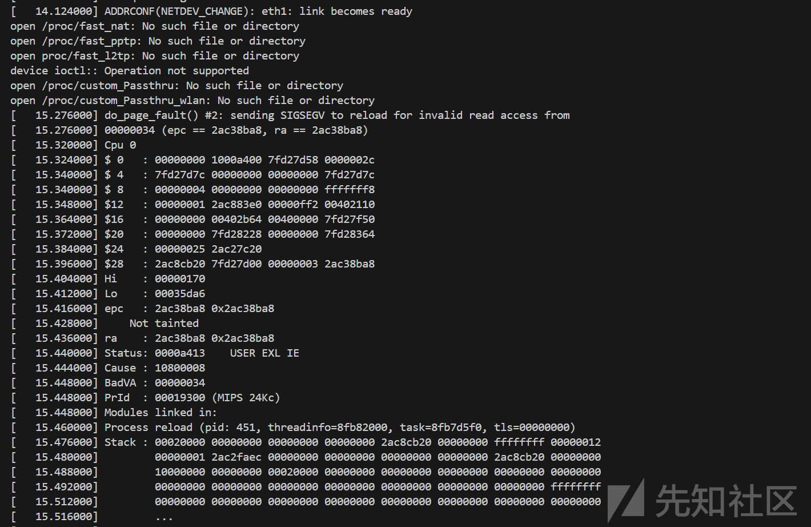很可能进程请求了一个 FIRMADYNE 没有默认值的 NVRAM 条目。这可以通过手动将 NVRAM 条目的来源添加到 `NVRAM_DEFAULTS_PATH`，将条目添加到 `NVRAM_DEFAULTS`，或将文件添加到 `libnvram` 中的 `OVERRIDE_POINT` 来修复。有关更多详细信息，请参阅 [libnvram 的文档](https://github.com/firmadyne/libnvram)。请注意，前两个选项涉及修改 `config.h`，这将需要重新编译 `libnvram`。

```
#ifndef INCLUDE_CONFIG_H
#define INCLUDE_CONFIG_H

// Determines whether debugging information should be printed to stderr.
#define DEBUG               1
// Determines the size of the internal buffer, used for manipulating and storing key values, etc.
#define BUFFER_SIZE         256
// Determines the size of the "emulated" NVRAM, used by nvram_get_nvramspace().
#define NVRAM_SIZE          2048
// Determines the maximum size of the user-supplied output buffer when a length is not supplied.
#define USER_BUFFER_SIZE    64
// Determines the unique separator character (as string) used for the list implementation. Do not use "\0".
#define LIST_SEP            "\xff"
// Special argument used to change the semantics of the nvram_list_exist() function.
#define LIST_MAGIC          0xdeadbeef
// Identifier value used to generate IPC key in ftok()
#define IPC_KEY             'A'
// Timeout for the semaphore
#define IPC_TIMEOUT         1000
// Mount point of the base NVRAM implementation.
#define MOUNT_POINT         "/firmadyne/libnvram/"
// Location of NVRAM override values that are copied into the base NVRAM implementation.
#define OVERRIDE_POINT      "/firmadyne/libnvram.override/"

// Define the semantics for success and failure error codes.
#define E_FAILURE  0
#define E_SUCCESS  1

// Default paths for NVRAM default values.
#define NVRAM_DEFAULTS_PATH \
    /* "DIR-505L_FIRMWARE_1.01.ZIP" (10497) */ \
    PATH("/var/etc/nvram.default") \
    /* "DIR-615_REVE_FIRMWARE_5.11.ZIP" (9753) */ \
    PATH("/etc/nvram.default") \
    /* "DGL-5500_REVA_FIRMWARE_1.12B05.ZIP" (9469) */ \
    TABLE(router_defaults) \
    PATH("/etc/nvram.conf") \
    PATH("/etc/nvram.deft") \
    PATH("/etc/nvram.update") \
    TABLE(Nvrams) \
    PATH("/etc/wlan/nvram_params") \
    PATH("/etc/system_nvram_defaults")

// Default values for NVRAM.
#define NVRAM_DEFAULTS \
    /* Linux kernel log level, used by "WRT54G3G_2.11.05_ETSI_code.bin" (305) */ \
    ENTRY("console_loglevel", nvram_set, "7") \
    /* Reset NVRAM to default at bootup, used by "WNR3500v2-V1.0.2.10_23.0.70NA.chk" (1018) */ \
    ENTRY("restore_defaults", nvram_set, "1") \
    ENTRY("sku_name", nvram_set, "") \
    ENTRY("wla_wlanstate", nvram_set, "") \
    ENTRY("lan_if", nvram_set, "br0") \
    ENTRY("lan_ipaddr", nvram_set, "192.168.0.50") \
    ENTRY("lan_bipaddr", nvram_set, "192.168.0.255") \
    ENTRY("lan_netmask", nvram_set, "255.255.255.0") \
    /* Set default timezone, required by multiple images */ \
    ENTRY("time_zone", nvram_set, "EST5EDT") \
    /* Set default WAN MAC address, used by "NBG-416N_V1.00(USA.7)C0.zip" (12786) */ \
    ENTRY("wan_hwaddr_def", nvram_set, "01:23:45:67:89:ab") \
    /* Attempt to define LAN/WAN interfaces */ \
    ENTRY("wan_ifname", nvram_set, "eth0") \
    ENTRY("lan_ifnames", nvram_set, "eth1 eth2 eth3 eth4") \
    /* Used by "TEW-638v2%201.1.5.zip" (12898) to prevent crash in 'goahead' */ \
    ENTRY("ethConver", nvram_set, "1") \
    /* Used by "Firmware_TEW-411BRPplus_2.07_EU.zip" (13649) to prevent crash in 'init' */ \
    ENTRY("lan_proto", nvram_set, "dhcp") \
    ENTRY("wan_ipaddr", nvram_set, "0.0.0.0") \
    ENTRY("wan_netmask", nvram_set, "255.255.255.0") \
    ENTRY("wanif", nvram_set, "eth0") \
    /* Used by "DGND3700 Firmware Version 1.0.0.17(NA).zip" (3425) to prevent crashes */ \
    ENTRY("time_zone_x", nvram_set, "0") \
    ENTRY("rip_multicast", nvram_set, "0") \
    ENTRY("bs_trustedip_enable", nvram_set, "0")

#endif
```

### Binwalk的一个巨坑-符号链接错误

仔细看 `binwalk` 的提取信息，会发现很多如下警告

```
WARNING: Symlink points outside of the extraction directory: /home/kali/Work/IOT/DIR_815/_tpra_sr20v1_us-up-ver1-2-1-P522_20180518-rel77140_2018-05-21_08.42.04.bin.extracted/squashfs-root/var -> /tmp; changing link target to /dev/null for security purposes.
```

注意：如果上图中出现 `var -> /dev/null`，说明是有问题的意思是：原本文件中存在的软链接指向了提取目录之外

就比如当前的 `var` 目录，它指向的是 Kali Linux 本机的 `/tmp` 目录（实际上应该指向路由器的 `/tmp` 目录，而不是本机的 `/tmp` 目录），为了安全考虑，`binwalk` 将这种软链接都置成了 `/dev/null`

> 这里如果放任不管，后面进行路由器的仿真会失败，比如路由器的某个服务需要去访问 `var` 目录下的文件，但它如果被置成 `/dev/null` 的话，目录自然是缺失的

解决方法是找到 `binwalk` 安装路径下的 `/modules` 文件夹，修改其中的 `extractor.py` 文件

如果是通过 `apt` 安装的 `binwalk`，不知道安装路径在哪里，使用如下命令搜索：

寻找binwalk的位置：

```
┌──(kali㉿kali)-[~/Work/IOT/DIR_815]
└─$ sudo find / -name binwalk
/usr/bin/binwalk
/usr/lib/python3/dist-packages/binwalk
/usr/lib/python3/dist-packages/binwalk/magic/binwalk
/usr/share/doc/binwalk
/home/kali/.config/binwalk
find: ‘/run/user/1000/gvfs’: Permission denied
```

找到 `extractor.py` 文件后，搜索：`"os.devnull"`，大概在文件的最末尾，1008 行，将 `if not ...` 改为 `if 0 and not ...`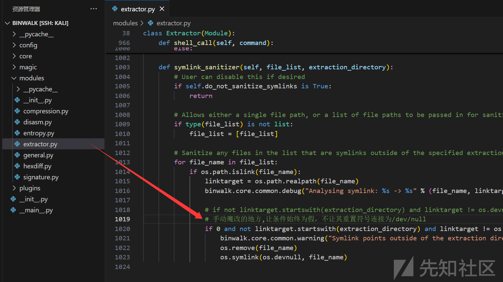然后使用 `binwalk` 重新解压固件，即可得到 `var -> /tmp` 的文件系统（如果是自行编译安装的 `binwalk`，可能需要首先在 `binwalk` 安装根目录下使用 `sudo python3 setup.py install` 重新安装一下再解压）：

成功修复：

```
┌──(kali㉿kali)-[~/Work/IOT/DIR_815]
└─$ tree | grep ">"
# tree | grep "->" 这个会报错！
```

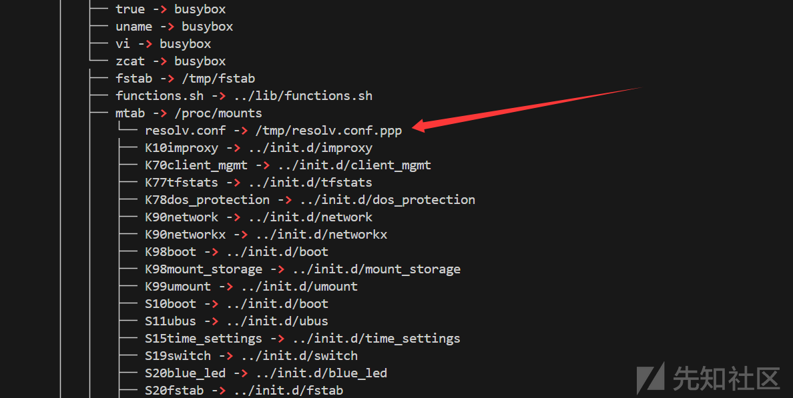

## **Firmadyne固件模拟成功的完整流程**

#### **1. 重置数据库环境**

```
# 清理原有数据库（需输入正确PostgreSQL密码）
./reset.sh 
```

*注意：需确保数据库用户*`firmadyne`*的密码正确，否则需修复认证配置。*

#### **2. 固件提取与信息记录**

```
# 提取固件文件系统并记录到数据库（镜像ID=3）
sudo python3 ./sources/extractor/extractor.py -b test -sql 127.0.0.1 -np -nk ./TestFirmware/RB-1732_TC_v2.0.43.bin images
```

**关键输出：**

* 镜像ID: `3`
* MD5: `27b91f4216466031eaa7b039a7717b93`
* 提取路径: `/tmp/tmp3awleqb7/_RB-1732_TC_v2.0.43.bin.extracted/squashfs-root`
* 文件系统类型: `Squashfs (little endian, LZMA压缩)`

#### **3. 确定固件架构**

```
# 检测固件架构为MIPS大端（mipseb）
sudo ./scripts/getArch.sh ./images/3.tar.gz 
```

**输出：** `mipseb`

#### **4. 导入文件系统到数据库**

```
# 将文件系统元数据关联到镜像ID 3
sudo ./scripts/tar2db.py -i 3 -f ./images/3.tar.gz
```

#### **5. 构建可模拟的QEMU镜像**

```
# 创建镜像文件并挂载文件系统
sudo ./scripts/makeImage.sh 3
```

**关键步骤：**

* 创建镜像文件 `image.raw`（大小 32MB）
* 分区格式化（Linux文件系统，UUID `ca337a66-ab4f-4b15-b15f-e5196cfed199`）
* 解压文件系统并修补（自动处理时区、密码、设备节点）

#### **6. 推断网络配置**

```
# 模拟启动并捕获网络接口信息
sudo ./scripts/inferNetwork.sh 3
```

**输出：**

* 检测到接口 `br0`，IP地址 `192.168.1.1`

#### **7. 启动固件模拟环境**

```
# 进入镜像目录并运行QEMU模拟
cd ./scratch/3/
sudo ./run.sh
```

**关键操作：**

* 创建TAP设备 `tap3_0`
* 设置路由指向 `192.168.1.1`
* 启动QEMU虚拟机（使用 `Ctrl+a + x` 退出）

账号密码是root和password！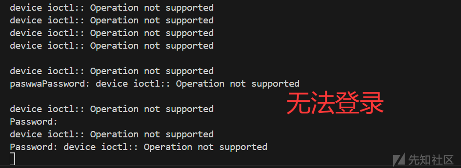使用http协议访问后就可以成功进入了！<http://192.168.1.1>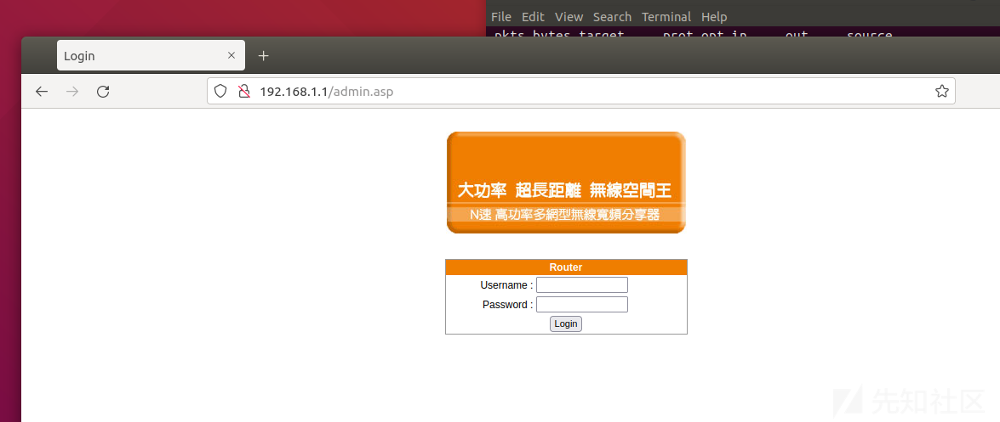

## 参考资料

* 学习的开源项目：<https://github.com/firmadyne/firmadyne>
* [[零基础学IoT Pwn] 环境搭建 - VxerLee昵称已被使用 - 博客园](https://www.cnblogs.com/VxerLee/p/16427304.html)
* [firmadyne 详解 - So who are you](https://kms.app/archives/314/)
