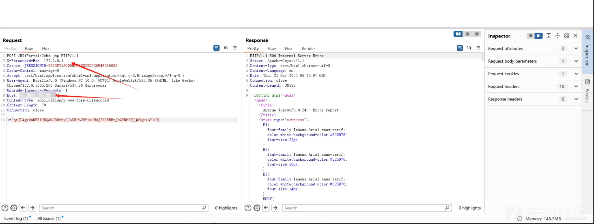
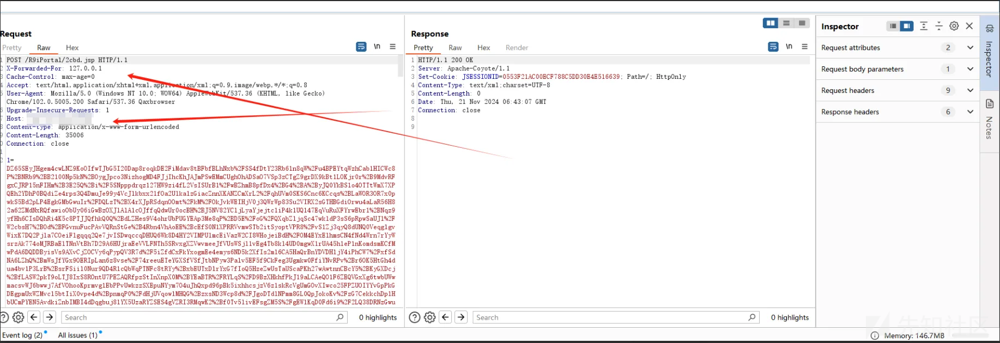
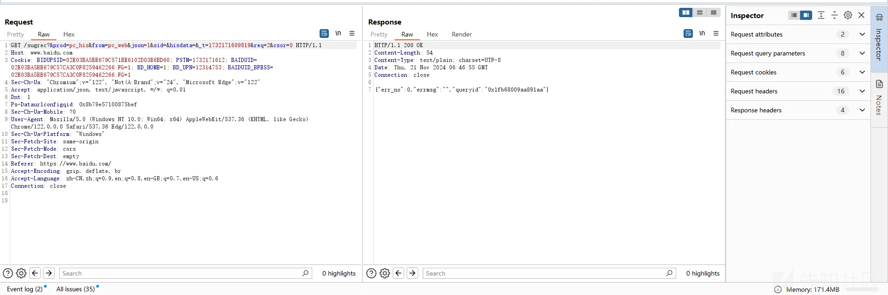
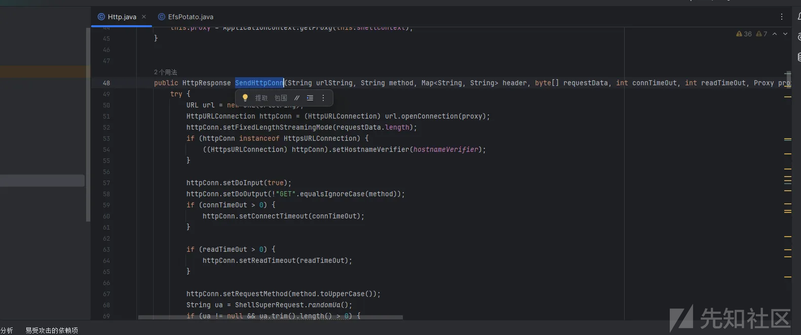
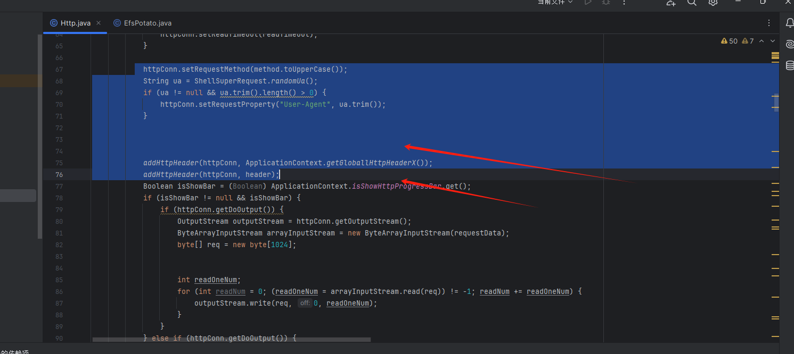
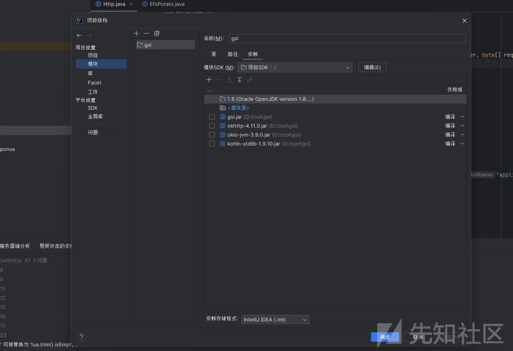
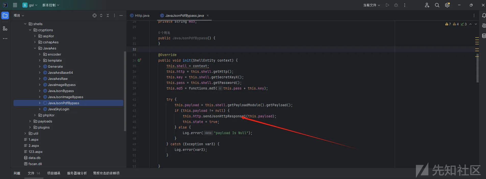
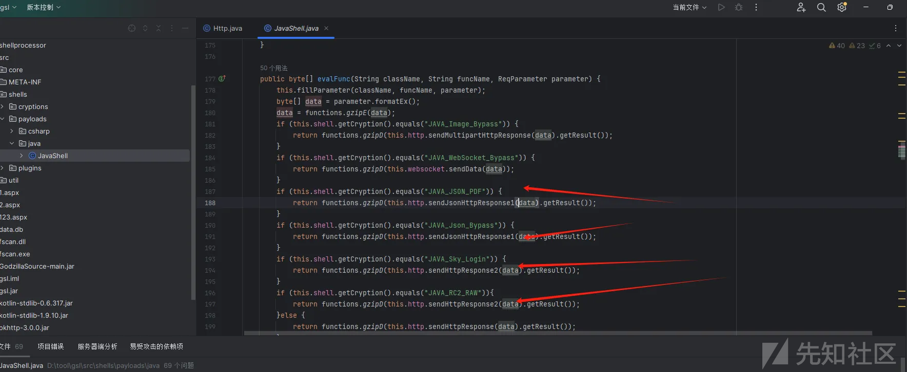

# 哥斯拉http特征修改-先知社区

> **来源**: https://xz.aliyun.com/news/17242  
> **文章ID**: 17242

---

哥斯拉http请求特征如下：



连接时，根据数据包的header头顺序，可以明显看到Host头在后面，这是一个非常明显的特征，在人为防守时，可以第一时间判断，该数据包不是一个正常的浏览器访问请求：

浏览器访问请求数据包如下：

header头有个明显的顺序





这个特征的处理点在 util/http/http.java文件里面，具体方法函数为SendHttpConn



观察这个函数对header的处理，

```
httpConn.setRequestMethod(method.toUpperCase());
String ua = ShellSuperRequest.randomUa();
if (ua != null && ua.trim().length() > 0) {
    httpConn.setRequestProperty("User-Agent", ua.trim());
}


addHttpHeader(httpConn, ApplicationContext.getGloballHttpHeaderX());
addHttpHeader(httpConn, header);
```




获取全局配置中的hader，按道理来说，全局配置中的header值有先后顺序，但是发包并没有按照那个顺序来

原因：

```
URL url = new URL(urlString);
HttpURLConnection httpConn = (HttpURLConnection) url.openConnection(proxy);
```

哥斯拉的http请求是用的HttpURLConnection，HttpURLConnection不支持对header的顺序的处理

因此我们这里调用okhttp来代替HttpURLConnection

导入okhttp包

<https://repo1.maven.org/maven2/com/squareup/okhttp3/okhttp/4.10.0/okhttp-4.10.0.jar>

这里的其他包同样的在maven上下载



编写请求方法：

```
public OkHttpHttpResponse sendHttpConnWithOkHttp(String urlString, String method, Map<String, String> header, byte[] requestData, int connTimeOut, int readTimeOut, Proxy proxy) {
    try {
        // 创建 OkHttpClient 并设置代理
        OkHttpClient.Builder clientBuilder = new OkHttpClient.Builder()
                .connectTimeout(connTimeOut, java.util.concurrent.TimeUnit.MILLISECONDS)
                .readTimeout(readTimeOut, java.util.concurrent.TimeUnit.MILLISECONDS);

        if (proxy != null) {
            clientBuilder.proxy(proxy);
        }

        OkHttpClient client = clientBuilder.build();

        // 创建请求体
        RequestBody requestBody = requestData != null ? RequestBody.create(requestData, MediaType.parse("application/octet-stream")) : null;
        // 构建请求
        Request.Builder requestBuilder = new Request.Builder()
                .url(urlString)
                .method(method.toUpperCase(), "GET".equalsIgnoreCase(method) ? null : requestBody);

        URL url = new URL(urlString);
        //这里是对host头的处理
        String host = url.getHost();
        int port = url.getPort();
        if (port != -1) {
            host += ":" + port;
        }
        //这里是对其他头的处理
        Map<String, String> combinedHeaders = new HashMap<>(ApplicationContext.getGloballHttpHeaderX());
        combinedHeaders.putAll(header); // 如果 `header` 中有相同的键，会覆盖全局的值
        requestBuilder.addHeader("Host", host);
        for (Map.Entry<String, String> entry : combinedHeaders.entrySet()) {
            requestBuilder.addHeader(entry.getKey(), entry.getValue());
        }
        // 执行请求
        Request request = requestBuilder.build();
        Response response = client.newCall(request).execute();

        return new OkHttpHttpResponse(response, this.shellContext);
    } catch (Exception e) {
        Log.error(e);
        return null;
    }
}
```

之后，对response进行处理，这里直接参考之前的reponse方法

```
protected void handleHeader(Headers headers) {
    this.headerMap = (Map<String, List<String>>) (Map) headers.toMultimap();

    try {
        List<String> messageHeader = headers.values("message");
        this.message = (messageHeader != null && !messageHeader.isEmpty()) ? messageHeader.get(0) : null;
        Http http = this.shellEntity.getHttp();
        CookieManager cookieManager = http.getCookieManager();
        cookieManager.put(URI.create(String.valueOf(http.getUri())), headers.toMultimap());

        List<HttpCookie> cookies = cookieManager.getCookieStore().get(URI.create(String.valueOf(http.getUri())));
        StringBuilder sb = new StringBuilder();
        cookies.forEach(cookie -> sb.append(String.format(" %s=%s;", cookie.getName(), cookie.getValue())));

        if (sb.length() > 0) {
            String cookieAll = sb.toString().trim();
            this.shellEntity.getHeaders().put("Cookie", cookieAll.substring(0, cookieAll.length() - 1));
        }
    } catch (IOException e) {
        e.printStackTrace();
    }
}
```

```
protected void readAllData(InputStream inputStream) throws IOException {
    try {
        if (this.headerMap.get("Content-Length") != null && this.headerMap.get("Content-Length").size() > 0) {
            int maxLen = Integer.parseInt(this.headerMap.get("Content-Length").get(0));
            this.result = this.readKnownNumData(inputStream, maxLen);
        } else {
            this.result = this.readUnknownNumData(inputStream);
        }
    } catch (NumberFormatException e) {
        this.result = this.readUnknownNumData(inputStream);
    }

    this.result = this.shellEntity.getCryptionModule().decode(this.result);
}
```

上面的是对数据的处理

之后在http.java中，调用response函数

```

public OkHttpHttpResponse sendHttpResponse2(Map<String, String> header, byte[] requestData, int connTimeOut, int readTimeOut) {
    requestData = this.shellContext.getCryptionModule().encode(requestData);
    String left = this.shellContext.getReqLeft();
    String right = this.shellContext.getReqRight();
    if (this.shellContext.isSendLRReqData()) {
        byte[] leftData = left.getBytes();
        byte[] rightData = right.getBytes();
        requestData = (byte[]) ((byte[]) functions.concatArrays(functions.concatArrays(leftData, 0, (leftData.length > 0 ? leftData.length : 1) - 1, requestData, 0, requestData.length - 1), 0, leftData.length + requestData.length - 1, rightData, 0, (rightData.length > 0 ? rightData.length : 1) - 1));
    }

    return this.sendHttpConnWithOkHttp(this.shellContext.getUrl(), this.requestMethod, header, requestData, connTimeOut, readTimeOut, this.proxy);
}


public OkHttpHttpResponse sendHttpResponse2(byte[] requestData, int connTimeOut, int readTimeOut) {
    return this.sendHttpResponse2(this.shellContext.getHeaders(), requestData, connTimeOut, readTimeOut);
}

public OkHttpHttpResponse sendHttpResponse2(byte[] requestData) {
    return this.sendHttpResponse2(requestData, this.shellContext.getConnTimeout(), this.shellContext.getReadTimeout());
}
```

最后，在函数处理中，修改常规请求方法




