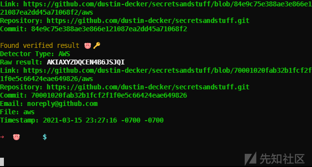
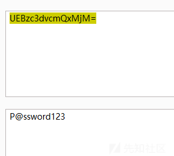
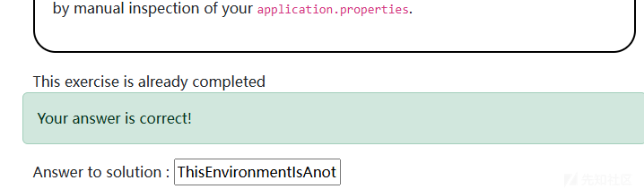

# 攻防视角下的敏感信息泄露之检测与防护-先知社区

> **来源**: https://xz.aliyun.com/news/17251  
> **文章ID**: 17251

---

# 攻防视角下的敏感信息泄露之检测与防护

## 前言

在日常渗透测试和安全研究中，敏感信息泄露一直是个老生常谈的话题，但是找起来的时候可能无从下手，结合OWASP总结下来的场景，每种都会进行详细的分析，并提出利用和防护思路

## 集中式硬编码密码

**描述**  
当人们编写概念验证时，他们通常从硬编码的密钥开始，例如代码中的密码。如果我们忘记删除这些硬编码的密钥怎么办？

您能发现我们在 Java 代码中寻找的秘密吗？在容器中查找它怎么样？

有时，更简单的工具是最有效的。尝试克隆存储库并使用 grep 查看您找到的内容。也可以使用 Git-secrets 或 Trufflehog 进行查找。只需深入研究代码即可！

### 基础

首先我们了解一下什么是集中式硬编码密码  
集中式硬编码密码是指将密码直接写入到程序代码中的一种做法，并且这些密码通常是被集中管理或存储在一个特定的位置。

这里直接举一个例子

```
# 硬编码密码的例子
def connect_to_database():
    db_host = "localhost"
    db_user = "admin"
    db_password = "password123"  # 这是一个硬编码的密码
    # 连接到数据库
    db_connection = f"mysql -h {db_host} -u {db_user} -p{db_password}"
    print("连接到数据库成功")

```

可以看到数据库的账号和密码没有经过任何的处理，直接展现在了代码中

### progress

题目给了代码库<https://github.com/OWASP/wrongsecrets/tree/master/src/main/java/org/owasp/wrongsecrets>

当然可以直接搜索，在 github 中但是还有其他的不必要的代码  
这里选择直接下载下来，因为 linux 中有 grep 命令可以匹配

```
grep [OPTIONS] PATTERN [FILE...]

PATTERN：要查找的文本模式，可以是简单的字符串或正则表达式。
FILE：要搜索的文件。如果不指定文件，grep 会从标准输入读取数据。
```

然后我们先下载

```
┌──(root㉿kali)-[/home/lll]
└─# git clone https://github.com/OWASP/wrongsecrets
正克隆到 'wrongsecrets'...
remote: Enumerating objects: 32803, done.
remote: Counting objects: 100% (97/97), done.
remote: Compressing objects: 100% (52/52), done.
remote: Total 32803 (delta 49), reused 91 (delta 45), pack-reused 32706 (from 1)
接收对象中: 100% (32803/32803), 84.02 MiB | 1.97 MiB/s, 完成.
处理 delta 中: 100% (18771/18771), 完成.

```

下载完成之后查找

首先我们需要递归查找，以免漏掉了

#### 方法一

-r 或 --recursive 选项表示递归地在目录中搜索。即不仅会搜索指定文件中的内容，还会搜索指定目录及其所有子目录中的文件。  
结果如下

```
┌──(root㉿kali)-[/home/…/java/org/owasp/wrongsecrets]
└─# grep -r -E "password|passwd"
RuntimeEnvironment.java:  @Value("${vaultpassword}")
SecurityConfig.java:                        .password("{noop}" + auth.password())
BasicAuthentication.java:    String username, String password, String role, String urlPattern) {}
challenges/docker/WrongSecretsConstants.java:  public static final String password = "DefaultLoginPasswordDoNotChange!";
challenges/docker/Challenge41.java:/** This is a challenge based on finding secret using password shucking. */
challenges/docker/Challenge41.java:  private final String password;
challenges/docker/Challenge41.java:  public Challenge41(@Value("${challenge41password}") String password) {
challenges/docker/Challenge41.java:    this.password = password;
challenges/docker/Challenge41.java:    return new Spoiler(base64Decode(password));
challenges/docker/Challenge41.java:      String hash = bcrypt.encode(hashWithMd5(base64Decode(password)));
challenges/docker/Challenge34.java:import org.springframework.security.crypto.password.Pbkdf2PasswordEncoder;
challenges/docker/Challenge2.java: * This challenge requires the participant to provide a hardcoded password to pass the challenge.
challenges/docker/Challenge2.java:   * @param hardcodedPassword The hardcoded password for the challenge.
challenges/docker/Challenge2.java:  public Challenge2(@Value("${password}") String hardcodedPassword) {
challenges/docker/Challenge14.java:/** This challenge is about having a weak password for your password manager. */
challenges/docker/Challenge14.java:      @Value("${keepasxpassword}") String keepassxPassword,
challenges/docker/Challenge1.java:/** Challenge to find the hardcoded password in code. */
challenges/docker/Challenge1.java:    return WrongSecretsConstants.password;
challenges/docker/authchallenge/Challenge37.java:  private static final String password = "YjNCbGJpQnpaWE5oYldVPQo=";
challenges/docker/authchallenge/Challenge37.java:            Base64.decode(new String(Base64.decode(password), Charset.defaultCharset())),
challenges/kubernetes/Vaultpassword.java:/** Class used to get password from vault using the springboot cloud integration with vault. */
challenges/kubernetes/Vaultpassword.java:@ConfigurationProperties("vaultpassword")
challenges/kubernetes/Vaultpassword.java:public class Vaultpassword {
challenges/kubernetes/Vaultpassword.java:  private String password;
challenges/kubernetes/Vaultpassword.java:  public void setPassword(String password) {
challenges/kubernetes/Vaultpassword.java:    this.password = password;
challenges/kubernetes/Vaultpassword.java:    return password;
challenges/kubernetes/MetaDataChallenge.java:      @Value("${vaultpassword}") String vaultPasswordString,
challenges/kubernetes/Challenge7.java:  private final Vaultpassword vaultPassword;
challenges/kubernetes/Challenge7.java:      Vaultpassword vaultPassword, @Value("${vaultpassword}") String vaultPasswordString) {
challenges/kubernetes/VaultSubKeyChallenge.java:      @Value("${vaultpassword}") String vaultPasswordString,
WrongSecretsApplication.java:import org.owasp.wrongsecrets.challenges.kubernetes.Vaultpassword;
WrongSecretsApplication.java:@EnableConfigurationProperties({Vaultpassword.class, Vaultinjected.class})

```

大概看一看应该就可以知道是在

```
challenges/docker/authchallenge/Challenge37.java:  private static final String password = "YjNCbGJpQnpaWE5oYldVPQo=";
challenges/docker/authchallenge/Challenge37.java:            Base64.decode(new String(Base64.decode(password), 
```

解码之后交了也不对，离谱

不过不重要，学习收集的方法就 ok 了

#### **方法二**

其实目前已经有很多工具可以使用了比如 Trufflehog

Trufflehog

TruffleHog 是最强大的密钥发现、分类、验证和分析工具。在此上下文中，secret 是指计算机用于向另一台计算机验证自身的凭据。这包括 API 密钥、数据库密码、私有加密密钥等...  
大概效果如下  


如何安装就不说了简单说一下怎么使用

首先下载一下

```
┌──(root㉿kali)-[/home/lll/wrongsecrets]
└─# wget https://raw.githubusercontent.com/trufflesecurity/trufflehog/main/examples/generic.yml
--2024-11-18 21:08:28--  https://raw.githubusercontent.com/trufflesecurity/trufflehog/main/examples/generic.yml
正在解析主机 raw.githubusercontent.com (raw.githubusercontent.com)... 185.199.108.133, 185.199.110.133, 185.199.109.133, ...
正在连接 raw.githubusercontent.com (raw.githubusercontent.com)|185.199.108.133|:443... 已连接。
已发出 HTTP 请求，正在等待回应... 200 OK
长度：455 [text/plain]
正在保存至: “generic.yml”

generic.yml                          100%[======================================================================>]     455  --.-KB/s  用时 0s      

2024-11-18 21:08:32 (3.53 MB/s) - 已保存 “generic.yml”
```

完成之后我们可以使用了  
大概的效果如下，可以看到给出了类型和地段

```
┌──(root㉿kali)-[/home/lll/wrongsecrets]
└─# trufflehog filesystem --config=$PWD/generic.yml $PWD
🐷🔑🐷  TruffleHog. Unearth your secrets. 🐷🔑🐷

Found unverified result 🐷🔑❓
Detector Type: CustomRegex                                                                                                                          
Decoder Type: PLAIN                                                                                                                                 
Raw result: Password="uzsmJV29aLxsikOElqENg9O2dUkuY6Q4zg6ysYaO4HE="                                                                                 
Name: generic-api-key
File: /home/lll/wrongsecrets/.github/scripts/.bash_history                                                                                          
Line: 349                                                                                                                                           
                                                                                                                                                    
Found unverified result 🐷🔑❓
Detector Type: CustomRegex                                                                                                                          
Decoder Type: PLAIN                                                                                                                                 
Raw result: Password="uzsmJV29aLxsikOElqENg9O2dUkuY6Q4zg6ysYaO4HE="                                                                                 
Name: generic-api-key
File: /home/lll/wrongsecrets/.github/scripts/.bash_history                                                                                          
Line: 318                                                                                                                                           
                                                                                                                                                    
Found unverified result 🐷🔑❓
Detector Type: CustomRegex                                                                                                                          
Decoder Type: PLAIN                                                                                                                                 
Raw result: secrets:local-test                                                                                                                      
Name: generic-api-key
File: /home/lll/wrongsecrets/.github/scripts/docker-create.sh                                                                                       
Line: 11                                                                                                                                            
                                                                                                                                                    
Found unverified result 🐷🔑❓
Detector Type: CustomRegex                                                                                                                          
Decoder Type: PLAIN                                                                                                                                 
Raw result: secrets:local-test                                                                                                                      
Name: generic-api-key
File: /home/lll/wrongsecrets/.github/scripts/docker-create.sh                                                                                       
Line: 139                                                                                                                                           
                                                                                                                                                    
Found unverified result 🐷🔑❓
Detector Type: CustomRegex                                                                                                                          
Decoder Type: PLAIN                                                                                                                                 
Raw result: secrets:latest-local-vault                                                                                                              
Name: generic-api-key
File: /home/lll/wrongsecrets/.github/scripts/docker-create.sh                                                                                       
Line: 73      
```

但是结果很多,我们只需要密码的话还可以匹配一下

```
┌──(root㉿kali)-[/home/lll/wrongsecrets]
 └─#  trufflehog filesystem --config=$PWD/generic.yml . | grep password 
 🐷🔑🐷  TruffleHog. Unearth your secrets. 🐷🔑🐷
 
 Raw result: password: 652e1f46-bad4-48e2-983e-8534a4748796|
 Raw result: secret_string = random_password.password.result
 Raw result: secret_data = random_password.password.result
 Raw result: secret_data = random_password.password.result
 Raw result: password = "YjNCbGJpQnpaWE5oYldVPQo="
 Raw result: password = "YjNCbGJpQnpaWE5oYldVPQo="
 Raw result: password = "b3BlbiBzZXNhbWU=
 Raw result: password = "b3BlbiBzZXNhbWU=
 Raw result: password=ThisEnvironmentIsAnotherPlaceToHide
 Raw result: password=UEBzc3dvcmQxMjM=
 Raw result: password=if_you_see_this_please_use_K8S_and_Vault
 Raw result: password=welcome123
 Raw result: password=UEBzc3dvcmQxMjM=
 Raw result: password=ACTUAL_ANSWER_CHALLENGE7
 Raw result: password=if_you_see_this_please_use_K8S_and_Vault
 Raw result: password=welcome123
 Raw result: password=ACTUAL_ANSWER_CHALLENGE7
 
```

然后把 UEBzc3dvcmQxMjM=解码  
  
按理来说很像了，还是错的，不过不重要，思路 ok 就可以了

### 反思

现在，您可以知道您可以轻松检测代码中存储的许多密钥。即使代码已编译，您仍然可以对其进行逆向工程以查找密钥。这就是为什么硬编码的 secret 从来都不是一个好主意。我们经常陷入一种误解，即如果我不能对其进行逆向工程，那么攻击者也不能，这就是为什么许多人认为 C/C++/Golang 中的硬编码比 Java 中的硬编码更安全。

所以我们就不要在代码中直接放入我们的密码就好了

## 硬编码密码 2

### 基础

application.properties 文件

application.properties 是 Spring Boot 应用的配置文件，它用于定义应用的各种设置和属性。你可以在 application.properties 文件中配置数据库连接、日志设置、端口、Spring Boot 自动配置的参数等。

比如一个例子

```
# 服务器配置
server.port=8080
server.servlet.context-path=/myapp

# 数据库配置
spring.datasource.url=jdbc:mysql://localhost:3306/mydb
spring.datasource.username=root
spring.datasource.password=password
spring.datasource.driver-class-name=com.mysql.cj.jdbc.Driver
spring.jpa.hibernate.ddl-auto=update

# 日志配置
logging.level.org.springframework=INFO
logging.level.com.example=DEBUG
logging.file.name=myapp.log

# Thymeleaf 配置
spring.thymeleaf.cache=false
spring.thymeleaf.prefix=classpath:/templates/
spring.thymeleaf.suffix=.html

# Spring Security 配置
spring.security.user.name=admin
spring.security.user.password=secret

# Actuator 配置
management.endpoints.web.exposure.include=health,info
management.endpoint.health.show-details=always

# 自定义消息
message.welcome=欢迎来到我们的应用！

# 缓存配置
spring.cache.type=simple
spring.cache.cache-names=users,orders

```

可以看见里面还是有我们的数据库密码，用户密码啥的

### progress

题目描述  
开发人员没有直接对密码进行硬编码，而是尝试将其隐藏在 Spring Boot 的 application.properties 中。

这样，就不能再直接在 .java 或编译的 .class 文件中找到它。那么你怎么能检测到它呢？

您可以通过 SAST 解决方案（如 truffleHog 和 git-secrets）以及手动检查您的 application.properties 轻松检测到这一点。

首先找到这个文件很多方法

#### 方法一

直接在文件中查找  
可以使用 find 命令  
find 命令可以帮助你在指定目录及其子目录中搜索文件

```
┌──(root㉿kali)-[/home/lll/wrongsecrets]
└─# find ./ -name "application.properties"
./src/test/resources/config/application.properties
./src/main/resources/application.properties
```

然后两个文件都读取一下

```
┌──(root㉿kali)-[/home/lll/wrongsecrets]
└─# cat ./src/test/resources/config/application.properties
spring.cloud.vault.enabled=false
asciidoctor.enabled=true
hints_enabled=true
reason_enabled=true
spoiling_enabled=true
azure.keyvault.enabled=false
challengedockermtpath=./src/test/resources/
```

这个文件可以看出来是没有什么信息的  
看一下其他的

```
┌──(root㉿kali)-[/home/lll/wrongsecrets]
└─# cat ./src/main/resources/application.properties      
#spring.devtools.restart.additional-paths=src/main/resources/explanations
#spring.devtools.livereload.enabled=true
#spring.devtools.restart.enabled=true
spring.web.resources.cache.period=PT2H
server.compression.enabled=true
spring.config.import=classpath:/wrong-secrets-configuration.yaml
password=ThisEnvironmentIsAnotherPlaceToHide
SPECIAL_K8S_SECRET=if_you_see_this_please_use_k8s
SPECIAL_SPECIAL_K8S_SECRET=if_you_see_this_please_use_k8s
SEALED_SECRET_ANSWER=if_you_see_this_please_use_k8s
CHALLENGE33=if_you_see_this_please_use_k8s
ARG_BASED_PASSWORD=if_you_see_this_please_use_docker_instead
DOCKER_ENV_PASSWORD=if_you_see_this_please_use_docker_instead
vaultpassword=if_you_see_this_please_use_K8S_and_Vault
vaultinjected=if_you_see_this_please_use_K8S_and_Vault
challenge47secret=if_you_see_this_please_use_K8S_and_Vault
spring.cloud.vault.uri=https://tobediefined.org
spring.cloud.vault.authentication=NONE
spring.cloud.vault.role=none
spring.cloud.vault.kubernetes-path=none
spring.cloud.vault.scheme=https://tobediefined.org
spring.cloud.vault.kubernetes.service-account-token-file="none"
default_aws_value=if_you_see_this_please_use_AWS_Setup
default_aws_value_challenge_9=if_you_see_this_please_use_AWS_Setup
default_aws_value_challenge_10=if_you_see_this_please_use_AWS_Setup
default_aws_value_challenge_11=if_you_see_this_please_use_AWS_Setup
default_gcp_value=if_you_see_this_please_use_GCP_Setup
default_azure_value=if_you_see_this_please_use_Azure_Setup
AWS_ROLE_ARN=if_you_see_this_please_use_AWS_Setup
AWS_WEB_IDENTITY_TOKEN_FILE=if_you_see_this_please_use_AWS_Setup
FILENAME_CHALLENGE9=wrongsecret
FILENAME_CHALLENGE10=wrongsecret-2
springdoc.swagger-ui.path=/swagger-ui.html
springdoc.swagger-ui.enabled=true
springdoc.api-docs.enabled=true
springdoc.swagger-ui.csrf.enabled=true
springdoc.show-actuator=true
springdoc.model-and-view-allowed=true
spring.cloud.azure.keyvault.secret.property-source-enabled=false
spring.cloud.azure.keyvault.secret.property-sources[0].endpoint=https://default.placeholder.overriddenink8s.vars.localhost
spring.cloud.azure.keyvault.secret.property-sources[0].name=wrongsecret-3
wrongsecret-3=if_you_see_this_please_use_Azure_Setup
secretmountpath=/mnt/secrets-store
challengedockermtpath=/var/tmp/helpers
AWS_REGION=if_you_see_this_please_use_AWS_Setup
GOOGLE_CLOUD_PROJECT=if_you_see_this_please_use_GCP_Setup
K8S_ENV=DOCKER
APP_VERSION=@project.version@
logging.level.root=INFO
server.servlet.session.tracking-modes=COOKIE
asciidoctor.enabled=false
hints_enabled=true
ctf_enabled=false
spoiling_enabled=true
ctf_key=TRwzkRJnHOTckssAeyJbysWgP!Qc2T
challenge_rando_key_ctf_to_provide_to_host_value=not_set
challenge_thirty_ctf_to_provide_to_host_value=not_set
challenge_acht_ctf_to_provide_to_host_value=not_set
challenge_acht_ctf_host_value=not_set
CTF_SERVER_ADDRESS=not_set
reason_enabled=true
plainText13=This is not the secret
cipherText13=hRZqOEB0V0kU6JhEXdm8UH32VDAbAbdRxg5RMpo/fA8caUCvJhs=
keepasxpassword=welcome123
KEEPASS_BROKEN=if_you_see_this_please_fix_the_keepass_setup
keepasspath=/var/tmp/helpers/alibabacreds.kdbx
canarytokenURLs=http://canarytokens.com/terms/about/s7cfbdakys13246ewd8ivuvku/post.jsp,http://canarytokens.com/terms/about/y0all60b627gzp19ahqh7rl6j/post.jsp
challenge15ciphertext=qcyRgfXSh0HUKsW/Xb5LnuWt9DgU8tQJfluR66UDDlmMgVWCGEwk1qxKCi4ZvzDwM38xP3nRFqO4SZEgqp8Ul8Ej/lNDbQCgBuszSILVSV6D9eojOMl6zTcNgzUmjW2K3dJKN9LqXOLYezEpEN2gUaYqPu2nVqmUptKTmXGwAnmQH1TIl2MUueRuXpRKe72IMzKenxZHKRsNFp+ebQebS3qzP+Q=
challenge25ciphertext=dQMhBe8oLxIdGLcxPanDLS++srED/x05P+Ph9PFZKlL2K42vXi7Vtbh3/N90sGT087W7ARURZg==
challenge26ciphertext=gbU5thfgy8nwzF/qc1Pq59PrJzLB+bfAdTOrx969JZx1CKeG4Sq7v1uUpzyCH/Fo8W8ghdBJJrQORw==
DEFAULT37=DEFAULT37
challenge27ciphertext=gYPQPfb0TUgWK630tHCWGwwME6IWtPWA51eU0Qpb9H7/lMlZPdLGZWmYE83YmEDmaEvFr2hX
challenge41password=UEBzc3dvcmQxMjM=
challenge49pin=NDQ0NDQ=
challenge49ciphertext=k800mdwu8vlQoqeAgRMHDQ==
DOCKER_SECRET_CHALLENGE51=Fald';alksAjhdna'/
management.endpoint.health.probes.enabled=true
management.health.livenessState.enabled=true
management.health.readinessState.enabled=true
management.endpoints.web.exposure.include=auditevents,info,health
#---
spring.config.activate.on-profile=kubernetes-vault
wrongsecretvalue=wrongsecret
spring.config.import=vault://secret/secret-challenge,vault://secret/injected
spring.application.name=secret-challenge
spring.cloud.vault.scheme=https://tobediefined.org
spring.cloud.vault.enabled=true
spring.cloud.vault.kv.enabled=true
spring.cloud.vault.uri=http://vault:8200
spring.cloud.vault.authentication=KUBERNETES
spring.cloud.vault.kubernetes.role=secret-challenge
spring.cloud.vault.kubernetes.kubernetes-path=kubernetes
spring.cloud.vault.kubernetes.service-account-token-file=/var/run/secrets/kubernetes.io/serviceaccount/token
#---
spring.config.activate.on-profile=local
challengedockermtpath=./
asciidoctor.enabled=true
#---
spring.config.activate.on-profile=local-vault
wrongsecretvalue=wrongsecret
spring.config.import=vault://secret/secret-challenge,vault://secret/injected
spring.application.name=secret-challenge
spring.cloud.vault.scheme=http
spring.cloud.vault.enabled=true
spring.cloud.vault.kv.enabled=true
spring.cloud.vault.uri=http://localhost:8200
spring.cloud.vault.authentication=TOKEN
spring.cloud.vault.token=00000000-0000-0000-0000-000000000000
#---
spring.config.activate.on-profile=without-vault
wrongsecretvalue=wrongsecret
spring.cloud.vault.enabled=false
asciidoctor.enabled=false
#---
spring.config.activate.on-profile=without-vault-ctf-emulation
wrongsecretvalue=wrongsecret
spring.cloud.vault.enabled=false
asciidoctor.enabled=false
ctf_enabled=true
ctf_key=randomtextforkey
vaultpassword=ACTUAL_ANSWER_CHALLENGE7
secretmountpath=nothere
SPECIAL_K8S_SECRET=ACTUAL_ANSWER_CHALLENGE5
SPECIAL_SPECIAL_K8S_SECRET=ACTUAL_ANSWER_CHALLENGE6
SEALED_SECRET_ANSWER=ACTUAL_ANSWER_CHALLENGE48
default_aws_value_challenge_9=ACTUAL_ANSWER_CHALLENGE9
default_aws_value_challenge_10=ACTUAL_ANSWER_CHALLENGE10
default_aws_value_challenge_11=ACTUAL_ANSWER_CHALLENGE_11
K8S_ENV=Heroku(Docker)

```

内容很多，但是关键内容

```
password=ThisEnvironmentIsAnotherPlaceToHide
```

或者我们 grep 匹配一下

```
┌──(root㉿kali)-[/home/lll/wrongsecrets]
└─# cat ./src/main/resources/application.properties | grep "password"
password=ThisEnvironmentIsAnotherPlaceToHide
vaultpassword=if_you_see_this_please_use_K8S_and_Vault
keepasxpassword=welcome123
challenge41password=UEBzc3dvcmQxMjM=
vaultpassword=ACTUAL_ANSWER_CHALLENGE7
```

也可以的  
  
成功

### 反思

正如你所看到的，我们比 challenge1 有更多的灵活性。但是：我们在代码中仍然有密码！

虽然我们现在可以在后面的阶段轻松地重载变量 - 正如你在接下来的挑战中看到的那样，我们经常看到 secret 被存储为 Spring Config 或 Spring Cloud 配置的一部分，而不会在后面的阶段覆盖它。这意味着每个有权访问 Spring Cloud 配置的人现在都可以了解密钥是什么。

## 基于 Docker ENV的密码

### 基础

在 Docker 中，ENV 是一个用于设置环境变量的指令，它可以在 Dockerfile 中声明环境变量，并在容器运行时使用。使用 ENV 来设置密码或者其他敏感信息是 Docker 容器中常见的一种做法，但它并不推荐用于生产环境中的敏感数据，因为环境变量可以通过某些工具或日志轻松访问到。因此，我们需要理解基础知识，并在实际应用中采取适当的措施。

比如我们见到的

```
ENV DB_USER=myuser
ENV DB_PASSWORD=mydatabasepassword
ENV API_KEY=myapikey
```

### progress

我们已经拉取了 docker 了，现在我们来寻找寻找

首先想着查看一下配置的信息

#### **方法一** docker inspect

```
──(root㉿kali)-[/home/lll/wrongsecrets]
└─# docker ps                                                                                  
CONTAINER ID   IMAGE                                          COMMAND                  CREATED       STATUS       PORTS                                                 NAMES
eb8108d89c97   jeroenwillemsen/wrongsecrets:latest-no-vault   "/__cacert_entrypoin…"   4 hours ago   Up 4 hours   0.0.0.0:8080->8080/tcp, :::8080->8080/tcp             optimistic_dirac
6d172bb2bea8   jeroenwillemsen/wrongsecrets-desktop:latest    "/init"                  4 hours ago   Up 4 hours   0.0.0.0:3000->3000/tcp, :::3000->3000/tcp, 3389/tcp   festive_bassi
```

```
┌──(root㉿kali)-[/home/lll/wrongsecrets]
└─# docker inspect jeroenwillemsen/wrongsecrets:latest-no-vault
[
    {
        "Id": "sha256:4da366970adb660f84413fe2fee572af1ca80595b9683b39abff726ae216ecf3",
        "RepoTags": [
            "jeroenwillemsen/wrongsecrets:latest-no-vault"
        ],
        "RepoDigests": [
            "jeroenwillemsen/wrongsecrets@sha256:b77411edff714a62098694b726012e5b2ce9cb116a14d4d5f313dc3a40171ba3"
        ],
        "Parent": "",
        "Comment": "buildkit.dockerfile.v0",
        "Created": "2024-10-10T12:18:48.671070468Z",
        "Container": "",
        "ContainerConfig": {
            "Hostname": "",
            "Domainname": "",
            "User": "",
            "AttachStdin": false,
            "AttachStdout": false,
            "AttachStderr": false,
            "Tty": false,
            "OpenStdin": false,
            "StdinOnce": false,
            "Env": null,
            "Cmd": null,
            "Image": "",
            "Volumes": null,
            "WorkingDir": "",
            "Entrypoint": null,
            "OnBuild": null,
            "Labels": null
        },
        "DockerVersion": "",
        "Author": "",
        "Config": {
            "Hostname": "",
            "Domainname": "",
            "User": "wrongsecrets",
            "AttachStdin": false,
            "AttachStdout": false,
            "AttachStderr": false,
            "Tty": false,
            "OpenStdin": false,
            "StdinOnce": false,
            "Env": [
                "PATH=/opt/java/openjdk/bin:/usr/local/sbin:/usr/local/bin:/usr/sbin:/usr/bin:/sbin:/bin",
                "JAVA_HOME=/opt/java/openjdk",
                "LANG=en_US.UTF-8",
                "LANGUAGE=en_US:en",
                "LC_ALL=en_US.UTF-8",
                "JAVA_VERSION=jdk-22.0.2+9",
                "SPRING_PROFILES_ACTIVE=without-vault",
                "ARG_BASED_PASSWORD='this is on your command line'",
                "APP_VERSION=1.9.2",
                "DOCKER_ENV_PASSWORD=This is it",
                "AZURE_KEY_VAULT_ENABLED=false",
                "SPRINGDOC_UI=false",
                "SPRINGDOC_DOC=false"
            ],
            "Cmd": [
                "/bin/sh",
                "-c",
                "java -jar -Dspring.profiles.active=$(echo ${SPRING_PROFILES_ACTIVE}) -Dspringdoc.swagger-ui.enabled=${SPRINGDOC_UI} -Dspringdoc.api-docs.enabled=${SPRINGDOC_DOC} -D /application.jar"
            ],
            "ArgsEscaped": true,
            "Image": "",
            "Volumes": null,
            "WorkingDir": "",
            "Entrypoint": [
                "/__cacert_entrypoint.sh"
            ],
            "OnBuild": null,
            "Labels": null
        },
        "Architecture": "amd64",
        "Os": "linux",
        "Size": 657707058,
        "VirtualSize": 657707058,
        "GraphDriver": {
            "Data": {
                "LowerDir": "/var/lib/docker/overlay2/cb245b60bfc9b8488b3d1d330389c775d0dbc3ced1a9752ad32befc36c5539fe/diff:/var/lib/docker/overlay2/64b5675384d5defec0982e614854804a465d228ff915997bfbf120f687588576/diff:/var/lib/docker/overlay2/74bdf104c60bb4f02fddf93339e43a9598d8018b02a452b52ebcbfebcd24430f/diff:/var/lib/docker/overlay2/ae4786206ee8abd37a6f66378bfaf24fd0eccf7bc56e01fdfba61b003e2920fd/diff:/var/lib/docker/overlay2/5e6806dbe9dbc6913346ebbd71576c4fa9943273d2898904a074207bbfe7a290/diff:/var/lib/docker/overlay2/9d97371a68feee4946e5bbfcd66eccbdcc95a1bdeb2464fa54a209ef57e809d3/diff:/var/lib/docker/overlay2/a778d975213cb5855d3ab1b43f33a33e9dc900667166d3722cd0dbba30b0dcb9/diff:/var/lib/docker/overlay2/75d16ae06ff41995770a9b9c9a08cc27eaf8ba5f5cd14c1bbd739a5bc48dcdab/diff:/var/lib/docker/overlay2/1ebb21d2bab356fd11ee7d3f13e28077649786178aafe409d85290b85db6f856/diff:/var/lib/docker/overlay2/4164e5456bc1faeb42bc403746e3069fcd1039bb51d8abe1e31555baf7fe0ced/diff:/var/lib/docker/overlay2/7dc86e13ca7069e210849181a2065b14690c3c2024dd1fdea651f7a5fcf384a7/diff:/var/lib/docker/overlay2/07e71f63730fcdcd885a1ff3fe884fd9978f26094c39527bee3d09b38a2c39ef/diff:/var/lib/docker/overlay2/6299287c5e954b65428103a2fe9be24e087960ddbb18e2163fee020fb024fc27/diff:/var/lib/docker/overlay2/27e7c1db9b5a187ef46e7ad109585a68e2f30e0e17a66bf28f2d2084af2e9e82/diff:/var/lib/docker/overlay2/93ec17b91174ebb3c4885032bd0b9033cf8accd4b27590d976d95fb814381be4/diff",
                "MergedDir": "/var/lib/docker/overlay2/a2f737ba415121c92f4aea96814e78831932740c065b9eafcb693d26d5492e86/merged",
                "UpperDir": "/var/lib/docker/overlay2/a2f737ba415121c92f4aea96814e78831932740c065b9eafcb693d26d5492e86/diff",
                "WorkDir": "/var/lib/docker/overlay2/a2f737ba415121c92f4aea96814e78831932740c065b9eafcb693d26d5492e86/work"
            },
            "Name": "overlay2"
        },
        "RootFS": {
            "Type": "layers",
            "Layers": [
                "sha256:63ca1fbb43ae5034640e5e6cb3e083e05c290072c5366fcaa9d62435a4cced85",
                "sha256:01d3f5d5a6c9da3fd6eac9064dae0c1bb3e20d25d5df871344931ca2db309c6c",
                "sha256:45902e2f75e61914908800d426593fb17ce6c267c30122ea48ee33c9d680a04b",
                "sha256:0d5f80a7ddd1127c17de3421bdfe9c5ae9a53fbbcbcbbce033063ca20b2e0696",
                "sha256:5dfbb3dccaaa972ed424fccbec18e7da83b43a333311caf18483dcaf84000d0a",
                "sha256:5f70bf18a086007016e948b04aed3b82103a36bea41755b6cddfaf10ace3c6ef",
                "sha256:5f70bf18a086007016e948b04aed3b82103a36bea41755b6cddfaf10ace3c6ef",
                "sha256:5f70bf18a086007016e948b04aed3b82103a36bea41755b6cddfaf10ace3c6ef",
                "sha256:6750ac251dcd61d85e7e5e425b3308e758e884b00883efae75fa76d4da1c6646",
                "sha256:127b90c75cc06c13d2e5fd3e10a6f5e499f48a258b0650e720f084110f62469d",
                "sha256:ab5bf8e31fae1c3db10aadbf0a8206e3b1401fb1ec9752904812134d7e3e7763",
                "sha256:5fec8f6d8221befc413d9371ad048bf25994a6c344ad0099b4fe08e653a08225",
                "sha256:f5a6dc2ed81d0155440f5c6107e5ce899b534941df408802cbca59037669b98a",
                "sha256:d01eeaf4e3127e7b844c3c7f1ebf8c98bf835f128351650ff1453d6db9fabb40",
                "sha256:1a52493db36594497254beb2f9f62bf47197c1eb425a137a90ebc7bca3f2e937",
                "sha256:eaeb0ae0cc766f95042f0fa1b7fd3418041664a591cda27ef74678690657a3fa"
            ]
        },
        "Metadata": {
            "LastTagTime": "0001-01-01T00:00:00Z"
        }
    }
]

```

其中"DOCKER\_ENV\_PASSWORD=This is it",就是

#### 方法二 docker history

然后查看一下历史记录

```
──(root㉿kali)-[/home/lll/wrongsecrets]
└─# docker history --no-trunc jeroenwillemsen/wrongsecrets:latest-no-vault                          
IMAGE                                                                     CREATED        CREATED BY                                                                                                                                                                                                                                                                                                                                                                                                                                                                                                                                                                                                                                                                                                                                                                                                                                                                                                                                                                                                                                                                                        SIZE      COMMENT
sha256:4da366970adb660f84413fe2fee572af1ca80595b9683b39abff726ae216ecf3   5 weeks ago    CMD ["/bin/sh" "-c" "java -jar -Dspring.profiles.active=$(echo ${SPRING_PROFILES_ACTIVE}) -Dspringdoc.swagger-ui.enabled=${SPRINGDOC_UI} -Dspringdoc.api-docs.enabled=${SPRINGDOC_DOC} -D /application.jar"]                                                                                                                                                                                                                                                                                                                                                                                                                                                                                                                                                                                                                                                                                                                                                                                                                                                                                      0B        buildkit.dockerfile.v0
<missing>                                                                 5 weeks ago    USER wrongsecrets                                                                                                                                                                                                                                                                                                                                                                                                                                                                                                                                                                                                                                                                                                                                                                                                                                                                                                                                                                                                                                                                                 0B        buildkit.dockerfile.v0
<missing>                                                                 5 weeks ago    COPY --chown=wrongsecrets src/test/resources/RSAprivatekey.pem /var/tmp/helpers/ # buildkit                                                                                                                                                                                                                                                                                                                                                                                                                                                                                                                                                                                                                                                                                                                                                                                                                                                                                                                                                                                                       1.68kB    buildkit.dockerfile.v0
<missing>                                                                 5 weeks ago    COPY --chown=wrongsecrets src/test/resources/alibabacreds.kdbx /var/tmp/helpers # buildkit                                                                                                                                                                                                                                                                                                                                                                                                                                                                                                                                                                                                                                                                                                                                                                                                                                                                                                                                                                                                        1.49kB    buildkit.dockerfile.v0
<missing>                                                                 5 weeks ago    COPY --chown=wrongsecrets src/main/resources/executables/*linux-musl* /home/wrongsecrets/ # buildkit                                                                                                                                                                                                                                                                                                                                                                                                                                                                                                                                                                                                                                                                                                                                                                                                                                                                                                                                                                                              151MB     buildkit.dockerfile.v0
<missing>                                                                 5 weeks ago    COPY --chown=wrongsecrets .github/scripts/.bash_history /home/wrongsecrets/ # buildkit                                                                                                                                                                                                                                                                                                                                                                                                                                                                                                                                                                                                                                                                                                                                                                                                                                                                                                                                                                                                            14.7kB    buildkit.dockerfile.v0
<missing>                                                                 5 weeks ago    COPY --chown=wrongsecrets .github/scripts/ /var/tmp/helpers # buildkit                                                                                                                                                                                                                                                                                                                                                                                                                                                                                                                                                                                                                                                                                                                                                                                                                                                                                                                                                                                                                            43.4kB    buildkit.dockerfile.v0
<missing>                                                                 5 weeks ago    COPY --chown=wrongsecrets target/wrongsecrets-1.9.2-SNAPSHOT.jar /application.jar # buildkit                                                                                                                                                                                                                                                                                                                                                                                                                                                                                                                                                                                                                                                                                                                                                                                                                                                                                                                                                                                                      308MB     buildkit.dockerfile.v0
<missing>                                                                 5 weeks ago    USER wrongsecrets                                                                                                                                                                                                                                                                                                                                                                                                                                                                                                                                                                                                                                                                                                                                                                                                                                                                                                                                                                                                                                                                                 0B        buildkit.dockerfile.v0
<missing>                                                                 5 weeks ago    RUN |3 argBasedPassword='this is on your command line' argBasedVersion=1.9.2 spring_profile=without-vault /bin/sh -c adduser -u 2000 -D wrongsecrets # buildkit                                                                                                                                                                                                                                                                                                                                                                                                                                                                                                                                                                                                                                                                                                                                                                                                                                                                                                                                   3.06kB    buildkit.dockerfile.v0
<missing>                                                                 5 weeks ago    RUN |3 argBasedPassword='this is on your command line' argBasedVersion=1.9.2 spring_profile=without-vault /bin/sh -c apk add --no-cache libstdc++ icu-libs # buildkit                                                                                                                                                                                                                                                                                                                                                                                                                                                                                                                                                                                                                                                                                                                                                                                                                                                                                                                             10.2MB    buildkit.dockerfile.v0
<missing>                                                                 5 weeks ago    RUN |3 argBasedPassword='this is on your command line' argBasedVersion=1.9.2 spring_profile=without-vault /bin/sh -c echo "$argBasedPassword" # buildkit                                                                                                                                                                                                                                                                                                                                                                                                                                                                                                                                                                                                                                                                                                                                                                                                                                                                                                                                          0B        buildkit.dockerfile.v0
<missing>                                                                 5 weeks ago    RUN |3 argBasedPassword='this is on your command line' argBasedVersion=1.9.2 spring_profile=without-vault /bin/sh -c echo "$ARG_BASED_PASSWORD" # buildkit                                                                                                                                                                                                                                                                                                                                                                                                                                                                                                                                                                                                                                                                                                                                                                                                                                                                                                                                        0B        buildkit.dockerfile.v0
<missing>                                                                 5 weeks ago    RUN |3 argBasedPassword='this is on your command line' argBasedVersion=1.9.2 spring_profile=without-vault /bin/sh -c echo "2vars" # buildkit                                                                                                                                                                                                                                                                                                                                                                                                                                                                                                                                                                                                                                                                                                                                                                                                                                                                                                                                                      0B        buildkit.dockerfile.v0
<missing>                                                                 5 weeks ago    ENV SPRINGDOC_DOC=false                                                                                                                                                                                                                                                                                                                                                                                                                                                                                                                                                                                                                                                                                                                                                                                                                                                                                                                                                                                                                                                                           0B        buildkit.dockerfile.v0
<missing>                                                                 5 weeks ago    ENV SPRINGDOC_UI=false                                                                                                                                                                                                                                                                                                                                                                                                                                                                                                                                                                                                                                                                                                                                                                                                                                                                                                                                                                                                                                                                            0B        buildkit.dockerfile.v0
<missing>                                                                 5 weeks ago    ENV AZURE_KEY_VAULT_ENABLED=false                                                                                                                                                                                                                                                                                                                                                                                                                                                                                                                                                                                                                                                                                                                                                                                                                                                                                                                                                                                                                                                                 0B        buildkit.dockerfile.v0
<missing>                                                                 5 weeks ago    ENV DOCKER_ENV_PASSWORD=This is it                                                                                                                                                                                                                                                                                                                                                                                                                                                                                                                                                                                                                                                                                                                                                                                                                                                                                                                                                                                                                                                                0B        buildkit.dockerfile.v0
<missing>                                                                 5 weeks ago    ENV APP_VERSION=1.9.2                                                                                                                                                                                                                                                                                                                                                                                                                                                                                                                                                                                                                                                                                                                                                                                                                                                                                                                                                                                                                                                                             0B        buildkit.dockerfile.v0
<missing>                                                                 5 weeks ago    ENV ARG_BASED_PASSWORD='this is on your command line'                                                                                                                                                                                                                                                                                                                                                                                                                                                                                                                                                                                                                                                                                                                                                                                                                                                                                                                                                                                                                                             0B        buildkit.dockerfile.v0
<missing>                                                                 5 weeks ago    ENV SPRING_PROFILES_ACTIVE=without-vault                                                                                                                                                                                                                                                                                                                                                                                                                                                                                                                                                                                                                                                                                                                                                                                                                                                                                                                                                                                                                                                          0B        buildkit.dockerfile.v0
<missing>                                                                 5 weeks ago    ARG spring_profile=without-vault                                                                                                                                                                                                                                                                                                                                                                                                                                                                                                                                                                                                                                                                                                                                                                                                                                                                                                                                                                                                                                                                  0B        buildkit.dockerfile.v0
<missing>                                                                 5 weeks ago    ARG argBasedVersion=1.9.2                                                                                                                                                                                                                                                                                                                                                                                                                                                                                                                                                                                                                                                                                                                                                                                                                                                                                                                                                                                                                                                                         0B        buildkit.dockerfile.v0
<missing>                                                                 5 weeks ago    ARG argBasedPassword='this is on your command line'                                                                                                                                                                                                                                                                                                                                                                                                                                                                                                                                                                                                                                                                                                                                                                                                                                                                                                                                                                                                                                               0B        buildkit.dockerfile.v0
<missing>                                                                 2 months ago   ENTRYPOINT ["/__cacert_entrypoint.sh"]                                                                                                                                                                                                                                                                                                                                                                                                                                                                                                                                                                                                                                                                                                                                                                                                                                                                                                                                                                                                                                                            0B        buildkit.dockerfile.v0
<missing>                                                                 2 months ago   COPY --chmod=755 entrypoint.sh /__cacert_entrypoint.sh # buildkit                                                                                                                                                                                                                                                                                                                                                                                                                                                                                                                                                                                                                                                                                                                                                                                                                                                                                                                                                                                                                                 4.74kB    buildkit.dockerfile.v0
<missing>                                                                 2 months ago   RUN /bin/sh -c set -eux;     echo "Verifying install ...";     echo "java --version"; java --version;     echo "Complete." # buildkit                                                                                                                                                                                                                                                                                                                                                                                                                                                                                                                                                                                                                                                                                                                                                                                                                                                                                                                                                             0B        buildkit.dockerfile.v0
<missing>                                                                 2 months ago   RUN /bin/sh -c set -eux;     ARCH="$(apk --print-arch)";     case "${ARCH}" in        aarch64)          ESUM='749e7372a7dba0de632592fe55a0e387d96922c84dcdc039e0efc1f7ecfcd70e';          BINARY_URL='https://github.com/adoptium/temurin22-binaries/releases/download/jdk-22.0.2%2B9/OpenJDK22U-jre_aarch64_alpine-linux_hotspot_22.0.2_9.tar.gz';          ;;        x86_64)          ESUM='459342f5210cfd185aeed05abdc052fcd61cf6ff066541919b786236d69c5737';          BINARY_URL='https://github.com/adoptium/temurin22-binaries/releases/download/jdk-22.0.2%2B9/OpenJDK22U-jre_x64_alpine-linux_hotspot_22.0.2_9.tar.gz';          ;;        *)          echo "Unsupported arch: ${ARCH}";          exit 1;          ;;     esac;     wget -O /tmp/openjdk.tar.gz ${BINARY_URL};     echo "${ESUM} */tmp/openjdk.tar.gz" | sha256sum -c -;     mkdir -p "$JAVA_HOME";     tar --extract         --file /tmp/openjdk.tar.gz         --directory "$JAVA_HOME"         --strip-components 1         --no-same-owner     ;     rm -f /tmp/openjdk.tar.gz ${JAVA_HOME}/lib/src.zip; # buildkit   162MB     buildkit.dockerfile.v0
<missing>                                                                 2 months ago   ENV JAVA_VERSION=jdk-22.0.2+9                                                                                                                                                                                                                                                                                                                                                                                                                                                                                                                                                                                                                                                                                                                                                                                                                                                                                                                                                                                                                                                                     0B        buildkit.dockerfile.v0
<missing>                                                                 2 months ago   RUN /bin/sh -c set -eux;     apk add --no-cache         fontconfig ttf-dejavu         ca-certificates p11-kit-trust         musl-locales musl-locales-lang         tzdata         coreutils         openssl     ;     rm -rf /var/cache/apk/* # buildkit                                                                                                                                                                                                                                                                                                                                                                                                                                                                                                                                                                                                                                                                                                                                                                                                                                          18.9MB    buildkit.dockerfile.v0
<missing>                                                                 2 months ago   ENV LANG=en_US.UTF-8 LANGUAGE=en_US:en LC_ALL=en_US.UTF-8                                                                                                                                                                                                                                                                                                                                                                                                                                                                                                                                                                                                                                                                                                                                                                                                                                                                                                                                                                                                                                         0B        buildkit.dockerfile.v0
<missing>                                                                 2 months ago   ENV PATH=/opt/java/openjdk/bin:/usr/local/sbin:/usr/local/bin:/usr/sbin:/usr/bin:/sbin:/bin                                                                                                                                                                                                                                                                                                                                                                                                                                                                                                                                                                                                                                                                                                                                                                                                                                                                                                                                                                                                       0B        buildkit.dockerfile.v0
<missing>                                                                 2 months ago   ENV JAVA_HOME=/opt/java/openjdk                                                                                                                                                                                                                                                                                                                                                                                                                                                                                                                                                                                                                                                                                                                                                                                                                                                                                                                                                                                                                                                                   0B        buildkit.dockerfile.v0
<missing>                                                                 2 months ago   /bin/sh -c #(nop)  CMD ["/bin/sh"]                                                                                                                                                                                                                                                                                                                                                                                                                                                                                                                                                                                                                                                                                                                                                                                                                                                                                                                                                                                                                                                                0B        
<missing>                                                                 2 months ago   /bin/sh -c #(nop) ADD file:5758b97d8301c84a204a6e516241275d785a7cade40b2fb99f01fe122482e283 in / 
```

可以看到构建的命令都列出来了  
平时测试最好是全都看，我这里为了做题，直接匹配了

```
┌──(root㉿kali)-[/home/lll/wrongsecrets]
└─# docker history --no-trunc jeroenwillemsen/wrongsecrets:latest-no-vault | grep -i 'password'  

<missing>                                                                 5 weeks ago    RUN |3 argBasedPassword='this is on your command line' argBasedVersion=1.9.2 spring_profile=without-vault /bin/sh -c adduser -u 2000 -D wrongsecrets # buildkit                                                                                                                                                                                                                                                                                                                                                                                                                                                                                                                                                                                                                                                                                                                                                                                                                                                                                                                                   3.06kB    buildkit.dockerfile.v0
<missing>                                                                 5 weeks ago    RUN |3 argBasedPassword='this is on your command line' argBasedVersion=1.9.2 spring_profile=without-vault /bin/sh -c apk add --no-cache libstdc++ icu-libs # buildkit                                                                                                                                                                                                                                                                                                                                                                                                                                                                                                                                                                                                                                                                                                                                                                                                                                                                                                                             10.2MB    buildkit.dockerfile.v0
<missing>                                                                 5 weeks ago    RUN |3 argBasedPassword='this is on your command line' argBasedVersion=1.9.2 spring_profile=without-vault /bin/sh -c echo "$argBasedPassword" # buildkit                                                                                                                                                                                                                                                                                                                                                                                                                                                                                                                                                                                                                                                                                                                                                                                                                                                                                                                                          0B        buildkit.dockerfile.v0
<missing>                                                                 5 weeks ago    RUN |3 argBasedPassword='this is on your command line' argBasedVersion=1.9.2 spring_profile=without-vault /bin/sh -c echo "$ARG_BASED_PASSWORD" # buildkit                                                                                                                                                                                                                                                                                                                                                                                                                                                                                                                                                                                                                                                                                                                                                                                                                                                                                                                                        0B        buildkit.dockerfile.v0
<missing>                                                                 5 weeks ago    RUN |3 argBasedPassword='this is on your command line' argBasedVersion=1.9.2 spring_profile=without-vault /bin/sh -c echo "2vars" # buildkit                                                                                                                                                                                                                                                                                                                                                                                                                                                                                                                                                                                                                                                                                                                                                                                                                                                                                                                                                      0B        buildkit.dockerfile.v0
<missing>                                                                 5 weeks ago    ENV DOCKER_ENV_PASSWORD=This is it                                                                                                                                                                                                                                                                                                                                                                                                                                                                                                                                                                                                                                                                                                                                                                                                                                                                                                                                                                                                                                                                0B        buildkit.dockerfile.v0
<missing>                                                                 5 weeks ago    ENV ARG_BASED_PASSWORD='this is on your command line'                                                                                                                                                                                                                                                                                                                                                                                                                                                                                                                                                                                                                                                                                                                                                                                                                                                                                                                                                                                                                                             0B        buildkit.dockerfile.v0

```

```
 ENV DOCKER_ENV_PASSWORD=This is it   
```

  
成功

#### 其他方法

当然还给了其他方法，不过都大差不差了

在线访问 Docker 存储库：

转到 WrongSecrets docker 存储库

查看与您相关的标签。在那里，您可以找到用于编写容器的所有命令。DOCKER\_ENV\_PASSWORD 的价值是什么？

使用 Dockle Dockle：

按照 Github 页面的说明安装 Dockle

`运行 dockle jeroenwillemsen/wrongsecrets: 并使用其输出进行 Secret 搜寻。

执行到容器中并转储 ENV-vars：

`使用 docker run jeroenwillemsen/wrongsecrets: 在本地启动容器

通过在下一个终端中执行 docker ps 来查找容器 ID

`做 docker exec -it  sh

在容器中执行 env 。

### 反思

正如您现在所知道的，您可以轻松检测存储在容器中的任何密钥。无论是 ENV、文件还是其他属性：如果系统可以读取它，那么人类也可以。

鉴于让容器不可变且具有版本控制是最佳实践，除非您再次从注册表中删除它，否则您通常会将密钥永久保存在容器中。

然后一些重要的环境变量比如

AWS\_ACCESS\_KEY\_ID  
AWS\_SECRET\_ACCESS\_KEY  
AMAZON\_AWS\_ACCESS\_KEY\_ID  
AMAZON\_AWS\_SECRET\_ACCESS\_KEY  
GH\_TOKEN  
GITHUB\_TOKEN  
GH\_ENTERPRISE\_TOKEN  
GITHUB\_ENTERPRISE\_TOKEN  
.......
