# HOST 碰撞漏洞原理+无缝集成一把梭哈-先知社区

> **来源**: https://xz.aliyun.com/news/17254  
> **文章ID**: 17254

---

HOST 碰撞漏洞原理+无缝集成一把梭哈

## 前言

最近在研究 HOST 碰撞漏洞时，发现虽然这个漏洞的原理不算复杂，但在实际利用时却涉及很多细节，为了彻底搞清楚这个漏洞的底层逻辑，这次花了不少时间，并尝试写一些工具集成进行自动化利用。过程中踩了不少坑，比如某些反向代理的特殊处理逻辑，

本篇文章不仅会详细分析 HOST 碰撞的原理，还会结合一些案例，探讨如何在真实环境中无缝集成相关利用手法，然后如何无缝集成到自己的工具

## HOST 碰撞漏洞原理

### 反向代理

反向代理是一种服务器配置，它代理客户端的请求并将其转发到一个或多个后端服务器。在这种模式下，客户端不知道实际的后端服务器地址，所有的请求都由反向代理服务器接收并转发给后端服务器处理，然后将结果返回给客户端。  
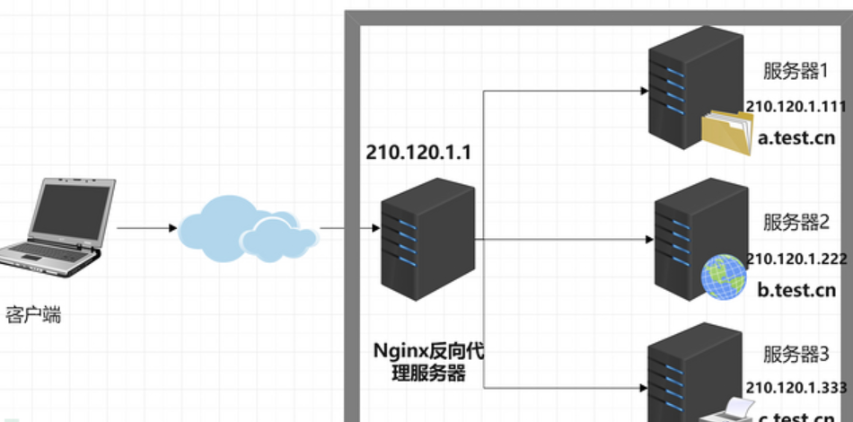

没有反向代理的访问流程  
客户端->请求->服务器->响应->客户端  
有反向代理  
客户端->请求->反向代理->服务器->响应->反向代理->客户端  
区别在于没有反向代理直接使用其 ip 地址访问到服务器 1，而且域名 dns 解析后也是 ip  
而有反向代理不能直接 ip 访问，解析后也不是真实 ip

### 主机与 host 关系

单个 Web 服务器可以托管多个网站或应用程序。这些网站尽管拥有不同的域名，但可能共享同一个 IP 地址。在这种情况下，服务器通过接收到的 HTTP 请求中的 Host 头部字段来确定要访问的网站。

例如，在 Nginx 或 Apache 等服务器软件中，可以通过配置文件进行域名绑定。Nginx 使用 server\_name 指令，Apache 使用 ServerName 指令来绑定域名。如果直接访问 IP 地址无法成功访问资源，必须通过绑定的域名才能成功获取页面内容。

**Nginx**   
 Nginx 配置文件，通常是 /etc/nginx/nginx.conf 或者 /etc/nginx/sites-available/default

```
server {
    listen 80;
    server_name www.example.com example.com;  # 绑定域名

    location / {
        root /var/www/html;  # 站点根目录
        index index.html index.htm;
    }
}

```

server\_name：这里配置了多个域名（可以同时绑定多个域名），当用户请求这些域名时，Nginx 会处理这些请求。

**Apache**

Apache 配置文件，通常是 /etc/httpd/httpd.conf 或者 /etc/apache2/sites-available/000-default.conf

在 VirtualHost 配置块中添加或修改 ServerName 和 ServerAlias 指令来绑定域名

```
<VirtualHost *:80>
    ServerAdmin webmaster@example.com
    DocumentRoot /var/www/html
    ServerName www.example.com  # 主域名
    ServerAlias example.com     # 备用域名

    ErrorLog ${APACHE_LOG_DIR}/error.log
    CustomLog ${APACHE_LOG_DIR}/access.log combined
</VirtualHost>

```

### DNS 解析机制

DNS 就是 Domain Name System，用于实现域名和 IP 地址相互映射的一个分布式数据库，它将简单明了的域名翻译成可由计算机识别的 IP 地址，使用户可以更快速便捷地访问互联。

解析的步骤  
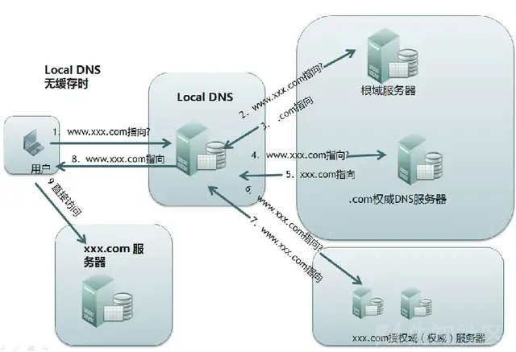

浏览器缓存，先检查浏览器缓存中有没有被解析过的这个域名对应的 ip 地址

本地缓存 hosts 文件，记录域名和对应的 IP 地址（此步骤就是 hosts 碰撞的修改点）

本区域域名服务器(LDNS)，即你所在或附近城市的域名服务器，大约 80%的域名解析到这里就完成了

再高一级域名服务器，如果还是解析不到就继续往上一级查

### 漏洞场景

当然场景也是我们原理的一部分，直接举例子会比干巴巴的原理好理解得多

**场景一**

一个网站对外主域名为[www.test.com，而内网中存在多个业务系统，都绑定了内网域名，比如](http://www.test.com，而内网中存在多个业务系统，都绑定了内网域名，比如) manage.test.com，这是内网自定义的域名，无法在公网 DNS 解析到，因为公网无法解析其 IP，显然无法直接访问到。系统管理员其实是这样配置的，利用 Apache 或 Nginx 进行配置，使得无法直接通过 IP 去访问系统。因为公网 DNS 无法解析自定义子域名，因此访问系统有两个条件：知道系统的内网域名和对应的 IP，再利用本地 DNS 解析(在本地 hosts 文件写入绑定关系)即可访问。这时候就出现了隐形资产概念，隐形资产的出现往往是因为配置错误或是配置未及时回收等原因而造成的

**场景二**

正常配置：将外部域名（如 oa.admin.com）解析到反向代理服务器 IP（如 210.110.110.110），反向代理服务器将请求转发给内部的 Web 服务器（如 192.168.1.1）。

域名删除操作：当系统出现漏洞或需要维护时，管理员删除了 oa.admin.com 的 DNS 解析，使得外部无法通过该域名访问反向代理服务器。

反向代理未删除：然而，反向代理服务器的配置（如将 oa.admin.com 域名与内网服务器绑定）并未被删除，反向代理仍然能够接收到来自 oa.admin.com 的请求并将其转发给内部系统。

攻击者利用漏洞：攻击者通过信息收集，猜测到 oa.admin.com 域名对应的反向代理服务器 IP 地址（如 210.110.110.110），并尝试解析 oa.admin.com 到该 IP 地址。

HOST 碰撞发生：攻击者可以通过手动修改本地 hosts 文件，将 oa.admin.com 域名解析到反向代理的 IP 地址，从而绕过 DNS 解析的删除，仍然能够访问到原本应被禁用的内部系统。

**案列三**

某公司 admin.example.com 未公开，但它和 [www.example.com](http://www.example.com) 共享同一个 IP。

通过 reverse IP lookup 发现 admin.example.com 也指向该 IP。

直接访问 http://目标IP 并修改 Host 头：

成功访问了后台管理系统，进一步利用默认密码进行渗透。

### 漏洞复现

这里我就没有搭建环境了简单看了理解原理

<https://zone.huoxian.cn/d/162-host>  
环境方面一个虚拟机，安装 nginx

nginx 的功能就是把请求转发给后面的服务器，决定哪台目标主机来处理当前请求。

本机启动一个 tomcat 的服务  
192.168.3.101:8081

虚拟机192.168.44.133假设为外网地址，域名为[www.test1.com](http://www.test1.com)

然后配置反向代理

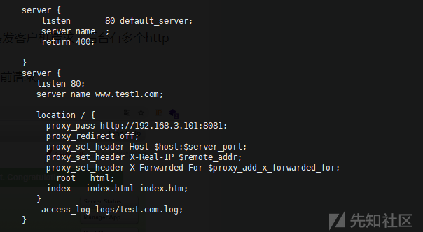

第一个server的作用为如果使用的是ip访问，则返回400；第二个server的作用为如果使用[www.test1.com域名来访问的话，则将请求转发到本机](http://www.test1.com域名来访问的话，则将请求转发到本机) 192.168.3.101 的 8081 端口

访问 192.168.44.133 返回 400，因为 Nginx 识别 server\_name 匹配的是 IP，所以按照第一个 server 规则，返回 400。

当你访问 [www.test1.com，如果你的](http://www.test1.com，如果你的) DNS 解析或者 hosts 解析指向 192.168.44.133，那么 Nginx 会匹配第二个 server 规则，并将请求代理到 192.168.3.101:8081。

但是这里是没有 dns 解析 [www.test1.com的，所以也会访问不到](http://www.test1.com的，所以也会访问不到)

但是如果我们直接访问 ip，并修改 host

```
GET / HTTP/1.1
Host: www.test1.com

```

Nginx 发现 Host 匹配 server\_name [www.test1.com，于是转发请求到](http://www.test1.com，于是转发请求到) 192.168.3.101:8081，最终访问到 Tomcat 服务器。

### 漏洞利用

那么如何利用漏洞呢？  
这个主要是需要我们收集很多信息了

我们需要收集到可疑的 ip 或者域名

通过域名能正常访问，对域名做解析发现该域名指向的是一个内网 ip

通过 IP 访问状态码报 4xx(如 400、403、404)禁止我们访问、5xx 错误、显示 200 却对任何输入不做响应。

可以利用工具

**HostCollision**  
<https://github.com/pmiaowu/HostCollision>

目录结构  
├── HostCollision  
│ ├── HostCollision.jar (主程序)  
│ ├── config.yml (配置文件,保存着程序各种设置)  
│ └── dataSource (程序进行 host 碰撞的数据来源)  
│ ├── ipList.txt (输入 ip 地址,一行一个目标)  
│ └── hostList.txt (输入 host 地址,一行一个目标)

我们需要改的就是 ip 和 host

或者 Hosts\_scan  
<https://github.com/fofapro/Hosts_scan>

区别就是这个是 python 编写的  
不过很久都没有更新了

## HOST碰撞之无缝集成

<https://github.com/pmiaowu/HostCollision>  
用于 host 碰撞而生的小工具,专门检测渗透中需要绑定 hosts 才能访问的主机或内部系统

我们看看使用方法

```
返回:

HostCollision % java -jar HostCollision.jar -h
=======================基 本 信 息=======================
版本: 2.2.0
下载地址: https://github.com/pmiaowu/HostCollision
请尽情享用本程序吧 ヾ(≧▽≦*)o
=======================使 用 文 档=======================
-h/-help                            使用文档
-sp/-scanProtocol                   允许的扫描协议<例如:http,https>
-ifp/-ipFilePath                    ip数据来源地址<例如:./dataSource/ipList.txt>
-hfp/-hostFilePath                  host数据来源地址<例如:./dataSource/hostList.txt>
-t/-threadTotal                     程序运行的最大线程总数<例如:6>
-o/-output                          导出格式,使用逗号分割<例如:csv,txt>
-ioel/-isOutputErrorLog             是否将错误日志输出<例如:true 输出/false 关闭>
-cssc/-collisionSuccessStatusCode   认为碰撞成功的状态码,使用逗号分割<例如: 200,301,302>
-dsn/-dataSampleNumber              数据样本请求次数,小于等于0,表示关闭该功能
```

手工使用了一次发现生成的文件名是不可预测的

执行完毕以后会在根目录生成一个年-月-日\_8位随机数的 csv/txt 文件  
里面会保存碰撞成功的结果

首先就是基本结构还是一样的

后端逻辑

```
# -*- coding: utf-8 -*-
import os
import subprocess

import sys
sys.stdout.reconfigure(encoding="utf-8")

def run_host_collision(domains: str, ips: str):
    """ 运行 HostCollision，先写入域名和 IP 文件，再执行 host.jar """

    domain_file = r'F:\gj\host碰撞\dataSource\hostList.txt'
    ip_file = r'F:\gj\host碰撞\dataSource\ipList.txt'
    work_dir = r'F:\gj\host碰撞'
    jar_path = os.path.join(work_dir, "host.jar")

    if not os.path.exists(jar_path):
        return "host.jar 不存在，请检查路径。"

    # **写入域名和 IP**
    try:
        with open(domain_file, 'w', encoding='utf-8') as df:
            df.write(domains.replace(",", "
")) if domains else None

        with open(ip_file, 'w', encoding='utf-8') as ipf:
            ipf.write(ips.replace(",", "
")) if ips else None

    except Exception as e:
        return f"写入文件错误: {e}"

    # **运行 HostCollision**
    try:
        cmd = ["java", "-jar", "F:\gj\host碰撞\host.jar"]
        process = subprocess.Popen(
            cmd,
            stdout=subprocess.PIPE,
            stderr=subprocess.PIPE,
            encoding='utf-8',
            text=True,
            errors='ignore',
            cwd=work_dir
        )

        stdout, stderr = process.communicate()
        return stdout

    except Exception as e:
        return f"执行错误: {e}"

```

前端保持刷新

```



<h2>HostCollision 域名/IP 碰撞</h2>
<form method="POST" id="hostcollision-form">
    <label for="domains">输入域名（支持多个，换行或逗号分隔）：</label>
    <textarea id="domains" name="domains" rows="3" placeholder="example.com
sub.example.com"></textarea>
    
    <label for="ips">输入 IP（支持多个，换行或逗号分隔）：</label>
    <textarea id="ips" name="ips" rows="3" placeholder="192.168.1.1
192.168.1.2"></textarea>
    <br>
    <button type="submit">开始扫描</button>
</form>
<h3>扫描结果</h3>
<pre id="result">{{ result }}</pre>
<script>
    document.getElementById("hostcollision-form").onsubmit = function(event) {
        event.preventDefault();
        
        let domainInput = document.getElementById("domains").value.trim();
        let ipInput = document.getElementById("ips").value.trim();

        if (!domainInput && !ipInput) {
            alert("请输入至少一个域名或 IP");
            return;
        }

        document.getElementById("result").textContent = "任务已提交，正在运行中...";

        fetch("/url/hostcollision", {
            method: "POST",
            body: new URLSearchParams({ "domains": domainInput, "ips": ipInput }),
            headers: { "Content-Type": "application/x-www-form-urlencoded" }
        });

        checkStatus();
    };

function checkStatus() {
    fetch("/url/hostcollision/status")
        .then(response => {
            if (!response.ok) {
                // 如果状态码不是 200，直接返回任务未开始
                if (response.status === 404) {
                    document.getElementById("result").innerText = "任务未开始";
                    return;
                }
                throw new Error("HTTP 状态码: " + response.status);
            }
            return response.json();
        })
        .then(data => {
            document.getElementById("result").innerText = data.status;

            if (data.status === "运行中...") {
                setTimeout(checkStatus, 2000); // 2秒后再次检查
            }
        })
        .catch(error => {
            console.error("获取状态失败:", error);
            document.getElementById("result").innerText = "获取状态失败";
        });
}


    // 页面加载时自动检查任务状态
    window.onload = function() {
        checkStatus();
    };
</script>
<style>
    textarea {
        width: 100%;
        min-height: 60px;
        resize: vertical;
        font-size: 14px;
        padding: 8px;
    }

    button {
        margin-top: 10px;
        padding: 8px 15px;
        font-size: 16px;
        cursor: pointer;
    }
</style>


```

路由

```

@url_bp.route("/hostcollision", methods=["GET", "POST"])
def hostcollision_route():
    if request.method == "POST":
        domains = request.form.get("domains", "").strip()
        ips = request.form.get("ips", "").strip()

        if not domains and not ips:
            return jsonify({"error": "请输入至少一个域名或 IP"}), 400

        # **创建任务 ID**
        task_id = f"{domains} | {ips}"
        session["hostcollision_input"] = task_id  # 存储到 session
        hostcollision_results[task_id] = "运行中..."

        # **在子线程中运行 HostCollision**
        def run_task(task_id):
            result = run_host_collision(domains, ips)
            hostcollision_results[task_id] = result  # 存储最终结果

        # **传递 task_id，避免 session 问题**
        threading.Thread(target=run_task, args=(task_id,), daemon=True).start()

        return jsonify({"message": "任务已启动", "task_id": task_id}), 200

    # **GET 请求，获取当前任务状态**
    input_data = session.get("hostcollision_input", "")
    result = hostcollision_results.get(input_data, "等待查询...") if input_data else "未开始查询"

    return render_template("hostcollision.html", input_data=input_data, result=result)


from flask import jsonify


@url_bp.route("/hostcollision/status", methods=["GET"])
def hostcollision_status():
    input_data = session.get("hostcollision_input", "").strip()

    if not input_data or input_data not in hostcollision_results:
        return jsonify({"status": "任务未开始"}), 404  # 明确返回 JSON 格式

    result = hostcollision_results[input_data]

    # 确保返回的是字符串，而不是 Popen 对象
    if isinstance(result, subprocess.Popen):
        return jsonify({"status": "运行中..."}), 200

    return jsonify({"status": result}), 200  # 返回最终的扫描结果


```

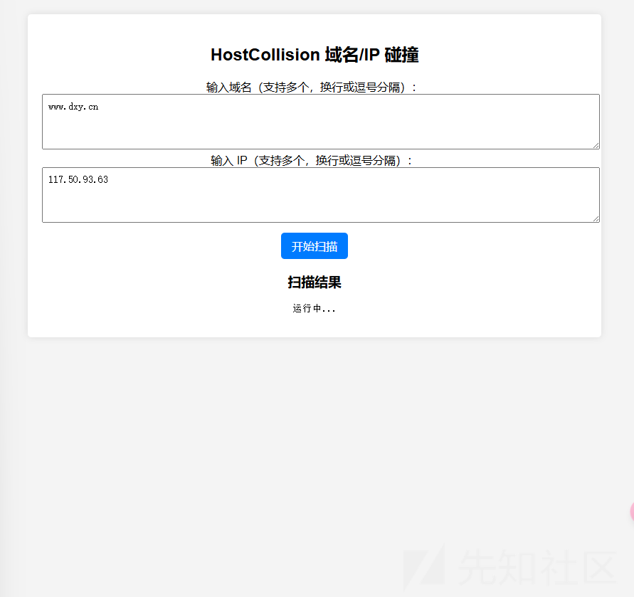

可以看到是很 ok 的

### 解决输出乱码问题

我们的结果

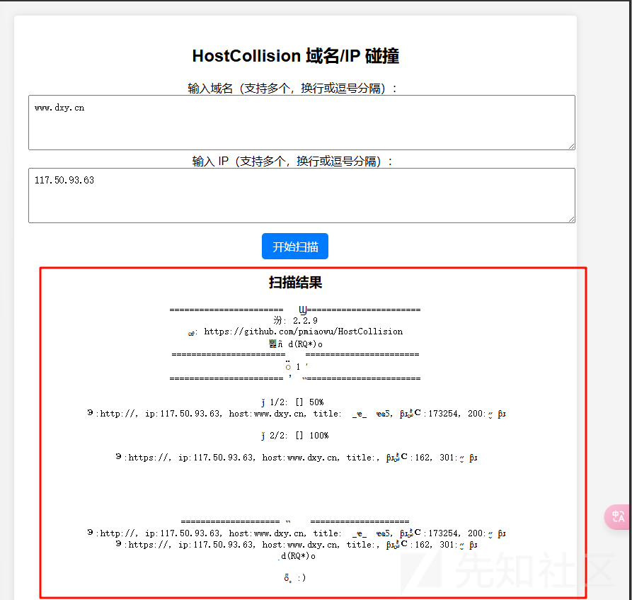

可以看到乱码了，其实是因为 java 运行默认为 GBK 编码，我们需要修改我们的默认编码，修改为 GBK

```
# -*- coding: gbk -*-
import os
import subprocess

import sys
sys.stdout.reconfigure(encoding="gbk")

def run_host_collision(domains: str, ips: str):
    """ 运行 HostCollision，先写入域名和 IP 文件，再执行 host.jar """

    domain_file = r'F:\gj\host碰撞\dataSource\hostList.txt'
    ip_file = r'F:\gj\host碰撞\dataSource\ipList.txt'
    work_dir = r'F:\gj\host碰撞'
    jar_path = os.path.join(work_dir, "host.jar")

    if not os.path.exists(jar_path):
        return "host.jar 不存在，请检查路径。"

    # **写入域名和 IP**
    try:
        with open(domain_file, 'w', encoding='utf-8') as df:
            df.write(domains.replace(",", "
")) if domains else None

        with open(ip_file, 'w', encoding='utf-8') as ipf:
            ipf.write(ips.replace(",", "
")) if ips else None

    except Exception as e:
        return f"写入文件错误: {e}"

    # **运行 HostCollision**
    try:
        cmd = ["java", "-jar", "F:\gj\host碰撞\host.jar"]
        process = subprocess.Popen(
            cmd,
            stdout=subprocess.PIPE,
            stderr=subprocess.PIPE,
            encoding='gbk',
            text=True,
            errors='ignore',
            cwd=work_dir
        )

        stdout, stderr = process.communicate()
        return stdout

    except Exception as e:
        return f"执行错误: {e}"

```

然后再次尝试


可以看到已经是 ok 了

输出是非常的完美了，我们现在只需要数据处理了

### 数据格式化输出

首先我们工具默认会输出到我们的文件

执行完毕以后会在根目录生成一个年-月-日\_8位随机数的 csv/txt 文件  
里面会保存碰撞成功的结果  
比如


但是如果需要处理数据的话，我们肯定是需要固定格式的，怎么办

开发了有一段时间了，已经学会了，那就是直接修改工具

首先就是读懂我们工具的逻辑和寻找到代码的修改点

目录结构如下

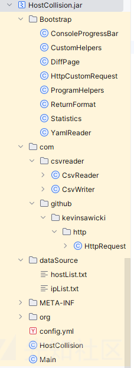

寻找生成文件的地方

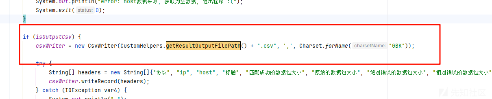

我们追踪代码

```
public static String getResultOutputFilePath() {
    SimpleDateFormat sdf = new SimpleDateFormat("yyyy-MM-dd");
    String date = sdf.format(new Date());
    return "." + File.separator + "result";
}
```

因为这个代码我修改过了，原来是时间搓来着

直接修改为固定的 result  
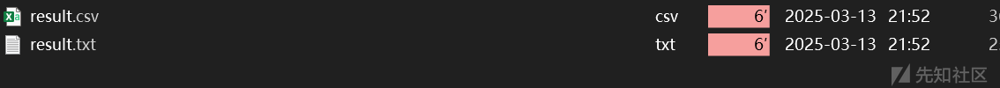

可以看到之后生成的文件就是固定了

然后就是处理数据的问题

生成的文件如下

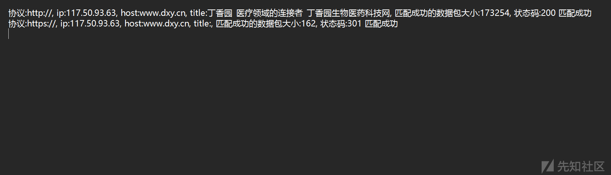

首先确定了一下思路

就是需要解决判断完成的问题，记得 oneforall 是有无文件生成来判断我们的操作是否完成

但是尝试了一下这个思路，完全不可以，因为我们生成的文件都是固定的

```
import re
import os
from flask import jsonify, session

@url_bp.route("/hostcollision/status", methods=["GET"])
def hostcollision_status():
    result_file = r"F:\gj\host碰撞\result.txt"

    # 确保任务已执行
    input_data = session.get("hostcollision_input", "").strip()
    if not input_data:
        return "任务未开始", 404

    # 确保结果文件存在
    if not os.path.exists(result_file):
        return jsonify({"status": "运行中..."})  # 任务未完成

    # 解析文件
    results = []
    with open(result_file, "r", encoding="utf-8", errors="ignore") as file:
        for line in file:
            match = re.search(r"协议:(https?://), ip:([\d\.]+), host:([\w\.-]+), .*? 状态码:(\d+)", line)
            if match:
                protocol, ip, host, status = match.groups()
                results.append({
                    "protocol": protocol,
                    "ip": ip,
                    "host": host,
                    "status": status
                })

    if not results:
        return jsonify({"status": "暂无数据"})

    return jsonify({"status": "完成", "results": results})

```

```



<h2>HostCollision 域名/IP 碰撞</h2>
<form method="POST" id="hostcollision-form">
    <label for="domains">输入域名（支持多个，换行或逗号分隔）：</label>
    <textarea id="domains" name="domains" rows="3" placeholder="example.com
sub.example.com"></textarea>
    
    <label for="ips">输入 IP（支持多个，换行或逗号分隔）：</label>
    <textarea id="ips" name="ips" rows="3" placeholder="192.168.1.1
192.168.1.2"></textarea>
    <br>
    <button type="submit">开始扫描</button>
</form>
<h3>扫描结果</h3>
<div id="status">任务未开始</div>
<table border="1" id="result-table" style="width:100%; display:none;">
    <thead>
        <tr>
            <th>协议</th>
            <th>IP</th>
            <th>Host</th>
            <th>状态码</th>
        </tr>
    </thead>
    <tbody id="result-body"></tbody>
</table>
<script>
    document.getElementById("hostcollision-form").onsubmit = function(event) {
        event.preventDefault();
        
        let domainInput = document.getElementById("domains").value.trim();
        let ipInput = document.getElementById("ips").value.trim();

        if (!domainInput && !ipInput) {
            alert("请输入至少一个域名或 IP");
            return;
        }

        document.getElementById("status").textContent = "任务已提交，正在运行中...";
        document.getElementById("result-table").style.display = "none";

        fetch("/url/hostcollision", {
            method: "POST",
            body: new URLSearchParams({ "domains": domainInput, "ips": ipInput }),
            headers: { "Content-Type": "application/x-www-form-urlencoded" }
        });

        checkStatus();
    };

    function checkStatus() {
        fetch("/url/hostcollision/status")
            .then(response => response.json())
            .then(data => {
                document.getElementById("status").innerText = data.status;

                if (data.status === "运行中...") {
                    setTimeout(checkStatus, 2000);  // 2秒后重试
                } else if (data.status === "完成") {
                    renderTable(data.results);
                }
            })
            .catch(error => {
                console.error("获取状态失败:", error);
                document.getElementById("status").innerText = "获取状态失败";
            });
    }

    function renderTable(results) {
        let tbody = document.getElementById("result-body");
        tbody.innerHTML = "";  // 清空旧数据

        results.forEach(row => {
            let tr = document.createElement("tr");
            tr.innerHTML = `<td>${row.protocol}</td><td>${row.ip}</td><td>${row.host}</td><td>${row.status}</td>`;
            tbody.appendChild(tr);
        });

        document.getElementById("result-table").style.display = "table"; // 显示表格
    }

    window.onload = function() {
        checkStatus();
    };
</script>
<style>
    textarea {
        width: 100%;
        min-height: 60px;
        resize: vertical;
        font-size: 14px;
        padding: 8px;
    }

    button {
        margin-top: 10px;
        padding: 8px 15px;
        font-size: 16px;
        cursor: pointer;
    }

    table {
        border-collapse: collapse;
        margin-top: 10px;
    }

    th, td {
        padding: 8px;
        text-align: left;
    }
</style>


```

这样会发现一运行我们的扫描就已经完成，非常的不好

所以想了一个解决办法,就是每次检测的时候需要先把文件删除了，之后再去处理

然后就是处理我们的结果，只需要正则就好了

最后的代码如下

路由部分

```
@url_bp.route("/hostcollision", methods=["GET", "POST"])
def hostcollision_route():
    if request.method == "POST":
        domains = request.form.get("domains", "").strip()
        ips = request.form.get("ips", "").strip()

        if not domains and not ips:
            return jsonify({"error": "请输入至少一个域名或 IP"}), 400

        # **创建任务 ID**
        task_id = f"{domains} | {ips}"
        session["hostcollision_input"] = task_id  # 存储到 session
        hostcollision_results[task_id] = "运行中..."

        # **在子线程中运行 HostCollision**
        def run_task(task_id):
            result = run_host_collision(domains, ips)
            hostcollision_results[task_id] = result  # 存储最终结果

        # **传递 task_id，避免 session 问题**
        threading.Thread(target=run_task, args=(task_id,), daemon=True).start()

        return jsonify({"message": "任务已启动", "task_id": task_id}), 200

    # **GET 请求，获取当前任务状态**
    input_data = session.get("hostcollision_input", "")
    result = hostcollision_results.get(input_data, "等待查询...") if input_data else "未开始查询"

    return render_template("hostcollision.html", input_data=input_data, result=result)


@url_bp.route("/hostcollision/status", methods=["GET"])
def hostcollision_status():
    """获取 HostCollision 扫描结果"""
    input_data = session.get("hostcollision_input", "").strip()

    if not input_data or input_data not in hostcollision_results:
        return jsonify({"status": "任务未开始"}), 404

    result = hostcollision_results[input_data]

    if isinstance(result, str) and result == "运行中...":
        return jsonify({"status": "运行中..."}), 200

    if isinstance(result, list):  # 确保是解析后的数据
        return jsonify({"status": "完成", "results": result}), 200

    return jsonify({"status": "错误", "message": "未知状态"}), 500
```

数据处理+逻辑部分

```
# -*- coding: gbk -*-
import os
import subprocess
import sys
import re

sys.stdout.reconfigure(encoding="gbk")

RESULT_FILE = r"F:\gj\host碰撞\result.txt"


def run_host_collision(domains: str, ips: str):
    """ 运行 HostCollision，写入域名和 IP 文件，执行 host.jar，并解析结果 """
    if os.path.exists(RESULT_FILE):
        os.remove(RESULT_FILE)  # 删除旧的结果文件，确保获取最新结果

    domain_file = r'F:\gj\host碰撞\dataSource\hostList.txt'
    ip_file = r'F:\gj\host碰撞\dataSource\ipList.txt'
    work_dir = r'F:\gj\host碰撞'
    jar_path = os.path.join(work_dir, "host.jar")

    if not os.path.exists(jar_path):
        return "host.jar 不存在，请检查路径。"

    # **写入域名和 IP**
    try:
        if domains:
            with open(domain_file, 'w', encoding='utf-8') as df:
                df.write(domains.replace(",", "
"))

        if ips:
            with open(ip_file, 'w', encoding='utf-8') as ipf:
                ipf.write(ips.replace(",", "
"))

    except Exception as e:
        return f"写入文件错误: {e}"

    # **运行 HostCollision**
    try:
        cmd = ["java", "-jar", "host.jar"]
        process = subprocess.Popen(
            cmd,
            stdout=subprocess.PIPE,
            stderr=subprocess.PIPE,
            encoding='gbk',
            text=True,
            errors='ignore',
            cwd=work_dir
        )

        process.communicate()  # 等待进程结束

    except Exception as e:
        return f"执行错误: {e}"

    # **解析 result.txt 并返回**
    return parse_hostcollision_results()


def parse_hostcollision_results():
    """ 解析 `result.txt`，提取 IP、域名、状态码 """
    parsed_results = []

    if not os.path.exists(RESULT_FILE):
        return "结果文件不存在或任务未完成"

    try:
        with open(RESULT_FILE, "r", encoding="gbk", errors="ignore") as f:
            for line in f:
                parsed_data = parse_hostcollision_output(line)
                if parsed_data:
                    parsed_results.append(parsed_data)

        return parsed_results

    except Exception as e:
        return f"解析文件错误: {e}"


def parse_hostcollision_output(line):
    """ 解析 HostCollision 结果行，提取协议、IP、Host、状态码 """
    match = re.search(r"协议:(https?://), ip:([\d\.]+), host:([\w\.-]+), .*?状态码:(\d+)", line)

    if match:
        return {
            "protocol": match.group(1),
            "ip": match.group(2),
            "host": match.group(3),
            "status_code": match.group(4)
        }

    return None

```

前端

```



<h2 style="text-align: center;">HostCollision 域名/IP 碰撞</h2>
<form method="POST" id="hostcollision-form" style="text-align: center;">
    <label for="domains">输入域名（支持多个，换行或逗号分隔）：</label><br>
    <textarea id="domains" name="domains" rows="3" placeholder="example.com
sub.example.com"></textarea>
    <br>

    <label for="ips">输入 IP（支持多个，换行或逗号分隔）：</label><br>
    <textarea id="ips" name="ips" rows="3" placeholder="192.168.1.1
192.168.1.2"></textarea>
    <br>
    <button type="submit">开始扫描</button>
</form>
<h3 style="text-align: center;">扫描结果</h3>
<table id="result-table" border="1">
    <thead>
        <tr>
            <th>协议</th>
            <th>IP</th>
            <th>Host</th>
            <th>状态码</th>
        </tr>
    </thead>
    <tbody>
    </tbody>
</table>
<script>
document.getElementById("hostcollision-form").addEventListener("submit", function(event) {
    event.preventDefault();

    let formData = new FormData(this);
    let submitButton = this.querySelector("button");

    submitButton.disabled = true;
    submitButton.innerText = "扫描中...";

    fetch("/url/hostcollision", {
        method: "POST",
        body: formData
    })
    .then(response => response.json())
    .then(data => {
        if (data.task_id) {
            setTimeout(checkStatus, 2000);
        } else {
            alert("任务启动失败：" + (data.error || "未知错误"));
        }
    })
    .catch(error => {
        console.error("提交失败:", error);
        alert("提交失败，请检查控制台日志。");
    })
    .finally(() => {
        submitButton.disabled = false;
        submitButton.innerText = "开始扫描";
    });
});

function checkStatus() {
    fetch("/url/hostcollision/status")
        .then(response => response.json())
        .then(data => {
            let tableBody = document.querySelector("#result-table tbody");
            tableBody.innerHTML = "";

            if (data.status === "运行中...") {
                tableBody.innerHTML = "<tr><td colspan='4'>任务运行中...</td></tr>";
                setTimeout(checkStatus, 2000);
            } else if (data.status === "完成" && Array.isArray(data.results)) {
                data.results.forEach(item => {
                    let row = `<tr>
                        <td class="copy-cell">${item.protocol}</td>
                        <td class="copy-cell">${item.ip}</td>
                        <td class="copy-cell">${item.host}</td>
                        <td class="copy-cell">${item.status_code}</td>
                    </tr>`;
                    tableBody.innerHTML += row;
                });
            } else {
                tableBody.innerHTML = `<tr><td colspan='4'>${data.status}</td></tr>`;
            }
        })
        .catch(error => {
            console.error("获取状态失败:", error);
            document.querySelector("#result-table tbody").innerHTML = "<tr><td colspan='4'>获取状态失败</td></tr>";
        });
}

// 让用户可以单击复制表格内容
document.addEventListener("click", function(event) {
    if (event.target.classList.contains("copy-cell")) {
        let text = event.target.innerText;
        navigator.clipboard.writeText(text).then(() => {
            alert("已复制: " + text);
        });
    }
});
</script>
<style>
    /* 让表格居中 */
    table {
        margin: 20px auto;
        border-collapse: collapse;
        width: 80%;
    }

    /* 表头和单元格样式 */
    th, td {
        border: 2px solid black;
        padding: 10px;
        text-align: center;
        font-size: 16px;
        white-space: nowrap;
        user-select: all;
    }

    th {
        background-color: #ddd;
    }

    textarea {
        width: 80%;
        min-height: 60px;
        resize: vertical;
        font-size: 14px;
        padding: 8px;
    }

    button {
        margin-top: 10px;
        padding: 10px 20px;
        font-size: 16px;
        cursor: pointer;
    }
</style>


```

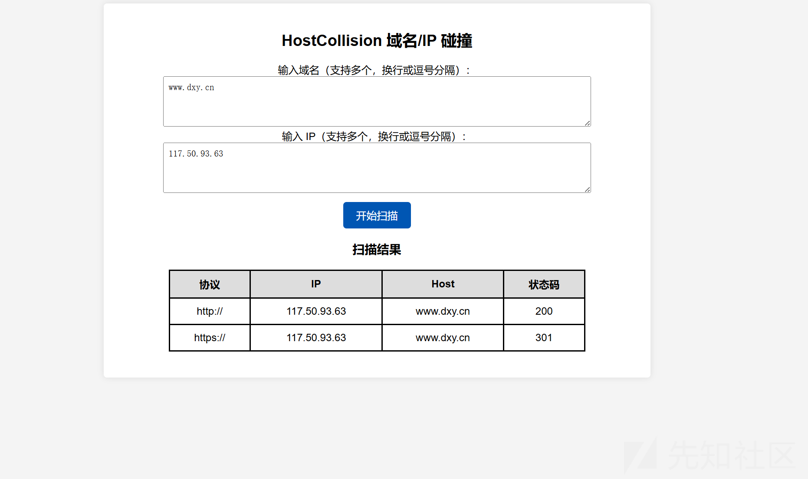

看着还是不错的，但是我感觉不方便复制

最后又修改了一下前端

集成的效果如下

```



<h2 style="text-align: center;">HostCollision 域名/IP 碰撞</h2>
<!-- 输入框 -->
<div class="container">
    <div class="column">
        <h3>输入</h3>
        <textarea id="domains" name="domains" placeholder="输入域名（支持多个，换行或逗号分隔）"></textarea>
        <textarea id="ips" name="ips" placeholder="输入 IP（支持多个，换行或逗号分隔）"></textarea>
    </div>
</div>
<!-- 扫描按钮 -->
<div class="button-container">
    <button id="scan-button">开始扫描</button>
</div>
<!-- 扫描结果 -->
<h3 style="text-align: center;">扫描结果</h3>
<div id="result-container">
    <div class="result-section">
        <h4>协议</h4>
        <pre id="protocol-output"></pre>
    </div>
    <div class="result-section">
        <h4>IP</h4>
        <pre id="ip-output"></pre>
    </div>
    <div class="result-section">
        <h4>Host</h4>
        <pre id="host-output"></pre>
    </div>
    <div class="result-section">
        <h4>状态码</h4>
        <pre id="status-code-output"></pre>
    </div>
</div>
<script>
document.getElementById("scan-button").addEventListener("click", function() {
    let formData = new FormData();
    formData.append("domains", document.getElementById("domains").value);
    formData.append("ips", document.getElementById("ips").value);

    let button = this;
    button.disabled = true;
    button.innerText = "扫描中...";

    // 立即清空旧结果，避免残留
    document.getElementById("protocol-output").textContent = "正在扫描...";
    document.getElementById("ip-output").textContent = "正在扫描...";
    document.getElementById("host-output").textContent = "正在扫描...";
    document.getElementById("status-code-output").textContent = "正在扫描...";

    fetch("/url/hostcollision", {
        method: "POST",
        body: formData
    })
    .then(response => response.json())
    .then(data => {
        if (data.task_id) {
            // 任务已启动，立即刷新界面
            setTimeout(checkStatus, 2000);
        } else {
            alert("任务启动失败：" + (data.error || "未知错误"));
            resetUI();
        }
    })
    .catch(error => {
        console.error("提交失败:", error);
        alert("提交失败，请检查控制台日志。");
        resetUI();
    });
});

function checkStatus() {
    fetch("/url/hostcollision/status")
        .then(response => response.json())
        .then(data => {
            if (data.status === "运行中...") {
                setTimeout(checkStatus, 2000);
            } else if (data.status === "完成" && Array.isArray(data.results)) {
                let protocolText = "";
                let ipText = "";
                let hostText = "";
                let statusCodeText = "";

                data.results.forEach(item => {
                    protocolText += `${item.protocol}
`;
                    ipText += `${item.ip}
`;
                    hostText += `${item.host}
`;
                    statusCodeText += `${item.status_code}
`;
                });

                document.getElementById("protocol-output").textContent = protocolText;
                document.getElementById("ip-output").textContent = ipText;
                document.getElementById("host-output").textContent = hostText;
                document.getElementById("status-code-output").textContent = statusCodeText;
            } else {
                document.getElementById("protocol-output").textContent = "扫描失败";
                document.getElementById("ip-output").textContent = "扫描失败";
                document.getElementById("host-output").textContent = "扫描失败";
                document.getElementById("status-code-output").textContent = "扫描失败";
            }
        })
        .catch(error => {
            console.error("获取状态失败:", error);
            document.getElementById("protocol-output").textContent = "获取状态失败";
            document.getElementById("ip-output").textContent = "获取状态失败";
            document.getElementById("host-output").textContent = "获取状态失败";
            document.getElementById("status-code-output").textContent = "获取状态失败";
        })
        .finally(() => {
            document.getElementById("scan-button").disabled = false;
            document.getElementById("scan-button").innerText = "开始扫描";
        });
}

// 任务失败时重置 UI
function resetUI() {
    document.getElementById("scan-button").disabled = false;
    document.getElementById("scan-button").innerText = "开始扫描";

    document.getElementById("protocol-output").textContent = "暂无数据";
    document.getElementById("ip-output").textContent = "暂无数据";
    document.getElementById("host-output").textContent = "暂无数据";
    document.getElementById("status-code-output").textContent = "暂无数据";
}
</script>
<style>
/* 让文本块格式化显示 */
#result-container {
    display: flex;
    justify-content: center;
    gap: 40px;
    margin-top: 20px;
}

.result-section {
    text-align: center;
}

.result-section h4 {
    margin-bottom: 5px;
}

pre {
    background: #f4f4f4;
    padding: 10px;
    font-size: 16px;
    white-space: pre-wrap;
    word-wrap: break-word;
    border-radius: 5px;
    min-width: 150px;
    max-width: 200px;
}

/* 让文本框变宽 */
textarea {
    width: 80%;
    min-height: 60px;
    resize: vertical;
    font-size: 14px;
    padding: 8px;
}

/* 按钮样式 */
button {
    margin-top: 10px;
    padding: 10px 20px;
    font-size: 16px;
    cursor: pointer;
}
</style>


```

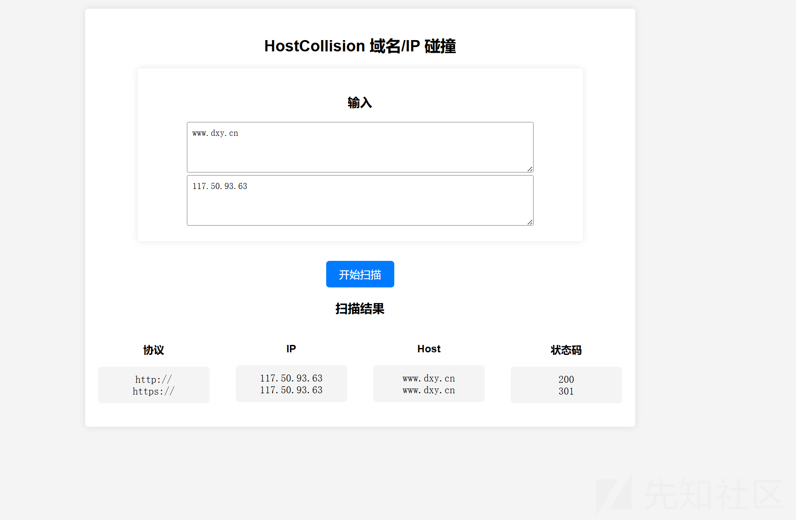

参考<https://jici-zeroten.github.io/2023/12/02/Hosts%E7%A2%B0%E6%92%9E%E6%94%BB%E5%87%BB%E6%89%8B%E6%B3%95/>
