# WiFi钓鱼学习分享-先知社区

> **来源**: https://xz.aliyun.com/news/17260  
> **文章ID**: 17260

---

# 前置操作

Flipper Zero拿到手后应该怎么做

* 首先先长按 右下角 3秒进行开机

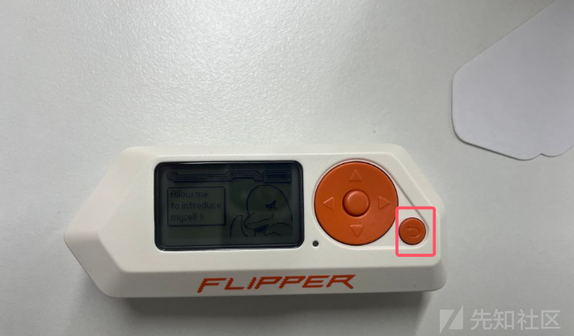

* 然后把它竖起来，把存储卡插进去

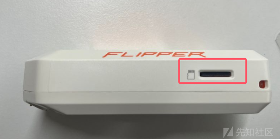

注意是这个头朝上

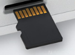

* 然后开始无脑按 右 ，把所有提示按完之后就可以开始刷固件了

<https://github.com/DarkFlippers/unleashed-firmware/releases/tag/unlshd-080>

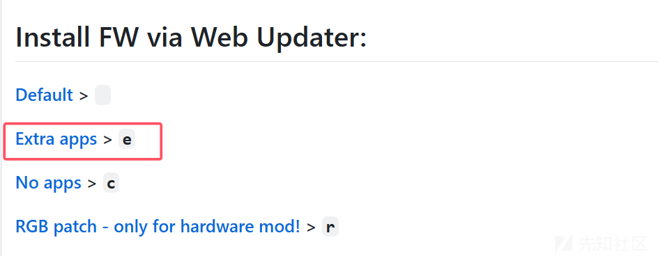

点击上面链接，然后往下翻，找到上图红框这里点进去

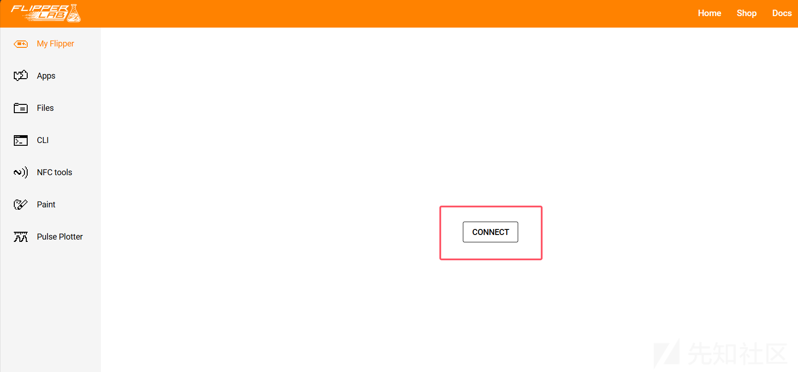

* 然后把Flipper Zero连到电脑上，点击上图的红框进行连接

然后浏览器会给个弹窗，我们选中我们的Flipper再选择连接

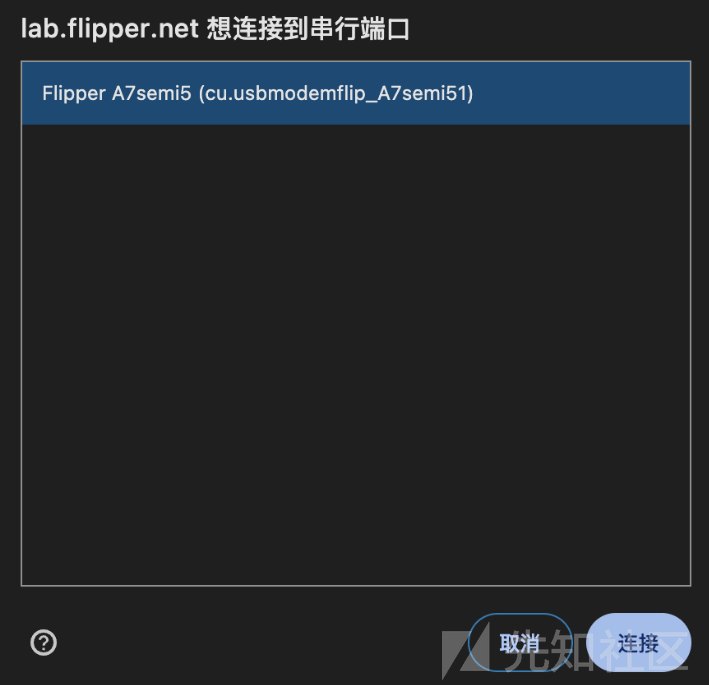

然后我们选择想要的固件进行安装，直接在浏览器安装就行了

有很多模块，推荐直接使用`release-cfw`这个内核模块进行安装

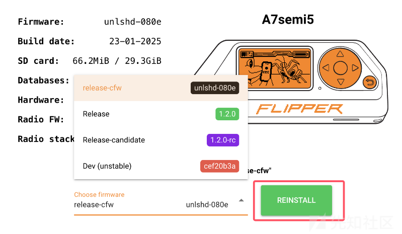

* 温馨提示，如果刷固件失败，点击 `右下角和左方向键` 进行重启，或者先刷官方镜像再刷这个

去 <https://flipperzero.one/update> 下载软件进行刷固件，然后再到Github刷固件就行了

# WiFi钓鱼

## 基本流程

* 首先需要再多买一个WiFi板子，对Flipper Zero的功能进行拓展

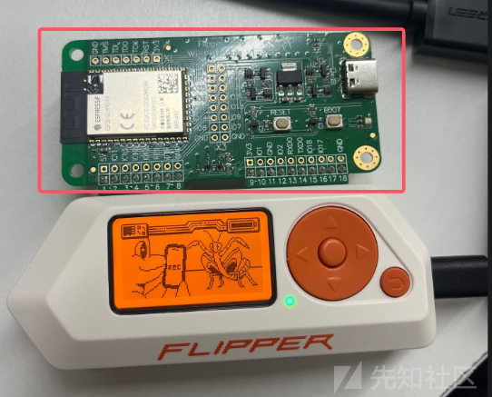

* 然后按左键，进行菜单选择，选择`GPIO`这个菜单

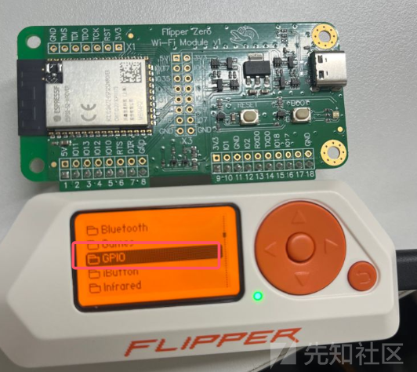

进去后选择WiFi模块，看到有WiFi字眼的进去就行了

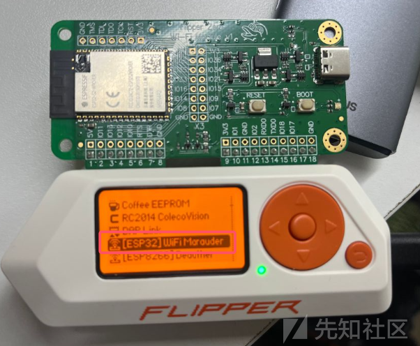

先选择Scan，然后再选择List

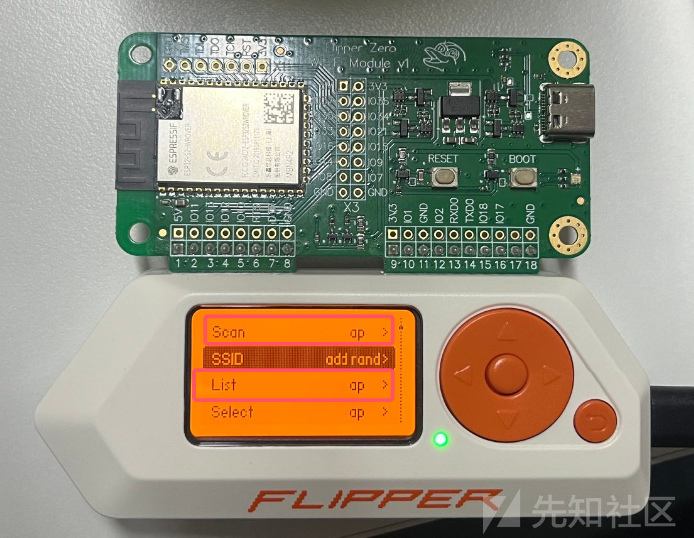

注意，如果你使用ap扫的，那么你List展示的时候也需要选择为ap

展示结果如下`[编号][CH6]WiFi名字`

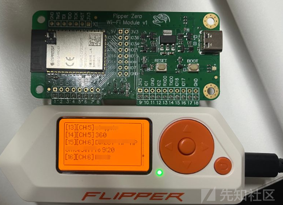

然后返回回去，选择Select模块

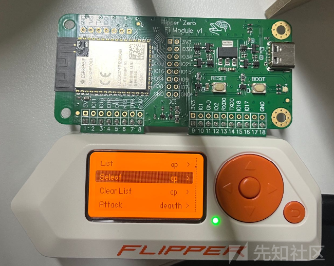

然后我们直接操控按键选择想要的编号就行了，这个编号可以在刚刚List的展示页面中看到

比如说我们想伪造麦当劳的WiFi，我们就先扫描，然后到List中看麦当劳的WiFi是多少编号，然后直接在这边输入

这边输入就是通过按键来上下左右选中，选中英文字母的时候长按一会，就是大写的英文字母

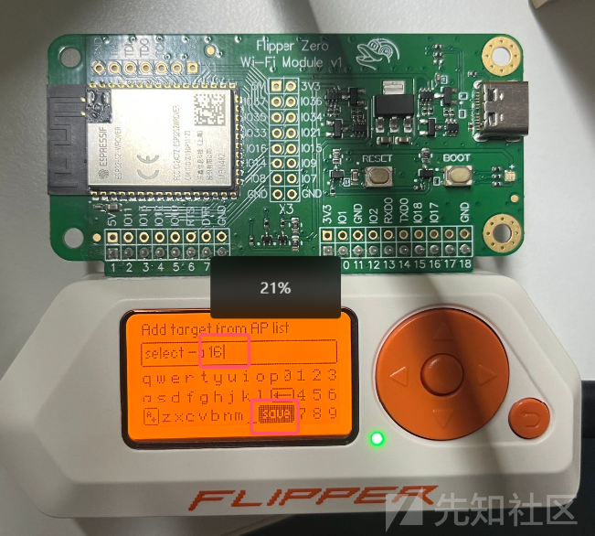

全部输入后控制光标到 save 那里，然后点击确定，确定的界面如下所示

然后退回WiFi的界面选择处，选择deauth版的 Attack ，让所有连这个网的设备都断掉

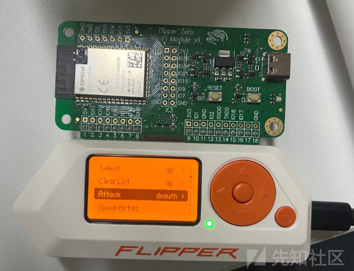

Attack成功的界面长这样

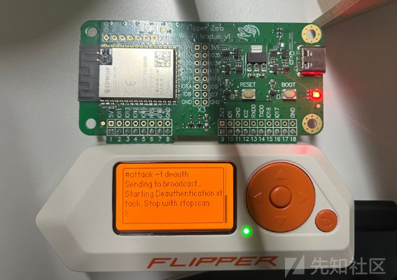

然后退回去，选择 Evil Portal 进行钓鱼攻击

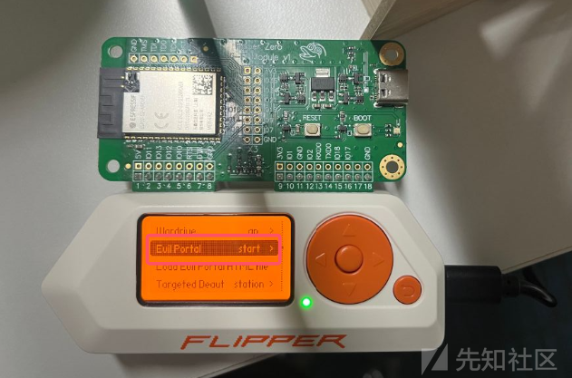

然后打开手机连接WiFi，发现出现了Test页面

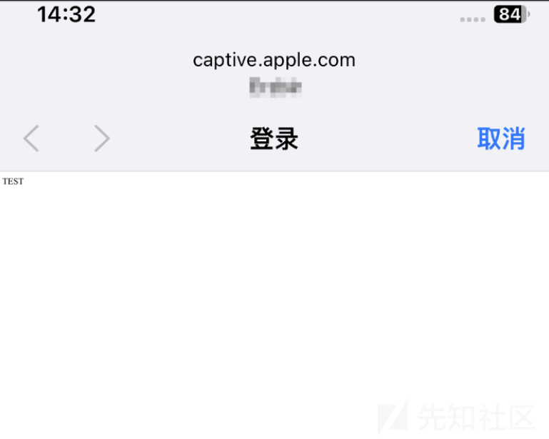

​

## 编写钓鱼页面并传输

就是我们要让Test页面变成正常的企业WiFi登录界面，写HTML就不说了

先去 <https://flipperzero.one/update> 下载软件

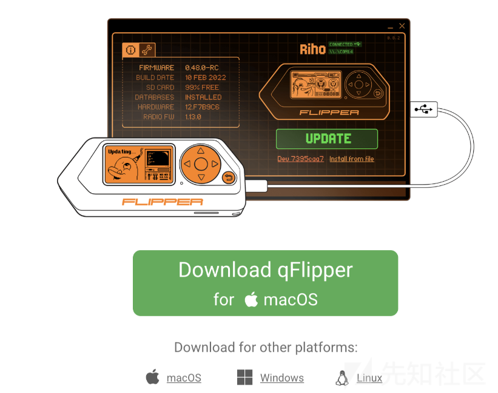

然后连到电脑，使用这个APP进行传输就行了

可以右键创建目录之类的

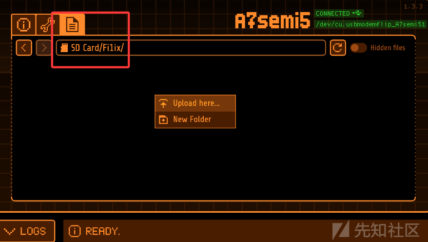

导入成功后，就直接在这里Load，选择到你创建的目录中的那个HTML就行了

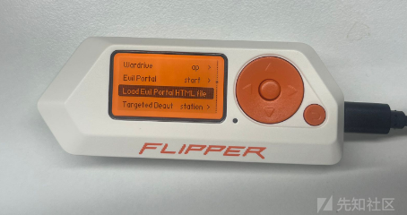

选择好HTML后然后再回来开启 Evil Portal 就行了，可以发现再次连接就是HTML了

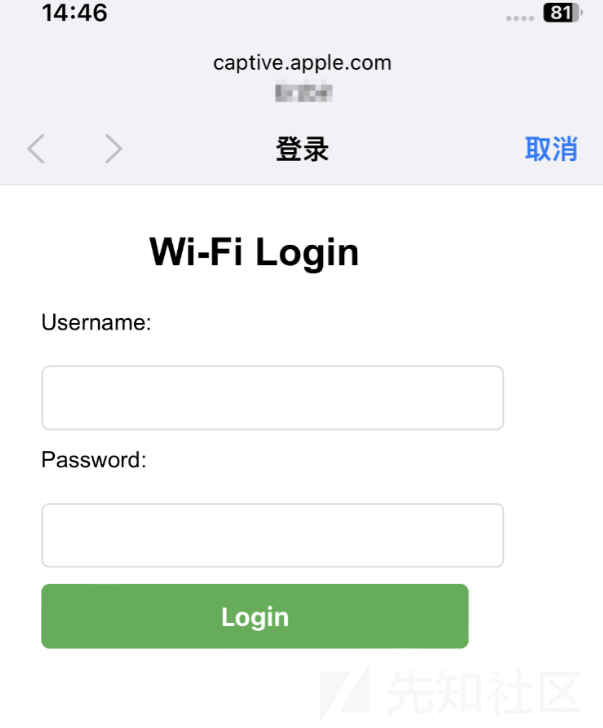

然后我们电脑也连接这个网络，就不进行页面登陆，关掉就行了

然后手机连接这个网络进行登录，然后把用户名和密码发到电脑上就行了

因为都是连的Flipper Zero的网络，所以都是在一个内网里面的

​

## 刷固件到WiFi板子

* 接图中红框的 typec接口 到电脑上

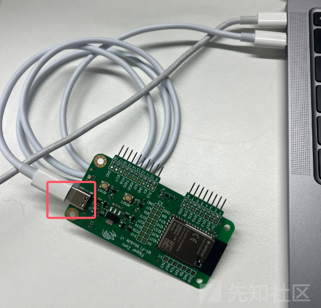

* 进入网址 <https://esp.huhn.me/> 刷就行了

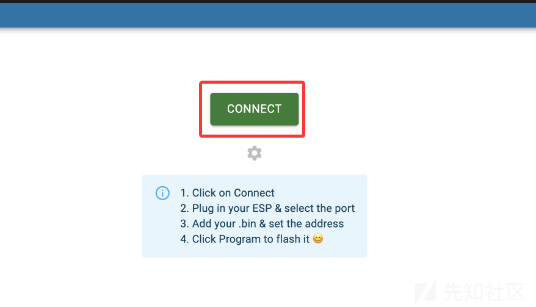

选择下图标的那个进行连接和刷板子就行了

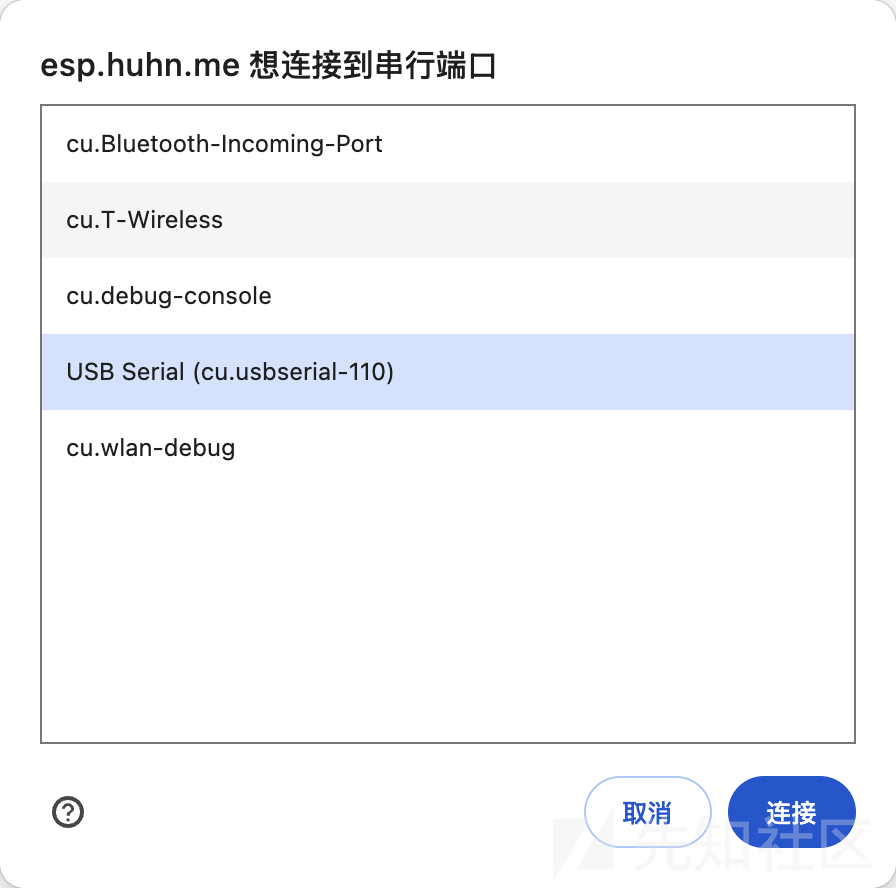

​

# 其他功能可见官方手册

<https://github.com/justcallmekoko/ESP32Marauder/wiki/>
