# 子域名爆破 vs 泛解析：如何绕过干扰获取真实结果-先知社区

> **来源**: https://xz.aliyun.com/news/17261  
> **文章ID**: 17261

---

## 子域名爆破 vs 泛解析：如何绕过干扰获取真实结果

### 前言

在渗透测试中子域名收集一直是一个非常非常重要的环节，子域名收集的方法很多，但是泛解析这种防护的手段对我们的子域名挖掘机等工具很不友好，但是如何破解呢？下面会详细分析分析，并给出利用的脚本

### 泛解析介绍

泛解析（Wildcard DNS） 是指 DNS 服务器对所有未知的子域名进行解析，使它们指向同一个 IP 地址，即使这些子域名并未在 DNS 服务器上专门配置。

简单来说，如果一个域名开启了泛解析，即使输入一个随机子域名，也能解析到同一个 IP。

**原理**

在传统的 DNS 解析中，只有明确配置的子域名才会有解析记录。例如：

[www.example.com](http://www.example.com) → 192.168.1.1  
mail.example.com → 192.168.1.2  
如果尝试解析 random.example.com，会发现查询失败，因为它没有在 DNS 服务器上定义 A 记录。

但是如果配置了泛解析

[www.example.com](http://www.example.com) → 203.0.113.1  
mail.example.com → 203.0.113.1  
random.example.com → 203.0.113.1  
abcxyz.example.com → 203.0.113.1  
任何未明确指定的子域名，都会解析到 203.0.113.1

**泛解析的意义**

举例子吧

如果需要为每个用户或每个业务部门分配一个子域名，手动添加 DNS 记录会很麻烦。

通过泛解析 `\*.example.com，无需手动添加每个子域名，所有子域名都会自动指向相同 IP 或 CNAME 记录。  
例如：  
client1.example.com、client2.example.com、random.example.com 都能自动解析，无需单独配置

比如 SaaS 平台和企业内部系统

IP 变更无需修改所有子域名

如果服务器 IP 变了，成千上万个子域名都需要修改，工作量巨大

通过泛解析 `\*.example.com，只需要修改一条 DNS 记录，所有子域名都会自动更新

还有在网站运营中，域名持有者为了避免因为错误输入，而造成用户流失，就会使用泛域名解析。

### 泛解析判断

那么如何判断我们的域名是否存在泛解析呢？

最简单的办法就是直接去解析了

#### 手工 ping 判断

下面举一个对比的例子

比如我们的百度

如果域名存在  
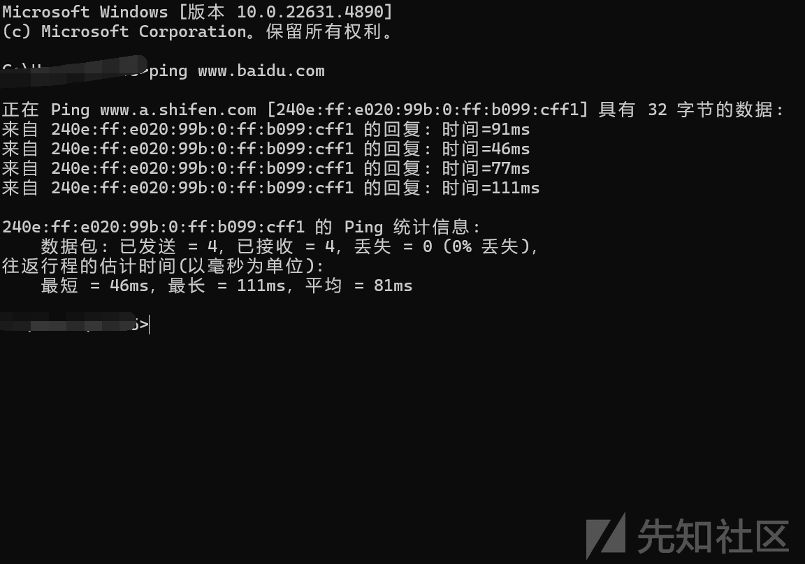

我们输入一个不存在的域名

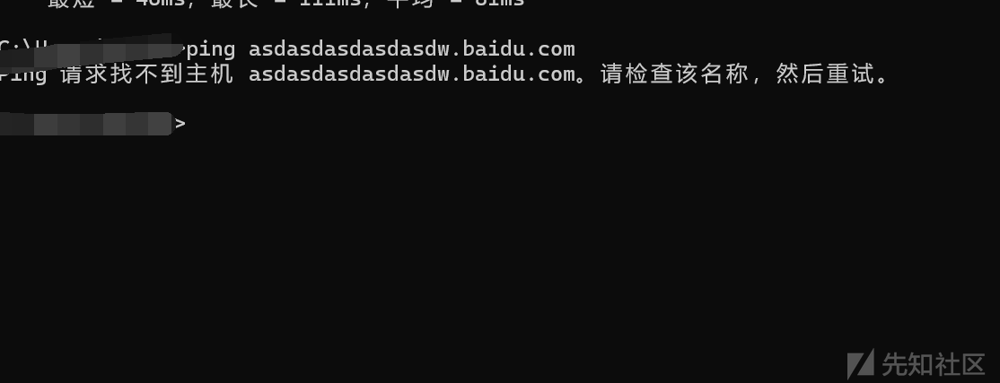

可以发现是不存在的

这个大概率可以确定百度是不存在域名泛解析的

我们看看淘宝

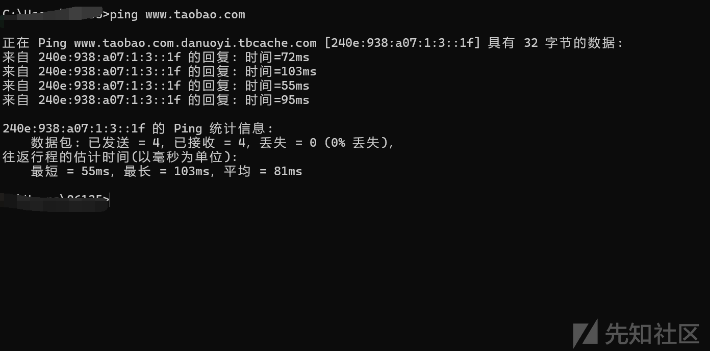

然后 ping 一个不存在的域名

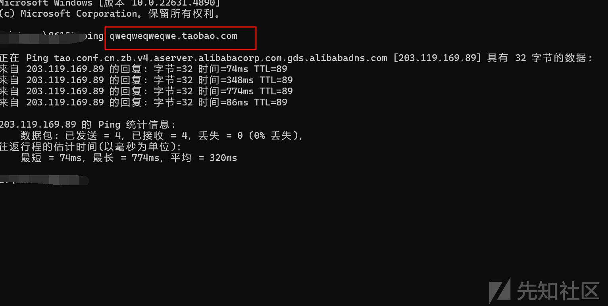

可以发现还是可以成功，所以可以证明淘宝大概率是使用了域名泛解析的

#### 脚本自动化判断

通常，DNS 解析时，子域名需要先在 DNS 服务器上有明确的 A 记录配置，否则就解析失败。但某些域名的 DNS 服务器会将所有未知子域名指向相同的 IP（即泛解析），导致任何随机子域名都能解析成功。因此，通过随机生成子域名并检查解析结果，就可以判断是否存在泛解析。

A 记录（Address Record） 是 DNS（域名系统）中最常见的记录类型，用于将域名解析为 IPv4 地址，帮助用户通过域名访问网站或服务器。

带子域名的 A 记录

```
www.example.com  IN  A  192.168.1.1
api.example.com  IN  A  192.168.1.2

```

还有一种情况就是负载均衡

```
example.com  IN  A  192.168.1.1
example.com  IN  A  192.168.1.2
example.com  IN  A  192.168.1.3

```

访问 example.com 时，DNS 可能随机返回 192.168.1.1、192.168.1.2 或 192.168.1.3，实现简单的负载均衡。

回到正题，我们根据原理编写一下脚本

```
import asyncio
import sys
import aiodns
import random
from tabulate import tabulate  # 需安装：pip install tabulate
from collections import Counter  # 统计 IP 频率

sys.stdout.reconfigure(encoding='gbk')

async def query(resolver, name):
    """执行 A 记录查询"""
    try:
        result = await resolver.query(name, 'A')
        return [r.host for r in result]
    except Exception:
        return []  # 解析失败返回空列表

async def random_to_A(main_domain):
    """生成随机子域名并进行 A 记录查询"""
    resolver = aiodns.DNSResolver()
    tasks = []
    subdomains = []

    # 生成 5 个随机子域名
    for _ in range(5):
        sub_domain = "".join(random.sample('abcdefghijklmnopqrstuvwxyz', random.randint(8, 12)))
        full_domain = f"{sub_domain}.{main_domain}"
        subdomains.append(full_domain)
        tasks.append(query(resolver, full_domain))

    results = await asyncio.gather(*tasks)
    return subdomains, results

def detect_wildcard_dns(main_domain):
    """检测泛解析"""
    # ✅ 解决 Windows 下的 event loop 问题
    if asyncio.get_event_loop().is_running():
        loop = asyncio.new_event_loop()
        asyncio.set_event_loop(loop)
    else:
        loop = asyncio.get_event_loop()

    # ✅ 设置 SelectorEventLoop 以兼容 Windows
    if isinstance(loop, asyncio.ProactorEventLoop):
        loop = asyncio.SelectorEventLoop()
        asyncio.set_event_loop(loop)

    subdomains, results = loop.run_until_complete(random_to_A(main_domain))

    # 统计所有解析到的 IP 及其出现次数
    ip_counter = Counter()
    for res in results:
        ip_counter.update(res)

    # **优化输出**
    print("
 **随机子域名解析结果**：
")
    table_data = []
    for sub, res in zip(subdomains, results):
        table_data.append([sub, ", ".join(res) if res else "未解析"])

    print(tabulate(table_data, headers=["子域名", "解析结果"], tablefmt="grid"))

    # **检测泛解析**
    repeated_ips = {ip for ip, count in ip_counter.items() if count > 1}

    if repeated_ips:
        print(f"
️ **检测到泛解析！** 以下 IP 解析重复：")
        for ip in repeated_ips:
            print(f" - {ip} 出现 {ip_counter[ip]} 次")
    else:
        print("
 **未检测到泛解析。**（所有解析结果不同或无解析）")

if __name__ == '__main__':
    main_domain = input("
请输入要检测的主域名: ")
    detect_wildcard_dns(main_domain)

```

我们再次拿百度和淘宝的例子

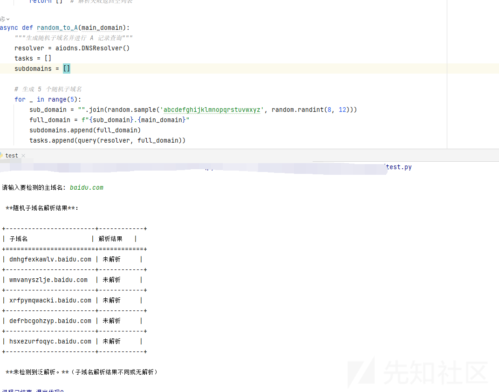

再次检测淘宝

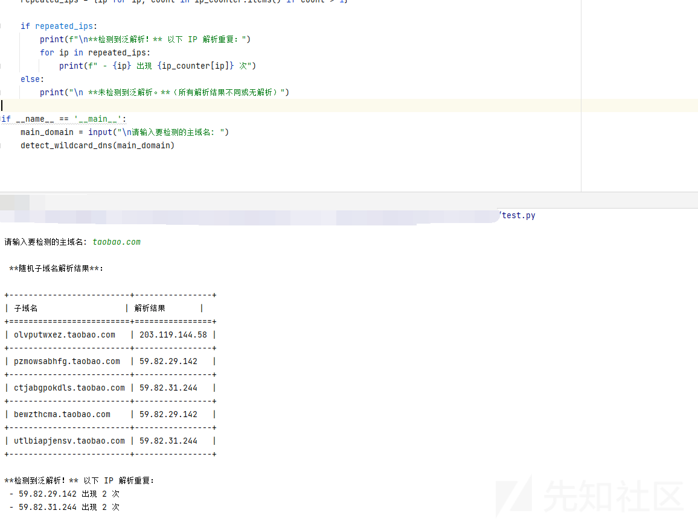

成功

### 突破泛解析困局

那如果遇到淘宝我们爆破收集子域名就会显得非常的鸡肋了，因为都是可以解析的，就会发现任意的域名都是 ok 的

#### CNAME 查询

如何突破呢

首先需要了解一下 CNAME 记录

CNAME（Canonical Name，规范名称）是一种 DNS（域名系统）记录，用于将一个域名指向另一个域名，而不是直接指向 IP 地址。

通常，一个域名的 DNS 解析会有不同的记录类型，例如：

A 记录：直接把域名映射到一个 IP 地址。  
CNAME 记录：把一个域名映射到另一个域名。  
CNAME 的作用是让多个域名指向同一个目标，但它们不会直接返回 IP，而是返回另一个域名，用户需要继续解析该域名，最终得到 IP 地址。

比如多个子域名共享同一个主机

```
www.example.com → CNAME main.example.com
mail.example.com → CNAME main.example.com
ftp.example.com → CNAME main.example.com
main.example.com → A 192.168.1.100

```

我们就以淘宝为例子

我们查询实际存在的域名看看结果

这里参考<https://blog.csdn.net/m0_51468027/article/details/128004275>

使用

```
import asyncio
import aiodns
import random
import optparse

# ✅ 兼容 Windows，强制使用 SelectorEventLoop
if hasattr(asyncio, 'WindowsSelectorEventLoopPolicy'):
    asyncio.set_event_loop_policy(asyncio.WindowsSelectorEventLoopPolicy())

loop = asyncio.get_event_loop()
resolver = aiodns.DNSResolver(loop=loop)


async def query(name, query_type):
    return await resolver.query(name, query_type)


def random_to_A(main_domain):
    total = []
    for _ in range(5):
        sub_domain = "".join(random.sample('abcdefghijklmnopqrstuvwxyz', random.randint(8, 12)))
        res = query(sub_domain + "." + main_domain, 'A')
        result = loop.run_until_complete(res)
        total.append(result)
    return total


def random_to_cname(sub_domain):
    res = query(sub_domain, 'CNAME')
    result = loop.run_until_complete(res)
    return result


if __name__ == '__main__':
    parser = optparse.OptionParser("%prog " + "[options] [domain]")
    parser.add_option('-a', action="store", dest='main_domain', type='string', help='')
    parser.add_option('-c', action="store", dest='sub_domain', type='string', help='')
    (options, args) = parser.parse_args()
    main_domain = options.main_domain
    sub_domain = options.sub_domain
    if main_domain:
        print(str(random_to_A(main_domain)).replace("],", "],
"))
    elif sub_domain:
        print(str(random_to_cname(sub_domain)).replace("<", "
<"))

```

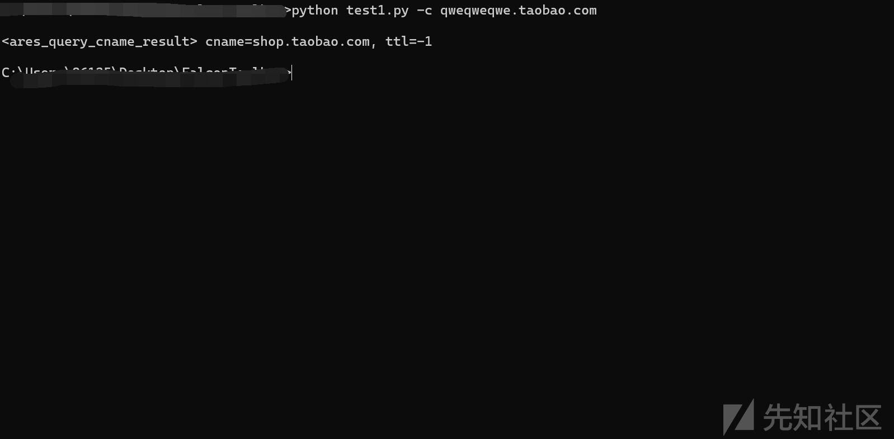

这个是不存在的，我们看看存在的

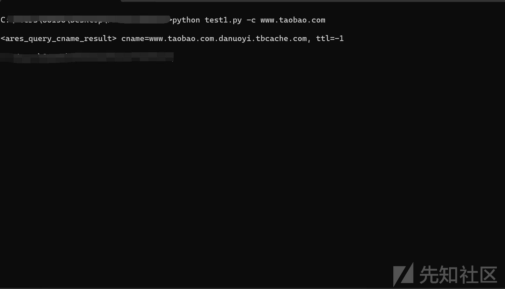

可以看见返回的 cname 记录是不一样的

当然为了验证，我们可以再次访问其他不存在的

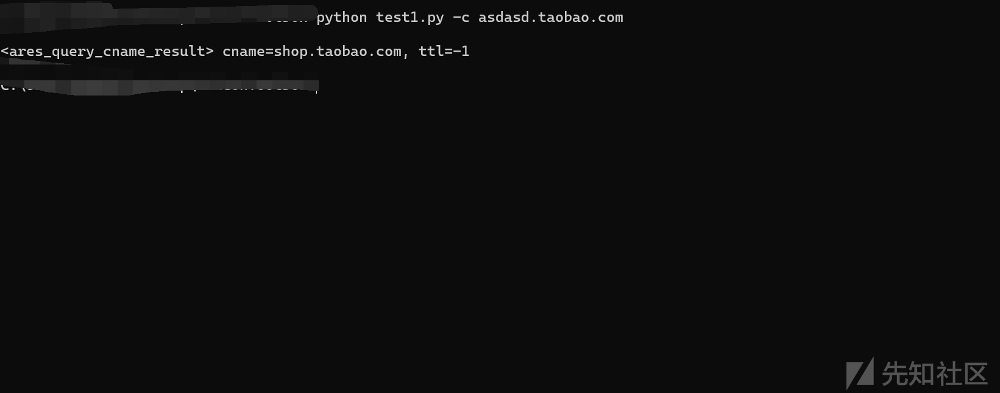

可以看到不存在是会指向我们的 shop.taobao.com

所以这个的处理思路就是

如果 CNAME 记录全部指向 shop.taobao.com，说明淘宝的泛解析策略是 CNAME 指向 shop.taobao.com

我们就可以排除解析到 shop.taobao.com 的域名，这样避免泛解析的影响

### A 记录查询命中次数

核心思路：如果 A 记录查询发现某个 IP 地址的命中次数超过 10 次，那么后续的 A 记录解析结果就不再显示该 IP 地址的子域名。

这个其实和概率有关系了，不过准确率还是很高的

```
a.example.com  -> 1.2.3.4
b.example.com  -> 1.2.3.4
c.example.com  -> 1.2.3.4

```

`\*.example.com 都解析到 1.2.3.4

我们的逻辑就是

记录所有解析结果的 IP 及其命中次数。

如果某个 IP 被解析超过 10 次，说明很可能是泛解析 IP。

后续爆破出的 子域名解析到该 IP，就 不再显示，避免泛解析干扰。

```
import asyncio
import aiodns
import random
from collections import defaultdict

# ✅ 兼容 Windows
if hasattr(asyncio, 'WindowsSelectorEventLoopPolicy'):
    asyncio.set_event_loop_policy(asyncio.WindowsSelectorEventLoopPolicy())

# 初始化 DNS 解析器
async def get_resolver():
    return aiodns.DNSResolver()

async def query(resolver, name, query_type):
    """执行 DNS 查询"""
    try:
        result = await resolver.query(name, query_type)
        return [r.host for r in result]
    except Exception:
        return []

async def random_to_A(resolver, main_domain):
    """随机生成子域名并查询 A 记录"""
    tasks = []
    subdomains = []
    ip_count = defaultdict(int)  # 统计 IP 解析次数
    valid_subdomains = []  # 存储有效的子域名

    for _ in range(50):  # 这里可以调整爆破的数量
        sub_domain = "".join(random.sample('abcdefghijklmnopqrstuvwxyz', random.randint(8, 12)))
        full_domain = f"{sub_domain}.{main_domain}"
        subdomains.append(full_domain)
        tasks.append(query(resolver, full_domain, 'A'))

    results = await asyncio.gather(*tasks)

    for sub, res in zip(subdomains, results):
        if res:
            for ip in res:
                ip_count[ip] += 1  # 统计 IP 解析次数
            valid_subdomains.append((sub, res))  # 记录有效子域名

    # 检测泛解析 IP（出现次数 >10 的 IP 视为泛解析）
    suspected_wildcard_ips = {ip for ip, count in ip_count.items() if count > 10}

    # 过滤掉泛解析污染的子域名
    final_results = [(sub, res) for sub, res in valid_subdomains if not set(res).intersection(suspected_wildcard_ips)]

    return final_results, suspected_wildcard_ips

async def detect_wildcard_dns(main_domain):
    """检测泛解析"""
    resolver = await get_resolver()
    final_results, wildcard_ips = await random_to_A(resolver, main_domain)

    print("
 **子域名解析结果**：
")
    for sub, res in final_results:
        print(f"{sub} -> {', '.join(res)}")

    if wildcard_ips:
        print("
 **⚠️ 可能的泛解析 IP（这些 IP 解析次数超过 10）:**")
        print("
".join(wildcard_ips))
    else:
        print("
 ✅ 未检测到泛解析污染。")

if __name__ == '__main__':
    main_domain = input("
请输入要检测的主域名: ")
    asyncio.run(detect_wildcard_dns(main_domain))  # ✅ Windows 兼容，替代 loop.run_until_complete()

```

或者使用之前的脚本

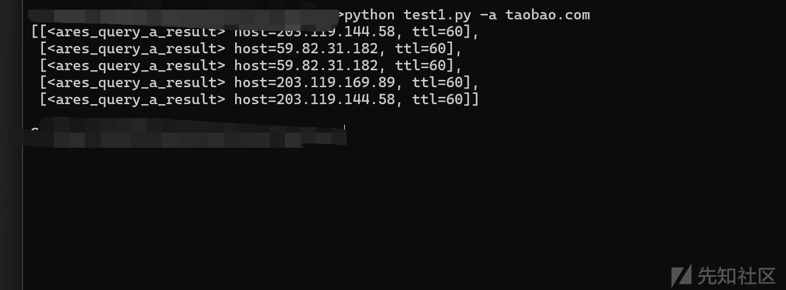

### 总结

最后参考<https://www.cnblogs.com/piaomiaohongchen/p/15959042.html>

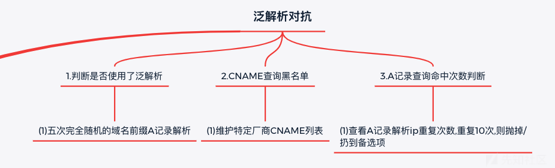
