# harmony逆向分析实践-先知社区

> **来源**: https://xz.aliyun.com/news/17277  
> **文章ID**: 17277

---

开局一个京麟的babyharmony.hap。

看看能不能启动这个hap。打开鸿蒙系统模拟器，尝试拖拽安装，但是失败了QAQ

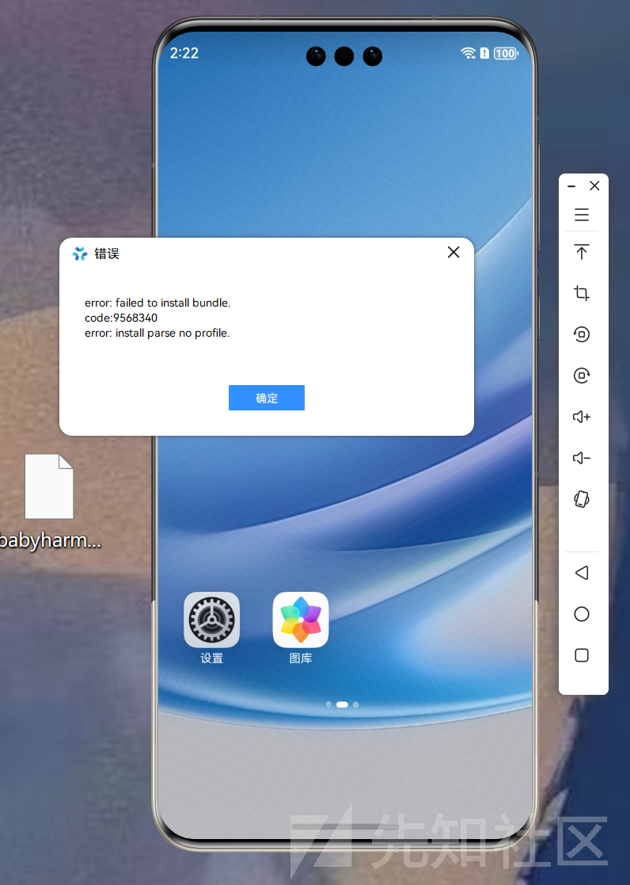

## arkts层

于是只能尝试查看里面代码了  
.hap文件是华为鸿蒙操作系统（HarmonyOS）特有的应用程序包格式。它类似于Android的.apk文件或iOS的.ipa 文件，用于在鸿蒙系统上安装和运行应用程序。.hap 文件包含了应用程序的代码、资源、第三方库和配置文件等

类似安卓，同样可以把.hap后缀改成.zip，解压即可查看到里面结构  
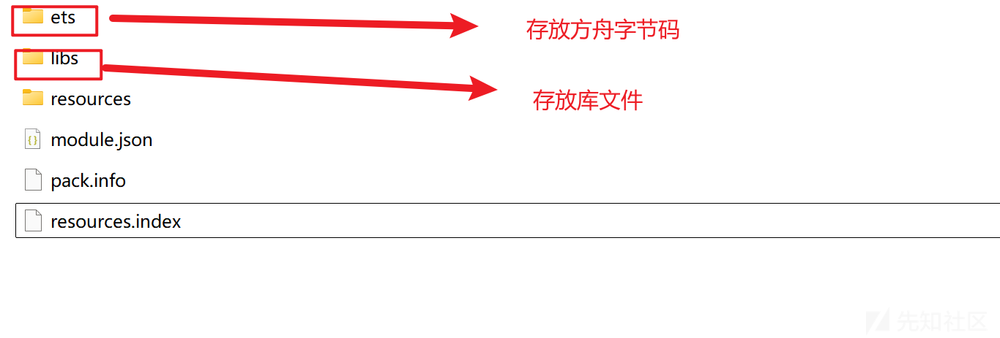  
进入ets文件夹，里面这个.abc文件即为方舟字节码  
方舟字节码（Ark Bytecode）是华为鸿蒙操作系统（HarmonyOS）中的一种新型字节码格式，由方舟编译器（Ark Compiler）将ArkTS、TS或JS代码编译成的二进制产物，后缀为.abc  
由于目前没有成熟的鸿蒙逆向工具，于是只能先尝试将方舟字节码以txt的形式打开，如果没有进行混淆加密处理的话，是可以看到ets源码的

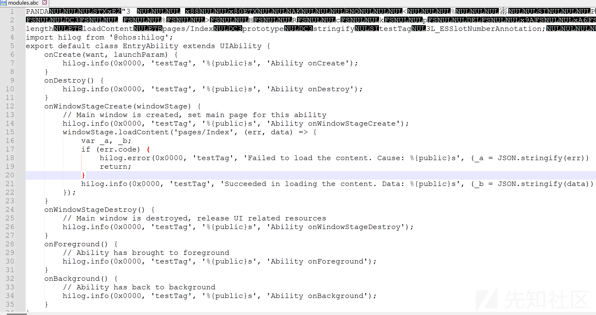

同时可以借助abc\_decompiler观察module的结构，abc-decompiler基于jadx和abcde实现的鸿蒙abc/方舟字节码的反编译工具。它将方舟字节码反编译成java代码，个人感觉在许多调用鸿蒙ArkUI或者内置库的地方难以观察（狗头保命，本人菜狗，大佬亲喷）  
地址：<https://github.com/ohos-decompiler/abc-decompiler>

直接将module.abc拖入工具界面，可以看到这个项目的entryability目录下有一个entryability.ets，pages目录下有一个index.ets

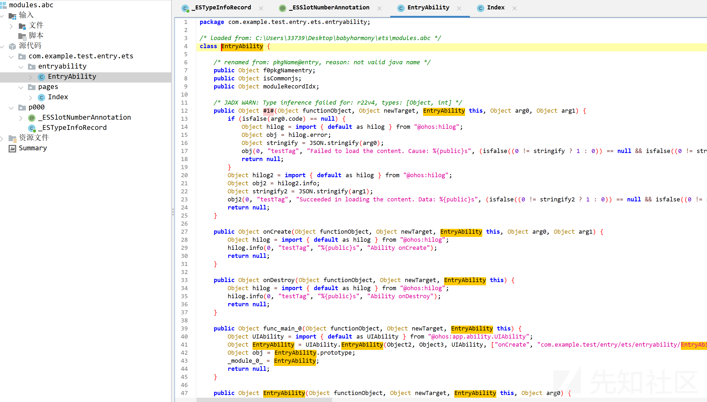

entryAbility：在鸿蒙系统中，EntryAbility是应用的入口点，类似于Android中的Activity。它负责承载应用的核心功能和用户界面，并处理用户交互。每个EntryAbility实例对应最近任务列表中的一个任务，可以包含多个页面来实现不同功能模块。EntryAbility的生命周期包括创建（Create）、前台（Foreground）、后台（Background）和销毁（Destroy）等状态，系统会在不同状态之间转换时调用相应的生命周期回调函数

pages：页面是基本的UI元素，它们承载用户界面并对用户交互做出响应。页面可以包含文本、图像、表格、超链接等基本元素。

知道结构后，我们回到notepad中可以找到entryability.ets,可以发现entryability中配置了pages/Index作为入口页

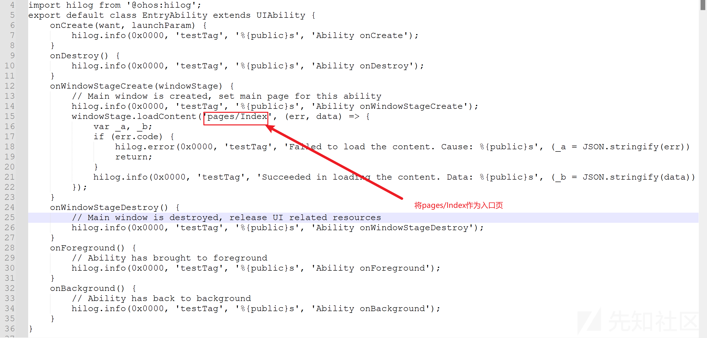

接着在index.ets的部分中找到了Index,嘿嘿您猜怎么着，看到了flag，应该是上道儿了。这部分UI代码应该是显示一个flag的提交框  
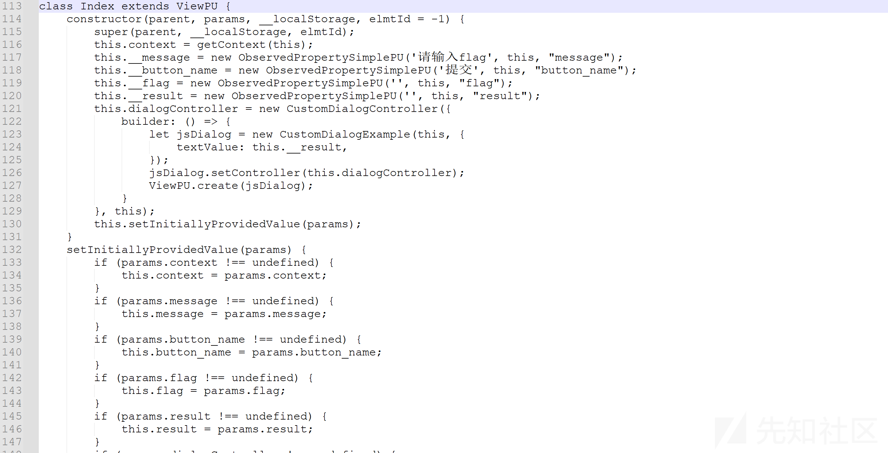  
继续往下看，发现了检查flag的check函数，  
`var c = testNapi.check(this.flag, value);`

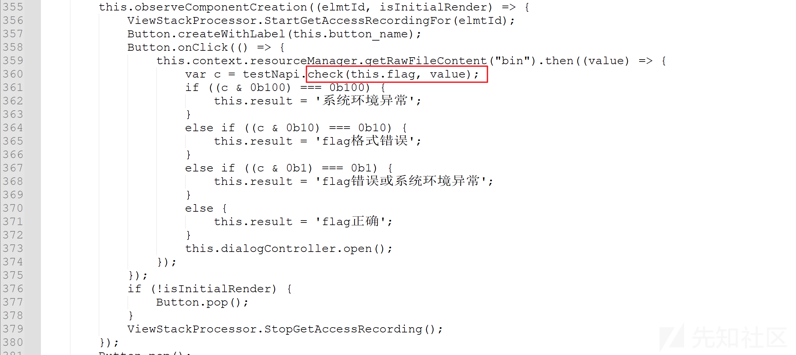

## native层正向了解

找一下这个testNapi

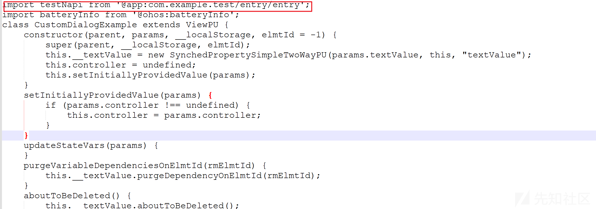

这个testNapi就是鸿蒙native层的接口了。

为了更好理解鸿蒙native接口，我们可以尝试使用鸿蒙原生开发工具deveco studio创建一个native c++项目


鸿蒙在加载so时，首先会进入RegisterEntryModule函数，调用napi\_module\_register方法，将模块demoMoudle注册到系统中，并调用模块初始化函数。

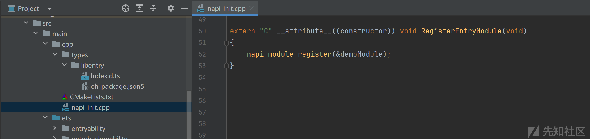

napi\_module有两个关键属性：一个是.nm\_register\_func，定义模块初始化函数；另一个是.nm\_modname，定义模块的名称，也就是ArkTS侧引入的so库的名称，模块系统会根据此名称来区分不同的so。

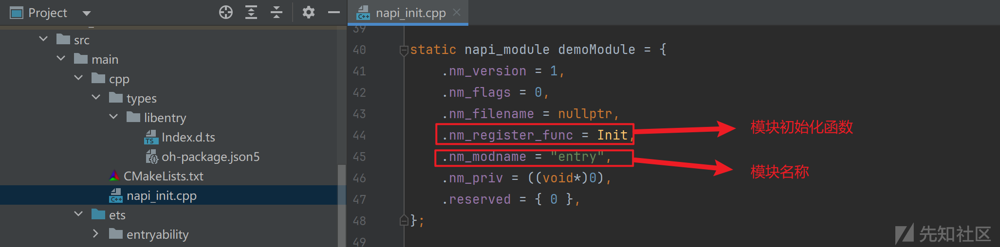

在init函数中会实现ArkTS接口与C++接口的绑定和映射  
napi\_define\_properties函数的主要功能是根据desc数组中提供的信息，在exports对象上定义相应的属性

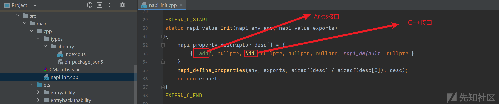  
C++接口的定义

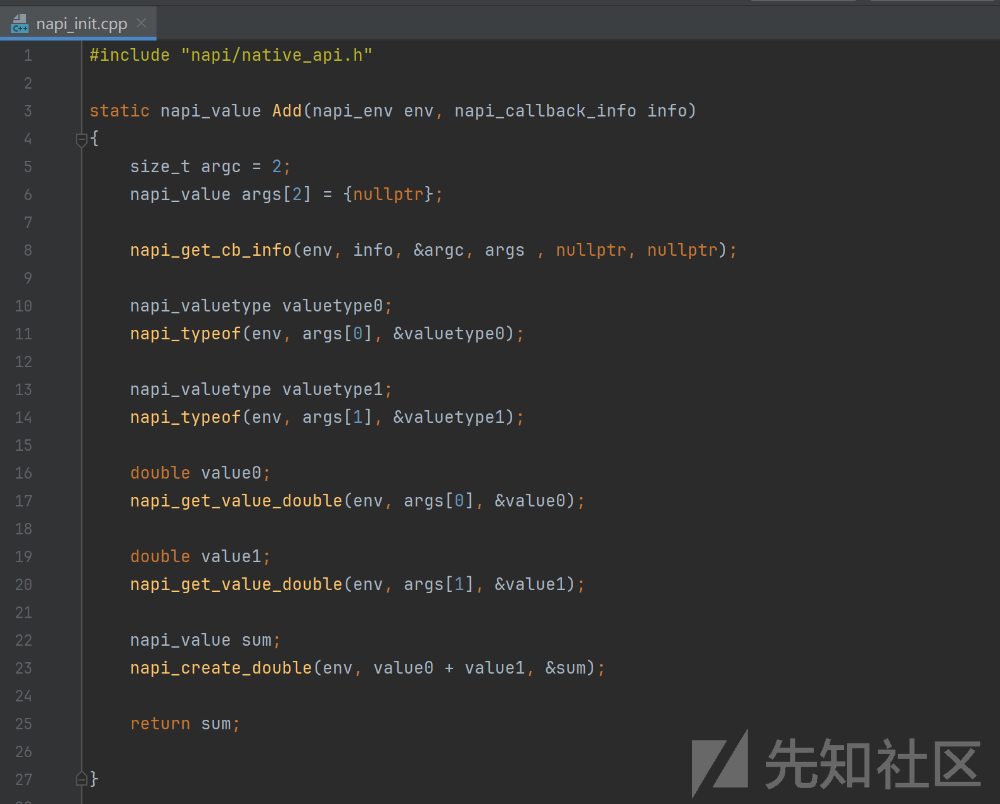

arkts接口的定义在index.d.ts文件中

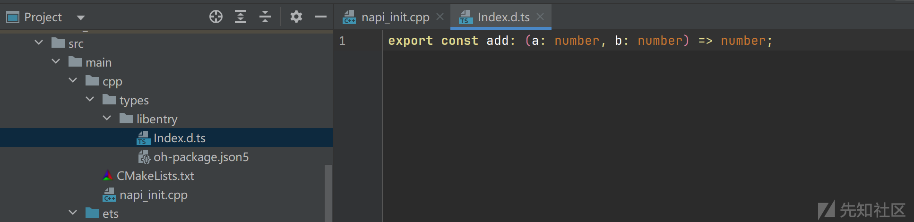  
CMakeLists.txt文件用于配置CMake打包参数

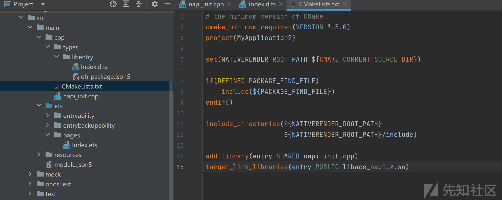

ArkTS侧通过import引入Native侧包含处理逻辑的so来使用C/C++的方法

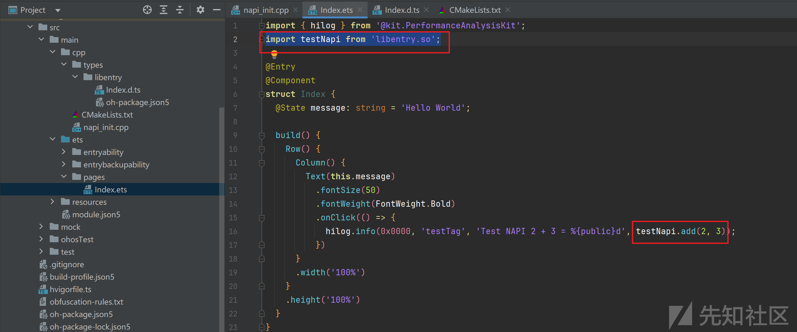

现在回到逆向代码，这里是导入了entry库，并将其赋值给testNapi变量，于是我们进入libs中寻找libentry.so

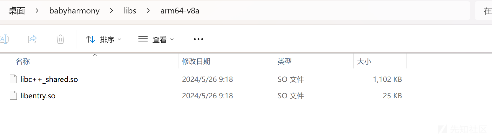

## native层逆向分析

直接把libentry.so弄进ida开始分析check

根据注册流程，系统会进入RegisterEntryModule函数，于是看导出部分

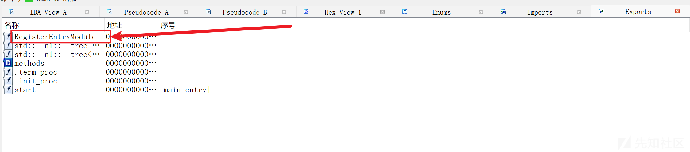

进入RegisterEntryModule，napi\_module\_register中的&unk\_8210就是模块指针  
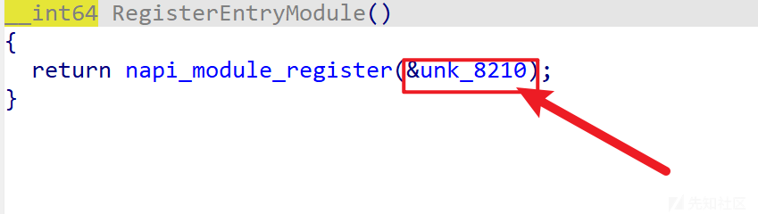

键入unk\_8210，看到entry了  
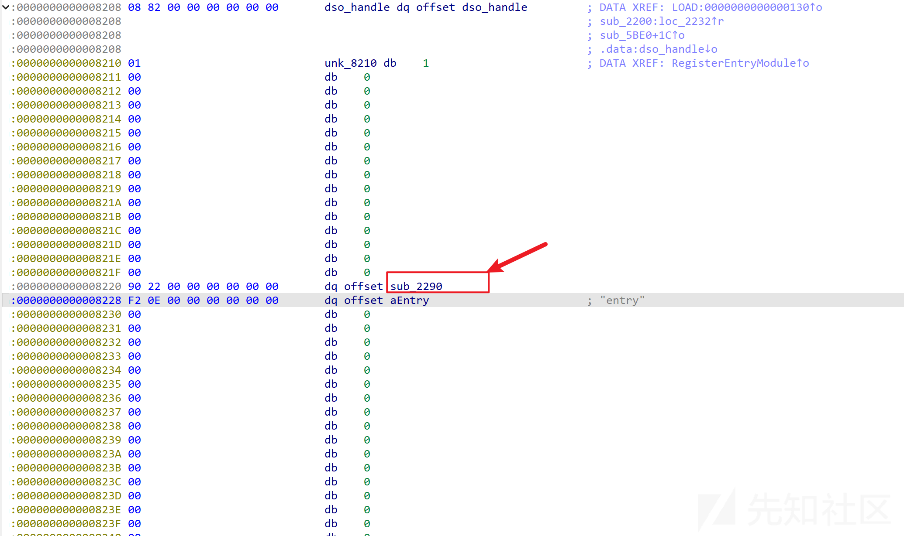

键入对应地址  


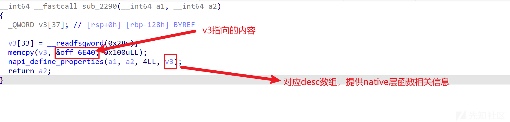

发现了check函数  
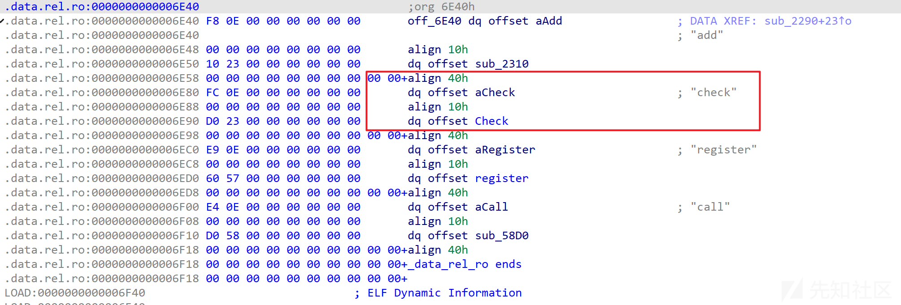

进入check,看嘛了。下面是结合网上大佬的文章，修改了一下参数名（太菜了qaq）  
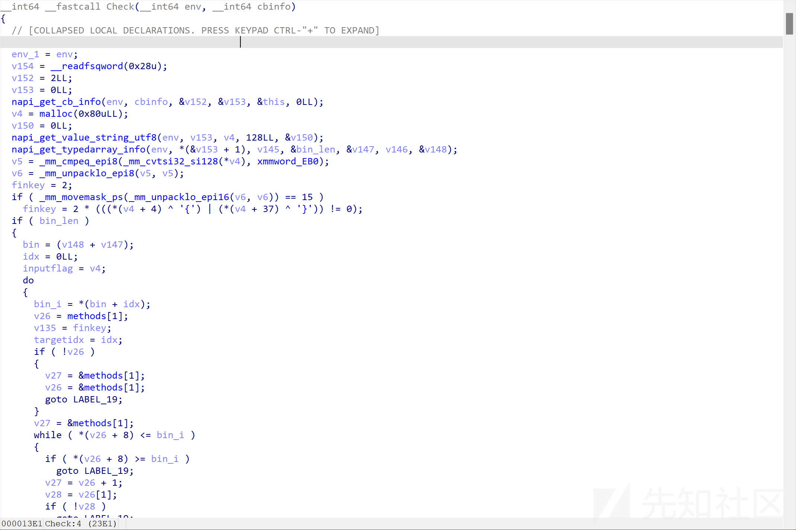

## check函数分析

​

先来说一下两个napi的接口

```
NAPI_EXTERN napi_status napi_get_reference_value(napi_env env, napi_ref ref, napi_value* result);
```

* napi\_env env:代表了函数被调用时所处的环境  
  napi\_ref ref:指向已经创建好的、指向特定JavaScript对象的引用，通过这个引用，函数就能知道要去获取哪个被引用的JavaScript对象对应的napi\_value  
  napi\_value\* result：这是一个输出参数，通过指针的形式传递。函数执行成功后，会将与传入的napi\_ref对应的 napi\_value（也就是被引用的那个JavaScript对象在N-API中的表示形式）存储到result所指向的内存位置中

```
NAPI_EXTERN napi_status napi_call_function(napi_env env, napi_value recv, napi_value func, size_t argc, const napi_value* argv, napi_value* result)
```

napi\_env env：代表了当前函数调用所处的运行环境  
napi\_value recv：在JavaScript中，函数内部可以通过this关键字来访问调用该函数时的上下文对象，在 N-API 里通过这个recv参数来传递相应的this值给要调用的JavaScript函数  
napi\_value func：指定要调用的那个JavaScript函数在N-API中的表示形式  
size\_t argc：用于表示后面argv参数所指向的数组中元素的个数，也就是要传递给被调用的JavaScript函数的参数个数  
const napi\_value\* argv：通过这个参数，可以将多个JavaScript值（以napi\_value形式表示）按照顺序传递给目标函数，就如同在JavaScript代码中直接调用函数并传入相应参数一样  
napi\_value\* result：这是一个输出参数，通过指针形式传递。当被调用的JavaScript函数执行完毕后，如果有返回值，那么这个返回值会以napi\_value的形式被存储到result所指向的内存位置中

这些代码就是在ArkTS源码区注册的回调函数，Native层的napi\_call\_function函数可以通过序号调用这些ArkTs层的代码

```
    aboutToAppear() {
        testNapi.register(0, (a) => {
            var t = batteryInfo.batterySOC - a;
            var f;
            if (t > 0)
                f = 1;
            else if (t == 0)
                f = 0;
            else
                f = -1;
            return f === 0;
        });
        ......
        testNapi.register(264, () => {
            return batteryInfo.batteryCapacityLevel;
        });
    }
```

下面梳理一下check中的关键点

一开始会初始化一些值，包括targetidx,然后进入Label19  
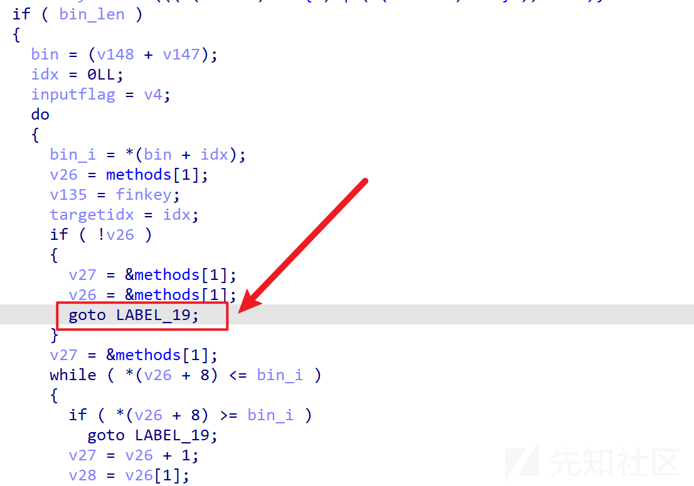

到Label19,获取bin中对应索引位置的序号，然后通过序号获取arkts对应的函数存到reg\_method\_0中，然后进入Label34

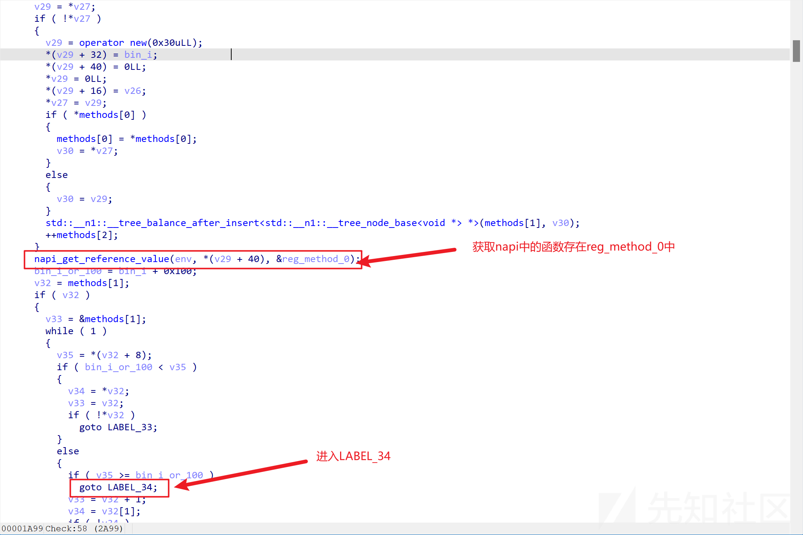

到了Label34,获取bin中对应索引位置的序号，然后通过序号获取arkts对应的函数存到reg\_method\_1，然后调用  
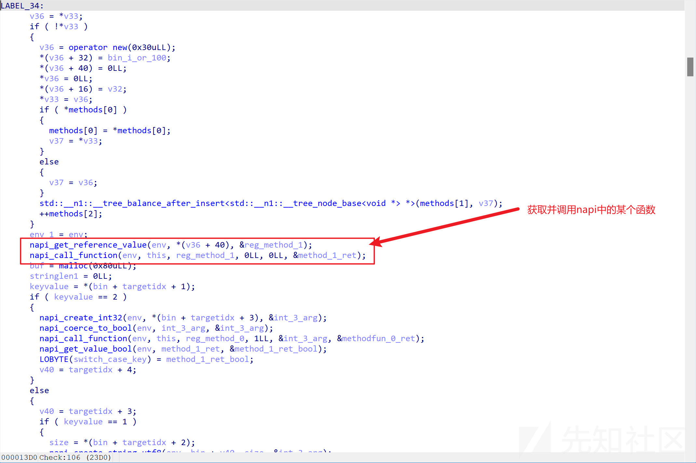

接着会对keyvalue进行判断  
如果keyvalue为2

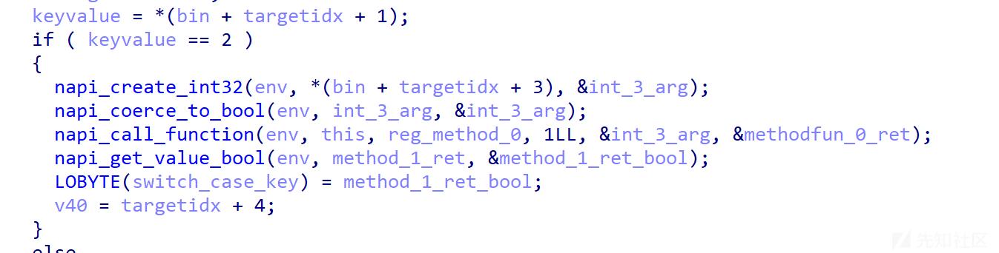

如果keyvalue为1

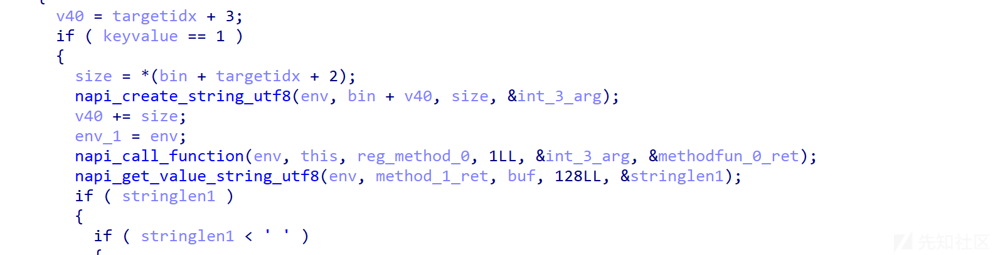  
如果keyvalue为0

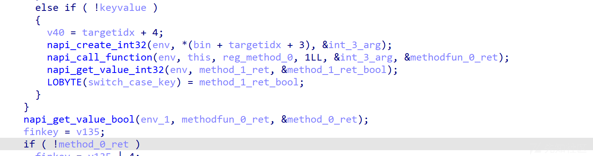

如果method\_0\_ret不为0之后会进行加密，这个加密里面有9个case，大致都是使用switch\_case\_key对flag的每个字符进行右移，异或，换位等相关操作。只要弄清楚了bin\_i和switch\_case\_key，可以尝试使用load-elf加载(<https://github.com/IchildYu/load-elf>)

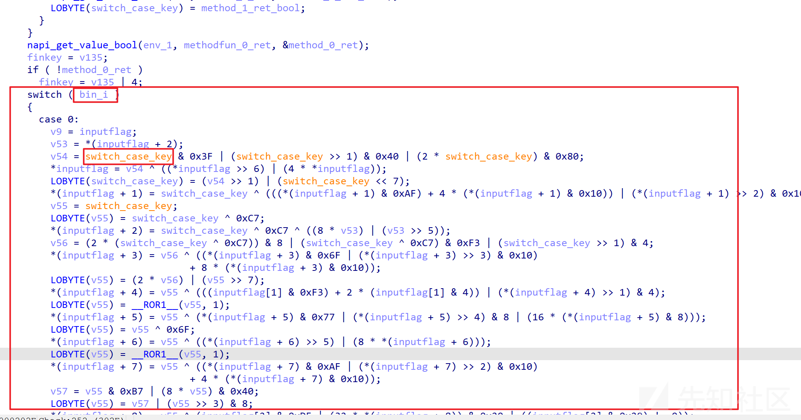

这个switch\_case\_key是reg\_method\_1的返回值

使用python模拟一下加密部分之前的代码

bin文件在resources的rawfile中  
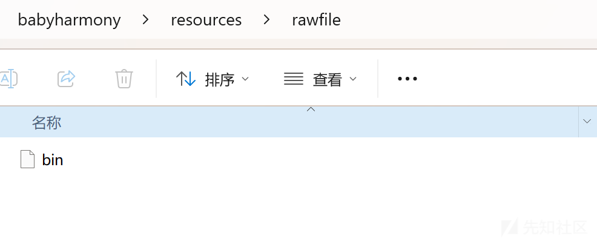

```
def dump_bin(bin):
    d = []
    pc = 0
    while pc < len(bin):
        op = bin[pc]   //op即为bin_i
        print('####################', pc, op)
        # 获取函数地址reg_method_0,通过bin[pc]查找
        # print('reg_method_0 = func[%d]' % (op))
        # 获取函数地址reg_method_1,通过bin[pc] | 0x100 查找
        # 调用reg_method_1获得返回值
        print('method_1_ret = call func[%d]' % (op | 0x100))
        # 获取操作类型
        type = bin[pc + 1]
        if type == 0:
            print('method_0_ret = call func[%d](%d)' % (op, bin[pc + 3]))
            key = bin[pc + 3]
            pc += 4
        elif type == 1:
            # 获取bin中字符串的长度
            size = bin[pc + 2]
            s = bin[pc + 3: pc + 3 + size]
            print('method_0_ret = call func[%d](%s)' % (op, repr(s)))
            pc += 3 + size
        elif type == 2:
            print('method_0_ret = call func[%d](%d)' % (op, bin[pc + 3]))
            key = bin[pc + 3]
            pc += 4
        else:
            pc += 3
            assert False
with open(r'.\bin', 'rb') as file:
    encrypted_data = file.read()
dump_bin(encrypted_data)
```

执行后可以看到调用流程

```
#################### 0 3
method_1_ret = call func[259]
method_0_ret = call func[3](1)
#################### 4 0
method_1_ret = call func[256]
method_0_ret = call func[0](100)
......
......
#################### 34 6
method_1_ret = call func[262]
method_0_ret = call func[6](50)
#################### 38 2
method_1_ret = call func[258]
method_0_ret = call func[2](2)
```

switch\_case\_key是method\_1\_ret,我们要找出method\_1\_ret的值  
在arkts中找对应序号的注册函数，看看第一个对应的

```
\t\tmethod_1_ret = call func[259]
\t\tmethod_0_ret = call func[3](1)

        testNapi.register(3, (a) => {
            var t = batteryInfo.pluggedType - a;
            var f;
            if (t > 0)
                f = 1;
            else if (t == 0)
                f = 0;
            else
                f = -1;
            return f === 0;
        });
        testNapi.register(259, () => {
            return batteryInfo.pluggedType;
        });
```

这个逻辑一眼顶针了一眼盯帧，method\_1\_ret要跟a相等，  
修改一下之前的模拟代码，即可获取到bin\_i和switch\_case\_key的元组了

```
def dump_bin(bin):
    d = []
    pc = 0
    while pc < len(bin):
        op = bin[pc]
        type = bin[pc + 1]
        if type == 2 or type == 0:
            key = bin[pc + 3]
            pc += 4
        elif type == 1:
            size = bin[pc + 2]
            s = bin[pc + 3: pc + 3 + size]
            key = 0
            for i in s: key ^= i
            pc += 3 + size
        else:
            pc += 3
            assert False
        d.append((op, key))
    return d
with open(r'.\bin', 'rb') as file:
    encrypted_data = file.read()
print(dump_bin(encrypted_data))
```

结果如下：

```
[(3, 1), (0, 100), (4, 10), (7, 0), (5, 101), (8, 1), (1, 3), (6, 50), (2, 2)]
```

接着就可以结合load-elf跑加密部分了  
安装load-elf  
`git clone https://github.com/IchildYu/load-elf.git`

​

编译lib  
`gcc ./x64_main.c -o lib -g -ldl -masm=intel -shared -fPIC`

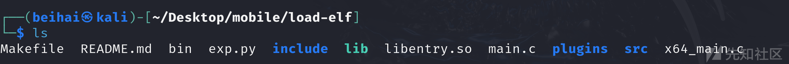

x64\_main.c源码

```
#include <stdio.h>
#include <dlfcn.h>
#include <string.h>
#include <assert.h>
#include <sys/mman.h>
#include <fcntl.h>
#include <unistd.h>
#include <stdint.h>
#include <stdlib.h>
#include <stdarg.h>
 
#define ERROR 0
#define WARNING 1
#define INFO 2
#define DEBUG 3
#define VERBOSE 4
 
const char* LOG_LEVEL_CHARS = "EWIDV";
const char* LOG_LEVEL_COLORS[] = {
    "\x1b[31m",
    "\x1b[33m",
    "\x1b[32m",
    "\x1b[0m",
    "\x1b[34m",
};
int _log_level = INFO;
int _log_color = 1;
 
void set_log_level(int log_level) {
    if (log_level < 0) log_level = 0;
    if (log_level > 4) log_level = 4;
    _log_level = log_level;
}
 
void set_log_color(int log_color) {
    _log_color = log_color;
}
 
void Log(int log_level, const char* format, ...) {
    if (log_level < 0) log_level = 0;
    if (log_level > 4) log_level = 4;
    if (log_level > _log_level) return;
    if (_log_color) printf("%s", LOG_LEVEL_COLORS[log_level]);
    printf("[%c] ", LOG_LEVEL_CHARS[log_level]);
    va_list args;
    va_start(args, format);
    vprintf(format, args);
    va_end(args);
    if (_log_color) printf("\x1b[0m");
}
 
#define LOGE(format, ...) Log(ERROR, format, ##__VA_ARGS__)
#define LOGW(format, ...) Log(WARNING, format, ##__VA_ARGS__)
#define LOGI(format, ...) Log(INFO, format, ##__VA_ARGS__)
#define LOGD(format, ...) Log(DEBUG, format, ##__VA_ARGS__)
#define LOGV(format, ...) Log(VERBOSE, format, ##__VA_ARGS__)
 
// default info
#define SET_LOGE() set_log_level(ERROR)
#define SET_LOGW() set_log_level(WARNING)
#define SET_LOGI() set_log_level(INFO)
#define SET_LOGD() set_log_level(DEBUG)
#define SET_LOGV() set_log_level(VERBOSE)
 
// default on
#define SET_LOGCOLOR_OFF() set_log_color(0)
#define SET_LOGCOLOR_ON() set_log_color(1)
 
 
#define R_NONE 0
#define R_COPY 5
#define R_GLOB_DAT 6
#define R_JUMP_SLOT 7
#define R_RELATIVE 8
#define R_IRELATIVE 37
 
typedef unsigned char uchar;
typedef unsigned short ushort;
typedef unsigned int uint;
typedef unsigned long long ullong;
 
typedef struct {
    uchar e_ident[16];
    ushort e_type;
    ushort e_machine;
    uint e_version;
    size_t e_entry;
    size_t e_phoff;
    size_t e_shoff;
    uint e_flags;
    ushort e_ehsize;
    ushort e_phentsize;
    ushort e_phnum;
    ushort e_shentsize;
    ushort e_shnum;
    ushort e_shtrndx;
} elf_header;
 
typedef struct {
    size_t d_tag;
    size_t d_un;
} elf_dyn;
 
typedef struct {
    size_t r_offset;
    size_t r_info;
} elf_rel;
 
typedef struct {
    size_t r_offset;
    size_t r_info;
    size_t r_addend;
} elf_rela;
 
// elf_sym.st_info
#define elf_st_bind(info) ((info) >> 4)
#define elf_st_type(info) ((info) & 0xf)
 
typedef struct {
    uint p_type;
    uint p_flags;
    size_t p_offset;
    size_t p_vaddr;
    size_t p_paddr;
    size_t p_filesz;
    size_t p_memsz;
    size_t p_align;
} elf_program_header;
 
typedef struct {
    uint st_name;
    uchar st_info;
    uchar st_other;
    ushort shndx;
    size_t st_value;
    size_t st_size;
} elf_sym;
 
// elf_rel[a].r_info
#define elf_r_sym(info) ((info) >> 32)
#define elf_r_type(info) ((uint) (info))
 
int do_reloc(void* base, size_t offset, size_t info, size_t addend, const elf_sym* symtab, const char* strtab) {
    #define sym (elf_r_sym(info))
    #define type (elf_r_type(info))
    #define value (symtab[sym].st_value)
    #define size (symtab[sym].st_size)
    #define name (strtab + symtab[sym].st_name)
    switch (type) {
    case R_NONE:
        break;
    case R_COPY:
        if (value) {
            memcpy((void*) ((size_t) base + offset), (const void*) ((size_t) base + value), size);
        } else {
            const void* sym_value = dlsym((void*) -1, name); // RTLD_DEFAULT
            if (!sym_value) {
                LOGW("failed to resolve symbol `%s'.
", name);
                break;
            }
            memcpy((void*) ((size_t) base + offset), sym_value, size);
        }
        break;
    case R_GLOB_DAT:
    case R_JUMP_SLOT:
        if (value) {
            *(size_t*) ((size_t) base + offset) = (size_t) base + value;
        } else {
            const void* sym_value = dlsym((void*) -1, name); // RTLD_DEFAULT
            if (!sym_value) {
                LOGW("failed to resolve symbol `%s'.
", name);
                break;
            }
            *(size_t*) ((size_t) base + offset) = (size_t) sym_value;
        }
        break;
    case R_RELATIVE:
        *(size_t*) ((size_t) base + offset) = (size_t) base + addend;
        break;
    case R_IRELATIVE:
        *(size_t*) ((size_t) base + offset) = ((size_t (*)()) ((size_t) base + addend))();
        break;
    case 1: // R_X86_64_64
        if (value) {
            *(size_t*) ((size_t) base + offset) = (size_t) base + value + addend;
        } else {
            const void* sym_value = dlsym((void*) -1, name); // RTLD_DEFAULT
            if (!sym_value) {
                LOGW("failed to resolve symbol `%s'.
", name);
                break;
            }
            *(size_t*) ((size_t) base + offset) = (size_t) sym_value + addend;
        }
        break;
    default:
        LOGW("unimplemented reloc type: %d.
", type);
        break;
    }
    #undef sym
    #undef type
    #undef value
    #undef size
    #undef name
    return 1;
}
 
 
#define SKIP_LOAD_WITH_DL
 
void* load_with_dl(const char* path) {
    #ifdef SKIP_LOAD_WITH_DL
        LOGD("SKIP_LOAD_WITH_DL defined, load_with_dl returns NULL.
");
        return NULL;
    #endif
    LOGI("loading %s with dlopen...
", path);
    void* handle = dlopen(path, RTLD_LAZY);
    if (handle == NULL) {
        LOGE("load_with_dl failed: %s.
", dlerror());
        return NULL;
    }
    void* base = *(void**) handle;
    LOGI("done, loaded at %p.
", base);
    return base;
}
 
int check_header(elf_header* header) {
    if (*(uint*) header->e_ident != 0x464c457f) {
        LOGE("elf magic header not detected.
");
        return 0;
    }
    if (header->e_ident[4] != (sizeof(void*) / 4)) { // ei_class, 1: ELFCLASS32, 2: ELFCLASS64
        LOGE("elf class mismatch.
");
        return 0;
    }
    if (header->e_ident[5] != 1) {
        LOGE("LSB expected.
");
        return 0;
    }
    if (header->e_type != 2 && header->e_type != 3) {
        LOGE("Dynamic library or executable expected.
");
        return 0;
    }
    if (header->e_ehsize != sizeof(elf_header)) {
        LOGE("Unexpected header size.
");
        return 0;
    }
    return 1;
}
 
const elf_dyn* find_dyn_entry(const elf_dyn* dyn, int type) {
    for (; dyn->d_tag != 0; dyn++) { // DT_NULL
        if (dyn->d_tag == type) return dyn;
    }
    return NULL;
}
 
int do_rel(void* base, const elf_rel* rel, int count, const elf_sym* symtab, const char* strtab) {
    for (int i = 0; i < count; i++) {
        if (!do_reloc(base, rel[i].r_offset, rel[i].r_info, *(size_t*) ((size_t) base + rel[i].r_offset), symtab, strtab))
            return 0;
    }
    return 1;
}
 
int do_rela(void* base, const elf_rela* rela, int count, const elf_sym* symtab, const char* strtab) {
    for (int i = 0; i < count; i++) {
        if (!do_reloc(base, rela[i].r_offset, rela[i].r_info, rela[i].r_addend, symtab, strtab))
            return 0;
    }
    return 1;
}
 
int check_and_do_rel(void* base, const elf_dyn* dyn, const elf_rel* rel, const elf_sym* symtab, const char* strtab) {
    if (find_dyn_entry(dyn, 0x13)->d_un != sizeof(elf_rel)) { // DT_RELENT
        LOGE("unexpected rel table entry size.
");
        return 0;
    }
    LOGD("do rel.
");
    int rel_count = find_dyn_entry(dyn, 0x12)->d_un / sizeof(elf_rel); // DT_RELSZ
    if (!do_rel(base, rel, rel_count, symtab, strtab)) return 0;
    return 1;
}
 
int check_and_do_rela(void* base, const elf_dyn* dyn, const elf_rela* rela, const elf_sym* symtab, const char* strtab) {
    if (find_dyn_entry(dyn, 0x9)->d_un != sizeof(elf_rela)) { // DT_RELAENT
        LOGE("unexpected rela table entry size.
");
        return 0;
    }
    LOGD("do rela.
");
    int rela_count = find_dyn_entry(dyn, 0x8)->d_un / sizeof(elf_rela); // DT_RELASZ
    if (!do_rela(base, rela, rela_count, symtab, strtab)) return 0;
    return 1;
}
 
int load_dynamic(void* base, const elf_dyn* dyn) {
    const elf_dyn* res = find_dyn_entry(dyn, 5); // DT_STRTAB
    if (res == NULL) {
        LOGE("string table not found.
");
        return 0;
    }
    const char* strtab = (const char*) ((size_t) base + res->d_un);
 
    const elf_sym* symtab = NULL;
    res = find_dyn_entry(dyn, 0x6); // DT_SYMTAB
    if (res != NULL) {
        symtab = (const elf_sym*) ((size_t) base + res->d_un);
        if (find_dyn_entry(dyn, 0xB)->d_un != sizeof(elf_sym)) { // DT_SYMENT
            LOGE("unexpected symbol table entry size.
");
            return 0;
        }
    }
 
    for (const elf_dyn* it = dyn; it->d_tag != 0; it++) {
        if (it->d_tag != 1) continue; // DT_NEEDED: name of needed library
        LOGD("loading needed library `%s'.
", strtab + it->d_un);
        if (!dlopen(strtab + it->d_un, RTLD_NOW | RTLD_GLOBAL))
            LOGW("failed to load needed library `%s': %s.
", strtab + it->d_un, dlerror());
    }
 
    int rel_done = 0;
    for (const elf_dyn* it = dyn; it->d_tag != 0; it++) { // DT_NULL
        switch (it->d_tag) {
        case 7: // DT_RELA
            if (rel_done) break;
            if (!check_and_do_rela(base, dyn, (const elf_rela*) ((size_t) base + it->d_un), symtab, strtab))
                return 0;
            rel_done = 1;
            break;
        case 0x11: // DT_REL
            if (rel_done) break;
            if (!check_and_do_rel(base, dyn, (const elf_rel*) ((size_t) base + it->d_un), symtab, strtab))
                return 0;
            rel_done = 1;
            break;
        case 0x17: // DT_JMPREL
            ;
            size_t plt_rel_size = find_dyn_entry(dyn, 0x2)->d_un; // DT_PLTRELSZ
            int plt_rel = find_dyn_entry(dyn, 0x14)->d_un; // DT_PLTREL
            if (plt_rel == 0x11) { // DT_REL
                if (!rel_done) {
                    res = find_dyn_entry(dyn, 0x11); // DT_REL
                    if (res != NULL) {
                        if (!check_and_do_rel(base, dyn, (const elf_rel*) ((size_t) base + res->d_un), symtab, strtab))
                            return 0;
                        rel_done = 1;
                    }
                }
                plt_rel_size /= sizeof(elf_rel);
                LOGD("do jmprel with rel.
");
                if (!do_rel(base, (elf_rel*) ((size_t) base + it->d_un), plt_rel_size, symtab, strtab)) return 0;
            } else if (plt_rel == 7) { // DT_RELA
                if (!rel_done) {
                    res = find_dyn_entry(dyn, 7); // DT_RELA
                    if (res != NULL) {
                        if (!check_and_do_rela(base, dyn, (const elf_rela*) ((size_t) base + res->d_un), symtab, strtab))
                            return 0;
                        rel_done = 1;
                    }
                }
                plt_rel_size /= sizeof(elf_rela);
                LOGD("do jmprel with rela.
");
                if (!do_rela(base, (elf_rela*) ((size_t) base + it->d_un), plt_rel_size, symtab, strtab)) return 0;
            } else {
                LOGE("unexpected plt rel type: %d.
", plt_rel);
                return 0;
            }
            break;
        }
    }
 
    res = find_dyn_entry(dyn, 0xC); // DT_INIT
    if (res != NULL) {
        void (*init)() = (void (*)()) ((size_t) base + res->d_un);
        LOGI("init proc detected: %p.
", init);
        int choice = 'y';
        do {
            LOGI("Execute init proc? [(y)es/(n)o] ");
            choice = getchar();
            if (choice != '
') while (getchar() != '
') ;
            if (choice >= 'A' && choice <= 'Z') choice += 0x20;
        } while (choice != 'y' && choice != 'n');
        if (choice == 'y') init();
    }
 
    res = find_dyn_entry(dyn, 0x19); // DT_INIT_ARRAY
    if (res != NULL) {
        void (**init_array)() = (void (**)()) ((size_t) base + res->d_un);
        int count = find_dyn_entry(dyn, 0x1B)->d_un / sizeof(size_t); // DT_INIT_ARRAYSZ
        while (*init_array == NULL && count) {
            init_array++;
            count--;
        }
        if (count) {
            LOGI("init array detected:
");
            int choice = '?';
            for (int i = 0; i < count; i++) {
                if (!init_array[i]) continue;
                while (choice != 'y' && choice != 'n' && choice != 'a' && choice != 'o') {
                    LOGI("\texecute function %p? [(y)es/(n)o/(a)ll items left/n(o)ne items left] ", init_array[i]);
                    choice = getchar();
                    if (choice != '
') while (getchar() != '
') ; // skip line
                    if (choice >= 'A' && choice <= 'Z') choice += 0x20; // convert to lower case
                }
                if ((uchar) (choice - 'n') > 2) { // 'y' or 'a'
                    LOGI("\texecuting function at %p...
", init_array[i]);
                    init_array[i]();
                    if (choice == 'y') choice = '?';
                } else if (choice == 'n') choice = '?';
            }
        }
    }
 
    res = find_dyn_entry(dyn, 0xD); // DT_FINI
    if (res != NULL) {
        void (*fini)() = (void (*)()) ((size_t) base + res->d_un);
        LOGI("fini proc detected: %p.
", fini);
    }
 
    res = find_dyn_entry(dyn, 0x1A); // DT_FINI_ARRAY
    if (res != NULL) {
        void (**fini_array)() = (void (**)()) ((size_t) base + res->d_un);
        int count = find_dyn_entry(dyn, 0x1C)->d_un / sizeof(size_t); // DT_FINI_ARRAYSZ
        while (*fini_array == NULL && count) {
            fini_array++;
            count--;
        }
        if (count) {
            LOGI("fini array detected:
");
            for (int i = 0; i < count; i++) {
                if (fini_array[i]) {
                    LOGI("\t%p
", fini_array[i]);
                }
            }
        }
    }
    LOGI("load_dynamic done.
");
    return 1;
}
 
#define MMAP_LOAD_BASE ((void*) 0xC0000000)
void* load_with_mmap(const char* path) {
    LOGI("loading %s with mmap...
", path);
    int fd = open(path, O_RDONLY);
    LOGV("open(path, O_RDONLY) returns %d
", fd);
 
    elf_header header;
    LOGV("reading elf header from file...
");
    if (read(fd, &header, sizeof(header)) != sizeof(header)) {
        LOGE("read header error
");
        close(fd);
        return NULL;
    }
    LOGV("checking elf header...
");
    if (!check_header(&header)) {
        close(fd);
        return NULL;
    }
 
    elf_program_header pheader;
    elf_dyn* dyn = NULL;
 
    int e_phentsize = header.e_phentsize;
    int e_phnum = header.e_phnum;
 
    if (e_phentsize != sizeof(pheader)) {
        LOGE("unexpected program header size.
");
        close(fd);
        return NULL;
    }
 
    LOGV("determine LOAD_BASE...
");
    void* base = MMAP_LOAD_BASE;
    while (base != mmap(base, 0x1000, PROT_READ|PROT_WRITE|PROT_EXEC, MAP_PRIVATE|MAP_ANONYMOUS, -1, 0)) {
        base = (void*) ((size_t) base + 0x1000000);
    }
    munmap(base, 0x1000);
    LOGD("trying loading at %p
", base);
 
    lseek(fd, header.e_phoff, SEEK_SET);
    for (int i = 0; i < e_phnum; i++) {
        LOGV("processing phdr %d...
", i);
        if (read(fd, &pheader, sizeof(pheader)) != sizeof(pheader)) {
            LOGE("read pheader error
");
            close(fd);
            return NULL;
        }
        if (pheader.p_type != 1 || pheader.p_memsz == 0) { // not PT_LOAD or nothing to load
            if (pheader.p_type == 2) { // DYNAMIC
                if (dyn != NULL) {
                    LOGE("duplicated DYNAMIC PHT detected.
");
                    close(fd);
                    return NULL;
                } else {
                    dyn = (elf_dyn*) ((size_t) base + pheader.p_vaddr);
                }
            }
            continue;
        }
        void* addr = (void*) (((size_t) base + pheader.p_vaddr) & ~0xfff);
        int offset = pheader.p_vaddr & 0xfff;
        size_t size = (offset + pheader.p_filesz + 0xfff) & ~0xfff;
        if (addr != mmap(addr, size, PROT_READ|PROT_WRITE|PROT_EXEC, MAP_PRIVATE, fd, pheader.p_offset - offset)) {
        // if (addr != mmap(addr, pheader.p_memsz + offset, PROT_READ|PROT_WRITE|PROT_EXEC, MAP_PRIVATE, fd, pheader.p_offset - offset)) {
        // if ((uchar*) addr != (uchar*) base + pheader.p_vaddr) {
            LOGE("failed to mmap 0x%lx to 0x%lx.
", pheader.p_offset, pheader.p_vaddr + (size_t) base);
            close(fd);
            return NULL;
        }
        if (offset) {
            memset(addr, 0, offset);
        }
        if (pheader.p_memsz != pheader.p_filesz) {
            if (pheader.p_memsz < pheader.p_filesz) {
                LOGE("unexpected: filesz bigger than memsz.
");
                close(fd);
                return NULL;
            }
            if (pheader.p_memsz + offset > size) {
                LOGV("mmap extra pages in memory
");
                addr = (void*) ((size_t) addr + size);
                if (addr != mmap(addr, pheader.p_memsz + offset - size, PROT_READ|PROT_WRITE|PROT_EXEC, MAP_ANON | MAP_SHARED, -1, 0)) {
                    LOGE("failed to mmap 0x%lx to 0x%lx.
", pheader.p_offset, pheader.p_vaddr + (size_t) base);
                    close(fd);
                    return NULL;
                }
            }
        }
 
        {
            LOGV("testing memory...
");
            char c = *(unsigned char*) (pheader.p_vaddr + (size_t) base);
            c = *(unsigned char*) (pheader.p_vaddr + (size_t) base + pheader.p_filesz - 1);
            c = *(unsigned char*) (pheader.p_vaddr + (size_t) base + pheader.p_memsz - 1);
        }
        LOGD("mmaped 0x%lx to 0x%lx, filesz 0x%lx, memsz 0x%lx
", pheader.p_offset, pheader.p_vaddr + (size_t) base, pheader.p_filesz, pheader.p_memsz);
    }
    LOGI("done, loaded at %p
", base);
    close(fd);
 
    if (!dyn) return base;
 
    LOGI("DYNAMIC detected, loading...
");
    if (!load_dynamic(base, dyn)) return NULL;
    return base;
}
 
const elf_dyn* get_dyn(void* base) {
    elf_header* header = (elf_header*) base;
    int e_phnum = header->e_phnum;
    elf_program_header* pheader = (elf_program_header*) ((size_t) base + header->e_phoff);
    for (int i = 0; i < e_phnum; i++, pheader++) {
        if (pheader->p_type == 2) {
            return (elf_dyn*) ((size_t) base + pheader->p_vaddr);
        }
    }
}
 
void* get_symbol_by_name(void* base, const char* symbol) {
    const elf_dyn* dyn = get_dyn(base);
    const char* strtab = (const char*) (find_dyn_entry(dyn, 5)->d_un); // DT_STRTAB
 
    if (strtab < (const char*) base)
        strtab = (const char*) strtab + (size_t) base;
    size_t strsz = find_dyn_entry(dyn, 0xa)->d_un; // DT_STRSZ
    const elf_sym* symtab = (const elf_sym*) (find_dyn_entry(dyn, 6)->d_un); // DT_SYMTAB
    if ((const char*) symtab < (const char*) base)
        symtab = (const elf_sym*) ((const char*) symtab + (size_t) base);
 
    for (; ; symtab++) {
        if (symtab->st_name == 0) continue;
        if (symtab->st_name >= strsz) {
            LOGE("failed to resolve symbol `%s' from library (%p): not found.
", symbol, base);
            return NULL;
        }
        if (strcmp(strtab + symtab->st_name, symbol) == 0) {
            if (symtab->st_value == 0) {
                LOGE("failed to resolve symbol `%s' from library (%p): value is NULL.
", symbol, base);
                return NULL;
            }
            if (elf_st_type(symtab->st_info) != 10) { // STT_GNU_IFUNC
                return (void*) ((size_t) base + symtab->st_value);
            }
            return ((void* (*)()) ((size_t) base + symtab->st_value))();
        }
    }
}
 
void* get_symbol_by_offset(void* base, size_t offset) {
    return (void*) ((size_t) base + offset);
}
 
void* load_elf(const char* elf_path) {
    void* base = load_with_dl(elf_path);
    if (base == NULL) {
        base = load_with_mmap(elf_path);
    }
    //assert(base != NULL && *(unsigned int*) base == 0x464c457f);
    return base;
}
 
 
// gcc ./x64_main.c -o main -g -ldl
__asm__(
    "__round:
"
    "sub rsp, 0x10
"
    "mov [rsp+0x8], rdi
"
    "mov r12, rsi
"
    "call rdx
"
    "add rsp, 0x10
"
    "ret
"
);
 
void __round(unsigned char* array, int key, void* entry);
 
extern int bf_round(int key, int offset, int index);
extern void setup();
extern void one_round(unsigned char* array, int key, int offset);
 
static char* base;
 
void setup() {
    // SET_LOGE();
    const char* path = "./libentry.so";
    base = load_elf(path);
    *(base + 0x2a07) = 0xc3; // ret
}
 
void one_round(unsigned char* array, int key, int offset) {
    if (base == NULL) setup();
    __round(array, key, base + offset);
}
 
unsigned char g(unsigned char x, unsigned char n) {
    return (x >> n) & 1;
}
 
unsigned char s(unsigned char x, unsigned char n) {
    return (x & 1) << n;
}
 
unsigned char swapbit(unsigned char x, unsigned char m, unsigned char n) {
    if (m == n) return x;
    return s(g(x, m), n) | s(g(x, n), m) | (x & ~(s(1, n) | s(1, m)));
}
 
unsigned char bit_length(unsigned char x) {
    if (x == 0) return 0;
    for (int i = 8; i > 0; i--) {
        if (x & (1 << (i - 1))) return i;
    }
}
 
unsigned char swapkeep(unsigned char x, unsigned char mask) {
    unsigned char swapbits = ~mask & 0xff;
    unsigned char m = bit_length(swapbits) - 1;
    assert(0 <= m && m < 7);
    swapbits ^= 1 << m;
    unsigned char n = bit_length(swapbits) - 1;
    assert(0 <= n && n < 7);
    swapbits ^= 1 << n;
    assert(swapbits == 0);
    return swapbit(x, m, n);
}
 
unsigned char ror1(unsigned char x, unsigned char n) {
    n &= 7;
    x &= 0xff;
    return (x >> n) | (x << (8 - n)) & 0xff;
}
 
unsigned char rol1(unsigned char x, unsigned char n) {
    return ror1(x, 8 - n);
}
 
#define XOR 0 // c ^ val0 ^ val1
#define ROT 1 // ror1(c, val0) ^ val1
#define SWP 2 // swapkeep(c, val0) ^ val1
#define MAKE_RET_VAL(type, val0, val1) (((type) << 16) | ((val0) << 8) | (val1))
 
int bf_round(int key, int offset, int index) {
    if (base == NULL) setup();
    unsigned char array[38];
    array[index] = 0;
    __round(array, key, base + offset);
    unsigned char val1 = array[index];
 
    int flag = 0;
    // test xor
    for (int i = 0; i < 7; i++) {
        array[index] = 1 << i;
        __round(array, key, base + offset);
        array[index] ^= val1;
        if (array[index] != (1 << i)) {
            flag = 1;
            break;
        }
    }
    if (flag == 0) { // XOR
        return MAKE_RET_VAL(XOR, 0, val1);
    }
 
    // test rol1
    array[index] = 1;
    __round(array, key, base + offset);
    array[index] ^= val1;
    unsigned char val0 = bit_length(array[index]);
    assert(val0 != 0);
    val0--;
    if (val0 != 0) {
        assert(array[index] == (1 << val0));
        for (int i = 1; i < 7; i++) {
            array[index] = 1 << i;
            __round(array, key, base + offset);
            array[index] ^= val1;
            if (array[index] != (1 << ((i + val0) % 8))) {
                flag = 0;
                break;
            }
        }
        if (flag == 1) {
            return MAKE_RET_VAL(ROT, 8 - val0, val1);
        }
    }
 
    // swapkeep
    for (int i = 0; i < 7; i++) {
        array[index] = 1 << i;
        __round(array, key, base + offset);
        array[index] ^= val1;
        if (array[index] != (1 << i)) {
            assert(bit_length(array[index]));
            assert(array[index] == (1 << (bit_length(array[index]) - 1)));
            val0 = ~((1 << i) | array[index]);
            return MAKE_RET_VAL(SWP, val0, val1);
        }
    }
    assert(0);
}
 
// gcc ./x64_main.c -o lib -g -ldl -masm=intel -shared
int main() {
    {
        const char* path = "/lib/x86_64-linux-gnu/libm.so.6";
        void* base = load_elf(path);
 
        double (*pow)(double, double) = get_symbol_by_name(base, "pow");
        double a = 3.14159;
        double b = a;
        printf("%g ** %g == %g
", a, b, pow(a, b));
    }
    /**/
 
    const char* path = "/lib/x87_64-linux-gnu/libc++.so.1";
    void* base = load_elf(path);
    void* std_cout = get_symbol_by_name(base, "_ZNSt3__14coutE");
    // offset may be different
    // std::ostream::operator<<(int)
    void* (*print_int)(void*, int) = get_symbol_by_offset(base, 0x5e380);
    // std::ostream::put(char)
    void* (*print_char)(void*, char) = get_symbol_by_offset(base, 0x5f510);
    print_char(print_int(std_cout, 114514), '
');
    /**/
 
    puts("done.");
    return 0;
}
            
```

运行exp.py

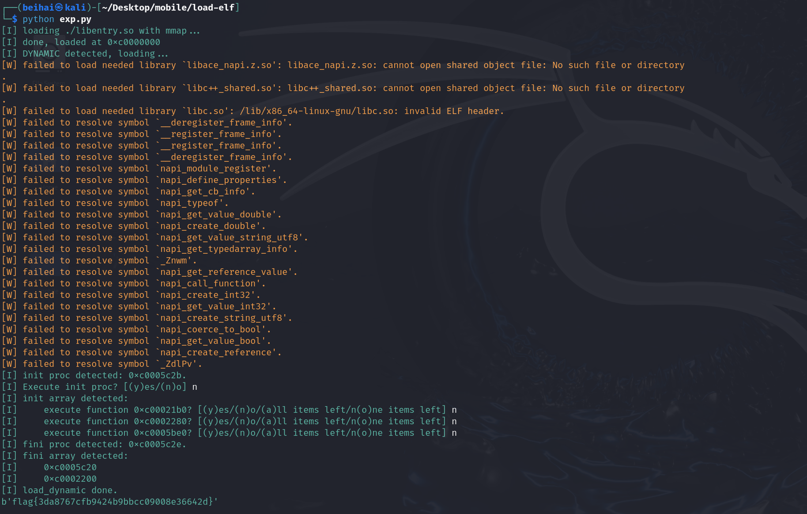

## 参考文章

<https://bbs.kanxue.com/thread-282037-1.htm>

<https://ycznkvrmzo.feishu.cn/docx/ZqU0dU0h2oW3eFxZtZMctShFnyh>
