# ExtJS Direct请求中的RCE&代码分析-先知社区

> **来源**: https://xz.aliyun.com/news/17293  
> **文章ID**: 17293

---

# 前言

一次php源代码审计的全局分析，从ExtJS Direct请求RCE到各种逻辑缺陷代码的分析思考与讨论

# RCE

通过查看前端源码发现存在存在ExtJS Direct请求，ExtJS Direct 是一个用于简化前端与后端通信的框架，允许前端通过 JSON 格式发送请求到后端，并由后端处理这些请求。我们可以发现/xxx/xxx/router路由

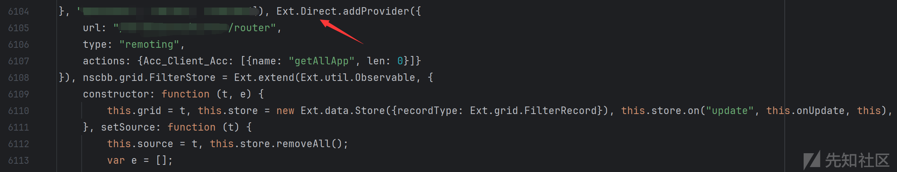

这种路由方式一般存在会如下几个请求参数，分别为

action：指定后端类名

method：指定要调用的方法

data：传递给方法的参数

type：请求类型

tid：事务 ID

```
{"action":"","method":"","data":"","type":"rpc","tid":17}
```

通过全局搜索/xxx/xxx/router路由，发现存在一个Ext\_Direct类文件，这是一个典型的基于 ExtJS Direct 的后端处理逻辑，用于处理前端发送的 RPC（远程过程调用）请求，作为一个工具类使用。

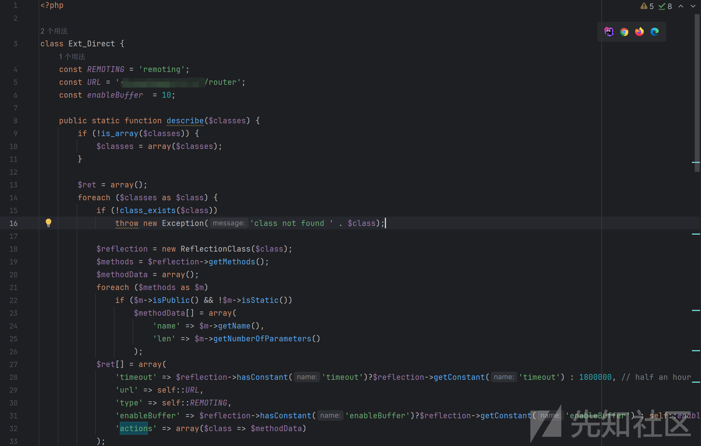

这里可以全局搜索一下exec(、shell\_exec(这些函数，加括号可以搜索的更加准确。发现在resource文件下存在shell\_exec函数

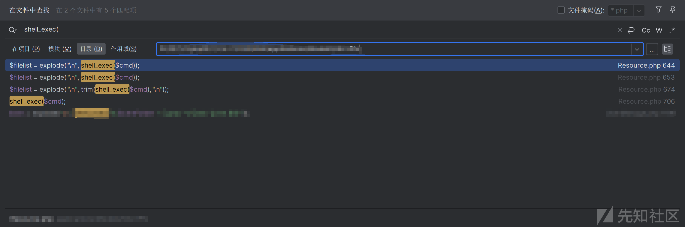

跟进这个文件中，发现是一个为xxage的函数中，其中主要的代码逻辑为删除文件，但是存在用户输入可控问题从而导致RCE

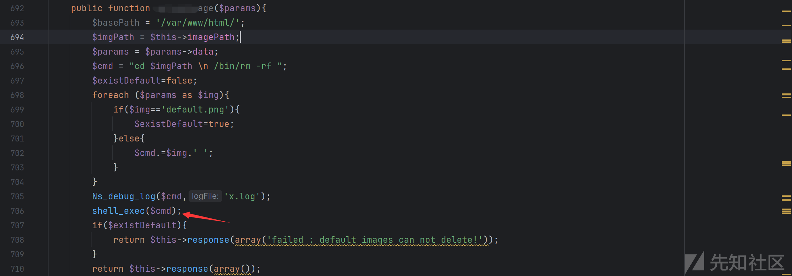

我们查看该类可以发现为xxx\_resource

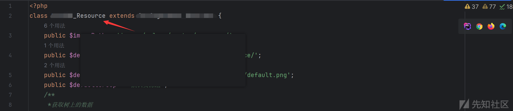

因此根据上述讲到的ExtJS Direct请求方式可以直接构造payload，其中action为类名，method为方法名，而这里传入的参数根据代码逻辑分析为数组形式

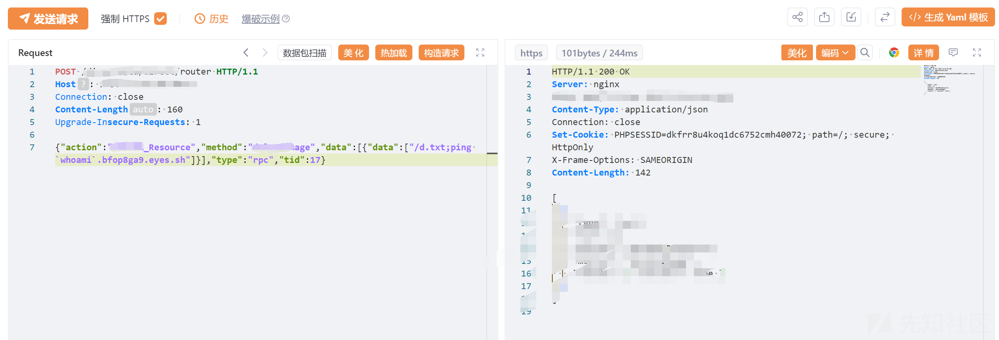

发起请求dnslog，成果命令执行外带出服务器用户名

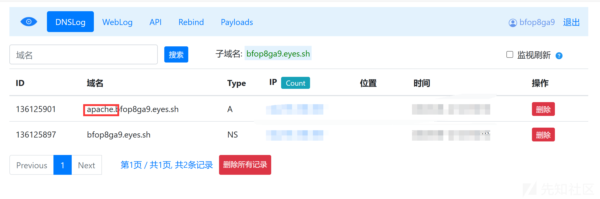

# 逻辑缺陷

在代码审计中还发现register条件中疑似存在用户名添加的代码逻辑，其中主要调用adduserreview函数进行处理

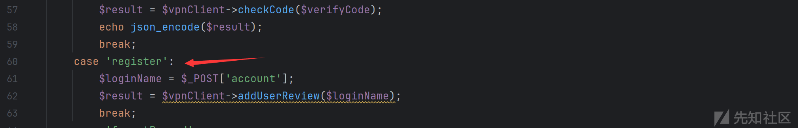

跟进adduserreview函数，发现需传入参数用户密码，邮箱等

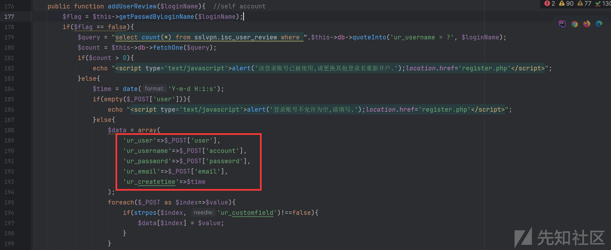

这里是可以进行添加用户，但是需要管理员审核，也想着直接登录结果失败，所以这里比较遗憾

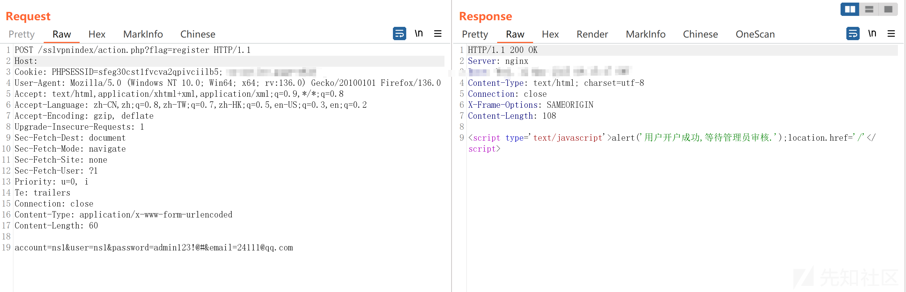

不过这里还发现href参数可以在cookie头中添加identify参数造成302跳转或者XSS，这还是第一次遇见

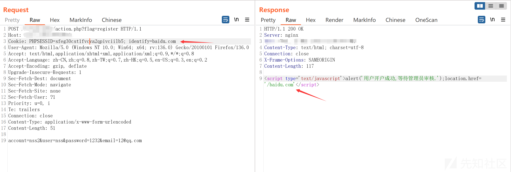

这里还存在一个有关密码的处理函数，其实代码逻辑挺简单也不复杂，主要是从SQL语句中获取用户名，并根据用户名获取密码

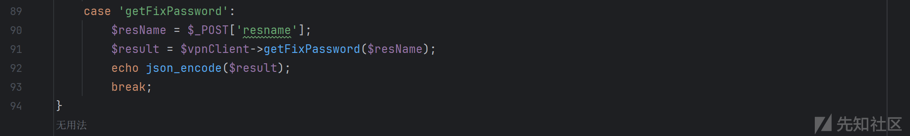

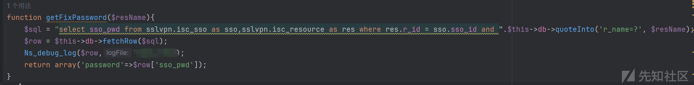

但是这里比较抽象的就是获取的密码为null，而且对用户名进行爆破也不行，也不知道是什么问题

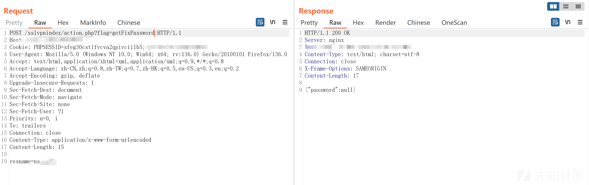

# download

这里存在文件下载，这里想着进行目录穿越读取/etc/passwd文件，但是存在basename函数只能下载指定目录下的文件，通过上述的RCE可以发现目录下还存在一些敏感文件可以进行下载，其中存在一个.txt文件，里面有一些网站请求的路径，感觉用处不大

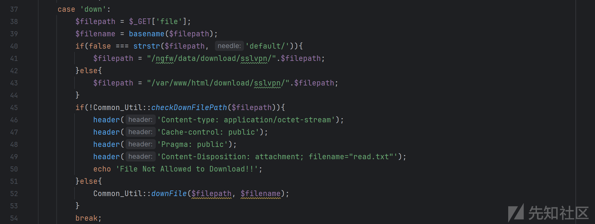


# 验证码漏洞

在搜索关键词$\_GET参数的时候，发现有一个图形验证码生成逻辑，其中可以进行对图形验证码进行伸缩扩大，类似于DDOS的效果，哈哈哈

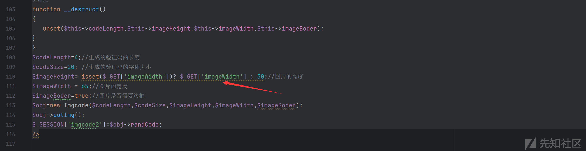


# 总结

虽然漏洞缺陷很多，但是相比较还是学习了ExtJS Direct路由请求，这中类型的路由请求是第一次在实战中遇见。
