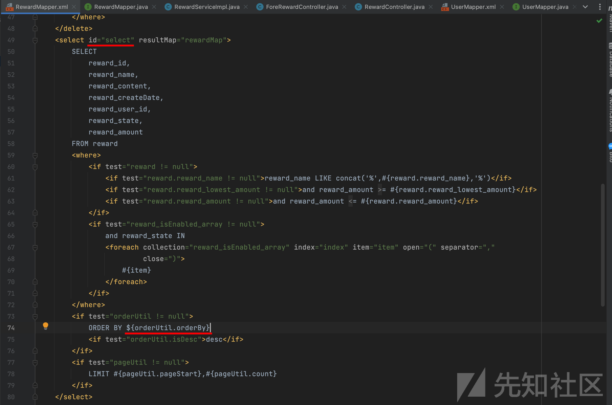
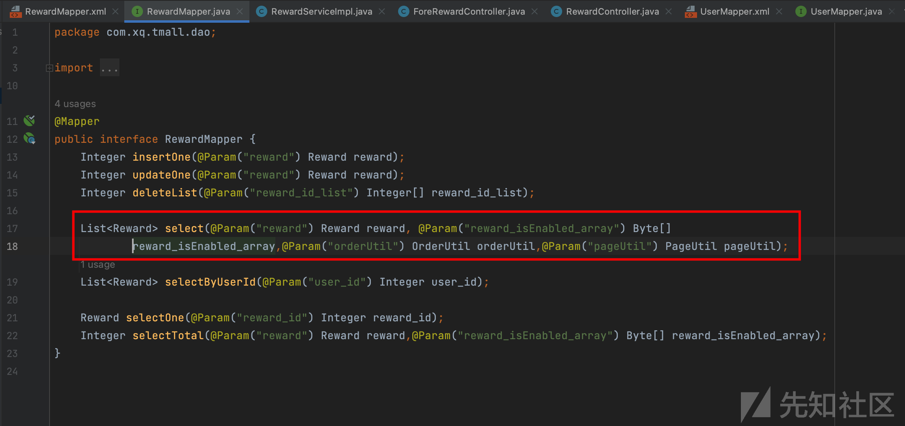
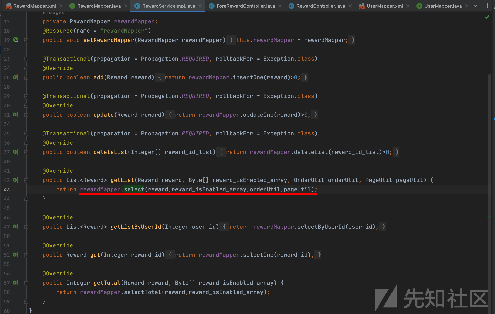
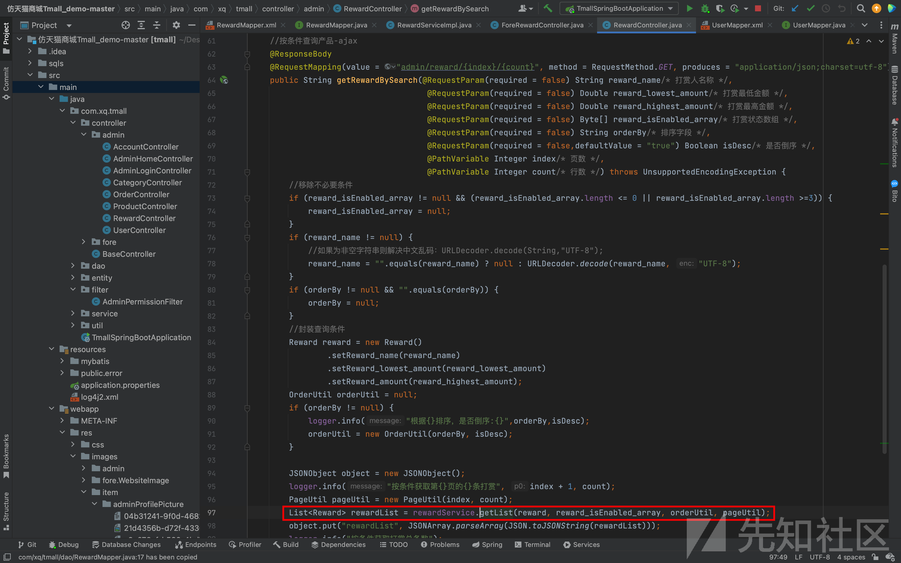
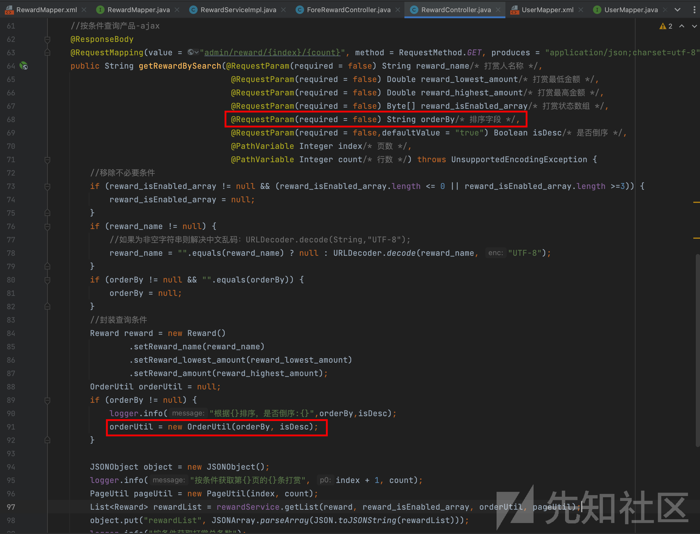
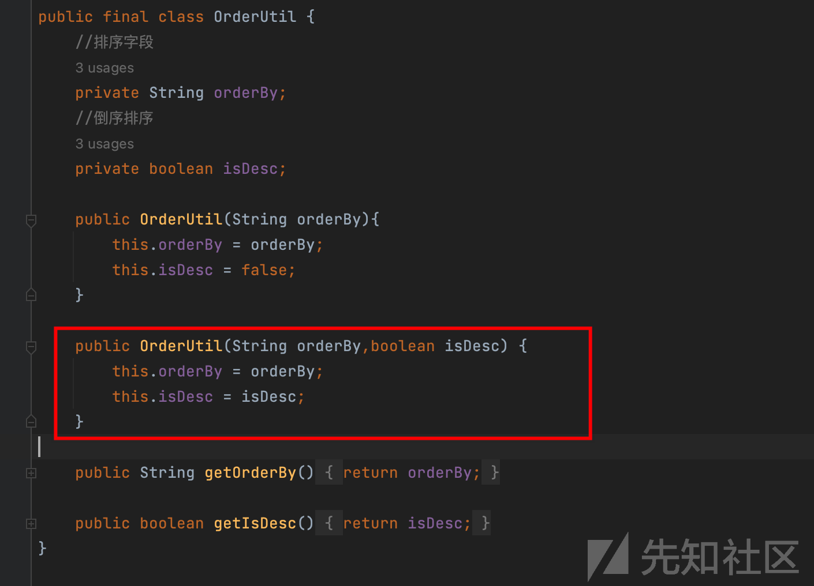
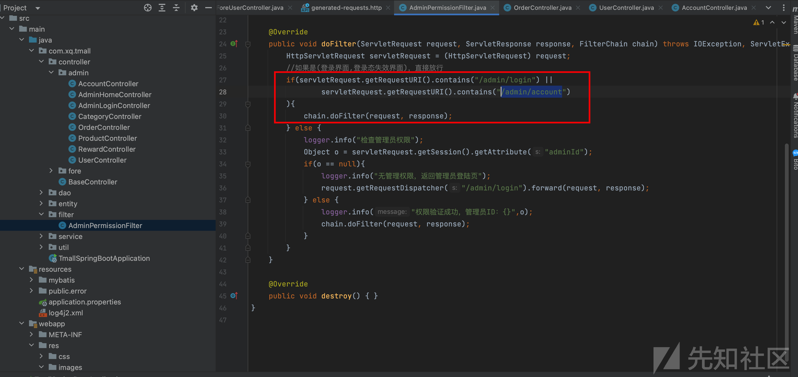
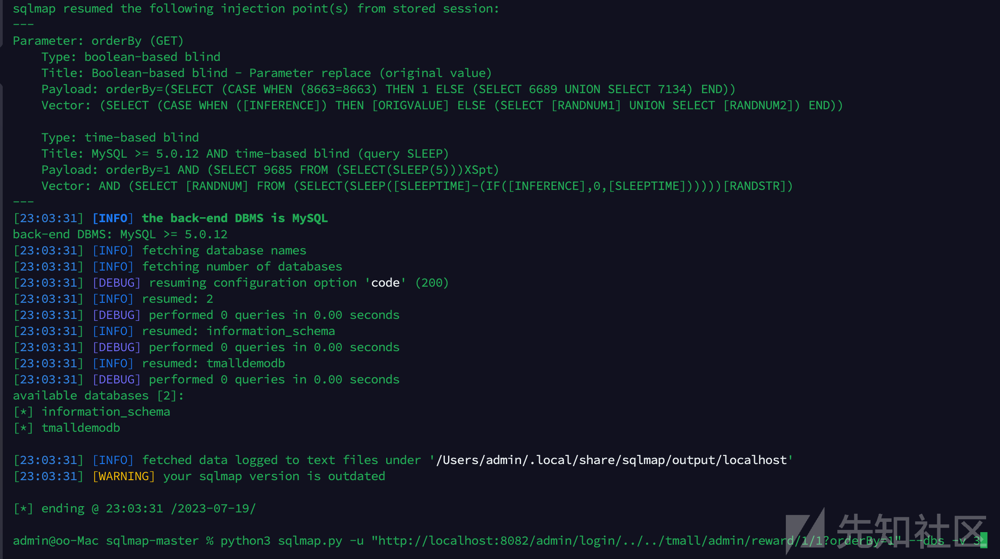

# Mini-Tmall 后台未授权reward接口SQL时间盲注漏洞分析（CVE-2024-40560）-先知社区

> **来源**: https://xz.aliyun.com/news/17302  
> **文章ID**: 17302

---

## 摘要

这里我们利用未授权的方法来绕过登陆进行SQL注入，时间盲注通常用于我们能够确定这个地方存在漏洞，但是利用报错注入不会有回显，控制台也没有打印信息的情况下使用的方法，这也考验新手小伙伴对注入原理和工具使用的熟练程度。

## 简介

Mini-Tmall 多用户电子商务商城平台，Java新零售电商系统，商城免费学习和商用。高品质私域电商商城集营销分销于一体，帮助企业低成本快速构建多店联营、O2O、社区电商、供应链等网上商城系统

## 漏洞分析

1、直接全局搜索${ 我们发现在 mybatis/mapper/RewardMapper.xml:74 使用${orderUtil.orderBy}拼接参数，那么可以确定这里是存在漏洞的，继续跟踪这个参数是否可控



2、继续跟踪RewardMapper来到 com/xq/tmall/dao/RewardMapper.java:17 路径，在这里发现select()方法的声明，可以通过给orderUtil传参控制orderUtil.orderBy，我们继续往上找看哪里调用select()方法



3、跟踪select()方法来到 com/xq/tmall/service/impl/RewardServiceImpl.java:43 可以发现这里调用rewardMapper.select()，我们继续往上找看哪里调用getList()



4、可以很清楚的看到，我们直接就来到了controller层，并在com/xq/tmall/controller/admin/RewardController.java:97 发现调用了getList()，因此只要现在我们可以通过HTTP传入对应的参数即可触发SQL注入漏洞



5、跟进OrderUtil类分析一下代码逻辑，可以看到通过orderUtil = new OrderUtil(orderBy, isDesc); 会生成我们需要的参数值orderUtil.orderBy，并且orderBy参数我们可控，于是此时我们便可以触发SQL注入漏洞





6、分析发现filter拦截器只要url里面包含/admin/login或者/admin/account，过滤器就不会拦截校验权限了，这里存在一个未授权访问漏洞，可以直接未授权访问后台所有接口



## 漏洞复现

结合filter处的未授权访问漏洞，我们可以直接未授权调用后台接口，这里就直接用工具拿结果了

```
http://localhost:8082/admin/login/../../tmall/admin/reward/1/1?orderBy=1
```

```
python3 sqlmap.py -u "http://localhost:8082/admin/login/../../tmall/admin/reward/1/1?orderBy=1" --dbs -v 3
```



​

### 

​

​
