# 某台球app sign逆向分析-先知社区

> **来源**: https://xz.aliyun.com/news/17317  
> **文章ID**: 17317

---

app：a2/lj7DnkIMzLjEuMQ==

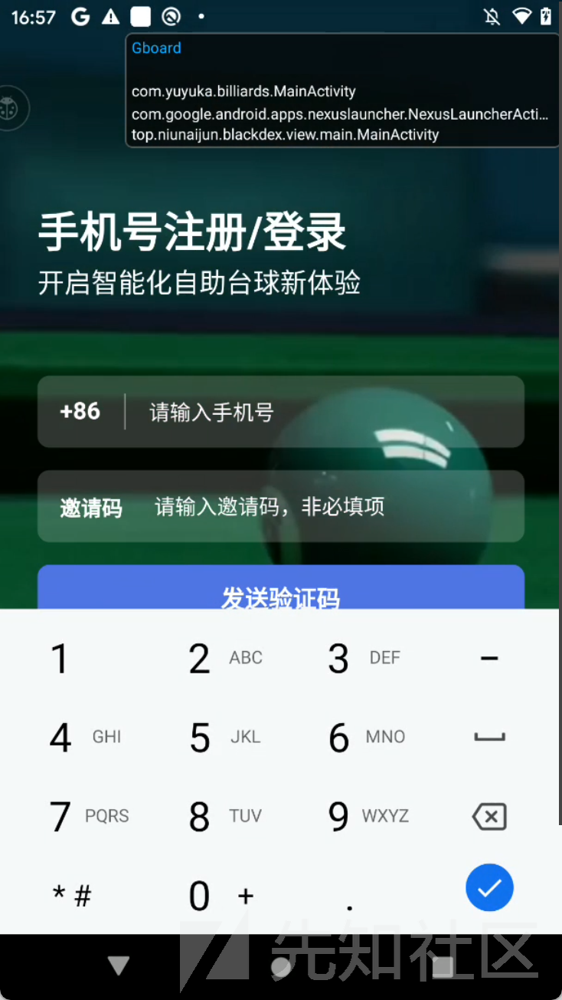

小黄鸟抓包发现了sign值

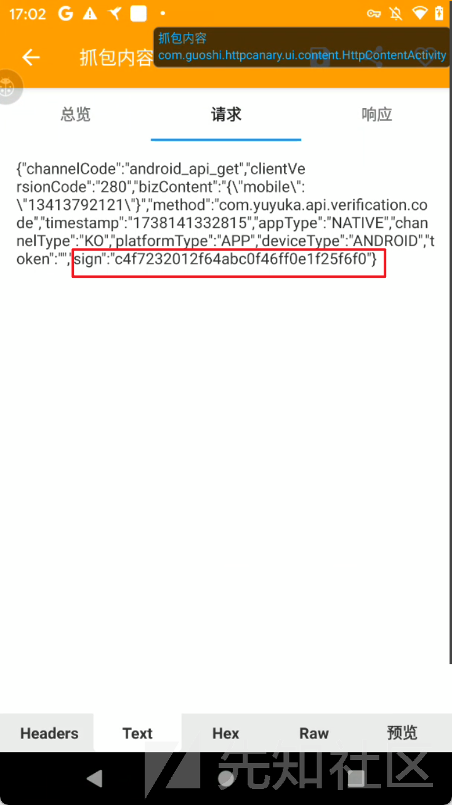

jadx直接反编译apk,发现有壳

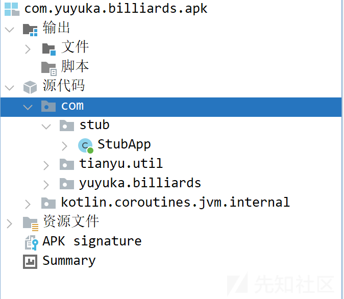

使用frida-dump脱壳

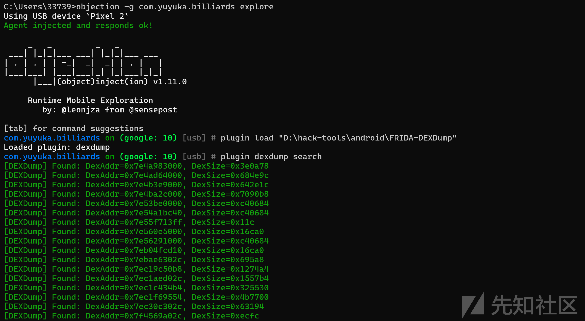

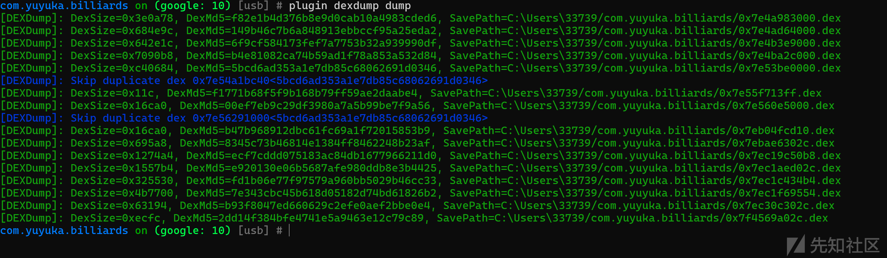

将结果拖到jadx中反编译

到入口页面发现了FlutterActivity,这是个利用flutter框架开发的app界面

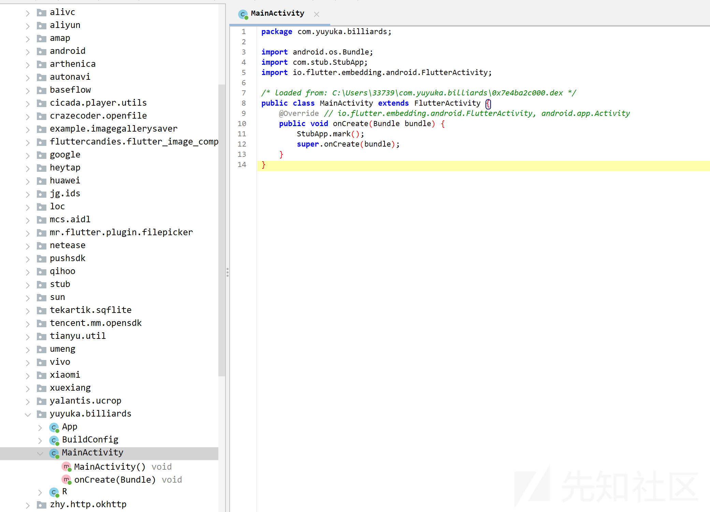

回到apk的资源文件夹lib里看看，发现了libapp.sp,libflutter.so，确认是flutter混合开发的app

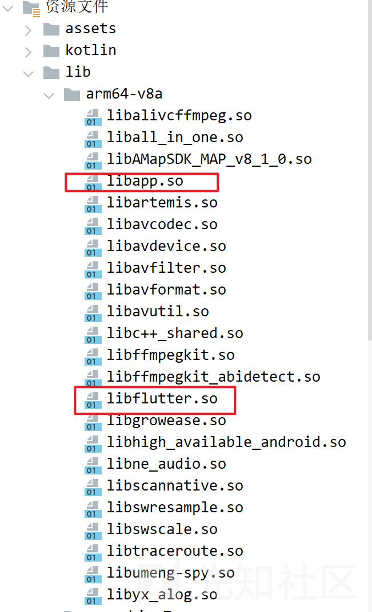

接着祭出一手blutter，它能将libapp.so中的快照数据按照既定格式进行解析，获取业务代码的类和各种信息，包括类的名称和其中方法的偏移等各种数据

<https://github.com/worawit/blutter>

​

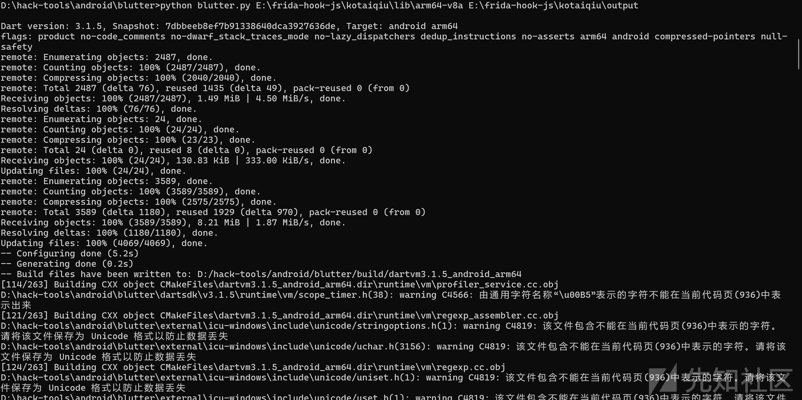

将生成的ida\_script/addNames.py导入

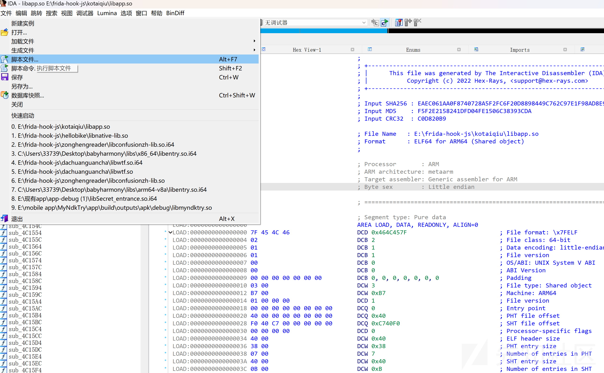

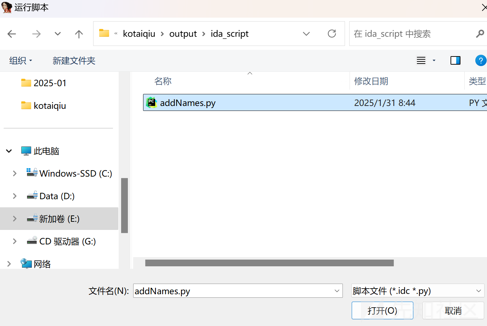

搜索关键字sign,发现了一堆函数，emmm............

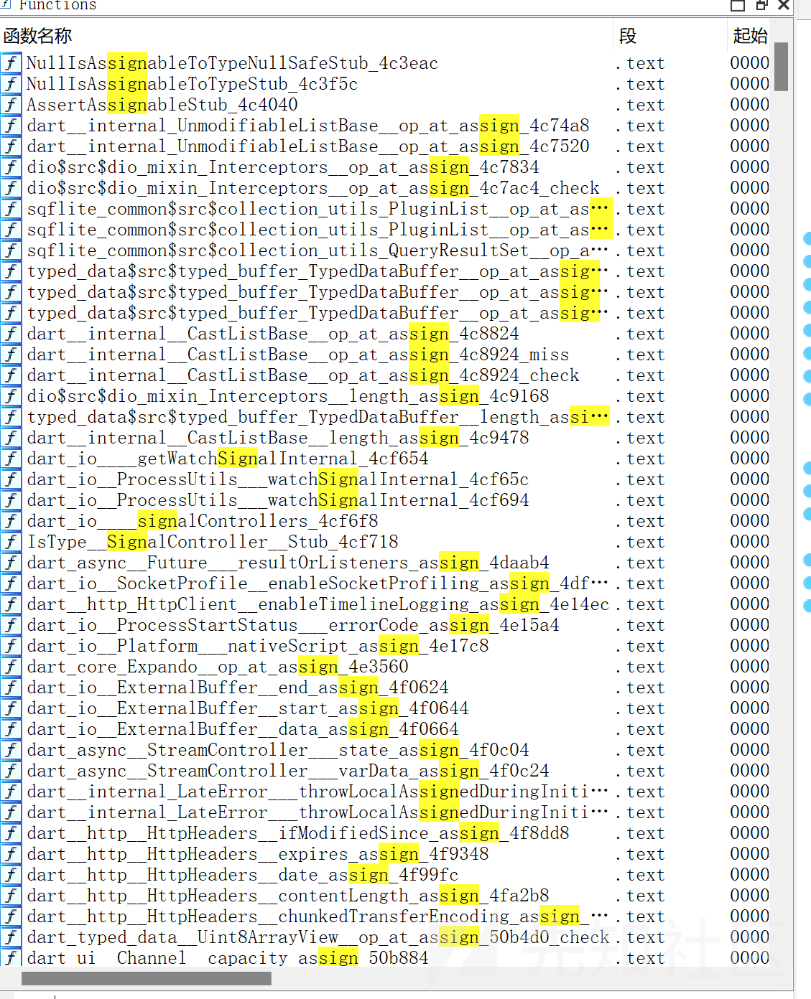

瞅着这个sign值是32位的，盲猜一手md5，搜一手MD5,搜出四个还好

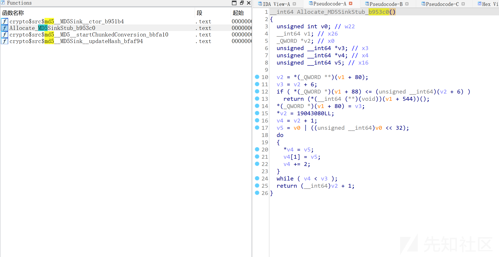

​

一个一个hook来看，hook代码就修改一下blutter生成的blutter\_frida.js就好了

增加一个dump函数，再修改一下onLibappLoaded函数，多打印几个参数，最后通过逐一hook查看结果发现Allocate\_MD5SinkStub\_b953c0是相关点

```
function dumpArgs(step, address, bufSize) {
    var buf = Memory.readByteArray(address, bufSize)
    console.log('Argument ' + step + ' address ' + address.toString() + ' ' + 'buffer: ' + bufSize.toString() + '

 Value:
' +hexdump(buf, {
        offset: 0,
        length: bufSize,
        header: false,
        ansi: false
    }));
    console.log("Trying interpret that arg is pointer")
    console.log("=====================================")
    try{
    console.log(Memory.readCString(ptr(address)));
    console.log(ptr(address).readCString());
    console.log(hexdump(ptr(address)));
    }catch(e){
        console.log(e);
    }
    console.log('')
    console.log('----------------------------------------------------')
    console.log('')
}
function onLibappLoaded() {
    // xxx("remove this line and correct the hook value");
    const fn_addr = 0xb953c0;
    Interceptor.attach(libapp.add(fn_addr), {
        onEnter: function () {
            init(this.context);
            const numArgs = 6; // 假设要打印前三个参数，可根据实际情况修改
            for (let i = 0; i < numArgs; i++) {
                let objPtr = getArg(this.context, i);
                const [tptr, cls, values] = getTaggedObjectValue(objPtr);
                console.log(`${cls.name}@${tptr.toString().slice(2)} =`, JSON.stringify(values, null, 2));
            }
        },
        onLeave: function (retval) {
            dumpArgs(0, retval, 1000);
        }
    });
}
```

​

hook对比抓包结果如下

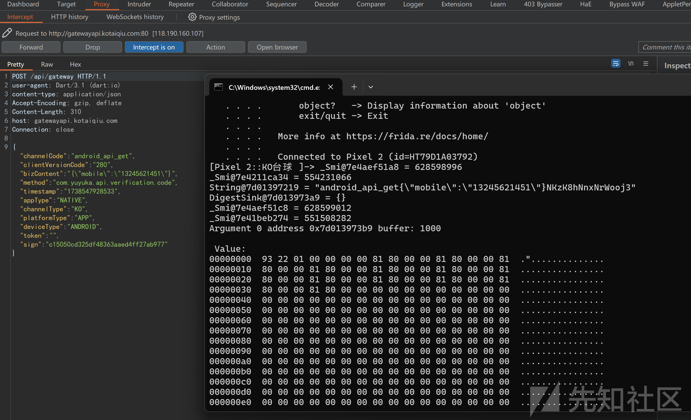

可以看到String@7d01397219 = "android\_api\_get{\"mobile\":\"13245621451\"}NKzK8hNnxNrWooj3"，将String@7d01397219的值MD5加密一下，跟sign对比发现是一样的

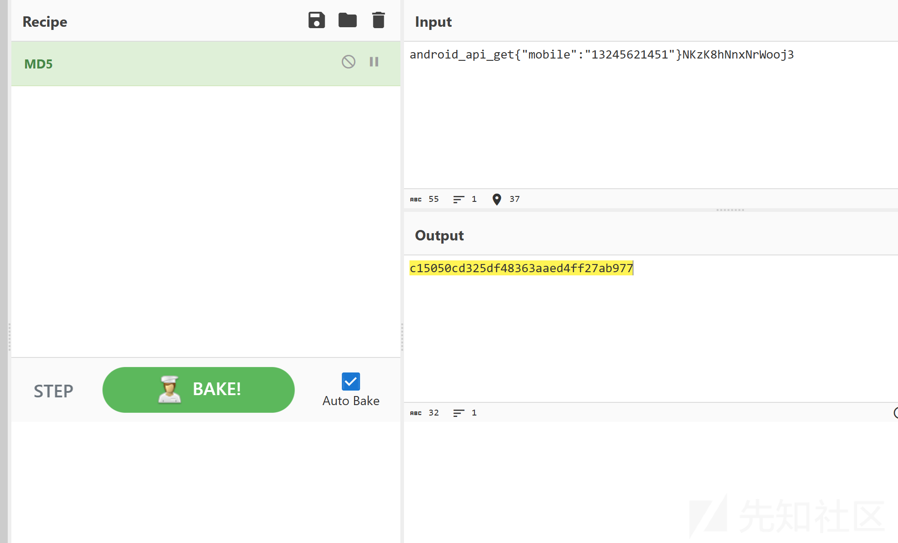

### ​

这个sign就是将"android\_api\_get"拼接参数字典和固定字符串"NKzK8hNnxNrWooj3"得到的结果取MD5值

于是分析到此完成了
