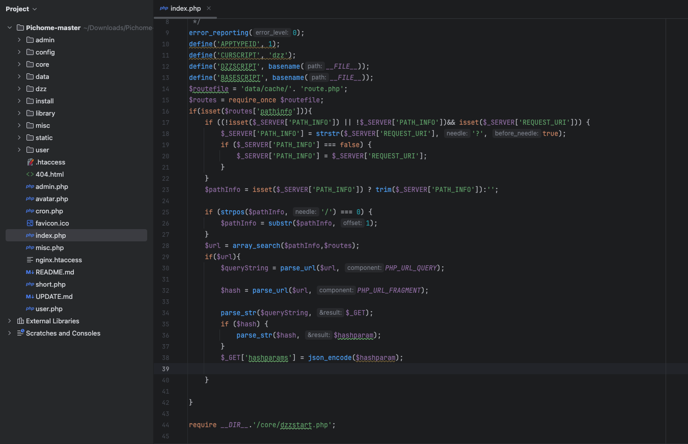
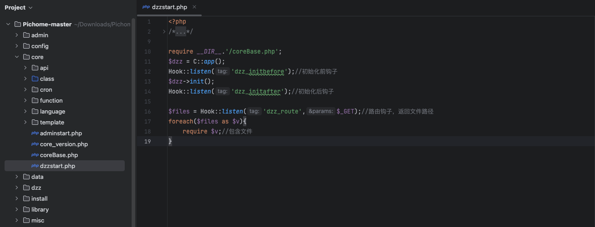
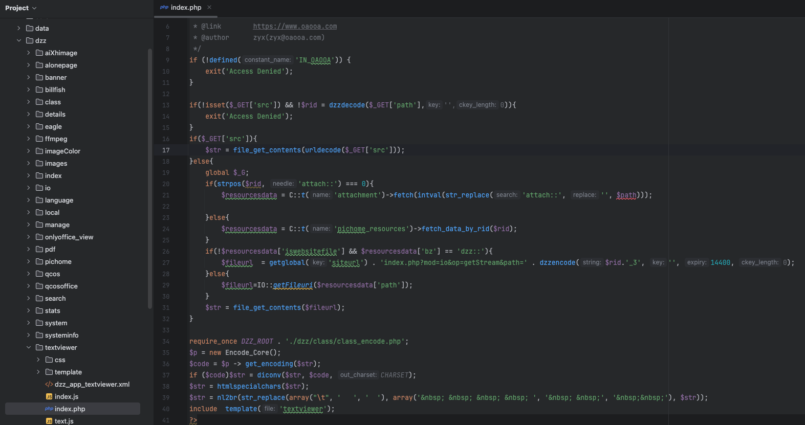
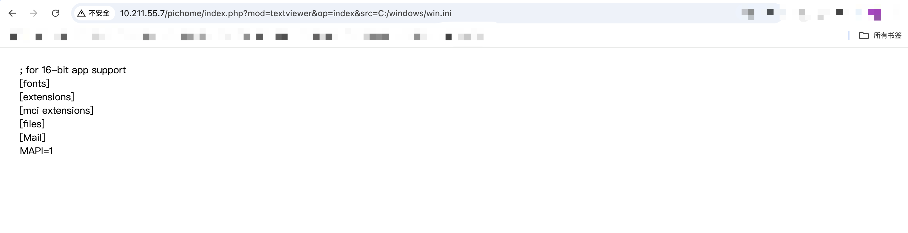

# CVE-2025-1743 漏洞代码审计分析-先知社区

> **来源**: https://xz.aliyun.com/news/17320  
> **文章ID**: 17320

---

## 一、漏洞描述

PicHome是一款功能强大的开源网盘程序，它不仅能高效管理各类文件，还在图像和媒体文件管理方面表现出色。其亮点包括强大的文件共享功能和先进的AI辅助管理工具，为用户提供了便捷、智能的文件管理体验。此系统存在前台任意文件读取漏洞。

下载地址：<https://github.com/zyx0814/Pichome>

​

## 二、路由分析

首先查看主页index.php



他这里首先是包含了/data/cache/route.php，然后if语句是查看route.php中是否存在pathinfo数组，查看了route.php,里面为空，所以直接跳到最后一行，包含了/core/dzzstart.php，跟进这个文件。



首先是包含了/coreVBase.php，然后其他的代码是一种典型的 **基于钩子（Hook）和路由的应用程序初始化流程** 的写法，常见于现代 PHP 框架或 CMS 系统中（如 Discuz!、WordPress 等）。它的核心思想是通过 **钩子机制** 和 **路由机制** 来动态加载和执行代码，从而实现灵活的扩展和模块化设计。我们现查看一下coreVBase.php。

```
define('APP_DIRNAME','dzz');//应用目录名
define('APP_CHECK_URL', "https://oaooa.com/");//检测应用更新地址
//define('APP_DIR',DZZ_ROOT.APP_DIRNAME.BS);//应用目录
define('MOULD','mod');//路由模块键名
define('DIVIDE','op');//路由操作键名
```

所以大概的路由就是index.php?mod=模块(文件名)&op=函数名

​

## 三、漏洞分析

漏洞文件在dzz/textviewer/index.php下，所以路由的话就是index.php?mod=textviewer&op=index



```
if($_GET['src']){
    $str = file_get_contents(urldecode($_GET['src']));
```

漏洞点出现在src参数，如果src参数存在，先url解码，之后使用file\_get\_contents来读取。

​

## 四、漏洞复现

/index.php?mod=textviewer&op=index&src=C:/windows/win.ini

/index.php?mod=textviewer&op=index&src=/etc/passwd


