# 对不起了系统，为了交差，我只能转走小道进行SQL注入了-先知社区

> **来源**: https://xz.aliyun.com/news/17333  
> **文章ID**: 17333

---

## 0x00 文章背景

测试时发现一个注入，可惜这个注入坏得很，基本上所有的函数都给我禁了。但事已至此，我只好换一条道路来获取内容交差，认不认再另说吧……

​

## 0x01 发现注入

本来正在苦恼于怎么一个洞都没发现，挖不出来就只能说系统安全了，但是我要滚蛋了呀。话刚说完，咦，好像发现了个注入，单引号能实现完美闭合：

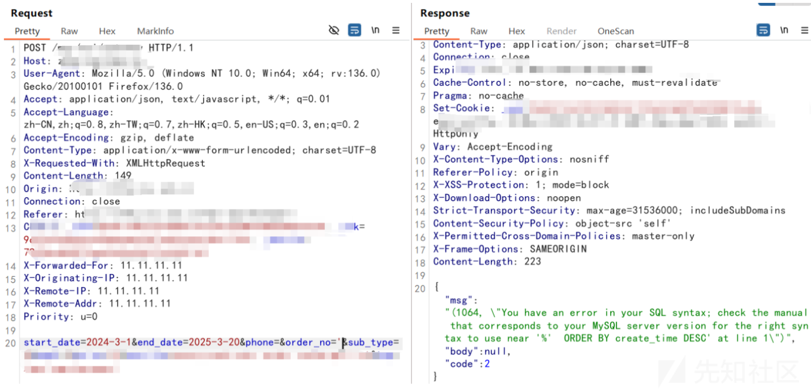

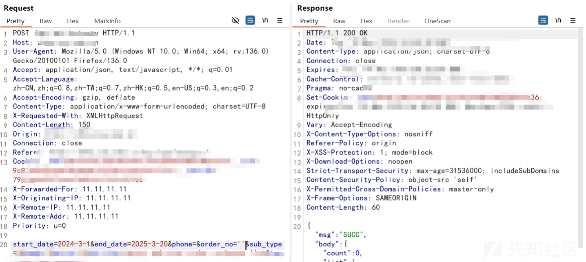

难道要舒服起来了吗？太好了，刚说完就被拦了，淦：

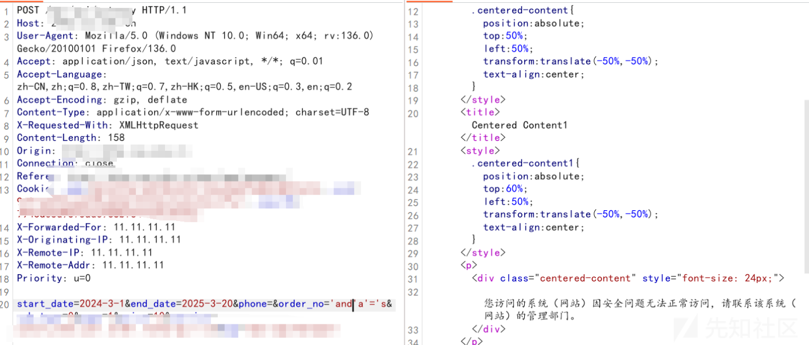

**重新构造**

不过这里是and被检测了，重新构造下语句，这不就好起来了。在这里的|| ，就是或者的意思，等同于or，因为or还有and没法使用会被拦截：`'||1/1||'`

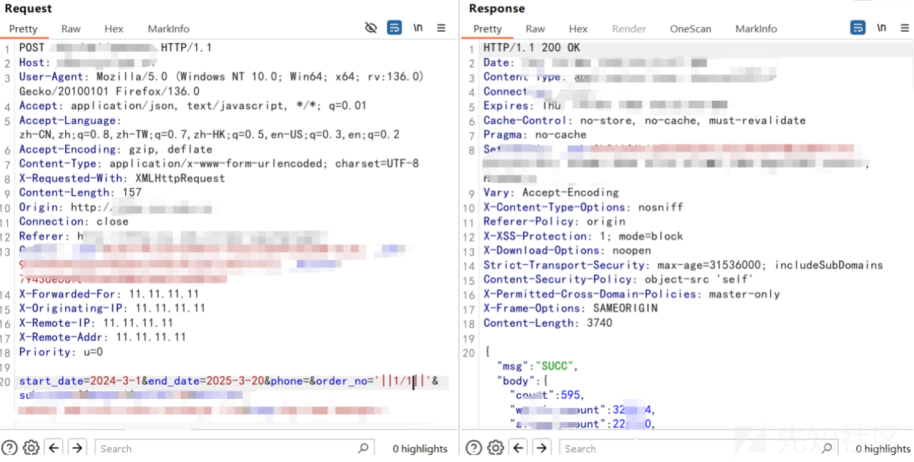

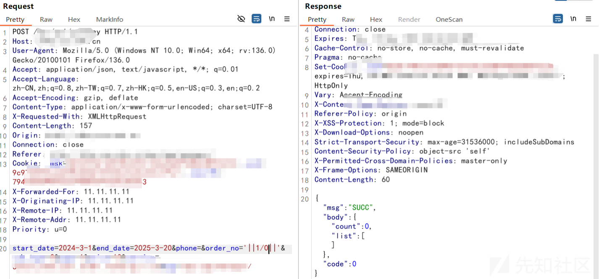

## 0x02 获取长度

基于咱们已经构造出了语句，测试判断长度的语句。这里为什么用减号不用等于号呢？问得好，因为等于号也不能用，会被拦截：

`'||1/(length(123)-3)||'`

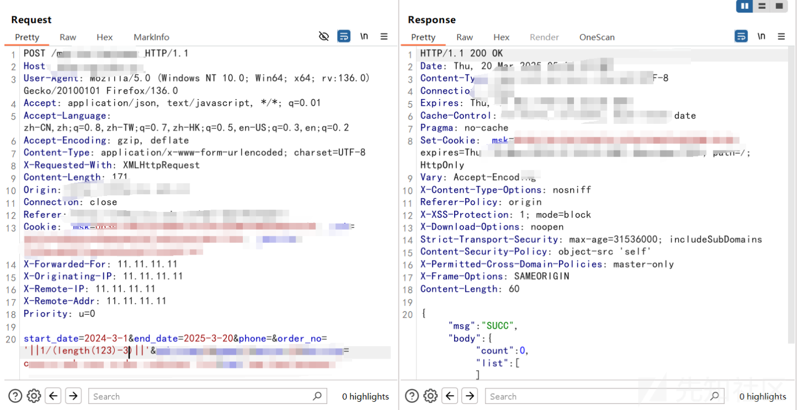

接下来来尝试获取库名之类的长度，但是啊但是，全部GG，函数全部用不了啊，完犊子啦：

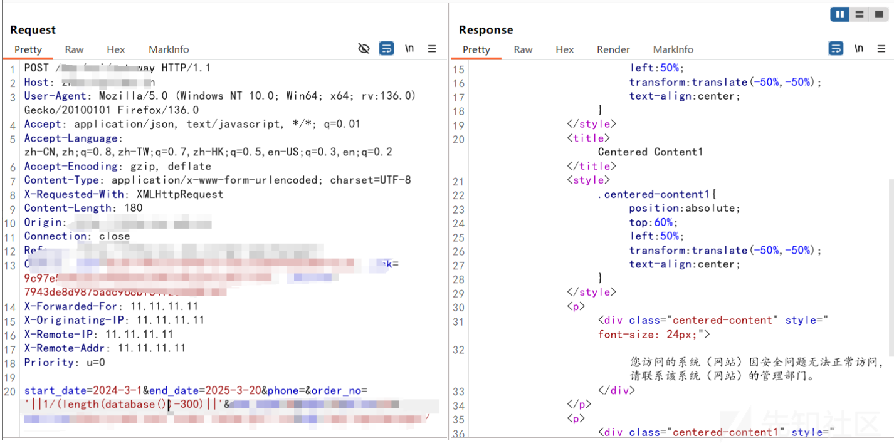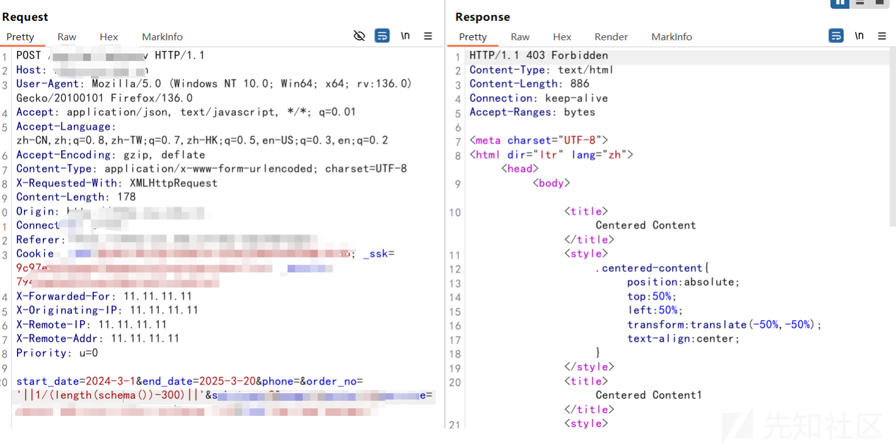

## 0x03 开辟小道

事情已经到了这一步了，是一定要想办法搞点东西出来交差的。那我只能换到小路走了，获取用户名、数据库、版本的函数全用不了的话，那我就获取你的路径：

`'||1/(length(@@datadir)-300)||'`

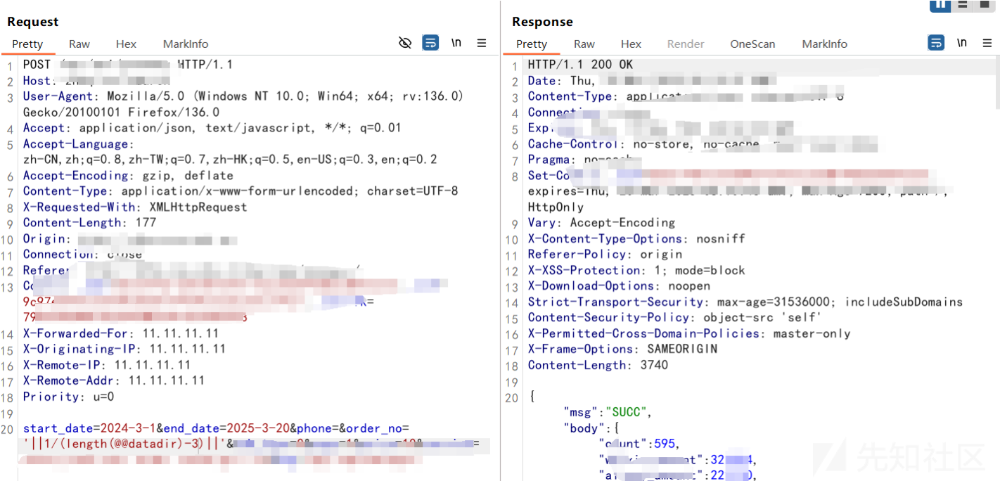

这不就有了吗，你认不认是你的事，我快要可以交差咯：

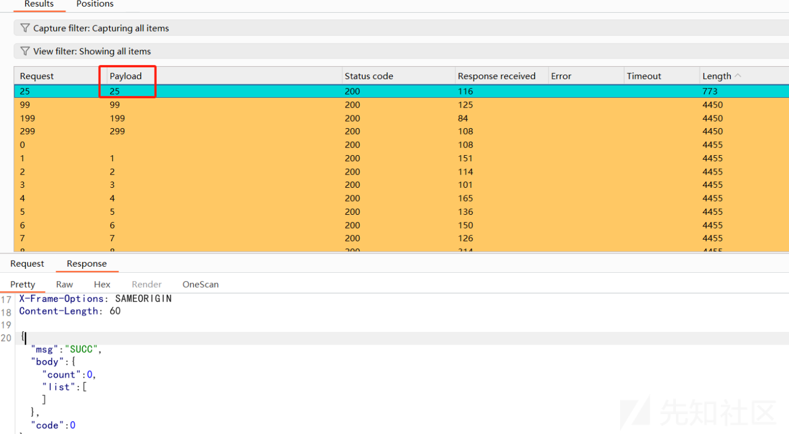

这下又坏了，但是问题不大，应该又是逗号被干掉了。我们可以用from for来代替逗号，直接没毛病：

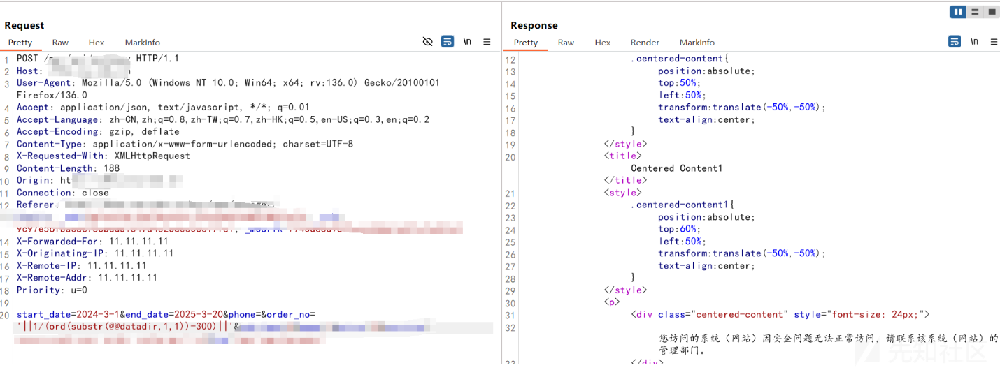

这不就好起来了，语句是这样的：

`'||1/(ord(substr(@@datadir+from+1+for+1))-300)||'`

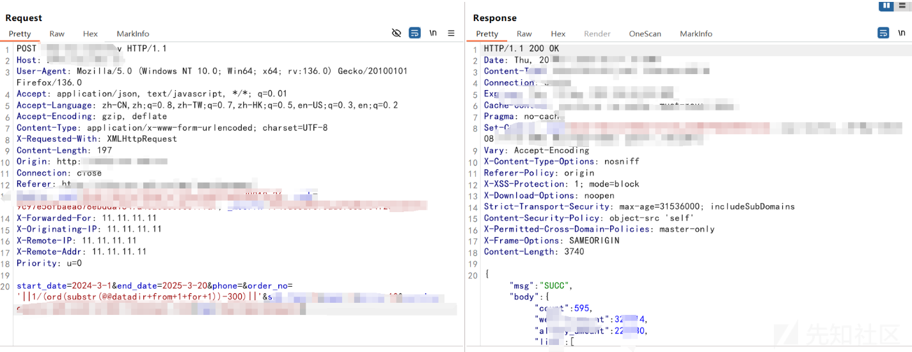

梭哈，成功爆破出路径，管你认不认我直接写：

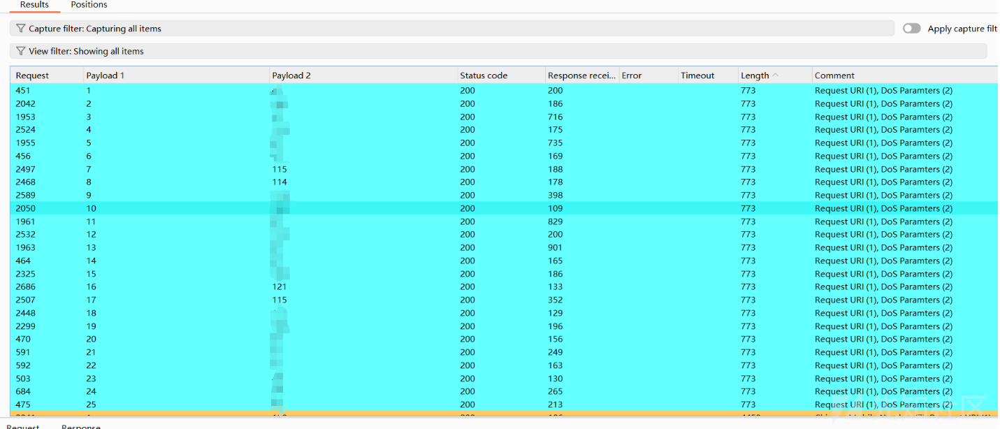

我反正是能交差了，我不管咯~
