# 某CRM代码审计(PHP)-先知社区

> **来源**: https://xz.aliyun.com/news/17334  
> **文章ID**: 17334

---

## 前提

这是我个人的审计思路拿到一份代码优先看得先看使用的是什么架构，然后大致分析每个目录大致的工作用途，然后分析路由。这里罗列一下我审的这份代码的结构也是我自己总结的。

**MVC（Model-View-Controller）架构**

* modules/：存放业务模块，可能是MVC模式中的 Controller。
* database/、data/、dataCache/：存放数据库和数据缓存相关的逻辑，属于 Model 层。

**API 设计**

* crmapi/：这个目录名称表明系统可能提供了 API接口，用于前后端交互或对接第三方系统。

**数据库支持**

* adodb/、mssql/、msAccess/、sql/、sqlparser/：表明系统可能支持 SQL数据库，并且可能使用 ADOdb 作为数据库抽象层。

**定时任务与后台管理**

* cron/：存放 定时任务，用于执行自动化脚本，如数据清理、邮件发送等。

**日志管理**

* logs/、log4php/、log4php.debug/：表明使用 log4php 进行日志管理，可能是用来监控系统运行情况的。

**插件与扩展**

* packages/、expansion/、Smarty/：这些目录用于 第三方插件 或 系统扩展，Smarty/ 说明该系统可能使用 Smarty 作为 PHP 模板引擎。

**前端功能**

* jsCalendar/、MultiDatesPicker/、My97DatePicker/：前端控件。
* kcfinder/：可能是 文件上传管理工具，允许用户上传文件。

**网站配置信息**

* 360safe/：集成了 360安全防护。
* config.db.php、config.inc.php：配置文件，可能包含数据库连接等敏感信息。

**第三方功能代码**

* CallCenter/：可能与 呼叫中心 系统集成，支持客户电话管理。
* wechatpay/、wechatSession/、WeiXinApp/：说明系统支持 微信支付 和 微信登录。

因为网站涉及的功能点很多，漏洞也挺多的所以我就举例一下比较经典的漏洞

## SSRF漏洞

payload:xxx/marketing/index.php?module=Articles&action=copyLinkToContent&userid=11&logincrm\_userid=11&publicaccount=12&url=http://xxx

WxCrawler类里面有一个file\_get\_content同时url是可控的，但是只有个return没有输出函数导致只能打ssrf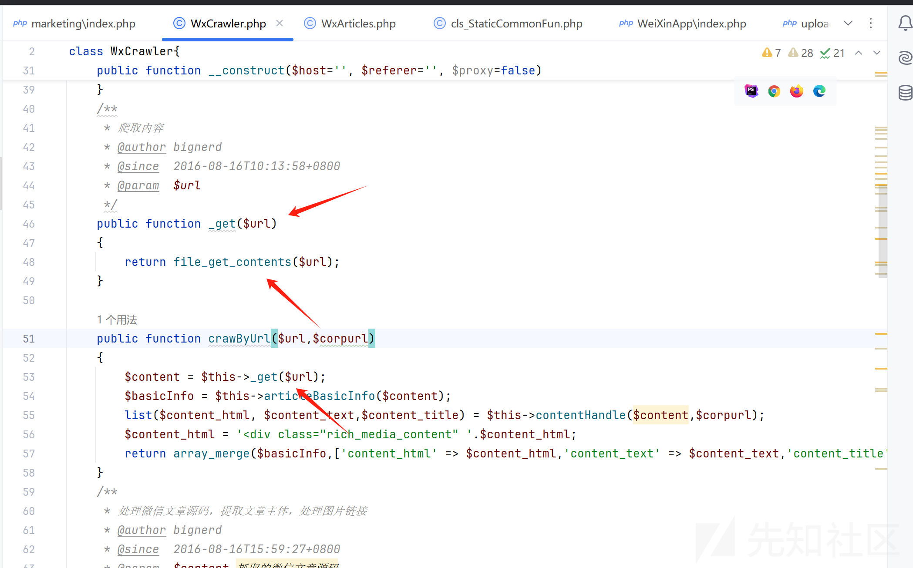因为读文件输出内容的一刻有个if检测，会强制输出退出进程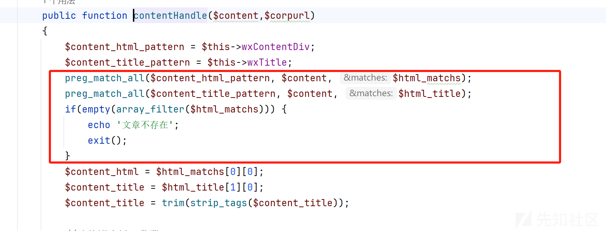然后看哪去new WxCrawler这个类了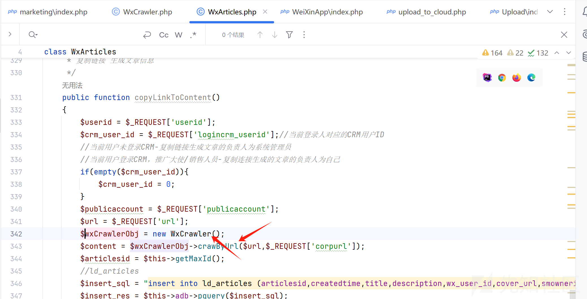再向上跟进什么地方能够new WxArticles同时去触发copy这个方法

module去触发类同时通过action去调用方法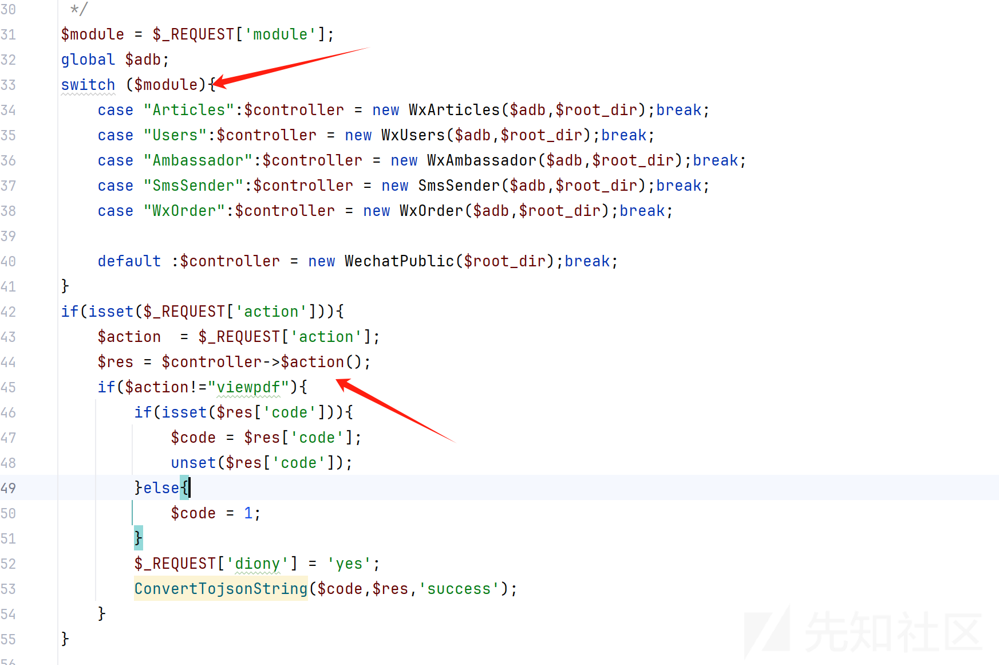可以看到dnslog是收到请求了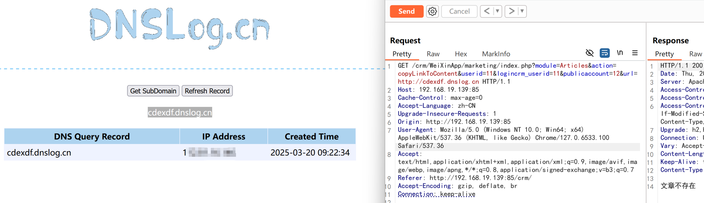SQL注入

## SQL注入漏洞

实例化WxOrder 调用里面的getOrderList方法可以看到crm\_user\_id是可控的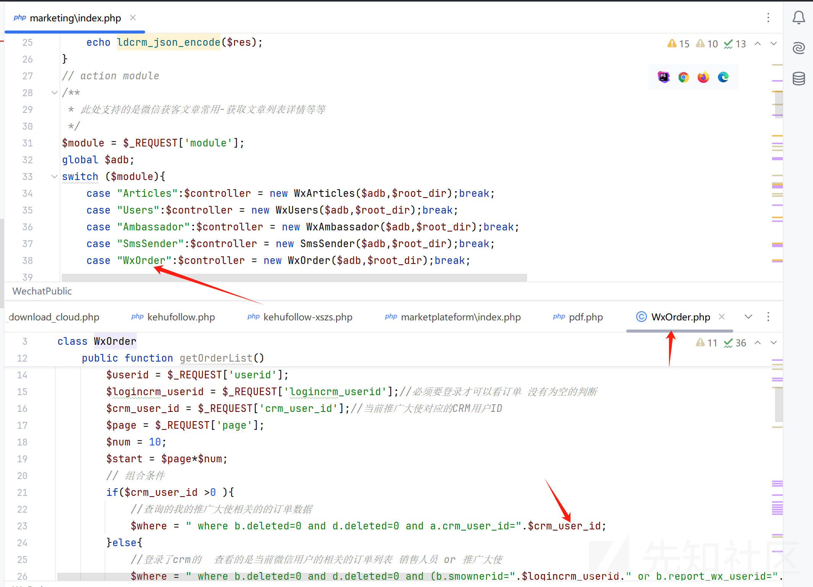同时参数是直接拼接到sql语句的，而且这个目录并没有包含360safe中的过滤代码，构造时间盲注的语法延迟4秒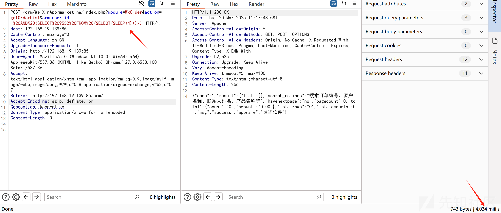

## 任意文件上传漏洞

先讲一下这个框架他内部全局变量路径的问题，如果直接去访问路径来构造上传是会导致他的静态全局变量获取为空，他没办法包含到请求的php文件然后导致报错，但是我测试下来发现只能通过先找到调用的文件一层一层提供需要的参数来构造上传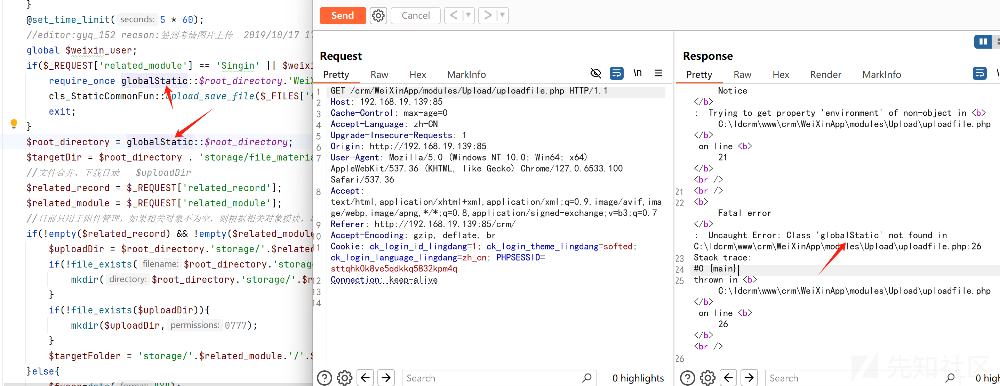

可以看到在index.php的结尾有一处include函数而且module这个参数是可控的，我们可以通过这个位置来请求到Upload目录下的uploadfile.php文件，但是要触发这个包含还得保障上面的代码不能exit，将需要的参数构造好，分别是if(empty($openid))和if(empty($\_REQUEST['usid']))这两个参数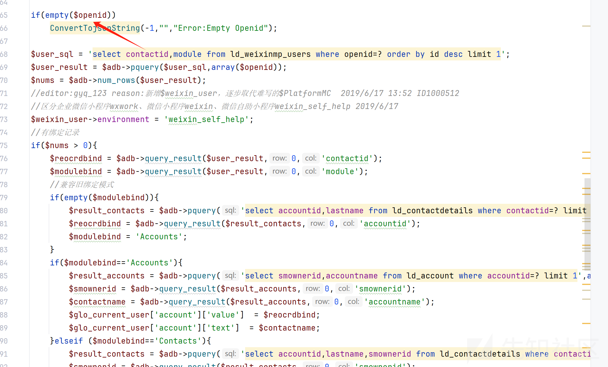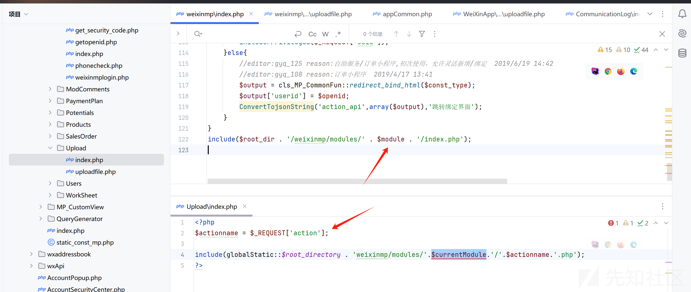而这个文件会再去包含另一个uploadfile文件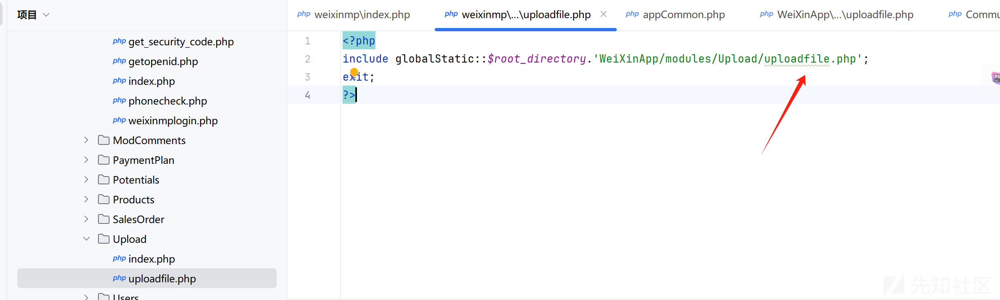继续向下看这个WeiXinApp的uploadfile，发现request一个参数如果未Signin可以去调用upload\_save\_file的方法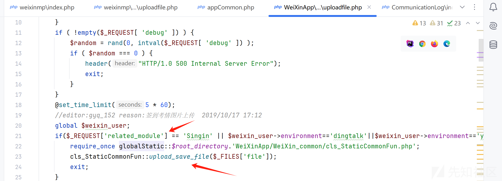里面就是去将文件的编码进行转换和拼接路径以及返回的信息，没进行任何文件的后缀过滤，但是我发现这里面的代码写都不对劲，因为它只有move\_uploaded\_file，而且本身没有创建不存在目录的权限导致的，而且它这个if带有exit;一旦执行下面的代码就不会执行了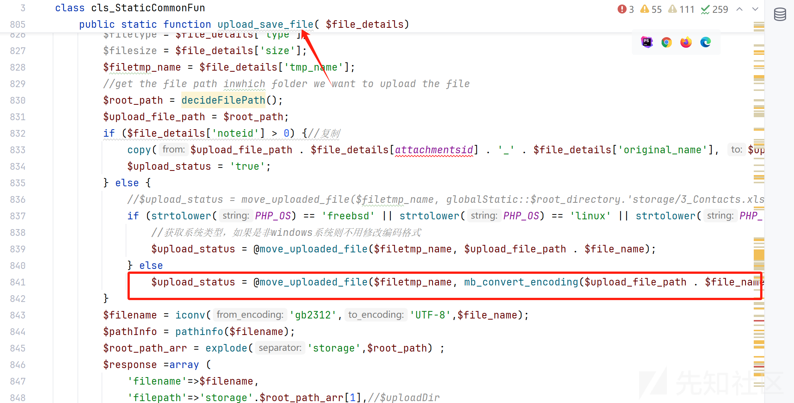我们可以测试一下这个方法中的上传，可以看到虽然有文件显示，但是upload\_status为false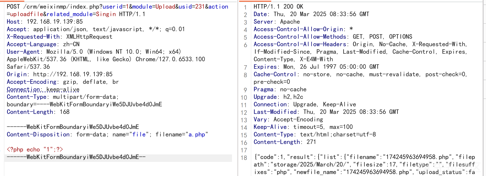看目录发现文件确实没创建出来所以继续往下分析move\_save\_file其他的代码看看有没有其他功能点可构造，可以看到file\_info通过json传入文件名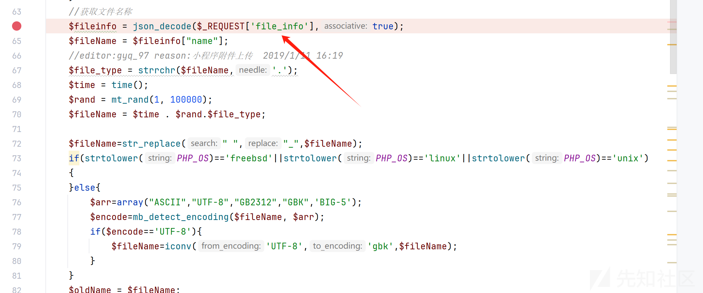然后没截到的代码处理逻辑和上面看的upload\_save\_file大差不差都是去处理文件编码问题的，但是这里有很有意思的是php://input这不就是常用的伪协议嘛，in加载post传入的数据然后通过while写入到文件中去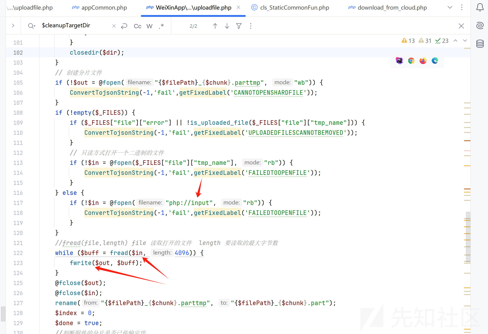那么就有意思了通过file\_info传入{name:"1.php"}的json格式 然后php://input接收木马内容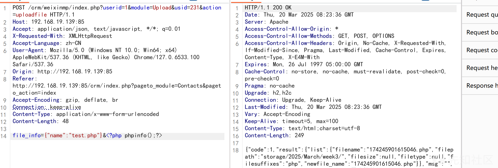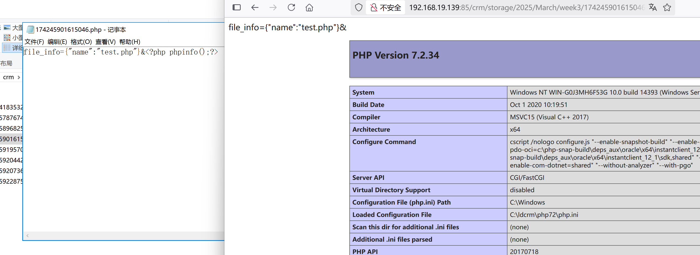

## 任意文件读取漏洞

这里的file\_get\_contents直接去读取文件内容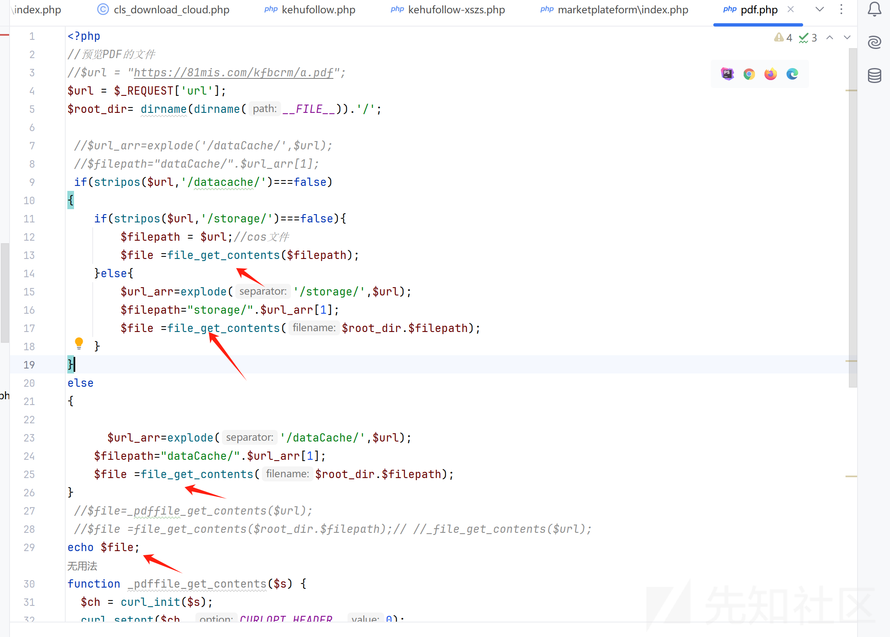

这里本地来调可以看到，直接构造路径调用第一个file\_get\_content来读文件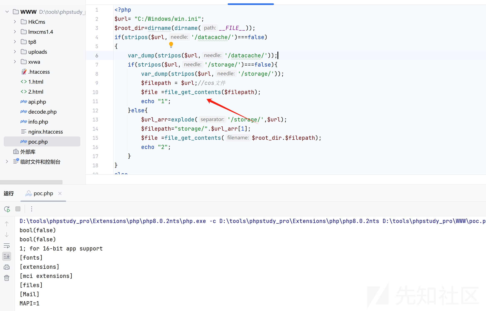

直接拼接绝对路径就可以读取到了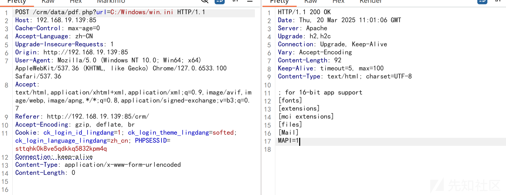
